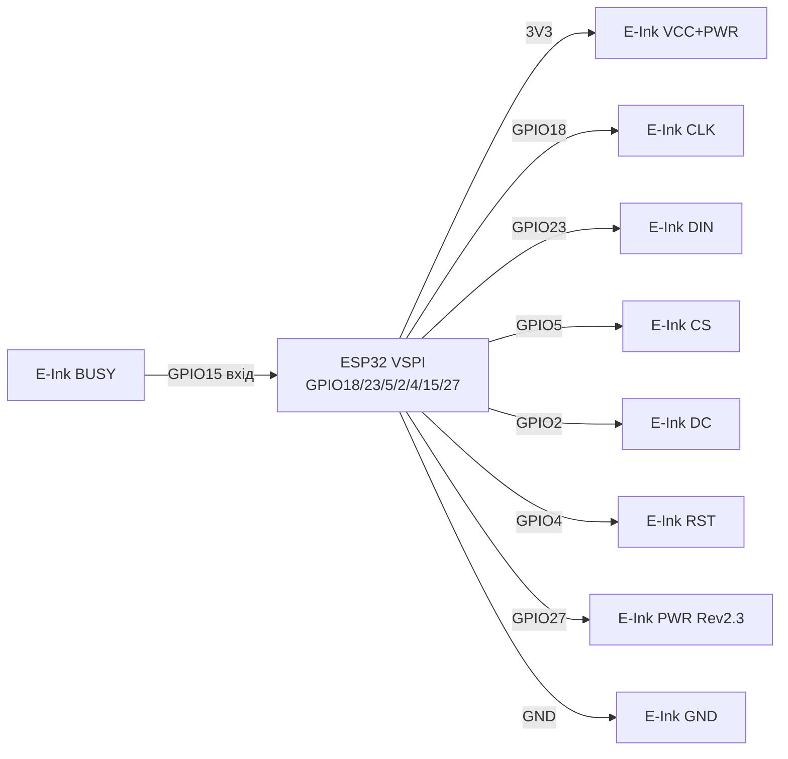

# E-Ink / E-Paper - контролери, розміри, оновлення, живлення

## Призначення

E-Ink (електрофоретичні E-Paper панелі) - дисплеї для статичної інформації:
цінники, вуличні табло, датчики погоди, бейджі, годинники, лічильники.
Картинка тримається БЕЗ живлення (бістабільність): оновив раз на годину -
і спиш у deep-sleep з мікроамперами.

Нота покриває те, що постійно плутають: контролери SSD1680 / SSD1675,
IL0373 / IL3897, UC8151 / UC8176; розміри 1.54 / 2.13 / 2.9 / 4.2 / 7.5 дюйма;
монохром (ч/б) vs 3-кольорові (ч/б/червоний або ч/б/жовтий); часткове
(partial, ~0.3 с) vs повне (full, ~2 с) оновлення і гостінг (привиди);
BUSY-пін на Waveshare / DESPI-модулях; бібліотеку GxEPD2 з прикладом;
температурні обмеження; правильний deep-sleep з відрізанням живлення панелі.

> Золоте правило E-Ink: повне оновлення - рідко (раз на хвилини/години),
> partial - для цифр/годинника, кожні 5-10 partial - одне full проти гостінгу,
> у простої - сон або повне вимкення живлення панелі.

## Характеристики

| Параметр | Значення / варіанти |
| --- | --- |
| Контролери монохром | SSD1680 (2.13/2.9 нові), SSD1675A/B (2.13), UC8151 / IL0373 (1.54/2.13/2.9), UC8176 / IL0398 (4.2), EK79655 / UC8179 (7.5) |
| Контролери 3-кольорові | SSD1681 (1.54 BWR), SSD1680 (2.13/2.66 BWR), UC8151D (2.9 BWR), UC8176 (4.2 BWR), EK79655 (7.5 BWR) |
| Розміри популярні | 1.54″ 200×200; 2.13″ 122×250 (або 104×212); 2.9″ 128×296; 4.2″ 400×300; 7.5″ 640×384 або 800×480 |
| Кольори | Моно B/W (швидші, дешевші) vs B/W/R або B/W/Y (3-кольорові: повне оновлення 8-25 с!) |
| Інтерфейс | SPI 4-wire: SCK / MOSI / CS / DC + RST + BUSY (+ PWR на нових HAT Rev 2.3) |
| Живлення панелі | 3.3 В логіка І живлення (ніколи 5 В на data без level-shifter!); струм піком 20-100 мА під час refresh |
| Full refresh | ~2 с (моно малі), ~3-5 с (4.2), ~4-6 с (7.5 моно), 8-27 с (3-кольорові) |
| Partial refresh | ~0.3-0.8 с (тільки моно і тільки де підтримує OTP/waveform!) |
| Ресурс | ~1 000 000 оновлень ідеально; на практиці - берегти від сонця і морозу |
| Температура робоча | 0…+40 °C (моно), +15…+35 °C (кольорові 7-кольорові); зберігання до +30 °C |
| Бібліотека | GxEPD2 (Arduino) + Adafruit_GFX; ESP-IDF - порт/приклад Waveshare або calepd |
| Утримання картинки | Роки без живлення (теоретично), рекомендовано оновлювати 3-кольорові раз на 24 год |

### Контролери - що за чим стоїть

| Маркування | Сімейство | Де зустрічається | Нотатка |
| --- | --- | --- | --- |
| SSD1680 | Solomon SSD | 2.13″ / 2.66″ / 2.9″ нові (GDEM0213B74, GDEY0213B74) | Швидкий full, є fast partial у GxEPD2 |
| SSD1675A/B | Solomon SSD | 2.13″ GDEH0213B72/B73 (заміна IL3895) | Перевіряти ревізію B73 vs B72 - різні класи GxEPD2! |
| IL0373 | Solomon-сумісний | UC8151-сумісні 1.54/2.13/2.9 (GDEW0154T8, GDEW0213T5D) | Стара класика, partial диференціальний |
| IL3897 | Solomon-сумісний | Старі 2.13″ GDE0213B1 (зняті) | У нових поставках - SSD1675, код інший! |
| UC8151 / UC8151D | UltraChip | 1.54/2.13/2.6/2.9 моно і BWR (Z10/Z13/Z19) | D-ревізія - інший waveform, дивитись клас GxEPD2 |
| UC8176 / IL0398 | UltraChip | 4.2″ GDEW042T2 (моно) / GDEW042Z15 (BWR) | 4.2″ хоче сильне живлення, довгі дроти - зло |
| UC8159c / EK79655 | Великі | 7.5″ GDEW075T8/Z09, GDEW075T7/Z08 | Не живити від піна 3V3 Arduino - тільки окремий стаб! |

### Розміри - роздільність і класи GxEPD2

| Діагональ | Роздільність | Приклад панелі | Клас GxEPD2 (орієнтир) |
| --- | --- | --- | --- |
| 1.54″ | 200×200 | GDEY0154D67 (SSD1681), GDEW0154Z04 (BWR) | `GxEPD2_154_D67`, `GxEPD2_154_Z90c` |
| 2.13″ | 122×250 | GDEH0213B73 (SSD1675B), DEPG0213BN (SSD1680) | `GxEPD2_213_B73`, `GxEPD2_213_BN` |
| 2.13″ | 104×212 | GDEW0213T5D (UC8151) | `GxEPD2_213_T5D` |
| 2.9″ | 128×296 | GDEM029T94 / GDEY029T94 (SSD1680) | `GxEPD2_290_T94` (+ `_V2` для Waveshare V2!) |
| 4.2″ | 400×300 | GDEW042T2 (UC8176) | `GxEPD2_420` |
| 7.5″ | 640×384 / 800×480 | GDEW075T8 / GDEW075T7 | `GxEPD2_750_T7`, `GxEPD2_750c_Z08` |

> Waveshare V2-плати 2.9″ (GDEM029T94 без partial-waveform в OTP) потребують
> класу `GxEPD2_290_T94_V2` з waveform у регістрах - зі звичайним класом
> partial не працює або бруднить!

### Моно vs 3-кольорові

- **Моно (B/W):** 1 біт/піксель, full ~2 с, partial ~0.3 с можливий,
  годинник/датчик - ідеально. Буфер: 2.13″ = 122×250/8 ≈ 3.8 кБ.
- **3-кольорові (B/W/R, B/W/Y):** два проходи (чорний + червоний),
  full 8-27 с, partial або немає, або тільки швидкий ч/б режим
  (`drawFastBlackWhite` для GDEW0213Z19/Z13 - до 100 циклів, потім full!).
- **4-кольорові / 7-кольорові (Spectra/ACEP):** красиво, але 12-30 с
  і тільки full; для ESP32 - через paging (мало RAM).

### Partial refresh vs full - час і гостінг

| Режим | Час | Як виглядає | Коли використовувати |
| --- | --- | --- | --- |
| Full | ~2 с (моно), до 27 с (B/W/Y) | Блимає чорне↔біле кілька разів (чистить привиди) | Старт, кожен N-й кадр, зміна сцени |
| Partial (differential) | ~0.3-0.8 с | Без блимання, оновлює вікно | Цифри годинника, температура, лічильник |
| Fast B/W на 3-кольоровій | ~1-2 с | Ч/б без червоного шару | Тимчасові дані на BWR-панелі |

Правила проти гостінгу:

1. Кожні 5-10 partial - один full (`display(false)` / `displayWindow` → `display`).
2. Інтервал між оновленнями - не частіше ~180 с для full (рекомендація Waveshare).
3. 3-кольорову не тримати місяць на одній картинці - оновлювати раз на 24 год.
4. Після deep-sleep wakeup - спочатку `init` + clear, потім малювати.

### Температура і оновлення

- Нижче 0 °C електрофорез гальмує: блідий друк, привиди, можливе пошкодження.
- DES-панелі (Wide-Temp, напр. GDEW0213M21) тримають ширший діапазон -
  для вулиці брати саме DES.
- Fast partial при холоді - вимкнути (`hasFastPartialUpdate = false` у GxEPD2).
- На спеці - не залишати під прямим сонцем: чорнила сохнуть необоротно;
  білий скотч/UV-фільтр + тінь обов'язкові для вуличних табло.

## Легенда пінів модуля

Типовий Waveshare HAT / DESPI-C02 (8-9 пінів, SPI):

| Пін модуля | Позначення | Тип | Куди на ESP32 | Примітка |
| --- | --- | --- | --- | --- |
| 1 | VCC | Живлення | 3V3 (стабільні!) | 2.3-3.6 В; 7.5″ - окремий БЖ, не пін плати! |
| 2 | GND | Земля | GND | Спільна земля + 100 нФ біля модуля |
| 3 | DIN (MOSI) | Вхід SPI | GPIO23 (VSPI MOSI) | Дані в панель |
| 4 | CLK (SCK) | Вхід SPI | GPIO18 (VSPI SCK) | 2-10 МГц (не гнати 40 МГц як TFT!) |
| 5 | CS | Вхід CS | GPIO5 | Chip-select панелі |
| 6 | DC | Вхід D/C | GPIO2 | Дані vs команда |
| 7 | RST | Вхід reset | GPIO4 | Скидання; на платах з clever-reset - короткий імпульс 2-10 мс! |
| 8 | BUSY | Вихід busy | GPIO15 (вхід!) | HIGH = зайнята (на деяких - інверсія, дивитись wiki плати!) |
| 9 | PWR | Живлення-ключ | GPIO27 або VCC (Rev 2.3!) | На Driver HAT Rev 2.3 без HIGH на PWR панель мовчить! |

Пояснення:

- **BUSY - найважливіший пін E-Ink.** Без нього бібліотека або висить
  у `waitWhileBusy`, або рве кадр на півдорозі. Завжди підключати!
  Логіка: у Waveshare - HIGH під час refresh; код чекає `while(digitalRead(BUSY))`.
- **PWR (Rev 2.3):** новий пін керування живленням панелі. Варіанти:
  з'єднати з VCC (завжди увімкнено) або керувати з GPIO для deep-sleep.
  Старі приклади без PWR на новій платі - чорний екран!
- **Clever-reset:** на нових Waveshare - RC-ланцюг, довгий LOW вимикає
  живлення драйвера. Лікується `init(115200, true, 2, false)` (reset 2 мс)
  або pull-up 1 кОм на RST.
- **DESPI-модулі Good Display:** розпиновка та сама, але роз'єм FPC 24-pin;
  шлейф довше 20 см - втрата даних, зменшити SPI до 2 МГц.

## Схема підключення

| ESP32 | E-Ink HAT / DESPI | Примітка |
| --- | --- | --- |
| 3V3 | VCC (+ PWR → 3V3, якщо без керування) | Тільки 3.3 В! |
| GND | GND | Спільна земля |
| GPIO18 | CLK | VSPI SCK, 4 МГц старт |
| GPIO23 | DIN | VSPI MOSI |
| GPIO5 | CS | CS панелі |
| GPIO2 | DC | Data/Command |
| GPIO4 | RST | Reset, короткий імпульс на clever-платах |
| GPIO15 | BUSY | Вхід, чекати завершення refresh |
| GPIO27 | PWR (Rev 2.3) | HIGH = живлення панелі увімкнено |
| 5V (опційно) | - | Не подавати на панель! Тільки через level-shifter плати |

### ASCII-схема

```text
ESP32 DevKit (VSPI)          Waveshare / DESPI E-Paper (SPI)
-------------------          --------------------------------
3V3 ───────────────────────► VCC (тільки 3.3 В!)
GND ───────────────────────► GND
GPIO18 ────────────────────► CLK / SCK (4 МГц, не 40!)
GPIO23 ────────────────────► DIN / MOSI
GPIO5 ─────────────────────► CS
GPIO2 ─────────────────────► DC (Data/Command)
GPIO4 ─────────────────────► RST (2-10 мс на clever-reset платах!)
GPIO15 (ВХІД!) ◄──────────── BUSY (HIGH = зайнята, чекати!)
GPIO27 ────────────────────► PWR (Rev 2.3: HIGH або до VCC)
VCC ◄──[100 нФ]──► GND біля модуля; шлейф FPC < 20 см
PWR через MOSFET/аналоговий ключ — для deep-sleep (див. код нижче)
```

### Mermaid



![[assets/img/eink-controllers-scheme.png|600]]
*Рис. E-Ink HAT: VSPI + DC/RST/BUSY/PWR, живлення 3V3, SPI 2-4 МГц. Місце під схему - див. [[assets/README]].*

## Код ESP-IDF

ESP-IDF без Arduino: через компонент `calepd` або приклад Waveshare.
Мінімум - SPI + BUSY-wait + deep-sleep:

```c
#include "driver/spi_master.h"
#include "driver/gpio.h"
#include "esp_sleep.h"
#include "esp_timer.h"

#define PIN_CS 5
#define PIN_DC 2
#define PIN_RST 4
#define PIN_BUSY 15
#define PIN_PWR 27

static spi_device_handle_t epd;

static void epd_wait_busy(void) {
    // Waveshare: HIGH = зайнята
    while (gpio_get_level(PIN_BUSY) == 1) {
        vTaskDelay(pdMS_TO_TICKS(50));
    }
}

static void epd_cmd(uint8_t c) {
    gpio_set_level(PIN_DC, 0);
    spi_transaction_t t = { .length = 8, .tx_data = {c}, .flags = SPI_TRANS_USE_TXDATA };
    spi_device_transmit(epd, &t);
}

static void epd_data(uint8_t d) {
    gpio_set_level(PIN_DC, 1);
    spi_transaction_t t = { .length = 8, .tx_data = {d}, .flags = SPI_TRANS_USE_TXDATA };
    spi_device_transmit(epd, &t);
}

void app_main(void) {
    gpio_set_direction(PIN_PWR, GPIO_MODE_OUTPUT);
    gpio_set_level(PIN_PWR, 1); // увімкнути живлення панелі (Rev 2.3)
    gpio_set_direction(PIN_DC, GPIO_MODE_OUTPUT);
    gpio_set_direction(PIN_RST, GPIO_MODE_OUTPUT);
    gpio_set_direction(PIN_BUSY, GPIO_MODE_INPUT);

    // RST: короткий імпульс для clever-reset плат
    gpio_set_level(PIN_RST, 0); vTaskDelay(pdMS_TO_TICKS(2));
    gpio_set_level(PIN_RST, 1); vTaskDelay(pdMS_TO_TICKS(10));

    spi_bus_config_t bus = {
        .mosi_io_num = 23, .miso_io_num = -1, .sclk_io_num = 18,
        .max_transfer_sz = 4096,
    };
    spi_bus_initialize(SPI2_HOST, &bus, SPI_DMA_CH_AUTO);
    spi_device_interface_config_t dev = {
        .clock_speed_hz = 4 * 1000 * 1000, // НЕ гнати 40 МГц!
        .mode = 0, .spics_io_num = PIN_CS, .queue_size = 4,
    };
    spi_device_add_to_bus(SPI2_HOST, &dev, &epd);

    // ... init панелі за даташитом контролера (SSD1680/UC8151) ...
    // ... передати буфер, потім:
    // epd_cmd(0x22); epd_data(0xF7); epd_cmd(0x20); epd_wait_busy();

    // Спати: панель у deep-sleep (команда 0x10 + 0x01), потім PWR LOW
    // epd_cmd(0x10); epd_data(0x01); vTaskDelay(pdMS_TO_TICKS(100));
    gpio_set_level(PIN_PWR, 0); // ВІДРІЗАТИ живлення панелі!
    esp_sleep_enable_timer_wakeup(3600ULL * 1000000ULL); // раз на годину
    esp_deep_sleep_start();
}
```

## Код Arduino - GxEPD2

```cpp
#include <GxEPD2_BW.h>
// 2.13″ моно SSD1680: CS=5, DC=2, RST=4, BUSY=15
GxEPD2_BW<GxEPD2_213_BN, GxEPD2_213_BN::HEIGHT> display(
  GxEPD2_213_BN(/*CS=*/5, /*DC=*/2, /*RST=*/4, /*BUSY=*/15));

void setup() {
  // Для плат з clever-reset: init(115200, true, 2, false) — reset 2 мс!
  display.init(115200, true, 2, false);
  display.setRotation(1);
  display.setTextColor(GxEPD_BLACK);

  // --- Повне оновлення (рідко!) ---
  display.setFullWindow();
  display.firstPage();
  do {
    display.fillScreen(GxEPD_WHITE);
    display.setCursor(10, 20);
    display.print("E-Ink full OK");
    display.setCursor(10, 40);
    display.print("T=24.5C H=55%");
  } while (display.nextPage());
  delay(2000);
}

void loop() {
  static int n = 0;
  // --- Часткове вікно для годинника (швидко, без блимання) ---
  char buf[16];
  snprintf(buf, sizeof(buf), "%02d:%02d", 12, n++);
  display.setPartialWindow(10, 60, 120, 24);
  display.firstPage();
  do {
    display.fillScreen(GxEPD_WHITE);
    display.setCursor(10, 70);
    display.print(buf);
  } while (display.nextPage());

  if (n % 10 == 0) {
    // Кожен 10-й partial — повний refresh проти гостінгу!
    display.setFullWindow();
    display.firstPage();
    do {
      display.fillScreen(GxEPD_WHITE);
      display.setCursor(10, 20);
      display.print("Full clean");
    } while (display.nextPage());
  }
  // 3-кольорова панель: delay мінімум 180000 тут!
  delay(30000);
  // Deep-sleep з відрізанням живлення:
  // display.hibernate(); // сон контролера
  // digitalWrite(27, LOW); // PWR OFF (Rev 2.3)
  // esp_sleep_enable_timer_wakeup(600ULL*1000000ULL); esp_deep_sleep_start();
}
```

3-кольоровий приклад (B/W/R - довго!):

```cpp
// #include <GxEPD2_3C.h>
// GxEPD2_3C<GxEPD2_213_Z98c, GxEPD2_213_Z98c::HEIGHT> display(
//   GxEPD2_213_Z98c(5, 2, 4, 15));
// display.firstPage(); do {
//   display.fillScreen(GxEPD_WHITE);
//   display.setTextColor(GxEPD_BLACK); display.print("Black layer");
//   display.setTextColor(GxEPD_RED);   display.print(" RED layer");
// } while (display.nextPage()); // ~15-20 с, НЕ частіше раз на 3 хв!
```

## Код MicroPython

```python
# MicroPython: E-Paper через framebuf + SPI (моно 2.13", SSD1680 спрощено).
# Повний GxEPD2-порт відсутній — мінімальний драйвер full-refresh.
from machine import SPI, Pin
import framebuf, time

SCK, MOSI, CS, DC, RST, BUSY, PWR = 18, 23, 5, 2, 4, 15, 27
pwr = Pin(PWR, Pin.OUT, value=1)   # Rev 2.3: живлення панелі!
cs = Pin(CS, Pin.OUT, value=1)
dc = Pin(DC, Pin.OUT)
rst = Pin(RST, Pin.OUT)
busy = Pin(BUSY, Pin.IN)
spi = SPI(2, baudrate=4000000, sck=Pin(SCK), mosi=Pin(MOSI))

W, H = 122, 250
buf = bytearray(W * H // 8)
fb = framebuf.FrameBuffer(buf, W, H, framebuf.MONO_HLSB)

def cmd(c):
    dc(0); cs(0); spi.write(bytes([c])); cs(1)

def data(d):
    dc(1); cs(0); spi.write(bytes([d])); cs(1)

def wait_busy():
    while busy.value() == 1:  # HIGH = зайнята
        time.sleep_ms(50)

rst(0); time.sleep_ms(2); rst(1); time.sleep_ms(10)  # короткий reset!

fb.fill(1)
fb.text("E-Ink uPy", 4, 4, 0)
fb.text("T=24.5C", 4, 16, 0)
# Далі — init за даташитом SSD1680 + вивантаження buf + 0x20 + wait_busy().
# Після refresh:
# cmd(0x10); data(0x01); time.sleep_ms(100)  # deep-sleep контролера
# pwr(0)  # ВІДРІЗАТИ живлення!
# import esp32; ... deepsleep(3600000)
print("buf ready:", len(buf), "bytes; допишіть init під свій контролер")
```

### GDEY075T7 - велика 7.5″ панель нового покоління

| Параметр | GDEY075T7 |
| --- | --- |
| Роздільність | 800×480 (GDEW075T7 - 640×384, не переплутати!) |
| Контролер | Сумісний з UC8179-ланцюжком (клас GxEPD2 підбирати за точним маркуванням!) |
| Оновлення | Full ~4-6 с; partial - лише моно-режим |
| Живлення | 3.3 В, пік струму при refresh до 100 мА |
| Коли брати | Цінники, табло, вуличні інформери - там, де 4.2″ замало |

> GDEY075T7 vs GDEW075T7: різні панелі, різні класи GxEPD2! Маркування дивитись на шлейфі, не на коробці.

## Типові помилки

| Помилка (симптом) | Причина | Виправлення |
| --- | --- | --- |
| Чорний екран на Driver HAT Rev 2.3 | PWR не підключено / LOW | PWR → 3V3 або GPIO27 HIGH; перевірити ревізію плати |
| Висить у `waitWhileBusy` вічно | BUSY не підключено або немає GND/SPI | Підключити BUSY на вхід, перевірити SCK/MOSI/CS, знизити SPI до 2 МГц |
| Білий екран, нічого не малює | Не той клас GxEPD2 (B72 vs B73, T94 vs T94_V2) | Звірити маркування панелі з README GxEPD2, підібрати точний клас |
| Часткове оновлення бруднить / привиди | 10+ partial без full; холод; не той waveform | Кожні 5-10 partial - full; при холоді `hasFastPartialUpdate=false` |
| 3-кольорова оновлюється 20 с і вицвітає | Норма для BWR + часті оновлення | Full не частіше ~180 с; раз на 24 год оновлювати статичну картинку |
| Панель гріється / здохла за тиждень | Живлення не вимикається (HIGH-voltage стан) | Після refresh - `hibernate()` + PWR LOW / сон ESP32 |
| Артефакти, зсув картинки | Довгий шлейф FPC, слабке живлення 7.5″ від піна | Шлейф < 20 см, SPI 2 МГц, 7.5″ - окремий стаб 3.3 В / 1 А |
| Reset не працює на новій Waveshare | Clever-reset: довгий LOW вимикає драйвер | `init(115200, true, 2, false)` (2 мс) + pull-up 1 кОм на RST |
| 5 В на data-піни голої панелі | Панель тільки 3.3 В | Через level-shifter плати або дільник; голу панель - тільки 3.3 В логіка |
| GDEY075T7 замість GDEW075T7 в коді | Білий екран (не той waveform) | Маркування на шлейфі → точний клас GxEPD2 |

## Офіційні джерела

- [GxEPD2 - бібліотека E-Paper для Arduino (ZinggJM)](https://github.com/ZinggJM/GxEPD2) - класи панелей, `ConnectingHardware.md`, waveform-нотатки, DESPI-PICO.
- [Waveshare 2.13″ e-Paper HAT - wiki](https://www.waveshare.com/wiki/2.13inch_e-Paper_HAT) - схеми, демо ESP32/Arduino, таблиця пінів.
- [Waveshare E-Paper Driver HAT - wiki (Rev 2.3, PWR-пін)](https://www.waveshare.com/wiki/E-Paper_Driver_HAT) - ревізії плати, Display Config, FAQ про BUSY/сон/180 с.
- [Adafruit E-Ink Breakouts - огляд триколірних панелей](https://learn.adafruit.com/adafruit-eink-display-breakouts) - SRAM-буфер, живлення, триколірний принцип.

## Див. також

- [[Home]]
- [[11-Vivid/02-TFT-LCD-Epaper]]
- [[11-Vivid/12-LVGL-SquareLine]]
- [[11-Vivid/15-EInk|EInk]]
- [[11-Vivid/16-LCD-Char]]
- [[11-Vivid/17-Touchscreens|Тачскріни]]
- [[04-Shini/03-I2C|I2C]]
- [[04-Shini/02-SPI|SPI]]
- [[07-Timeri-Son/03-Sleep-ULP]]
