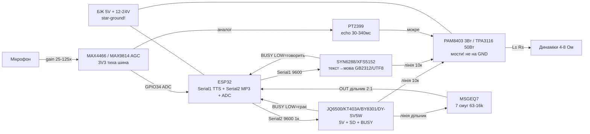

# MP3-модулі, TTS-синтез мови та підсилювачі - JQ6500/KT403A/BY8301/DY-SV5W/SOMO-14D, SYN6288/XFS5152, PAM8403/TPA3116/LM386, MAX4466/MAX9814, MSGEQ7, PT2399

> [!info] Де це в довіднику
> База звуку: [[04-Shini/04-I2S|I2S]], простіше рішення [[11-Vivid/08-DFPlayer-MAX98357-Nextion-LCD2004|DFPlayer/MAX98357A]], кодеки [[11-Vivid/13-Audio-Codecs|Audio-Codecs]], старт [[Home]].
> Мережеве аудіо - паралельна нота: [[11-Vivid/19-WebRadio-Streaming|WebRadio-Streaming]].

## Призначення

Ця нота - «великий звук» ESP32 без I2S-кодеків: коли треба **автономно грати MP3 з картки** (озвучка під'їзду, музею, іграшки, сигналізація), **говорити голосом з тексту** (TTS: оголошення станцій, голосовий помічник українською/англійською через піньїнь-транскрипцію або англійські фрази), **підсилити звук до динаміка** (від 0.5 Вт пищалки до 50 Вт сабвуфера), **підсилити мікрофон** (переговорний пристрій, шумомір, голосове керування), **побачити спектр** (кольоромузика, VU-метр на 7 смуг) і **додати ехо/реверб** (караоке, домофон, ефекти).

Коли брати що:

- треба просто грати файли з microSD по UART - **KT403A** (сумісний з DFPlayer один в один) або **JQ6500** (дешевший, але свій протокол);
- треба грати голосно без зовнішнього підсилювача - **DY-SV5W** (5 Вт на борту) або MP3-модуль + **PAM8403**;
- треба озвучити текст, а не файли - **SYN6288 / XFS5152** (шлете рядок по UART - модуль говорить);
- треба кімнатна гучність стерео - **PAM8403** (3 Вт, 5 В);
- треба вулична колонка / сабвуфер - **TPA3116** (до 50 Вт, 12-24 В, радіатор!);
- треба мікрофон на АЦП ESP32 - **MAX4466** (ручний gain) або **MAX9814** (AGC для голосу);
- треба кольоромузика - **MSGEQ7** (7 смуг спектру одним аналоговим піном);
- треба ехо - **PT2399** (аналогова затримка 30-340 мс).

Коли НЕ брати: потрібен HiFi-стерео з мережі - див. [[11-Vivid/19-WebRadio-Streaming]]; потрібен запис + навушники + I2S - див. [[11-Vivid/13-Audio-Codecs]].

## Характеристики

| Модуль | Інтерфейс | Живлення | Потужність / вихід | Ключове правило |
| --- | --- | --- | --- | --- |
| JQ6500-28P | UART 9600 + BUSY + ADKEY/IO | 5 В (3.3 В - глюки!) | DAC stereo + SPK моно ~2 Вт | Свій протокол `7E … EF`; USB-перепрошивка флеш |
| KT403A | UART 9600, протокол DFPlayer | 3.3-5 В (краще 5 В) | DAC + SPK ~2 Вт | Команди DFPlayer 1:1; найлегша заміна DFPlayer |
| BY8301-16P | UART 9600 + IO/ADKEY | 5 В | SPK 2-3 Вт | Кадр `7E … EF` зі своєю таблицею команд - звіряти ревізію! |
| DY-SV5W | UART + IO-кнопки, USB | 5 В (до 2 А пік!) | Вбудований УМ 5 Вт моно | SD + USB-флеш + SPI-flash; BUSY-пін для черги треків |
| SOMO-14D | UART 9600 (3.3 В!) + BUSY | 3.3 В | Лінійний стерео-вихід (треба УМ!) | 4D Systems; толерантний до 3.3 В логіки ESP32 |
| DFPlayer Mini (еталон) | UART 9600 + BUSY + ADKEY | 5 В | SPK 3 Вт диф. | Див. [[11-Vivid/08-DFPlayer-MAX98357-Nextion-LCD2004 | ноту 08]] |
| SYN6288 | UART 9600 (TX/RX) + BUSY | 3.3-5 В | Лінійний вихід (на УМ!) | Кодування GB2312! Кирилицю - піньїнь/трансліт або англ. фрази |
| XFS5152 (XF-S5152CE) | UART 9600/115200 + BUSY | 3.3-5 В | Лінійний вихід | GBK/UTF-8/Unicode режими; гучність/тон/швидкість командами |
| PAM8403 | Аналоговий вхід (стерео) | 5 В (2.5-5.5 В) | 3 Вт × 2, class-D | Шум від БЖ 5 В! LC-фільтр або окремий DC-DC; вхід не вище 1 В |
| TPA3116 (плата XH-M543 тощо) | Аналоговий вхід (стерео) | 12-24 В (4.5-26 В) | 2 × 50 Вт (4 Ом, 21 В) | Радіатор обов'язковий! LC-фільтр на виході; gain-резистори |
| LM386 (модуль) | Аналоговий вхід | 5-9 В | 0.5 Вт | Gain 20 (за замовч.) / 200 (конденсатор 10 мкФ між 1-8) |
| NS4150 (модуль) | Аналоговий вхід | 5 В | 3 Вт моно, class-D | Малий, для пищалок/дверних дзвінків |
| LM4871 (модуль) | Аналоговий вхід | 5 В | 3 Вт моно BTL | Диференціальний вихід - не на землю! |
| MAX4466 (преамп) | Аналоговий вихід на АЦП | 2.4-5 В (краще 3.3 В!) | Gain 25×-125× (trimmer) | Вихід зі зсувом VCC/2; тихе живлення 3.3 В |
| MAX9814 (преамп AGC) | Аналоговий вихід на АЦП | 2.7-5.5 В | Gain 40/50/60 дБ + AGC | AGC тримає голос рівно; attack/release за даташитом |
| MSGEQ7 | STROBE + RESET (цифра) + OUT (аналог) | 5 В | 7 смуг: 63/160/400/1k/2.5k/6.25k/16k Гц | Такт strobe ~36 мкс; OUT читати АЦП після кожного строба |
| PT2399 (модуль ехо) | Аналоговий in/out | 5 В | Затримка 30-340 мс | Резистор delay задає час; довгий delay = бруд/шум |

## Порівняння MP3-модулів з DFPlayer Mini

| Параметр | DFPlayer Mini | JQ6500-28P | KT403A | BY8301-16P | DY-SV5W | SOMO-14D |
| --- | --- | --- | --- | --- | --- | --- |
| Протокол UART | `7E FF 06 … EF` | Свій `7E len cmd … EF` | **Як DFPlayer** | Свій `7E … EF` | Свій + IO | Свій ASCII/UART |
| Швидкість | 9600 | 9600 | 9600 | 9600 | 9600 | 9600 |
| Носій | microSD FAT32 | microSD / SPI-flash / USB | microSD FAT32 | microSD / USB / Flash | microSD + USB + Flash | microSD |
| BUSY-пін | Є (LOW=грає) | Є | Є | Є | Є | Є |
| Кнопки без MCU | ADKEY + IO | IO/ADKEY | ADKEY | ADKEY + IO | IO (OneLine теж) | Кнопки |
| Вбудований УМ | 3 Вт | ~2 Вт | ~2 Вт | 2-3 Вт | **5 Вт** | Немає (лінія) |
| Логіка UART | 5 В (через 1 кОм!) | 5 В | 5 В-толерантний | 5 В | 5 В | **3.3 В** |
| Імена файлів | `/MP3/0001.mp3`, `/01/001.mp3` | Номер треку командою | Як DFPlayer | Номер/папка | Номер треку | Номер треку |
| Плюс | Еталон, бібліотеки | Дешевий, USB-заливка | Drop-in заміна DF | Гучний, багато режимів | Найгучніший соло | Чесні 3.3 В |
| Мінус | Вимагає 5 В + 1 кОм | Інший протокол, плутанина ревізій | Менше документації укр. | Ревізії з різними командами! | Жере струм, гріється | Дорожчий, треба УМ |

## UART-команди MP3-модулів: play / stop / volume / track

### KT403A (і DFPlayer - той же кадр)

Кадр 10 байт: `7E FF 06 CMD FB/PAR HI LO CHK_HI CHK_LO EF`. Контрольна сума = `-(версія+len+cmd+fb+parH+parL)`.

| Команда | CMD | Параметри | Приклад кадру |
| --- | --- | --- | --- |
| Play | `0x0D` | - | `7E FF 06 0D 00 00 00 FE 02 EF` |
| Stop | `0x16` | - | `7E FF 06 16 00 00 00 FE E9 EF` |
| Next / Prev | `0x01` / `0x02` | - | `7E FF 06 01 00 00 00 FE FE EF` |
| Volume (0-30) | `0x06` | `parL` = гучність | vol 20: `7E FF 06 06 00 00 14 FE E5 EF` |
| Track N (корінь) | `0x03` | `parH:parL` = номер | трек 3: `7E FF 06 03 00 00 03 FE FC EF` |
| Папка/трек | `0x0F` | `parH` = папка, `parL` = трек | `/02/005`: `7E FF 06 0F 00 02 05 FE F0 EF` |
| Пауза/продовж. | `0x0E` | - | `7E FF 06 0E 00 00 00 FE EF EF` |
| Запит статусу | `0x42` | - | відповідь приходить у TX модуля |

### JQ6500 (типовий набір; звіряти ревізію плати!)

| Дія | Кадр (типовий) | Примітка |
| --- | --- | --- |
| Play | `7E 02 0D EF` | Без параметра |
| Pause | `7E 02 0E EF` | Пауза/продовження |
| Stop | `7E 02 16 EF` | Стоп |
| Next / Prev | `7E 02 01 EF` / `7E 02 02 EF` | |
| Volume N (0-30) | `7E 03 14 NN EF` | `NN` hex гучності |
| Track N | `7E 04 03 00 NN EF` | Залежить від прошивки! |
| Вибір носія | `7E 03 09 DEV EF` | `DEV`: USB/SD/FLASH |

> [!warning] JQ6500/BY8301 - зоопарк ревізій
> У JQ6500 і BY8301 різні заводи шиють різні прошивки з різними таблицями команд при однаковому маркуванні. Завжди шукайте PDF саме під вашу плату (напис шовкографії + колір плати) і першим тестом ганяйте play/stop/volume/next з монітора порту.

### BY8301 / DY-SV5W (типовий набір)

| Дія | BY8301 (типово) | DY-SV5W (типово) |
| --- | --- | --- |
| Play / Stop | `play` = номер треку в ASCII або кадр `7E …` | IO-імпульс або UART-кадр |
| Volume + / − | Окремі кадри vol+/vol− | Кадри vol+/vol− або кнопки |
| Track N | Кадр з номером 1-255 | Кадр з номером |
| BUSY | LOW = грає | LOW = грає (черга по фронту!) |

Черга треків скрізь однакова: чекаєте фронт BUSY LOW→HIGH (трек скінчився) - шлете наступний номер. Не шліть команду, поки BUSY=LOW, якщо не треба перебити (реклама/тривога - можна).

## SD-карта і FAT32 для MP3-модулів

- Тільки **FAT16/FAT32**, кластер 4-32 КБ; **exFAT/NTFS не читаються** - модуль мовчить без помилок!
- Обсяг: до 32 ГБ (старі прошивки - до 16 ГБ; SDXC на 64+ ГБ не брати).
- Імена: латиниця, короткі; DFPlayer/KT403A: `/MP3/0001.mp3…` або `/01/001.mp3…`; порядок відтворення - **порядок копіювання**, не алфавіт!
- Бітрейт: MP3 8-320 кбіт/с, 8-48 кГц; WAV 16 біт/44.1 кГц - найнадійніший для озвучки.
- Не виймати картку під живленням (гаряча заміна не підтримується - можливий зависон до перепрошивки живленням).
- Детально про файлові системи: [[08-Pamyat/02-Filesystem|Файлові системи]].

## TTS-модулі: SYN6288 / XFS5152 - текст у мову по UART

| Параметр | SYN6288 | XFS5152 (XF-S5152CE) |
| --- | --- | --- |
| Кадр | `FD 00 LEN CMD PARAMS…` (LEN = CMD+текст) | `FD 00 LEN CMD PARAMS…` (аналогічно) |
| Кодування тексту | **GB2312** (китайське!) | GBK / UTF-8 / Unicode (вибір командою) |
| Українська/російська | Немає - трансліт латиницею або англ. фрази | Немає - трансліт або англ. фрази |
| Англійська | Є (читає латиницю) | Є, краща інтонація |
| Гучність/тон/швидкість | Команди налаштування + байт-опції в кадрі | Команди: гучність, тон, швидкість, вибір голосу |
| BUSY | Є (LOW = говорить) | Є |
| Живлення | 3.3-5 В | 3.3-5 В |
| Вихід | Лінійний → на PAM8403/TPA3116 | Лінійний → на підсилювач |

Приклад кадру SYN6288 «говорити текст»: `FD 00 LL 01 00 [байтів GB2312…]`, де `LL` = довжина від `01` до кінця тексту. Параметри голосу (типово): команда налаштування бодрейту/голосу - за даташитом конкретної прошивки.

Практика з кирилицею: або шлете англійські фрази (`"Attention! Door open"`), або транслітеруєте (`"Uvaga! Dveri vidchyneno"` - звучить з акцентом, але розбірливо), або тримаєте словник готових MP3-фраз на SD MP3-модуля (найкраща якість української - записаний диктор!).

## Підсилювачі: PAM8403, TPA3116, LM386/NS4150/LM4871

### PAM8403 - 3 Вт стерео (кімната, стіл, іграшка)

- Class-D, ККД ~90 %, живлення 2.5-5.5 В (типово 5 В), 2 × 3 Вт на 4 Ом.
- Вхід - аналогова лінія до ~1 В (з MP3-модуля через дільник/потенціометр 10 кОм!).
- **Шум при 5 В**: свист/фон від дешевого БЖ - лікується: окремий DC-DC, феритове кільце, конденсатори 470-1000 мкФ + 100 нФ біля плати, кручена пара на вхід, потенціометр гучності на вході (не на виході!).
- Вихід - на динаміки безпосередньо; **не з'єднувати мінус виходу із землею** (мостовий вихід!).

### TPA3116 - 50 Вт (вулиця, сабвуфер, гараж)

- Class-D, 4.5-26 В, 2 × 50 Вт на 4 Ом при 21 В (реально: 12 В → ~20 Вт/канал, 24 В → ~40+ Вт).
- **Радіатор обов'язковий** від ~10 Вт; плати XH-M543 вже з радіатором - не знімати!
- **LC-фільтр на виході**: на платі вже є котушки - не шунтувати, дроти до динаміка короткі, кручені.
- Gain виставляється резисторами (типово 20/26/32/36 дБ) - для чутливого входу з MP3-модуля беріть мінімальний gain, інакше кліппінг і хрип.
- Живлення: 12-24 В окремим БЖ з запасом 1.5×; земля - зіркою (див. розділ про живлення).

### Малі: LM386 / NS4150 / LM4871

| Модуль | Потужність | Коли брати |
| --- | --- | --- |
| LM386 | 0.5 Вт (gain 20, або 200 з конденсатором 10 мкФ між пінами 1-8) | Пищалка, дверний дзвінок, навчальні схеми; гріється мало, звук «телефонний» |
| NS4150 | 3 Вт моно class-D | Компактна озвучка 5 В без стерео |
| LM4871 | 3 Вт моно BTL | Те саме, але вихід мостовий - увага з землею |

## Преампи мікрофона: MAX4466 / MAX9814 (gain, AGC!)

| Параметр | MAX4466 | MAX9814 |
| --- | --- | --- |
| Gain | Ручний trimmer 25×-125× | 40/50/60 дБ перемичкою + **AGC** |
| AGC | Немає | Є: тихі звуки підсилює, гучні - душить |
| Для чого | Шумомір, FFT-кольоромузика, запис | Голосове керування, домофон (рівний голос) |
| Живлення | 2.4-5 В, **краще 3.3 В** (тиха шина!) | 2.7-5.5 В |
| Вихід | Зсув VCC/2, прямо на АЦП ESP32 | Зсув VCC/2, прямо на АЦП |
| Пастка | Завеликий gain = кліппінг на криках | AGC «дихає» на музиці - для музики беріть MAX4466 |

## MSGEQ7 - 7-смуговий аналізатор спектра

- Смуги: 63 Гц, 160 Гц, 400 Гц, 1 кГц, 2.5 кГц, 6.25 кГц, 16 кГц.
- Керування: RESET-імпульс (>100 нс) → 7× STROBE-імпульсів → після кожного читаєте OUT аналоговим входом (через ~36 мкс після фронту strobe).
- Вхід - лінійний сигнал (з виходу MP3-модуля через дільник 10 кОм/4.7 кОм + конденсатор 100 нФ).
- Живлення 5 В; OUT - 0…5 В → на ESP32 через дільник 2:1 (або модуль з уже 3.3 В виходом - читати схему плати!).
- Застосування: кольоромузика на NeoPixel (див. [[11-Vivid/03-NeoPixel-Servo-Rele-MOSFET|NeoPixel]]), VU-метр, «танцюючі» LED-стрічки.

## PT2399 - ехо / реверберація

- Аналоговий процесор затримки: час 30-340 мс задається резистором на піні 6 (менший опір = довша затримка, але брудніше).
- Ручки модуля: DELAY (час), REPEAT (кількість повторів), MIX/LEVEL (сухе/мокре).
- Довга затримка >250 мс - помітний шум/спотворення (фізика чіпа, не брак!).
- Живлення 5 В; вхід/вихід - лінія; для мікрофона - спочатку MAX4466/MAX9814, потім PT2399, потім УМ.

## Живлення аудіо без земляних петель (star-ground!)

Головне джерело фону/свисту - **земляні петлі**: коли струм динаміка тече спільною доріжкою землі з мікрофоном/MSGEQ7 і наводить фон.

Правила:

1. **Зірка**: всі землі (ESP32, MP3-модуль, УМ, преамп, БЖ) сходяться в **одній точці** біля клем БЖ. Ніяких «гірлянд» GND по колу!
2. **Сила окремо, сигнал окремо**: товсті дроти БЖ→УМ/динамік; тонкі екрановані/кручені - входи УМ і мікрофон.
3. **Один БЖ - один контур**: TPA3116 на 12-24 В живіть окремим БЖ; спільна тільки точка-зірка.
4. **Конденсатори**: 470-1000 мкФ електроліт + 100 нФ кераміка біля кожної плати (PAM8403, MP3-модуль, преамп).
5. **PAM8403 від USB-порту ПК** - свистить майже завжди; для тестів - павербанк, для продакшену - окремий DC-DC.
6. **Потенціометр гучності - на вході УМ** (10 кОм логарифмічний на кожен канал), не на виході!
7. **Мостові виходи** (PAM8403, TPA3116, LM4871, SPK DFPlayer) - жоден полюс динаміка не на землю!

## Легенда пінів модуля

| Пін | Тип | Куди | Примітка |
| --- | --- | --- | --- |
| JQ6500 VCC / GND | Живлення | 5 В / GND (зірка!) | 100 мкФ поруч; пік при старті треку |
| JQ6500 TX / RX | UART 5 В | ESP32 RX / TX через 1 кОм (RX модуля) | 9600 бод; кадри `7E … EF` |
| JQ6500 BUSY | Вихід, LOW=грає | GPIO-вхід | Фронт HIGH = кінець треку |
| KT403A VCC/GND/RX/TX/BUSY | Як DFPlayer | 5 В; RX через 1 кОм | Протокол DFPlayer 1:1 |
| BY8301 VCC/GND/RX/TX/BUSY | UART 5 В | 5 В; RX через 1 кОм | Таблиця команд своєї ревізії! |
| DY-SV5W VCC/GND | Живлення | 5 В / 2 А запас | Гріється на максимумі - вентиляція |
| DY-SV5W RX/TX/BUSY/IO | UART + кнопки | RX через 1 кОм; IO-кнопки на GND | USB-порт - заливка файлів з ПК |
| SOMO-14D VCC/GND | Живлення | 3.3 В / GND | Чесні 3.3 В - без дільників! |
| SOMO-14D RX/TX/BUSY | UART 3.3 В | Безпосередньо до ESP32 | 9600 бод |
| SYN6288 VDD/GND | Живлення | 3.3-5 В | Розв'язка 100 нФ + 10 мкФ |
| SYN6288 RXD/TXD/BUSY | UART + статус | ESP32 TX/RX; BUSY на GPIO | Текст у GB2312! |
| XFS5152 VDD/GND/RXD/TXD/BUSY | UART 3.3 В-толерант. | Безпосередньо до ESP32 | Режим UTF-8 командою |
| PAM8403 VCC/GND | Живлення | 5 В / GND зіркою | 470 мкФ поруч обов'язково |
| PAM8403 L/R/GND(in) | Аналоговий вхід | Лінія MP3/TTS через 10 кОм | Не більше ~1 В ампл. |
| PAM8403 L±/R± | Вихід міст | Динаміки 4-8 Ом | Не на землю! |
| TPA3116 VCC/GND (12-24 В) | Силове живлення | Окремий БЖ 12-24 В | Запас 1.5×; радіатор! |
| TPA3116 L/R/GND(in) | Аналоговий вхід | Лінія через потенц. 10 кОм | Мінімальний gain проти хрипу |
| TPA3116 OUT L±/R± | Вихід + LC-фільтр | Динаміки 4-8 Ом | Короткі кручені дроти |
| LM386 VCC/GND/IN/OUT | Аналог, 5-9 В | Вхід через 10 мкФ; gain-джампер | 0.5 Вт, «телефонний» звук |
| MAX4466 VCC/GND/OUT | Преамп | VCC 3.3 В! OUT → GPIO ADC | Gain trimmer 25×-125× |
| MAX9814 VCC/GND/OUT/GAIN | Преамп AGC | OUT → GPIO ADC; GAIN-перемичка | AGC для голосу |
| MSGEQ7 VDD/GND | Живлення | 5 В | OUT через дільник на АЦП |
| MSGEQ7 STROBE/RESET | Цифрові входи | GPIO-виходи ESP32 | Тактування смуг |
| MSGEQ7 IN | Аналоговий вхід | Лінія через дільник + 100 нФ | Рівень ~0.3-1 В |
| PT2399 VCC/GND/IN/OUT | Аналог 5 В | Між преампом і УМ | Ручки DELAY/REPEAT/MIX |

## Схема підключення

| ESP32 | Модуль | Примітка |
| --- | --- | --- |
| GPIO17 (TX2) через 1 кОм | RX MP3-модуля (JQ6500/KT403A/BY8301/DY-SV5W) | Обмеження 5 В логіки |
| GPIO16 (RX2) | TX MP3-модуля | Serial2 9600 |
| GPIO4 | BUSY MP3-модуля | Вхід; LOW = грає |
| GPIO33 (TX1) | RXD SYN6288/XFS5152 | Serial1 9600 |
| GPIO32 (RX1) | TXD SYN6288/XFS5152 | Відповіді модуля |
| GPIO5 | BUSY TTS-модуля | Вхід; LOW = говорить |
| Вихід MP3/TTS (DAC/лінія) | Вхід PAM8403/TPA3116 через 10 кОм | Дільник/потенціометр гучності |
| Динаміки | Виходи УМ (мости!) | 4-8 Ом; не на землю |
| GPIO34 (ADC) | OUT MAX4466/MAX9814 | Тільки вхідний пін! |
| GPIO35 (ADC) | OUT MSGEQ7 (через дільник 2:1) | Аналог 7 смуг |
| GPIO18 / GPIO19 | STROBE / RESET MSGEQ7 | Виходи тактування |
| Мікрофон → MAX4466 → PT2399 → УМ | Аналоговий ланцюг | Ехо між преампом і УМ |
| GND | Зірка біля БЖ | Єдина спільна точка! |

### ASCII-схема

```text
ESP32 DevKit            MP3 + TTS + Amps + Mic + Spectrum + Echo
------------            ----------------------------------------
GPIO17(TX2)──[1к]──────► RX MP3 (JQ6500/KT403A/BY8301/DY-SV5W, VCC=5V!)
GPIO16(RX2)◄──────────── TX MP3 ; BUSY ──► GPIO4 (LOW=грає)
GPIO33(TX1)────────────► RXD SYN6288/XFS5152 (VCC=3V3..5V)
GPIO32(RX1)◄──────────── TXD TTS ; BUSY ──► GPIO5 (LOW=говорить)
MP3.DAC/L ──┬─────────►[10к]──► L-in PAM8403 (5V, 470мкФ!) ──► L± динамік 4 Ом
TTS.LINE ───┘         ► R-in PAM8403 ──► R± динамік (мости, не на GND!)
  (або на TPA3116 12-24V з радіатором ──► 2×50Вт при 21V)
MIC ──► MAX4466 (3V3!, gain trimmer) ──► GPIO34 ADC
  (варіант: MAX9814 з AGC для голосу)
LINE ──►[дільник+100нФ]──► IN MSGEQ7 (5V); GPIO18/19=STROBE/RESET
MSGEQ7.OUT ──[дільник 2:1]──► GPIO35 ADC (7 смуг по strobe!)
MIC ──► MAX4466 ──► IN PT2399 (DELAY/REPEAT/MIX) ──► OUT ──► УМ
GND ──► ЗІРКА біля БЖ (сила окремо, сигнал окремо!)
```

### Mermaid



![[assets/img/mp3-tts-amps-scheme.png|600]]
*Рис. MP3-модуль на Serial2 через 1 кОм, TTS на Serial1, лінії на PAM8403/TPA3116 через 10 кОм, мікрофон через MAX4466/MAX9814 на ADC, MSGEQ7 на strobe-тактуванні, PT2399 між преампом і УМ, земля - зіркою. Місце під фото - див. [[assets/README]].*

## Код ESP-IDF

```c
// ESP-IDF: KT403A/DFPlayer-кадр + черга по BUSY + TTS SYN6288.
// Serial2 (UART2): MP3 ; Serial1 (UART1): TTS ; BUSY — GPIO.
#include <string.h>
#include "freertos/FreeRTOS.h"
#include "freertos/task.h"
#include "driver/uart.h"
#include "driver/gpio.h"

#define UART_MP3 UART_NUM_2
#define UART_TTS UART_NUM_1
#define PIN_BUSY_MP3 GPIO_NUM_4
#define PIN_BUSY_TTS GPIO_NUM_5

static uint16_t df_checksum(const uint8_t *f) {
    uint16_t s = 0;
    for (int i = 1; i <= 6; i++) s += f[i];
    return (uint16_t)(0 - s);
}

// Кадр DFPlayer/KT403A: 7E FF 06 CMD FB PH PL CH H CH L EF
static void mp3_cmd(uint8_t cmd, uint16_t par) {
    uint8_t f[10] = {0x7E, 0xFF, 0x06, cmd, 0x00,
                     (uint8_t)(par >> 8), (uint8_t)(par & 0xFF), 0, 0, 0xEF};
    uint16_t c = df_checksum(f);
    f[7] = c >> 8; f[8] = c & 0xFF;
    uart_write_bytes(UART_MP3, (const char *)f, 10);
}

static void mp3_volume(uint8_t v) { if (v > 30) v = 30; mp3_cmd(0x06, v); }
static void mp3_play(void)  { mp3_cmd(0x0D, 0); }
static void mp3_stop(void)  { mp3_cmd(0x16, 0); }
static void mp3_track(uint16_t n) { mp3_cmd(0x03, n); }
static void mp3_folder(uint8_t folder, uint8_t track) {
    mp3_cmd(0x0F, ((uint16_t)folder << 8) | track);
}

// SYN6288: FD 00 LEN 01 00 + текст у GB2312 (латиниця проходить як є)
static void tts_speak(const char *latin_text) {
    size_t n = strlen(latin_text);
    uint8_t hdr[5] = {0xFD, 0x00, 0x00, 0x01, 0x00};
    uint16_t len = (uint16_t)(n + 3); // 01 00 + текст
    hdr[2] = len >> 8; hdr[3] = 0x01; // увага: hdr[3] вже 0x01
    uint8_t head[5] = {0xFD, (uint8_t)(len >> 8), (uint8_t)(len & 0xFF),
                       0x01, 0x00};
    uart_write_bytes(UART_TTS, (const char *)head, 5);
    uart_write_bytes(UART_TTS, latin_text, n);
}

static int busy_level(gpio_num_t p) { return gpio_get_level(p); }

void app_main(void) {
    gpio_set_direction(PIN_BUSY_MP3, GPIO_MODE_INPUT);
    gpio_set_direction(PIN_BUSY_TTS, GPIO_MODE_INPUT);
    uart_config_t c = {.baud_rate = 9600, .data_bits = UART_DATA_8_BITS,
        .parity = UART_PARITY_DISABLE, .stop_bits = UART_STOP_BITS_1,
        .flow_ctrl = UART_HW_FLOWCTRL_DISABLE, .source_clk = UART_SCLK_DEFAULT};
    uart_param_config(UART_MP3, &c);
    uart_param_config(UART_TTS, &c);
    uart_set_pin(UART_MP3, 17, 16, -1, -1);
    uart_set_pin(UART_TTS, 33, 32, -1, -1);
    uart_driver_install(UART_MP3, 512, 512, 0, NULL, 0);
    uart_driver_install(UART_TTS, 512, 512, 0, NULL, 0);

    mp3_volume(20);
    mp3_folder(1, 1); // /01/001.mp3 — привітання
    // Чекаємо кінець треку по фронту BUSY: LOW(грає) -> HIGH(стоп)
    while (busy_level(PIN_BUSY_MP3) == 0) vTaskDelay(pdMS_TO_TICKS(50));
    tts_speak("Uvaga! Dveri vidchyneno."); // трансліт для SYN6288
    while (busy_level(PIN_BUSY_TTS) == 0) vTaskDelay(pdMS_TO_TICKS(50));
    mp3_track(2);
    while (1) vTaskDelay(pdMS_TO_TICKS(1000));
}
```

## Код Arduino

```cpp
// Arduino: MP3 (KT403A/DFPlayer-бібліотека) + TTS-кадр + MSGEQ7-читання.
#include <Arduino.h>
#include <DFRobotDFPlayerMini.h> // працює і з KT403A!

#define MP3_RX 16  // ESP32 RX2 <- TX модуля
#define MP3_TX 17  // ESP32 TX2 -> RX модуля через 1 кОм!
#define TTS_RX 32
#define TTS_TX 33
#define BUSY_MP3 4
#define BUSY_TTS 5
#define MS7_STROBE 18
#define MS7_RESET 19
#define MS7_OUT 35

DFRobotDFPlayerMini mp3;
HardwareSerial Smp3(2);
HardwareSerial Stts(1);

void ttsSpeak(const String &latin) {
  uint16_t len = latin.length() + 3;
  uint8_t head[5] = {0xFD, (uint8_t)(len >> 8), (uint8_t)(len & 0xFF),
                     0x01, 0x00};
  Stts.write(head, 5);
  Stts.print(latin); // GB2312: латиниця проходить без конверсії
}

int bands[7];
void msgeq7Read() {
  digitalWrite(MS7_RESET, HIGH);
  delayMicroseconds(5);
  digitalWrite(MS7_RESET, LOW);
  delayMicroseconds(80);
  for (int i = 0; i < 7; i++) {
    digitalWrite(MS7_STROBE, LOW);
    delayMicroseconds(36); // вихід встигає встановитись
    bands[i] = analogRead(MS7_OUT); // OUT через дільник 2:1!
    digitalWrite(MS7_STROBE, HIGH);
    delayMicroseconds(36);
  }
}

void setup() {
  Serial.begin(115200);
  pinMode(BUSY_MP3, INPUT);
  pinMode(BUSY_TTS, INPUT);
  pinMode(MS7_STROBE, OUTPUT);
  pinMode(MS7_RESET, OUTPUT);
  digitalWrite(MS7_STROBE, HIGH);
  digitalWrite(MS7_RESET, LOW);
  Smp3.begin(9600, SERIAL_8N1, MP3_RX, MP3_TX);
  Stts.begin(9600, SERIAL_8N1, TTS_RX, TTS_TX);
  Serial.println(mp3.begin(Smp3) ? "MP3 OK" : "MP3 FAIL: перевір 5V/SD/1кОм");
  mp3.volume(20);
  mp3.playFolder(1, 1);
  while (digitalRead(BUSY_MP3) == LOW) delay(50);
  ttsSpeak("Alarm! Zone two open.");
  while (digitalRead(BUSY_TTS) == LOW) delay(50);
  mp3.next();
}

void loop() {
  msgeq7Read(); // 7 смуг: 63/160/400/1k/2.5k/6.25k/16k
  for (int i = 0; i < 7; i++) {
    Serial.printf("%d:%d ", i, bands[i]);
  }
  Serial.println(digitalRead(BUSY_MP3) == LOW ? "| PLAY" : "| IDLE");
  delay(200);
}
```

## Код MicroPython

```python
# MicroPython: MP3-кадри вручну + TTS + MSGEQ7 + преамп на АЦП.
from machine import UART, Pin, ADC
import time

BUSY_MP3 = Pin(4, Pin.IN)
BUSY_TTS = Pin(5, Pin.IN)
mp3 = UART(2, baudrate=9600, tx=17, rx=16)   # TX через 1 кОм до RX модуля!
tts = UART(1, baudrate=9600, tx=33, rx=32)

STROBE = Pin(18, Pin.OUT, value=1)
RESET = Pin(19, Pin.OUT, value=0)
ms7 = ADC(Pin(35))
ms7.atten(ADC.ATTN_11DB)  # OUT MSGEQ7 через дільник 2:1!
mic = ADC(Pin(34))
mic.atten(ADC.ATTN_11DB)  # OUT MAX4466/MAX9814 (зсув VCC/2)

def checksum(f):
    return (0 - sum(f[1:7])) & 0xFFFF

def mp3_cmd(cmd, par=0):
    f = bytearray([0x7E, 0xFF, 0x06, cmd, 0x00,
                   (par >> 8) & 0xFF, par & 0xFF, 0, 0, 0xEF])
    c = checksum(f)
    f[7], f[8] = (c >> 8) & 0xFF, c & 0xFF
    mp3.write(f)

def mp3_volume(v):
    mp3_cmd(0x06, min(max(v, 0), 30))

def tts_speak(latin):
    b = latin.encode("ascii")  # SYN6288: GB2312, латиниця проходить
    ln = len(b) + 3
    tts.write(bytes([0xFD, (ln >> 8) & 0xFF, ln & 0xFF, 0x01, 0x00]) + b)

def msgeq7_read():
    RESET.on()
    time.sleep_us(5)
    RESET.off()
    time.sleep_us(80)
    out = []
    for _ in range(7):
        STROBE.off()
        time.sleep_us(36)
        out.append(ms7.read())
        STROBE.on()
        time.sleep_us(36)
    return out  # 63/160/400/1k/2.5k/6.25k/16k Гц

def mic_level(n=50):
    # MAX4466: тиша ~= середина шкали; міряємо розмах
    vals = [mic.read() for _ in range(n)]
    return max(vals) - min(vals)

mp3_volume(20)
mp3_cmd(0x0D)  # play
while BUSY_MP3.value() == 0:
    time.sleep_ms(50)
print("track done, bands:", msgeq7_read(), "mic swing:", mic_level())
tts_speak("Uvaga! Zona dva vidchynena.")
while BUSY_TTS.value() == 0:
    time.sleep_ms(50)
mp3_cmd(0x01)  # next
while True:
    print("bands:", msgeq7_read(), "mic:", mic_level(),
          "busy:", BUSY_MP3.value())
    time.sleep_ms(300)
```

## Типові помилки

| # | Помилка | Симптом | Виправлення |
| --- | --- | --- | --- |
| 1 | MP3-модуль від 3.3 В | Клацає, ребутиться, не бачить SD | Тільки 5 В + 100 мкФ біля плати; пік струму на старті треку |
| 2 | RX модуля безпосередньо без 1 кОм | Глітчі UART, зависання, пробиття входу | 1 кОм послідовно в лінію ESP32 TX → RX модуля |
| 3 | SD в exFAT/NTFS | Мовчить без жодної помилки | Переформатувати в FAT32, короткі латинські імена |
| 4 | Порядок треків «не той» | Грає не по алфавіту | Порядок = порядок копіювання; копіювати пачкою в потрібному порядку |
| 5 | Команда не тій ревізії JQ6500/BY8301 | Деякі команди ігнор, track грає не той | Знайти PDF під свою шовкографію; прогнати play/stop/vol/next тестом |
| 6 | Шлють трек поки BUSY=LOW | Обриви, каша, пропуск | Чекати фронт LOW→HIGH; перебивати тільки для тривоги/реклами |
| 7 | Кирилиця в SYN6288 як UTF-8 | Мовчить або абракадабра | GB2312! Кирилицю - трансліт/англійські фрази або словник MP3 |
| 8 | TTS-лінія безпосередньо в динамік | Ледь чутно, хрип | Лінійний вихід тільки через УМ (PAM8403/TPA3116) |
| 9 | PAM8403 свистить від БЖ | Високий писк/фон, гучність не впливає | Окремий DC-DC, 470-1000 мкФ + 100 нФ, кручена пара на вхід |
| 10 | TPA3116 без радіатора | Термозахист, клацання, смерть чіпа | Не знімати радіатор; від 10 Вт - обдув; БЖ із запасом 1.5× |
| 11 | Мінус мостового виходу на землю | КЗ, дим, смерть УМ | PAM8403/TPA3116/LM4871/SPK DFPlayer - обидва полюси тільки на динамік |
| 12 | Земля «гірляндою» | Фон 50 Гц, свист при басах | Зірка біля БЖ: сила і сигнал окремими дротами |
| 13 | MAX4466 від шумних 5 В | Шипіння, хибні спрацювання шумоміра | Живити від 3.3 В; gain trimmer не на максимум |
| 14 | MAX9814 для музики | AGC «дихає», качає гучність | AGC - тільки для голосу; музика/FFT - MAX4466 |
| 15 | MSGEQ7 без пауз strobe | Всі смуги однакові/сміття | 36 мкс після фронту перед analogRead; RESET-імпульс перед циклом |
| 16 | OUT MSGEQ7 (5 В) безпосередньо в ESP32 | Перевантаження АЦП, ризик піну | Дільник 2:1 (напр. 10 кОм/10 кОм) або плата з 3.3 В виходом |
| 17 | PT2399 delay на максимум | Гучний бруд/самовозбуд | Delay ≤ ~250 мс для чистоти; довше - тільки як ефект |

## Офіційні джерела

- [DFPlayer Mini wiki - команди, схеми, скетчі (DFRobot)](https://wiki.dfrobot.com/DFPlayer_Mini_SKU_DFR0299) - еталонний протокол `7E FF 06 … EF`, який 1:1 розуміє KT403A; таблиця команд play/stop/volume/track.
- [MAX98357A I2S-гайд з кодом (Adafruit Learn)](https://learn.adafruit.com/adafruit-max98357-i2s-class-d-mono-amp) - чим I2S-підсилювач відрізняється від аналогових PAM8403/TPA3116; орієнтир gain і живлення.
- [TPA3116D2 - сторінка продукту з даташитом (TI)](https://www.ti.com/product/TPA3116D2) - 2×50 Вт, 4.5-26 В, вимоги до радіатора, LC-фільтра і gain.
- [Electret Microphone Amplifier MAX4466 (Adafruit)](https://www.adafruit.com/product/1063) - преамп: gain 25×-125× trimmer, живлення 2.4-5 В, зсув виходу VCC/2.
- [VS1053 Codec Tutorial (Adafruit Learn)](https://learn.adafruit.com/adafruit-vs1053-mp3-aac-ogg-midi-wav-play-and-record-codec-tutorial) - апаратний MP3-декодер як альтернатива UART-модулям; формати і SPI-керування.
- [ESP-IDF I2S - офіційна документація (Espressif)](https://docs.espressif.com/projects/esp-idf/en/latest/esp32/api-reference/peripherals/i2s.html) - коли аналогового тракту мало і треба переходити на I2S.

## Див. також

- [[Home]]
- [[04-Shini/04-I2S|I2S]]
- [[04-Shini/01-UART|UART]]
- [[04-Shini/07-SD-SDIO]]
- [[11-Vivid/08-DFPlayer-MAX98357-Nextion-LCD2004]]
- [[11-Vivid/13-Audio-Codecs]]
- [[11-Vivid/19-WebRadio-Streaming]]
- [[11-Vivid/03-NeoPixel-Servo-Rele-MOSFET]]
- [[05-Radio/01-WiFi-STA-AP]]
- [[08-Pamyat/02-Filesystem|Файлові системи]]
- [[02-Zhivlennya/01-Lancjugi-zhivlennya]]
