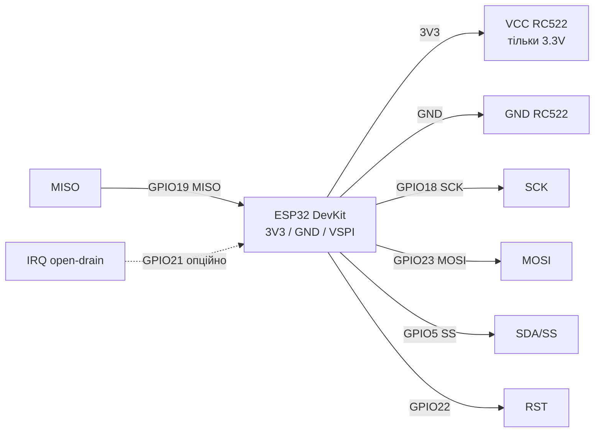

# RC522 RFID (MFRC522) - SPI 13.56 MHz

## Призначення

RC522 RFID (MFRC522): безконтактні мітки 13.56 МГц по SPI - читання UID, доступ до секторів, керування замком/обліком.

> [!warning] Критично: тільки 3.3V! НЕ 5V! Живлення 5V вбиває чіп.

Характеристики: NXP MFRC522, 13.56 MHz, ISO14443A, SPI до 10 МГц. Застосування - СКУД, мітки, оплата-прототипи; живлення строго 3.3V. Читання UID карт Mifare Classic, робота з секторами через KeyA/KeyB, дальність - одиниці сантиметрів. Бібліотеки - MFRC522 для Arduino та аналоги для ESP-IDF/MicroPython.

![[assets/img/rc522-scheme.png|500]]
*Рис. RC522 - схема підключення до ESP32 по VSPI, окреме живлення 3.3V.*

Зв'язок з [[Home]], [[04-Shini/02-SPI|SPI]], [[02-Zhivlennya/01-Lancjugi-zhivlennya]], [[03-GPIO/01-GPIO-oglyad]], [[99-Dodatki/02-Troubleshooting-FAQ]], [[12-Moduli-zvyazku/02-NRF24-LoRa]].

## Призначення

RC522 RFID (MFRC522) - SPI 13.56 MHz - Легенда пінів модуля; Підключення ESP32 до RC522; ASCII-схема. Критично: тільки 3.3V! НЕ 5V! Живлення 5V вбиває чіп. Характеристики: NXP MFRC522, 13.56 MHz, ISO14443A, SPI до 10 МГц.

## Легенда пінів модуля

Модуль RC522 (плата з чипом MFRC522) має 8 пінів. Увага: на деяких платах перший пін підписаний `SDA`, але в режимі SPI це `SS / NSS / CS` - не плутати з I2C SDA.

| Пін | Позначення | Тип | Куди на ESP32 | Примітка |
| --- | --- | --- | --- | --- |
| 1 | VCC | Живлення вхід | 3V3 ESP32 (через окремий LDO за потреби) | Тільки 3.3V! 5V вбиває модуль миттєво, логіка теж 3.3V |
| 2 | RST | Вхід, active low | GPIO22 (будь-який GPIO) | Reset: тримати HIGH у роботі, імпульс LOW = скидання; підтяжка 10к до 3.3V |
| 3 | GND | Земля | GND | Спільна земля з ESP32, короткий провід |
| 4 | IRQ | Вихід, open-drain | GPIO21 або не підключати | Переривання «картка в полі»; open-drain - потрібен pull-up 10к до 3.3V; можна не підключати і опитувати в циклі |
| 5 | MISO | Вихід SPI | GPIO19 (VSPI MISO) | Дані від RC522 до ESP32 |
| 6 | MOSI | Вхід SPI | GPIO23 (VSPI MOSI) | Дані від ESP32 до RC522 |
| 7 | SCK | Вхід SPI | GPIO18 (VSPI SCK) | Тактування SPI до 10 МГц, дроти <20 см |
| 8 | SDA / SS | Вхід CS | GPIO5 (будь-який GPIO як CS) | Це Slave Select (NSS): LOW = вибрано; підпис SDA - спадщина від I2C-режиму чипа |

Деталі по пінах:

- **VCC 3.3V:** чип MFRC522 живиться від 3.0-3.6V. Плата RC522 не має стабілізатора 5V→3.3V, тому 5V подавати заборонено - пробій внутрішнього LDO і деградація антени 13.56 МГц. Якщо DevKit просідає - окремий LDO 3.3V 300 мА + електроліт 10 мкФ + кераміка 100 нФ біля модуля, див. [[02-Zhivlennya/01-Lancjugi-zhivlennya]].
- **RST:** активний низький рівень. У бібліотеці `MFRC522(SS, RST)` саме цей пін ініціалізує чип при `PCD_Init()`. Без підключення RST модуль іноді «висить» після brownout.
- **GND:** спільна земля обов'язкова. Довгі «соплі» GND = помилки SPI `Version 0x00/0xFF`.
- **IRQ:** вихід з відкритим стоком (open-drain): сам притягує до землі, а до 3.3V підтягується зовнішнім резистором 10к. Можна не підключати взагалі - тоді `PICC_IsNewCardPresent()` опитує в `loop()`. Потрібен лише для сну/пробудження ESP32 по картці, див. [[03-GPIO/01-GPIO-oglyad]].
- **MISO / MOSI / SCK:** класичний SPI, див. [[04-Shini/02-SPI|SPI]]. Порядок `SPI.begin(SCK, MISO, MOSI, SS)` в Arduino - не переплутати MISO/MOSI місцями.
- **SDA (SS):** у SPI-режимі це Chip Select. Коли на шині лише RC522 - підійде будь-який вільний GPIO (типово GPIO5). Коли на шині ще NRF24/LoRa/SD - кожному свій CS, SCK/MOSI/MISO спільні.

## Підключення ESP32 до RC522

| ESP32 | RC522 | Примітка |
| --- | --- | --- |
| 3V3 | 3.3V | НЕ 5V! |
| GND | GND | спільна земля |
| GPIO18 | SCK | VSPI SCK |
| GPIO23 | MOSI | VSPI MOSI |
| GPIO19 | MISO | VSPI MISO |
| GPIO5 | SDA (SS) | CS |
| GPIO22 | RST | Reset |
| GPIO21 | IRQ | опційно pull-up 10к |

Деталі RST/IRQ: RST активний low, тримати HIGH. IRQ open-drain для пробудження, див. [[03-GPIO/01-GPIO-oglyad]].

### ASCII-схема

```text
ESP32 DevKit          RC522 (MFRC522)
────────────          ───────────────
3V3 ───────────────►  VCC (3.3V! НЕ 5V!)
GND ────────────────  GND
GPIO18 (VSPI SCK) ──► SCK
GPIO23 (VSPI MOSI) ─► MOSI
GPIO19 (VSPI MISO) ◄── MISO
GPIO5  (CS) ───────►  SDA (SS)
GPIO22 ────────────►  RST
GPIO21 ────────────◄  IRQ (опційно, pull-up 10к до 3V3, можна NC)

Примітки:
- SPI.begin(18, 19, 23, 5) // SCK, MISO, MOSI, SS
- Довжина дротів < 20 см, живлення + 100нФ + 10мкФ біля модуля
- IRQ можна не підключати (залишити вільним)
```

### Mermaid



## Код - читання UID

### Arduino

```cpp
#include <SPI.h>
#include <MFRC522.h>
#define SS_PIN 5
#define RST_PIN 22
MFRC522 rfid(SS_PIN, RST_PIN);
void setup() {
  Serial.begin(115200);
  SPI.begin(18, 19, 23, SS_PIN);
  rfid.PCD_Init();
  rfid.PCD_DumpVersionToSerial();
}
void loop() {
  if (!rfid.PICC_IsNewCardPresent() || !rfid.PICC_ReadCardSerial()) { delay(50); return; }
  Serial.print("UID:");
  for (byte i=0;i<rfid.uid.size;i++) { Serial.printf(" %02X", rfid.uid.uidByte[i]); }
  Serial.println();
  rfid.PICC_HaltA(); rfid.PCD_StopCrypto1();
}
```

### MicroPython

```python
from machine import Pin, SPI
from mfrc522 import MFRC522
rfid = MFRC522(sck=18, mosi=23, miso=19, rst=22, cs=5)
print("RC522 ready")
while True:
    stat, tag = rfid.request(rfid.REQIDL)
    if stat == rfid.OK:
        stat, uid = rfid.anticoll()
        print("UID:", uid)
```

### ESP-IDF

```c
// spi_bus_initialize VSPI_HOST: SCK=18 MISO=19 MOSI=23, mfrc522_init(SS=5, RST=22)
// mfrc522_picc_read_uid(uid, &len) в циклі з vTaskDelay(200ms)
```

### Живлення і стабільність - чеклист

1. Мультиметром перевірити 3.3V на піні VCC під час піднесення картки (не має падати нижче 3.0V).
2. Поставити кераміку 100 нФ + електроліт 10 мкФ прямо на VCC/GND модуля.
3. Не живити RC522 від виноски 3V3 разом з WiFi на максимумі + яскравими LED - краще окремий LDO, див. [[02-Zhivlennya/01-Lancjugi-zhivlennya]].
4. Антена на платі не має торкатись металу; відстань читання 2-4 см для брелоків, 4-6 см для карт.
5. Якщо на шині SPI кілька пристроїв - у кожного свій CS, а `SPI.begin()` викликати один раз, див. [[04-Shini/02-SPI|SPI]].

| Симптом | Причина | Рішення |
| --- | --- | --- |
| Version 0x00/0xFF | немає SPI | перевірити MOSI/MISO, дроти <20см |
| Читає через раз | просадка живлення | тільки 3.3V + конд. 100нФ+10мкФ |
| Reboot при картці | слабкий LDO | окремий LDO, див. [[02-Zhivlennya/01-Lancjugi-zhivlennya]] |
| IRQ не спрацьовує | немає pull-up | резистор 10к до 3.3V або опитування без IRQ |
| Плутанина SDA/SS | підпис SDA на платі | SDA = SS/CS на GPIO5 |

## Офіційні джерела

- [MFRC522 - даташит (PDF, NXP)](https://www.nxp.com/docs/en/data-sheet/MFRC522.pdf) - регістри, антена 13.56 МГц.
- [MFRC522 - сторінка продукту з фото (NXP)](https://www.nxp.com/products/rfid-nfc/nfc-hf/nfc-readers/standard-performance-mifare-and-ntag-frontend:MFRC52202HN1) - характеристики, документи.
- [ESP32 + MFRC522 - туторіал з кодом (RNT)](https://randomnerdtutorials.com/esp32-mfrc522-rfid-reader-arduino/) - UID, читання/запис блоків.
- [RC522 - розбір модуля з фото (LME)](https://lastminuteengineers.com/how-rfid-works-rc522-arduino-tutorial/) - піни, пам'ять Mifare 1K.

## Див. також

- [[Home]]
- [[04-Shini/01-UART|UART]]
- [[04-Shini/02-SPI|SPI]]
- [[02-Zhivlennya/01-Lancjugi-zhivlennya]]
- [[03-GPIO/01-GPIO-oglyad]]
- [[12-Moduli-zvyazku/01-RC522-RFID]]
- [[12-Moduli-zvyazku/02-NRF24-LoRa]]
- [[12-Moduli-zvyazku/03-SIM800L-GPS]]
- [[12-Moduli-zvyazku/04-RS485-CAN-Ethernet-Kamera]]
- [[99-Dodatki/01-Pinout-tablici]]
- [[99-Dodatki/02-Troubleshooting-FAQ]]
