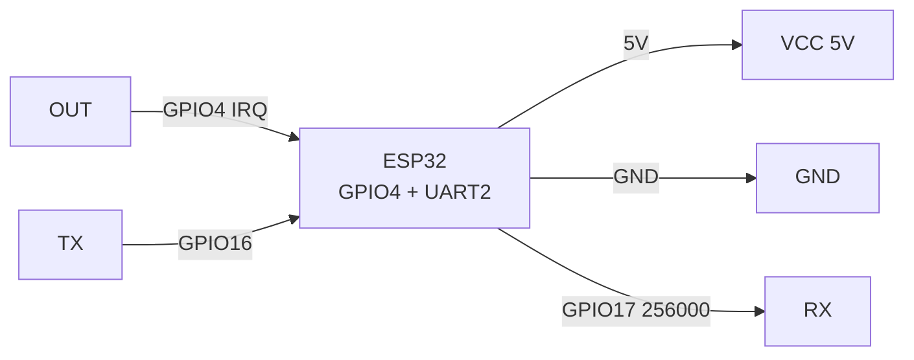
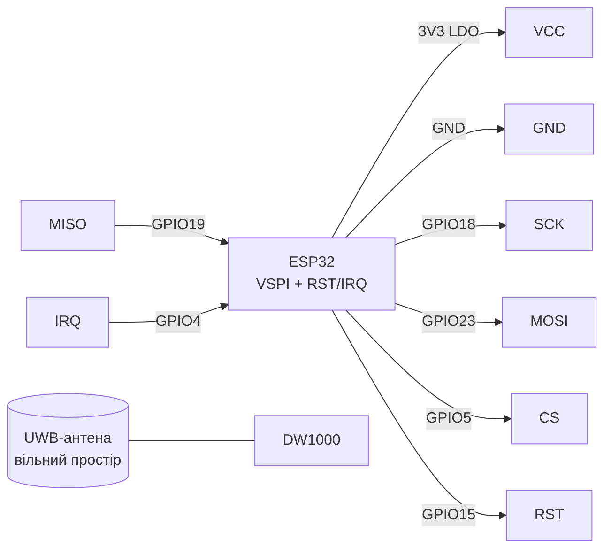
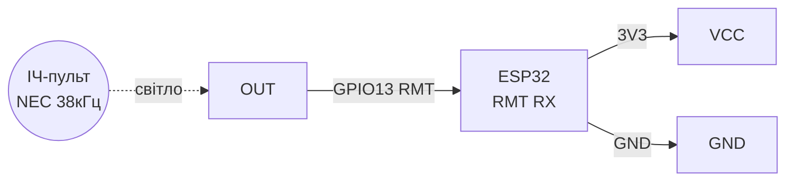
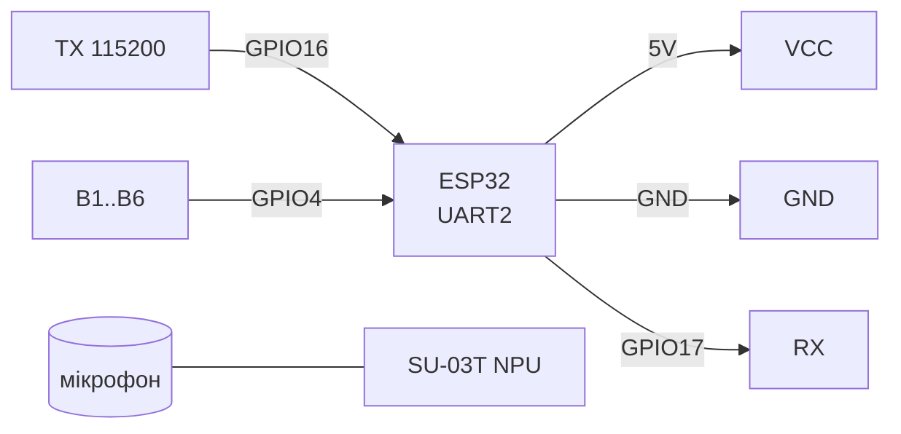

# LD2410 радар / DWM1000 UWB / VS1838 IR / SU-03T голос - сенсори присутності та керування

> [!info] Призначення
> Нотатка про «невидимі» канали: **LD2410** (mmWave-радар 24 ГГц - бачить присутність людини навіть без руху, на відміну від PIR), **DWM1000** (UWB - точна дальність/позиціонування до ±10 см), **VS1838** (ІЧ-приймач 38 кГц - пульт ДК через RMT), **SU-03T** (голосове керування офлайн - команди без інтернету). Спільне: виявляють людину/команду і будять або командують ESP32.

Характеристики (порівняльна таблиця):

| Модуль | Принцип | Інтерфейс | Живлення | Дальність | Особливості |
| --- | --- | --- | --- | --- | --- |
| LD2410 (HLK) | FMCW радар 24 ГГц | UART 256000 (конфіг) + OUT (присутність) | 5V (всередині LDO 3.3V) | 0.75-6 м, гейти по 0.75 м | Розрізняє рух/статика, чутливість по гейтах 0-100 |
| DWM1000 (Decawave) | UWB 3.5-6.5 ГГц, TWR | SPI + RST/IRQ | 3.3V | до 100 м (пряма видимість), точність ±10 см | Потрібні 2+ модулі (tag + anchor), антена на платі |
| VS1838B | ІЧ-фотоприймач 38 кГц | Цифровий OUT | 3.3V (або 5V з дільником OUT) | 5-10 м (з пультом) | Демодулятор всередині; ESP32 RMT декодує NEC/RC5 |
| SU-03T | Голосовий AI (NPU офлайн) | UART 115200 + GPIO-виходи | 5V | Мікрофон 3-5 м | Прошивка команд через WiseLight; відповідь синтезом/пінами |

Навігація: UART [[04-Shini/01-UART|UART]], SPI [[04-Shini/02-SPI|SPI]], I2C [[04-Shini/03-I2C|I2C]], живлення [[02-Zhivlennya/01-Lancjugi-zhivlennya]], радіомодулі [[12-Moduli-zvyazku/02-NRF24-LoRa]], старт [[Home]].

## Призначення

LD2410 радар / DWM1000 UWB / VS1838 IR / SU-03T голос - сенсори присутності та керування - LD2410 mmWave-радар присутності (UART + OUT); Легенда пінів модуля LD2410; ASCII-схема. LD2410 радар / DWM1000 UWB / VS1838 IR / SU-03T голос - сенсори присутності та керування. Навігація: UART [[04-Shini/01-UART|UART]], SPI [[04-Shini/02-SPI|SPI]], I2C [[04-Shini/03-I2C|I2C]], живлення [[02-Zhivlennya/01-Lancjugi-zhivlennya]], радіомодулі 12-Moduli-zvyazku/02-NRF24-LoRa, старт Home.

## 1. LD2410 mmWave-радар присутності (UART + OUT)

Головна фішка: бачить **нерухому** людину (дихання), де PIR сліпне. Вихід **OUT** = HIGH коли хтось у зоні (можна без UART взагалі - як PIR). Тонке налаштування - по UART 256000 протоколом HLK (мобільний застосунок через BLE-версію LD2410B або `ld2410` tool): гейти 0-8 (кожен 0.75 м), чутливість руху/статики 0-100, затримка утримання.

![[assets/img/ld2410-scheme.png|500]]
*Рис. LD2410 - живлення 5V, OUT на GPIO як PIR, UART для конфігурації гейтів.*

### Легенда пінів модуля LD2410

| Пін | Тип | Куди | Примітка |
| --- | --- | --- | --- |
| VCC 5V | Живлення вхід | 5V | 5V стабільно; струм ~80 мА; ripple просаджує чутливість - електроліт 220 мкФ біля VCC |
| GND | Земля | GND | Спільна земля |
| OUT (OT1) | Вихід цифра 3.3V | GPIO4 (будь-який, з перериванням) | HIGH = присутність; можна працювати взагалі без UART - як PIR-датчик |
| RX | Вхід UART | GPIO17 (TX2) | Швидкість 256000 для конфігурації; у робочому режимі можна NC |
| TX | Вихід UART | GPIO16 (RX2) | Протокол HLK-кадрів (див. код); у простому режимі NC |
| SDA / SCL | I2C (резерв) | NC | На стандартній прошивці не використовуються |

Налаштування гейтів (приклад для кімнати 4 м): гейти 0-1 (0-1.5 м) чутливість руху 80/статики 60; гейти 5-8 (далеко за стіною) - 0 (відсікти сусідів!). Затримка unmanned delay 30-60 с проти блимання.

### ASCII-схема

```text
ESP32 DevKit              LD2410
─────────────              ──────
5V ─────────────────────►  VCC 5V (+220мкФ!)
GND ────────────────────   GND
GPIO4 ◄─────────────────   OUT (HIGH=присутність, як PIR)
GPIO17 (TX2) ──────────►   RX (256000, тільки для конфігу)
GPIO16 (RX2) ◄──────────   TX (256000, тільки для конфігу)

Мінімум (без конфігу): VCC + GND + OUT → GPIO4. Готово!
Радар вішати вертикально, чіпом від стіни, метал позаду — екран.
```

### Mermaid



## 2. DWM1000 UWB-позиціонування (SPI, TWR)

UWB-модуль Decawave DW1000: вимірює **час прольоту** радіоімпульсу (Two-Way Ranging) і дає дальність з точністю ~10 см. Мінімальна система: 1 tag (на об'єкті) + 1 anchor (база) = дальність; 3-4 anchor = 2D/3D-позиція (трилатерація). Бібліотеки Arduino: `thotro/arduino-dw1000`, `Makerfabs DW1000_Ranging`.

> [!warning] UWB чутливий до живлення: ripple 3.3V >50 мВ погіршує точність. Окремий LDO + ферит + 100 нФ біля VCC.

### Легенда пінів модуля DWM1000

| Пін | Тип | Куди | Примітка |
| --- | --- | --- | --- |
| VCC 3.3V | Живлення вхід | 3V3 (окремий LDO рекомендовано) | Тільки 3.3V; струм TX до 150 мА імпульсно; ферит + 100 нФ |
| GND | Земля | GND | Коротка, товста; спільна площина з антеною - не різати полігон |
| SCK | Вхід SPI | GPIO18 | SPI до 20 МГц; дроти <10 см (UWB чутливий до джитера!) |
| MOSI | Вхід SPI | GPIO23 | VSPI MOSI |
| MISO | Вихід SPI | GPIO19 | VSPI MISO |
| CS | Вхід SPI | GPIO5 | Chip select |
| RST (RSTn) | Вхід, active low | GPIO15 | Апаратний reset: LOW 10 мс при старті |
| IRQ | Вихід | GPIO4 | Переривання RX/TX done - обов'язково для TWR-таймінгів |
| WAKEUP | Вхід | NC / 3V3 | Для сну; у базовому прикладі NC |
| ANT | Вбудована антена | Вільний простір! | Не закривати металом/рукою; орієнтація модулів однакова; відстань від ESP32-антени ≥5 см |

### ASCII-схема

```text
ESP32 DevKit              DWM1000
─────────────              ───────
3V3 (LDO!) ─────────────►  VCC 3.3V (+100нФ + ферит!)
GND ────────────────────   GND
GPIO18 (SCK) ───────────►  SCK (SPI <10см!)
GPIO23 (MOSI) ──────────►  MOSI
GPIO19 (MISO) ◄──────────  MISO
GPIO5 (CS) ─────────────►  CS
GPIO15 ─────────────────►  RST (LOW 10мс при старті)
GPIO4 ◄─────────────────   IRQ (обов'язково!)
                           [вбудована UWB-антена → вільний простір]
```

### Mermaid



## 3. VS1838 ІЧ-приймач (38 кГц, RMT)

Три піни: живлення, земля, демодульований OUT (active low). ESP32 приймає NEC-кадри через **RMT-периферію** (бібліотека `IRremoteESP8266` або `Arduino-IRremote` з RMT). Дальність залежить від пульта і кута (±45°).

### Легенда пінів модуля VS1838

| Пін | Тип | Куди | Примітка |
| --- | --- | --- | --- |
| VCC | Живлення вхід | 3V3 (рекоменд.) або 5V | Від 3.3V OUT-рівень безпечний безпосередньо; при 5V - OUT 5V → дільник 1к/2к на GPIO! |
| GND | Земля | GND | Спільна земля |
| OUT (S) | Вихід цифра, active low | GPIO13 (RMT-вхід, будь-який) | У спокої HIGH, посилки - пачки LOW 38 кГц; pull-up 10к до VCC (часто вже на платі) |

> [!tip] VS1838 сліпне від ламп денного світла і сонця (ІЧ-шум 100 Гц). Ставити в тінь, додати програмний дебаунс повторів NEC (адреса+команда+інверсія).

### ASCII-схема

```text
ESP32 DevKit              VS1838
─────────────              ──────
3V3 ────────────────────►  VCC (3.3V — OUT безпечний!)
GND ────────────────────   GND (середня нога!)
GPIO13 ◄────────────────   OUT (RMT-вхід, pull-up 10к)
                           "віконце" → у бік пульта, не на сонце!

Цоколівка фронтально (кулькою до себе): зліва OUT, середина GND, справа VCC!
У модулів-Keyes порядок на платі підписаний: VCC-GND-OUT (перевірити шовкографію!).
```

### Mermaid



## 4. SU-03T голосове керування (UART, офлайн)

Модуль з NPU: розпізнає закладені команди без інтернету («включи світло», «відкрий ворота»). Прошивка команд - у середовищі **WiseLight** (ключові слова + відповіді + GPIO-дії). З ESP32 спілкується по UART (рядок розпізнаної команди) або готовими GPIO-виходами (B1-B6 HIGH-імпульс).

### Легенда пінів модуля SU-03T

| Пін | Тип | Куди | Примітка |
| --- | --- | --- | --- |
| VCC 5V | Живлення вхід | 5V | 5V, ~150 мА; чутливий до шуму БЖ - окремий LDO/електроліт 470 мкФ |
| GND | Земля | GND | Спільна земля |
| TX | Вихід UART | GPIO16 (RX2) | 115200 8N1; формат: `+ASR: команда\r\n` (залежить від прошивки WiseLight) |
| RX | Вхід UART | GPIO17 (TX2) | Команди синтезу відповіді / керування з ESP32 |
| B1-B6 (GPIO) | Виходи, HIGH-імпульс | GPIO4/13/... (опційно) | Пряме керування реле без ESP32-парсингу: кожній команді - свій пін |
| MIC+/MIC− | Аналог | Штатний MEMS-мікрофон | Не подовжувати дроти мікрофона! Модуль ближче до джерела голосу |

### ASCII-схема

```text
ESP32 DevKit              SU-03T
─────────────              ──────
5V ─────────────────────►  VCC 5V (+470мкФ!)
GND ────────────────────   GND
GPIO16 (RX2) ◄──────────   TX (115200, "+ASR: ...")
GPIO17 (TX2) ──────────►   RX
GPIO4 ◄─────────────────   B1 (HIGH-імпульс команди 1, опційно)
                           MIC → штатний мікрофон (не подовжувати!)
```

### Mermaid



## Код - присутність / дальність / ІЧ / голос

### Arduino (LD2410 - OUT як PIR + UART-конфіг читання кадру)

```cpp
// Простий режим: OUT -> GPIO4
#define RADAR_OUT 4
void setup() {
  Serial.begin(115200);
  pinMode(RADAR_OUT, INPUT);
}
void loop() {
  Serial.println(digitalRead(RADAR_OUT) ? "Присутність!" : "Порожньо");
  delay(500);
}
```

```cpp
// Розширений: читання HLK-кадрів LD2410 (256000 бод, інженерний режим)
void setup() {
  Serial.begin(115200);
  Serial2.begin(256000, SERIAL_8N1, 16, 17); // RX=16 TX=17
  // Увімкнути інженерний режим: F4 F3 F2 F1 0E 00 62 00 ... (див. мануал HLK)
}
void loop() {
  // Кадр: F4 F3 F2 F1 LEN(2) TYPE(2) DATA... CRC F8 F7 F6 F5
  // Інженерний тип 0x01: рух-дальність, статика-дальність, енергії гейтів.
  // Для продакшену візьміть бібліотеку ld2410 (ncmreynolds) — парсинг готовий.
  while (Serial2.available()) Serial.printf("%02X ", Serial2.read());
  Serial.println(); delay(200);
}
```

### Arduino (VS1838 - IRremoteESP8266 + RMT)

```cpp
#include <IRremoteESP8266.h>
#include <IRrecv.h>
#include <IRutils.h>
#define IR_PIN 13
IRrecv ir(IR_PIN);
decode_results res;
void setup() {
  Serial.begin(115200);
  ir.enableIRIn(); // RMT під капотом на ESP32
}
void loop() {
  if (ir.decode(&res)) {
    Serial.println(resultToHumanReadableBasic(&res)); // протокол + код NEC
    ir.resume();
  }
}
```

### Arduino (DWM1000 - ranging, бібліотека arduino-dw1000)

```cpp
// Потрібна бібліотека thotro/arduino-dw1000. Піни: CS=5, RST=15, IRQ=4.
#include <DW1000.h>
void setup() {
  Serial.begin(115200);
  SPI.begin(18, 19, 23, 5);
  DW1000.begin(5, 15, 4);
  DW1000.configureAsTag(); // повний конфіг (адреса, канал, PRF) — див. RangingTag
  Serial.println("DWM1000 tag ready");
}
```

> [!warning] Код вище - каркас: повний TWR-приклад беріть з `examples/RangingTag` / `RangingAnchor` бібліотеки (там же конфіг каналу 5, PRF 64 МГц, преамбула 128). Tag і Anchor - різні прошивки на двох ESP32!

### ESP-IDF (LD2410 OUT + RMT NEC-декодер, концепт)

```c
#include "driver/gpio.h"
#include "driver/rmt_rx.h"
#define RADAR_OUT 4
#define IR_PIN 13
void app_main(void) {
    gpio_set_direction(RADAR_OUT, GPIO_MODE_INPUT);
    // RMT RX-канал для NEC: resolution 1 МГц, min duration фільтр 100 нс.
    // rmt_new_rx_channel() + rmt_new_copy_encoder... повний приклад:
    // examples/peripherals/rmt/rmt_rx_nec в ESP-IDF.
    while (1) {
        int present = gpio_get_level(RADAR_OUT);
        // TODO: опублікувати present по MQTT / увімкнути світло.
        vTaskDelay(pdMS_TO_TICKS(500));
    }
}
```

### MicroPython (LD2410 OUT + VS1838 polling + SU-03T UART)

```python
from machine import Pin, UART
import time
radar = Pin(4, Pin.IN)          # LD2410 OUT
ir = Pin(13, Pin.IN)            # VS1838 OUT (спрощено: детект посилки)
voice = UART(2, baudrate=115200, rx=16, tx=17)  # SU-03T
last = 0
while True:
    if radar.value():
        print("Радар: присутність")
    if ir.value() == 0 and time.ticks_ms() - last > 300:
        last = time.ticks_ms()
        print("ІЧ: посилка (декодування — по RMT/IR-библіотеці)")
    if voice.any():
        print("Голос:", voice.readline().decode(errors="ignore").strip())
    time.sleep_ms(200)
```

### HB100: доплер 10 ГГц за $3 (дід усіх радарів)

| Параметр | HB100 | RCWL-0516 | LD2410 |
| --- | --- | --- | --- |
| Частота | 10.525 ГГц (доплер!) | ~3 ГГц доплер | 24 ГГц FMCW |
| Вихід | Аналоговий IF (мікровольти!) | Цифровий тригер | UART + гейти |
| Підсилення | Потрібен ОУ (LM358 ×1000) | Вбудовано | Вбудовано |
| Що вміє | Тільки РУХ (швидкість!), відстані немає | Рух крізь стіни | Рух + відстань + нерухомі |
| Коли | Радіоаматорство, навчання доплеру | Дешевий тригер | Все інше |

```text
HB100 + LM358: IF → компаратор → GPIO-переривання ESP32.
Чутливість гвинтом на модулі; дощ/гойдання дерев — хибні спрацювання (як у всіх доплерів!).
Для продакшену — LD2410: той самий цінник, але з відстанню і фільтрами.
```

### LD2410C / HLK-LD2420 - молодші брати

| Параметр | LD2410 | LD2410C | HLK-LD2420 |
| --- | --- | --- | --- |
| Формат | Модуль з антенами на платі | Компактна версія, менша плата | Мінімалістичний, дешевший |
| Керування | OUT + UART 256000 | OUT + UART (спрощений протокол) | OUT + UART |
| Гейти | 0-8 з чутливістю руху/статики | Скорочений набір | Базовий поріг + затримка |
| Коли брати | Повний контроль зон | Тісні корпуси, ціна | Простий тригер присутності |

```text
ESP32 GPIO4 ◄── OUT LD2410C/LD2420 (HIGH=присутність, як PIR)
5V ──► VCC (+100мкФ), GND спільна
```

> Усі три - одна родина HLK: OUT-логіка сумісна, UART-протоколи відрізняються деталями - конфіг-утиліту брати під конкретну модель.

![[assets/img/ld2410c-out-scheme.png|500]]
*Рис. LD2410C/LD2420: мінімум VCC+GND+OUT, UART лише для конфігурації.*

## Типові помилки

| # | Симптом | Причина | Виправлення |
| --- | --- | --- | --- |
| 1 | LD2410 бачить сусідів за стіною | Заводська чутливість 100 на всіх гейтах | Занулити далекі гейти (5-8 → 0), встановити дистанцію max 3-4 м, unmanned delay 30 с |
| 2 | LD2410 блимає присутність/порожньо | Вентилятор/штора гойдається; БЖ-ripple | Прибрати рухомі предмети з променя; електроліт 220 мкФ; збільшити delay |
| 3 | LD2410 не відповідає по UART | Швидкість не 256000; переплутані RX/TX | `Serial2.begin(256000, SERIAL_8N1, 16, 17)`; поміняти місцями; OUT при цьому працює і без UART |
| 4 | DWM1000 `init fail` / дальність стрибає ±2 м | Довгі SPI-дроти; ripple живлення; антена закрита | SPI <10 см; окремий LDO + ферит; вільний простір навколо антени; однакова орієнтація пари |
| 5 | DWM1000 дає 0 м завжди | Tag говорить з Tag (немає Anchor) / різні конфіги каналу | Прошити пару Tag+Anchor з прикладів; однакові channel/PRF/preamble на обох |
| 6 | VS1838 ловить фантоми / не бачить пульт | Люмінесцентні лампи/сонце; сілий OUT без pull-up; пульт не NEC | Затінити датчик; pull-up 10к; вивести `resultToHumanReadableBasic` - дізнатись протокол пульта |
| 7 | VS1838 мовчить | Цоколівка переплутана (OUT/GND/VCC) | Звірити шовкографію плати Keyes (VCC-GND-OUT), а не «голий» даташит |
| 8 | SU-03T не розпізнає | Шумний БЖ; мікрофон далеко/подовжено; немає прошивки команд | Окреме живлення + 470 мкФ; модуль ближче до користувача; прошити WiseLight-словник українською |
| 9 | LD2410C/LD2420 конфігурять утилітою від LD2410 | Протоколи схожі, але не ідентичні | Утиліта/бібліотека строго під свою модель; OUT-режим - універсальний |

![[assets/img/radar-uwb-ir-voice-scheme.png|500]]
*Рис. Загальна схема: LD2410 OUT + VS1838 RMT + SU-03T UART + DWM1000 SPI на одному ESP32.*

## Офіційні джерела

- [HLK-LD2410 - виробник (Hi-Link)](https://www.hlktech.net/index.php?id=988) - мануал, фото, гейти 0-8.
- [LD2410 + ESP32 - туторіал з кодом](https://how2electronics.com/ld2410-sensor-with-esp32-human-presence-detection/) - бібліотека ld2410.h, дистанція/енергія.
- [LD2410 - ESPHome](https://esphome.io/components/sensor/ld2410.html) - YAML-конфіг, калібрування порогів гейтів.
- DWM1000 (Qorvo/Decawave), VS1838, SU-03T - *перевірити вручну* (єдиних сторінок вендорів для модулів немає).

- LD2410B Datasheet (Hi-Link, пошук PDF): [LD2410B search](https://www.alldatasheet.com/view.jsp?Searchword=LD2410B) - радар + BLE.

## Див. також

- [[04-Shini/01-UART|UART]] - UART2 для LD2410/SU-03T, швидкості 256000/115200
- [[04-Shini/02-SPI|SPI]] - VSPI для DWM1000, вимоги до довжини
- [[04-Shini/03-I2C|I2C]] - шини датчиків (резервні інтерфейси)
- [[02-Zhivlennya/01-Lancjugi-zhivlennya]] - LDO, ферити, електроліти для радіо
- [[12-Moduli-zvyazku/01-RC522-RFID]] - антенні практики (метал, орієнтація)
- [[12-Moduli-zvyazku/02-NRF24-LoRa]] - радіодальність, порівняння з UWB
- [[Home]] - стартова сторінка довідника
