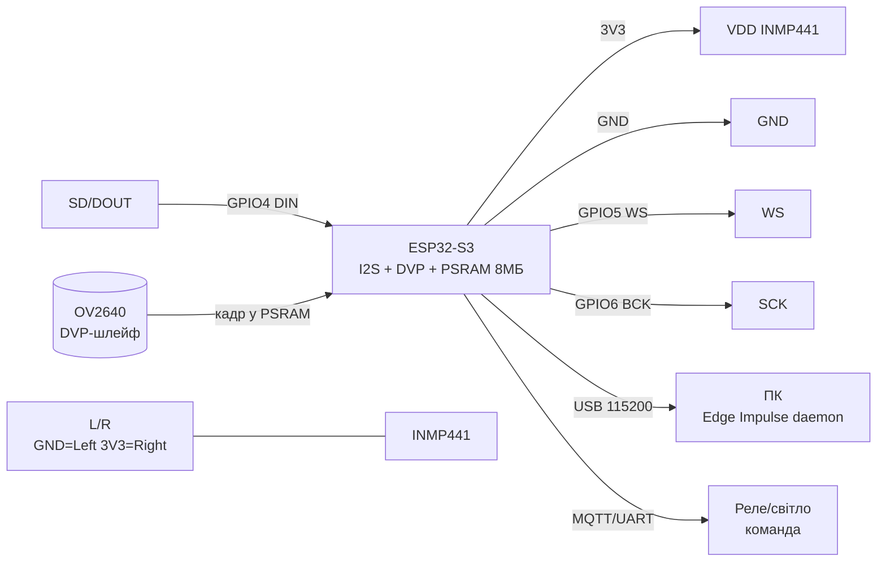

# TinyML та голос на ESP32 - Edge Impulse, TFLite-Micro, ESP-DL, ESP-WHO, ESP-SR

> [!info] Призначення
> Нотатка про машинне навчання прямо на ESP32: **Edge Impulse** (збір даних → impulse → deploy), **TFLite-Micro** (person detection, micro_speech, арена пам'яті), **ESP-DL** (EfficientNet-розпізнавання), **ESP-WHO** (детекція облич на камері), **ESP-SR** (wake word «Hi ESP» + офлайн-команди, мікрофонна матриця INMP441, AEC/VAD). Все працює офлайн, без хмари - критично для приватності та затримки.

## Призначення

Коротко: запускати нейромережі на мікроконтролері - звук (ключові слова, команди), зір (людина, обличчя), сенсори (аномалії вібрації/струму). Типові задачі: голосовий вимикач «Hi ESP - увімкни світло», камера-дзвінок з детекцією людини, предиктивне обслуговування насоса за вібрацією.

| Параметр | Значення |
| --- | --- |
| Інтерфейс | I2S (мікрофон INMP441), DVP/SPI (камера OV2640), UART - результат |
| Живлення модуля | 3.3V (мікрофон, камера), ESP32-S3 плата через USB 5V |
| Рівень сигналів | 3.3V (обов'язково для ESP32) |
| Сумісність | ESP32 / S3 / P4 (S3 - основний для TinyML: векторні інструкції, PSRAM) |

Навігація: I2S [[04-Shini/04-I2S|I2S]], ADC [[06-Analog/01-ADC|ADC]], залізо S3 [[01-Hardware/03-ESP32-S3]], голосовий модуль [[12-Moduli-zvyazku/08-LD2410-UWB-IR-Voice]], старт [[Home]].

## Характеристики

| Фреймворк / модель | Що робить | Пам'ять (типово) | Залізо | Примітка |
| --- | --- | --- | --- | --- |
| Edge Impulse (impulse) | Конвеєр: дані → DSP-блок → нейроблок → deploy | Залежить від impulse (100-500 КБ flash) | ESP32 / S3 + PSRAM | Deploy як Arduino-lib або IDF-компонент |
| TFLite-Micro micro_speech | Ключові слова «yes/no» за MFCC | Арена ~50-100 КБ, модель ~20-40 КБ int8 | Будь-який ESP32 | Приклад-еталон TinyML |
| TFLite-Micro person detection | Людина в кадрі 96×96 grayscale | Арена ~200-300 КБ, модель ~250 КБ int8 | ESP32-S3 + камера + PSRAM | Потрібна камера OV2640/GC0308 |
| ESP-DL EfficientNet-розпізнавання | Класифікація/детекція (cat, YOLO) | 300 КБ - 2 МБ (PSRAM) | S3 / P4 | Квантування w8a8/w8a16, прискорення SIMD |
| ESP-WHO | Детекція + розпізнавання облич на камері | ~500 КБ - 1.5 МБ (PSRAM обов'язково) | S3 / S3-EYE / P4 | Камера + дисплей, асинхронний пайплайн |
| ESP-SR WakeNet (Hi ESP) | Wake word «Hi ESP» завжди слухає | ~200-400 КБ (PSRAM рекомендовано) | S3 / P4 (частково C3/C6 спрощено) | WakeNet9/10, моделі `_hiesp` |
| ESP-SR MultiNet | До 300 офлайн-команд (EN/CN) | ~500 КБ - 1 МБ | S3 / P4 | Без перенавчання - список команд |
| ESP-SR AFE (AEC/VAD) | Ехопригнічення, детектор голосу, шумопригнічення | +100-200 КБ | S3 / P4, 1-2 мікрофони | AFE обов'язковий з динаміком поруч |

> [!warning] Вимоги PSRAM
> Без PSRAM TinyML-зір майже неможливий: кадр 640×480 займає ~300 КБ, арена моделі - ще 200-500 КБ, а внутрішніх ~320 КБ SRAM не вистачить. Беріть **ESP32-S3 з Octal PSRAM 8 МБ** (S3-EYE, S3-Korvo-2, DevKitC-S3 + PSRAM). У `menuconfig` увімкніть `PSRAM → Octal`, `Tensor arena in PSRAM`, `Camera frame buffer in PSRAM`. Перевірка: `heap_caps_get_free_size(MALLOC_CAP_SPIRAM)` має показати мегабайти.

![[assets/img/tinyml-voice-scheme.png|600]]
*Рис. TinyML-стенд: мікрофон INMP441 по I2S + камера OV2640 + ESP32-S3 з PSRAM → wake word / команди / детекція людини.*

## 1. Edge Impulse workflow (збір даних → impulse → deploy)

Edge Impulse - веб-платформа, що ховає складність навчання: завантажуєте семпли, будуєте impulse (DSP + NN), натискаєте Deploy.

Кроки:

1. **Збір даних:** телефоном (аудіо 1 с @16 кГц) або тим же ESP32 (`edge-impulse-daemon`, приклад `esp32-microphone-continuous`). Класи: `hiesp`, `noise`, `unknown`. Мінімум 20-30 хв сумарно, різні диктори, різні кімнати + шум!
2. **Impulse:** Input (MFCC/MFE: frame 0.02/0.01, 40 фільтрів) → Neural Network (2×conv1d 8/16 нейронів + dropout 0.25) → Output (класи). Для ESP32 тримайте модель <100 КБ.
3. **EON Tuner:** автоматичний пошук компромісу точність/RAM/латентність під S3.
4. **Deploy:** `Arduino library` (ZIP → `ei-<project>-arduino-1.0.zip`) або `Espressif ESP-IDF component` (клон + `idf.py add-dependency`). Отримуєте `run_classifier()` + приклад `esp32_microphone`.

> [!tip] Датасет - 80% успіху
> Шум вбиває точність швидше за будь-яку архітектуру: записуйте негативний клас `noise` (кухня, вулиця, телевізор, дитячий плач), інакше кожен шурхіт буде «Hi ESP». Додайте unknown-клас з 10+ слів-схожих («hi nest», «his»). Баланс класів ±20%.

## 2. TFLite-Micro (person detection, micro_speech, пам'ять арени!)

TFLite-Micro (тепер LiteRT for Microcontrollers) - інференс без ОС: модель як C-масив, один статичний буфер-арена на все.

Ключове поняття - **арена**: `constexpr int kArenaSize = 100 * 1024; uint8_t arena[kArenaSize];`. Усередині живуть вхідні/вихідні/проміжні тензори. Мало - `AllocateTensors() failed / Didn't find op`. Багато - немає де жити камері. Правило: почніть з прикладу (micro_speech 50 КБ, person_detection 300 КБ), додайте 20% запасу, покладіть арену в PSRAM (`EXT_RAM_ATTR` або `heap_caps_malloc(MALLOC_CAP_SPIRAM)`).

Приклади з коробки (`tensorflow/lite/micro/examples`):

- **micro_speech** - мікрофон → MFCC → детект «yes/no», вихід - ймовірності класів;
- **person_detection** - камера 96×96 grayscale → person_score 0-255, поріг ~200;
- **hello_world** - синус за нейромережею (перевірка тулчейну).

Квантування обов'язкове: float32-модель 1 МБ → int8 ~250 КБ + прискорення ×2-4 на S3 (SIMD). Конвертація TFLiteConverter з `optimizations = [Optimize.DEFAULT]`, репрезентативний датасет 100+ семплів.

## 3. ESP-DL (EfficientNet-розпізнавання)

ESP-DL - нативний фреймворк Espressif: завантаження/квантування/запуск моделей у форматі `.espdl` (FlatBuffers, zero-copy). Підтримує змішане квантування w8a8/w16a16/w8a16 (комбінувати шари - точність + швидкість), статичний планувальник пам'яті (сам розкладає шари по internal/PSRAM), dual-core Conv2D.

Model Zoo (`esp-dl/models`): MobileNetV2, EfficientNet, YOLO11n/YOLO26, ESPDet-Pico (детекція кота 224×224 - стартовий приклад!), PP-OCRv6. Кожна модель - готовий IDF-компонент.

Конвеєр своєї моделі: PyTorch/TF → ONNX → `esp-ppq` квантування (перевірити підтримку операторів у `operator_support_state.md`!) → `.espdl` → `dl::Model` + `dl::Tensor` → `model->run()`.

> [!tip] ESP-DL vs TFLite-Micro
> Нова розробка під S3/P4 - беріть ESP-DL (швидше, менше RAM, підтримка Espressif). TFLite-Micro - для портованості (Arduino-приклади, крос-платформа) і навчання.

## 4. ESP-WHO (детекція облич на камері)

ESP-WHO - прикладна платформа поверх ESP-DL: детекція облич, розпізнавання облич, детекція пішохода, QR. Камера і нейромережа працюють **асинхронно** (поки модель рахує кадр N, драйвер вже знімає N+1) - звідси fps ×1.5-2 проти послідовного коду.

Плати: ESP32-S3-EYE (камера + мікрофон + дисплей ST7789), S3-Korvo-2 (мікрофонна матриця + динамік), P4-Function-EV (LCD + SD). Збірка: `export IDF_EXTRA_ACTIONS_PATH=.../esp-who/tools`, `idf.py -DSDKCONFIG_DEFAULTS=sdkconfig.bsp.esp32_s3_eye set-target esp32s3`, `flash monitor`.

Практичний сценарій: детекція людини → зберегти JPEG на SD → MQTT-сповіщення; розпізнавання облич - реєстрація 3-5 ракурсів на людину при рівному світлі, інакше false reject.

## 5. ESP-SR (wake word «Hi ESP» + офлайн-команди, INMP441, AEC/VAD)

ESP-SR - мовний стек: Audio Front-End (AFE) → WakeNet → MultiNet → (опційно) синтез відповіді.

- **WakeNet:** завжди слухає «Hi ESP» (`wn9_hiesp` / `wn10_hiesp`). WakeNet9s - полегшена версія без PSRAM (C3/C5). Кастомний wake word - через TTS Pipeline v3 (наговорити 100+ варіантів темп/голос/шум) або замовлення у Espressif.
- **MultiNet:** після пробудження слухає команду зі списку (до 300: «увімкни світло», «відкрий ворота»). Моделі `mn7_en` / `mn7_cn` під S3/P4.
- **AFE:** AEC (acoustic echo cancellation - віднімає свій же динамік, критично для full-duplex), VAD/VADNet (детектор голосової активності - відсікає тишу/шум), BSS (розділення джерел для 2 мікрофонів), NS/NSNet (нейропригнічення шуму). Без AFE в кімнаті з телевізором точність падає в 2-3 рази.
- **Мікрофонна матриця INMP441:** цифровий MEMS з I2S-виходом (не аналоговий MAX9814 - менше шуму!). Один - команди до 3-5 м; два - beamforming + DOA (напрямок на голосника). Лінія WS/LRCLK/BCK - коротка (<10 см), земля - зіркою.

## Легенда пінів модуля INMP441 (I2S-мікрофон)

| Пін INMP441 | Тип | Куди на ESP32-S3 | Примітка |
| --- | --- | --- | --- |
| VDD | Живлення вхід | 3V3 | Тільки 3.3V! Струм ~2 мА; 100 нФ до GND біля модуля |
| GND | Земля | GND | Коротка, спільна з ESP32; не вести повз DC-DC |
| SD (DOUT) | Вихід дані I2S | GPIO4 (I2S DIN) | Цифровий потік 16 кГц/24 біт; підтяжка не потрібна |
| WS (LRCL) | Вхід кадр | GPIO5 (I2S WS) | 16 кГц; довжина <10 см |
| SCK (BCK) | Вхід біт-клок | GPIO6 (I2S BCK) | ~1 МГц; кручена пара з GND при довжині >5 см |
| L/R | Вибір каналу | GND = Left, 3V3 = Right | Два мікрофони: один на GND, другий на 3V3 → стерео-матриця |

Камера OV2640 (для ESP-WHO/person detection) підключається окремим шлейфом DVP (XCLK GPIO10, PCLK GPIO13, D0-D7, SIOD/SIOC) - див. нотатку камери [[12-Moduli-zvyazku/04-RS485-CAN-Ethernet-Kamera]].

## Схема підключення

| ESP32-S3 DevKit | INMP441 | Камера OV2640 | Примітка |
| --- | --- | --- | --- |
| 3V3 | VDD | DVDD (через LDO камери) | Загальний струм <500 мА з USB |
| GND | GND | GND | Спільна земля, зірка |
| GPIO4 | SD | - | I2S DIN |
| GPIO5 | WS | - | I2S WS |
| GPIO6 | SCK | - | I2S BCK |
| DVP-роз'єм | - | XCLK/PCLK/D0-D7 | Шлейф коротко, без перегинів |
| GPIO16 (RX2) | - | - | Лог UART для Edge Impulse `daemon` |

> [!warning] 3.3V логіка!
> INMP441 живиться тільки від 3.3V. L/R на 3V3 - через резистор 10к (не безпосередньо на 5V!). I2S-лінії 5V-входу не переживуть.

### ASCII-схема

```text
ESP32-S3 DevKit                 INMP441 (I2S-мікрофон)
─────────────                 ───────────────────────
3V3 ────────────────────────►  VDD (+100нФ до GND!)
GND ─────────────────────────  GND (коротко, зірка)
GPIO4 (I2S DIN) ◄────────────  SD (DOUT, 16кГц/24біт)
GPIO5 (I2S WS) ─────────────►  WS
GPIO6 (I2S BCK) ─────────────► SCK (~1МГц, <10см!)
GND ─────────────────────────  L/R (GND=Left; 2-й мік: 3V3=Right)

ESP32-S3 ──DVP-шлейф──► OV2640 (XCLK/PCLK/D0-D7, кадр у PSRAM!)
ESP32-S3 USB ──► ПК (Edge Impulse daemon / лог, 115200)

Два мікрофони (матриця): SD обох паралельно на GPIO4,
L/R: мік1→GND (Left), мік2→3V3 (Right) → beamforming+DOA.
```

### Mermaid



## Код ESP-IDF (ESP-SR wake word + команда, концепт)

```c
#include "esp_err.h"
#include "esp_sr.h"
// Приклад ESP-SR v2: AFE + WakeNet(Hi ESP) + MultiNet(EN). Повний код:
// esp-sr/examples/speech_recognition/.
#define I2S_WS 5
#define I2S_BCK 6
#define I2S_DIN 4
void app_main(void) {
    // 1. AFE: 1 мікрофон, 16 кГц, AEC+VAD+NS увімкнено.
    //    afe_config (sample_rate 16000, mic_num 1, afe_periph_task_core 1).
    // 2. WakeNet: модель wn10_hiesp (w8a16), поріг ~0.7.
    // 3. Цикл: afe_fetch() -> wakenet_detect() -> якщо Hi ESP:
    //    multinet_recognize() -> команда ("turn on light") -> GPIO/реле.
    // PSRAM: sdkconfig → SPIRAM Octal, arena/models у PSRAM!
    // Деталі структур: esp-sr/docs + приклад speech_recognition.
}
```

## Код Arduino (Edge Impulse deploy + TFLite-Micro micro_speech)

```cpp
// Варіант A: Edge Impulse Arduino-lib (після Deploy → ZIP → Add .ZIP Library).
#include "ei-project-library.h"  // замініть на ім'я свого проєкту
#include <driver/i2s.h>
#define I2S_WS 5
#define I2S_BCK 6
#define I2S_DIN 4
void setup() {
  Serial.begin(115200);
  // I2S 16 кГц/16 біт/моно для INMP441; буфер 1 с = 16000 семплів.
  // ei_microphone_init(); // з прикладу esp32_microphone (Edge Impulse).
}
void loop() {
  // signal_t s; ei_microphone_get_data(...,&s);
  // ei_impulse_result_t res; run_classifier(&s, &res, false);
  // if (res.classification[0].value > 0.8) Serial.println("Hi ESP!");
  delay(50);
}
```

```cpp
// Варіант B: TFLite-Micro micro_speech — увага на АРЕНУ!
#include "tensorflow/lite/micro/micro_interpreter.h"
#include "tensorflow/lite/micro/micro_mutable_op_resolver.h"
// Модель згенерувати: xxd -i model.tflite > model_data.cc (g_model_data[]).
extern const unsigned char g_model_data[];
constexpr int kArenaSize = 100 * 1024;  // micro_speech: 50-100КБ!
// Арену в PSRAM: EXT_RAM_ATTR static uint8_t arena[kArenaSize];
static uint8_t arena[kArenaSize];
void setup() {
  Serial.begin(115200);
  // tflite::MicroMutableOpResolver<8> resolver; + AddDepthwiseConv2D...
  // tflite::MicroInterpreter interp(model, resolver, arena, kArenaSize);
  // if (interp.AllocateTensors() != kTfLiteOk) Serial.println("Арена мала!");
}
void loop() {
  // MFCC з I2S-буфера -> interp.input(0) -> Invoke() -> output "yes/no".
}
```

## Код MicroPython (збір семплів 16 кГц + інференс-заглушка)

```python
# MicroPython: повноцінний інференс НЕ тягне — збираємо датасет для Edge Impulse
# і шлемо на ПК, або викликаємо заморожену модель через ulab (спрощено).
from machine import I2S, Pin
import time
# INMP441: WS=5, BCK=6, DIN=4, 16 кГц, 16 біт, моно
i2s = I2S(0, sck=Pin(6), ws=Pin(5), sd=Pin(4),
          mode=I2S.RX, bits=16, format=I2S.MONO, rate=16000, ibuf=4096)
buf = bytearray(32000)  # 1 с @16кГц/16біт
for i in range(10):
    n = i2s.readinto(buf)
    with open("/sample_%d.raw" % i, "wb") as f:
        f.write(buf[:n])
    print("Семпл", i, "байт:", n)
    time.sleep_ms(500)
print("Готово: скопіюйте .raw на ПК → Edge Impulse Data Acquisition → Upload")
```

Детальніше про середовища: [[00-Start/05-Vibir-seredovischa|Вибір середовища]].

## Типові помилки

| # | Симптом | Причина | Виправлення |
| --- | --- | --- | --- |
| 1 | `AllocateTensors() failed` / `Didn't find op` | Арена не влізла (модель більша за буфер); PSRAM не підключено | Збільшити `kArenaSize` (+20%), покласти арену в PSRAM (`EXT_RAM_ATTR`), увімкнути Octal PSRAM у menuconfig |
| 2 | Модель вчить 99%, у кімнаті - сміття | Немає класу шуму; квантування без репрезентативного набору | Додати `noise` 30% датасету; квантування int8 з 100+ реальними семплами (не синусом!) |
| 3 | Wake word спрацьовує на телевізор | AFE вимкнено, один мікрофон без AEC, поріг WakeNet низький | Увімкнути AEC+VAD+NS; поріг 0.7+; другий мікрофон для beamforming; вимкнути динамік на час тесту |
| 4 | ESP-WHO падає з `out of memory` на кадрі | Frame buffer у внутрішній SRAM замість PSRAM | `Camera frame buffer in PSRAM`, роздільність QVGA для старту, `heap_caps_get_free_size(MALLOC_CAP_SPIRAM)` перед запуском |
| 5 | Шум/фон вбиває точність (мікрофон) | Довгі I2S-дроти біля DC-DC, спільний шлейф з камерою, L/R висить | I2S <10 см, 100 нФ біля VDD, L/R чітко на GND/3V3, земля зіркою; тест у тиші vs шум - різниця має бути <15% |
| 6 | Edge Impulse deploy не компілюється в IDF | Старий IDF (<5.3), не той deploy-таргет | IDF ≥5.3, deploy саме `ESP-IDF component` (не Arduino-lib!), `idf.py add-dependency` + чистий build |
| 7 | Person detection бачить людину в шпалерах | Поріг score низький, камера без ІЧ-фільтра вночі | Поріг ≥200/255, QVGA + grayscale 96×96, ІЧ-підсвіт 850 нм + фільтр вночі |
| 8 | Гальма: інференс 2-3 с, WDT ребутить | Модель на одному ядрі, кадр копіюється туди-сюди | ESP-DL dual-core Conv2D, асинхронний пайплайн WHO, інференс в окремому task на core 1, WDT timeout 10 с+ |

## Офіційні джерела

- [Edge Impulse - документація (датасет → impulse → deploy)](https://docs.edgeimpulse.com/docs/) - гайди збору даних, EON Tuner, deploy як Arduino-lib/IDF-компонент.
- [LiteRT for Microcontrollers (ex-TFLite-Micro) - micro_speech / person detection](https://www.tensorflow.org/lite/microcontrollers) - арена пам'яті, квантування int8, приклади.
- [ESP-DL - нейроінференс Espressif (EfficientNet, YOLO, .espdl)](https://github.com/espressif/esp-dl) - квантування esp-ppq, Model Zoo, dual-core.
- [ESP-WHO - детекція/розпізнавання облич на камері](https://github.com/espressif/esp-who) - асинхронний пайплайн, плати S3-EYE/Korvo-2.
- [ESP-SR - WakeNet «Hi ESP», MultiNet-команди, AFE (AEC/VAD)](https://github.com/espressif/esp-sr) - моделі wn10_hiesp/mn7, мікрофонні матриці.

- GC0308 Datasheet (GalaxyCore, пошук PDF): [GC0308 search](https://www.alldatasheet.com/view.jsp?Searchword=GC0308) - VGA-камера.

## Див. також

- [[Home]] - стартова сторінка довідника
- [[01-Hardware/03-ESP32-S3]] - ESP32-S3, PSRAM, векторні інструкції для ML
- [[04-Shini/04-I2S|I2S]] - шина I2S для мікрофонів INMP441
- [[06-Analog/01-ADC|ADC]] - АЦП для аналогових сенсорів датасету
- [[12-Moduli-zvyazku/08-LD2410-UWB-IR-Voice]] - радар/IR/SU-03T: альтернативи голосовому керуванню
