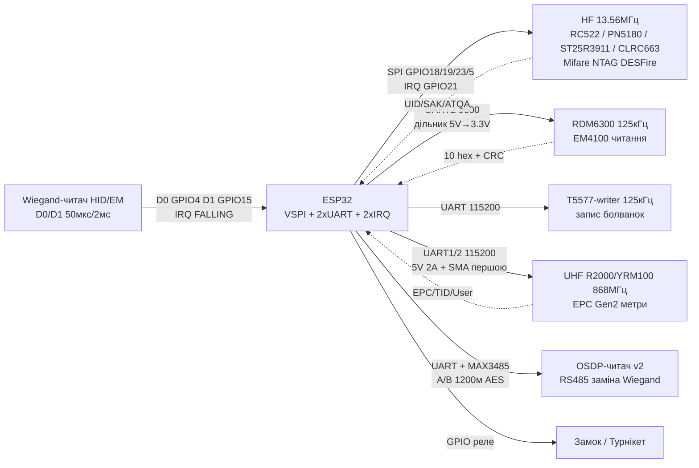

# RFID Advanced - Mifare Classic deep, LF-перезаписувані, HID, UHF, Wiegand/OSDP, апгрейд-читачі

> [!warning] Закон і етика
> Уся інформація про ключі, Crypto-1, nested-атаки, клонування T5577 - **тільки для власних карт/брелоків і власних систем**. Не копіюйте чужі перепустки, транспортні чи платіжні картки. Для продакшн-доступу використовуйте DESFire EV3 / Mifare Plus / Ultralight AES з диверсифікованими ключами, а не Mifare Classic.

Ця нотатка - поглиблене продовження [[12-Moduli-zvyazku/01-RC522-RFID]] і [[12-Moduli-zvyazku/05-PN532-RDM6300-Fingerprint-GM65]]. Тут: структура пам'яті Mifare Classic до рівня access-бітів і value-блоків, антиколізія ISO14443-3, Ultralight/NTAG проти DESFire проти FeliCa, перезаписуваний LF 125 кГц (T5577/EM4305), HID Prox/Indala і тваринні 134 кГц, UHF EPC Gen2 на R2000/YRM100, протокол Wiegand до мікросекунд і його заміна OSDP, а також коли RC522 вже мало і чим його замінити.

![[assets/img/rfid-advanced-mifare-scheme.png|600]]
*Рис. Логічна карта пам'яті Mifare Classic: сектори → блоки → sector trailer (KeyA/AccessBits/KeyB), value-блоки, зв'язок з UID/SAK/ATQA.*

Зв'язок з [[Home]], [[12-Moduli-zvyazku/01-RC522-RFID]], [[12-Moduli-zvyazku/05-PN532-RDM6300-Fingerprint-GM65]], [[03-GPIO/04-Pererivannya-PWM]], [[04-Shini/01-UART|UART]], [[16-Proekti/03-Access-Control]].

## Призначення

RFID Advanced - Mifare Classic deep, LF-перезаписувані, HID, UHF, Wiegand/OSDP, апгрейд-читачі - Mifare Classic deep; 1. Геометрія 1K / 4K / Mini; 2. Sector trailer: KeyA / AccessBits / KeyB. Зв'язок з Home, 12-Moduli-zvyazku/01-RC522-RFID, 12-Moduli-zvyazku/05-PN532-RDM6300-Fingerprint-GM65, [[03-GPIO/04-Pererivannya-PWM]], [[04-Shini/01-UART|UART]], [[16-Proekti/03-Access-Control]]. Приватний сектор СКУД: KeyA - сервісний (тільки читання trailer), KeyB - робочий для даних, access для даних 1 1 0 (читання обома, запис/інкремент KeyB).

## Зміст

1. [Mifare Classic deep](#1-mifare-classic-deep)
2. [Anticollision і cascade](#2-anticollision--cascade-select)
3. [Ultralight/NTAG vs DESFire vs FeliCa](#3-mifare-ultralightntag-vs-desfire-vs-felica)
4. [Перезаписуваний LF 125 кГц: T5577/EM4305](#4-перезаписуваний-lf-125-кгц-t5577em4305-vs-em4100)
5. [HID Prox/Indala і тваринні FDX-B/HDX](#5-hid-proxindala-і-тваринні-fdx-bhdx-134-кгц)
6. [UHF EPC Gen2: R2000/YRM100](#6-uhf-epc-gen2-r2000yrm100)
7. [Wiegand deep і OSDP](#7-wiegand-deep-і-osdp)
8. [Апгрейд-читачі: PN5180/ST25R3911/TRF7970A/CLRC663](#8-апгрейд-читачі-pn5180st25r3911trf7970aclrc663)
9. [Підключення до ESP32](#9-підключення-до-esp32)
10. [Код](#10-код)
11. [Типові помилки](#типові-помилки)
12. [Офіційні джерела](#офіційні-джерела)
13. [Див. також](#див-також)

## 1. Mifare Classic deep

### 1.1. Геометрія 1K / 4K / Mini

| Картка | Сектори | Блоки | Байт всього | Блоків даних | Корисних байт* |
| --- | --- | --- | --- | --- | --- |
| Mifare Mini (320 Б) | 5 (сектори 0-4 по 4 блоки) | 20 | 320 | 14 | 224 |
| Mifare Classic 1K (S50) | 16 (сектори 0-15, по 4 блоки) | 64 (0-63) | 1024 | 48 | 752 |
| Mifare Classic 4K (S70) | 40: сектори 0-31 по 4 блоки + сектори 32-39 по 16 блоків | 256 (0-255) | 4096 | 216 | 3440 |
| Classic EV1 1K/4K | як S50/S70 + 7-байт UID опція + лічильники | як вище | як вище | як вище | як вище |

\* Корисні = мінус manufacturer block (16 Б) і мінус усі sector trailer (16 Б × кількість секторів). Формула 1K: `16×3×16 − 16 = 752`.

Нумерація блоків наскрізна: сектор `s` (0-15, малі) містить блоки `4×s … 4×s+3`. Для великих секторів 4K (32-39): сектор 32 = блоки 128-143, сектор 33 = 144-159, …, сектор 39 = 240-255. Це важливо, бо `PCD_Authenticate()` приймає саме номер блока, а не сектора.

Сектор 0, блок 0 - manufacturer block:

| Байт | 0-3/0-6 | Решта | BCC | Дані виробника |
| --- | --- | --- | --- | --- |
| 4-байт UID | UID0-UID3 | BCC (XOR UID) | байт 4 | байти 5-15: SAK, ATQA, виробник |
| 7-байт UID (EV1) | UID0-UID1 + CT(0x88)+UID2-UID6 розподілені | BCC | - | не перезаписується (крім «magic» UID-карток) |

> [!warning] Ніколи не пишіть у блок 0 сектора 0 і в sector trailer без розуміння access-бітів. Один неправильний запис у trailer - і сектор назавжди закритий (ключі втрачені) або картка «цегла».

### 1.2. Sector trailer: KeyA / AccessBits / KeyB

Кожен сектор закінчується trailer-блоком (16 байт):

| Байт | 0-5 | 6-8 | 9 | 10-15 |
| --- | --- | --- | --- | --- |
| Призначення | Key A (6 байт) | Access Bits (3 байти + інверсії, див. нижче) | User byte / GPB (1 байт, вільний) | Key B (6 байт) або дані, якщо Key B не використовується як ключ |
| Заводське значення | `FF FF FF FF FF FF` | `FF 07 80` (+ GPB `69`) | `69` | `FF FF FF FF FF FF` |
| Читання | ніколи не читається (повертає `00`) | читаються | читається | ніколи не читається, якщо налаштований як ключ |

Фізично байти 6,7,8 кодують біти `C1,C2,C3` для блоків 0-3 сектора. Кожен біт зберігається двічі: прямо і інверсно. Структура (молодші біти першими):

```text
Byte 6: ~C2_3 ~C2_2 ~C2_1 ~C2_0  ~C1_3 ~C1_2 ~C1_1 ~C1_0
Byte 7:  C1_3  C1_2  C1_1  C1_0  ~C3_3 ~C3_2 ~C3_1 ~C3_0
Byte 8:  C3_3  C3_2  C3_1  C3_0   C2_3  C2_2  C2_1  C2_0
```

Індекс `_0.._2` - блоки даних сектора, `_3` - сам trailer. Заводське `FF 07 80` = усі `C1=C2=C3=0` для всіх блоків (транспортна конфігурація: читання/запис за KeyA або KeyB).

Приклад розбору в коді: `c1 = ((byte7 >> 4) & 0x0F)`, `c2 = ((byte8 & 0x0F) << 0) | ...` - повний парсер див. у [розділі 10](#10-код).

### 1.3. Таблиця прав для блоків даних

Для кожного блока даних комбінація `(C1,C2,C3)` дає 8 варіантів:

| C1 C2 C3 | Read | Write | Increment | Decrement/Transfer/Restore |
| --- | --- | --- | --- | --- |
| 0 0 0 (завод) | KeyA або KeyB | KeyA або KeyB | KeyA або KeyB | KeyA або KeyB |
| 0 1 0 | KeyA або KeyB | ніколи | ніколи | ніколи |
| 1 0 0 | KeyA або KeyB | KeyB | ніколи | ніколи |
| 1 1 0 | KeyA або KeyB | KeyB | KeyB | KeyA або KeyB |
| 0 0 1 | KeyA або KeyB | ніколи | ніколи | KeyA або KeyB |
| 0 1 1 | KeyB | KeyB | ніколи | ніколи |
| 1 0 1 | KeyB | ніколи | ніколи | ніколи |
| 1 1 1 | ніколи | ніколи | ніколи | ніколи |

### 1.4. Таблиця прав для sector trailer (блок 3)

| C1 C2 C3 (для блока 3) | Read KeyA | Write KeyA | Read AccessBits | Write AccessBits | Read KeyB | Write KeyB |
| --- | --- | --- | --- | --- | --- | --- |
| 0 0 0 | ніколи | KeyA | KeyA | ніколи | KeyA | KeyA |
| 0 1 0 | ніколи | ніколи | KeyA | ніколи | KeyA | ніколи |
| 1 0 0 | ніколи | KeyB | KeyA або KeyB | ніколи | ніколи | KeyB |
| 1 1 0 | ніколи | ніколи | KeyA або KeyB | ніколи | ніколи | ніколи |
| 0 0 1 | ніколи | KeyA | KeyA | KeyA | KeyA | KeyA |
| 0 1 1 | ніколи | KeyB | KeyA або KeyB | KeyB | ніколи | KeyB |
| 1 0 1 | ніколи | ніколи | KeyA або KeyB | KeyB | ніколи | ніколи |
| 1 1 1 | ніколи | ніколи | KeyA або KeyB | ніколи | ніколи | ніколи |

Найнебезпечніша комбінація - `1 1 1` для trailer: AccessBits більше ніколи не змінити. А `0 0 1` навпаки дозволяє міняти все за KeyA (зручно для своїх систем, небезпечно для чужих).

Практичні рецепти для своїх карт:

- Транспортний (завод): `FF 07 80 69` - усе відкрито за `FFFFFFFFFFFF`.
- Приватний сектор СКУД: KeyA - сервісний (тільки читання trailer), KeyB - робочий для даних, access для даних `1 1 0` (читання обома, запис/інкремент KeyB).
- Гаманець (value): дані `0 0 1` (читати всі, писати тільки декремент), решта - за KeyB.

### 1.5. Value-блоки: гаманець на картці

Будь-який блок даних можна відформатувати як value-блок (знакове 32-біт + адреса). Формат 16 байт:

| Байт | 0-3 | 4-7 | 8-11 | 12 | 13 | 14 | 15 |
| --- | --- | --- | --- | --- | --- | --- | --- |
| Вміст | Value (LSB first) | ~Value (інверсія) | Value (дублікат) | ADR | ~ADR | ADR | ~ADR |
| Приклад (1000 = 0x03E8) | `E8 03 00 00` | `17 FC FF FF` | `E8 03 00 00` | `05` | `FA` | `05` | `FA` |

Операції (виконуються в SRAM чипа, атомарно через трансферний буфер):

| Команда | Код | Що робить | Примітка |
| --- | --- | --- | --- |
| Increment | `0xC1` | `temp = value + operand` | результат у внутрішньому регістрі, потрібен Transfer |
| Decrement | `0xC0` / `0xDC` | `temp = value − operand` | те саме |
| Restore | `0xC2` | `temp = value` | копія блока в регістр без зміни |
| Transfer | `0xB0` | `block[ADR] = temp` | фіксація; без неї Increment/Decrement не зберігаються |
| GetValue | читання блока + перевірка | повертає value, якщо три копії консистентні | бібліотека `MIFARE_GetValue()` |

Послідовність списання 50 одиниць: `Authenticate → Decrement(block, 50) → Transfer(block)`. Послідовність поповнення: `Authenticate → Increment → Transfer`. Без Transfer гроші «зависають» у регістрі й губляться після `Halt`.

### 1.6. Ключі за замовчуванням і чому Classic зламаний

Заводські/поширені ключі (для своїх карт і тестів):

| Ключ (hex) | Де зустрічається |
| --- | --- |
| `FF FF FF FF FF FF` | завод NXP, усі нові картки, більшість брелоків з RC522-комплекту |
| `A0 A1 A2 A3 A4 A5` | Sector 0 деяких транспортних карт (історично) |
| `D3 F7 D3 F7 D3 F7` | Trailer за замовчуванням у частини СКУД-карток |
| `00 00 00 00 00 00` | «обнулені» сектори після персоналізації |
| `4D 3A 99 6B 2D 63` та подібні | вендорні ключі СКУД (не вгадувати чужі!) |

Чому Mifare Classic не можна використовувати для безпеки:

- **Crypto-1 - 48-бітний потоковий шифр** з LFSR, зворотньо-інженерений у 2007-2008 роках. Ключовий потік залежить від 48-біт ключа + 32-біт nonce (який на багатьох картках слабкий - PRNG лише 16 біт і передбачуваний).
- **Nested attack**: знаючи один ключ одного сектора (наприклад заводський у секторі 0 або відкритий trailer), можна за кілька хвилин/десятків секунд вирахувати ключі всіх інших секторів, підслухавши одну автентифікацію. Працює на своїх картках у лабораторії; інструменти типу `mfoc`/`mfcuk` - тільки для аудиту власних систем.
- **Darkside / reader-only атаки**: емуляція слабкого PRNG дозволяє витягти ключ навіть без жодного відомого ключа (години на старих картках, хвилини на окремих ревізіях).
- Наслідок: будь-який UID і будь-який Classic-сектор читається/клонується на «magic»-картку за хвилини. Тому Classic - це **ідентифікатор, а не захист**. Захист - DESFire EV3 / Plus EV1 / Ultralight AES з диверсифікацією ключів (кожна картка - свій ключ, похідний від мастер-ключа і UID через AES/CMAC).

## 2. Anticollision / cascade: Select

### 2.1. Ланцюжок виявлення ISO14443-3 Type A

| Крок | Команда PCD → PICC | Відповідь PICC | Призначення |
| --- | --- | --- | --- |
| 1. Request | `REQA (0x26)` / `WUPA (0x52)` | `ATQA` (2 байти) | «Хто в полі?»; WUPA будить HALT-картки, REQA - ні |
| 2. Anticollision CLn | `SEL (0x93/0x95/0x97)` + `NVB (0x20..0x70)` | UID-фрагмент + BCC | Бітовий арбітраж: якщо дві картки відповіли різними бітами - перемагає `0`, `1` відступає |
| 3. Select CLn | `SEL` + `NVB=0x70` + повний UID-фрагмент + BCC + CRC_A | `SAK` (1 байт) | Вибір однієї картки на цьому рівні каскаду |
| 4. Повтор для CL2/CL3 | якщо біт cascade у SAK = 1 | наступний фрагмент | Збір повного UID 7/10 байт |
| 5. Halt | `HLTA (0x50 0x00 + CRC)` | мовчання | Приспати вибрану картку |

BCC = XOR чотирьох байтів UID-фрагмента (з CT включно). CRC_A (ISO13239, poly `0x8408`, init `0x6363`) додається до кожного Select і Halt.

### 2.2. Рівні каскаду і довжини UID

| UID | Рівні | CL1 | CL2 | CL3 |
| --- | --- | --- | --- | --- |
| 4 байти (NUID) | тільки CL1 (`SEL=0x93`) | UID0-UID3 + BCC, SAK cascade=0 | - | - |
| 7 байт | CL1 + CL2 (`0x93`, `0x95`) | `CT=0x88` + UID0-UID2 + BCC, SAK cascade=1 | UID3-UID6 + BCC, SAK cascade=0 | - |
| 10 байт | CL1 + CL2 + CL3 (`0x93`, `0x95`, `0x97`) | `CT + UID0-UID2`, cascade=1 | `CT + UID3-UID5`, cascade=1 | UID6-UID9, cascade=0 |

CT (Cascade Tag) `0x88` - маркер «це не повний UID, буде продовження». Тому перший байт 7-байтного UID ніколи не дорівнює `0x88` (за стандартом такі UID не видаються).

### 2.3. ATQA / SAK: швидке розпізнавання картки

| Картка | ATQA | SAK | UID | Коментар |
| --- | --- | --- | --- | --- |
| Mifare Classic 1K | `00 04` | `08` (CL1 завершено) | 4 Б | найпоширеніша «синя» картка з комплекту |
| Mifare Classic 4K | `00 02` | `18` | 4 Б | SAK bit5+bit4: cascade=0, ISO14443-4 відсутній |
| Mifare Classic EV1 1K 7 Б | `00 44` | `08`→`08` | 7 Б | ATQA bit7-8: довжина UID |
| Mifare Ultralight / NTAG21x | `00 44` | `00` | 7 Б | SAK=0x00 - «немає криптопроцесора», просто пам'ять |
| Mifare DESFire EV1/EV2/EV3 | `03 44` | `20` | 7 Б (рандомізований) | SAK bit6=1 - підтримка ISO14443-4 (APDU) |
| Mifare Plus (у Classic-режимі) | `00 04` | `08` | 4/7 Б | у SL3-режимі - як DESFire (`20`) |
| JCOP / смарт-картка | `03 44` / `03 48` | `20` / `28` | 4/7 Б | ISO7816 поверх ISO14443-4 |

Практичне правило для ESP32-СКУД: якщо `SAK & 0x20` - це процесорна картка (DESFire/JCOP, говорити APDU); якщо `SAK == 0x00` - NTAG/Ultralight (читати сторінки); якщо `SAK == 0x08/0x18` - Classic (автентифікувати сектор). Код `PICC_GetType()` у бібліотеці MFRC522 робить саме це.

## 3. Mifare Ultralight/NTAG vs DESFire vs FeliCa

### 3.1. Порівняльна таблиця

| Властивість | Ultralight EV1 / NTAG21x | DESFire EV1/EV2/EV3 / Light | FeliCa (Sony) |
| --- | --- | --- | --- |
| Стандарт | ISO14443-3 Type A, NFC Forum Type 2 | ISO14443-3/4 Type A, ISO7816 APDU | JIS X 6319-4, NFC Forum Type 3 (FeliCa) |
| Пам'ять | сторінки по 4 байти, лінійні | файлова система: аплети (AID), файли всередині | сервіси/блоки по 16 байт |
| Обсяг юзера | UL EV1: 48 Б; NTAG213: 144 Б; NTAG215: 504 Б; NTAG216: 888 Б | 2/4/8 КБ (Light 640 Б-2 КБ) | 1-4 КБ типово |
| Криптографія | 32-біт PWD + PACK (EV1/NTAG), Ultralight C: 3DES, Ultralight AES: AES-128 | DES/2K3DES/3K3DES/AES-128, secure messaging, CMAC | DES/AES mutual auth (FeliCa Standard) |
| Швидкість | 106 кбіт/с | до 848 кбіт/с | 212 / 424 кбіт/с |
| Ціна картки | ~0.2-0.6 $ (найдешевші) | ~1-3 $ | ~1-2 $, поширена в Японії |
| RC522 | читає/пише (MIFARE_Read/Write сторінок як блоків) | тільки UID + RATS (Crypto - ні, бо немає AES-рушія в RC522) | ні (потрібен PN532/PN5180/TRF7970A) |
| Застосування | візитки NDEF, разові квитки, IoT-теги | транспорт, СКУД, мікроплатежі, eID | Suica/Pasmo, японський транспорт/ритейл |

### 3.2. Ultralight/NTAG детально: сторінки, OTP, lock-біти, пароль

Карта пам'яті NTAG213 (45 сторінок по 4 байти = 180 Б, з них юзеру 144 Б):

| Сторінки | Призначення | Доступ |
| --- | --- | --- |
| 0-1 | UID (7 байт) + BCC + lock-сумісність | Read-only |
| 2 | Lock bytes 0-1 (біти блокування) | Write-once (біти тільки 0→1) |
| 3 | OTP (One-Time Programmable, 4 байти) | Write-once |
| 4-39 | User memory (144 Б, NDEF) | R/W, блокується lock-бітами, захищається PWD |
| 40-41 | Dynamic lock (NTAG), RFUI | Write-once |
| 42-44 | CFG: AUTH0, ACCESS, PWD (4 Б), PACK (2 Б) | PWD ніколи не читається |

Ключові регістри захисту (NTAG21x):

- `AUTH0` - перша сторінка, з якої потрібен пароль. `AUTH0=0xFF` - без захисту; `AUTH0=0x04` - захищено все з user-пам'яті.
- `PWD` - 32-бітний пароль (4 байти, запис у сторінку 43). Заводське `FF FF FF FF`. **Ніколи не читається назад.**
- `PACK` - 16-бітна відповідь-квитанція (password acknowledge), перевірка успішності `PWD_AUTH`.
- `PROT` (біт у ACCESS) - якщо 1, то пароль потрібен і для читання, не тільки для запису.
- `CFGLCK` - біт незворотного замикання конфігурації: `0→1` - і AUTH0/PWD більше не змінити.
- `AUTHLIM` - лічильник невдалих спроб (0 = безліміт, 1-7 = блокування після N спроб).

Послідовність захисту своєї NDEF-візитки: записати NDEF → встановити `AUTH0=0x04` → записати свій `PWD` (не `FFFFFFFF`!) → записати `PACK` → перевірити `PWD_AUTH` → встановити lock-біти на CC/NDEF як read-only за потреби. Якщо забути пароль - сторінки не відновити (тільки повне стирання, якщо дозволено).

### 3.3. DESFire оглядово: файлова система

DESFire - це мікроконтролер з ОС: вибір аплета за AID (3 байти), автентифікація ключем аплета (0-13 ключів, AES-128 у EV2/EV3), потім файлові операції в secure messaging (шифрування + CMAC):

| Тип файлу | Призначення | Аналог |
| --- | --- | --- |
| Standard Data | довільні байти (баланс у вашому форматі) | файл |
| Backup Data | те саме + транзакційність (commit/abort) | журнал |
| Value | 32-біт лічильник з верх/ниж лімітом, credit/debit/limited-credit | value-блок Classic, але з криптозахистом |
| Linear Record | послідовні записи фіксованого розміру (лог подій) | append-only лог |
| Cyclic Record | кільцевий буфер записів (останні N подій) | ring buffer |

ESP32 + RC522 з DESFire може тільки отримати UID/SAK/RATS. Повноцінна робота (ISO7816 APDU, AES-сесія) потребує PN532 (частково), а краще PN5180 / ST25R3911 / CLRC663 з бібліотекою, що вміє ISO14443-4 (I-блоки, WTX, chaining). Для продакшн-СКУД закладайте саме такий стек + SAM-модуль або диверсифікацію ключів на сервері.

### 3.4. FeliCa коротко

Sony FeliCa (216 кГц? ні - ті ж 13.56 МГц, але модуляція Manchester 212/424 кбіт/с): кожна картка має 8-байт IDm (виробник) + 8-байт PMm (параметри). Команда `Polling` з System Code (`0xFFFF` - усі) повертає список карток у полі - це аналог антиколізії, але без бітових змагань. Сервіси адресуються 16-бітним кодом, блоки - по 16 байт. В Японії - транспорт Suica/Pasmo, e-money Edy/nanaco. Для ESP32 потрібен читач з FeliCa-підтримкою (PN532 вміє базово, PN5180/TRF7970A - повноцінно). RC522 - не вміє.

## 4. Перезаписуваний LF 125 кГц: T5577/EM4305 vs EM4100

### 4.1. EM4100-readonly проти перезаписуваних

| Параметр | EM4100 (і сумісні TK4100) | T5577 / ATA5577 (Atmel/Microchip) | EM4305 |
| --- | --- | --- | --- |
| Тип | тільки читання, прошитий на заводі | перезаписуваний EEPROM, емулює EM4100/HID/Indala та ін. | перезаписуваний, 512 біт |
| Пам'ять | 64 біти ROM: 9 header `1` + 10 груп × (4 біти даних + 1 парність) + 4 col-парності + stop `0` | 363 біти: 11 блоків × 33 біти (32 дані + lock); блок 0 = конфігурація | 16 слів × 32 біти (512 біт) + серійник + пароль |
| Модуляція | ASK Manchester 64 RF-клоки/біт, ~125 кГц несуча | програмована: ASK/FSK/PSK/Biphase/Manchester, 8-128 RF-клоків/біт | ASK/Biphase/FSK/PSK, програмована |
| Запис | неможливий | прямий запис по повітрю (без пароля або з 32-біт паролем) | пароль 32 біти, lock-біти на слова |
| Клонування | тільки заводський UID (не клонується) | запис дампа EM4100/HID у T5577-болванку = клон свого брелока | те саме + більше пам'яті |
| Ціна болванки | ~0.3 $ | ~0.5-0.8 $ (брелок/картка T5577) | ~0.8-1.2 $ |
| Чим читати | RDM6300 / RDM630 / EM18 | RDM6300 прочитає, якщо T5577 налаштований як EM4100; писати - окремим райтером | те саме |

Формат EM4100 (64 біти, стартує з 9 одиниць):

```text
111111111 | D00-D03+P0 | D04-D07+P1 | ... | D36-D39+P9 | C0 C1 C2 C3 | 0
  header       10 груп по 5 біт (4 дані + рядкова парність)   стовпцеві парності  стоп
```

UID = 40 біт даних (10 hex-символів у видачі RDM6300): перші 8 hex - customer/version, останні 2 hex - ... На практиці СКУД порівнює всі 10 символів як рядок.

### 4.2. T5577: блоки, конфіг, пароль

| Блок | Призначення | Ключові поля |
| --- | --- | --- |
| 0 | Конфігурація | modulation (3 біти), bitrate (6 біт: RF-клоки), кількість блоків даних (3 біти), парольний режим, max-block, PSK-CF, AOR, PWD-біт |
| 1 | Дані / емульований UID (EM4100-режим) | перші 32 біти EM4100-потоку |
| 2 | Дані | продовження |
| 3-7 | Дані / користувацькі | залежно від режиму |
| Спеціальні | PWD (32 біти), lock-біти | PWD записується окремою командою; lock - незворотний |

Типовий сценарій клонування свого брелока (легально!): прочитати EM4100-брелок RDM6300 → купити T5577-болванку → записати блок 0 (EM4100-режим, Manchester, 64 клоки, 2 блоки) + блоки 1-2 (UID) програматором 125 кГц (наприклад модуль RW007 / Proxmark3 / Arduino-райтер з котушкою). Після запису T5577 відповідає як оригінал і відкриває ваш турнікет.

> [!warning] T5577 з увімкненим паролем без записаного пароля = цегла. Спочатку запишіть PWD, потім вмикайте PWD-біт у блоці 0. Lock-біт блока 0 - теж незворотний: помилковий конфіг залочить болванку назавжди.

### 4.3. RDM6300-обмеження

| Обмеження | Наслідок для ESP32 |
| --- | --- |
| Тільки читання EM4100-сумісних (HID - ні) | для запису T5577 потрібен окремий writer-модуль |
| UART 9600 8N1, 5V живлення (3.3V не працює стабільно) | живити від 5V, TX RDM6300 → RX ESP32 через дільник 5V→3.3V (10к/20к) або MOSFET-рівень |
| Кадр 14 байт: `0x02 + 10 ASCII hex + 2 hex checksum + 0x03`, без пробілів | парсити як текст, checksum = XOR байтів UID |
| Дальність 2-5 см зі штатною антеною, чутливий до металу і 5V-пульсацій | окремий LDO 5V, антена далі від металу, див. [[12-Moduli-zvyazku/05-PN532-RDM6300-Fingerprint-GM65]] |
| Немає RSSI, немає антиколізії (два брелоки в полі = сміття) | у коді - таймаут і відкидання неповних кадрів |

## 5. HID Prox/Indala і тваринні FDX-B/HDX 134 кГц

### 5.1. HID Prox 125 кГц

HID ProxCard II - де-факто стандарт корпоративних СКУД (частота 125 кГц, але модуляція FSK, несумісна з EM4100, тому RDM6300 її не бачить).

| Формат | Біт | Структура | Приклад |
| --- | --- | --- | --- |
| H10301 (26-bit, найпоширеніший) | 26 | `P_even + FC(8) + Card(16) + P_odd` | FC=12, Card=3456 |
| H10302 (37-bit, без facility) | 37 | `P_even + Card(35?/19+... залежно від варіанта) + P_odd` | великий номер без FC |
| H10304 (37-bit з FC) | 37 | `P_even + FC(16) + Card(19) + P_odd` | FC=500, Card=123456 |
| Corporate 1000 (35-bit) | 35 | `P + Company(12) + Card(20) + P` | корпоративний пул |
| Indala ASP (26/27/29/...) | змінний | пропрієтарний, схожий на Wiegand-вихід | старі Motorola/Indala |

26-bit H10301 детально (біти 1-26):

```text
bit1:  paritet EVEN по бітах 2–13
bit2–9:  Facility Code (8 біт, 0–255)
bit10–25: Card Number (16 біт, 0–65535)
bit26: paritet ODD по бітах 14–25
```

Чому «не клонуються просто»:

- HID-читачі видають уже Wiegand-потік контролеру, а не сирий RF; сам протокол RF - FSK з пропрієтарним кодуванням (на відміну від відкритого EM4100 Manchester).
- T5577 *може* емулювати HID Prox (FSK2a, ~50 RF-клоків), але потрібен точний дамп (FC+Card+парності) і правильний конфіг блока 0; «з повітря» RDM6300 його не зчитає - потрібен HID-сумісний читач або Proxmark3.
- Юридично: HID-картка - власність роботодавця/замовника; копіювати можна тільки свою за письмовим дозволом власника системи (інакше - обхід СКУД).

Indala (тепер HID Indala): модуляція PSK, формати ASP+ / FlexPass; логіка та сама - facility + card + парності, але інші довжини і порядок. На практиці ESP32-СКУД приймає їх уже як Wiegand-біти (див. розділ 7), не розбираючи RF.

### 5.2. Тваринні 134.2 кГц: FDX-B / HDX (ISO11784/11785)

| Параметр | FDX-B (Full Duplex) | HDX (Half Duplex) |
| --- | --- | --- |
| Частота | 134.2 кГц, відповідає під час живлення полем | накопичує заряд, відповідає паузою поля (послідовність вкл/викл) |
| Швидкість | ~4194 біт/с, DBP-кодування | FSK (124.2/134.2 кГц), довша посилка |
| Дальність | 5-15 см (ручний сканер), до 80 см (рамка) | 10-30 см (ручний), до 1 м+ (рамка з великою антеною) |
| Застосування | чіпи котів/собак (скляна капсула 12×2 мм), худоба (вушні бирки) | велика рогата худоба, риба (PIT-теги 12/23 мм) |
| ESP32-читач | модулі FDX-B UART (наприклад RMD0999C, FDX-B reader 134 кГц) | ті ж модулі з перемиканням FDX/HDX або окремі HDX-читачі |

Структура коду ISO11784 (64 біти):

| Біти | Поле | Значення |
| --- | --- | --- |
| 1 | Animal-біт | 1 = тварина, 0 = не-тварина (інвентар) |
| 2-15 | Reserved / Retag counter | лічильник перечіпування (0-7) + користувацьке |
| 16 | Data-block біт | 1 = є додатковий блок даних |
| 17-26 | Country code (10 біт, 0-1023) | 804 = Україна, 250 = Франція, 276 = Німеччина, 999 = тестовий |
| 27-64 | National ID (38 біт) | унікальний номер тварини в країні |
| CRC-16 + trailer | контрольна сума + `0110...` | перевірка цілісності (CCITT, poly 0x1021) |

Приклад: `985 141012345678` (15 цифр на бирці) = country `985`? Ні - для ISO-чіпів перші 3 цифри десяткового представлення = код країни (наприклад `804` Україна + 12 цифр national ID). У коді ESP32 - розбирати десятковий рядок з UART-читача, а не сирі біти.

## 6. UHF EPC Gen2: R2000/YRM100

Стандарт: EPC Class1 Gen2 v2 (ISO18000-63, 860-960 МГц; в Україні дозволений діапазон 865-868 МГц, потужність до 2 Вт ERP). Принцип: читач випромінює неперервну несучу (тег живиться нею), команди - AM-модуляцією, відповідь тега - backscatter (зміна відбиття). Антиколізія - slotted Aloha з Q-параметром (читач задає `2^Q` слотів, теги випадково обирають слот).

### 6.1. Модулі для ESP32

| Модуль | Чіп | Інтерфейс | Потужність | Дальність* | Ціна | Примітка |
| --- | --- | --- | --- | --- | --- | --- |
| R2000-модуль (напр. UHF R2000 4-канальний) | Impinj R2000 (Indy) | UART 115200 (TTL 3.3V) | 5-30 дБм (налаштовується!) | 0.3-8 м | ~60-120 $ | 4 антенні порти (SMA), потрібне зовнішнє живлення 5V 2А+ |
| YRM100 / YR9035 (YangRui) | власний SoC (Gen2) | UART 115200 / Wiegand / RS485 (залежно від прошивки) | 5-27 дБм | 0.2-5 м | ~25-50 $ | компактний, вбудована керамічна антена або SMA, AT-команди |
| RYLR998 / дрібні TTL-модулі 915 МГц | - | UART | фіксована ~20 дБм | 0.5-2 м | ~15-25 $ | перевіряти частоту! 915 МГц - США, в Україні потрібні 865-868 МГц |
| PN5180 etc. | - | - | - | - | - | це HF 13.56 МГц, не UHF! Не плутати |

\* Дальність залежить від антени і потужності: 5 дБм + керамічна антена = 20-30 см (настільний режим), 27-30 дБм + 6 dBic кругова антена = 5-10 м (ворота/склад).

> [!warning] Потужність 5-30 дБм! Починайте завжди з мінімуму (5-10 дБм). 30 дБм (1 Вт) + погана антена (обрив, КСХ > 2) = перегрів і згорілий вихідний каскад. Не вмикайте передавач без антени! Перевірте регіональну прошивку (EU 865-868 МГц) - американські 902-928 МГц в Україні поза законом і заважають мобільним операторам.

### 6.2. Антени: кругова vs лінійна

| Антена | Поляризація | Посилення | Коли брати |
| --- | --- | --- | --- |
| Кругова (circular, 6-8 dBic) | обертова (читає тег у будь-якій орієнтації) | менше на 3 дБ за лінійну тієї ж площі | ворота, склад, «купа тегів у візку» - універсально |
| Лінійна (linear, 8-12 dBi) | одна площина (тег має бути паралельний) | більше, далі б'є | конвеєр з відомою орієнтацією тегів, далекі ворота |
| Керамічна вбудована (2-3 dBi) | лінійна | мала | настільний облік, друк квитків, тести |

Кабель: RG58 до 3 м (втрати ~1 дБ/м на 868 МГц) або LMR240 для довгих; роз'єми SMA (перевірити male/female!). КСХ має бути < 1.5.

### 6.3. Швидкість і мультизчитування

| Параметр | Значення | Коментар |
| --- | --- | --- |
| Швидкість інвентаризації | 50-700 тегів/с (залежно від Q, сесії, кодування Miller/FM0) | 50 тегів/с - консервативна гарантія для YRM100; R2000 - до 700/с у щільному режимі |
| Сесії S0-S3 | прапорці A/B у тегах (інвертуються при читанні) | S1/S2 - для воріт (тег «засинає» на секунди), S0 - для конвеєра |
| Q-алгоритм | 0-15 (слотів 1-32768) | малий Q - швидко для 1-5 тегів, великий Q - для сотень |
| Target A/B, Select | попередня фільтрація за маскою EPC | читати тільки «свої» теги, ігнорувати чужі |

### 6.4. Банки пам'яті Gen2

| Банк | Адреса | Вміст | Доступ |
| --- | --- | --- | --- |
| Reserved (00) | слова 0-1: Kill PWD, слова 2-3: Access PWD | 32-бітні паролі (заводські нулі) | читання/запис за Access PWD, ніколи не передаються відкрито після lock |
| EPC (01) | CRC-16 + PC (довжина, numbering) + EPC (96-496 біт) + опційно | ідентифікатор товару (SGTIN: company + item + serial) | запис EPC - команда `Write`, довжина - через PC-біти |
| TID (10) | Class ID (виробник чипа, напр. Impinj `E2003411`) + серійник + XTID | заводський ID чипа, унікальний | тільки читання, незмінний |
| User (11) | 0-2 кбіт (залежно від чипа; у дешевих - 0) | користувацькі дані | читання/запис, блокування |

Kill-пароль: ненульовий + команда `Kill` = тег назавжди мертвий (для privacy на касі). Lock-біти: permalock окремих слів/банків (незворотно). Для своїх систем: встановіть ненульові Access/Kill PWD і заблокуйте EPC-банк від запису, інакше будь-хто з UHF-райтером перезапише ваші бирки.

## 7. Wiegand deep і OSDP

### 7.1. Фізика і таймінги Wiegand

Wiegand - це не RF-протокол, а дротовий інтерфейс «читач → контролер» (у нашому випадку контролер = ESP32). Дві лінії даних з відкритим колектором: `D0` (нулі) і `D1` (одиниці).

| Параметр | Значення | Коментар |
| --- | --- | --- |
| Рівні спокою | обидві HIGH (5V через pull-up 1-4.7к у контролері) | струм спокою ~0 |
| Імпульс біта | LOW 20-100 мкс (типово 50 мкс) на D0 або D1 | інша лінія залишається HIGH |
| Пауза між бітами | 1-2 мс (типово 2 мс) обидві HIGH | звідси швидкість ~500 біт/с |
| Кадр 26 біт | ~52 мс | 26 × 2 мс |
| Живлення читача | 5V (деякі 7-12V), GND спільна з ESP32! | без спільної землі біти «пливуть» |
| Логіка ESP32 | 5V → дільник або MOSFET/оптопара до 3.3V | GPIO ESP32 не 5V-толерантні! |
| Довжина лінії | до 150 м на витій парі (D0+D1+GND+5V) | далі - RS485/OSDP або екранований кабель |

Осцилограма одного біта `1` (D1 падає):

```text
5V ───┐     ┌───────────────────────┐
      │     │                       │
      └─────┘                       └──── ...
      ◄─50мкс─►◄──── ~2мс пауза ────►
D1 ───┐     ┌─── HIGH ──────────────┐
D0 ───┴─────┴─── HIGH (мовчить) ────┘
```

### 7.2. Формати кадрів

| Формат | Біт | Структура | Facility | Card range |
| --- | --- | --- | --- | --- |
| H10301 (26-bit) | 26 | `PE + FC(8) + CN(16) + PO` | 0-255 | 0-65535 |
| 34-bit | 34 | `PE + FC(16) + CN(16) + PO` (варіанти: FC 8+... - перевіряти вендора) | 0-65535 | 0-65535 |
| 37-bit H10302 | 37 | `PE + CN(35) + PO` | - (немає) | до 34 млрд |
| 37-bit H10304 | 37 | `PE + FC(16) + CN(19) + PO` | 0-65535 | 0-524287 |
| Raw / custom | 4-64 | без парностей (PIN-клавіатури шлють 4 біти/клавішу: `#` = `1011`?) | - | - |

PE = even parity першої половини, PO = odd parity другої половини (межа - посередині кадра). PIN-клавіатури в Wiegand-режимі шлють кожну клавішу окремим 4-бітним nibble (а не кадром!) - парсер має розрізняти «кадр 26+ біт за <100 мс» і «потік nibble з паузами».

### 7.3. Підтяжки, захист, довжина

- Pull-up: 4.7к до 5V на стороні контролера (багато індустріальних Wiegand-читачів уже мають свої; якщо кадр «рваний» - додайте зовнішні 4.7к).
- Захист GPIO ESP32: дільник 10к (верх) / 20к (низ) з кожної лінії до GPIO + TVS 5V на вхід + послідовний 330 Ом. Або оптопара PC817 (повільна, але для 50 мкс вистачає з запасом? Ні - PC817 на межі; краще швидка 6N137 або MOSFET-рівень BSS138).
- Земля: товстий GND між читачем і ESP32; 5V - окремим дротом, не фантомом по екрану.
- Довжина: до 30 м - звичайна вита пара UTP; 30-150 м - екранована + конденсатор 100 нФ біля читача; понад 150 м - тільки OSDP/RS485.

### 7.4. OSDP як заміна: RS485 + AES

OSDP (Open Supervised Device Protocol, SIA) - сучасний двопровідний напівдуплекс RS485 замість двох ліній Wiegand:

| Властивість | Wiegand | OSDP v2.2 |
| --- | --- | --- |
| Фізика | 2× open-collector + GND + 5V (4-6 дротів) | RS485 A/B + GND + живлення (4 дроти, шина до 32 пристроїв) |
| Швидкість | ~500 біт/с, один напрямок | 9600-115200 бод, двоспрямований |
| Шифрування | немає (пасивне підслуховування) | AES-128 Secure Channel (SCBK, установка ключем) |
| Нагляд (supervision) | немає (обрив = тиша) | polling + статус тампера/живлення/обриву |
| Довжина | до 150 м | до 1200 м (RS485) |
| Функції | тільки ID (+ buzzer/LED окремими дротами) | ID + керування LED/buzzer/реле текстом, годинник, файли, PIN |
| ESP32 | 2× GPIO з перериваннями | UART + MAX3485/THVD1400 трансивер + бібліотека OSDP (PD-режим) |

Міграційна порада: нові СКУД-читачі беріть з перемикачем Wiegand/OSDP; ESP32-контролер проектуйте з RS485-трансивером одразу (зайві 0.5 $), а Wiegand-парсер тримайте як fallback. Деталі UART/RS485 - див. [[04-Shini/01-UART|UART]].

## 8. Апгрейд-читачі: PN5180/ST25R3911/TRF7970A/CLRC663

Коли RC522 вже мало: потрібен ISO15693 (бібліотечні мітки), FeliCa, NFC Forum Type 4/5, більша дальність, низьке споживання, Dynamic Power Control (автопідстроювання потужності під розстройку антени металом), або ISO14443-4 для DESFire.

| Параметр | MFRC522 (RC522) | PN5180 | ST25R3911B / ST25R3916 | TRF7970A | CLRC663 / MFRC663 |
| --- | --- | --- | --- | --- | --- |
| Виробник | NXP | NXP | STMicro | TI | NXP |
| Протоколи | ISO14443A, (Mifare) | ISO14443A/B, FeliCa, ISO15693, ISO18000-3M3, NFC Forum | ISO14443A/B, FeliCa, ISO15693, ISO18000-3M3, NFC Forum, EMV (з 3916) | ISO14443A/B, FeliCa, ISO15693, ISO18000-3, NFCIP-1/2 | ISO14443A/B, FeliCa, ISO15693, Mifare Plus/DESFire |
| Вихідна потужність | ~200 мВт (фікс., слабкий драйвер) | до 2 Вт (!) + DPC | до 1.4 Вт (3916) + DPC + AAT | +20/+23 дБм (100/200 мВт) | до 250 мВт |
| DPC (автопідстроювання) | немає | так (фірмова фіча PN5180) | так (DPC + AAT: автонастроювання антени) | частково (AGC, подвійний приймач + RSSI) | немає повноцінного |
| Дальність з доброю антеною | 3-5 см | 8-15 см | 8-12 см | 8-12 см | 5-10 см |
| Напруга | 2.5-3.6V | 3.0-3.6V (драйвер до 5V через VBAT) | 2.4-5.5V | 2.7-5.5V | 2.5-3.6V |
| Інтерфейс до ESP32 | SPI/I2C/UART | SPI + IRQ + BUSY + RST | SPI + IRQ | SPI/паралельний + FIFO 127 Б | SPI/I2C/UART + FIFO 512 Б |
| Ціна модуля | ~2 $ | ~8-15 $ | ~10-20 $ | ~15-25 $ (BoosterPack) | ~10-18 $ |
| Коли брати | UID Classic/NTAG, бюджет, навчання | максимум дальності/потужності, метал поруч, NFC Forum | батарейні пристрої, EMV-термінали, автонастрой | потреба card-emulation/P2P, FeliCa+15693 одним чипом, 5V-системи | DESFire/Plus-проєкти на NXP-стеку |

Правило вибору:

- Лишитися на RC522: простий СКУД на UID своїх Classic/NTAG-карток, бюджет, готова бібліотека Arduino.
- PN5180: потрібна дальність 10+ см, антена біля металу (DPC рятує), ISO15693-бірки складу.
- ST25R3911B/3916: батарейний турнікет/замок (низький сон <1 мкА з wakeup по полю), EMV-пілот.
- TRF7970A: потрібні card emulation або P2P, живлення 5V, FeliCa для японських карток, два приймачі проти «сліпих зон».
- CLRC663: проєкт уже на DESFire/Plus і NXP-бібліотеках, потрібен великий FIFO і ISO14443-4 з коробки.

## 9. Підключення до ESP32

### Загальна карта системи

| Вузол | Інтерфейс ESP32 | Живлення | Примітка |
| --- | --- | --- | --- |
| RC522 / PN5180 / ST25R3911 / CLRC663 | VSPI: SCK GPIO18, MISO GPIO19, MOSI GPIO23, CS GPIO5 (другий читач - CS GPIO15), IRQ GPIO21, RST GPIO22 | 3.3V (PN5180 VBAT - 5V для потужності через окремий контур) | дроти SPI <20 см, 100 нФ + 10 мкФ біля модуля |
| RDM6300 (читання EM4100) | UART2 RX GPIO16 (TX модуля → RX ESP32), 9600 8N1 | 5V окремо! TX 5V → дільник 10к/20к → GPIO16 | спільний GND обов'язковий |
| T5577-writer (125 кГц) | UART2 115200 або bit-bang котушка | 5V | пише болванки; читає RDM6300 |
| UHF R2000 / YRM100 | UART1/2 115200 (TX/RX перехресно: GPIO17→RX модуля, GPIO16←TX модуля) | 5V 2А окремий блок, спільний GND | антену - першою! Не вмикати TX без антени |
| Wiegand-читач (HID/EM) | D0 → GPIO4, D1 → GPIO15 (обидва з перериваннями FALLING), GND спільна, 5V читачу | 5V читачу, GPIO через дільник/оптопару | pull-up 4.7к до 5V на D0/D1 |
| OSDP-читач | UART + RS485-трансивер (MAX3485: RO→RX, DI→TX, DE+RE→GPIO) | 12V читачу типово, трансивер 3.3V | A/B вита пара, термінатор 120 Ом на кінцях |

### ASCII-схема

```text
                    ESP32 DevKit
                    ───────────
  VSPI (HF 13.56 МГц):
   GPIO18 SCK ──────────────► SCK  RC522/PN5180/ST25R3911/CLRC663
   GPIO23 MOSI ─────────────► MOSI   (3.3V! 100нФ+10мкФ біля модуля)
   GPIO19 MISO ◄───────────── MISO   CS GPIO5 (читач#1), GPIO15 (читач#2)
   GPIO5  CS1 ──────────────► CS
   GPIO21 IRQ ◄────────────── IRQ (pull-up 10к)
   GPIO22 RST ──────────────► RST

  LF 125 кГц + UHF (UART):
   5V LDO ──────────────────► VCC  RDM6300 (5V!) / T5577-writer / YRM100/R2000
   GND ───────────────────── GND  (товста спільна земля!)
   GPIO16 RX2 ◄──[10к/20к]─── TX   RDM6300 9600 / YRM100 115200
   GPIO17 TX2 ──────────────► RX   YRM100/R2000 115200
   (!) UHF-антена SMA ──► першою, потім живлення; починати з 5–10 дБм

  Wiegand (HID/EM-читач):
   5V ──────────────────────► VCC читача
   GND ───────────────────── GND читача (= GND ESP32)
   GPIO4  ◄──[дільник/6N137]── D0 (pull-up 4.7к до 5V, імпульс 50мкс LOW)
   GPIO15 ◄──[дільник/6N137]── D1 (пауза ~2мс, кадр 26/34/37 біт)
   GPIO2  ──► BUZZER/LED читача (опційно, open-drain)

  OSDP (заміна Wiegand):
   GPIO16/17 UART ──► MAX3485 ──► A/B вита пара ──► OSDP-читач (до 1200м)
```

### Mermaid-діаграма протоколів



## 10. Код

### 10.1. Arduino: читання sector trailer + розбір access-бітів + value-блок (MFRC522 extended)

```cpp
#include <SPI.h>
#include <MFRC522.h>
#define SS_PIN 5
#define RST_PIN 22
MFRC522 rfid(SS_PIN, RST_PIN);
MFRC522::MIFARE_Key keyA;

void printHex(byte *b, byte n) {
  for (byte i = 0; i < n; i++) printf(" %02X", b[i]);
  Serial.println();
}

// Розбір C1/C2/C3 для 4 блоків сектора з байтів 6,7,8 trailer
void parseAccessBits(byte *trailer) {
  byte b6 = trailer[6], b7 = trailer[7], b8 = trailer[8];
  Serial.printf("Access bytes: %02X %02X %02X\n", b6, b7, b8);
  for (int blk = 0; blk < 4; blk++) {
    int c1 = (b7 >> (4 + blk)) & 0x01;
    int c2 = (b8 >> blk) & 0x01;
    int c3 = (b8 >> (4 + blk)) & 0x01;
    // перевірка інверсій
    int c1i = (b6 >> blk) & 0x01;
    int c2i = (b6 >> (4 + blk)) & 0x01;
    int c3i = (b7 >> blk) & 0x01;
    bool ok = ((c1 ^ c1i) == 1) && ((c2 ^ c2i) == 1) && ((c3 ^ c3i) == 1);
    Serial.printf("  block %d: C1=%d C2=%d C3=%d %s\n",
      blk, c1, c2, c3, ok ? "[OK]" : "[BROKEN INV!]");
  }
}

// Декодування value-блока
bool decodeValueBlock(byte *b, int32_t &val, byte &adr) {
  int32_t v1 = (int32_t)(b[0] | (b[1] << 8) | (b[2] << 16) | (b[3] << 24));
  int32_t v1i = (int32_t)(b[4] | (b[5] << 8) | (b[6] << 16) | (b[7] << 24));
  int32_t v2 = (int32_t)(b[8] | (b[9] << 8) | (b[10] << 16) | (b[11] << 24));
  if ((v1 != ~v1i) || (v1 != v2)) return false;
  if (!((b[12] == b[14]) && (b[13] == b[15]) && (b[12] == (byte)~b[13]))) return false;
  val = v1; adr = b[12];
  return true;
}

void setup() {
  Serial.begin(115200);
  SPI.begin(18, 19, 23, SS_PIN);
  rfid.PCD_Init();
  for (byte i = 0; i < 6; i++) keyA.keyByte[i] = 0xFF; // свій ключ!
}

void loop() {
  if (!rfid.PICC_IsNewCardPresent() || !rfid.PICC_ReadCardSerial()) { delay(50); return; }
  Serial.print("UID:"); printHex(rfid.uid.uidByte, rfid.uid.size);
  byte sector = 1;                       // приклад: сектор 1 (блоки 4,5,6 + trailer 7)
  byte trailerBlock = sector * 4 + 3;
  if (rfid.PCD_Authenticate(MFRC522::PICC_CMD_MF_AUTH_KEY_A, trailerBlock, &keyA, &rfid.uid) != MFRC522::STATUS_OK) {
    Serial.println("Auth KeyA failed"); rfid.PICC_HaltA(); rfid.PCD_StopCrypto1(); return;
  }
  byte buf[18]; byte sz = sizeof(buf);
  // 1) читання trailer
  if (rfid.MIFARE_Read(trailerBlock, buf, &sz) == MFRC522::STATUS_OK) {
    Serial.print("Trailer:"); printHex(buf, 16);
    parseAccessBits(buf);
  }
  // 2) читання value-блока (блок 4)
  byte dataBlock = sector * 4 + 0;
  sz = sizeof(buf);
  if (rfid.MIFARE_Read(dataBlock, buf, &sz) == MFRC522::STATUS_OK) {
    Serial.print("Block data:"); printHex(buf, 16);
    int32_t v; byte a;
    if (decodeValueBlock(buf, v, a)) Serial.printf("  VALUE=%ld ADR=%d\n", (long)v, a);
    else Serial.println("  (not a valid value block — plain data)");
  }
  // 3) приклад decrement+transfer СВОГО гаманця (розкоментувати для своїх карт):
  // rfid.MIFARE_Decrement(dataBlock, 50);
  // rfid.MIFARE_Transfer(dataBlock);
  rfid.PICC_HaltA(); rfid.PCD_StopCrypto1();
  delay(1000);
}
```

### 10.2. Arduino: запис T5577-болванки (writer-модуль по UART, клон свого EM4100)

```cpp
// T5577 writer з UART-протоколом "AT-команд" (приклад для RW007-сумісних).
// Логіка: конфіг блок0 = EM4100-режим, потім блоки 1-2 з UID свого брелока.
#include <HardwareSerial.h>
HardwareSerial wr(1);
#define WR_RX 16
#define WR_TX 17

void wrCmd(const char *c) { wr.println(c); delay(300); while (wr.available()) Serial.write(wr.read()); }

void setup() {
  Serial.begin(115200);
  wr.begin(115200, SERIAL_8N1, WR_RX, WR_TX);
  delay(500);
  // UID СВОГО брелока, прочитаного RDM6300 (приклад: 0x5200A81F2B)
  const char *uidHex = "5200A81F2B"; // 5 байт = 40 біт EM4100
  wrCmd("AT+MODE=EM4100");           // емуляція EM4100: Manchester, 64 RF-клоки
  char cmd[64];
  snprintf(cmd, sizeof(cmd), "AT+WRITE=1,%s", uidHex);
  wrCmd(cmd);                        // запис UID у блоки 1-2
  wrCmd("AT+WRITE=0,00148040");      // блок0: EM4100-конфіг (verify з даташитом свого модуля!)
  wrCmd("AT+READ");                  // перевірка
}

void loop() {
  // Після запису піднести болванку до RDM6300 — має повернути той самий UID.
  delay(1000);
}
```

> [!warning] Байт конфігу блока 0 відрізняється між вендорами writer-модулів. Значення `00148040` - приклад для Manchester/64-клоки/2 блоки; звірте з інструкцією саме вашого модуля перед записом. Помилковий lock = цегла.

### 10.3. Arduino: читання UHF EPC по UART (YRM100 / R2000-сумісні, 115200)

```cpp
#include <HardwareSerial.h>
HardwareSerial uhf(2);
#define UHF_RX 16
#define UHF_TX 17

// Спрощений фрейм YRM100-подібних: AA 00 LEN CMD DATA... CRC... (перевірити мануал!)
// Нижче — опитування інвентаризації однією антеною, потужність 10 дБм.
void uhfSend(uint8_t cmd, uint8_t *d, uint8_t n) {
  uint8_t f[64]; int p = 0;
  f[p++] = 0xAA; f[p++] = 0x00; f[p++] = n + 1; f[p++] = cmd;
  for (int i = 0; i < n; i++) f[p++] = d[i];
  uint8_t crc = 0; for (int i = 0; i < p; i++) crc += f[i]; // приклад; у R2000 — CRC-16!
  f[p++] = crc;
  uhf.write(f, p);
}

void setup() {
  Serial.begin(115200);
  uhf.begin(115200, SERIAL_8N1, UHF_RX, UHF_TX);
  delay(800);
  uint8_t pwr[] = {0x0A}; // 10 дБм для старту! Не 30!
  uhfSend(0x2B, pwr, 1);   // SET_POWER (код команди — з мануала модуля)
  delay(300);
}

void loop() {
  uhfSend(0x22, nullptr, 0); // INVENTORY once
  delay(400);
  while (uhf.available()) {
    uint8_t b = uhf.read();
    Serial.printf("%02X ", b);
  }
  Serial.println("| RSSI/EPC див. у повному парсері за мануалом");
  delay(1000);
}
```

### 10.4. ESP-IDF (C): Wiegand-парсер на перериваннях (D0 GPIO4, D1 GPIO15)

```c
#include <stdio.h>
#include <string.h>
#include "freertos/FreeRTOS.h"
#include "freertos/task.h"
#include "freertos/queue.h"
#include "driver/gpio.h"
#include "esp_timer.h"

#define W_D0 4
#define W_D1 15
#define WIEGAND_MAX 64
#define FRAME_TIMEOUT_US 60000  // кадр завершено, якщо пауза >60мс

static volatile uint64_t w_bits = 0;
static volatile int w_count = 0;
static volatile int64_t w_last_us = 0;
static QueueHandle_t w_q;

static void IRAM_ATTR wiegand_isr(void *arg) {
  int gpio = (int)arg;
  int64_t now = esp_timer_get_time();
  if (w_count < WIEGAND_MAX) {
    w_bits <<= 1;
    if (gpio == W_D1) w_bits |= 1;
    w_count++;
    w_last_us = now;
  }
}

static bool check_parity(uint64_t b, int n) {
  // 26-bit H10301: bit1 EVEN(2..13), bit26 ODD(14..25)
  if (n == 26) {
    int even = 0, odd = 0;
    for (int i = 2; i <= 13; i++) even += (b >> (26 - i)) & 1;
    for (int i = 14; i <= 25; i++) odd += (b >> (26 - i)) & 1;
    int p0 = (b >> 25) & 1, p1 = (b >> 0) & 1;
    return ((even + p0) % 2 == 0) && ((odd + p1) % 2 == 1);
  }
  return true; // 34/37-біт: перевіряти за вендорною схемою
}

void wiegand_task(void *p) {
  uint32_t frame;
  while (1) {
    if (xQueueReceive(w_q, &frame, portMAX_DELAY)) {
      // розбір викликається з таска-кадру (див. нижче)
    }
  }
}

void app_main(void) {
  gpio_config_t c = {.pin_bit_mask = (1ULL << W_D0) | (1ULL << W_D1),
    .mode = GPIO_MODE_INPUT, .pull_up_en = GPIO_PULLUP_DIS, // pull-up зовнішній 4.7к до 5V + дільник!
    .pull_down_en = GPIO_PULLDOWN_DIS, .intr_type = GPIO_INTR_NEGEDGE};
  gpio_config(&c);
  w_q = xQueueCreate(8, sizeof(uint64_t));
  gpio_install_isr_service(0);
  gpio_isr_handler_add(W_D0, wiegand_isr, (void *)W_D0);
  gpio_isr_handler_add(W_D1, wiegand_isr, (void *)W_D1);
  uint64_t last = 0; int last_n = 0;
  while (1) {
    vTaskDelay(pdMS_TO_TICKS(20));
    // кадр готовий, якщо є біти і минуло >60мс тиші
    if (w_count > 0 && (esp_timer_get_time() - w_last_us) > FRAME_TIMEOUT_US) {
      taskDISABLE_INTERRUPTS();
      uint64_t b = w_bits; int n = w_count;
      w_bits = 0; w_count = 0;
      taskENABLE_INTERRUPTS();
      if (n == 26) {
        uint16_t fc = (b >> 9) & 0xFF;   // біти 2..9
        uint16_t cn = (b >> 1) & 0xFFFF; // біти 10..25
        printf("W26 FC=%u CARD=%u %s\n", fc, cn, check_parity(b, n) ? "PARITY OK" : "PARITY FAIL");
      } else {
        printf("Wiegand %d bits: 0x%llX\n", n, (unsigned long long)b);
      }
      (void)last; (void)last_n;
    }
  }
}
```

### 10.5. Arduino (C++): Wiegand-парсер на перериваннях

```cpp
#define W_D0 4
#define W_D1 15
volatile uint64_t w_bits = 0;
volatile uint8_t w_count = 0;
volatile unsigned long w_last = 0;

void IRAM_ATTR onD0() { w_bits <<= 1; w_count++; w_last = millis(); }
void IRAM_ATTR onD1() { w_bits = (w_bits << 1) | 1; w_count++; w_last = millis(); }

void setup() {
  Serial.begin(115200);
  pinMode(W_D0, INPUT); // ззовні: дільник 10к/20к + pull-up 4.7к до 5V
  pinMode(W_D1, INPUT);
  attachInterrupt(digitalPinToInterrupt(W_D0), onD0, FALLING);
  attachInterrupt(digitalPinToInterrupt(W_D1), onD1, FALLING);
}

void loop() {
  if (w_count > 0 && (millis() - w_last) > 60) {
    noInterrupts();
    uint64_t b = w_bits; uint8_t n = w_count;
    w_bits = 0; w_count = 0;
    interrupts();
    if (n == 26) {
      uint16_t fc = (b >> 9) & 0xFF;
      uint16_t cn = (b >> 1) & 0xFFFF;
      Serial.printf("W26 FC=%u CARD=%u\n", fc, cn);
    } else if (n == 34) {
      uint16_t fc = (b >> 17) & 0xFFFF;
      uint16_t cn = (b >> 1) & 0xFFFF;
      Serial.printf("W34 FC=%u CARD=%u\n", fc, cn);
    } else {
      Serial.printf("Wiegand %u bits: 0x%llX\n", n, (unsigned long long)b);
    }
  }
}
```

### 10.6. MicroPython: Wiegand-парсер (IRQ + Poll)

```python
from machine import Pin
import time

D0 = Pin(4, Pin.IN)
D1 = Pin(15, Pin.IN)
bits = []
last = time.ticks_ms()

def on_d0(p):
    global last
    bits.append(0)
    last = time.ticks_ms()

def on_d1(p):
    global last
    bits.append(1)
    last = time.ticks_ms()

D0.irq(trigger=Pin.IRQ_FALLING, handler=on_d0)
D1.irq(trigger=Pin.IRQ_FALLING, handler=on_d1)

def parse(b):
    n = len(b)
    v = 0
    for x in b:
        v = (v << 1) | x
    if n == 26:
        fc = (v >> 9) & 0xFF
        cn = (v >> 1) & 0xFFFF
        print("W26 FC=%u CARD=%u" % (fc, cn))
    else:
        print("Wiegand %u bits: 0x%X" % (n, v))

while True:
    time.sleep_ms(20)
    if bits and time.ticks_diff(time.ticks_ms(), last) > 60:
        b = bits[:]
        bits.clear()
        parse(b)
```

### 10.7. MicroPython: читання UHF EPC по UART + RDM6300 EM4100

```python
from machine import UART, Pin
import time

# UHF YRM100: UART1 115200
uhf = UART(1, baudrate=115200, tx=17, rx=16, timeout=300)
# RDM6300: UART2 9600 (TX модуля -> RX ESP32 через дільник!)
rdm = UART(2, baudrate=9600, tx=-1, rx=16, timeout=100)  # приклад: рознести UART-и!

def uhf_inventory_once():
    uhf.write(bytes([0xAA, 0x00, 0x01, 0x22, 0xCD]))  # коди — з мануала модуля!
    time.sleep_ms(400)
    d = uhf.read()
    if d:
        print("UHF raw:", d.hex(" "))
    else:
        print("UHF: no tags (знизьте потужність/перевірте антену)")

def rdm_read():
    d = rdm.read()
    if not d:
        return
    # кадр: 0x02 + 10 ASCII + 2 ASCII CRC + 0x03
    if len(d) >= 14 and d[0] == 0x02 and d[-1] == 0x03:
        uid = d[1:11].decode()
        print("EM4100 UID:", uid)

while True:
    uhf_inventory_once()
    rdm_read()
    time.sleep(1)
```

### 10.8. ESP-IDF: UHF опитування + RDM6300 на різних UART

```c
#include "driver/uart.h"
#define UHF_UART UART_NUM_1
#define RDM_UART UART_NUM_2
void app_main2(void) {
  uart_config_t c = {.baud_rate = 115200, .data_bits = UART_DATA_8_BITS,
    .parity = UART_PARITY_DISABLE, .stop_bits = UART_STOP_BITS_1,
    .flow_ctrl = UART_HW_FLOWCTRL_DISABLE};
  uart_param_config(UHF_UART, &c);
  uart_set_pin(UHF_UART, 17, 16, -1, -1);
  uart_driver_install(UHF_UART, 512, 512, 0, NULL, 0);
  c.baud_rate = 9600;
  uart_param_config(RDM_UART, &c);
  uart_set_pin(RDM_UART, -1, 16, -1, -1); // рознести піни з UHF у реальному проєкті!
  uart_driver_install(RDM_UART, 256, 256, 0, NULL, 0);
  // далі: uhfSend()/uart_read_bytes() з таймаутом, парсинг EPC/TID за мануалом
}
```

## Типові помилки

| # | Помилка | Симптом | Причина | Рішення |
| --- | --- | --- | --- | --- |
| 1 | Запис у sector trailer без копії | сектор назавжди закритий, ключі втрачені | неправильні AccessBits (напр. `FF FF FF`) або затертий KeyA | завжди спочатку `MIFARE_Read` trailer → зберегти дамп → міняти тільки потрібні байти; тренуватися на spare-картці |
| 2 | Запис у блок 0 сектора 0 | картка «цегла», UID зіпсований (на звичайних картках - частково) | manufacturer block read-only, запис псує BCC/UID | ніколи не писати в блок 0; для тестів UID - тільки «magic»-картки Gen1a |
| 3 | Increment без Transfer | баланс не змінився після операції | результат завис у внутрішньому регістрі | завжди `Increment/Decrement → Transfer`; перевіряти `GetValue` після |
| 4 | Аутентифікація не тим ключем/блоком | `Auth failed`, `Timeout in communication` | ключ від іншого сектора або KeyB замість KeyA | автентифікуватися до trailer-блока того сектора (`sector*4+3`); тримати таблицю ключів по секторах |
| 5 | Віра в «захист» Mifare Classic | клон перепустки за хвилини | Crypto-1 зламаний, nested-атака | Classic - тільки ідентифікатор; безпека - DESFire EV3/Plus SL3/Ultralight AES + диверсифікація |
| 6 | Очікування UID 4 байти завжди | код ламається на 7-байтних EV1/NTAG | ігнор cascade levels CL1/CL2 | парсити `uid.size` (4/7/10), SAK cascade-біт; не обрізати UID до 4 байт у БД |
| 7 | PWD `FFFFFFFF` на NTAG + AUTH0=0x04 | будь-хто розблоковує теги телефоном | заводський пароль | встановити свій 32-біт PWD + PACK, PROT=1 за потреби, CFGLCK після налагодження |
| 8 | Lock-біт T5577/EM4305 заблоковано завчасно | болванка не перезаписується | lock блока 0 незворотний | спочатку PWD і конфіг без lock, перевірити читання RDM6300, потім lock |
| 9 | RDM6300 живиться від 3.3V | мовчання або сміття на UART | модулю треба стабільні 5V | окремий 5V LDO, TX 5V → дільник до RX ESP32, спільний GND |
| 10 | Два LF-брелоки в полі RDM6300 | пошкоджений кадр, невірний checksum | немає антиколізії | підносити по одному; відкидати кадри без `0x02...0x03` і з поганим XOR |
| 11 | HID-картка «не читається» RDM6300 | тиша | HID = FSK, EM4100 = Manchester; різні модуляції | для HID - HID-сумісний читач або Wiegand-вихід; RDM6300 - тільки EM4100/T5577-в-EM-режимі |
| 12 | Wiegand без спільної землі | випадкові біти, різна довжина кадру | плаваючий GND, наводки | товстий спільний GND, pull-up 4.7к, екран на довгих лініях |
| 13 | 5V Wiegand безпосередньо в GPIO ESP32 | деградація/згорілий пін | GPIO не 5V-толерантні | дільник 10к/20к або 6N137/MOSFET-рівень + TVS |
| 14 | UHF увімкнено без антени або на 30 дБм одразу | перегрів, згорілий PA, штрафи за радіочастотний регламент | КСХ=∞ без антени; перевищення ERP | антена першою, старт 5-10 дБм, прошивка EU 865-868 МГц, КСХ < 1.5 |
| 15 | Американський UHF-модуль 915 МГц в Україні | читає, але незаконно і гірше | інший діапазон, інші антени | брати EU-версію 865-868 МГц і антену на 868 МГц |
| 16 | RC522 для DESFire/FeliCa/15693 | `Timeout`, SAK=0x20 без даних | RC522 не вміє ISO14443-4 AES-сесії / FeliCa / 15693 | апгрейд: CLRC663 (DESFire), PN5180 (15693+потужність), TRF7970A (FeliCa+P2P) |
| 17 | Довгі дроти SPI до HF-читача | `Version 0x00/0xFF`, рвані дампи | індуктивність, перехресні завади | <20 см, кручена пара SCK+GND, 100 нФ біля модуля |
| 18 | Wiegand-nibble клавіатури як кадр | PIN «не сходиться» | клавіатура шле 4 біти/клавішу без парностей | окрема гілка парсера: накопичувати nibble до `#`, таймаут 2 с |

## Офіційні джерела

- [MIFARE Classic - сімейство продуктів (NXP)](https://www.nxp.com/products/rfid-nfc/mifare-hf/mifare-classic:MC_41863) - EV1 1K/4K, ESD-стійкість, рекомендація мігрувати на DESFire/Plus для security-застосувань.
- [MIFARE Ultralight - сімейство (NXP)](https://www.nxp.com/products/rfid-nfc/mifare-hf/mifare-ultralight:MC_53452) - Ultralight EV1/C/AES: password-захист, 3DES/AES, CC EAL3+ для AES-версії.
- [MIFARE DESFire - сімейство (NXP)](https://www.nxp.com/products/rfid-nfc/mifare-hf/mifare-desfire:MC_53450) - DES/3DES/AES, CC EAL5+ для EV3, файлова система аплетів.
- [NFC Readers - портфоліо фронтендів (NXP)](https://www.nxp.com/products/rfid-nfc/nfc-hf/nfc-readers:NFC-READER) - PN5180/CLRC663-клас: вибір фронтенда під дальність і протоколи.
- [TRF7970A - мультпротокольний трансивер 13.56 МГц (TI)](https://www.ti.com/product/TRF7970A) - ISO14443A/B, FeliCa, ISO15693, NFCIP, +20/+23 дБм, FIFO 127 Б, апноути по антенах і DESFire.
- [UCODE RAIN RFID - UHF-мітки EPC Gen2 (NXP)](https://www.nxp.com/products/rfid-nfc/ucode-rain-rfid-uhf:MC_50483) - EPC/TID/User-банки, чутливість −26 дБм, GS1 Gen2v2-сумісність (орієнтир для вибору бирок до R2000/YRM100).
- [ESP32 + MFRC522 RFID Reader/Writer - туторіал з кодом (RNT)](https://randomnerdtutorials.com/esp32-mfrc522-rfid-reader-arduino/) - UID, дамп секторів/блоків, sector trailer, читання/запис блоків на ESP32.
- [RC522 RFID - розбір модуля, пам'ять Mifare 1K (LME)](https://lastminuteengineers.com/how-rfid-works-rc522-arduino-tutorial/) - піни, MFRC522-чип, sector/block/trailer, приклади DumpInfo/Write.

## Див. також

- [[Home]]
- [[12-Moduli-zvyazku/01-RC522-RFID]]
- [[12-Moduli-zvyazku/05-PN532-RDM6300-Fingerprint-GM65]]
- [[03-GPIO/04-Pererivannya-PWM]]
- [[04-Shini/01-UART|UART]]
- [[16-Proekti/03-Access-Control]]
- [[04-Shini/02-SPI|SPI]]
- [[04-Shini/03-I2C|I2C]]
- [[02-Zhivlennya/01-Lancjugi-zhivlennya]]
- [[03-GPIO/01-GPIO-oglyad]]
- [[99-Dodatki/02-Troubleshooting-FAQ]]
