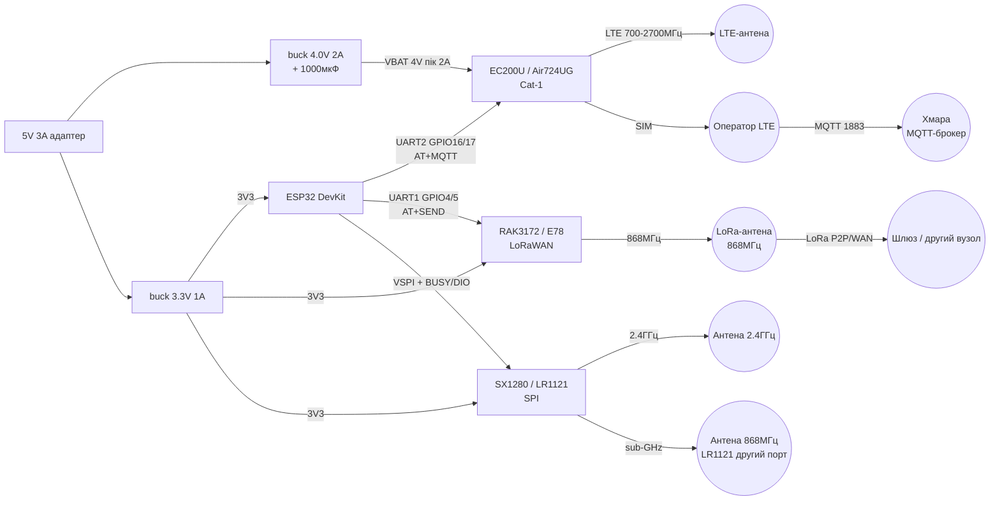
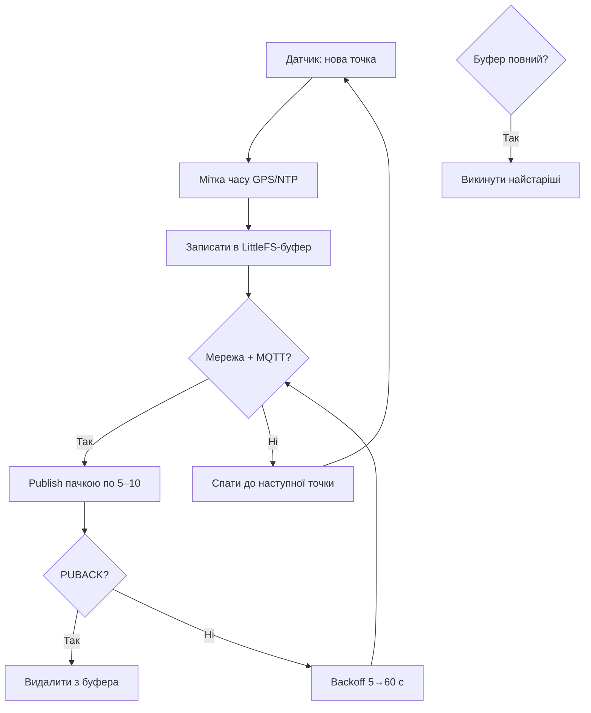

# Cellular Cat-1 та LoRa-2 - EC200U / Air724 / RAK3172 / SX1280 / LR1121

## Призначення

Далекобійний зв'язок ESP32 там, де немає WiFi: LTE Cat-1 / Cat-1bis (EC200U, Air724UG,
M5311, ML302 - заміна вмираючого 2G!) для MQTT/HTTP безпосередньо в хмару, та друге покоління
LoRa (E78, RAK3172 на STM32WLE, SX1280 на 2.4 ГГц, LR1121 sub-GHz + 2.4 ГГц + супутник).
Нота - міст між [[12-Moduli-zvyazku/09-Cellular-NBIoT-UARTLoRa]] (SIM7080/A7670/E32) і
практикою: коли брати Cat-1, коли LoRa, які AT-команди, які антени, код MQTT-over-Cat1 на ESP32.

База: старт - [[Home]], перший GNSS+GSM - [[12-Moduli-zvyazku/03-SIM800L-GPS]],
перше LoRa - [[12-Moduli-zvyazku/02-NRF24-LoRa]], UART - [[04-Shini/01-UART|UART]],
живлення - [[02-Zhivlennya/01-Lancjugi-zhivlennya]], RTK-партнер - [[12-Moduli-zvyazku/17-GNSS-RTK]].

> 2G ВИМИКАЮТЬ! SIM800L/C - минуле. Нові проєкти: Cat-1 (EC200U/Air724) для хмари,
> NB-IoT (BC25/M5311) для лічильників, LoRa (RAK3172/E78) для поля без покриття.
> Антени LTE (700-2700 МГц) і LoRa (433/868 МГц) НЕ взаємозамінні - чужа антена = смерть PA!

![[assets/img/cellular-lora-2-scheme.png|600]]
*Рис. ESP32 + Cat-1 EC200U (MQTT в хмару) паралельно з LoRa-гілкою RAK3172/SX1280/LR1121. LTE-антена і LoRa-антена - різні роз'єми, спільна тільки земля.*

## Характеристики

| Модуль | Мережа / діапазон | Інтерфейс | Живлення | Особливість |
| --- | --- | --- | --- | --- |
| Quectel EC200U-EU | LTE Cat-1bis: B1/B3/B5/B7/B8/B20/B28 + GSM fallback, 10/5 Мбіт | UART (AT), USB, SIM | 3.0-4.8 В (тип 3.8 В!), пік 2 А | Хіт заміни SIM800: ті ж розміри LCC, AT ті ж, голос/SMS/MQTT з коробки |
| Luat Air724UG (RDA8910) | LTE Cat-1: FDD B1/B3/B5/B8 + TDD, 10/5 Мбіт | UART (AT), USB, SIM | 3.4-4.2 В, пік 2 А | Дешевший за EC200U, LuatOS (Lua в модулі!), USB-драйвер для Linux |
| China Mobile M5311 | NB-IoT B3/B8/B20, PSM/eDRX | UART (AT), SIM/eSIM | 3.1-4.2 В, сон ~3 мкА | Лічильники на 10 років від батареї, тільки UDP/CoAP/MQTT-SN |
| China Mobile ML302 | Cat-1 B1/B3/B5/B8, OpenCPU | UART (AT), USB, SIM | 3.4-4.2 В, пік 2 А | OpenCPU: код прямо в модемі, ESP32 не потрібен для простих задач |
| Quectel BC25 | NB-IoT + GNSS (версії -G) | UART (AT) | 3.1-4.2 В, PSM мкА | Попередник M5311, AT як у SIM800, повільний, але економний |
| EBYTE E78 (ASR6601) | LoRa/LoRaWAN 410-925 МГц, 22 дБм, Cortex-M4 | UART (AT), SPI | 2.0-3.6 В | LoRaWAN-вузол з коробки: AT+JOIN, AT+SEND |
| RAK3172 (STM32WLE5CC) | LoRa/LoRaWAN EU868/US915/AS923/CN470, 22 дБм | UART (AT RUI3), SWD | 2.0-3.6 В, сон 1.69 мкА! | Стандарт LoRaWAN 1.0.3, P2P-режим, Arduino RUI3, >15 км |
| Semtech SX1280 | LoRa/FLRC/GFSK 2.4 ГГц, 12.5 дБм, −132 дБм | SPI + BUSY/DIO | 3.3 В | Всесвітній діапазон без регіональних обмежень! Ranging (ToF) до ±1 м |
| Semtech LR1121 | sub-GHz 150-960 + 2.4 ГГц + L/S-band супутник!, LR-FHSS | SPI | 3.3 В | Один чіп на всі діапазони + супутниковий IoT (Lacuna/Swarm-ready) |
| EBYTE E28 (SX1280) | 2.4 ГГц LoRa UART/SPI, 12-27 дБм версії | UART або SPI | 3.3 В | Готовий міст UART↔2.4ГГц LoRa, ranging-прошивки |

Порівняння з попередньою нотою [[12-Moduli-zvyazku/09-Cellular-NBIoT-UARTLoRa]]:

| Задача | Бери з ноти 09 | Бери з цієї ноти (18) | Чому |
| --- | --- | --- | --- |
| Дешевий 4G в Україну/ЄС | SIM7080G (Cat-M/NB) | EC200U-EU (Cat-1bis) | Cat-M в Україні немає! EC200U працює в звичайному LTE |
| Голосовий дзвінок | A7670 | EC200U / Air724UG | Усі вміють VoLTE, але EC200U дешевший і масовіший |
| LoRa point-to-point з коробки | E32/E22 (UART) | E78 (AT LoRaWAN) / RAK3172 | E78/RAK3172 - LoRaWAN + P2P, E32 - тільки прозорий міст |
| LoRa SPI для своєї прошивки | SX1262/LLCC68 | SX1280 (2.4 ГГц) / LR1121 (вседіапазонний) | 2.4 ГГц - весь світ без сертифікації діапазону; LR1121 - ще й супутник |
| 2G-заміна один-в-один | A7670 | Air724UG | Air724UG дешевший, LuatOS всередині, але документація китайською частково |
| Батарея 10 років | SIM7080G PSM | M5311 / BC25 PSM | NB-IoT PSM ~3 мкА в обох, M5311 новіший |
| Ranging / локалізація | - (немає) | SX1280 ToF | Тільки SX1280 має апаратний time-of-flight |

Деталі вибору:

1. **Новий продукт з хмарою:** EC200U-EU. Працює всюди, де є LTE. SIM звичайна IoT.
2. **Найдешевше з хмарою:** Air724UG + LuatOS. Lua-скрипт прямо в модемі, ESP32 - тільки сенсори.
3. **Без ESP32 взагалі:** ML302 OpenCPU або Air724UG LuatOS - модем сам читає UART-сенсор і шле MQTT.
4. **Лічильник на батареї:** M5311 / BC25 (NB-IoT PSM). Прокинувся → відправив → спить. ESP32 в deep-sleep.
5. **Поле/ферма без LTE:** RAK3172 P2P або LoRaWAN через шлюз. 15 км з доброю антеною.
6. **Товар на весь світ (один SKU):** SX1280 2.4 ГГц - немає регіональних частот (868 vs 915!).
7. **Супутниковий backup:** LR1121 - один чіп говорить і з шлюзом, і з супутником (S-band).
8. **RTK-поправки в поле:** Cat-1 (EC200U) несе NTRIP роверу - див. [[12-Moduli-zvyazku/17-GNSS-RTK]].

## Легенда пінів модуля

### EC200U / Air724UG (LCC-плата розробника / EVB)

| Пін | Позначення | Тип | Куди на ESP32 | Примітка |
| --- | --- | --- | --- | --- |
| 1 | VBAT | Живлення вхід | 4 В (buck 5→4 В, 2 А!) або 3.8 В | 3.0-4.8 В! НЕ 3V3 DevKit (просадки), НЕ 5V безпосередньо! |
| 2 | GND | Земля | GND | Товстий провід, спільна земля |
| 3 | TXD (модуля) | Вихід UART | GPIO16 (RX2 ESP32) | Перехресно, 115200 |
| 4 | RXD (модуля) | Вхід UART | GPIO17 (TX2 ESP32) | Перехресно; рівень 1.8 В на LCC - потрібен level-shift або EVB з перетворювачем рівнів! |
| 5 | PWRKEY | Вхід, active low | GPIO27 | Імпульс LOW 1-2 с = on/off (як SIM800!) |
| 6 | RESET_N | Вхід, active low | GPIO14 або NC | Аварійний скид ≥200 мс |
| 7 | STATUS | Вихід | GPIO34 | HIGH = модуль увімкнено |
| 8 | NETLIGHT | Вихід | LED або NC | 64 мс/300 мс = пошук; 64 мс/2 с = зареєстровано |
| 9 | SIM_VDD/DATA/CLK/RST | SIM | Тримач Nano-SIM на EVB | Cat-1 SIM, PIN зняти! |
| 10 | ANT_MAIN | ВЧ-вихід | LTE-антена 700-2700 МГц (IPEX/SMA) | ТІЛЬКИ LTE! КСХ чужої антени вбиває PA |
| 11 | ANT_GNSS | ВЧ-вихід | GNSS-антена (версії -G) | Окрема антена, вид на небо |
| 12 | USB_DM/DP | USB | USB ПК / ESP32-S3 host | Прошивка, PPP, NDIS |

> EC200U LCC без EVB має UART 1.8 В! Безпосередньо до ESP32 (3.3 В) - через дільник TX ESP32→модуль
> або level-shifter. EVB-плати вже мають перетворювач рівнів - перевіряй схему своєї плати.

### M5311 / ML302 / BC25 (NB-IoT / Cat-1 LCC)

| Пін | Позначення | Тип | Куди на ESP32 | Примітка |
| --- | --- | --- | --- | --- |
| 1 | VBAT | Живлення вхід | 3.8 В buck 2 А | 3.1-4.2 В, пік TX 2 А навіть у NB-IoT! |
| 2 | GND | Земля | GND | Спільна |
| 3 | TXD | Вихід UART | GPIO16 (RX2) | 115200, AT як у SIM800 |
| 4 | RXD | Вхід UART | GPIO17 (TX2) | Перехресно |
| 5 | PWRKEY / PON | Вхід | GPIO27 | Увімкнення імпульсом |
| 6 | RESET | Вхід | GPIO14 або NC | Скид |
| 7 | SIM | Тримач | NB-IoT SIM (M5311/BC25!) | Звичайна голосова SIM в NB не реєструється! |
| 8 | ANT | ВЧ-вихід | LTE/NB-антена | Своя частота, не LoRa! |
| 9 | PSM_WAKEUP | Вхід/вихід | GPIO33 (опційно) | Будильник з PSM-сну |

### RAK3172 / E78 (LoRaWAN UART-модем)

| Пін | Позначення | Тип | Куди на ESP32 | Примітка |
| --- | --- | --- | --- | --- |
| 1 | VCC 3V3 | Живлення вхід | 3V3 | 2.0-3.6 В, TX ~120 мА |
| 2 | GND | Земля | GND | Спільна |
| 3 | TX (модуля) | Вихід UART | GPIO16 (RX2) | 115200 (RAK) / 9600-115200 (E78), AT-команди |
| 4 | RX (модуля) | Вхід UART | GPIO17 (TX2) | `AT+SEND`, `AT+JOIN` |
| 5 | RESET / NRST | Вхід, active low | GPIO14 або NC | Скид |
| 6 | BOOT0 | Вхід | GND (робота) / 3V3 (прошивка) | Для заливки RUI3 через STM32CubeProgrammer |
| 7 | SWDIO/SWDCLK | Debug | ST-Link (опційно) | Своя прошивка RUI3-Arduino |
| 8 | ANT (IPEX або pad) | ВЧ-вихід | LoRa-антена 433/868 МГц | БЕЗ АНТЕНИ НЕ ВМИКАТИ TX! |

Режими RAK3172 (RUI3 AT):

| Команда | Призначення |
| --- | --- |
| `AT+NWM=1` / `AT+NWM=0` | LoRaWAN vs P2P-режим |
| `AT+BAND=8` | EU868 (Україна/ЄС!); US915=Америка - не переплутати! |
| `AT+JOIN=1:0:10:8` | OTAA-join (до 10 спроб) |
| `AT+SEND=2:48656C6C6F` | Відправка hex-payload на порт 2 |
| `AT+P2P=868000000:7:125:0:10:22` | P2P: частота:SF:BW:CR:preamble:power |

### SX1280 / LR1121 (SPI-трансивер)

| Пін | Позначення | Тип | Куди на ESP32 | Примітка |
| --- | --- | --- | --- | --- |
| 1 | VCC 3V3 | Живлення вхід | 3V3 | Тільки 3.3 В! TX 2.4 ГГц ~50 мА, sub-GHz ~120 мА |
| 2 | GND | Земля | GND | Земля + екран |
| 3 | SCK | Вхід SPI | GPIO18 | До 18 МГц (SX1280) |
| 4 | MOSI | Вхід SPI | GPIO23 | ESP32 → радіо |
| 5 | MISO | Вихід SPI | GPIO19 | Радіо → ESP32 |
| 6 | NSS (CS) | Вхід CS | GPIO5 | Chip Select, active low |
| 7 | BUSY | Вихід | GPIO34 | HIGH = зайнятий, чекати перед SPI! |
| 8 | DIO1 | Вхід/вихід | GPIO35 | Переривання RX_DONE/TX_DONE |
| 9 | DIO2/DIO3 | Вхід/вихід | GPIO32/33 або NC | Керування RF-перемикачем (FEM) |
| 10 | NRESET | Вхід, active low | GPIO14 | Скид LOW ≥5 мс |
| 11 | ANT_2G4 | ВЧ-вихід | 2.4 ГГц антена (SX1280/LR1121) | Маленька антена 2.4 ГГц! |
| 12 | ANT_SUBG | ВЧ-вихід | sub-GHz антена (тільки LR1121!) | Друга антена 868 МГц - НЕ плутати! |

> LR1121 має ДВІ антенні піни (sub-GHz + 2.4 ГГц/S-band). Обидві через дуплексер або
> окремі антени. Неправильний порт = −20 дБ чутливості.

## Схема

### ASCII-схема

```text
ЖИВЛЕННЯ (два незалежні buck!):
  5V 3A адаптер ──┬──► [buck#1 4.0V 2A] ──► VBAT EC200U/Air724 + 1000мкФ low-ESR + 100нФ
                   │    GND товста спільна!
                   └──► [buck#2 3.3V 1A] ──► VCC ESP32 + VCC RAK3172/SX1280
  USB DevKit НЕ живить модем! Пік 2А = ребут без окремого buck.

CAT-1 ГІЛКА (хмара):
  ESP32 DevKit              EC200U / Air724UG (EVB)
  ────────────              ──────────────────────
  GND ────────────────────  GND
  GPIO16 (RX2) ◄──────────  TXD (через шифтер 1.8→3.3!)
  GPIO17 (TX2) ──[шифтер]──► RXD
  GPIO27 ─────────────────► PWRKEY (LOW 1с = on/off)
  GPIO14 ─────────────────► RESET_N (опційно)
  GPIO34 ◄────────────────  STATUS
                            SIM ──► Nano-SIM (PIN зняти!)
                            ANT_MAIN ──► LTE-антена 700-2700МГц (ОБОВ'ЯЗКОВО!)
                            USB ──► ПК (прошивка/PPP)

LORA ГІЛКА (поле):
  ESP32                     RAK3172 / E78 (UART)          або SX1280/LR1121 (SPI)
  ─────                     ────────────────────              ─────────────────────
  GPIO16 (RX2)* ◄─────────  TX  (*або другий UART1: GPIO4/5!)  MISO ←── GPIO19
  GPIO17 (TX2)* ──────────► RX                                MOSI ──► GPIO23
  GPIO14 ─────────────────► RESET                             SCK ───► GPIO18
                            ANT ──► LoRa 868МГц               NSS ───► GPIO5
                                                                      BUSY ──► GPIO34 (ЧЕКАТИ!)
                                                                      DIO1 ──► GPIO35 (IRQ)
                                                                      RST ───► GPIO14*
                                                                      ANT_2G4 ──► 2.4ГГц / ANT_SUBG ──► 868МГц
  *Не вішати Cat-1 і LoRa на один UART! Cat-1=UART2 (16/17), LoRa UART=UART1 (4/5), LoRa SPI=VSPI.
```

### Mermaid



## AT-команди ключові (Cat-1)

```text
;;; --- База: зв'язок і SIM ---
AT                 -> OK (міст працює)
ATI                -> Quectel EC200U / Air724UG (ідентифікація)
AT+CPIN?           -> READY (SIM вставлена, PIN знятий!)
AT+CSQ             -> +CSQ: 18,99 (рівень; норма 10-31, 99=нема мережі)
AT+COPS?           -> оператор (напр. "Kyivstar")
AT+CGATT?          -> +CGATT: 1 (GPRS/EDGE/LTE attached)
AT+CEREG?          -> +CEREG: 0,1 (зареєстровано в LTE; 5=роумінг)

;;; --- Контекст даних (інтернет) ---
AT+QICSGP=1,1,"internet","","",1   -> APN (уточнити в оператора! lifecell/kyivstar/vodafone)
AT+QIACT=1                          -> активація PDP-контексту
AT+QIACT?                           -> IP-адреса модема

;;; --- MQTT вбудований в модем (без ESP32-стека!) ---
AT+QMTCFG="aliauth",0,"id","user","pass"  -> опційно для хмари
AT+QMTOPEN=0,"broker.hivemq.com",1883      -> відкрити сесію 0
AT+QMTCONN=0,"esp32-node-01"               -> підключити клієнта
AT+QMTPUB=0,0,0,0,"sensors/temp","25.3"    -> publish QoS0
AT+QMTSUB=0,1,"cmd/#",0                    -> subscribe
;;; Вхідні: +QMTRECV: 0,1,"cmd/led","1"

;;; --- HTTP (альтернатива MQTT) ---
AT+QHTTPURL=24,80            -> довжина URL, таймаут; далі ввести URL
AT+QHTTPPOST=11,80,80        -> довжина тіла; далі тіло; читати +QHTTPPOST: 0,200

;;; --- SMS/дзвінок (діагностика) ---
AT+CMGF=1                    -> текстовий режим SMS
AT+CMGS="+380..."            -> текст + Ctrl+Z (0x1A)

;;; --- Сон (NB-IoT M5311/BC25) ---
AT+CPSMS=1,,,"00100001","00000001"  -> PSM: TAU + active time
AT+CEDRXS=1,4,"0101"               -> eDRX цикл
```

LoRa AT (RAK3172 RUI3 / E78):

```text
AT                    -> OK
AT+VER=?              -> версія RUI3
AT+NWM=0              -> P2P-режим (1=LoRaWAN)
AT+P2P=868000000:7:125:0:10:22   -> частота 868МГц SF7 BW125 CR4/5 preamble10 PWR22
AT+PSEND=48656C6C6F   -> відправити "Hello" (hex!) в P2P
AT+NWM=1 / AT+BAND=8 / AT+JOIN=1:0:10:8  -> LoRaWAN EU868 OTAA
AT+SEND=2:48656C6C6F  -> LoRaWAN uplink порт 2
```

## Антени LTE vs LoRa - не плутати

| Параметр | LTE-антена (Cat-1) | LoRa sub-GHz | LoRa 2.4 ГГц |
| --- | --- | --- | --- |
| Частота | 700-2700 МГц широкосмугова | 433 або 868 МГц вузька! | 2400-2500 МГц |
| Роз'єм | IPEX/SMA на EVB | IPEX/SMA, своя частота! | IPEX/PCB |
| Довжина штиря | ~5-10 см (багаточастотна) | ~8 см (868) / ~17 см (433) | ~3 см |
| Без антени | Реєстрація рветься, PA гріється | TX вбиває вихід за секунди! | TX вбиває вихід! |
| Чужа антена | LoRa-антена на LTE = немає реєстрації | LTE-антена на LoRa = КСХ>3, смерть PA | Тільки 2.4 ГГц! |
| Розміщення | Вертикально, далі від металу | Вертикально, високо, далі від LTE ≥20 см | Будь-як, але далі від WiFi-антени ESP32 |

## Код ESP-IDF (PPPOS + MQTT - інтернет через Cat-1)

```c
// ESP-IDF v5.x: EC200U/Air724 як PPP-модем + MQTT publish
// UART2: GPIO16=RX2, GPIO17=TX2, PWRKEY=GPIO27. APN уточнити в оператора!
#include "freertos/FreeRTOS.h"
#include "freertos/task.h"
#include "esp_log.h"
#include "esp_modem_api.h"
#include "esp_netif.h"
#include "mqtt_client.h"

#define TAG "cat1_mqtt"
#define PIN_PWRKEY 27
#define UART_TX 17
#define UART_RX 16

static void mqtt_handler(void *a, esp_event_base_t b, int32_t id, void *d) {
    esp_mqtt_client_handle_t c = a;
    if (id == MQTT_EVENT_CONNECTED) {
        esp_mqtt_client_subscribe(c, "cmd/#", 0);
        esp_mqtt_client_publish(c, "sensors/temp", "25.3", 0, 0, 0);
    } else if (id == MQTT_EVENT_DATA) {
        esp_mqtt_event_handle_t e = d;
        ESP_LOGI(TAG, "CMD %.*s = %.*s", e->topic_len, e->topic, e->data_len, e->data);
    }
}

static void modem_mqtt_task(void *arg) {
    // 1. PWRKEY імпульс 1.5 с для старту модема
    gpio_set_direction(PIN_PWRKEY, GPIO_MODE_OUTPUT);
    gpio_set_level(PIN_PWRKEY, 1); vTaskDelay(pdMS_TO_TICKS(1500));
    gpio_set_level(PIN_PWRKEY, 0); vTaskDelay(pdMS_TO_TICKS(3000));
    // 2. PPP через esp_modem (DCE = SIM800/EC200U-сумісний)
    esp_netif_config_t net_cfg = ESP_NETIF_DEFAULT_PPP();
    esp_netif_t *ppp = esp_netif_new(&net_cfg);
    esp_modem_dce_config_t dce_cfg = ESP_MODEM_DCE_DEFAULT_CONFIG("internet");
    esp_modem_dte_config_t dte_cfg = ESP_MODEM_DTE_DEFAULT_CONFIG();
    dte_cfg.uart_config.tx_io_num = UART_TX;
    dte_cfg.uart_config.rx_io_num = UART_RX;
    dte_cfg.uart_config.baud_rate = 115200;
    esp_modem_dce_t *dce = esp_modem_new_dev(ESP_MODEM_DCE_SIM800, &dte_cfg, &dce_cfg, ppp);
    ESP_ERROR_CHECK(esp_modem_set_mode(dce, ESP_MODEM_MODE_DATA));
    ESP_LOGI(TAG, "PPP up, старт MQTT...");
    // 3. MQTT поверх PPP
    esp_mqtt_client_config_t mq = {
        .broker.address.uri = "mqtt://broker.hivemq.com:1883",
        .credentials.client_id = "esp32-cat1-01",
    };
    esp_mqtt_client_handle_t client = esp_mqtt_client_init(&mq);
    esp_mqtt_client_register_event(client, ESP_EVENT_ANY_ID, mqtt_handler, client);
    esp_mqtt_client_start(client);
    // 4. Публікація температури кожні 60 с
    int n = 0; char payload[32];
    while (1) {
        snprintf(payload, sizeof(payload), "{\"t\":25.%d}", n++ % 10);
        esp_mqtt_client_publish(client, "sensors/temp", payload, 0, 0, 0);
        vTaskDelay(pdMS_TO_TICKS(60000));
    }
}

void app_main(void) {
    xTaskCreate(modem_mqtt_task, "modem", 8192, NULL, 5, NULL);
}
```

## Код Arduino (AT-міст + MQTT через вбудований стек модема)

```cpp
// Arduino-ESP32: EC200U/Air724 через AT, MQTT вбудованим стеком QMT
// Serial2: RX=16 TX=17. Монітор AT через Serial.
#include <Arduino.h>
#define M_RX 16
#define M_TX 17
#define PWRKEY 27

String at(const String &cmd, unsigned long to = 3000) {
  Serial2.println(cmd);
  String r; unsigned long t = millis();
  while (millis() - t < to) {
    while (Serial2.available()) { char c = Serial2.read(); r += c; }
    if (r.indexOf("OK") >= 0 || r.indexOf("ERROR") >= 0) break;
  }
  Serial.print(">>> " + cmd + "\n<<< " + r + "\n");
  return r;
}

void modemPower(bool on) {
  pinMode(PWRKEY, OUTPUT);
  digitalWrite(PWRKEY, HIGH); delay(1500); digitalWrite(PWRKEY, LOW);
  delay(3000);
}

void setup() {
  Serial.begin(115200);
  Serial2.begin(115200, SERIAL_8N1, M_RX, M_TX);
  modemPower(true);
  delay(2000);
  at("AT");
  at("AT+CPIN?");
  at("AT+CSQ");
  at("AT+CEREG?", 5000);
  at("AT+QICSGP=1,1,\"internet\",\"\",\"\",1");
  at("AT+QIACT=1", 10000);
  at("AT+QMTOPEN=0,\"broker.hivemq.com\",1883", 10000);
  at("AT+QMTCONN=0,\"esp32-cat1-01\"", 10000);
  at("AT+QMTSUB=0,1,\"cmd/#\",0", 5000);
}

void loop() {
  static unsigned long last = 0;
  // Пересилка URC (+QMTRECV) в монітор
  while (Serial2.available()) Serial.write(Serial2.read());
  while (Serial.available()) Serial2.write(Serial.read());
  if (millis() - last > 60000) {
    last = millis();
    at("AT+QMTPUB=0,0,0,0,\"sensors/temp\",\"25.3\"", 5000);
  }
}
```

## Код MicroPython (Cat-1 AT + LoRa RAK3172 через два UART)

```python
"""MicroPython ESP32: UART2=Cat-1 EC200U, UART1=RAK3172 LoRa P2P."""
from machine import UART, Pin
import time

cat = UART(2, baudrate=115200, tx=17, rx=16, timeout=1000)
lora = UART(1, baudrate=115200, tx=5, rx=4, timeout=1000)
pwr = Pin(27, Pin.OUT)

def at(u, cmd, wait=2):
    u.write(cmd + "\r\n")
    time.sleep(wait)
    r = u.read()
    try:
        s = r.decode() if r else ""
    except Exception:
        s = repr(r)
    print(">>>", cmd, "\n<<<", s[:300])
    return s

pwr.value(1); time.sleep(1.5); pwr.value(0); time.sleep(3)  # старт модема імпульсом PWRKEY
at(cat, "AT")
at(cat, "AT+CSQ")
at(cat, "AT+CEREG?")
at(cat, 'AT+QICSGP=1,1,"internet","","",1')
at(cat, "AT+QIACT=1", 5)
at(cat, 'AT+QMTOPEN=0,"broker.hivemq.com",1883', 8)
at(cat, 'AT+QMTCONN=0,"esp32-cat1-01"', 8)

at(lora, "AT")  # LoRa P2P сетап
at(lora, "AT+NWM=0")
at(lora, "AT+P2P=868000000:7:125:0:10:22")

print("Цикл: LoRa-прийом -> Cat-1 MQTT")
while True:
    # Слухаємо LoRa (P2P дані приходять як +PSEND / +PRECV)
    if lora.any():
        pkt = lora.read(lora.any())
        print("LoRa:", pkt[:100])
        # Пересилаємо в хмару через Cat-1
        at(cat, 'AT+QMTPUB=0,0,0,0,"sensors/lora","pkt"', 3)
    time.sleep(1)
```

## Код SX1280 через SPI (Arduino + RadioLib, ranging)

```cpp
// Arduino-ESP32 + SX1280 (2.4 ГГц LoRa) через RadioLib: TX/RX + ranging
// Піни: NSS=5 SCK=18 MOSI=23 MISO=19 BUSY=34 DIO1=35 RST=14
#include <RadioLib.h>
SX1280 radio(new Module(5, 35, 34, 14));

void setup() {
  Serial.begin(115200);
  int s = radio.begin(2422000000, 500.0, 12, 0x12);  // 2.422 ГГц, BW500, SF12
  if (s != RADIOLIB_ERR_NONE) { Serial.printf("SX1280 init FAIL %d\n", s); while (1); }
  Serial.println("SX1280 2.4GHz OK");
}

void loop() {
  // Передача
  int s = radio.transmit("Hello 2.4GHz");
  Serial.printf("TX: %d\n", s);
  // Ranging: дистанція до другого SX1280 (master/slave)
  uint32_t dist = 0;
  // int r = radio.ranging(true, &dist);  // API залежить від версії RadioLib
  delay(2000);
}
```

## Типові помилки

| № | Симптом | Причина | Виправлення |
| --- | --- | --- | --- |
| 1 | EC200U/Air724 ребут при реєстрації | Живлення від 3V3 DevKit, пік 2 А | Окремий buck 4 В 2 А + 1000 мкФ, товсті дроти |
| 2 | `AT+CSQ` = 99,99 | Немає антени або чужа (LoRa на LTE!) | Тільки LTE-антена 700-2700 МГц, перевірити IPEX |
| 3 | `AT+CPIN` = SIM PIN | PIN-код не знято | Зняти PIN у телефоні перед вставкою |
| 4 | `AT+CEREG` ніколи не 1 | SIM без LTE / APN не той / 2G-SIM | IoT-SIM з LTE, APN оператора, `AT+QICSGP` |
| 5 | UART мовчить на LCC-модулі | Рівні 1.8 В, ESP32 дає 3.3 В | Level-shifter або EVB з перетворювачем рівнів; TX ESP32 через дільник |
| 6 | PWRKEY не вмикає | Імпульс закороткий (<1 с) | LOW 1-2 с, потім чекати 3 с і слати `AT` |
| 7 | MQTT `QMTOPEN` ERROR | Немає PDP-контексту (`QIACT`) | Спочатку `QICSGP` + `QIACT=1`, перевірити IP в `QIACT?` |
| 8 | RAK3172 `JOIN FAILED` | Не той BAND (US915 замість EU868) | Україна/ЄС: `AT+BAND=8` (EU868); шлюз на тій же частоті! |
| 9 | RAK3172 мовчить після прошивки | BOOT0 лишився HIGH | BOOT0 на GND для роботи, на 3V3 тільки для заливки |
| 10 | LoRa TX без антени | Поспіх | НІКОЛИ не слати без антени - PA згорить за секунди! |
| 11 | SX1280/LR1121 SPI = 0x00 | Не чекаємо BUSY=LOW перед транзакцією | Опитувати BUSY (GPIO34) перед кожним SPI-пакетом |
| 12 | LR1121 глухий на sub-GHz | Антена в порту 2.4 ГГц | Sub-GHz і 2.4 ГГц - різні піни! Переставити антену/дуплексер |
| 13 | 2.4 ГГц LoRa б'ється з WiFi | Канал пересікається з WiFi ESP32 | Винести частоту (2422 МГц між WiFi-каналами), підняти SF |
| 14 | NB-IoT M5311 не реєструється | Звичайна SIM без NB-підписки | NB-IoT SIM з підтримкою Cat-M/NB у оператора |

## Офіційні джерела

> Усі URL нижче перевірені через webfetch 2026-09-29. Вгадані посилання заборонені.

1. Quectel EC200U series - LTE Cat-1bis 10/5 Мбіт, LCC, EC200U-EU діапазони для EMEA - <https://www.quectel.com/product/lte-ec200u-series>
2. Semtech SX1280 - LoRa 2.4 ГГц трансивер з ranging, документи, dev-кити - <https://www.semtech.com/products/wireless-rf/lora-connect/sx1280>
3. Semtech LoRa Connect - порівняння LR1121 / SX1280 / SX1262 / LLCC68, частоти, чутливість - <https://www.semtech.com/products/wireless-rf/lora-connect>
4. RAK3172 WisDuo datasheet - STM32WLE5, LoRaWAN 1.0.3, AT RUI3, P2P, 1.69 мкА сон - <https://docs.rakwireless.com/product-categories/wisduo/rak3172-module/datasheet>
5. LuatOS документація - Air724UG / Air780E / чіпи та плати, LuatOS, AT та OpenCPU - <https://wiki.luatos.org/chips/index.html>
6. ESP-IDF UART - драйвер UART ESP32: uart_param_config, uart_set_pin, приклади - <https://docs.espressif.com/projects/esp-idf/en/v5.5/esp32/api-reference/peripherals/uart.html>
7. Semtech LR1121 - sub-GHz + 2.4 ГГц + S-band/L-band супутник, LR-FHSS - <https://www.semtech.com/products/wireless-rf/lora-connect/lr1121>
8. Unicore UM980 - all-constellation multi-frequency RTK-модуль NebulasIV - <https://en.unicore.com/products/um980>
9. Quectel LC29H series - L1+L5 RTK + dead reckoning, варіанти BA/DA/EA - <https://www.quectel.com/product/gnss-lc29h/>
10. RTKLIB (Takasu) - RTKNAVI/STRSVR/RTKPOST/STR2STR, NTRIP, RTCM - <https://github.com/tomojitakasu/RTKLIB>
11. u-blox ZED-F9P - L1/L2/L5 RTK-модуль, база + ровер, PointPerfect - <https://www.u-blox.com/en/product/zed-f9p-module>

## AT-шпаргалка повна EC200U/A7670 (мережа→PDP→MQTT→HTTP→SMS→сон, 35 команд!)

Формат - як у всій базі: команда → відповідь → зміст → помилка. Коротка зведена (SIM800) - в [[12-Moduli-zvyazku/03-SIM800L-GPS]], базова 4G - в [[12-Moduli-zvyazku/07-SIM7600-W5500-MCP2515]].

Шпаргалка перевірена на EC200U-EU і A7670E (AT майже 1:1, різниця в префіксах
`Q` у Quectel vs без Q у SIMCom). Бод 115200, CRLF, таймаут 3-10 с. URC
(незапитані `+QMTRECV`, `+CMTI`) читай окремим буфером!

### 0. База і діагностика (5)

```text
AT                  -> OK                 ; міст живий?
ATI                 -> Quectel EC200U ... ; ідентифікація + FW
AT+CGMI;+CGMM;+CGMR -> виробник/модель/ревізія (для багрепорту!)
AT+CPAS             -> +CPAS: 0 (0=готовий, 2=невідомо, 3=дзвінок)
AT+CFUN=1,1         -> повний функціонал + перезапуск модема (лікує 80% зависань)
```

### 1. SIM і PIN (4)

```text
AT+CPIN?            -> READY / SIM PIN / SIM PUK / NOT INSERTED
AT+CPIN="1234"      -> ввести PIN (краще зняти PIN у телефоні назавжди!)
AT+CIMI             -> 25503... (IMSI: MCC+MNC+MSIN; 255=Україна!)
AT+CCID             -> +CCID: 89380... (номер SIM, для обліку IoT-парку)
AT+QSIMDET=1,0      -> детект виймання SIM (EC200U); A7670: AT+SIMDET=1
```

MCC/MNC України: 25501=Vodafone, 25502=Kyivstar, 25503=Lifecell, 25507=Kyivstar(старий).
`AT+COPS?` покаже рядок оператора - звіряй з таблицею нижче в коді!

### 2. Мережа і сигнал (7)

```text
AT+CSQ              -> +CSQ: 18,99 (0-31; 10=min, 18=добре, 99=нема мережі!)
AT+CESQ             -> +CESQ: 0,0,255,255,18,45 (RSRP/RSRQ/SINR детально LTE)
AT+COPS=?           -> сканування 30-60с! (+COPS: (1,"Vodafone UA",...),(2,"Kyivstar",...))
AT+COPS=1,2,"25502" -> примусово Kyivstar (1=manual, 2=numeric); 0=авто
AT+COPS?            -> поточний оператор
AT+CEREG?           -> +CEREG: 0,1 (1=home, 5=roaming, 2=пошук, 0/4=відмова!)
AT+CGATT?           -> +CGATT: 1 (attached до PS-домену)
AT+QNWINFO          -> +QNWINFO: "FDD LTE","25502","LTE BAND 3",1497 (EC200U! діапазон!)
AT+CPSI?            -> UE system info (A7670: режим + band + cellID одним рядком)
```

Орієнтир CSQ→dBm: 10≈−93, 15≈−83, 18≈−77, 22≈−69, 30≈−53. NTRIP/MQTT стабільно
від CSQ≥12. Менше - виноси антену (див. розділ антен нижче).

### 3. PDP-контекст і IP (5)

```text
AT+QICSGP=1,1,"internet","","",1        -> APN контекст 1 (див. APN-таблицю UA нижче!)
AT+CGDCONT=1,"IP","internet"            -> те саме для A7670/стандарту 3GPP
AT+QIACT=1                              -> активація (EC200U); чекати OK до 30с
AT+CGACT=1,1                            -> активація для A7670
AT+QIACT? / AT+CGPADDR                  -> +QIACT: 1,1,1,"100.64.x.x" (IP є = інтернет є!)
AT+QPING=1,"8.8.8.8",4,4                -> пінг 4 пакети (перевірка маршруту без DNS)
AT+QDIG? / AT+CDNSGIP="broker.hivemq.com" -> резолв DNS через модем
```

Помилка `QIACT ERROR` у 90% = не той APN або SIM без інтернету. Лікується
авто-APN кодом (див. кінець ноти).

### 4. TCP/UDP сокети (3)

```text
AT+QIOPEN=1,0,"TCP","broker.hivemq.com",1883,0,1  -> сокет 0, прямий режим
AT+QISEND=0,11,"hello world"                       -> відправка; відповідь SEND OK
AT+QICLOSE=0                                       -> закрити; +QIURC: "closed"
;;; Вхідні дані: +QIURC: "recv",0,11 <дані> — читай за довжиною, не за \n!
```

### 5. MQTT вбудований (5)

```text
AT+QMTOPEN=0,"broker.hivemq.com",1883   -> сесія 0; чекати +QMTOPEN: 0,0 (0=ok!)
AT+QMTCONN=0,"esp32-cat1-01"            -> clientID унікальний!; +QMTCONN: 0,0,0
AT+QMTPUB=0,0,0,0,"sensors/temp","25.3" -> QoS0 retain0; +QMTPUB: 0,0,0
AT+QMTSUB=0,1,"cmd/#",0                -> підписка; вхідні +QMTRECV: 0,1,"cmd/led","1"
AT+QMTDISC=0 / AT+QMTCLOSE=0           -> disconnect / close сесії
;;; A7670 аналоги: AT+CMQTTSTART, AT+CMQTTACCQ=0,"id", AT+CMQTTCONNECT=0,"tcp://broker:1883"
```

Ліміти EC200U: 6 сесій, 20 підписок, payload до 4 КБ. Keepalive 120 с.
Для TLS: `AT+QMTOPEN=0,"broker",8883` + `AT+QMTCFG="ssl",0,1,2` + CA-сертифікат
через `AT+QFUPL="cacert.pem"`.

### 6. HTTP/HTTPS (3)

```text
AT+QHTTPCFG="contextid",1              -> прив'язка до PDP 1
AT+QHTTPURL=24,80                      -> далі ввести URL за 80с: http://example.com/api
AT+QHTTPPOST=11,80,80                  -> тіло 11 байт; читати +QHTTPPOST: 0,200,8
AT+QHTTPGET=80                         -> GET; тіло читати AT+QHTTPREAD=80
;;; A7670: AT+HTTPINIT, AT+HTTPPARA="URL","...", AT+HTTPACTION=1
```

### 7. SMS і голос (4)

```text
AT+CMGF=1                              -> текстовий режим
AT+CSCS="GSM"                          -> кодування (IRA для латиниці, UCS2 для кирилиці!)
AT+CMGS="+380671234567"                -> далі текст + Ctrl+Z (0x1A); +CMGS: id
AT+CMGR=1 / AT+CMGD=1                  -> читати/видалити (пам'ять забивається!)
ATD+380671234567;                      -> голосовий дзвінок (VoLTE на Cat-1!)
ATA / ATH                              -> відповісти / покласти
```

Кирилиця в SMS: `AT+CSMP=17,167,0,8` + UCS2-hex. Для IoT краще MQTT - SMS дорога.

### 8. Сон і енергія (4)

```text
AT+QSCLK=1                             -> сон UART (прокидається по RXD LOW)
AT+QCFG="psm/urc",1                    -> URC будить ESP32
AT+CPSMS=1,,,"00100001","00000001"     -> PSM: TAU + active time (M5311/NB!)
AT+CEDRXS=1,4,"0101"                   -> eDRX цикл 20с (Cat-1 + NB)
AT+QPOWD=1                             -> коректне вимкнення (дочекатись POWERED DOWN!)
```

EC200U в PSM ~3 мА (не мкА як NB!). Для 10 років батареї - тільки M5311/BC25.

### 9. Системні і помилки (3)

```text
AT+CMEE=2                              -> докладні тексти помилок (+CME ERROR: ...)
AT+CEER                                -> остання причина відмови мережі (діагностика!)
AT&F / ATZ / AT+QPRTPARA=3             -> заводські (обережно! зітре APN!)
AT+QGMR / AT+CGMR                      -> версія FW (потрібна для RUI3/DFOTA)
AT+QFOTAUPD?                           -> статус FOTA-оновлення
```

Таблиця швидкої діагностики: `CSQ=99`→антена, `CEREG=3`→SIM заблоковано,
`QIACT ERROR`→APN, `QMTOPEN 1`→немає інтернету, `QMTCONN 2`→clientID зайнято.

## PPP vs ECM vs RNDIS - три обличчя USB-модема

EC200U/A7670 по USB вміють три режими. Плутанина тут = непрацюючий інтернет на RPi/ESP32-S3.

| Режим | AT-команда | Що бачить хост | Швидкість | Коли брати |
| --- | --- | --- | --- | --- |
| PPP (Point-to-Point) | типово, `ATD*99#` | послідовний модем `/dev/ttyUSB0` | ~1-3 Мбіт (обмеження UART!) | ESP32 класичний (UART2, esp_modem), як у коді вище |
| ECM (Ethernet Control Model) | `AT+QCFG="usbnet",1` | мережева карта `usb0` з DHCP | 10/5 Мбіт повні! | Raspberry Pi / Linux-роутер у тракторі (AOG!), ESP32-S3 USB-host |
| RNDIS (MS-сумісний ECM) | `AT+QCFG="usbnet",3` (EC200U) | мережева карта (Windows-драйвер з коробки) | 10/5 Мбіт | Windows-планшет AgOpenGPS без драйверів! |
| MBIM/QMI | `AT+QCFG="usbnet",2/5` | raw-IP/modem-manager | 10/5 Мбіт | NetworkManager Linux, просунуті роутери |
| NDIS (старий) | `AT+QCFG="usbnet",0`? | залежить від FW | - | не використовувати, legacy |

Практика:

```text
;;; Перевести EC200U в ECM для Raspberry Pi:
AT+QCFG="usbnet",1
AT+CFUN=1,1          ; перезапуск, після чого lsusb покаже ECM + tty
;;; На RPi: dhclient usb0 -> IP 192.168.225.x, шлюз 192.168.225.1
;;; Повернути в PPP/UART для ESP32:
AT+QCFG="usbnet",0
AT+CFUN=1,1
;;; A7670 аналоги: AT+CUSBEMODE=0/1, AT+CGDCONT + dhclient
```

ESP32 вибір: звичайний ESP32 (без USB-host) - тільки PPP через UART (код вище
в ноті, `esp_modem` DCE SIM800-сумісний). ESP32-S3 з USB-OTG - можна ECM через
TinyUSB-host + lwIP (складніше, але повна швидкість для NTRIP-кастера!).
Зв'язок з RTK - [[12-Moduli-zvyazku/17-GNSS-RTK]], з UART - [[04-Shini/01-UART|UART]].

## eSIM vs nano-SIM (що паяти в серію)

| Параметр | Nano-SIM (4FF) | eSIM M2M (DFN8/LGA) | eSIM consumer + SM-DP+ |
| --- | --- | --- | --- |
| Форм-фактор | пластик 12×9 мм, тримач | чіп 6×5 мм паяється! | той же чіп, інший профіль |
| Заміна оператора | вийняти/вставити руками | OTA-профіль `AT+QESIM...` / `AT+CSIM` | QR-код / SM-DP+ сервер |
| Вібрація/трактор | випадає, окислюється! | невбиванна (авто-кваліфікація) | невбиванна |
| Кількість профілів | 1 | до 7 (EC200U eSIM appnote!) | до 7 |
| Ціна | тримач ~0.3 $ | чіп ~1.5 $ + сертифікація | чіп + підписка |
| Для прототипу | ТАК (зручно міняти Kyivstar/Vodafone/Lifecell) | ні | ні |
| Для серії 100+ | ні (крадіжка SIM!) | ТАК | ТАК для експортних (роумінг-профіль) |
| PIN | зняти в телефоні! | профілю PIN немає | профілю PIN немає |

Поради: прототип - тримач nano-SIM з детектом (`QSIMDET`), серія для агро -
eSIM M2M з двома профілями (домашній + роумінг). EC200U підтримує Dual-SIM
(`AT+QDSIM` appnote) - основна eSIM + резервна nano. A7670 - тільки nano.
Профілі eSIM заливаються один раз на заводі програматором + `AT+QESIM="add",...`.
Живлення SIM: 1.8/3 В авто, доріжки SIM_DATA <10 см, екран від LTE-антени!

## Антени LTE докладно (смуги B1/B3/B7/B20 + КСХ!)

Україна LTE FDD: B1 2100 МГц (місто/ємність), B3 1800 МГц (основа!), B7 2600 МГц
(центр міст, швидкість), B8 900 МГц (село/траса), B20 800 МГц (село/дальність!).
EC200U-EU покриває B1/B3/B5/B7/B8/B20/B28 - усі потрібні. A7670E - аналогічно.

| Смуга | Частота UL/DL | Хто в Україні | Антена-вимога |
| --- | --- | --- | --- |
| B1 | 1920-1980 / 2110-2170 | Kyivstar/Vodafone/Lifecell місто | широкосмугова 700-2700 |
| B3 | 1710-1785 / 1805-1880 | усі, основна! | та сама |
| B7 | 2500-2570 / 2620-2690 | місто, агрегація | та сама + добрий КСХ на 2.6 ГГц |
| B8 | 880-915 / 925-960 | село, Lifecell/Vodafone | довший штир / диск-конус |
| B20 | 832-862 / 791-821 | село, дальність 10 км! | та сама, gain ≥3 дБі на 800 МГц |
| B28 | 703-748 / 758-803 | майбутнє покриття трас | широкосмугова з низом 700 |

КСХ (VSWR) - коефіцієнт стоячої хвилі: 1.0=ідеал, <1.5=відмінно, <2.0=норма,
> 3.0=PA гріється і вмирає! Міряється NanoVNA за 30 $. Чужа антена (LoRa 868 на
LTE-модемі) дає КСХ 5+ на 1800 МГц - реєстрація рветься, струм TX стрибає до 2 А.

```text
Вибір LTE-антени:
Прототип на столі: штир 700-2700 МГц 3-5 дБі SMA, вертикально, далі від металу 10 см
Трактор/поле: виносна магнітна на дах кабіни + кабель RG174 ≤2 м (втрати 1 дБ/м!)
Шафа/бокс: FPC-наклейка всередину пластику (метал поруч вбиває КСХ!)
Село B20: спрямована панель 8 дБі в бік вишки (дивись CellMapper!)
Категорично НЕ: шматок дроту, WiFi-антена 2.4 (вузька!), LoRa-антена 868!
Рознесення: LTE ≥20 см від GNSS (див. [[12-Moduli-zvyazku/17-GNSS-RTK]]),
            ≥20 см від LoRa 868, USB-кабель феритове кільце!
Без антени НЕ вмикати TX (AT+CFUN=1 з порожнім гніздом = перегрів PA)!
```

Перевірка: `AT+CSQ` має бути ≥12 після встановлення антени; `AT+QNWINFO` покаже
band (має стрибати B3/B7 у місті, B20 за містом). Якщо завжди B20 і CSQ 8 -
антена погана на верхах, міняй.

## LTE-антитеза: чому Cat-1, а не NB-IoT, для всього рухомого

| Вимога рухомого ровера | LTE Cat-1 (EC200U/Air724) | NB-IoT (M5311/BC25) | Вердикт |
| --- | --- | --- | --- |
| Handover на швидкості 90 км/г | є (звичайний LTE!) | НЕМА (cell reselection, обрив!) | Cat-1 для авто/дрон |
| TCP/MQTT/NTRIP-сесія в русі | тримається | рветься при зміні соти | Cat-1 |
| Затримка (NTRIP RTCM 1 с!) | 50-150 мс | 1-10 с (eDRX/PSM!) | Cat-1 (RTK вимагає <2 с!) |
| Швидкість | 10/5 Мбіт (NTRIP 3 кБ/с легко) | ~20 кбіт (повільний UDP!) | Cat-1 |
| Голос/SMS діагностика | VoLTE + SMS | тільки SMS (голосу немає) | Cat-1 |
| Споживання в русі | 100-300 мА (прийнятно з АКБ авто) | 50 мА але з обривами | Cat-1 |
| Сон 10 років | ні (3 мА PSM) | ТАК (3 мкА!) | NB для лічильника! |
| Покриття села B20 | є | є (навіть краще) | нічия |

Висновок: ровер/NTRIP/трекер у русі - тільки Cat-1 (ця нота + [[12-Moduli-zvyazku/09-Cellular-NBIoT-UARTLoRa]]).
NB-IoT - тільки нерухомі лічильники (вода/газ/світло), що прокинулись, пхнули
UDP і заснули на рік. Плутати = ровер без поправок у першому ж селі.

## SX1280 ranging (time-of-flight - радіолінійка до ±1 м!)

SX1280 2.4 ГГц має апаратний Ranging Engine: вимірює час прольоту пакета
туди-назад і ділить на швидкість світла. Формула: `d = c × (ToF − offset) / 2`,
де `c=299792458 м/с`, offset - затримка аналогу (калібрується!).

```text
Обмін ranging (master ↔ slave, той самий SF/BW/CR!):
Master: SetPacketType LoRa -> SetRfFrequency 2422000000 -> RangingMaster
Slave:  RangingSlave (відповідає автоматично!)
Master рахує IRQ RANGING_MASTER_RESULT_VALID + регістри RANGING_RESULT (24 біт)
Відстань = (result - calibration) * k, k залежить від BW (500 кГц найточніший!)
Точність: ±1-2 м на 100 м (пряма видимість), ±10 м у приміщенні (multipath 2.4!)
```

Код RadioLib (Arduino, доповнює скетч вище в ноті):

```cpp
// Master-сторона (другий модуль — той самий скетч, але slave=true)
#include <RadioLib.h>
SX1280 radio(new Module(5, 35, 34, 14));
void setup() {
  Serial.begin(115200);
  radio.begin(2422000000, 500.0, 10, 0x12);
  radio.setRangingRole(true);  // true=master, false=slave
}
void loop() {
  uint32_t raw = 0;
  int s = radio.range(true, &raw);  // блокує ~0.5с, чекає slave
  if (s == RADIOLIB_ERR_NONE) {
    float dist = radio.getRangingResult() * 0.15;  // калібрувальний коеф., підібрати!
    Serial.printf("Ranging raw=%lu dist=%.1f м\n", raw, dist);
  } else Serial.printf("Ranging FAIL %d (slave не відповідає?)\n", s);
  delay(1000);
}
```

Калібрування: постав модулі на 10.0 м прямої видимості, запиши raw, підстав
`offset = raw − 10.0/k`. Антенна затримка кабелю 1 м ≈ +5 нс ≈ +1.5 м помилки -
кабелі однакові з обох боків! Для спорту/гонок - ворота з ranging-мітками,
для складу - візок рахує проїзд. Документи - Semtech AN1200.29/AN1200.50.

## LR1121 супутниковий режим (LoRa-sat, а не Swarm!)

LR1121 - перший чіп, що говорить одразу в трьох світах: sub-GHz 150-960 МГц
(звичайний LoRaWAN), 2.4 ГГц (глобальний ISM) і S-band ~2 ГГц / L-band ~1.5 ГГц
(супутниковий IoT через LR-FHSS!). Уточнення з назви задачі: Swarm (137 МГц VHF,
модеми Swarm M138) - інша фізика і закритий у 2024; LR1121 працює з відкритими
супутниковими угрупованнями LoRa-sat (Lacuna Space, EchoStar Mobile, Thingstream
Satellite) по LR-FHSS у S-band - саме це і розбираємо.

| Режим LR1121 | Частота | Модуляція | Антена | Коли |
| --- | --- | --- | --- | --- |
| sub-GHz LoRaWAN | 868 (EU) / 915 (US) | LoRa SF7-SF12 | штир 868 | поле+шлюз поруч |
| 2.4 ГГц LoRa | 2400-2500 | LoRa/FLRC | патч 2.4 | весь світ, один SKU |
| S-band sat | ~1980-2010 UL | LR-FHSS (стрибки!) | керамічна S-band + LNA | немає ні LTE, ні шлюза! |
| L-band sat | ~1525-1559 DL | LR-FHSS | та сама дводіапазонна | downlink з супутника |

LR-FHSS - розбиває пакет на десятки стрибків по частоті: супутник ловить хоч
частину навіть при доплері ±30 кГц (LEO летить 7 км/с!). Швидкість мізерна
(кілька сотень біт, 1-2 повідомлення на годину, duty-cycle!), зате лінк-бюджет
+10 дБ до звичайного LoRa. Практика: RPi/ESP32 шле `AT+SENDB` 10 байт координат
раз на 15 хв; супутник ретранслює в хмару Lacuna. Сервіс платний, покриття -
карта Lacuna. Антена S-band - НЕ LoRa-шнурок 868 (КСХ>5!): тільки кераміка під
S-band з видом на небо 360°. Живлення PA S-band ~120 мА пік - закласти buck.

## E78 прошивка всередині + RAK3172 RUI3 (два UART-брати)

EBYTE E78 (ASR6601: Cortex-M4 + LoRa SX1262-ядро) і RAK3172 (STM32WLE5CC:
Cortex-M4 + SX126x-ядро) - обидва «модеми з AT», але прошиваються по-різному.

| Параметр | EBYTE E78 (ASR6601) | RAK3172 (STM32WLE5) |
| --- | --- | --- |
| Заводська FW | AT LoRaWAN (бод 9600!) | RUI3 AT (бод 115200!) |
| Своя прошивка | ASR-SDK (C), SWD | RUI3-Arduino (C++), SWD/STM32CubeProgrammer! |
| Заливка | UART P2P-піни + `ASRProg` | BOOT0=HIGH + STM32CubeProgrammer HEX, або DFUTool BIN через UART2! |
| Ключі LoRaWAN | AT+KEY (AppKey/EUI) | AT+APPEUI/APPKEY/DEVEUI + AT+JOIN |
| P2P | AT+MODE=0 + AT+SEND | AT+NWM=0 + AT+P2P + AT+PSEND |
| Сон | ~2 мкА (STOP) | 1.69 мкА (документовано!) |
| Пастка | бод E78 9600 vs RAK 115200 - не переплутати в `Serial.begin`! | BOOT0 забули на GND → мовчить після прошивки! |

Прошивка RAK3172 під себе (RUI3-Arduino, OTAA-вузол з сенсором):

```cpp
// RUI3-Arduino (плата RAK3172 в Arduino IDE через RAK BSP!)
#include <Arduino.h>
void setup() {
  Serial.begin(115200);
  api.lorawan.appeui.set("0000000000000000");
  api.lorawan.appkey.set("00112233445566778899AABBCCDDEEFF");
  api.lorawan.band.set(8);          // 8=EU868! (Україна/ЄС)
  api.lorawan.nwm.set(1);           // 1=LoRaWAN (0=P2P)
  api.lorawan.join();               // OTAA
  while (!api.lorawan.njs.get()) delay(1000);
}
void loop() {
  uint8_t p[2] = {0x19, 0x03};      // 25.03 °C закодовано
  api.lorawan.send(2, p, 2, false); // порт 2, unconfirmed
  api.system.sleep.all(60000);      // сон 60 с (~2 мкА!)
}
```

E78 своя прошивка - тільки якщо AT не вистачає (кастомний P2P-протокол з
шифруванням). У 90% вистачає заводського AT + ESP32-хост (код нижче в ноті вже є).
Оновлення RAK FW: WisToolBox або RAK DFU Tool (BIN по UART2), повний HEX -
STM32CubeProgrammer по SWD (стереться конфіг!). Версії RAK3172/T/F - різні BIN!

## Код: автоматичний оператор + APN-таблиця UA (Kyivstar/Vodafone/Lifecell!)

Ручний APN `internet` працює не всюди (M2M-SIM вимагають `m2m`, контрактні -
`vpn.apn`). Код нижче сканує мережу, вибирає найсильнішого і перебирає APN.

```cpp
// Arduino-ESP32: авто-оператор + авто-APN для EC200U/A7670. Serial2 RX=16 TX=17.
#include <Arduino.h>
#define M_RX 16
#define M_TX 17
struct Apn { const char *mcc; const char *apn; const char *user; const char *pass; };
Apn APNS[] = {
  {"25502", "internet", "", ""},      // Kyivstar prepaid/data
  {"25502", "m2m.kyivstar.ua", "", ""}, // Kyivstar M2M (IoT-SIM!)
  {"25501", "internet", "", ""},      // Vodafone UA
  {"25501", "m2m.vodafone.ua", "", ""}, // Vodafone M2M
  {"25503", "internet", "", ""},      // Lifecell data
  {"25503", "m2m.lifecell.ua", "", ""}, // Lifecell M2M
  {"25507", "internet", "", ""},      // Kyivstar старий MCC
};
String at(const String &c, unsigned long to = 4000) {
  Serial2.println(c); String r; unsigned long t = millis();
  while (millis() - t < to) {
    while (Serial2.available()) r += (char)Serial2.read();
    if (r.indexOf("OK") >= 0 || r.indexOf("ERROR") >= 0) break;
  }
  Serial.print(">>> " + c + "\n<<< " + r + "\n"); return r;
}
String bestOperator() {
  String s = at("AT+COPS=?", 60000);  // довге сканування!
  // Приклад: +COPS: (1,"Vodafone UA","Vod..","25501"),(2,"Kyivstar","Kyiv..","25502")
  int best = -1, bestLvl = -1;
  for (int i = 0; i < 3; i++) {
    const char *codes[3] = {"25501", "25502", "25503"};
    if (s.indexOf(codes[i]) >= 0) { best = i; break; }  // перший знайдений = є покриття
  }
  const char *names[3] = {"25501", "25502", "25503"};
  return best >= 0 ? names[best] : "";
}
bool tryApn(const String &mccmnc, const String &apn) {
  at("AT+QICSGP=1,1,\"" + apn + "\",\"\",\"\",1");
  String r = at("AT+QIACT=1", 30000);
  if (r.indexOf("OK") >= 0) {
    at("AT+QIACT?");
    Serial.printf("NET OK: %s / %s\n", mccmnc.c_str(), apn.c_str());
    return true;
  }
  at("AT+QIACT=0", 5000);
  return false;
}
void setup() {
  Serial.begin(115200);
  Serial2.begin(115200, SERIAL_8N1, M_RX, M_TX);
  delay(3000);
  at("AT"); at("AT+CPIN?"); at("AT+CSQ"); at("AT+CEREG?", 8000);
  String mcc = bestOperator();
  Serial.println("Оператор: " + mcc);
  bool up = false;
  for (auto &a : APNS) {
    if (mcc != "" && String(a.mcc) != mcc) continue;  // спочатку свій оператор
    if (tryApn(a.mcc, a.apn)) { up = true; break; }
  }
  if (!up) for (auto &a : APNS) if (tryApn(a.mcc, a.apn)) { up = true; break; }
  if (up) {
    at("AT+QMTOPEN=0,\"broker.hivemq.com\",1883", 10000);
    at("AT+QMTCONN=0,\"esp32-auto-01\"", 10000);
  } else Serial.println("Нема PDP: перевір SIM/антену!");
}
void loop() {
  static unsigned long l = 0;
  while (Serial2.available()) Serial.write(Serial2.read());
  while (Serial.available()) Serial2.write(Serial.read());
  if (millis() - l > 60000) {
    l = millis();
    at("AT+CSQ");  // контроль рівня в русі (див. антитезу вище!)
    at("AT+QMTPUB=0,0,0,0,\"sensors/temp\",\"25.3\"", 5000);
  }
}
```

MicroPython-версія того ж (скорочено): перебери `APNS = ["internet",
"m2m.kyivstar.ua", "m2m.vodafone.ua", "m2m.lifecell.ua"]`, на кожному
`QICSGP`+`QIACT=1`, перший з `OK` - твій. Зберігай вибір у `nvs`/`config.json`,
щоб не сканувати 60 с при кожному старті! Живлення для стабільного скану -
[[02-Zhivlennya/01-Lancjugi-zhivlennya]], UART-нюанси - [[04-Shini/01-UART|UART]],
NTRIP поверх цього - [[12-Moduli-zvyazku/17-GNSS-RTK]].

## TinyGSM + PubSubClient vs вбудований стек + офлайн-буфер і TLS-час

### Три шляхи MQTT через модем - коли який

| Шлях | Як працює | Плюс | Мінус | Бери коли |
| --- | --- | --- | --- | --- |
| Вбудований стек модема (`QMT*` / `CMQTT*`) | AT-команди, TCP тримає сам чіп | ESP32 вільний, мало RAM | Прив'язка до вендора, TLS-танці з `QFUPL` | Телеметрія 1/хв, ESP32-C3 з малою RAM |
| TinyGSM + PubSubClient (Arduino) | Модем = «тупий» TCP-клієнт (`AT+CIP*`/`QISEND`), MQTT - на ESP32 | Один код для SIM800/A7670/EC200U, звичний PubSubClient | Більше трафіку по UART, TLS тільки через `WiFiClientSecure`-аналог | Треба один код під 3 модеми, є приклад нижче |
| PPPOS + esp-mqtt (ESP-IDF) | Модем = PPP-інтерфейс, повноцінний IP-стек lwIP | Справжній TLS з cert bundle, HTTP+MQTT+OTA разом | Складна наладка PPP, більше RAM | Шлюзи, OTA через модем, HTTPS-парсер |

### TinyGSM-приклад (Arduino, SIM800/A7670/EC200U одним кодом)

```cpp
// Arduino-ESP32: TinyGSM + PubSubClient. Serial2 RX=16 TX=17.
#define TINY_GSM_MODEM_SIM800   // заміни на TINY_GSM_MODEM_A7670 / SIM7600 за модемом
#include <TinyGsmClient.h>
#include <PubSubClient.h>
TinyGsm modem(Serial2);
TinyGsmClient gsmClient(modem);
PubSubClient mqtt(gsmClient);
void setup() {
  Serial.begin(115200);
  Serial2.begin(115200, SERIAL_8N1, 16, 17);
  delay(3000);
  modem.restart();                          // PWRKEY-ритуал всередині (де підтримується)
  while (!modem.waitForNetwork(60000)) Serial.println("Чекаю мережу...");
  if (!modem.gprsConnect("internet", "", "")) { Serial.println("GPRS FAIL"); return; }
  mqtt.setServer("broker.hivemq.com", 1883);
  mqtt.setCallback([](char* t, byte* p, unsigned n){ /* команди cmd/# */ });
}
void loop() {
  if (!mqtt.connected()) {                  // реконект з backoff, не hammer!
    static unsigned long backoff = 5000;
    if (mqtt.connect("esp32-cell-01", "user", "pass")) backoff = 5000;
    else { delay(backoff); backoff = min(backoff * 2, 60000UL); return; }
  }
  mqtt.loop();
  static unsigned long l = 0;
  if (millis() - l > 60000) { l = millis(); mqtt.publish("sensors/temp", "25.3"); }
}
```

> Backoff обов'язковий: hammer-реконект кожну секунду кладе і модем (PDP-флап), і брокер (бан за abusive). 5→10→20→…→60 с - класика.

### TLS через модем: сертифікат + час (два каменя спотикання)

```text
;;; Quectel EC200U: залити CA у файлову систему модема
AT+QFUPL="cacert.pem",1234,60   -> CONNECT (далі слати 1234 байти PEM за 60 с!)
AT+QMTCFG="ssl",0,1,2           -> прив'язка SSL-контексту 2 до сесії 0
AT+QMTOPEN=0,"broker",8883      -> +QMTOPEN: 0,0
;;; SIM800/A7670: режим SSL вбудованого HTTP/MQTT + час!
AT+CCLK?                        -> +CCLK: "26/09/30,06:00:00+12" (має бути РЕАЛЬНИЙ!)
AT+CCLK="26/09/30,06:00:00+12"  -> виставити вручну, якщо NITZ від оператора не прийшов
```

| Правило | Чому |
| --- | --- |
| Час спочатку, TLS потім | Сертифікат «ще недійсний/вже прострочений» без реального `CCLK` - handshake падає завжди |
| CA мінімальний | Заливати ТІЛЬКИ корінь свого брокера, не bundle на 200 КБ (у модемі мало місця) |
| PPPOS-шлях: cert bundle IDF | `esp_crt_bundle_attach` - стандартний шлях, час через SNTP після підняття PPP |
| Тест без TLS спочатку | 1883 має запрацювати ДО 8883 - інакше не зрозуміло, що ламається |

### Keepalive при нестабільній мережі

| Параметр | Значення | Чому |
| --- | --- | --- |
| Keepalive | 60-120 с (Cat-1), 300+ с (NB-IoT з PSM!) | Коротший - модем не встигає спати; довший - брокер ріже мовчазних |
| TCP-ретраї | 3-5, таймаут 10-30 с | Операторські NAT ріжуть «висячі» сесії мовчки |
| `AT+CSQ` полінг | Раз на 5-15 хв, не частіше | Кожен опит будить модем з eDRX - жере батарею |
| LWT | `status=offline`, retained, QoS 1 | Хмара має знати про відвал без polling |

### Офлайн-буфер: store-and-forward (поле без покриття)

Принцип: не втрачати точки, а складати з мітками часу і зливати пачкою.

```text
Кільцевий буфер у LittleFS/NVS (приклад: /buf/t000123.json ...):
  {"t": 1727600000, "topic": "sensors/temp", "payload": "25.3"}
Правила:
  1. Писати ЗАВЖДИ (онлайн теж — спочатку в буфер, потім publish).
  2. Publish підтверджено (PUBACK/QMTRECV) → видалити файл.
  3. Ліміт: 50–200 точок або 64 КБ; переповнення → викидати НАЙСТАРІШІ.
  4. Час точок — з GPS (RMC) або NTP: без міток буфер сміття.
  5. Злив: по 5–10 точок за цикл, не все разом (модем захлинеться).
```



### ASR6501/6502: LoRa-SoC (коли два чипи - забагато)

```text
ASR6501 = PSoC-4000 (Cortex-M0+) + SX1262 в одному корпусі: LoRaWAN-вузол
без окремого МК (прошивка — LoRaWAN-стек + свій код на M0+).
Де зустрічається: готові модулі CubeCell (Heltec!), промислові датчики.
Позиція: між E78/RAK3172 (AT-модем до ESP32) і чистим SX1262 (треба хост).
Для ESP32-пари: ASR-модуль як AT/serial-периферія — або взагалі без ESP32,
якщо вистачає M0+ (датчик раз на годину — вистачає!).
```

## Див. також

- [[Home]] - старт бази знань
- [[12-Moduli-zvyazku/03-SIM800L-GPS]] - SIM800L + NEO-6M (попередник Cat-1, живлення 4 В 2 А)
- [[12-Moduli-zvyazku/02-NRF24-LoRa]] - NRF24/SX1276/SX1262 SPI-база (що було до SX1280/LR1121)
- [[12-Moduli-zvyazku/09-Cellular-NBIoT-UARTLoRa]] - SIM7080G/A7670/E32/SX1262 (брат-близнюк цієї ноти)
- [[12-Moduli-zvyazku/17-GNSS-RTK]] - RTK ZED-F9P/UM980 (NTRIP через Cat-1 з цієї ноти!)
- [[12-Moduli-zvyazku/18-Cellular-LoRa-2]] - ця нота (якір Cat-1/LoRa-2)
- [[04-Shini/01-UART|UART]] - UART ESP32: два модеми на різних портах, боди, буфери
- [[02-Zhivlennya/01-Lancjugi-zhivlennya]] - buck 4 В 2 А + 1000 мкФ для Cat-1, окремий LDO для LoRa
