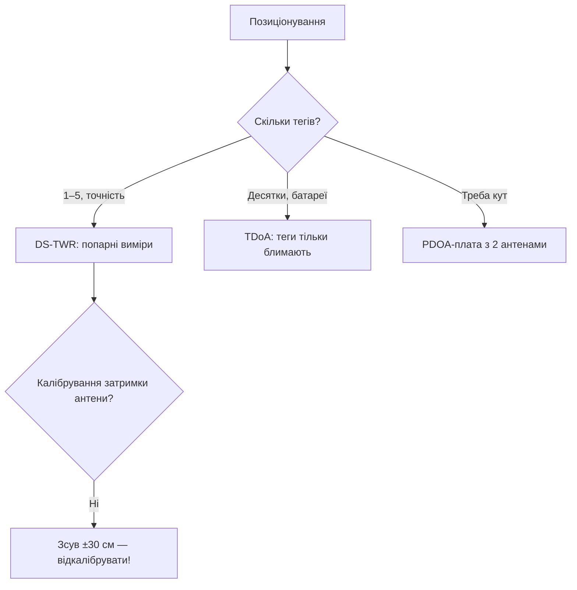

# UWB-2: DW3000 проти DWM1000 (TDoA, PDOA, антени)

## Призначення

DWM1000 (DW1000) - класика UWB-позиціонування, але знята з активного просування. DW3000 - наступник: канали 5/9, краща чутливість, PDOA (кут приходу!) з двома антенами. Нота - міграція і практика.

База: старт - [[Home]], перший UWB - [[12-Moduli-zvyazku/08-LD2410-UWB-IR-Voice|UWB]], BLE-позиціонування - [[05-Radio/06-BLE-Gateway-Tracker]].

![[assets/img/uwb-dw3000-ranging-scheme.png|600]]
*Рис. Якір DW3000 + теги: SS-TWR вимір, TDoA-синхронізація, PDOA-кут з двох антен.*

## Порівняння поколінь

| Параметр | DWM1000 (DW1000) | DW3000 (DWM3000) |
| --- | --- | --- |
| Канали | 1-5, 7 | 5, 9 (суб-ГГц прибрано!) |
| Чутливість | −106 дБм | −108 дБм (дальше/стабільніше) |
| PDOA (кут) | Немає | Є (дві антени!) |
| Споживання TX | ~150 мА | ~100 мА |
| Статус | NRND (не для нових!) | Активний |
| Бібліотеки | arduino-dw1000 (зріла) | dw3000-arduino (молодша!) |

## 1. Схеми виміру: SS-TWR vs DS-TWR vs TDoA

| Схема | Як | Точність | Ціна |
| --- | --- | --- | --- |
| SS-TWR (один запит-відповідь) | Тег↔якір, 2 пакети | ±10-20 см (дрейф годинників!) | Просто |
| DS-TWR (подвійний) | 3 пакети, компенсація дрейфу | ±5-10 см | Стандарт де-факто |
| TDoA (різниця приходу) | Тег блимає, якорі синхронізовані | ±10 см, теги пасивні (батарея!) | Синхронізація якорів |

```text
Підключення DWM3000 до ESP32 (SPI):
  VCC 3.3V, GND; SCK→GPIO18, MOSI→GPIO23, MISO→GPIO19 (VSPI!);
  CS→GPIO5, IRQ→GPIO21, RST→GPIO22, WAKE→GPIO4.
  Антена: вбудована кераміка АБО U.FL; PDOA — ТІЛЬКИ плата з двома антенами!
```

### Mermaid: вибір схеми



## 2. Калібрування (без нього - іграшка!)

```text
1. Антенна затримка: відома дистанція 5.000 м → підібрати delay до 5.00±0.05.
2. PDOA-офсет: обертання на 360° → таблиця поправок кута.
3. Маска приміщення: метал/дзеркала дають мультипас — міряти карту помилок.
4. Температура: TCXO тримає, але калібрувати при робочій!
```

## Типові помилки

| # | Помилка | Чому погано | Як правильно |
| --- | --- | --- | --- |
| 1 | Новий проєкт на DW1000 | NRND, ціни ростуть | DW3000 |
| 2 | Без калібрування затримки | Систематичні ±30 см | П. 2 вище |
| 3 | SS-TWR для точності | Дрейф годинників | DS-TWR |
| 4 | Одна антена для PDOA | Кута немає фізично | Двоантенна плата |
| 5 | UWB крізь метал | Не проходить | Пряма видимість / щільніше якорі |
| 6 | Канал 1-4 на DW3000 | Не підтримується! | Тільки 5 і 9 |

## Офіційні джерела

- [DW3000 datasheet + User Manual (Qorvo)](https://www.qorvo.com/products/d/da008340) - канали, PDOA, калібрування.
- [DWM3000 module docs](https://www.qorvo.com/products/d/da008399) - розпіновка, антени.
- [Makerfabs ESP32 UWB DW3000](https://github.com/Makerfabs/Makerfabs-ESP32-UWB-DW3000) - приклади SS/DS-TWR (шукати свіжий форк!).

## Канали DW3000 і що з ними робити

| Канал | Частота | Смуга | Коментар |
| --- | --- | --- | --- |
| 5 | 6489.6 МГц | 500 МГц | Дефолт для ranging, антени простіші |
| 9 | 7987.2 МГц | 500 МГц | Менше завад від WiFi 6 ГГц? Перевіряти локально! |
| 1-4, 7 | - | - | DW3000 НЕ підтримує (були в DW1000!) |

## Калібрування антенної затримки покроково

```text
1. Два пристрої на рівній дистанції рівно 5.000 м (рулетка!), пряма видимість.
2. 100 вимірів DS-TWR → середнє, напр. 5.34 м (завищення типове!).
3. Підібрати ANT_DLY регістр: зменшувати, доки середнє не стане 5.00±0.05.
4. Повторити для КОЖНОЇ пари «плата+антена» (розкид між екземплярами!),
   значення записати в NVS пристрою.
5. PDOA: на додачу — круговий тест 0–360° з кроком 15°, таблиця поправок.
```

```cpp
// Arduino (концепція dw3000-бібліотеки): ініціалізація + SS-TWR запит
// dw3000.begin(); dw3000.setChannel(5); dw3000.setAntennaDelay(calib);
// distance = dw3000.ranging(peerAddr);  // метри, float
// DS-TWR: три пакети всередині драйвера; читати статус, не блокувати loop!
```

## Залізо для старту: що купити

| Набір | Що всередині | Ціна | Коли |
| --- | --- | --- | --- |
| DWM3000EVB (Qorvo) | Плата + антена + J-Link | $40+ | Розробка, калібрування |
| Makerfabs DW3000 | ESP32 + DW3000 на одній | $30-40 | Швидкий старт з Arduino |
| 4× якорі + 1 тег | Мінімальна TDoA-система | $150+ | Кімната 10×10 м |

```text
Перший вечір: два модулі → приклад DS-TWR → рулетка 5 м → калібрування delay →
карта кімнати на папері → тільки потім корпуси і монтаж!
```

## Мультипас у приміщенні: карта помилок

```text
Процедура: тег на візку, сітка 1 м по кімнаті, 50 вимірів у точці →
теплова карта похибки. Типові плями: біля металевих шаф (±50 см!),
за колонами (тінь), під стелею з металопрофілем.
Лікування: +1 якір на пляму, маска «недовірених зон» у софті,
фільтр Калмана з вагою за SNR (слабкий сигнал — менша вага!).
```

## Глосарій UWB за 30 секунд

| Термін | Що означає |
| --- | --- |
| TWR | Two-Way Ranging (запит-відповідь) |
| TDoA | Різниця часу приходу (тег тільки блимає!) |
| PDOA | Різниця фаз (кут з двох антен) |
| CIR | Імпульсна характеристика каналу (видно мультипас!) |

## Див. також

- [[Home|Головна]]
- [[12-Moduli-zvyazku/08-LD2410-UWB-IR-Voice|Радар/UWB перший]]
- [[05-Radio/06-BLE-Gateway-Tracker|BLE-позиціонування]]
- [[04-Shini/02-SPI|SPI]]
- [[10-Sensori/29-Range-Lidar-60GHz|Далекоміри]]
