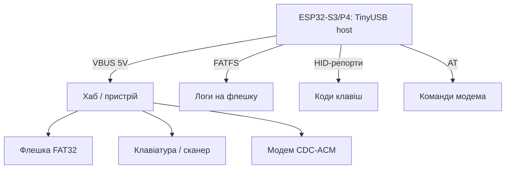

# ESP32 як USB-хост - флешки, HID і CDC через TinyUSB

![[assets/img/esp32-usb-host-scheme.png|600]]
*Рис. S3/P4 у ролі хоста: опитує флешку, клавіатуру і модем - живлення 5V на VBUS обов'язкове.*

> [!tip] Що це за нота
> Зворотний бік USB: ESP32 не пристрій для ПК, а хост для периферії - логер на флешку без SD-слота, штрих-код сканером, модем по CDC. Працює на S3 (OTG FS) і P4 (OTG HS). База: [[04-Shini/06-USB-OTG-JTAG|USB-OTG і JTAG]], [[04-Shini/07-SD-SDIO|карти SD]], [[09-Proshivka/01-ESP-IDF-setup|налаштування ESP-IDF]].

## 1. Мета

Освоїти три класи USB-пристроїв з ESP32:

- MSC: флешка - читання/запис FATFS, логер без SD-слота;
- HID: клавіатура/миша/сканер штрих-кодів - ввід без кнопок;
- CDC: USB-модеми і конвертери - AT-команди через USB;
- живлення VBUS 5V - хост живить пристрій, не навпаки.

| Клас | Пристрій | Бібліотека/приклад |
| --- | --- | --- |
| MSC | флешка FAT32 | `usb/host/msc` + FATFS |
| HID | клавіатура, сканер | `usb/host/hid` |
| CDC | модем, CP2102 | `usb/host/cdc_acm` |
| Hub | розгалужувач | каскад за потребою |

## 2. Архітектура



Стек: TinyUSB host → клас-драйвер → застосунок. Дескриптори парсимо готові, вручну - лише у відладці.

## 3. Апаратна частина

- S3: GPIO19/20 - USB D−/D+, вбудований PHY;
- P4: окремий USB-OTG HS PHY - швидше і більше струму;
- VBUS 5V на роз'єм - хост зобов'язаний живити пристрій (до 500 мА);
- захисний ключ живлення (TPS2051 або поліфьюз) - КЗ на флешці не має вбити плату;
- для тестів - OTG-перехідник з живленням, не голий кабель.

## 4. MSC: флешка як диск

- приклад `usb/host/msc`: монтування, `fopen/fwrite/fclose` через FATFS;
- логер: відкриваємо файл раз на годину, пишемо рядками, закриваємо - флешка переживе виймання;
- безпечне виймання: кнопка «відмонтуй», світлодіод підтвердження;
- швидкість: десятки КБ/с - вистачає на логи і конфіги, не на відео.

## 5. Робочий код (IDF)

```c
#include "usb/msc_host.h"
#include "esp_log.h"

static const char *TAG = "usbmsc";

void msc_event_cb(msc_host_event_t event, void *arg) {
  if (event == MSC_DEVICE_CONNECTED) {
    ESP_LOGI(TAG, "flash connected");
    msc_host_install(NULL);
    FILE *f = fopen("/usb/log.txt", "a");
    if (f) {
      fprintf(f, "boot %lu\n", (unsigned long)esp_timer_get_time());
      fclose(f);
      ESP_LOGI(TAG, "logged to flash");
    }
  } else if (event == MSC_DEVICE_DISCONNECTED) {
    ESP_LOGI(TAG, "flash removed");
    msc_host_uninstall();
  }
}

void app_main(void) {
  msc_host_config_t cfg = {
    .event_cb = msc_event_cb,
  };
  ESP_ERROR_CHECK(msc_host_install(&cfg));
  while (1) {
    vTaskDelay(pdMS_TO_TICKS(1000));
  }
}
```

Шлях `/usb` - точка монтування з прикладу. Реальний логер пише пакетами по 512 байт - рівно сектор, без фрагментації.

## 6. HID: клавіатура і сканер

- приклад `usb/host/hid`: репорти 8 байт, коди клавіш HID-таблиця;
- сканер штрих-кодів - та сама клавіатура: читаємо рядок до Enter;
- NKRO-клавіатури - довші репорти, парсимо довжину з дескриптора;
- миша - координати і кнопки для HMI без тача.

## 6.1 Хаби і живлення периферії

- хаб без живлення: максимум 2 низькоспоживчі пристрої;
- хаб з живленням: флешка + сканер + модем одночасно;
- поліфьюз 500 мА на VBUS - КЗ не вбиває плату;
- довгі кабелі USB 2.0 - до 3 м без хаба, далі активний;
- OTG-перехідник з окремим входом живлення - must-have в сумці.

## 6.2 Швидкість і межі хоста

- FS (S3): 12 Мбіт/с, реально ~1 МБ/с на флешку;
- HS (P4): 480 Мбіт/с, флешка впирається в FATFS;
- ізохронні камери (UVC-відео) - межа можливостей, брати MIPI;
- один пристрій на порт без хаба - найстабільніша конфігурація;
- довгі трансфери - подвійні буфери, інакше underrun.

## 7. CDC-модеми

- приклад `usb/host/cdc_acm`: VCP як файл - читаємо/пишемо;
- 4G-модеми в CDC-режимі - AT-команди і PPP далі;
- кілька інтерфейсів - відкриваємо кожен окремо;
- [[12-Moduli-zvyazku/03-SIM800L-GPS|модеми SIM800L]] - AT-частина та сама.

## 8. Типові помилки

| Симптом | Причина | Лікування |
| --- | --- | --- |
| Пристрій не бачиться | немає 5V на VBUS | подати живлення хоста, перевірити ключ |
| Флешка монтується через раз | просадка струму | хаб з живленням, коротший кабель |
| HID мовчить | складний дескриптор пристрою | читати довжину репорту, не фіксовані 8 |
| CDC не відкривається | модем у QMI-режимі | перевести в CDC-ACM AT-командою |
| Працює на P4, не на S3 | HS проти FS таймінги | різні приклади під чип, не копіювати |
| Після виймання - паніка | немає обробки disconnect | колбек відмонтування + прапорець |

## 9. Суміжні ноти

- [[04-Shini/06-USB-OTG-JTAG|USB-OTG і JTAG]] - залізна сторона USB.
- [[04-Shini/07-SD-SDIO|карти SD]] - альтернатива флешці.
- [[12-Moduli-zvyazku/03-SIM800L-GPS|модеми SIM800L]] - AT поверх CDC.
- [[09-Proshivka/05-JTAG-Debug|налагодження JTAG]] - той же роз'єм, інша роль.
- [[14-Devboards/16-P4-DevKit|плата P4]] - OTG HS на борту.

## Офіційні джерела

- [USB Host API (Espressif)](https://docs.espressif.com/projects/esp-idf/en/latest/esp32s3/api-reference/peripherals/usb_host.html) - хост-стек, класи, події.
- [USB Host examples (Espressif, GitHub)](https://github.com/espressif/esp-idf/tree/master/examples/peripherals/usb/host) - MSC/HID/CDC приклади.
- [TinyUSB (GitHub)](https://github.com/hathach/tinyusb) - стек під капотом, дескриптори.
