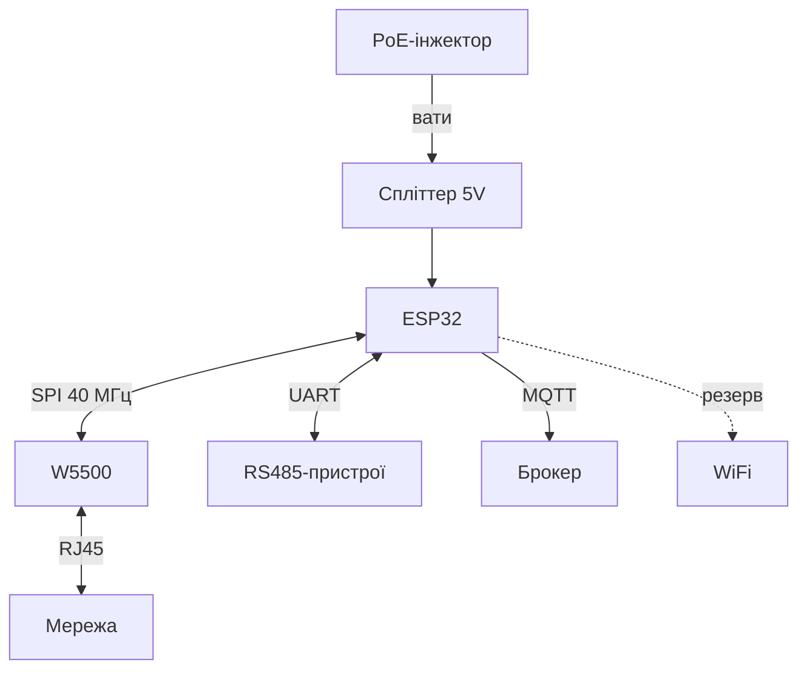

# ESP32 Ethernet глибоко - W5500, PoE і провідний шлюз

![[assets/img/esp32-ethernet-poe-deep-scheme.png|600]]
*Рис. Провідний вузол: W5500 по SPI дає TCP/IP, PoE-спліттер - вати, WiFi лишається резервом.*

> [!tip] Що це за нота
> Коли радіо не варіант: цех, підвал, серверна. Апаратний TCP/IP в W5500 розвантажує кристал, PoE прибирає БЖ. База: [[04-Shini/02-SPI|шина SPI]], [[12-Moduli-zvyazku/07-SIM7600-W5500-MCP2515|модулі SIM/W5500]].

## 1. Мета

Побудувати вузол, якому не потрібен ефір:

- W5500 по SPI: сокети, швидкості, ліміти;
- PoE: спліттер vs PoE-HAT для ESP32;
- резервування Ethernet+WiFi з автоперемиканням;
- шлюз RS485→Ethernet→MQTT.

| Варіант | Швидкість | Коли |
| --- | --- | --- |
| W5500 модуль | 10/100, SPI 80 МГц | універсально |
| Вбудований MAC+PHY (рідкісні плати) | 10/100 | якщо є на платі |
| PoE-спліттер 5V | + вати по кабелю | стеля/шафа |
| WiFi-бекап | - | резерв каналу |

## 2. Архітектура



W5500 тримає 8 сокетів апаратно: TCP/IP не їсть CPU. SPI на 40 МГц - межа стабільності на довгих дротах.

## 3. Розпіновка модуля W5500

| Пін ESP32 | Пін W5500 | Примітка |
| --- | --- | --- |
| GPIO18 | SCK | такт до 80 МГц |
| GPIO23 | MOSI | дані в модуль |
| GPIO19 | MISO | дані з модуля |
| GPIO5 | CS | вибір кристала |
| GPIO4 | INT | переривання сокетів |
| GPIO2 | RST | апаратний ресет |
| 3V3/GND | VCC/GND | 200 мА запас |

Довжина SPI-шлейфа до 10 см на 40 МГц. Довше - опускати до 20 МГц або буфери.

## 4. PoE-практика

- спліттер 5V 2A: стандартний 802.3af вхід, USB-C/гребінка вихід;
- гальванічна розв'язка всередині - земля мережі не йде в плату;
- бюджет: плата + датчики + запас 30 %;
- грозозахист на вуличних прольотах;
- тестер PoE показує клас пристрою до вмикання.

## 5. Робочий код (C, Arduino)

```cpp
#include <SPI.h>
#include <Ethernet.h>

byte mac[] = {0xDE, 0xAD, 0xBE, 0xEF, 0xFE, 0x01};
EthernetClient client;

void setup() {
  Serial.begin(115200);
  SPI.begin(18, 19, 23, 5);
  Ethernet.init(5);
  if (Ethernet.begin(mac) == 0) {
    Ethernet.begin(mac, IPAddress(192, 168, 1, 177));
  }
  Serial.println(Ethernet.localIP());
}

void loop() {
  if (!client.connected()) {
    client.stop();
    client.connect("broker.local", 1883);
  }
  static unsigned long t0 = 0;
  if (millis() - t0 > 5000) {
    t0 = millis();
    client.println("PUB sensors/temp 23.5");
  }
  Ethernet.maintain();
}
```

`Ethernet.maintain()` - продовження DHCP-оренди. Статика надійніша для 24/7: менше точок відмови.

## 6. Робочий код (MicroPython)

```python
# MicroPython + W5500 (драйвер wiznet5k)
import network
import time
from machine import Pin, SPI

spi = SPI(1, baudrate=40000000, sck=Pin(18), mosi=Pin(23), miso=Pin(19))
nic = network.WIZNET5K(spi, Pin(5), Pin(4))
nic.active(True)
nic.ifconfig(('192.168.1.177', '255.255.255.0', '192.168.1.1', '8.8.8.8'))
print(nic.ifconfig())

import usocket
while True:
    try:
        s = usocket.socket()
        s.connect(('broker.local', 1883))
        s.send(b'PUB sensors/temp 23.5\n')
        s.close()
    except OSError as e:
        print('net error', e)
    time.sleep(5)
```

WIZNET5K-драйвер є в прошивках з мережевою підтримкою. Немає - збираємо свою з модулем `wiznet5k`.

## 7. Резервування каналів

- основний Ethernet, WiFi - `reconnect` при втраті лінка;
- перевірка: ping шлюзу кожні 30 с;
- MQTT-брокерів два (локальний + хмара) - клієнт перебирає;
- статичні IP обом інтерфейсам - без DHCP-залежності;
- журнал перемикань - для розбору нестабільності.

## 8. Типові помилки

| Симптом | Причина | Лікування |
| --- | --- | --- |
| DHCP 0.0.0.0 | лінка немає/кабель | перевірити LED Link/Act, інший кабель |
| Рветься на 40 МГц SPI | довгий шлейф | 20 МГц або коротше 10 см |
| Працює хвилину і висне | немає `maintain()` | викликати в циклі або статика |
| PoE не живить | пасивний інжектор | тільки 802.3af/at активний |
| Сокети закінчились | не закриваємо з'єднання | `stop()` + таймаути |
| Повільно після WiFi | обидва стеки активні | пріоритет Ethernet, WiFi в сон |

## 9. Швидка шпаргалка Ethernet

- SPI 40 МГц, шлейф до 10 см;
- статика замість DHCP для 24/7;
- PoE - тільки активний стандарт;
- сокети закривати з таймаутом;
- WiFi - резерв, не основа.

## 10. Суміжні ноти

- [[12-Moduli-zvyazku/07-SIM7600-W5500-MCP2515|модулі SIM/W5500]] - огляд модуля.
- [[04-Shini/02-SPI|шина SPI]] - швидкості і CS.
- [[15-Protokoli/01-MQTT|протокол MQTT]] - телеметрія.
- [[02-Zhivlennya/02-LDO-DC-DC|живлення]] - стабільні 3.3V.
- [[Home|головна карта]] - повна навігація.

## Офіційні джерела

- [W5500 (WIZnet Docs)](https://docs.wiznet.io/Product/Chip/Ethernet/W5500) - регістри, сокети, SPI.
- [Ethernet examples (Espressif, GitHub)](https://github.com/espressif/esp-idf/tree/master/examples/ethernet) - драйвери і події.
- [MQTT Specification (OASIS)](https://mqtt.org/mqtt-specification/) - протокол поверх TCP.
