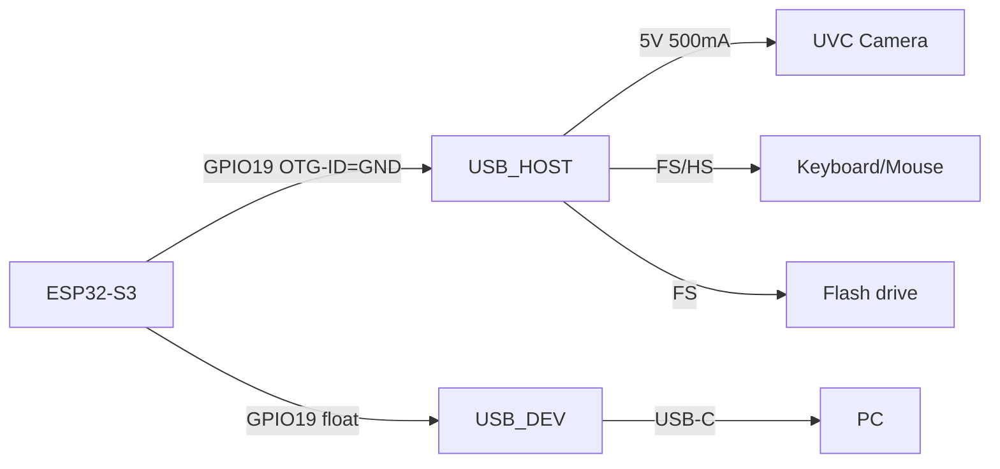

# ESP32 USB-OTG і UVC-Host - глибока практика

![[assets/img/esp32-usb-host-deep-scheme.png|600]]
*Рис. ESP32 як USB-Host: OTG-ID пін визначає роль, UVC-камери через UVC-стек, HID-клавіатури через HID-клас.*

> [!tip] Призначення ноти
> Розібрати, який ESP32-чу може бути USB-host, якої швидкості (FS/HS), з якими класами (UVC/UAC/HID/MSC/CDC) і чому не всі чипи однаково.

## 1. Який чип що вміє

| Чип | USB | Швидкість | Отримання | Host | Примітка |
| --- | --- | --- | --- | --- | --- |
| ESP32 | USB-OTG FS | Full-Speed (12 Мб/с) | Так | Так | Переривання + polling |
| ESP32-S2 | USB-OTG FS | Full-Speed | Так | Так | Видалено UVC з SDK 5.2 |
| ESP32-S3 | USB-OTG HS + FS | High-Speed (480 Мб/с) | Так | Так | UVC/VCP/MSC/HID |
| ESP32-C3 | USB-OTG FS | Full-Speed | Так | Так | Неможливий UVC-стек |
| ESP32-C6 | USB-OTG FS | Full-Speed | Так | Ні (device) | Host обмежений |
| ESP32-P4 | USB-OTG HS + FS | High-Speed | Так | Так | Native USB-Host, Ethernet |

- **Full-Speed (12 Мб/с)** — достатньо для HID, CDC, MSC (флешки); для UVC-камери — мінімум, але працює (720p @ 30 FPS через компресію).
- **High-Speed (480 Мб/с)** — для 1080p UVC, аудіо-інтерфейсів, швидких MSC.



## 2. Роль через OTG-ID


- `GPIO19` (на ESP32-S3) — `OTG_ID`; якщо підключено `GND` → Host; якщо `VCC/плаває` → Device;
- `GPIO20` / `GPIO21` — `USB_D-` / `USB_D+` (HS через внутрішні PHY);
- Для Host-режиму: пін живлення USB (`5V`) має давати `500 мА` (зовнішній БЖ або хаб); плата не живить з `3.3V` регулятора.

## 3. UVC-Host практика (ESP32-S3 / P4)

```c
#include "esp_camera.h"
#include <usb/usb_host.h>

void app_main(void) {
    usb_host_config_t config = { .skip_phy_setup = false, .intr_flags = ESP_INTR_FLAG_LOWMED };
    ESP_ERROR_CHECK(usb_host_install(&config));
    // UVC-стек підключається через usb_host_client_handle_t
    // камера розпізнається по PID/VID
    ESP_LOGI("UVC", "Host ready: %d devices found", usb_host_device_addr_list(0));
}
```

- **Обмеження**: UVC-потік вимагає `USB-Host` + `USB-Stream` (stack з SDK, не Base); на S2 видалено в 5.2 — перевіряйте версію SDK.
- **Пам'ять**: кожен UVC-камерний потік займає ~200-400 КБ буфера (720p @ MJPEG); на 512 КБ SRAM — лише 1 камера без іншого.
- **Живлення**: 5V 500 мА на порт; якщо камера з підсвічуванням — додавайте зовнішній БЖ.

## 4. HID-Host (клавіатура/миша)

```python
from machine import USB
from usb_hid import HIDServer
# MicroPython / CircuitPython для HID-Host обмежено;
# C SDK через usb_host_client для HID-report
```

- HID-Host працює на FS (ESP32, S2, S3, C3); не вимагає HS.
- Підключення через `USB-HID` клас; зчитування report через callback.

## 5. MSC / CDC-Host

- MSC — зчитування флешок через `FATFS` + `USB-Host` (ESP32-S3/P4);
- CDC — серійний порт через USB-кабель (PC ↔ ESP32) — це Device, не Host.

## 6. Типові помилки

| Симптом | Причина | Лікування |
| --- | --- | --- |
| `No device found` на Host | OTG-ID не підключений / пін wrong | Перевірте `GPIO19` на `GND`; перевірте `USB_D+/D-` |
| UVC не розпізнає камеру | SDK-версія або не UVC-клас | Оновіть до 5.2+; перевірте PID/VID (лог через `usb_host_printf`) |
| Перезавантаження при USB-ті | Недостатній БЖ (`5V < 4.8V`) | Окремий БЖ `5V 2A+`; не живити з `VIN` плати |
| MSC не бачить флешку | Формат NTFS / exFAT / більший розділ | Форматувати FAT32; розмір < 32 ГБ |
| `Task watchdog` після USB | Buffer overflow на UVC-потоці | Зменшіть роздільність (480p) / зменшіть FPS |


## 2.1 Частоти та протоколи

- Full-Speed USB 2.0 = 12 Мбіт/с; достатньо для HID (клавіатура 8 байт/запит, 125 Гц) та MSC (флешка до 32 ГБ FAT32).
- High-Speed USB 2.0 = 480 Мбіт/с; необхідний для UVC 720p MJPEG (~6 Мб/с потік) та аудіо 48 кГц stereo.
- ESP32-S3 має вбудований HS PHY; ESP32 (Classic) — лише FS.
- Device-режим (CDC/MSC) працює на всіх; Host — потребує 5V-джерело > 500 мА.

## 2.2 Живлення USB-Host

- Порт USB на ESP32-платі не дає 5V на вихід — зовнішній хаб/БЖ обов’язковий.
- Для UVC-камери з підсвічуванням: рахувати 5V × 0.5 А (камера) + 0.2 А (стабілізатор PWM) = 3.5 Вт + запас = БЖ 5A.
- Для HID (миша) — 500 мА достатньо; HID не вимагає HS.
- Для MSC — флешка до 32 ГБ FAT32; NTFS/exFAT не підтримуються без додаткового стека.

## 2.3 Код UVC-потоку (ESP-IDF 5.2+)

```cpp
#include "esp_camera.h"
#include <usb/usb_host.h>
void app_main() {
    usb_host_config_t cfg = { .skip_phy_setup = false, .intr_flags = ESP_INTR_FLAG_LOWMED };
    ESP_ERROR_CHECK(usb_host_install(&cfg));
    // UVC-class розпізнається автоматично за PID/VID
    ESP_LOGI("UVC", "Host active; FS/HS detected");
}
```

> [!warning] У SDK 5.2 UVC-стек видалено з базового бандла — перевіряйте `component.mk` на наявність `usb_stream`.


## Див. також

- [[12-Moduli-zvyazku/32-USB-UVC-Host-Deep | USB-UVC-Host глибоко]] - глибша схема UVC-потоку;
- [[04-Shini/06-USB-OTG-JTAG | USB-OTG-JTAG]] - OTG + JTAG на ESP32;
- [[01-Hardware/09-ESP32-C2-P4 | C2/P4]] - P4 з HS + Ethernet.

## Офіційні джерела

- [ESP-IDF USB-Host (Espressif)](https://docs.espressif.com/projects/esp-idf/en/latest/esp32/api-reference/usb/usb_host.html) - Host-стек, класів.
- [USB-OTG для ESP32-S3 (Espressif)](https://docs.espressif.com/projects/esp-idf/en/latest/esp32s3/api-reference/usb/otg.html) - HS + FS, OTG-ID.
- [UVC specs (USB-IF)](https://www.usb.org/document-library/video-class-v11-specification) - клас UVC.
- [ESP32-S3 Datasheet (Espressif)](https://www.espressif.com/sites/default/files/esp32-s3_datasheet_en.pdf) - USB-OTG, DMA, UART.

## 7. Живлення USB-Host для торгівлі

- Розрахунок сумарного струму: 500 мА (камерa) + 100 мА (PWM-кулер) + 50 мА (контролер) = 650 мА мінімум.
- БЖ з PD-протоколом (5 В / 5 А = 27 Вт) дає запас для піків при USB-запуску.
- Якщо БЖ дає лише 3 А — обмежуйте до одной камери + HID, без MSC.
- Перевіряйте `ESP-IDF debug лог` (Pi) або `usb_host_printf(USB_HOST_LOG_LEVEL_DEBUG)` (ESP32) для діагностики.

> [!warning] USB-Host без зовнішнього БЖ > 2 А — гарантоване падіння 5V і скидання ESP32 під навантаженням.
1) Якість
## Офіційні джерела
- [USB-Host ESP-IDF docs] (https://docs.espressif.com/projects/esp-idf/en/latest/esp32/api-reference/usb/usb_host.html) - офіційний стек.
## 10. Завершення
- USB-Host на ESP32-S3/P4: FS/HS, UVC/HID/MSC; OTG-ID керує роллю; 5V 500мА мінімум; SDK 5.2+ перевіряти наявність UVC.
