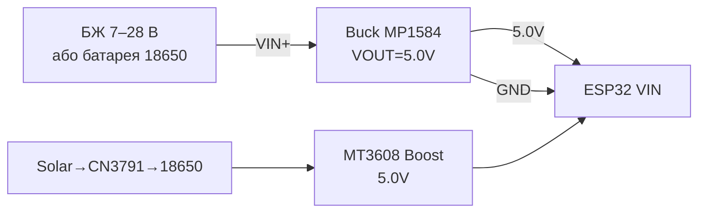

# Buck / Boost / Solar - повний вузол живлення

База: [[02-Zhivlennya/01-Lancjugi-zhivlennya]], рівні [[13-Moduli-zhivlennya-rivniv/02-Level-Shifters]], сон [[07-Timeri-Son/03-Sleep-ULP]], WiFi-піки [[05-Radio/01-WiFi-STA-AP]], чек-листи [[99-Dodatki/03-Cheklisti-montazhu]], старт [[Home]].

## Призначення

Buck / Boost / Solar - повний вузол живлення - Buck: MP1584 vs LM2596; Налаштування підстроєчником (обов'язково без навантаження ESP32!); Boost MT3608 (батарейка -> 5V). Buck / Boost / Solar - повний вузол живлення. База: [[02-Zhivlennya/01-Lancjugi-zhivlennya]], рівні 13-Moduli-zhivlennya-rivniv/02-Level-Shifters, сон 07-Timeri-Son/03-Sleep-ULP, WiFi-піки [[05-Radio/01-WiFi-STA-AP]], чек-листи [[99-Dodatki/03-Cheklisti-montazhu]], старт Home.

## 1. Buck: MP1584 vs LM2596

| Параметр | MP1584 (Mini360) | LM2596 |
| --- | --- | --- |
| Топологія | синхронний buck, 1.5 МГц | несинхронний, 150 кГц |
| Струм | до 3A (реально 1.5-2A без радіатора) | до 3A (гріється, потрібен радіатор) |
| ККД | 85-95% | 70-85% |
| Пульсації | низькі, маленькі конд. | вищі, великий дросель |
| Мінімальний вхід | 4.5V | 4.5-7V (dropout ~1.5V) |
| Для ESP32 | кращий вибір | ок для стаціонару 12V->5V |
| ESP32 | Модуль buck | Примітка |
| --- | --- | --- |
| VIN (5V пін) | VOUT+ buck | 5.0V виставити точно |
| GND | VOUT- | товста земля |
| - | VIN+ | 7-28V (MP1584) / 7-35V (LM2596) |

### Налаштування підстроєчником (обов'язково без навантаження ESP32!)

1. Не підключати ESP32. Подати вхідну напругу на buck.
2. Мультиметр на VOUT. Крутити підстроєчник проти годинникової - напруга падає.
3. Виставити 5.0V (для VIN-піна) або 3.30V (для прямого живлення 3.3V шини, обережно!).
4. Вимкити вхід, підключити ESP32, увімкнути, перевірити під навантаженням WiFi-скану: просадка < 0.15V - норма.
5. Залити підстроєчник лактом/термоклеєм від вібрації.

## 2. Boost MT3608 (батарейка -> 5V)

MT3608: 2-24V вхід, до 28V вихід, 2A пік. Для 1x18650 (3.0-4.2V) -> 5V. ККД 85-93%. Підстроєчник так само. Обов'язковий конденсатор 100 мкФ на виході + 100 нФ кераміка біля ESP32. Піки WiFi 500 мА boost тягне, але батарея має віддавати 1A+ без просадки.

| ESP32 | MT3608 | Примітка |
| --- | --- | --- |
| VIN 5V | VOUT+ 5V | виставити 5.0V |
| GND | VOUT- | земля |
| - | VIN+ | 3.0-4.2V від батареї/TP4056 OUT |

## 3. TP4056 + DW01 (заряд Li-ion) + Solar CN3791

- TP4056: лінійний заряд 4.2V, струм задається Rprog (1.2к = 1A). Плата з DW01+FS8205A = захист від перерозряду/перезаряду/КЗ. Версія з OUT+- і захистом - брати саме її.
- Недолік TP4056: НЕ вміє load-sharing - одночасний заряд і живлення ESP32 плутає алгоритм CC/CV. Рішення: або заряджати з вимкненим ESP32, або схема з P-MOSFET load-sharing.
- Solar: TP4056 від сонячної панелі працює погано (немає MPPT). Правильно: CN3791 (MPPT 1-3S) або CN3065 (1S solar). CN3791 тримає панель у точці максимальної потужності резисторним дільником.

### Energy harvesting: BQ25570 / BQ25504 / SPV1050 / LT3652

| Мікросхема | Джерело | Особливість |
| --- | --- | --- |
| BQ25570 | Сонце/світло/термо (нВт-мВт) | MPPT + buck + заряд Li-ion/суперкапа, холодний старт від 330 мВ! |
| BQ25504 | Те саме, дешевше | Без вбудованого buck - лише заряд |
| SPV1050 | Сонце/світло | MPPT + boost, для слабкого освітлення приміщень |
| LT3652 | Сонце 5-32 В | Потужний MPPT-заряд до 2 А, для великих панелей |

> Рівні: CN3791 - сонячна панель ваттного класу; BQ25570/SPV1050 - мікровати від кімнатного світла/TEG/п'єзо (датчик раз на годину, а не стрим!).

### Повна схема автономного вузла (рекомендована)

```text
[Solar 6V 5W] -> [CN3791 MPPT] -> [1S Li-ion 18650 3000mAh + BMS/DW01]
   -> [MT3608 boost 5.0V] -> [ESP32 VIN] + [100uF + 100nF біля ESP32]
   -> [DS18B20 / сенсор] живиться від GPIO або 3V3 через MOSFET (відсікати в deep-sleep)
Вимір батареї: VBAT+ -> дільник 100к/100к -> GPIO34 (ADC) + конденсатор 100нФ
Вимір сонця: VSOL+ -> дільник 100к/27к -> GPIO35 (ADC)
```

### Код виміру батареї (3 фреймворки, суть одна)

```cpp
// Arduino: ADC 12 біт, attenuation 11dB, калібрування
analogReadResolution(12); analogSetAttenuation(ADC_11db);
int raw = analogRead(34); float v = raw / 4095.0 * 3.3 * 2.0; // дільник 1:1
```

```python
# MicroPython
from machine import ADC, Pin
adc = ADC(Pin(34)); adc.atten(ADC.ATTN_11DB); adc.width(ADC.WIDTH_12BIT)
v = adc.read() / 4095 * 3.3 * 2.0
```

```c
// ESP-IDF: adc_oneshot + adc_cali, дільник 1:1, curve-fitting калібрування
```

| Симптом | Причина | Рішення |
| --- | --- | --- |
| Buck гріється, ESP32 ребутиться | LM2596 на межі, тонкі дроти | MP1584 + товсті дроти + 470 мкФ на виході |
| TP4056 не закінчує заряд | ESP32 споживає паралельно | load-sharing MOSFET або заряджати вимкненим |
| Вночі батарея сідає за дні | немає deep-sleep / сенсор їсть | deep-sleep + MOSFET живлення сенсорів, див. [[07-Timeri-Son/03-Sleep-ULP]] |

## Схема підключення

| ESP32 | Buck MP1584 / Boost MT3608 | Примітка |
| --- | --- | --- |
| VIN (5V пін) | VOUT+ 5.0V | Виставити точно мультиметром БЕЗ ESP32 |
| GND | VOUT− | Товста земля, 470 мкФ на виході |
| - | VIN+ | 7-28V (MP1584) / 3.0-4.2V батарея (MT3608) |

### ASCII-схема

```text
БЖ / Solar              Buck MP1584 (Mini360)        ESP32 DevKit
----------              ---------------------        ------------
7–28 В ───────────────► VIN+ buck
GND ──────────────────► VIN− buck
                        [підстроєчник] → виставити 5.0 В БЕЗ ESP32!
                        VOUT+ ────────────────────► VIN (5V пін)
                        VOUT− ────────────────────► GND (товста!)
                        VOUT ◄──[470 мкФ + 100 нФ]──► GND біля ESP32
MT3608: батарея 3.0–4.2 В ──► VIN+; VOUT+ 5.0 В ──► VIN ESP32
Підстроєчник залити лаком від вібрації; просадка WiFi < 0.15 В
```

### Mermaid



![[assets/img/buck-mp1584-trim.png|500]]
*Рис. Buck MP1584 - налаштування 5.0 В підстроєчником без навантаження, товста земля. Місце під фото - див. [[assets/README]].*

## Офіційні джерела

- [LM2596 - даташит (TI)](https://www.ti.com/product/LM2596) - buck 3A, WEBENCH-розрахунок дроселя.
- XC6206 Datasheet (Torex, пошук PDF): [XC6206 search](https://www.alldatasheet.com/view.jsp?Searchword=XC6206) - LDO 3.3V, SOT-23.
- MP1584 (monolithicpower.com), MT3608, CN3791 MPPT - *перевірити вручну* (MPS блокує автозапити; для інших єдиних сторінок вендорів не підтверджено).

### MPPT vs PWM для сонячної панелі

| Контролер | Метод | ККД | Коли |
| --- | --- | --- | --- |
| CN3791 | MPPT (точка макс. потужності) | ~90% | Панель 9-12V → 1S Li-Ion, хмарність |
| TP4056 + панель безпосередньо | Немає (робоча точка пливе) | ~70% | Мала панель 5-6V, бюджетний вузол |
| PWM-контролер | ШІМ-обмеження | ~75% | 12V системи (не ESP32-кейс) |

### Процедура виставлення buck-модуля (щоб не спалити навантаження!)

```text
1. БЕЗ навантаження: крутити trim, мультиметр на виході → потрібні вольти.
2. Вимкнути живлення, підключити навантаження через амперметр.
3. Увімкнути, перевірити струм і нагрів 5 хв.
4. Залакувати trim (крапля лаку/маркер-мітка проти вібрації!).
```

- FS8205 Datasheet (Fortune Semi, пошук PDF): [FS8205 search](https://www.alldatasheet.com/view.jsp?Searchword=FS8205) - подвійний MOSFET для BMS.

### Ключові параметри вузла живлення

| Параметр | Значення |
| --- | --- |
| Buck (MP1584/LM2596) | Вхід 7-28V → 5V/3A, trim виставляти БЕЗ навантаження |
| Boost (MT3608) | 2-24V вхід → 5V/2A для Li-Ion 1S |
| Заряд (TP4056 + DW01) | 4.2V CC/CV, захист від перерозряду/КЗ |
| Solar (CN3791 MPPT) | Панель 9-12V → 1S Li-Ion, ~90% ККД |
| Автономність | Рахувати: мАг/добу vs ємність × 0.8 |

## Див. також

- [[Home]]
- [[02-Zhivlennya/01-Lancjugi-zhivlennya]]
- [[13-Moduli-zhivlennya-rivniv/02-Level-Shifters]]
- [[07-Timeri-Son/03-Sleep-ULP]]
- [[06-Analog/01-ADC|ADC]]
- [[99-Dodatki/02-Troubleshooting-FAQ]]
- [[99-Dodatki/03-Cheklisti-montazhu]]

![[assets/img/placeholder.png]]
