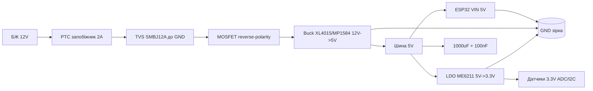

# 04 - LDO, Buck XL4015 та захист живлення ESP32

## Призначення

Правильний вибір стабілізатора 5V→3.3V для ESP32 (піки 500мА при Wi-Fi TX) та зниження 12V/24V→5V без перегріву. LDO для чистих аналогових вузлів, buck - для потужності. Окремо - вхідний захист від переполюсовки, перенапруги та КЗ.

Правило: 5V→3.3V малими струмами - LDO з малим dropout; 12V→3.3V або струм >500мА - тільки buck.

## Характеристики

### LDO порівняння для ESP32

| Параметр | AMS1117-3.3 | HT7333 | RT9080-33 / ME6211C33 |
| --- | --- | --- | --- |
| Тип | LDO 1A, NPN | LDO 250мА, ultra-low Iq | LDO 500мА, low-dropout CMOS |
| Вхід | 4.5-12V (реком. до 7V) | 4.3-12V | 3.6-6V (RT9080 до 5.5V) |
| Dropout | 1.1V @1A (великий!) | 90мВ @100мА | 200-250мВ @500мА |
| Iq (спокій) | 5-10мА | 4-8мкА (!) | 25-60мкА |
| Макс. струм | 1A (з радіатором) | 250мА (мало для Wi-Fi!) | 500мА (достатньо для ESP32) |
| Шум / PSRR | середній, 60дБ | добрий для sleep-вузлів | 70дБ, чистий для ADC |
| Корпус | SOT-223 / TO-220 | SOT-89 | SOT-23-5 / SOT-89 |
| Для ESP32 | гріється, але тягне TX-піки | ТІЛЬКИ для deep-sleep датчиків без Wi-Fi | оптимально для батарейних вузлів |
| Ціна | копійки | копійки | трохи дорожче |

Висновок:

- DevKit штатно ставить AMS1117 - ок для столу, погано для батареї (Iq 5мА з'їсть 18650 за місяць).
- HT7333 - король deep-sleep (4мкА), але Wi-Fi увімкне - просадка і ресет. Ставити тільки якщо ESP32 спить і прокидається рідко + конденсатор 470мкФ.
- RT9080 / ME6211 (500мА, 25мкА) - золота середина для ESP32 + Wi-Fi від батареї.

### Buck-модулі

| Параметр | XL4015 5A | LM2596 3A | MP1584 / MP2307 3A |
| --- | --- | --- | --- |
| Топологія | buck, 180кГц | buck, 150кГц | buck, 500кГц-1МГц |
| Вхід | 4-38V | 4.5-40V | 4.5-28V |
| Вихід | 1.25-36V (CC/CV) | 1.23-37V (тільки CV) | 0.8-25V (тільки CV) |
| Струм | 5A (з вентилятором), реально 3A довго | 3A (реально 2A, гріється) | 3A (реально 2A, холодний) |
| ККД | 85-95% | 75-85% | 90-95% |
| Розмір / дросель | великий тороїд | великий тороїд | крихітний SMD-дросель |
| Шум | середній | великий | малий (висока частота) |
| Ціна | середня | найдешевший | трохи дорожче |
| Для ESP32 | 12V→5V силові вузли, заряд свинцю | стіл/макет, не для батареї | 12V→5V/3.3V батарейні вузли, дрони |

## Легенда пінів модуля

### XL4015 (синій модуль з 2 підстроєчниками + LED)

| Пін | Опис |
| --- | --- |
| IN+ | вхід 4-38V (плюс від БЖ 12/24V) |
| IN- | GND входу |
| OUT+ | вихід регульований 1.25-36V |
| OUT- | GND виходу (спільний з IN-) |
| CV-потенціометр (ближче до клем) | грубе/тонке налаштування напруги |
| CC-потенціометр | обмеження струму (для заряду акумуляторів / LED) |
| LED червоний/зелений | CC vs CV режим |

### LM2596 / MP1584 (1 підстроєчник)

| Пін | Опис |
| --- | --- |
| IN+ / IN- | вхід, електроліт 100-220мкФ обов'язково поруч |
| OUT+ / OUT- | вихід, електроліт + кераміка 100нФ поруч |
| Потенціометр | тільки напруга (CC немає!) |
| EN (MP1584) | enable: HIGH=робота, LOW=сон (підтягнути до IN+ через 100к) |

### LDO AMS1117 модуль / HT7333 / ME6211

| Пін | Опис |
| --- | --- |
| VIN | вхід (AMS1117: 5-7V оптим.; ME6211: до 6V!) |
| GND | загальний |
| VOUT 3.3V | вихід, кераміка 10мкФ + тантал/електроліт поруч |
| EN (ME6211/RT9080) | enable, не залишати висячим |

## Схема підключення

Типовий ланцюг: 12V БЖ → buck 5V → LDO 3.3V → ESP32. Buck знімає основний перепад, LDO дочищає шум для ADC/RF.

### ASCII-схема

```text
[БЖ 12V 2A] ---+---> IN+ XL4015/MP1584
              +---> TVS SMBJ12A (GND) [захист від сплесків]
              +---> PTC 2A + Fuse (послідовно!) [від КЗ]
              |
GND -----------+---> IN- buck

[Buck: виставити 5.0V БЕЗ навантаження!]
  OUT+ ---> 5V шина ---> VIN ESP32-DevKit (5V пін)
                        +-> VIN AMS1117/ME6211 -> 3.3V для датчиків
  OUT- ---> GND шина ---> GND ESP32 (зірка в одній точці!)

[LDO-гілка для чутливих датчиків:]
  5V --[ME6211]--> 3.3V_A (ADC, I2C pull-up)
   + 10uF кераміка на вході + 10uF на виході, доріжки короткі

[Reverse-polarity захист на вході 12V:]
 Варіант A (дешевий): Schottky SS54 послідовно (падіння 0.4V, гріється)
 Варіант B (правильний): N-MOSFET AO3400 / IRF540:
   12V+ -> Drain? Ні! -> Source до входу схеми, Gate до GND через 10к + стабілітрон 12V
   При правильній полярності MOSFET відкритий (Rds 30мОм, падіння мілівольти)
   При переполюсовці — закритий, схема врятована.
```

Повний захищений вхід:

```text
12V+ --[PTC 2A]--+--[TVS SMBJ12A]--+--[MOSFET reverse]--> IN+ buck
                 |   (до GND)      |
12V- (GND) ------+-----------------+--------------------> IN- buck
                          |
                    [LED + 10k до GND - індикація]
                    [1000uF електроліт + 100nF кераміка на IN+]
```

### Mermaid



![[assets/img/ldo-buck-xl4015-protect-scheme.png|500]]

## Процедури налаштування

### Процедура 1: XL4015 - налаштування CC/CV (критичний порядок!)

1. НЕ підключайте навантаження! Подайте 12V на IN.
2. Крутіть CV-потенціометр (багато обертів, 10-20!), поки на OUT не буде рівно 5.00V (мультиметр).
3. Для режиму зарядника: замкніть OUT через амперметр (10A межа!), крутіть CC-потенціометр до потрібного струму (напр. 1.0A для свинцю 7Аг).
4. Зніміть закоротку, перепідключіть реальне навантаження.
5. Перевірте під навантаженням: 5V не має падати більше ніж на 50мВ при 2A.
6. Поміряйте температуру дроселя/діода через 10 хв - >80°C = потрібен обдув або зменшити струм.

Небезпека: якщо спочатку підключити ESP32, а потім крутити CV від 24V вниз - спалите ESP32 за секунду!

### Процедура 2: MP1584 / LM2596 - виставити 5V або 3.3V

1. Без навантаження подати вхід (7-12V).
2. Крутити підстроєчник до 5.00V (або 3.30V якщо живите безпосередньо 3.3V-шину - тільки для досвідчених!).
3. Напаяти фіксовані резистори дільника замість підстроєчника для польових вузлів (вібрація збиває!).
4. Додати LC-фільтр 10мкГн + 100мкФ якщо живите ADC або радіо.

### Процедура 3: Тепловий розрахунок LDO

Формула: P = (Vin - Vout) × I + Vin × Iq ≈ (Vin - Vout) × I.

Приклади:

```cpp
// Тепловий калькулятор LDO
float calcLDO(float vin, float vout, float i) {
  return (vin - vout) * i;
}
// AMS1117 12V->3.3V @0.5A: (12-3.3)*0.5 = 4.35W -> СМЕРТЬ без радіатора!
// AMS1117 5V->3.3V @0.5A: (5-3.3)*0.5 = 0.85W -> гарячий, потрібна мідь.
// ME6211 5V->3.3V @0.3A: (5-3.3)*0.3 = 0.51W -> теплий SOT-89, ок.
// HT7333 5V->3.3V @0.05A: (5-3.3)*0.05 = 0.085W -> холодний.
```

Орієнтири перегріву (без радіатора, +25°C навколо):

- SOT-23: >0.3W - перегрів (>120°C).
- SOT-89: >0.8W - потрібна мідь-полігон.
- SOT-223 (AMS1117): >1.2W - потрібен радіатор.
- TO-220: >2W - радіатор обов'язково.

Правило: якщо (Vin-Vout)×I > 1W - ставте buck, а не LDO!

### Процедура 4: Вхідний захист - монтаж

1. PTC (2A утримання) - послідовно у +12V, якомога ближче до клеми.
2. TVS SMBJ5.0A (для 5V шини) або SMBJ12A (для 12V) - паралельно входу, катодом до +, якомога коротші виводи.
3. MOSFET reverse (AO3400 для 5V, IRFZ44N для 12V/20A) - за схемою вище, перевірити падіння <50мВ.
4. Schottky SS34 на 5V-шину ESP32 - від зворотного струму USB при прошивці.
5. Електроліт 1000мкФ + кераміка 100нФ на вході buck - проти просадок при Wi-Fi TX.

### XL6009 / TPS563201 / TPS25921 / MF-MSMF - сусіди по силовій частині

| Позиція | Що це | Нюанс |
| --- | --- | --- |
| XL6009 | Buck/boost 400 кГц, до 4 А | Дешевий модуль; шумить - не для АЦП-ліній без фільтра |
| TPS563201 | Buck 3 А, D-CAP2, маленький корпус | Сучасна заміна MP1584 у нових розробках |
| TPS25921 | eFuse (електронний запобіжник) | Програмований ліміт струму + флаг перевантаження в GPIO |
| MF-MSMF (PTC) | Самовідновлюваний запобіжник SMD | Тримати запас 2× від робочого струму; спрацьовує повільно - не захист від КЗ ключів |

## Типові помилки

| Симптом | Причина | Виправлення |
| --- | --- | --- |
| AMS1117 обпікає, ESP32 ресетиться | 12V→3.3V безпосередньо, 4W тепла, термозахист | buck 12V→5V + LDO 5V→3.3V |
| Виставили XL4015 під навантаженням | стрибок 24V спалив ESP32 | завжди налаштовувати БЕЗ навантаження! |
| MP1584 свистить/дзижчить | кераміка на виході без ESR, режим DCM | додати електроліт 100мкФ + LC-фільтр |
| TVS згорів коротко | тривалий overvoltage, TVS не для цього | TVS + PTC + запобіжник у парі, перевірити БЖ |
| Переполюсовка спалила все | діода не було / MOSFET невірно ввімкнений | SS54 або AO3400 за схемою, тест 2с від БЖ з обмеженням |
| ESP32 ресетиться при Wi-Fi TX | тонкі дроти, просадка, мала ємність | 1000мкФ на 5V, дроти 22AWG, buck з запасом 2A |
| HT7333 + Wi-Fi = ресет | 250мА мало для TX-піків 500мА | замінити на ME6211/RT9080 500мА |
| Підстроєчник збився у полі | вібрація | залити лаком / замінити на фіксовані резистори |
| Шум ADC при buck | пульсації 100мВ потрапляють у ADC | окремий LDO для аналогової частини + зірка GND |
| XL6009 без вихідного LC на чутливому вузлі | дзвін 400 кГц у вимірах | ферит + 47 мкФ low-ESR, або TPS563201 замість |

## Офіційні джерела

- [LM2596 - даташит (TI)](https://www.ti.com/product/LM2596) - buck 3A для 12V→5V, тепловий розрахунок.
- [TLV1117 - даташит (TI)](https://www.ti.com/product/TLV1117) - LDO-референс (аналог AMS1117), dropout і теплові приклади.
- AMS1117 / XL4015 / HT7333 / RT9080 - *перевірити вручну* за маркуванням чипа.

## Див. також

- [[02-Zhivlennya/01-Lancjugi-zhivlennya]]
- [[02-Zhivlennya/02-LDO-DC-DC]]
- [[09-Proshivka/04-Esptool-Flash]]
- [[Home]]
- 01-Buck-Boost-Solar - сонячні buck/boost вузли
- 03-TP4056-IP5306-BMS-UPS - заряд Li-Ion та UPS
