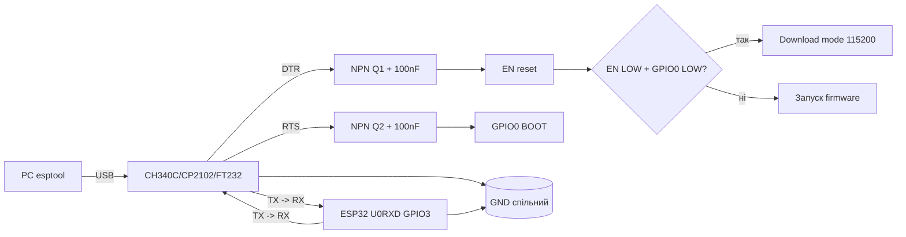

# 05 - USB-UART мости та Auto-Reset для ESP32

## Призначення

Стабільна прошивка ESP32 через USB: вибір моста (CH340C / CP2102 / FT232RL / вбудований USB S2/S3), правильне перехрещення TX/RX, сигнали DTR/RTS для автоматичного введення в bootloader та діагностика помилок Failed to connect.

Без робочого auto-reset кожна прошивка перетворюється на жонглювання кнопками BOOT+EN.

## Характеристики

| Мост | Драйвер | Швидкість | DTR/RTS | Ціна | Особливості |
| --- | --- | --- | --- | --- | --- |
| CH340C / CH340G | потрібен (клоновані VID/PID) | до 2Мбод (реально 921600) | є | найдешевший | CH340G потребує кварц 12МГц, CH340C - вбудований |
| CP2102 / CP2104 | вбудований у Win10+/Linux/macOS | до 2Мбод | є, стабільні | середня | найстабільніший для довгих прошивок |
| FT232RL | вбудований (FTDI) | до 3Мбод | є | дорогий | + CBUS-налаштування, клони цегляться драйвером! |
| Built-in USB (S2/S3/C3) | TinyUSB, без моста | 12Мбіт USB-OTG | програмний (CDC) | 0 (на кристалі) | D+/D- безпосередньо, потрібен BOOT при першій прошивці |

Швидкості прошивки esptool:

| Baud | Час 1.3МБ | Стабільність | Коли використовувати |
| --- | --- | --- | --- |
| 115200 | ~2 хв | максимальна, довгі кабелі | за замовчуванням, клони, довгі лінії |
| 230400 | ~1 хв | добра | CP2102 + короткий кабель |
| 460800 | ~35 с | добра на якісному кабелі | щоденна робота, рекомендовано |
| 921600 | ~20 с | примхлива (CH340 - ок, FTDI-клони - ні) | короткі кабелі, CP2102/CH340C |

DTR/RTS мапінг esptool: DTR→EN (RST), RTS→GPIO0 (BOOT). Послідовність: EN LOW → GPIO0 LOW → EN HIGH → прошивка → EN LOW → GPIO0 HIGH → EN HIGH (запуск).

## Легенда пінів модуля

### Типовий USB-UART модуль (6 пінів)

| Пін | Напрям | Опис |
| --- | --- | --- |
| VCC (5V / 3.3V) | живлення | 5V для живлення DevKit або 3.3V-логіка; перемичка! НЕ подавати 5V у 3.3V ESP32! |
| GND | земля | обов'язково спільна з ESP32 |
| TXD | вихід моста | → до RX (GPIO3 / U0RXD) ESP32 (перехресно!) |
| RXD | вхід моста | ← від TX (GPIO1 / U0TXD) ESP32 (перехресно!) |
| DTR | вихід | → схема auto-reset → EN (через NPN + 100нФ) |
| RTS | вихід | → схема auto-reset → GPIO0 (через NPN + 100нФ) |

Перехрещення - головне правило: TX моста → RX контролера, RX моста ← TX контролера. З'єднання TX-TX - тиша в терміналі!

### ESP32 сторона (UART0)

| Пін ESP32 | Роль при прошивці |
| --- | --- |
| GPIO1 (TX0) | лог контролера → RX моста |
| GPIO3 (RX0) | лог моста → контролер |
| GPIO0 (BOOT) | LOW при ресеті = bootloader, HIGH = запуск flash |
| EN (CHIP_PU) | LOW >50мс = ресет; RC-ланцюг 10к + 100нФ |
| D+/D- (S2/S3) | вбудований USB: GPIO19/20 (S3), GPIO20/19 (S2) безпосередньо до USB-роз'єму |

### Вбудований USB S2/S3/C3

| Сигнал | Куди |
| --- | --- |
| D- | GPIO19 (S3) / GPIO20 (S2) через 22 Ом до USB D- |
| D+ | GPIO20 (S3) / GPIO19 (S2) через 22 Ом до USB D+ |
| 5V / VBUS | детект USB (дільник до GPIO) + живлення |
| BOOT (GPIO0) | кнопка до GND для першого входу в download |

## Схема підключення

Мінімальна прошивальна обв'язка: USB-UART + 2 NPN auto-reset + кнопки BOOT/EN.

### ASCII-схема

```text
[USB-UART модуль]              [ESP32]
  VCC (3.3V!) ---------------> 3V3 (або 5V -> VIN, дивись перемичку!)
  GND -----------------------> GND (товстий, короткий!)
  TXD -----------------------> RX0 (GPIO3)
  RXD <----------------------- TX0 (GPIO1)
  DTR --+                     RTS --+
        |                           |
   [Auto-Reset на 2 NPN + 100нФ:]
   DTR --[1k]--> B Q1 (NPN 3904)    RTS --[1k]--> B Q2
                C --> EN                         C --> GPIO0
                E --> GND                        E --> GND
   EN --[10k]--> 3.3V  + [100nF] до GND (RC для авторесету)
   GPIO0 --[10k]--> 3.3V + кнопка BOOT до GND
   EN ---- кнопка EN до GND (ручний ресет)

Ручний режим (немає DTR/RTS):
  1. Утримувати BOOT (GPIO0 -> GND)
  2. Клікнути EN (ресет)
  3. Відпустити EN, потім відпустити BOOT
  4. ESP32 у download mode, шити esptool.

Вбудований USB S2/S3:
  USB D- --[22 Ом]--> GPIO19(S3)/GPIO20(S2)
  USB D+ --[22 Ом]--> GPIO20(S3)/GPIO19(S2)
  USB GND -----------> GND
  USB 5V -> AMS1117/ME6211 -> 3.3V + VBUS-detect дільник
```

Класична auto-reset DevKit (два транзистори Еміттерно-зв'язані):

```text
         DTR o---+----[100nF]----+----> EN
                 |               |
                [10k]           Q1 NPN (DTR керує EN)
                 |               | C=EN, E=GND, B через 1k до RTS?*
         RTS o---+----[100nF]----+----> GPIO0
                                 |
                                Q2 NPN (RTS керує GPIO0)

 * Точна схема DevKit V1: DTR через діод/транзистор на EN,
   RTS через транзистор на GPIO0, емітери перехресно заблоковані,
   щоб EN і GPIO0 не просаджували один одного.
   Конденсатори 100нФ перетворюють рівень DTR/RTS в імпульс ресету.
```

### Mermaid



![[assets/img/usb-uart-autoreset-scheme.png|500]]

## Процедури налаштування

### Процедура 1: Перевірка моста та драйвера

```bash
# Linux: міст видно?
lsusb | grep -i -E "1a86|10c4|0403"
# 1a86 = CH340 (QinHeng), 10c4 = CP210x (Silabs), 0403 = FTDI
dmesg | tail -20
ls -l /dev/ttyUSB*
# Права на порт:
sudo usermod -a -G dialout $USER
# Перелогінитись!
```

Чому клони CH340 потребують драйвер: оригінальний драйвер Windows Update довіряє тільки VID 1A86/PID 7523 з підписом QinHeng. Клони з перебитим VID або старим релізом відхиляються (Code 10). Лікування: офіційний драйвер CH341SER.EXE з сайту wch.cn + вимкити автооновлення драйвера. На Linux драйвер ch341 в ядрі з 5.x - працює з коробки.

macOS: CH340 потребує підписаного kext, дозволити в Privacy → Allow. CP2102 - з коробки (AppleUSBSLab).

### Процедура 2: Перша прошивка / ручний BOOT

```bash
# Стерти flash (при смітті у NVS/OTA):
esptool.py --chip esp32 --port /dev/ttyUSB0 erase_flash
# Записати firmware на 460800:
esptool.py --chip esp32 --port /dev/ttyUSB0 --baud 460800 write_flash -z 0x1000 firmware.bin
# Якщо auto-reset немає — ручний режим:
# 1. Утримувати BOOT, клікнути EN, відпустити BOOT
# 2. Виконати команду вище на 115200
esptool.py --chip esp32 --port /dev/ttyUSB0 --baud 115200 write_flash -z 0x1000 firmware.bin
# Монітор:
esptool.py --port /dev/ttyUSB0 monitor --baud 115200
```

### Процедура 3: Вибір швидкості та кабелю

1. Починайте з 115200 - має працювати завжди.
2. Якщо стабільно - підніміть до 460800 (оптимум час/надійність).
3. 921600 - тільки короткий (<50см) кабель з феритом + CP2102/CH340C.
4. Довгі кабелі (>2м): тільки 115200, кабель з екраном, феритове кільце біля ESP32, окреме живлення 5V 2A (USB не тягне!).
5. Хаб без живлення + довгий кабель = гарантований Failed to connect.

Феритові кільця: 1-2 витки USB-кабелю через кільце знімають ВЧ-дзвін від buck-перетворювачів поруч. Особливо критично для S2/S3 native-USB (12Мбіт чутливі до дзвону).

## Типові помилки

| Повідомлення / Симптом | Причина | Виправлення |
| --- | --- | --- |
| Failed to connect to ESP32: Timed out | GPIO0 не в LOW, немає auto-reset | ручний BOOT+EN, перевірити DTR/RTS і NPN-схему |
| CH343/FT4232H не видно в системі | Немає драйвера вендора | Драйвер з сайту WCH/FTDI; CH343 ≠ CH340 за VID/PID |
| Failed to connect: Wrong boot mode | EN RC-ланцюг пробитий / кнопка залипла | поміряти EN=3.3V, GPIO0=3.3V у простої; замінити 100нФ |
| Тиша в моніторі, прошивка ок | TX/RX не перехрещені (TX-TX) | поміняти місцями TX/RX |
| Сміття 74880 бод і ресет-цикл | живлення просідає при RF-калібруванні | окремий БЖ 5V 2A, 1000мкФ на 5V, короткі дроти |
| CH340 Code 10 (Windows) | клон, драйвер не підписаний | CH341SER з wch.cn, відкат драйвера |
| /dev/ttyUSB0 зникає при TX | кабель-тонкий, просадка, автосон хаба | короткий кабель, хаб з живленням, конденсатор |
| A fatal error occurred: Packet content transfer stopped | 921600 забагато для кабелю | знизити до 115200/460800 |
| FTDI цегла (PID 0000) | клон заблоковано новим драйвером | старий драйвер 2.10, або замінити на CP2102 |
| S3 не видно як USB | не натиснуто BOOT при вмиканні | утримувати BOOT, встромити USB, відпустити; esptool --chip esp32s3 |
| RTS/DTR смикають ESP32 у роботі | монітор відкриває порт з DTR | у терміналі вимкнути DTR/RTS або додати 100нФ фільтр |

### CH343 / FT4232H - сусіди по USB-мостах

| Позиція | Що це | Нюанс |
| --- | --- | --- |
| CH343 (WCH) | USB HS 480 Мбіт/с, 2× UART + паралельна шина | Наступник CH340 для швидких задач; драйвер з сайту WCH |
| FT4232H (FTDI) | 4 порти: UART/FIFO/JTAG/SPI в одному | Один чип замість 4 мостів на стенді; ціна ×5 від CH340 |

> CH340 vs CH343: для прошивки ESP32 різниці немає (обидва 12 Мбіт/с Full-Speed вистачає); CH343 беруть під швидкі логи/два UART одним кабелем.

Порада: заведіть один перевірений короткий кабель тільки для прошивки і підпишіть його. 80% Failed to connect - це кабель для зарядки без Data-жил!

## Офіційні джерела

- [CH340 - виробник (WCH)](https://www.wch.cn/products/CH340.html) - даташит, драйвери.
- [CH340 - англ. сторінка (WCH)](https://www.wch-ic.com/products/CH340.html) - версії C/G, фото.
- [CP2102 - даташит (Silicon Labs)](https://www.silabs.com/interface/usb-bridges/classic/device.cp2102) - VCP-драйвери, EK.
- FT232RL (ftdichip.com) - *перевірити вручну*: сайт блокує автозапити.

## Див. також

- [[02-Zhivlennya/01-Lancjugi-zhivlennya]]
- [[02-Zhivlennya/02-LDO-DC-DC]]
- [[09-Proshivka/04-Esptool-Flash]]
- [[Home]]
- 01-Buck-Boost-Solar - живлення польових вузлів
- 04-LDO-Buck-XL4015-Protect - стабілізатори та захист 5V-шини
