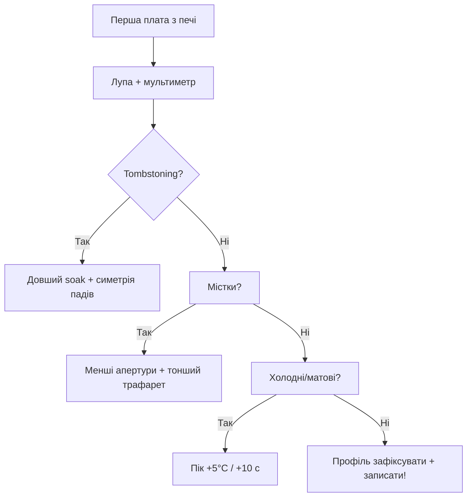

# Трафарет і оплавлення: stencil, паста, reflow-профіль

## Призначення

Ручний паяльник закінчується на ~50 платах. Далі - трафарет (паста за 30 секунд на всю плату) + оплавлення (піч або фен). Нота - повний цикл гаражного SMD-монтажу: дизайн апертур, вибір пасти, профіль, дефекти і їх лікування.

База: старт - [[Home]], ручна пайка - [[17-Lab/02-Soldering-Connectors]], PCB-дизайн - [[17-Lab/04-PCB-Design]], завод/ATE - [[17-Lab/03-Enclosure-Cert-Factory]], живлення - [[02-Zhivlennya/01-Lancjugi-zhivlennya]].

> [!warning] Свинець і вентиляція
> Паста зі свинцем (Sn63/Pb37) паяється легше, але пари флюсу токсичні в будь-якому разі. Піч/фен - ТІЛЬКИ з витяжкою. Пасту зберігати в холодильнику, перед роботою - 2 год кімнатної температури (конденсат!).

![[assets/img/stencil-reflow-profile-scheme.png|600]]
*Рис. Ланцюжок: трафарет → паста → установка → reflow-профіль (preheat/soak/reflow/cooling) → інспекція.*

## Характеристики матеріалів

| Параметр | Hobby (гараж) | Серія (JLCPCB) |
| --- | --- | --- |
| Трафарет | Поліімідний (плівка $5) / рамковий | Лазерна нержавійка 0.1-0.12 мм |
| Паста | SAC305 Type 3 (25-45 мкм кульки) | Type 4 для 0201/0.4 мм QFN |
| Нанесення | Шпатель вручну | Станок/полуавтомат |
| Оплавлення | Фен / IR-піч / тостер-піч з контролером | Конвеєрна піч 5-8 зон |
| Інспекція | Лупа + мультиметр | AOI + рентген (BGA/QFN) |

## 1. Дизайн апертур трафарету (що малювати в KiCad!)

| Правило | Значення | Чому |
| --- | --- | --- |
| Розмір апертури | 90% пада (зменшення 1:1 мінус 10%) | Зайва паста = містки (bridging) |
| Товщина трафарету | 0.1 мм (дрібні 0402/QFN) / 0.12 мм (універсально) | Об'єм пасти = площа × товщина |
| QFN thermal pad | 4-9 вікон (windowpane!) замість одного | Одне велике вікно = надлишок пасти = спливання чипа |
| Крок < 0.5 мм | Зменшити до 80% + Type 4 паста | Інакше містки гарантовані |
| Fiducials | 2-3 круглих 1 мм без маски по кутах | Суміщення трафарету вручну |
| Виріз під роз'єми | THT-роз'єми маскувати каптоном | Паста в отворах THT не потрібна |

```text
QFN-48 thermal pad 5×5 мм — правильно:
  ┌───┬───┬───┐
  │   │   │   │   9 вікон 1.2×1.2 мм, перемички 0.3 мм
  ├───┼───┼───┤   (паста виходить газами через щілини → менше voiding!)
  │   │   │   │
  ├───┼───┼───┤
  │   │   │   │
  └───┴───┴───┘
```

## 2. Reflow-профіль: 4 фази (SAC305, безсвинець!)

| Фаза | Температура плати | Час | Що відбувається |
| --- | --- | --- | --- |
| Preheat | 25 → 150°C, рампа ≤3°C/с | 60-90 с | Випаровування розчинників, БЕЗ термошоку |
| Soak | 150-180°C (плато!) | 60-120 с | Активація флюсу, вирівнювання температури плати |
| Reflow (пік) | 235-250°C (вище 217°C!) | 30-60 с над ліквідусом | Паста плавиться, поверхневий натяг центрує чипи |
| Cooling | Спад ≤4°C/с до <100°C | 60-120 с | Кристалізація без тріщин; НЕ дути вентилятором! |

```text
Профіль (намалюй на папірці біля печі!):
250°C ─┤              ╭───╮ пік 245°C
       │             ╱     ╲
217°C ─┤────────────╱───────╲──── ліквідус SAC305 (30–60 с вище!)
180°C ─┤      ╭─────╯ soak  ╰──╮
150°C ─┤─────╯  60–120 с       ╰──╮
 25°C ─┤╱ preheat ≤3°C/с          ╲╲ cooling
       └──────────────────────────────► t (~4–6 хв весь цикл)
```

> Для свинцевої пасти (Sn63/Pb37): пік 210-220°C, ліквідус 183°C. Профіль НИЖЧИЙ - не пересмаж плати, налаштовані під свинець!

## 3. Дефекти і лікування (плакат над столом!)

| Дефект | Вигляд | Причина | Лікування |
| --- | --- | --- | --- |
| Tombstoning (надгробок) | 0402 став сторчма | Нерівномірний нагрів / різна площа падів | Симетричні пади, повільніший preheat |
| Bridging (містки) | Паста між сусідніми пінами | Забагато пасти / товстий трафарет | Апертури 80-90%, оплітка + фен |
| Voiding (порожнечі під QFN) | Рентген показує бульбашки | Гази флюсу не вийшли | Windowpane-апертури + довший soak |
| Cold joint | Матовий, кришиться | Недогрів (пік низький/короткий) | Підняти пік +5°C або +10 с |
| Solder balling | Кульки навколо | Паста стара/холодна, швидкий preheat | Свіжа паста кімнатної температури |
| Skewed chip | Чип з'їхав | Штовхнули пінцетом / вібрація печі | Поверхневий натяг сам центрує - НЕ ЧІПАТИ під час reflow! |

### Mermaid: налагодження профілю



## 4. Процедура гаражного монтажу покроково

1. Паста з холодильника → 2 год гріється закритою (конденсат вбиває!).
2. Плату зафіксувати, трафарет по fiducials, шпатель 45° - ОДИН прохід.
3. Перевірити відбиток: всі пади з пастою, без розмазування. Змазалось - стерти спиртом і заново.
4. Пінцетом розставити (0402 → QFN → великі), не тиснути (паста - клей!).
5. Піч за профілем (термопара НА ПЛАТІ, не в повітрі печі!). Фен - спіральними рухами, 250°C, не впритул.
6. Охолонути БЕЗ руху (кристали ростуть!). Мити від флюсу, якщо не no-clean.
7. Інспекція: лупа → продзвонка живлення → перше ввімкнення через CC-ліміт (див. [[17-Lab/01-Instruments|Прилади]]).

## Типові помилки

| # | Помилка | Чому погано | Як правильно |
| --- | --- | --- | --- |
| 1 | Холодна паста одразу в роботу | Конденсат → кульки/порожнечі | 2 год кімнатної температури |
| 2 | Стара паста (>6 міс відкритої) | Флюс висох, не змочує | Дата на шприці + тест на склі |
| 3 | Один прохід шпателем туди-сюди | Розмазування під трафарет | Один впевнений прохід 45° |
| 4 | Піч без термопари на платі | Повітря печі ≠ температура плати | Термопара каптоном на GND-полігон |
| 5 | Дмухати для охолодження | Тріщини швів, мутна кристалізація | Природне охолодження |
| 6 | Чіпати плату в reflow | Зсув чипа | Руки геть до <100°C |
| 7 | Цілий thermal pad вікном | Спливання QFN | Windowpane 4-9 вікон |
| 8 | THT-роз'єми в печі без масок | Плавлення пластику | Каптон + ручна допайка після |
| 9 | Без витяжки | Пари флюсу + свинець | Витяжка завжди |
| 10 | Профіль «зі стелі» без запису | Неповторюваність | Записати 4 фази на папірці біля печі |

## Офіційні джерела

- [IPC-7530 - Guidelines for Temperature Profiling](https://www.ipc.org/TOC/IPC-7530.pdf) - профілі оплавлення (TOC платного стандарту).
- [JLCPCB - SMT Assembly Capabilities](https://jlcpcb.com/capabilities/smt-assembly-capabilities) - допуски, апертури, пасти.
- [SAC305 Solder Paste datasheets (ChipQuik/Amtech)](https://chipquik.com/datasheets/SMD291AX.pdf) - профілі виробника пасти (головніші за загальні!).

### Зберігання пасти і вхідний контроль

| Параметр | Норма |
| --- | --- |
| Зберігання | Холодильник +2…+10°C, герметично |
| Прогрів перед роботою | 2 год закритою до кімнатної (конденсат!) |
| Термін відкритої | 3-6 міс (дата на шприці!) |
| Тест | Мазок на склі: блищить, кульки не розсипаються |

### Чек-лист інспекції після печі

```text
[ ] Лупа: всі виводи змочені, конус-філе, без кульок
[ ] QFN: немає спливання/зсуву (шовкографія-орієнтир!)
[ ] Продзвонка: VCC-GND не коротять (омметр, БЕЗ живлення!)
[ ] Живлення: CC-ліміт 100–200 мА при першому ввімкненні
[ ] Прошивка: blink → self-test → функціонал
```

## Див. також

- [[Home|Головна]]
- [[17-Lab/02-Soldering-Connectors|Пайка та роз'єми]]
- [[17-Lab/04-PCB-Design|PCB-Design]]
- [[17-Lab/03-Enclosure-Cert-Factory|Завод/ATE]]
- [[17-Lab/01-Instruments|Прилади (перше ввімкнення)]]
- [[02-Zhivlennya/01-Lancjugi-zhivlennya|Живлення]]
