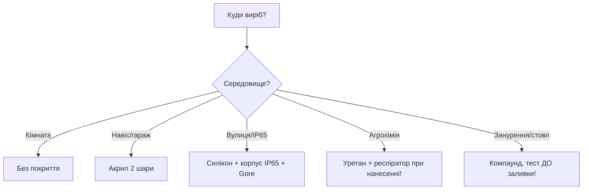

# Конформне покриття і герметизація: лак, компаунд, IP65

## Призначення

Вуличний ESP32 вмирає не від коду, а від вологи: конденсат вранці, дощ у щілини, сіль біля моря. Два рубежі: конформний лак на платі + герметичний корпус. Для екстриму - заливка компаундом (без права на ремонт). Нота - практика всіх трьох.

База: старт - [[Home]], корпуси оглядово - [[17-Lab/03-Enclosure-Cert-Factory]] (розділ 4 - коротко, тут - докладно), PCB - [[17-Lab/04-PCB-Design]], трафарет/монтаж - [[13-Moduli-zhivlennya-rivniv/07-Stencil-Reflow|Stencil]].

> [!warning] Лак ≠ герметик для корпусу!
> Конформне покриття захищає ВІД конденсату і пилу, але НЕ тримає тиск води і НЕ замінює прокладку корпусу. Поточна вода під тиском зайде під будь-який лак по капілярах. Формула: лак на платі + IP65-корпус з прокладкою - тільки разом.

![[assets/img/conformal-coating-ip65-scheme.png|600]]
*Рис. Три рубежі: маскування → лак 25-75 мкм → корпус IP65 з мембраною; компаунд - окремий екстремальний шлях.*

## Характеристики матеріалів

| Матеріал | Товщина | Плюс | Мінус | Коли |
| --- | --- | --- | --- | --- |
| Акрил (AR) | 25-75 мкм | Дешевий, легко знімається (ремонт!), сохне швидко | М'який, боїться розчинників | 90% вуличних вузлів - вибір за замовчуванням |
| Силікон (SR) | 50-200 мкм | −60…+200°C, еластичний, UV-стійкий | Дорогий, липне пил, важко зняти | Вуличні датчики з перепадами, сонячні станції |
| Уретан (UR) | 25-75 мкм | Хімстійкість, твердий | Токсичний при нанесенні (респіратор!), неремонтопридатний | Агрохімія, гаражі з випарами |
| Епоксидний компаунд | Заливка 5-30 мм | Абсолютна герметизація, антивандальність | Ніякого ремонту, вага, екзотермія при твердінні! | Занурювані датчики, лічильники на стовпі |
| Поліуретан-заливка | Заливка | М'якша за епоксид, менше рве деталі | Дорожча, довше сохне | Вуличні БЖ, LED-драйвери |

## 1. Нанесення лаку покроково (акрил, пензель/аерозоль)

1. Плата ВИМИТА (спирт/УЗ-ванна) і висушена - лак поверх флюсу відшарується за місяць.
2. Маскування (див. розділ 2!) - каптон + силіконові ковпачки.
3. 2-3 ТОНКІ шари з просушуванням 15-30 хв, не один товстий (бульбашки!).
4. Товщина: «мокрий блиск» без патьоків; контроль - УФ-лампа (лак флуоресціює!).
5. Сушка 24 год при кімнатній (або 2 год при 60°C - БЕЗ компонентів-батарейок!).
6. Зняти маски, продзвонити контакти, прошити тест.

## 2. Що маскувати (стіна ганьби!)

| Маскувати ОБОВ'ЯЗКОВО | Чому | Чим |
| --- | --- | --- |
| Роз'єми (USB, JST, клеми) | Лак = ізолятор у контакті | Каптон/ковпачки |
| Кнопки, перемички, джампери | Залипнуть | Каптон |
| Сенсори вологості/тиску/газу (BME/SHT/MQ) | Їм потрібне ПОВІТРЯ! | Ковпачок/каптон за формою |
| Антени PCB/кераміка | Розстроювання | Каптон з запасом 5 мм |
| Контакти програмування (TX/RX/BOOT) | Не прошити після лаку | Ковпачки |
| LED/оптопари/фотодіоди | Лак каламутить оптику | Точковий каптон |
| Радіатори/thermal pad | Перегрів | Маска + термопаста після |
| Батарейні контакти | Перехідний опір | Ковпачки |

> Залитий лаком BME280 показує рівну 50% вологість вічно - класика, яку бачив кожен другий. Перевірка після лакування: сенсори дихають (подути - вологість росте!).

## 3. Компаунд: коли і як заливати

Коли: занурення, стовп/колодязь, антивандальність, продаж «без розбору».

```text
Процедура заливки:
  1. Форма/корпус БЕЗ щілин (компаунд тече всюди — герметизувати форму!).
  2. Плату з лаком-праймером (адгезія!) + маскування роз'ємів-назовні.
  3. Змішати A+B СТРОГО за вагою (кухонні ваги 0.1 г!), перемішати без бульбашок.
  4. Заливати тонким струменем з кута (не лити зверху — бульбашки!).
  5. Вакуум/вібрація для вигону бульбашок (опційно, для глибини).
  6. Твердіння за даташитом (екзотермія! товстий шар гріється до 80–100°C —
     електроліти і батареї всередині НЕ ховати!).
  7. Після — тільки викинути: ремонту НЕМАЄ. Тому перед заливкою — 100% тест!
```

## 4. Корпус IP65 на практиці (коротко, деталі - нота Завод)

```text
IP65-вузол: коробка з прокладкою + кабельні вводи PG (за діаметром КАБЕЛЮ!) +
  заглушки на порожні + Gore-мембрана M12 (випускає пару, не впускає воду) +
  плата ВЕРТИКАЛЬНО (конденсат стікає, не стоїть) + силікагель-індикатор всередину.
Дренаж: отвір 2–3 мм у найнижчій точці (з сіткою від комах) — парадокс, але без нього
  гірше: вода, що зайшла, не має куди вийти. Див. [[17-Lab/03-Enclosure-Cert-Factory]].
```

### Mermaid: вибір захисту



## Типові помилки

| # | Помилка | Чому погано | Як правильно |
| --- | --- | --- | --- |
| 1 | Лак поверх флюсу | Відшарування місяць | Мити + сушити до лаку |
| 2 | Один товстий шар | Бульбашки, тріщини | 2-3 тонкі |
| 3 | Залитий BME/SHT/MQ | Сенсор сліпий | Маскувати (таблиця розд. 2) |
| 4 | Лак у USB/JST | Немає контакту | Ковпачки + продзвонка після |
| 5 | Лак замість прокладки | Вода під тиском проходить | Лак + IP65 разом |
| 6 | Компаунд без праймера | Відшарування від плати | Лак-праймер + знежирення |
| 7 | Батарея в компаунді | Екзотермія + вибухонебезпека | Батареї - ТІЛЬКИ назовні |
| 8 | Заливка без 100% тесту | Брак навічно | ATE/self-test ДО (нота Завод) |
| 9 | Уретан без респіратора | Ізоціанати в легенях | Респіратор A2 + витяжка |
| 10 | Без Gore-мембрани | Конденсат всередині IP65 | Мембрана + дренаж + силікагель |

## Офіційні джерела

- [Conformal coating guide (Wikipedia)](https://en.wikipedia.org/wiki/Conformal_coating) - критерії покриття (платний, шукати огляди).
- [MG Chemicals / Electrolube - гайди з нанесення](https://mgchemicals.com/products/conformal-coatings/acrylic/419d/) - акрил/силікон/уретан, товщини, сушка.
- [Hammond/Bopla - IP-корпуси каталоги](https://www.hammfg.com/electronics/small-case/plastic/1591) - розміри, вводи, мембрани.

### Контроль товщини і ремонт покриття

| Метод | Як |
| --- | --- |
| УФ-лампа | Лак флуоресціює: темні плями = пропуски |
| Мокрий гребінець | Вимір на склі-свідку поруч (25-75 мкм акрил) |
| Ремонт акрилу | Зняти скальпелем/розчинником локально → перепаяти → підмазати |
| Ремонт силікону/уретану | Тільки механічно; уретан - майже неремонтопридатний! |

> Лак на тестовій платі-свідку, що йде через піч/цикл разом із партією, - доказ товщини для замовника.

### Тропикалізація спиртом: коли лаку немає під рукою

```text
Польовий мінімум (похід/хакатон, на 1 сезон):
  1. Плата вимита, висушена.
  2. Каніфольний лак / цапонлак у 2 шари пензлем (НЕ нітролак — їсть пластик роз'ємів!).
  3. Краї плати і ніжки роз'ємів — додатковий шар.
Живе 3–6 місяців на вулиці; далі — нормальний акрил. Краще за голий текстоліт!
```

### Силікагель-індикатор: очі всередині корпусу

```text
Пакетик 5–10 г біля плати + віконце або перевірка при ТО:
  синій = сухо; рожевий = вологий → замінити + шукати щілину!
Регенерація: 2 год при 120°C у духовці — індикатор знову синій.
```

## Див. також

- [[Home|Головна]]
- [[17-Lab/03-Enclosure-Cert-Factory|Корпус/сертифікація/завод]]
- [[17-Lab/04-PCB-Design|PCB-Design]]
- [[13-Moduli-zhivlennya-rivniv/07-Stencil-Reflow|Stencil/Reflow]]
- [[17-Lab/02-Soldering-Connectors|Пайка]]
- [[10-Sensori/36-Agro|Агро (вуличні вузли)]]
