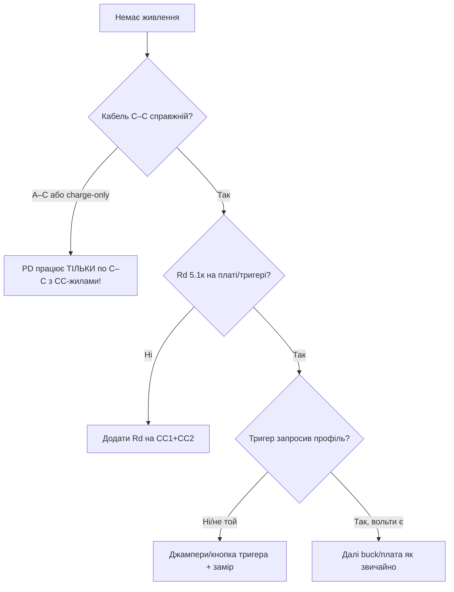

# USB Power Delivery для ESP32: тригери, профілі, пастки

## Призначення

Звичайний USB-C дає 5V/3A (з Rd 5.1к, див. [[17-Lab/04-PCB-Design|PCB-Design]]). USB-PD вміє домовлятись про 9/12/15/20V - корисно, коли треа живити 12V-периферію (мотори, реле, PoE-спліттери) від одного павербанка. ESP32 PD не говорить - потрібен тригер або контролер.

База: старт - [[Home]], USB-C Rd - [[17-Lab/04-PCB-Design]] (розд. 17), buck - [[13-Moduli-zhivlennya-rivniv/01-Buck-Boost-Solar|Buck]], захист - [[13-Moduli-zhivlennya-rivniv/04-LDO-Buck-XL4015-Protect|Захист]].

> [!danger] 20V на 5V-вхід = смерть плати
> PD-договір укладає ТРИГЕР, а не ESP32. Помилка в дільнику договору (не той профіль!) подасть 20V туди, де чекали 5V. Тестувати тригер БЕЗ плати (мультиметр!), потім підключати.

![[assets/img/usb-pd-trigger-profiles-scheme.png|600]]
*Рис. Зарядка PD → тригер (договір 12V) → buck → 5V/3.3V плати; ESP32 в договорі не бере участі.*

## Характеристики профілів PD

| Профіль | Напруга | Струм (тип.) | Для ESP32-проєктів |
| --- | --- | --- | --- |
| PDO 5V (default) | 5V | до 3A | Завжди є; дефолт без договору |
| PDO 9V | 9V | до 2-3A | Живлення реле/моторів через buck |
| PDO 12V | 12V | до 3-5A | LED-стрічки 12V, соленоїди |
| PDO 15/20V | 15/20V | до 5A | Ноутбучні зарядки; для ESP32 - тільки через buck! |
| PPS (програмований) | 3.3-21V крок 20 мВ | до 5A | Точна напруга без buck (рідко треба) |

## 1. Rd/Rp за 30 секунд (база, без якої PD не стартує)

```text
Плата-приймач (sink): Rd 5.1к з CC1 і CC2 на GND → джерело дає 5V.
Плата-джерело (source): Rp 56к/22к/10к до 5V (500мА/1.5A/3A).
Помилка: два Rp назустріч (кабель C–C з двома хостами) = конфлікт, можливий дим.
PD-договір іде ПОВЕРХ цього: спочатку 5V за Rd, потім BMC-повідомленнями просять вище.
```

## 2. Тригери: CH224K / SW2303 / аналоги

| Тригер | Профіль | Як задається | Ціна |
| --- | --- | --- | --- |
| CH224K (плата-тригер) | Перемичками: 9/12/15/20V | Джампери/пайка на платі | $1-2 |
| SW2303 | Кнопкою/авто (запам'ятовує) | Кнопка + LED-індикація | $2-4 |
| FUSB302 + МК | Будь-який (програмно) | I2C з ESP32! | $3 + код |

```text
Схема з тригером (без участі ESP32):
  PD-зарядка (C–C кабель!) ──► [CH224K-тригер, джампер 12V] ──► 12V ──► buck 12→5V ──► плата
  Перевірка: мультиметр на виході тригера ДО підключення плати! Має бути рівно 12.0V.
  Запобіжник 3A + TVS 15V між тригером і buck (договір іноді «стрибає» при перетиканні!).
```

### Mermaid: діагностика «немає живлення від PD»



## 3. FUSB302 + ESP32: програмний PD (просунутий рівень)

```text
FUSB302 (I2C) — PD-PHY: ESP32 сам веде BMC-діалог і просить потрібний PDO.
Коли: виріб з USB-C, якому треба 12V без зовнішнього тригера.
Ціна: ~200 рядків PD-стека (парсинг Source_Capabilities → Request → Accept).
Пастка: таймінги PD жорсткі (мс!) — вести на окремій задачі FreeRTOS з пріоритетом.
Для 95% проєктів тригер CH224K дешевший за розробку. FUSB — тільки серія.
```

## Типові помилки

| # | Помилка | Чому погано | Як правильно |
| --- | --- | --- | --- |
| 1 | A-C кабель для PD | PD не стартує (немає CC) | Тільки C-C повний |
| 2 | Немає Rd | Джерело мовчить | 5.1к на CC1+CC2 |
| 3 | Профіль не перевірено | 20V у 5V-вхід | Мультиметр ДО плати! |
| 4 | Два Rp назустріч | Конфлікт джерел | Sink - тільки Rd |
| 5 | Без запобіжника/TVS | Стрибок договору = дим | 3A + TVS за тригером |
| 6 | PD для живлення 3.3V безпосередньо | Зайва складність | PD → 12V → buck (каскад) |
| 7 | FUSB без RT-задачі | Зрив таймінгів договору | Окрема пріоритетна задача |

## Офіційні джерела

- [USB Power Delivery spec (USB-IF)](https://www.usb.org/document-library/usb-power-delivery) - PDO, BMC, таймінги.
- [CH224K datasheet (WCH)](https://www.wch.cn/products/CH340.html) - тригер, джампери профілів.
- [FUSB302 datasheet (onsemi)](https://www.onsemi.com/products/interfaces/usb-type-c-products/fusb302) - PD-PHY, I2C.

## 4. Договір PD покроково (що відбувається на CC)

```text
1. Підключив C–C: джерело бачить Rd → дає 5V (Safe 5V).
2. Тригер/FUSB читає Source_Capabilities: список PDO (5/9/12/15/20V + струми).
3. Тригер шле Request на вибраний PDO (напр. 12V/3A).
4. Джерело відповідає Accept → PS_RDY → лінія переходить на 12V (стрибок ~мс!).
5. Далі: контракт тримається; перетикання/скидання → все спочатку з 5V.
Пастка: деякі зарядки після PS_RDY дають викид +2V на мікросекунди — TVS після тригера обов'язковий!
```

## 5. E-marker кабелю: коли 5A не підуть

| Кабель | Струм | Як впізнати |
| --- | --- | --- |
| Без e-marker | до 3A | Тонкий, дешевий; для 60W+ не підходить |
| З e-marker чипом | до 5A | Товстіший, маркування 100W; потрібен для 15/20V-5A |
| Charge-only C-C | 3A, але без CC-жил | PD не стартує взагалі! |

```text
Тест кабелю: USB-C тестер (див. 17-Lab/01!) показує PDO джерела І наявність e-marker.
Немає тестера — проба з тригером: якщо вище 5V не домовляється, кабель під підозрою.
```

## PPS-режим: програмована напруга без buck

```text
PPS (Programmable Power Supply): джерело видає 3.3–21V кроком 20 мВ за запитом.
Тригер з PPS (SW2303 та аналоги): виставити рівно 5.2V (компенсація падіння!)
або 7.0V під свій buck з малим dropout.
Коли: точна напруга + мінімум компонентів; коли НЕ: більшість дешевих зарядок
PPS не вміють — перевіряти маркування на корпусі (PPS явно пишуть!).
```

## Перевірка договору мультиметром (протокол!)

```text
[ ] Кабель C–C, зарядка 65W+ з маркуванням PD
[ ] Тригер БЕЗ плати: замір = заданий профіль ±0.3V
[ ] Підключити buck БЕЗ плати: замір 5.0V на виході buck
[ ] Підключити плату: струм у нормі, нагрів тригера/buck за 10 хв
[ ] Перетикання 5 разів: профіль стабільний щоразу (ловити стрибки!)
```

## Див. також

- [[Home|Головна]]
- [[17-Lab/04-PCB-Design|PCB (розд. 17, Rd/Rp)]]
- [[13-Moduli-zhivlennya-rivniv/01-Buck-Boost-Solar|Buck/Solar]]
- [[13-Moduli-zhivlennya-rivniv/04-LDO-Buck-XL4015-Protect|Захист]]
- [[02-Zhivlennya/01-Lancjugi-zhivlennya|Ланцюги живлення]]
