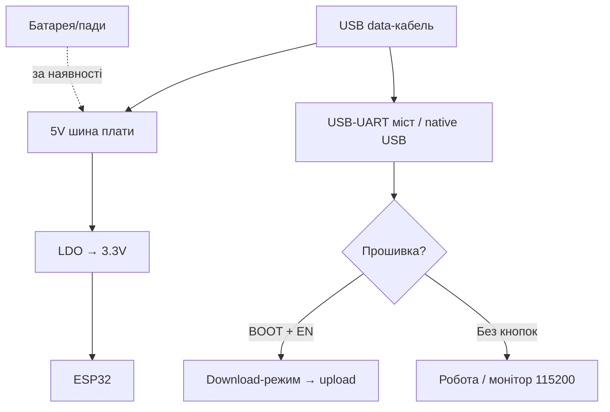

# WeMos D1 R32 - форм-фактор UNO

> [!tip] Навіщо ця плата
> Єдина ESP32-плата у форм-факторі Arduino UNO: вставляється в UNO-корпуси і приймає частину 5V-шилдів. Але «приймає» ≠ «безпечно»: GPIO все одно 3.3V. Загальний огляд плат - [[00-Start/04-Devkit-plati|DevKit плати]], рівні сигналів - [[03-GPIO/03-Pidtyaguvannya-rivni|Рівні 3.3V/5V]].
>
> [!warning] 5V шилди - обережно!
> Живлення 5V на шилд подавати можна, сигнальні лінії 5V→GPIO ESP32 - **заборонено**. Перевірте кожен пін шилда перед вмиканням. Узгодження рівнів - [[13-Moduli-zhivlennya-rivniv/02-Level-Shifters|Level-shifters]].

## Призначення

WeMos D1 R32 (продається також як ESPDuino-32) - плата ESP32-WROOM-32 у габаритах Arduino UNO R3: той же крок роз'ємів, живлення 7-12V через DC-jack/ VIN, виведені «ардуїнівські» D0-D13 / A0-A5. Призначення: міграція UNO-проєктів на Wi-Fi/Bluetooth без перепайки, використання механічно сумісних шилдів (кнопки, LCD-keypad з дільником, релейні шилди через оптопари), навчання після Arduino.

| Параметр | Значення |
| --- | --- |
| Призначення | Заміна UNO з Wi-Fi/BT, механічно сумісні шилди |
| Кристал | ESP32-D0WDQ6 Classic (WROOM-32, 4 МБ Flash) |
| Форм-фактор | Arduino UNO R3 (68.6×53.4 мм) |

## Характеристики

| Характеристика | Значення | Примітка |
| --- | --- | --- |
| Модуль | ESP32-WROOM-32, 4 МБ Flash | PSRAM немає |
| USB-UART | CH340G | Драйвер WCH обов'язковий |
| USB-роз'єм | Micro-USB | + DC-jack 7-12V і VIN |
| LDO | AMS1117-3.3 (5V шина) + стабілізатор 5V | Два каскади: 7-12V→5V→3.3V |
| Кнопки | BOOT + EN (маленькі, збоку) | Є авторесет |
| Аналог | A0-A5 → GPIO2/4/35/34/36/39 | Тільки 0-3.3V, не 0-5V як на UNO! |
| Цифра | D0-D13 → GPIO1/3/10/9/16/5/23/18/19/13/12/14/27/26/25 | Мапінг НЕ збігається з ATmega |
| I2C / SPI | SDA→GPIO21, SCL→GPIO22; MOSI 23/MISO 19/SCK 18 | На UNO-пінах D11-D13/SDA/SCL |
| Живлення шилдів | 5V і 3.3V виведені на гребінку | 5V - до ~800 мА від стабілізатора |
| Розмір | 68.6×53.4 мм | Входить в UNO-корпуси |

> [!tip] Мапінг пінів
> Напис D5 на шовкографії ≠ GPIO5! Звіряйте таблицю виробника: наприклад D9 → GPIO13, D10 → GPIO5 (CS), A0 → GPIO2. I2C-шилди працюють одразу (SDA/SCL на штатних місцях UNO R3).

## Особливості розпіновки

Головна пастка: ардуїнівські номери D/A - це лише написи. Реальні GPIO:

| UNO-пін | ESP32 GPIO | Особливість |
| --- | --- | --- |
| D0 / D1 | GPIO3 / GPIO1 | UART0, консоль + прошивка, не займати |
| D2-D4 | GPIO26 / GPIO25(DAC) / GPIO10 | GPIO9/10 йдуть до Flash - обережно! |
| D5 / D6 | GPIO16 / GPIO27 | PWM-серво сюди |
| D9 / D10 | GPIO13 / GPIO5 | Апаратний SPI CS на D10 |
| D11-D13 | GPIO23 / GPIO19 / GPIO18 | Апаратний SPI (VSPI) |
| A0 / A1 | GPIO2 / GPIO4 | GPIO2 - strapping + LED, GPIO4 - дотик |
| A2-A5 | GPIO35 / GPIO34 / GPIO36 / GPIO39 | Тільки входи, без pull-up! |

Обмеження пінів: GPIO34-39 - тільки входи (кнопки шилдів з pull-up до 5V - **небезпечні**!). GPIO6-11 зайняті Flash (D4 на частині плат - GPIO10, уникайте). Strapping-піни GPIO0/2/5/12/15 чутливі при boot - шилд не повинен тягнути їх в активний рівень під час старту. Деталі - [[03-GPIO/02-Strapping-pini|Strapping]].

## Особливості живлення

| Джерело | Куди | Обмеження |
| --- | --- | --- |
| USB Micro 5V | Роз'єм | 500 мА, програмування + живлення |
| DC-jack 7-12V | Круглий роз'єм | Стабілізатор 5V гріється при >800 мА |
| VIN | Пін VIN | 7-12V (через той же стабілізатор) |
| 5V шина | Піни 5V гребінки | Живлення шилдів, не вхід логіки! |
| 3.3V | Піни 3V3 | До ~500 мА для датчиків |

> [!warning] Два каскади тепла
> Ланцюг 12V→5V→3.3V при струмі 300 мА розсіює (12−5)×0.3 + (5−3.3)×0.3 ≈ 2.6 Вт. При живленні від 12V не навантажуйте 5V-шилди більше 300-400 мА, або живіть плату від 7.5V блока. Електроліт по 5V-шині обов'язковий при реле/моторах.

## Особливості USB-UART

Міст CH340G (SOP-16 з кварцом 12 МГц). Драйвер: Windows - CH341SER.EXE з сайту WCH; Linux - вбудований `ch341`; macOS - потрібен дозвіл у Privacy. Робоча швидкість прошивки 460800, при довгому кабелі - 115200. Авторесет DTR/RTS розведений, esptool шиє без кнопок. Якщо шилд сидить на D0/D1 (UART0) - зніміть його на час прошивки, інакше `Failed to connect`.

## Кнопки BOOT/EN

Кнопки маленькі тактові, підписані IO0 і EN біля USB-роз'єму. Логіка та сама, що на DOIT: утримувати IO0 → клік EN → шити. Після прошивки клік EN. Увага: на частині ревізій напис переплутано - перевіряйте шовкографію зі схемою.

## Для чого підходить

- Перенесення UNO-проєктів на Wi-Fi: той же корпус, ті ж кріплення.
- Механічно сумісні шилди: прототипні ProtoShield (пасивні), релейні шилди з опторозв'язкою, моторні L298P-шилди (живлення окремо!).
- Навчальні класи після Arduino: учні вже знають форм-фактор.
- НЕ підходить: 5V-логічні шилди без level-shifter (LCD Keypad 5V, старі сенсорні шилди), точні аналогові виміри 0-5V (АЦП тут 0-3.3V, див. [[06-Analog/01-ADC|ADC]]), батарейні проєкти (два LDO їдять струм в простої).

## Прошивка

Arduino IDE: плата `WEMOS D1 R32` (пакет esp32). Якщо пункту немає - беріть `ESP32 Dev Module`. Upload Speed `460800`.

```ini
; PlatformIO (platformio.ini)
[env:wemos-d1-r32]
platform = espressif32
board = wemos_d1_r32
framework = arduino
upload_speed = 460800
monitor_speed = 115200
```

```bash
esptool.py --chip esp32 --port /dev/ttyUSB0 --baud 460800 write_flash -z 0x1000 firmware.bin
```

Приклад Blink: вбудованого LED на D13 (GPIO18 на частині ревізій) може не бути - перевіряйте свою ревізію, безпечніше мигати зовнішнім LED на D5 (GPIO16) через 220 Ом. I2C-сканер: `Wire.begin(21, 22)`.

## Типові помилки

| Симптом | Причина | Рішення |
| --- | --- | --- |
| Шилд з UNO димить/гріється | Шилд чекає 5V-логіку, тягне GPIO | Зняти шилд, перевірити рівні кожного піна |
| Аналог показує максимум на 3.3V | АЦП 0-3.3V, а не 0-5V | Дільник під 5V-сенсори, калібрування |
| Кнопки шилда не читаються на A2-A5 | Піни тільки входи без pull-up | Зовнішній pull-up до 3.3V (не 5V!) |
| `Failed to connect` з надітим шилдом | Шилд тримає GPIO0/2/12 або UART0 | Зняти шилд на час прошивки |
| Плата не стартує з шилдом | Шилд тягне strapping-пін | Перерізати/перепаяти ланцюг шилда |
| Перегрів при 12V | Два LDO розсіюють вати | Блок 7.5V, зменшити навантаження 5V |

## Схема живлення та прошивки

> [!example] Фото/схема: ![[assets/img/devboard-wemos-d1r32.png|600]]

```text
[DC 7.5V (краще) / USB 5V] ──► стаб. 5V ──► AMS1117 ──► 3.3V (ESP32)
        │                          │
        └─► 5V-шилд (≤400 мА!)      └─► 3V3-датчики (≤400 мА)
GND спільна! UNO-шилд: ЖИВЛЕННЯ 5V можна, СИГНАЛИ 5V→GPIO — НІ!

[ПК] ─USB─► CH340G ─TX─► GPIO3 / ─RX─◄ GPIO1 (D0/D1 — зняти шилд!)
                ─DTR─► EN / ─RTS─► GPIO0 (кнопки IO0 + EN поруч з USB)
Аналог: A0–A5 = 0–3.3V MAX! 5V-сенсор тільки через дільник.
```

## Офіційні джерела

- WEMOS - документація виробника (плати D1/D32, схеми, драйвери): <https://www.wemos.cc/en/latest/>
- WEMOS LOLIN D32 - характеристики спорідненої плати (живлення, CH340, батарея): <https://www.wemos.cc/en/latest/d32/d32.html>
- RIOT-OS - плата Wemos D1 R32 / ESPDuino-32 (мапінг UNO-пінів у GPIO, живе фото): <https://api.riot-os.org/group__boards__esp32__wemos__d1__r32.html>

### Mermaid: живлення і перша прошивка плати



## Див. також

- [[Home|Головна карта]]
- [[00-Start/04-Devkit-plati|DevKit плати]]
- [[14-Devboards/01-DOIT-DevKitV1-NodeMCU32S|DOIT DevKitV1]]
- [[03-GPIO/03-Pidtyaguvannya-rivni|Рівні 3.3V/5V]]
- [[13-Moduli-zhivlennya-rivniv/02-Level-Shifters|Level-shifters]]
- [[06-Analog/01-ADC|ADC]]
- [[04-Shini/03-I2C|I2C]]
- [[04-Shini/02-SPI|SPI]]
- [[09-Proshivka/02-Arduino-PlatformIO|Arduino/PlatformIO]]
- [[11-Vivid/03-NeoPixel-Servo-Rele-MOSFET|NeoPixel/Серво/Реле]]
- [[99-Dodatki/02-Troubleshooting-FAQ|FAQ]]
