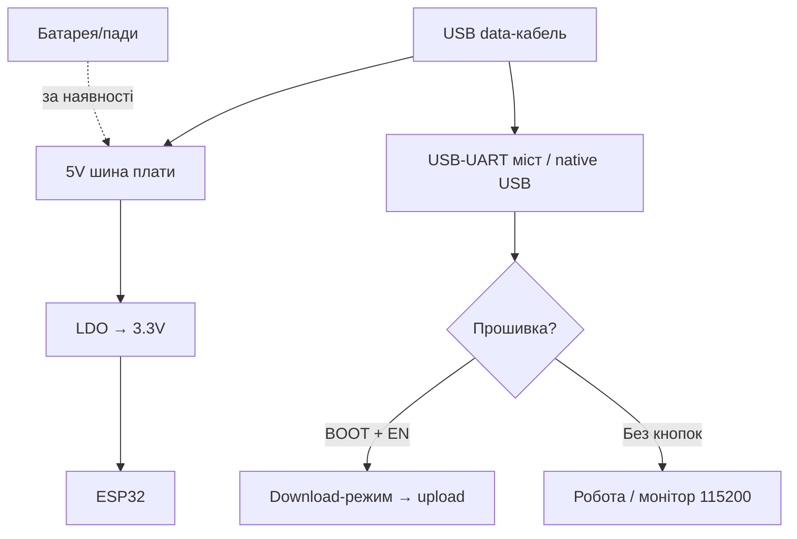

# LILYGO T-Display / T-Beam

> [!tip] Коли брати LILYGO
> T-Display - коли потрібен екран «з коробки» без паяння дисплея. T-Beam - коли потрібен LoRa-трекер з GPS і живленням від 18650. Загальний огляд плат - [[00-Start/04-Devkit-plati|DevKit плати]], дисплеї - [[11-Vivid/02-TFT-LCD-Epaper|TFT/LCD]], LoRa - [[12-Moduli-zvyazku/02-NRF24-LoRa|NRF24/LoRa]].
>
> [!warning] Версій багато - звіряйте ревізію!
> T-Display буває Classic (ESP32) і S3; T-Beam - V0.7 / V1.1 / V1.2 (AXP2101) / S3 Supreme. Розпіновка дисплея, GPS і PMU відрізняється! Дивіться шовкографію своєї плати.

## Призначення

LILYGO (TTGO) T-Display - плата ESP32 з вбудованим кольоровим TFT 1.14" (ST7789, 135×240) і двома кнопками: готовий HMI-вузол для меню, графіків сенсорів, годинника. LILYGO T-Beam - плата ESP32 + LoRa-трансивер (SX1276/SX1262 залежно від ревізії) + GPS (NEO-6M/NEO-M8N) + тримач 18650 з зарядкою: готовий трекер для Meshtastic, APRS, польових сенсорів.

| Параметр | T-Display Classic | T-Beam V1.1/V1.2 |
| --- | --- | --- |
| Призначення | Екранний інтерфейс, дашборди | LoRa-трекер, Meshtastic-вузол |
| Кристал | ESP32 Classic (є версія S3) | ESP32 Classic / S3 Supreme |
| Радіо | Wi-Fi + BT | Wi-Fi + BT + LoRa + GPS |

## Характеристики

| Характеристика | T-Display Classic | T-Beam V1.1 / V1.2 |
| --- | --- | --- |
| Модуль | ESP32-WROOM-32, 4 МБ Flash | ESP32-WROOM-32, 4/8 МБ Flash + 8 МБ PSRAM (V1.2/Supreme) |
| Дисплей | TFT 1.14" ST7789 135×240 (SPI) | OLED 0.96" SSD1306 (деякі ревізії) / без екрана |
| LoRa | Немає | SX1276 (433/868/915 МГц версії!) + IPEX-антена |
| GPS | Немає | NEO-M8N (V1.2) / NEO-6M (старі), UART |
| Батарея | LiPo-роз'єм JST 2.0 (без зарядки на частині ревізій) | Тримач 18650 + зарядка (AXP192/AXP2101 PMU) |
| USB-UART | CH9102 / CP2104 (залежно від партії) | CP2104 + авторесет |
| USB | USB-C (нові) / Micro-USB (старі) | Micro-USB (V1.x) / USB-C (Supreme) |
| Кнопки | 2× (GPIO35 + GPIO0) | BOOT + RESET + PWR (PMU) |
| Розмір | 51×26 мм | 73×30 мм + антени |

> [!warning] Частота LoRa вибирається при купівлі!
> Плати 433 МГц і 868/915 МГц апаратно різні (фільтри). Перепрошити 433 на 868 не можна. Для України беріть 868 МГц. Антену підключати ОБОВ'ЯЗКОВО до вмикання передачі, інакше згорить вихід, див. [[12-Moduli-zvyazku/02-NRF24-LoRa|NRF24/LoRa]].

## Особливості розпіновки T-Display

Вбудований ST7789 підключений жорстко (VSPI):

| Сигнал дисплея | GPIO | Примітка |
| --- | --- | --- |
| TFT_MOSI | GPIO19 | Дані |
| TFT_SCLK | GPIO18 | Такт |
| TFT_CS | GPIO5 | Chip Select |
| TFT_DC | GPIO16 | Data/Command |
| TFT_RST | GPIO23 | Reset |
| TFT_BL | GPIO4 | Підсвітка (PWM-диммінг!) |
| BUTTON1 | GPIO35 | Тільки вхід! |
| BUTTON2 | GPIO0 | BOOT - обережно з натисканням при старті |
| ADC Power | GPIO14 | Живлення дільника батареї |

Вільними лишаються приблизно GPIO21/22 (I2C), 25/26/27/32/33. Бібліотека TFT_eSPI, конфіг під T-Display. Підсвітку (GPIO4) керуйте через `ledcWrite` для економії батареї. Деталі SPI - [[04-Shini/02-SPI|SPI]].

## Особливості розпіновки T-Beam

| Вузол | Сигнали | Примітка |
| --- | --- | --- |
| LoRa DIO/RESET | NSS GPIO18, RST GPIO14, DIO0 GPIO26, SCK/MOSI/MISO 5/27/19 | SX1276 через SPI |
| GPS | TX→GPIO34, RX→GPIO12, 9600 бод | Живлення GPS окремим ключем PMU |
| OLED (де є) | SDA GPIO21, SCL GPIO22, 0x3C | SSD1306 |
| SD-карта (V1.2+) | MOSI 23/MISO 19/SCK 18/CS залежить від ревізії | Перевіряйте схему ревізії! |
| PMU AXP192/AXP2101 | I2C GPIO21/22, IRQ GPIO35 | Керує зарядкою, GPS-power, OLED-power |
| 18650 | Тримач на платі | Тільки незахищені flat-top? Ні - захищені теж входять |

> [!tip] PMU - ключ до батареї
> На T-Beam V1.2 живлення GPS/OLED/SD йде через AXP2101. Без ініціалізації PMU в коді GPS «не відповідає», хоча підключений правильно. Використовуйте приклади LILYGO з налаштуванням PMU або готові прошивки Meshtastic.

## Особливості живлення

| Джерело | T-Display | T-Beam |
| --- | --- | --- |
| USB | 5V, прошивка + живлення | 5V, зарядка 18650 + живлення |
| Батарея | JST LiPo 3.7V (перевірте полярність! китайські JST бувають переплутані) | 18650 в тримачі, заряд ~500 мА |
| 5V пін | Вихід/вхід 5V шини | Вхід 5V для польового живлення |
| 3V3 | До ~300 мА для датчиків | До ~300 мА (PMU обмежує) |

> [!warning] Полярність JST!
> На частині T-Display роз'єм JST має переплутані +/− відносно стандартних LiPo-акумуляторів. Перед першим вмиканням перевірте мультиметром: + батареї повинен прийти на пін з написом BAT+/+. Переполюсовка = смерть PMU/LDO.

## Особливості USB-UART

T-Display нових партій - CH9102 (драйвер WCH), старі - CP2104 (SiLabs). T-Beam V1.x - CP2104. Швидкість прошивки 921600 для CP2104, 460800 для CH9102. Авторесет є на обох лінійках. Якщо порт не з'являється - встановіть драйвер моста і перевірте кабель (data!).

## Кнопки

T-Display: BUTTON1 (GPIO35, тільки вхід - зовнішній pull-up не потрібен, але і pull-down не працює!), BUTTON2 = BOOT (GPIO0). Утримання BUTTON2 при старті = download-режим. T-Beam: RST (EN), BOOT (GPIO0), PWR (утримувати 2 с - вмикання від батареї; коротке натискання в роботі - програмоване). Без натискання PWR плата від батареї може «не стартувати» - це нормально, так задумано для економії.

## Для чого підходить

- T-Display: наручний годинник/термометр з графіком, меню керування реле, монітор MQTT-топіків, бейджі. Пасує до [[10-Sensori/03-BME280-BMP280-SHT31|BME280]], [[10-Sensori/07-AHT10-AHT20-SHT40|AHT/SHT40]].
- T-Beam: Meshtastic-вузол, GPS-трекер лижника/велосипедиста, польовий сенсор з LoRa-зв'язком, APRS-маяк. Пасує до [[12-Moduli-zvyazku/02-NRF24-LoRa|LoRa]], [[12-Moduli-zvyazku/03-SIM800L-GPS|GPS]].
- НЕ підходить: T-Display - для LoRa (його там немає); T-Beam - як перша навчальна плата (складна PMU, антени, ціна).

## Прошивка

Arduino IDE: T-Display - `ESP32 Dev Module`, 4MB Flash; T-Beam - `ESP32 Dev Module` або `T-Beam` (пакет esp32 + бібліотеки LILYGO). Meshtastic: готові бінарники `tbeam` з сайту Meshtastic, шити через web-flasher або esptool.

```ini
; PlatformIO — T-Display
[env:lilygo-t-display]
platform = espressif32
board = esp32dev
framework = arduino
upload_speed = 921600
monitor_speed = 115200
lib_deps = bodmer/TFT_eSPI@^2.5.0
build_flags = -DUSER_SETUP_LOADED -DST7789_DRIVER -DTFT_WIDTH=135 -DTFT_HEIGHT=240

; PlatformIO — T-Beam (RadioLib LoRa)
[env:lilygo-t-beam]
platform = espressif32
board = esp32dev
framework = arduino
upload_speed = 921600
monitor_speed = 115200
lib_deps = jgromes/RadioLib@^6.6.0
```

```cpp
// T-Display: мінімум TFT_eSPI
#include <TFT_eSPI.h>
TFT_eSPI tft;
void setup() {
  tft.init();
  tft.setRotation(1);
  tft.fillScreen(TFT_BLACK);
  tft.drawString("Pryvit!", 20, 60, 4);
  pinMode(4, OUTPUT); // BLK
}
```

ESP-IDF: цілі `esp32` (Classic) / `esp32s3` (Supreme). MicroPython на T-Display працює, драйвер ST7789 - зовнішній модуль.

## Типові помилки

| Симптом | Причина | Рішення |
| --- | --- | --- |
| Чорний екран T-Display | Не той драйвер/конфіг TFT_eSPI | User_Setup під T-Display, ST7789 135×240 |
| Екран білий після прошивки | GPIO4 (BLK) не ввімкнена | `digitalWrite(4, HIGH)` або PWM |
| BUTTON1 не працює як вихід | GPIO35 тільки вхід | Тільки `digitalRead` |
| T-Beam не бачить GPS | PMU не ввімкнула живлення GPS | Ініціалізувати AXP2101 / прошити Meshtastic |
| LoRa не передає | Немає антени / не та частота | Накрутити антену своєї частоти ДО вмикання |
| Плата не стартує від 18650 | Не натиснута PWR / батарея розряджена | Утримати PWR 2 с, зарядити через USB |
| Переплутана полярність JST | Китайський роз'єм | Перевірити мультиметром до вмикання! |
| `Failed to connect` | Не той драйвер USB-UART | CH9102→WCH, CP2104→SiLabs |

## Схема живлення та прошивки

> [!example] Фото/схема: ![[assets/img/devboard-ttgo-tdisplay-tbeam.png|600]]

```text
T-Display: [USB-C 5V / LiPo JST 3.7V] ──► LDO ──► 3.3V ──► ESP32 + ST7789
  Перевірити полярність JST! BLK(GPIO4)=HIGH вмикає підсвітку.
  Кнопки: B1=GPIO35 (вхід), B2=GPIO0 (BOOT). I2C датчиків: 21/22.

T-Beam: [USB 5V] ──► AXP2101 ──► заряд 18650 + живлення вузлів (GPS/OLED/SD)
  PWR утримати 2с для старту від батареї. LoRa-антена 868МГц ОБОВ'ЯЗКОВА!
[ПК] ─USB─► CP2104/CH9102 ─TX/RX─► GPIO3/GPIO1, DTR/RTS авторесет.
GPS: TX→GPIO34 @9600. LoRa: NSS18/RST14/DIO26 + SPI 5/27/19.
```

## Офіційні джерела

- LILYGO - офіційний сайт виробника (каталог T-Display / T-Beam, живі фото): <https://lilygo.cc/>
- LILYGO TTGO-T-Display - репозиторій (схема, розпіновка ST7789, приклади): <https://github.com/Xinyuan-LilyGO/TTGO-T-Display>
- LILYGO LoRa-Series - репозиторій T-Beam (схеми, PMU, GPS, LoRa-приклади): <https://github.com/Xinyuan-LilyGO/LilyGo-LoRa-Series>

### Mermaid: живлення і перша прошивка плати



## Див. також

- [[Home|Головна карта]]
- [[00-Start/04-Devkit-plati|DevKit плати]]
- [[11-Vivid/02-TFT-LCD-Epaper|TFT/LCD/E-paper]]
- [[12-Moduli-zvyazku/02-NRF24-LoRa|NRF24/LoRa]]
- [[12-Moduli-zvyazku/03-SIM800L-GPS|SIM800L/GPS]]
- [[04-Shini/02-SPI|SPI]]
- [[04-Shini/03-I2C|I2C]]
- [[11-Vivid/01-OLED-SSD1306]]
- [[02-Zhivlennya/04-Akumulyatori-TP4056|Акумулятори TP4056]]
- [[09-Proshivka/02-Arduino-PlatformIO|Arduino/PlatformIO]]
- [[99-Dodatki/02-Troubleshooting-FAQ|FAQ]]
