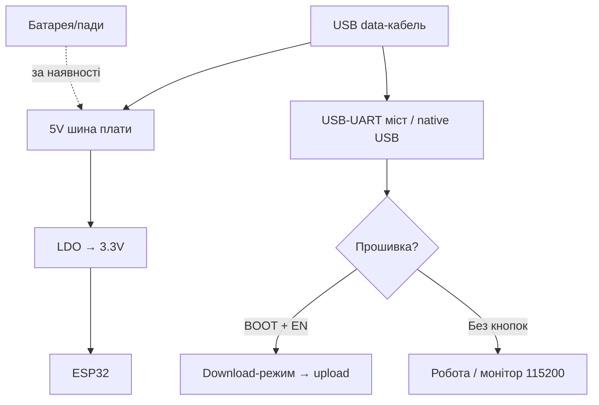

# ESP32-CAM - камера без USB

> [!tip] Навіщо ESP32-CAM
> Найдешевша Wi-Fi камера ($6-9): відеодзвінок, timelapse, розпізнавання облич, ESP-WHO. Але плати доведеться «помучити»: USB немає, FTDI потрібен окремо. Загальний огляд - [[00-Start/04-Devkit-plati|DevKit плати]], камери - [[12-Moduli-zvyazku/04-RS485-CAN-Ethernet-Kamera|RS485/CAN/Cam]].
>
> [!warning] Без FTDI не прошити!
> На платі немає USB-UART. Потрібен FTDI-программатор 3.3V (FT232RL/CP2102-модуль) + перемичка GPIO0→GND на час прошивки. 5V-FTDI вб'є плату!

## Призначення

ESP32-CAM (AI-Thinker) - плата ESP32-S (240 МГц, 520 КБ SRAM + 4 МБ PSRAM) з камерою OV2640 (2 Мп), слотом microSD, яскравим LED-спалахом (GPIO4) і виведеними GPIO. Призначення: IP-камера, фото-пастки з PIR, відеоняня, розпізнавання QR/облич, timelapse на SD. Живлення 5V, споживання з камерою до 250-300 мА.

| Параметр | Значення |
| --- | --- |
| Призначення | Wi-Fi камера, фото-пастки, відеоспостереження |
| Кристал | ESP32-S, 240 МГц + 4 МБ PSRAM (обов'язкова для камери!) |
| Камера | OV2640 2 Мп (UXGA 1600×1200), змінний об'єктив M12 |

## Характеристики

| Характеристика | Значення | Примітка |
| --- | --- | --- |
| Модуль | ESP32-S, Flash 4 МБ + PSRAM 4 МБ | Без PSRAM камера вище QVGA не працює |
| Камера | OV2640, SCCB (I2C-подібний) + DVP-паралельна шина | Фокус крутиться вручну! |
| Роздільна здатність | UXGA 1600×1200 max, робочі SVGA/VGA/QVGA | UXGA тільки з PSRAM + добрим живленням |
| microSD | Слот, 1/4-біт SDMMC | Зберігання фото/відео, див. [[04-Shini/07-SD-SDIO | SD]] |
| LED-спалах | Білий LED на GPIO4 | Яскравий, сліпить - не дивитись! |
| Червоний LED | GPIO33 (інверсна логіка) | Статус |
| USB | Немає! | Тільки FTDI 3.3V |
| Живлення | 5V пін (рекомендовано) / 3.3V пін | Струм до 300 мА з камерою + спалах |
| Кнопки | RST (EN) | BOOT немає - перемичка GPIO0→GND! |
| Вільні GPIO | GPIO1/3 (UART), 12/13/14/15/16, 2, 4 | Більшість зайнята камерою/SD |

> [!tip] Фокус
> З заводу об'єктив часто розфокусований (м'яке зображення). Акуратно покрутіть об'єктив за годинниковою/проти, дивлячись у стрім. Не тисніть на матрицю!

## Особливості розпіновки

Камера з'їдає майже все. Карта зайнятих пінів:

| Пін | Роль | Вільний? |
| --- | --- | --- |
| GPIO0 | XCLK камери + BOOT (прошивка!) | Ні - перемичка на час flash |
| GPIO5/18/19/21/36/39/34/35 | D0-D7 камери (DVP) | Ні |
| GPIO22/23/25 | PCLK/HREF/VSYNC камери | Ні |
| GPIO26/27 | SCCB (SDA/SCL камери) | Ні |
| GPIO32 | PWDN камери | Ні |
| GPIO14/15/2/12/13 | SD-карта (CLK/CMD/DATA) | Так, якщо не потрібна SD |
| GPIO4 | Спалах + SD DATA1 | Частково (конфлікт зі спалахом) |
| GPIO16 | PSRAM CS (!) | Ні в якому разі не чіпати! |
| GPIO1/3 | UART TX/RX (прошивка, монітор) | Так, після прошивки |
| GPIO33 | Червоний LED | Так (інверсія) |

Практичний висновок: без SD вільні GPIO12/13/14/15/2 (+1/3 після прошивки). З SD - тільки GPIO1/3/16-заборонено... тобто майже нічого. Датчик (PIR, BME280) вішайте на GPIO13/14/15 з підтяжками. I2C камери (26/27) чіпати не можна.

## Особливості живлення

| Джерело | Куди | Обмеження |
| --- | --- | --- |
| 5V 2A блок | Пін 5V + GND | РЕКОМЕНДОВАНО. Камера + Wi-Fi = 250-300 мА піки |
| FTDI 5V | Пін 5V | Тільки якщо FTDI дає чесні 500 мА |
| 3.3V | Пін 3V3 | Тільки стабільні 3.3V 1A+, обхід LDO |
| AMS1117 на платі | 5V→3.3V | Слабкий, гріється; електроліт 470 мкФ допомагає |

> [!warning] Живлення - причина 80% проблем
> Коричневий екран, ребути при старті стріму, `Camera probe failed` - майже завжди слабке живлення. Беріть блок 5V 2A, товсті короткі дроти, конденсатор 470-1000 мкФ між 5V і GND біля плати. Від USB-порту ноутбука через тонкий кабель - не злетить.

## Особливості USB-UART (FTDI)

USB-моста немає - потрібен зовнішній FTDI 3.3V:

| Елемент | Підключення | Примітка |
| --- | --- | --- |
| FTDI VCC | Пін 5V плати (якщо FTDI живить) або окремий БЖ | Перемичка 3.3V/5V на FTDI - в 5V? Ні: логіка 3.3V! |
| FTDI GND | GND плати | Спільна обов'язково |
| FTDI TX | U0R (GPIO3) плати | Перехресно! |
| FTDI RX | U0T (GPIO1) плати | Перехресно! |
| GPIO0 | Перемичка на GND | Тільки на час прошивки! |
| RST | Кнопка на платі | Натиснути після підключення GPIO0 |

Послідовність прошивки: 1) з'єднати GPIO0→GND; 2) натиснути RST; 3) шити в Arduino; 4) прибрати перемичку; 5) натиснути RST для запуску. Альтернатива - плата-розширювач ESP32-CAM-MB (micro-USB + кнопки + авторесет): вставив CAM - шиєш як звичайну плату.

## Кнопки

Тільки RST (EN). Кнопки BOOT/FLASH немає - її роль виконує перемичка GPIO0→GND. На ESP32-CAM-MB є кнопки RST + IO0, що спрощує життя. Червоний LED (GPIO33) і спалах (GPIO4) керуються кодом.

## Для чого підходить

- IP-камера з прикладу CameraWebServer (стрим + керування спалахом з браузера).
- Фото-пастка: PIR на GPIO13 → фото → зберегти на SD → deep-sleep.
- Timelapse будівництва/рослин: фото раз на N хвилин на SD.
- QR/розпізнавання: приклади ESP-WHO (потрібен добрий освітлення).
- Дверний дзвінок з фото в Telegram.
- НЕ підходить: як перша плата (муки з FTDI), батарейні проєкти (250 мА в активі, deep-sleep ~6 мА - батареї вистачить ненадовго), точні аналогові виміри (вільних ADC майже немає), відео 24/7 без охолодження (гріється).

## Прошивка

Arduino IDE: плата `AI Thinker ESP32-CAM`, Partition `Huge APP (3MB No OTA)`, PSRAM `Enabled`. Приклад: File → Examples → ESP32 → Camera → CameraWebServer (SSID/пароль + модель `CAMERA_MODEL_AI_THINKER`).

```ini
; PlatformIO (platformio.ini)
[env:esp32cam]
platform = espressif32
board = esp32cam
framework = arduino
upload_speed = 460800
monitor_speed = 115200
board_build.partitions = huge_app.csv
build_flags = -DBOARD_HAS_PSRAM -mfix-esp32-psram-cache-issue
```

```cpp
// Перевірка PSRAM — обов'язково перед камерою
#include "esp_camera.h"
void setup() {
  Serial.begin(115200);
  Serial.printf("PSRAM: %d bytes\n", ESP.getPsramSize());
  // Камера без PSRAM вище QVGA не піде!
}
```

ESP-IDF: приклад `esp-idf/examples/peripherals/camera`. MicroPython з камерою - обмежено, краще Arduino/IDF.

## Типові помилки

| Симптом | Причина | Рішення |
| --- | --- | --- |
| `Camera probe failed` | Слабке живлення / не той пін-мапінг | Блок 5V 2A + 470 мкФ, модель AI_THINKER |
| Коричневий екран у стрімі | Просадка при Wi-Fi TX | Живлення + конденсатор, SVGA замість UXGA |
| Ребути при старті | Brownout | Те саме + короткий товстий USB/дроти |
| `Failed to connect` | Немає GPIO0→GND / переплутані TX/RX | Перемичка + перехрест TX/RX + RST |
| Мутне зображення | Розфокусований об'єктив | Покрутити об'єктив вручну |
| Спалах світить постійно тьмяно | GPIO4 конфліктує з SD DATA1 | Ініціалізувати SD в 1-біт режимі або без SD |
| Немає вільних пінів | Все зайнято камерою/SD | Використати GPIO13/14/15 або другу плату для сенсорів |
| Перегрів | Довгий стрім UXGA | SVGA, радіатор на екран модуля, паузи |

## Схема живлення та прошивки

> [!example] Фото/схема: ![[assets/img/devboard-esp32cam.png|600]]

```text
[БЖ 5V 2A] ──► пін 5V + GND плати (+ 470–1000 мкФ між 5V і GND!)
  НЕ живити від тонкого USB ноутбука! Піки 300 мА (камера + Wi-Fi + спалах).

[FTDI 3.3V] ─TX─► U0R(GPIO3) / ─RX─◄ U0T(GPIO1) / GND──►GND
  GPIO0 ──[перемичка]──► GND (ТІЛЬКИ на час прошивки!)
  1) перемичка → 2) RST → 3) шити 460800 → 4) зняти перемичку → 5) RST.
ESP32-CAM-MB: вставити плату — шити як звичайну (авторесет є).
Вільні піни: 13/14/15/2 (без SD), 1/3 (після прошивки). GPIO16 НЕ ЧІПАТИ!
```

## Офіційні джерела

- Random Nerd Tutorials - ESP32-CAM AI-Thinker Pinout (розпіновка, GPIO, камера, живі фото): <https://randomnerdtutorials.com/esp32-cam-ai-thinker-pinout/>
- CircuitPython - Ai Thinker ESP32-CAM (характеристики плати, PSRAM, живлення): <https://circuitpython.org/board/ai-thinker-esp32-cam/>

### Mermaid: живлення і перша прошивка плати



## Див. також

- [[Home|Головна карта]]
- [[00-Start/04-Devkit-plati|DevKit плати]]
- [[12-Moduli-zvyazku/04-RS485-CAN-Ethernet-Kamera|RS485/CAN/Камера]]
- [[04-Shini/07-SD-SDIO|SD/SDIO]]
- [[04-Shini/01-UART|UART]]
- [[13-Moduli-zhivlennya-rivniv/05-USB-UART-AutoReset|USB-UART]]
- [[02-Zhivlennya/01-Lancjugi-zhivlennya|Ланцюги живлення]]
- [[09-Proshivka/02-Arduino-PlatformIO|Arduino/PlatformIO]]
- [[09-Proshivka/04-Esptool-Flash|Esptool]]
- [[07-Timeri-Son/03-Sleep-ULP|Sleep/ULP]]
- [[99-Dodatki/02-Troubleshooting-FAQ|FAQ]]
