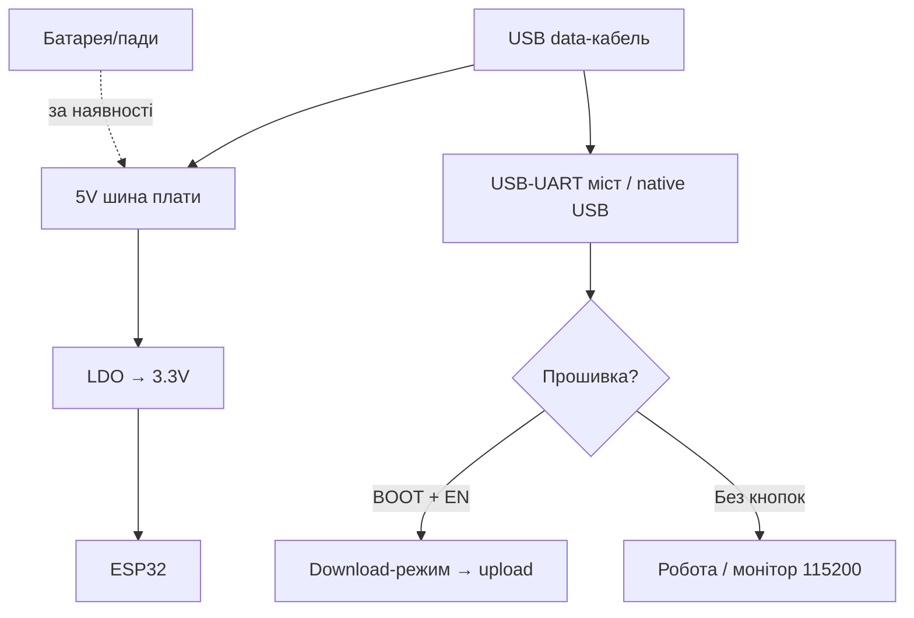

# Feather HUZZAH32 / Thing

> [!tip] Навіщо американські плати
> Feather HUZZAH32 і SparkFun Thing - «джентльменські» плати: вбудована зарядка LiPo, стабільні LDO, документація-рівень-підручник, екосистеми FeatherWings / Qwiic без паяння. Дорожчі за DOIT, але економлять нерви на живленні. Загальний огляд - [[00-Start/04-Devkit-plati|DevKit плати]], батареї - [[02-Zhivlennya/04-Akumulyatori-TP4056|Акумулятори]].
>
> [!warning] 3.3V і тут!
> Обидві плати - 3.3V логіка. LiPo-роз'єм - це живлення, а не «подати 5V». Рівні - [[03-GPIO/03-Pidtyaguvannya-rivni|Рівні 3.3V/5V]].

## Призначення

Adafruit Feather HUZZAH32 - плата ESP32-WROOM-32 у форм-факторі Feather (51×23 мм): USB-UART з авторесетом, зарядка LiPo (MCP73831), кнопка Reset, місце під FeatherWings (дисплеї, GPS, реле - понад 50 крил). SparkFun ESP32 Thing - аналогічна філософія (58×25 мм): FTDI FT231X, зарядка LiPo 500 мА, кнопка, роз'єм JST, Qwiic-конектор (на Thing Plus) для датчиків без паяння. Призначення: батарейні прототипи, навчання за англомовними гайдами, вироби з крилами/кейбликами.

| Параметр | Feather HUZZAH32 | SparkFun Thing / Thing Plus |
| --- | --- | --- |
| Призначення | Feather-екосистема, LiPo-прототипи | Qwiic-датчики, навчальні гайди |
| Кристал | ESP32 Classic (WROOM-32, 4 МБ) | Thing: ESP32 Classic; Plus: WROOM / S3 |
| Фішка | 50+ FeatherWings | Qwiic/STEMMA I2C-кабелі |

## Характеристики

| Характеристика | Feather HUZZAH32 | SparkFun ESP32 Thing |
| --- | --- | --- |
| Модуль | WROOM-32, 4 МБ Flash | WROOM-32, 4 МБ Flash |
| USB-UART | CP2104 + авторесет | FTDI FT231X + авторесет (DTR) |
| USB | Micro-USB | Micro-USB (Thing) / USB-C (Plus) |
| Зарядка LiPo | MCP73831, 200 мА за замовч. (до 500 мА перепайкою) | MCP73831, до 500 мА |
| Роз'єм батареї | JST-PH 2.0 | JST-PH 2.0 |
| LDO 3.3V | AP2112, 600 мА | AP2112, 600 мА |
| Кнопки | Reset (EN); BOOT немає - через авторесет | Reset + «0» (GPIO0/BOOT) |
| LED | Червона зарядка + синя GPIO13/USB | LED живлення + GPIO5 (blink) |
| Екосистема | FeatherWings (стекові крила) | Qwiic (I2C-кабелі) / XBee-сокет (старі) |
| Розмір | 51×23 мм | 58×25 мм |

> [!tip] AP2112 vs AMS1117
> AP2112 має dropout ~0.4V (проти 1.1V у AMS1117) і тихий вихід - LiPo 3.7V живить плату до ~3.5V без просадок, АЦП шумить менше. 600 мА вистачає на ESP32 + Qwiic-датчики, але не на реле - їм окремий ключ, див. [[11-Vivid/03-NeoPixel-Servo-Rele-MOSFET|NeoPixel/Серво/Реле]].

## Особливості розпіновки

Feather-нумерація ≠ GPIO! На шовкографії Feather: A0-A5, SCK/MOSI/MISO, SDA/SCL, RX/TX:

| Feather-пін | GPIO (HUZZAH32) | Примітка |
| --- | --- | --- |
| A0 | GPIO26 (DAC2/ADC2) | Аналог, Wi-Fi конфлікт на ADC2! |
| A1-A5 | GPIO25/34/39/36/4 | A2-A4 тільки входи |
| SCK/MOSI/MISO | GPIO5/19/18 | SPI за замовчуванням |
| SDA/SCL | GPIO23/22 | I2C за замовчуванням (Wire-сумісно) |
| RX/TX | GPIO3/1 | UART0-консоль |
| 13 (синій LED) | GPIO13 | Blink-приклад Adafruit |

SparkFun Thing: виведені майже всі GPIO з підписами номерів (0/2/4/5/12-19/21-23/25-27/32-36/39), LED на GPIO5, кнопка «0» на GPIO0. Вхідні-only 34-39 без pull-up - кнопки тільки з зовнішнім резистором до 3.3V. Деталі мультиплексування - [[03-GPIO/01-GPIO-oglyad|GPIO огляд]].

## Особливості живлення

| Джерело | Параметри | Примітка |
| --- | --- | --- |
| USB 5V | Живлення + зарядка LiPo одночасно | Пріоритет USB, батарея - резерв |
| LiPo 3.7V | JST-PH, 400-2500 мА·г | Тільки 1S! Перевірити полярність JST (Adafruit/SparkFun стандарт: + ліворуч) |
| Струм зарядки | Feather 200 мА / Thing 500 мА | Feather заряджає повільно, зате безпечно для малих 400 мА·г |
| 3V3 вихід | До ~400 мА для периферії | 600 мА мінус ~200 мА самої плати |
| VBAT/VUSB піни | Моніторинг/альтернативний вхід | VBAT - напруга батареї через дільник (див. схему) |

> [!warning] Полярність JST-PH
> Стандарт Adafruit/SparkFun: червоний (+) ліворуч, якщо дивитись на роз'єм згори засувкою догори. Китайські батареї бувають навпаки! Перевірити мультиметром до вмикання. Переполюсовка палить зарядку.

## Особливості USB-UART

Feather HUZZAH32 - CP2104 (SiLabs, стабільний, 921600 бод). Thing - FTDI FT231X (драйвери FTDI, теж стабільний). Обидва з авторесетом: прошивка однією кнопкою Upload. На Thing кнопка «0» (BOOT) потрібна рідко - тільки якщо авторесет не спрацював. Монітор - 115200. Деталі мостів - [[13-Moduli-zhivlennya-rivniv/05-USB-UART-AutoReset|USB-UART]].

## Кнопки

Feather: одна Reset (EN). Режиму download вручну немає кнопкою - тільки авторесет; у крайньому разі перемичка GPIO0→GND + Reset. Thing: Reset + кнопка «0» (GPIO0 до GND) - повноцінний ручний download: тримати «0» → клік Reset → відпустити «0».

## Для чого підходить

- Батарейний прототип з коробки: вставив LiPo - працює, вставив USB - заряджається. Трекери, датчики дверей, бейджі.
- Навчання за Adafruit Learn / SparkFun Hookup Guide: покрокові гайди з фото.
- Qwiic/STEMMA-датчики без паяння: [[10-Sensori/03-BME280-BMP280-SHT31|BME280]], [[10-Sensori/10-VL53L0X-TCS34725-TSL2561|ToF]], OLED - одним кабелем.
- FeatherWings: GPS-Wing + OLED-Wing + HUZZAH32 = трекер-бутерброд.
- НЕ підходить: найдешевша ціна (китайські клони дешевші в рази), PSRAM/камера (немає), 5V-периферія без shifter.

## Прошивка: Qwiic/STEMMA

Arduino IDE: Feather - пакет `adafruit/esp32`, плата `Adafruit ESP32 Feather`; Thing - пакет esp32, плата `SparkFun ESP32 Thing`. Приклади Adafruit (A0-аналог, Wire) працюють одразу.

```ini
; PlatformIO — Feather HUZZAH32
[env:featheresp32]
platform = espressif32
board = featheresp32
framework = arduino
upload_speed = 921600
monitor_speed = 115200

; PlatformIO — SparkFun Thing
[env:esp32thing]
platform = espressif32
board = esp32thing
framework = arduino
upload_speed = 921600
monitor_speed = 115200
```

```cpp
// Qwiic/STEMMA I2C — той самий Wire, без паяння
#include <Wire.h>
void setup() {
  Serial.begin(115200);
  Wire.begin(); // SDA/SCL за замовчуванням плати
  byte err, addr = 0x76;
  Wire.beginTransmission(addr);
  err = Wire.endTransmission();
  Serial.println(err == 0 ? "BME280 found" : "not found");
}
void loop() {}
```

ESP-IDF: цілі `esp32`. CircuitPython на Feather HUZZAH32 підтримується Adafruit (UF2-завантажувач окремих ревізій).

## Типові помилки

| Симптом | Причина | Рішення |
| --- | --- | --- |
| Батарея не заряджається | USB-хаб без живлення / переплутана полярність JST | Безпосередньо в порт, перевірити +/− |
| Feather довго заряджає | 200 мА за замовчуванням | Норма для 400 мА·г; для великих - перепаяти Rprog (див. схему) |
| Аналог шумить з Wi-Fi | ADC2 + Wi-Fi конфлікт | Виміри на ADC1 (A2-A5 входи) |
| Кнопка на 34-39 «плаває» | Немає внутрішніх pull-up | Зовнішній 10к до 3.3V |
| Qwiic-датчик не видно | Довгий шлейф / два однакові адреси | Коротший кабель, змінити адресу перемичкою |
| `Failed to connect` | Кабель charge-only | Data-кабель + драйвер CP2104/FTDI |
| 5V-датчик спалив вхід | 5V на GPIO | Тільки через [[13-Moduli-zhivlennya-rivniv/02-Level-Shifters | level-shifter]] |

## Схема живлення та прошивки

> [!example] Фото/схема: ![[assets/img/devboard-feather-huzzah32.png|600]]

```text
[USB 5V] ─┬─► 5V шина ──► AP2112 ──► 3.3V (плата + Wings/Qwiic ≤400 мА)
          └─► MCP73831 ──► LiPo 3.7V (JST-PH, полярність перевірити!)
Без USB: LiPo ──► AP2112 ──► 3.3V. GND спільна для всіх модулів!

[ПК] ─USB─► CP2104/FT231X ─TX─► RX / ─RX─◄ TX, DTR/RTS авторесет.
Thing: кнопки Reset + «0»(BOOT). Feather: Reset, BOOT — перемичкою за потреби.
Qwiic/STEMMA: 4-пін кабель (3V3/GND/SDA/SCL) — датчики без паяння.
VBAT — моніторинг батареї через дільник (див. схему плати).
```

## Офіційні джерела

- Adafruit Learn - HUZZAH32 ESP32 Feather (гайд, розпіновка, живі фото): <https://learn.adafruit.com/adafruit-huzzah32-esp32-feather>
- Adafruit - товарна сторінка HUZZAH32 (специфікації, ревізії): <https://www.adafruit.com/product/3405>
- SparkFun - ESP32 Thing Hookup Guide (живлення, LiPo, прошивка): <https://learn.sparkfun.com/tutorials/esp32-thing-hookup-guide/all>

### Mermaid: живлення і перша прошивка плати



## Див. також

- [[Home|Головна карта]]
- [[00-Start/04-Devkit-plati|DevKit плати]]
- [[02-Zhivlennya/04-Akumulyatori-TP4056|Акумулятори TP4056]]
- [[04-Shini/03-I2C|I2C]]
- [[10-Sensori/03-BME280-BMP280-SHT31|BME280]]
- [[10-Sensori/10-VL53L0X-TCS34725-TSL2561|ToF/Колір]]
- [[11-Vivid/01-OLED-SSD1306]]
- [[13-Moduli-zhivlennya-rivniv/05-USB-UART-AutoReset|USB-UART]]
- [[09-Proshivka/02-Arduino-PlatformIO|Arduino/PlatformIO]]
- [[07-Timeri-Son/03-Sleep-ULP|Sleep/ULP]]
- [[99-Dodatki/02-Troubleshooting-FAQ|FAQ]]
