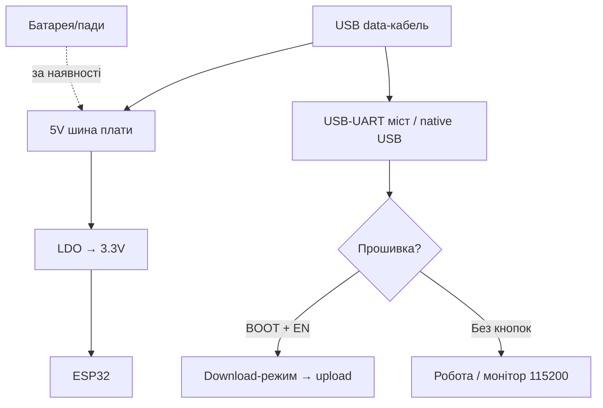

# WT32-ETH01 / Olimex

> [!tip] Навіщо Ethernet на ESP32
> Провідний Ethernet дає стабільність, якої Wi-Fi не дасть: довгі аптайми, PoE-живлення по тому самому кабелю, резервування Wi-Fi→Ethernet. WT32-ETH01 - найдешевша така плата, Olimex - індустріальна з реле і корпусами. Загальний огляд - [[00-Start/04-Devkit-plati|DevKit плати]], Ethernet-база - [[12-Moduli-zvyazku/04-RS485-CAN-Ethernet-Kamera|RS485/CAN/Cam]] та [[12-Moduli-zvyazku/07-SIM7600-W5500-MCP2515|4G/Ethernet/CAN]].
>
> [!warning] Тільки Classic ESP32!
> RMII-Ethernet (LAN8720) працює тільки на ESP32 Classic. На S2/S3/C3 цих плат немає EMAC - беріть SPI-модулі (W5500). І жодних 5V на GPIO!

## Призначення

WT32-ETH01 (Wireless-Tag) - мініатюрний модуль 60×26 мм: ESP32 + LAN8720A Ethernet-PHY + Wi-Fi/BLE, без USB (прошивка через зовнішній FTDI + GPIO0). Призначення: дешеві провідні вузли (MQTT-шлюзи, контролери доступу, Modbus-мости). Olimex ESP32-EVB - індустріальна плата 75×75 мм: Ethernet + 2× реле 10A + CAN + IR + microSD + UEXT + LiPo-UPS. ESP32-GATEWAY - компактніша 50×62 мм: Ethernet + microSD + UEXT, без реле. Призначення: автоматизація будівель, шафи керування, вуличні контролери.

| Параметр | WT32-ETH01 | Olimex EVB | Olimex GATEWAY |
| --- | --- | --- | --- |
| Призначення | Дешевий Ethernet-вузол | Шафа керування з реле | Компактний шлюз |
| Кристал | ESP32 Classic (WT32-S1) | ESP32-WROOM-32E/UE | ESP32-WROOM-32E/UE |
| Ethernet | LAN8720A, RJ45 | LAN8710A, RJ45 | LAN8710A, RJ45 |

## Характеристики

| Характеристика | WT32-ETH01 | ESP32-EVB | ESP32-GATEWAY |
| --- | --- | --- | --- |
| Flash | 4 МБ, без PSRAM | 4 МБ (є 16 МБ версії) | 4 МБ (є 16 МБ) |
| Антена | PCB (є версія U.FL) | PCB або зовнішня (-EA) | PCB або зовнішня (-EA) |
| USB | Немає! Тільки FTDI | Micro-USB + CH340 | USB-C + CH340 |
| Реле | Немає | 2× 10A/250VAC + LED | Немає |
| CAN | Немає | TJA1050 + роз'єм | Немає |
| IR | Немає | Приймач + передавач | Немає |
| SD | Немає | microSD | microSD |
| UEXT | Немає | Так (I2C/SPI/UART-модулі) | Так |
| LiPo | Немає | Зарядка + UPS-режим | Немає (є PoE-версії окремо) |
| Кнопки | Немає (пади EN/IO0) | Reset + User (GPIO34) | Reset + User |
| Живлення | 5V або 3.3V (перемичка!) | 5V jack/USB/LiPo | 5V USB-C / PoE (у PoE-версіях) |
| Розмір | 60×26 мм | 75×75 мм | 50×62 мм |

> [!tip] Модифікації Olimex
> -EA = зовнішня антена (металічні шафи глушать PCB-антену!). -IND = індустріальний діапазон −40…+85 °C. ESP32-POE / PoE-ISO - окремі плати з Power-over-Ethernet (ізоляція 1500V у ISO!). Для вуличних шаф беріть -EA-IND.

## Особливості розпіновки

WT32-ETH01: виведено мало - EN, GPIO0/1/3/5/12/14/15/17/32/33/35/36/39 + 5V/3.3V/GND. Ethernet займає RMII-піни всередині (GPIO19/21/22/25/26/27 - НЕ чіпати!). GPIO0 - прошивка (тримати LOW при старті). GPIO1/3 - UART прошивки. Для датчиків лишаються ~32/33/35/36/39/14/15/12/17/5 (з strapping-обмеженнями!). Деталі strapping - [[03-GPIO/02-Strapping-pini|Strapping]].

Olimex EVB/GATEWAY: виведено все через гребінки + UEXT. Зайняті: RMII-піни Ethernet (ті ж), реле (GPIO32/33 на EVB - перевіряйте ревізію!), CAN TX/RX, SD (SPI), IR. Вільні - через UEXT-модулі: десятки готових (реле, датчики, GSM, LoRa). UEXT = 3.3V I2C/SPI/UART + живлення в одному 10-пін роз'ємі - периферія без паяння.

## Особливості живлення

| Джерело | WT32-ETH01 | Olimex |
| --- | --- | --- |
| 5V | Пін 5V (LDO→3.3V) | Jack 5V / USB / UEXT |
| 3.3V | Пін 3V3 (в обхід LDO) | Тільки вихід для модулів |
| PoE | Немає (тільки спліттером!) | PoE/PoE-ISO версії: 48V→5V ізольовано |
| PoE-спліттер (для WT32 без PoE) | Пасивний 48V→5V або активний 802.3af (узгодження!) | Активний дорожчий, але не спалить PHY при помилці |
| LiPo UPS | Немає | EVB: LiPo-зарядка, живлення при пропаданні 5V |

> [!warning] PoE застереження!
> Пасивний PoE-інжектор 24V у звичайний WT32-ETH01/GATEWAY (без PoE) = миттєва смерть (48V на data-парах проб'ють PHY). PoE подавайте ТІЛЬКИ на плати з написом PoE/PoE-ISO і тільки через 802.3af-комутатор або узгоджений інжектор. Розпіновка PoE: живлення йде по spare-парах 4-5/7-8 (Mode B) або фантомно (Mode A) - плати Olimex PoE приймають обидва. Перевіряйте клас потужності: реле + Wi-Fi можуть їсти 5-8 Вт, беріть запас.

## Особливості USB-UART

WT32-ETH01: моста НЕМАЄ. Прошивка через зовнішній FTDI 3.3V: TX→GPIO3, RX→GPIO1, GPIO0→GND на час прошивки, EN-кнопкою/перемичкою ресет. Параметри як у ESP32-CAM (див. схему нижче). Olimex: CH340 вбудований (драйвер WCH), авторесет є, швидкість 460800-921600. Якщо Ethernet-кабель підключений під час прошивки - не заважає.

## Кнопки

WT32-ETH01: кнопок немає - пади EN і IO0. Для зручності підпаяйте дві тактові кнопки (IO0→GND, EN→GND) або використовуйте программатор з авторесетом (DTR→EN, RTS→IO0 через NPN). Olimex: Reset (EN) + User-кнопка (GPIO34, тільки вхід - читати з pull-up!). На EVB є також LEDs реле/живлення/LiPo.

## Для чого підходить

- WT32-ETH01: MQTT-датчики по кабелю в офісі, Modbus-TCP мости, резервний канал до Wi-Fi (failover у коді), домофони/турнікети.
- EVB: шафа керування: 2 реле (котел/світло) + CAN (автоматика) + IR (кондиціонер) + Ethernet - все на одній платі з корпусом BOX-ESP32-EVB.
- GATEWAY: компактний шлюз RS485/Ethernet, вуличний контролер у BOX-пластиці, LoRa-шлюз через UEXT-LoRa.
- НЕ підходить: батарейні місяці (Ethernet їсть ~150 мА постійно!), S3/C3-проєкти (EMAC тільки Classic), 5V-датчики без shifter.

## Прошивка

Arduino IDE: WT32-ETH01 - `ESP32 Dev Module` (немає окремого профілю в старих пакетах; у нових/PlatformIO є `wt32-eth01`). Olimex - `ESP32 Dev Module` або `OLIMEX ESP32-EVB/GATEWAY` (пакет esp32). Ethernet у Arduino: бібліотека `ETH.h` з пінами плати.

```ini
; PlatformIO — WT32-ETH01
[env:wt32-eth01]
platform = espressif32
board = wt32-eth01
framework = arduino
upload_speed = 115200
monitor_speed = 115200

; PlatformIO — Olimex GATEWAY/EVB
[env:olimex-gateway]
platform = espressif32
board = esp32-gateway
framework = arduino
upload_speed = 460800
monitor_speed = 115200
```

```cpp
// Ethernet WT32-ETH01 (LAN8720, RMII)
#include <ETH.h>
void setup() {
  Serial.begin(115200);
  ETH.begin(1, 16, 23, 18, ETH_PHY_LAN8720, ETH_CLOCK_GPIO0_IN);
  // addr=1, power=16, mdc=23, mdio=18 — саме для WT32-ETH01!
  while ((uint32_t)ETH.localIP() == 0) delay(200);
  Serial.println(ETH.localIP());
}
// Olimex EVB/GATEWAY: той самий виклик, power=-1 (див. приклад виробника).
```

ESP-IDF: компонент `esp_eth` + `esp_netif`, приклад `ethernet/basic`. ESPHome: платформа `esp32`, `ethernet:` з типом LAN8720 і тими самими пінами. Tasmota: збірка `tasmota32-ethernet`.

## Типові помилки

| Симптом | Причина | Рішення |
| --- | --- | --- |
| Ethernet не лінкується | Не ті піни PHY / крос-кабель без Auto-MDIX | Піни 1/16/23/18/0, звичайний патч-корд |
| Плата не прошивається (WT32) | Немає GPIO0→GND / 5V-FTDI | Перемичка + FTDI 3.3V + ресет |
| Смерть після PoE-інжектора | Пасивний PoE в не-PoE плату | Тільки PoE-версії + 802.3af |
| Реле клацає при boot (EVB) | GPIO реле плаває при старті | Зовнішній pull-down, ініціалізувати рано |
| Пасивний PoE-спліттер замість активного | Без узгодження 802.3af - ризик для PHY | Активний спліттер або PoE-версія плати |
| Wi-Fi глушиться в метал-шафі | PCB-антена екранована | Версія -EA + виносна антена |
| Ethernet їсть батарею | PHY ~150 мА постійно | Не для батарей; або вимикати ETH у sleep |
| CH340-паразитне живлення (EVB) | GPIO3 як вихід живить міст | GPIO3 на вхід при живленні без USB (див. FAQ Olimex) |
| `wrong chip ID lan87xx` | PHY не встиг стартувати | `delay(500)` на початку `setup()` |

## Схема живлення та прошивки

> [!example] Фото/схема: ![[assets/img/devboard-wt32-eth01.png|600]]

```text
WT32-ETH01: [FTDI 3.3V] ─TX─► GPIO3 / ─RX─◄ GPIO1 / GND──►GND
  GPIO0 ──[перемичка]──► GND (на час прошивки!) → EN-ресет → шити 115200.
  Живлення: 5V пін (LDO) АБО 3V3 (обхід). PoE — ЗАБОРОНЕНО (немає розв'язки)!
  ETH.begin(1, 16, 23, 18, LAN8720, GPIO0_IN). RMII-піни 19/21/22/25-27 НЕ ЧІПАТИ!

Olimex: [5V jack / USB / PoE(тільки PoE-версії!)] ──► плата ──► реле/CAN/IR/SD/UEXT
  Прошивка через вбудований CH340 (460800). delay(500) перед ETH.begin()!
  -EA: виносна антена для метал-шаф. LiPo на EVB = UPS при пропаданні 5V.
```

## Офіційні джерела

- Wireless-Tag - сторінка WT32-ETH01 (даташит, Getting Started, живі фото): <https://en.wireless-tag.com/product-item-2.html>
- Egnor - WT32-ETH01 неофіційний гайд (розпіновка, RMII-піни, прошивка без USB): <https://github.com/egnor/wt32-eth01>
- Olimex - ESP32-EVB (реле, CAN, UEXT, LiPo-UPS, схеми): <https://www.olimex.com/Products/IoT/ESP32/ESP32-EVB/open-source-hardware>
- Olimex - ESP32-GATEWAY (компактний шлюз, -EA/-IND версії): <https://www.olimex.com/Products/IoT/ESP32/ESP32-GATEWAY/open-source-hardware>
- LAN8720A - Microchip (RMII PHY): <https://www.microchip.com/en-us/product/LAN8720A>
- LAN8710A - Microchip (RMII PHY): <https://www.microchip.com/en-us/product/LAN8710A>

### Mermaid: живлення і перша прошивка плати



## Див. також

- [[Home|Головна карта]]
- [[00-Start/04-Devkit-plati|DevKit плати]]
- [[12-Moduli-zvyazku/04-RS485-CAN-Ethernet-Kamera|RS485/CAN/Камера]]
- [[12-Moduli-zvyazku/07-SIM7600-W5500-MCP2515|4G/Ethernet/CAN]]
- [[04-Shini/01-UART|UART]]
- [[13-Moduli-zhivlennya-rivniv/05-USB-UART-AutoReset|USB-UART]]
- [[11-Vivid/03-NeoPixel-Servo-Rele-MOSFET|NeoPixel/Серво/Реле]]
- [[09-Proshivka/02-Arduino-PlatformIO|Arduino/PlatformIO]]
- [[09-Proshivka/04-Esptool-Flash|Esptool]]
- [[99-Dodatki/02-Troubleshooting-FAQ|FAQ]]
