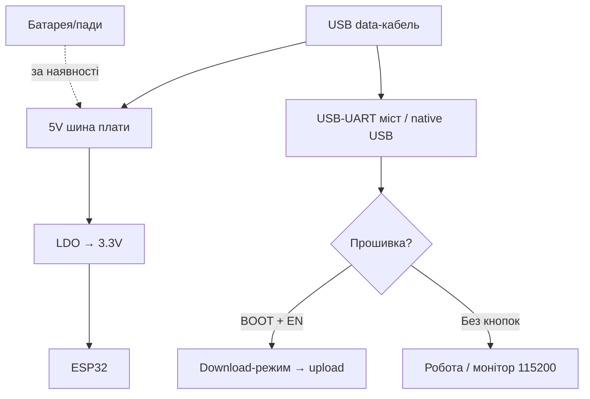

# HMI-Boards: Guition / CrowPanel / WT32-SC01 / T-Embed

> [!tip] Навіщо готові HMI
> Панель керування «дисплей + тач + ESP32 на одній PCB» дешевша за конструктор з окремих модулів і не вимагає шлейфів-паяння: Guition JC8048W550/JC3248W535 (дешеві S3-HMI «з заводу з демо»!), Elecrow CrowPanel (документація-вікі + LVGL-приклади), Wireless-Tag WT32-SC01 (тонкий 3.5" + окремі LDO живлення!), LilyGO T-Embed (S3 + енкодер + звук!). Малювання інтерфейсів - [[11-Vivid/12-LVGL-SquareLine|LVGL/SquareLine]], загальний огляд плат - [[00-Start/04-Devkit-plati|DevKit плати]].
>
> [!warning] Дисплей - окремий споживач!
> 5-7" RGB-панель їсть 250-500 мА лише підсвіткою: живіть HMI від 5V/2A блока, а не від USB-порта ноутбука. Підсвітку гасять PWM, батарею для 7" не розраховуйте. Деталі - розділ живлення нижче.

## Призначення

Guition JC8048W550 (5.0" 800×480) / JC3248W535 (3.5" 480×320) - бюджетні ESP32-S3 HMI: модуль ESP32-S3-WROOM-1 (16 МБ Flash, 8 МБ PSRAM), ємнісний/резистивний тач на вибір, слот TF, ланцюг LiPo, заводська демо-прошивка («увімкнув - працює»). Розробка: Arduino/ESP-IDF/MicroPython або фірмовий Guition GUI-редактор (drag-and-drop + OTA). CrowPanel (Elecrow) - лінійка 2.4"-7.0" на ESP32/S3 з вікі-документацією на кожен розмір: схеми, pinout, LVGL-демо, SquareLine-проєкти, ESPHome-приклади. WT32-SC01 - тонкий 3.5" 320×480 (ST7796S + FT6336U) на ESP32-WROVER-B; версія Plus - ESP32-S3, 16 МБ Flash, IPS. Фішка - два окремі LDO 3.3V (плата окремо, шилди розширення окремо - без просадок!). T-Embed (LilyGO) - кишенькова S3-медіапанель: 1.9" TFT + енкодер з кнопкою + I2S-динамік + 2 мікрофони + SD + батарея 1300 мА·г. Версія CC1101 додає Sub-GHz радіо і NFC.

| Параметр | Guition JC8048W550 | Guition JC3248W535 | CrowPanel 7.0" | WT32-SC01 / Plus | T-Embed |
| --- | --- | --- | --- | --- | --- |
| Призначення | Дешева 5" панель | Компактна 3.5" панель | Документована HMI-лінійка | Тонкий вбудовуваний дисплей | Кишеньковий пульт з енкодером |
| Кристал | ESP32-S3-N16R8 | ESP32-S3 | ESP32-S3-WROOM-1-N4R8 | ESP32 / ESP32-S3 (Plus) | ESP32-S3 |
| Діагональ | 5.0" 800×480 | 3.5" 480×320 | 7.0" 800×480 (є 2.4-5.0") | 3.5" 320×480 | 1.9" 320×170 |

## Характеристики

| Характеристика | JC8048W550 | JC3248W535 | CrowPanel 7.0" | WT32-SC01 (класика) | WT32-SC01 Plus | T-Embed |
| --- | --- | --- | --- | --- | --- | --- |
| Кристал/модуль | S3-N16R8, 240 МГц | S3, 240 МГц | S3-WROOM-1-N4R8 | ESP32-WROVER-B (4 МБ + 8 МБ PSRAM) | S3, 16 МБ + PSRAM | S3, 16 МБ + 8 МБ |
| Дисплей | 5.0" IPS 800×480, ST7262, RGB | 3.5" 480×320, тач | 7.0" 800×480 TN, EK9716+EK73002 | 3.5" 320×480 ST7796S, SPI | 3.5" IPS, паралельний | 1.9" ST7789V 320×170, SPI |
| Тач | Без / резистивний / ємнісний (3 SKU!) | Ємнісний | Ємнісний GT911 (I2C 19/20) | Ємнісний FT6336U, 2 точки | Мультитач | Немає (енкодер!) |
| Звук | Немає (I2S вільно) | Немає | I2S-динамік (18/42/17) | Немає | Немає | MAX98357A + динамік + 2 мікрофони! |
| Енкодер | Немає | Немає | Немає | Немає | Немає | 24 кроки + кнопка! |
| SD | TF-слот | TF-слот | TF (SPI 11/13/12/10) | Немає | microSD | MicroSD (SPI) |
| Батарея | Ланцюг LiPo на борту | Ланцюг LiPo | Роз'єм BAT + зарядка (PH2.0) | Немає | Немає | Li-Po порт + 1300 мА·г у комплекті |
| USB | USB-C / UART-роз'єм | USB-C | USB-C (UART0) + HY2.0 | Type-C | Type-C | USB-C |
| Живлення | 5V, ~320 мА | 5V | DC 5V-2A зовнішній! | DC 5V/2A, 2× LDO 3.3V | DC 5V/2A | 5V USB / батарея |
| Кнопки | BOOT/RESET | BOOT/RESET | BOOT + Reset | RST (сенсорна!) + живлення | RST + живлення | Енкодер-кнопка + BOOT/RST |
| Розмір | 134×80 мм | ~105×74 мм | ~165×110 мм | 92×60 мм (тонка!) | 92×60 мм | 95×36 мм |

> [!tip] Легенда CYD
> Guition - це виробник «Cheap Yellow Display» (ESP32-2432S028, 2.8" на класичному ESP32). Якщо бачите жовту плату 2.8" - це попередник JC-серії: дешевий, але без PSRAM під великий LVGL.

## Особливості розпіновки

Guition: RGB-дисплей з'їдає ~20 GPIO (B0-B4, G0-G5, R0-R4 + HSYNC/VSYNC/PCLK/DE - як у CrowPanel-прикладі нижче). Вільними лишаються ~10 IO на гребінці + I2C під тач (GT911 typically 0x5D). TF-карта на SPI. Перед проєктом звірте Interface Description у PDF-специфікації конкретної моделі (N/R/C - без тачу/резистивний/ємнісний!).

CrowPanel 7.0" (типово для всієї S3-лінійки): RGB-шину S3 виведено як у прикладі LovyanGFX (піни 0/1/3-9/14-16/21/39-48 - зайняті!). Користувачу доступні: GPIO_D (IO38), UART RX43/TX44, I2C SDA19/SCL20 (спільна з тачем - датчики можна на ту саму шину!), SPK-I2S (18/42/17), SD-SPI (11/13/12/10), підсвітка IO2 (PWM!), BAT-роз'єм. Датчики - тільки на вільні HY2.0-порти, не на RGB-піни!

WT32-SC01: дисплей на HSPI (до 80 МГц), тач FT6336U на I2C. Бокові 2×40-падів розширення: GPIO, I2C, I2S, UART, 5V/3.3V/GND - кнопки, голос, камера чіпляються шлейфами. Живлення шилдів - з окремого LDO (не садить S3!).

T-Embed: дисплей ST7789V (SPI), енкодер (ротація + натиск), 7× APA102 RGB (SPI-керовані!), MAX98357A (I2S), 2× MEMS-мікрофони (PDM), SD, 2× QWIIC (I2C-розширення!), 8-піновий GPIO-гребінець 2.54. Версія CC1101 додає Sub-GHz радіо + NFC PN532. Сусід по духу - M5Stack Dial (круглий дисплей + енкодер + RFID, див. [[14-Devboards/06-M5Stack-Core-Stick|M5Stack]]).

## Особливості живлення

| Джерело | Guition 5.0" | CrowPanel 7.0" | WT32-SC01 | T-Embed |
| --- | --- | --- | --- | --- |
| Зовнішнє 5V | 5V вхід, ~320 мА з дисплеєм | DC 5V-2A обов'язково! | DC 5V/2A | USB-C 5V |
| USB | Живлення + прошивка (слабкий порт ПК - на межі!) | USB-C: прошивка + лог, живлення - від блока! | Type-C: живлення + дані | Зарядка + робота |
| Підсвітка | Керування яскравістю (BL-пін) | IO2 PWM - гасіть в простої! | BL-керування | BL + 7× RGB (ненажери!) |
| Батарея | LiPo-ланцюг (заряд/захист) | BAT-роз'єм + зарядка | Немає штатно | 1300 мА·г + BQ-менеджмент (CC1101-версія) |
| LDO | Вбудований 3.3V | Вбудований 3.3V | 2× 3.3V окремо (плата / шилди!) | Вбудований + hold-пін живлення |

> [!warning] Дисплей живиться окремо від логіки
> Типова помилка - гнати 7" панель від USB ноутбука (500 мА): при білих екранах панель бере пік, S3 ребутіється. Схема правильна: блок 5V/2A → плата; USB - лише для прошивки/логу. Підсвітку завжди вішайте на PWM і гасіть до 30-50% у простої - це мінус 150-200 мА одразу.
>
> [!tip] Два LDO у WT32-SC01
> Один LDO живить саму плату, другий - гребінці розширення. Зовнішній модуль з просадками (GSM, мотор) не покладе ESP32 - рідкісна турбота про стабільність у цьому класі.

## Особливості USB-UART

Guition/CrowPanel: прошивка через USB-C (UART-міст або native S3 - залежить від ревізії) + «one-click download» у Guition-утиліті. Швидкості 921600/1500000. CrowPanel-вікі для кожної діагоналі дає свою схему і свій приклад ініціалізації дисплея - не тягніть приклад від 5.0" на 7.0" (таймінги RGB різні!). WT32-SC01: Type-C з авторесетом, Arduino/TFT_eSPI/LovyanGFX без танців. T-Embed: USB-C native S3 (USB CDC On Boot Enabled!), BOOT/RST доступні. Деталі мостів - [[13-Moduli-zhivlennya-rivniv/05-USB-UART-AutoReset|USB-UART]].

## Кнопки

Guition: BOOT + RESET (вхід у download - класика: BOOT при вмиканні). CrowPanel: BOOT + Reset + окрема кнопка живлення з LED. WT32-SC01: сенсорна RST (EN-пін!) + клавіша живлення всієї плати разом із шилдами. T-Embed: енкодер з натиском = основний UI-елемент (обертання + клік), плюс BOOT/RST. У LVGL енкодер мапиться як input device (група фокусу!) - меню крутиться фізичною ручкою.

## Для чого підходить

- Guition 5.0"/3.5": термостати, панелі 3D-принтера, табло черги, домашня автоматизація - там, де треба дешево і з заводським демо.
- CrowPanel: проєкти, де важлива документація і відтворюваність (вікі + схеми + LVGL-приклади на кожен розмір), ESPHome-панелі.
- WT32-SC01: вбудовувані пульти (тонкий корпус!), настінні вимикачі з екраном, GUI-конструктор 8MS для замовника без коду.
- T-Embed: портативний пульт/аудіоплеєр (I2S-динамік + мікрофони!), Sub-GHz пульт (CC1101-версія), LVGL-іграшки з енкодером.
- НЕ підходить: батарейні місяці роботи з великим екраном (екран з'їсть будь-який LiPo за години); вулиця без захисту (TN-панелі сліпнуть на сонці, робочий діапазон −20…+70°C); точні аналогові виміри поруч (підсвітка шумить у землю - розводьте окремо).

## Прошивка під LVGL/SquareLine

Три шляхи, від простого до гнучкого:

1. Фірмовий GUI (Guition-інструмент / WT32 8MS): drag-and-drop віджети → one-click download / OTA. Швидко, але прив'язка до вендора.
2. SquareLine Studio + LVGL: малюєте UI мишею → експорт C-коду → Arduino/ESP-IDF проєкт з LovyanGFX/Arduino_GFX драйвером. Шлях CrowPanel-вікі і T-Embed-прикладів. Бібліотеки: `lvgl`, `LovyanGFX` / `Arduino_GFX`.
3. Чистий Arduino_GFX/TFT_eSPI без LVGL: кнопки/текст кодом - для простих табло достатньо і легше за RAM.

```ini
; PlatformIO — Guition JC8048W550 (S3, 16 МБ Flash, 8 МБ Octal PSRAM)
[env:guition-s3]
platform = espressif32
board = esp32-s3-devkitc-1
framework = arduino
upload_speed = 921600
monitor_speed = 115200
board_build.flash_size = 16MB
board_build.psram_type = opi
lib_deps = lvgl/lvgl@^9.1.0, lovyan03/LovyanGFX@^1.1.0

; PlatformIO — CrowPanel 7.0 / WT32-SC01 Plus (S3 + LVGL)
[env:crowpanel-s3]
platform = espressif32
board = esp32-s3-devkitc-1
framework = arduino
upload_speed = 921600
monitor_speed = 115200
board_build.psram_type = opi
lib_deps = lvgl/lvgl@^9.1.0, lovyan03/LovyanGFX@^1.1.0

; PlatformIO — LilyGO T-Embed (S3, дисплей + енкодер + I2S)
[env:t-embed]
platform = espressif32
board = esp32-s3-devkitc-1
framework = arduino
monitor_speed = 115200
board_build.psram_type = opi
lib_deps =
  lvgl/lvgl@^8.3.0
  moononournation/Arduino_GFX@^1.1.0
  schreibfaul1/ESP32-audioI2S@^2.0.0
```

> [!warning] PSRAM обов'язковий для LVGL
> RGB-панель 800×480 у 16 біт = 768 КБ на кадр - без PSRAM (OPI, 80 МГц) LVGL не заведеться. У menuconfig/Arduino-меню: PSRAM `OPI PSRAM`, Partition Scheme з запасом під фабрику + OTA. LVGL-деталі - [[11-Vivid/12-LVGL-SquareLine|LVGL/SquareLine]].

## Типові помилки

| Симптом | Причина | Рішення |
| --- | --- | --- |
| Ребути на білому екрані | Просадка 5V (USB ноутбука) | Блок 5V/2A, товстий кабель |
| Приклад від іншої діагоналі - смуги/зсув | Різні RGB-таймінги і драйвери | Брати приклад саме своєї моделі з вікі |
| Тач мовчить, дисплей живий | Не той I2C-адрес (GT911 0x5D/0x14) / не та шина | Сканер I2C, SDA19/SCL20 для CrowPanel |
| LVGL не лізе в RAM | PSRAM вимкнено / QSPI замість OPI | OPI PSRAM + прапор `BOARD_HAS_PSRAM` |
| Guition не бачить плату | Не в download-режимі | BOOT при вмиканні, one-click tool |
| WT32 роз'їхались кольори (RGB/BGR) | Порядок байтів панелі | `setColorDepth` / swap bytes у драйвері |
| T-Embed: енкодер «двох кроків» | Брязкіт контактів | Бібліотека RotaryEncoder з дебаунсом |
| I2S-шипіння в динаміку | Спільна земля з підсвіткою | Окремий провід землі, ферит на живлення |
| OTA цеглить HMI | Малий factory-розділ | Partition з OTA (2× app), тест на USB |
| Кирилиця - «кракозябри» | Немає гліфів у шрифті LVGL | Додати Cyrillic range у конвертер шрифтів |

## Схема живлення та прошивки

> [!example] Фото/схема: ![[assets/img/devboard-hmi-guition-scheme.png|600]]

```text
[Блок 5V/2A] ──► плата HMI ──► LDO 3.3V ──► S3-логіка
                          └─► підсвітка (PWM! IO2/BL) 150–300 мА окремо!
  USB-C від ПК — ТІЛЬКИ шити/лог, не живити 7" панель!

Guition: [USB] ─► one-click-tool ─► S3 (16МБ/8МБ). TF-слот під картинки/шрифти.
  Тач: N/R/C-версії різні! I2C-адрес перевірити сканером.
CrowPanel: RGB-шина S3 (20+ пінів ЗАЙНЯТО) + I2C19/20 (тач GT911 + ваші датчики!).
  Вільні: IO38, UART43/44, SD-SPI. Приклади — строго своєї діагоналі з вікі!
WT32-SC01: [Type-C] ─► LDO-А (плата) + LDO-Б (шилди) — просадки шилдів не валять S3.
  Дисплей HSPI ≤80 МГц. Тонкий корпус — у стіну/пульт!
T-Embed: [USB-C / LiPo 1300] ─► S3 ─► TFT-SPI + енкодер + APA102 + MAX98357A(I2S).
  LVGL input = енкодер-група. CC1101-версія: +Sub-GHz радіо + NFC.
```

## Офіційні джерела

- Guition - CYD/HMI модулі (JC-серія: характеристики, живлення 5V, Arduino/ESP-IDF/MicroPython): <https://www.guition.com/esp32-display-module/cyd-display-module>
- Elecrow Wiki - CrowPanel ESP32 HMI 7.0" (розпіновка, RGB-таймінги, LVGL-приклади, схеми): <https://www.elecrow.com/wiki/esp32-display-702727-intelligent-touch-screen-wi-fi26ble-800480-hmi-display.html>
- Wireless-Tag - WT32-SC01 GitHub (ESP-IDF приклад, LVGL-партиції, прошивка): <https://github.com/wireless-tag-com/WT32-SC01>
- LilyGO Wiki - T-Embed (S3, ST7789V, енкодер, MAX98357A, батарея, Arduino/PIO-налаштування): <https://wiki.lilygo.cc/products/t-embed-series/t-embed>
- LilyGO Wiki - T-Embed (перевірено webfetch 2026-09-29: ST7789V 320×170, енкодер 24 кроки, 7× APA102, MAX98357A + 2 мікрофони, 16 МБ Flash + 8 МБ PSRAM, Li-Po 1300 мА·г, 2× QWIIC, Arduino-налаштування ESP32S3 Dev Module / QIO 80MHz / OPI PSRAM / 921600)
- Wireless-Tag - WT32-SC01 GitHub (репозиторій існує, база ESP-IDF v4.4, партиції під LVGL, збірка `idf.py build` / `idf.py flash`): <https://github.com/wireless-tag-com/WT32-SC01> (перевірено webfetch 2026-09-29)
- Elecrow Wiki - CrowPanel 7.0" (перевірено webfetch 2026-09-29: S3-WROOM-1-N4R8, TN 800×480 EK9716BD3+EK73002ACGB, GT911 на SDA19/SCL20, SD-SPI 11/13/12/10, підсвітка IO2, I2S 18/42/17, UART 43/44, BAT PH2.0 + зарядка, живлення DC 5V-2A, повна LovyanGFX-карта RGB-пінів; матеріали плати - розділ Github Link / Schematic & PCB на сторінці вікі)
- Guition (перевірено webfetch 2026-09-29 на прикладі картки 4.3" ESP32-S3R8 800×480 ST7265: 16 МБ Flash + 8 МБ PSRAM, живлення 5V ~260 мА, TF-слот, one-click download, Arduino/ESP-IDF/MicroPython/Mixly, заводське демо)
- Espressif - ESP32-S3 Datasheet (RGB-LCD периферія і таймінги, strapping, ADC): <https://www.espressif.com/sites/default/files/documentation/esp32-s3_datasheet_en.pdf>

## Повні картки HMI-плат (розгорнуто)

> [!tip] Як користуватись картками
> Кожна картка: дисплей (роздільна здатність + драйвер + інтерфейс RGB/SPI!), тач-контролер, живлення дисплея (окремий LDO, струм підсвітки!), прошивка LVGL/SquareLine покроково, LovyanGFX-конфіг, корпус/кріплення, помилки. Точні GPIO вашої ревізії - завжди зі схеми/вікі саме вашої діагоналі! База: малювання - [[11-Vivid/12-LVGL-SquareLine|LVGL/SquareLine]], панелі взагалі - [[11-Vivid/02-TFT-LCD-Epaper|TFT/LCD]], тачскріни - [[11-Vivid/17-Touchscreens|Тачскріни]], I2C - [[04-Shini/03-I2C|I2C]], звук - [[04-Shini/04-I2S|I2S]].

### Картка 1 - Guition JC8048W550 (5.0" 800×480)

Бюджетна S3-HMI: модуль ESP32-S3R8 (dual 240 МГц, 512КБ SRAM, **16 МБ Flash + 8 МБ PSRAM**), IPS 800×480 16-біт (65K кольорів), драйвер класу **ST7262** (RGB-інтерфейс!), три SKU тачу - **N (без) / R (резистивний XPT2046) / C (ємнісний GT911)**. Живлення **5V, ~260-320 мА з дисплеєм** (замір вендора на 4.3"-родичі - ~260 мА). TF-слот, LiPo-ланцюг, заводське демо («увімкнув - працює»), one-click download, OTA-оновлення, UTF-8 (кирилиця - у розділі помилок!).

| Параметр | Значення |
| --- | --- |
| Дисплей | 5.0" IPS 800×480, RGB-інтерфейс (~20 GPIO зайнято: R0-R4/G0-G5/B0-B4 + HSYNC/VSYNC/PCLK/DE!) |
| Тач | N - немає / R - XPT2046 (SPI) / C - GT911 (I2C, типово 0x5D) |
| Вільні IO | ~10 на гребінці + TF на SPI |
| Живлення | 5V вхід; підсвітка з BL-керуванням; LiPo-ланцюг на борту |
| Середовища | Arduino / ESP-IDF / MicroPython / Mixly / фірмовий Guition GUI-редактор |

LVGL/SquareLine покроково (шлях Arduino): 1) поставте Arduino IDE + esp32-кор ≥2.0.8; 2) плата `ESP32S3 Dev Module`, PSRAM `OPI`, Flash 16MB, Partition з OTA; 3) бібліотеки `lvgl` + `LovyanGFX`; 4) намалюйте UI в SquareLine → Export → скопіюйте `ui_*.c/h` у проєкт; 5) ініціалізуйте RGB-панель (піни - з **Interface Description PDF саме JC8048W550**!); 6) прив'яжіть flush + тач I2C; 7) компіляція → BOOT при вмиканні → one-click-tool або esptool на 921600. Альтернатива без коду: Guition GUI-редактор (drag-and-drop → one-click download / OTA) - швидко, але прив'язка до вендора.

LovyanGFX: RGB-bus скелет (точні піни - з PDF вашої моделі, таймінги чутливі!):

```cpp
// Guition 5.0" ST7262: RGB-панель. ПІНИ І ТАЙМІНГИ — З INTERFACE DESCRIPTION PDF!
auto cfg = _bus_instance.config();
cfg.panel = &_panel_instance;
// cfg.pin_d0..d15 = B0-B4, G0-G5, R0-R4  (див. PDF!)
// cfg.pin_hsync / pin_vsync / pin_pclk / freq_write ~15-16 МГц
// cfg.hsync_front_porch / pulse_width / back_porch — з PDF, інакше смуги!
```

Корпус: відкрита PCB 134×80 мм з кріпильними отворами - в стійки M3 або друковану рамку; для стіни - рамка з вікном + блок 5V/2A поруч. Помилки: білий екран = не той драйвер/таймінги (лікується прикладом саме JC8048W550!); тач мовчить = переплутали SKU (на N-версії тачу фізично немає!) або адрес GT911; ребути на білому = живлення від USB ноутбука (блок 5V/2A!).

### Картка 2 - Guition JC3248W535 (3.5" 480×320) + прадід CYD 2.8"

Компактна S3-HMI 3.5" 480×320 (~105×74 мм): той же рецепт (S3 + PSRAM + TF + LiPo-ланцюг + USB-C + демо з заводу), але менше їсть і легше вбудовується. Тач - ємнісний (C-SKU, GT911-клас). RGB/SPI-інтерфейс залежить від ревізії - звірити PDF!

Окремий рядок про «жовту» легенду: **CYD ESP32-2432S028 2.8"** - попередник на класичному ESP32 (без PSRAM!): типово SPI-дисплей ILI9341 320×240 + резистивний XPT2046. Дешевий, але великий LVGL туди не влізе - беріть як «термінал тексту/кнопок», а не як графічну станцію. Деталі SPI-дисплеїв - [[11-Vivid/02-TFT-LCD-Epaper|TFT/LCD]].

```ini
; PlatformIO — Guition JC8048W550 / JC3248W535 (S3, 16МБ, OPI PSRAM)
[env:guition-s3]
platform = espressif32
board = esp32-s3-devkitc-1
framework = arduino
upload_speed = 921600
monitor_speed = 115200
board_build.flash_size = 16MB
board_build.psram_type = opi
lib_deps = lvgl/lvgl@^9.1.0, lovyan03/LovyanGFX@^1.1.0
```

> [!warning] LVGL 8 vs 9
> Приклади CrowPanel/Guition з вікі часто на LVGL v8 (API `lv_...` старого зразка), а PIO за замовчуванням тягне v9 (інша модель дисплеїв/подій!). Не змішуйте: або фіксуйте `lvgl@^8.3.0` під старий приклад, або портіть код під v9. Симптом змішування - сотні помилок компіляції в `lv_hal`/`lv_indev`.

### Картка 3 - Elecrow CrowPanel (лінійка 2.4-7.0", фокус 7.0")

Найдокументованіша HMI-лінійка: на кожну діагональ - своя вікі (схема, pinout, LVGL-демо, SquareLine-проєкт, ESPHome-приклад!). Флагман 7.0" (модуль DIS08070H): **S3-WROOM-1-N4R8**, **7.0" TN 800×480, EK9716BD3 + EK73002ACGB**, ємнісний GT911, DC **5V-2A обов'язково**, BAT-роз'єм PH2.0 + зарядка, динамік через I2S-підсилювач на борту.

| Порт 7.0" (замір вікі!) | Піни | Куди |
| --- | --- | --- |
| RGB-дисплей (20+ пінів ЗАЙНЯТО!) | B0-B4: 15/7/6/5/4; G0-G5: 9/46/3/8/16/1; R0-R4: 14/21/47/48/45; HSYNC 39, VSYNC 40, DE/henable 41, PCLK 0, ~15 МГц | Тільки дисплей, датчиків сюди не вішати! |
| Тач GT911 | SDA 19 / SCL 20 | Та сама шина - можна підвісити свої I2C-датчики! |
| SD-карта (SPI) | MOSI 11 / MISO 13 / CLK 12 / CS 10 | Картинки, шрифти, логи |
| Звук (I2S) | LRCLK 18 / BCLK 42 / SDIN 17 | Динамік через бортовий підсилювач (PH2.0-2P) |
| UART | RX 44 / TX 43 (HY2.0-4P) | Модулі, принтери чеків |
| GPIO_D | IO38 (HY2.0-4P) | Єдиний вільний цифровий + I2C-порти! |
| Підсвітка | IO2 (PWM!) | Гасіть до 30-50% у простої - мінус ~150 мА! |
| Живлення/кнопки | BAT PH2.0 (+зарядка), BOOT + Reset + кнопка живлення з LED | USB-C - шити/лог, живлення - від блока! |

> [!warning] V3-ревізія і тач-таймінги
> На V3 CrowPanel 7.0" додано керування таймінгами тачу (PCA9557- expander): перед ініціалізацією GT911 треба скинути expander (OUT LOW → HIGH, ~20/100 мс за прикладом вікі), інакше «тач вмер» при живому дисплеї. Пишіть код поверх прикладу **V2 + timing-патч**, а не з нуля!

LovyanGFX для 7.0" - повна карта з вікі (перевірена webfetch, робоча як є):

```cpp
class LGFX : public lgfx::LGFX_Device {
public:
  lgfx::Bus_RGB _bus_instance;
  lgfx::Panel_RGB _panel_instance;
  LGFX(void) {
    { auto cfg = _bus_instance.config();
      cfg.panel = &_panel_instance;
      cfg.pin_d0 = GPIO_NUM_15; cfg.pin_d1 = GPIO_NUM_7;
      cfg.pin_d2 = GPIO_NUM_6;  cfg.pin_d3 = GPIO_NUM_5;
      cfg.pin_d4 = GPIO_NUM_4;  cfg.pin_d5 = GPIO_NUM_9;
      cfg.pin_d6 = GPIO_NUM_46; cfg.pin_d7 = GPIO_NUM_3;
      cfg.pin_d8 = GPIO_NUM_8;  cfg.pin_d9 = GPIO_NUM_16;
      cfg.pin_d10 = GPIO_NUM_1; cfg.pin_d11 = GPIO_NUM_14;
      cfg.pin_d12 = GPIO_NUM_21; cfg.pin_d13 = GPIO_NUM_47;
      cfg.pin_d14 = GPIO_NUM_48; cfg.pin_d15 = GPIO_NUM_45;
      cfg.pin_henable = GPIO_NUM_41; cfg.pin_vsync = GPIO_NUM_40;
      cfg.pin_hsync = GPIO_NUM_39;   cfg.pin_pclk = GPIO_NUM_0;
      cfg.freq_write = 15000000;
      cfg.hsync_polarity = 0; cfg.hsync_front_porch = 40;
      cfg.hsync_pulse_width = 48; cfg.hsync_back_porch = 40;
      cfg.vsync_polarity = 0; cfg.vsync_front_porch = 1;
      cfg.vsync_pulse_width = 31; cfg.vsync_back_porch = 13;
      cfg.pclk_active_neg = 1; cfg.de_idle_high = 0; cfg.pclk_idle_high = 0;
      _bus_instance.config(cfg); }
    { auto cfg = _panel_instance.config();
      cfg.memory_width = 800; cfg.memory_height = 480;
      cfg.panel_width = 800;  cfg.panel_height = 480;
      cfg.offset_x = 0; cfg.offset_y = 0;
      _panel_instance.config(cfg); }
    _panel_instance.setBus(&_bus_instance);
    setPanel(&_panel_instance);
  }
};
LGFX lcd;
// Тач: #define TOUCH_GT911_SDA 19 / SCL 20 (див. touch.h прикладу!)
```

```ini
; PlatformIO — CrowPanel 7.0" (S3 + LVGL)
[env:crowpanel-s3]
platform = espressif32
board = esp32-s3-devkitc-1
framework = arduino
upload_speed = 921600
monitor_speed = 115200
board_build.psram_type = opi
lib_deps = lvgl/lvgl@^9.1.0, lovyan03/LovyanGFX@^1.1.0
```

Корпус: плата ~165×110 мм - у друковану рамку на стіну або на стіл (VESA-план SSI? ні - просто рамка + стійки!). ESPHome-шлях: CrowPanel підтримує ESPHome (датчики/кнопки YAML-ом, дисплей - `lvgl:`-секція) - найшвидший шлях до Home Assistant без C++.

### Картка 4 - Wireless-Tag WT32-SC01 (класика, ESP32)

Тонка вбудовувана 3.5" 92×60 мм: ESP32-WROVER-B (4 МБ Flash + 8 МБ PSRAM), **320×480 ST7796S по HSPI (до 80 МГц!)**, ємнісний **FT6336U** (2 точки, I2C), фішка - **два окремі LDO 3.3V** (плата окремо / шилди розширення окремо - просадки GSM/моторів не валять ESP32!). Бокові 2×40-падів: GPIO/I2C/I2S/UART/5V/3.3V - кнопки, голос, камера шлейфами. Батареї штатно немає. Прошивка: Arduino/TFT_eSPI/LovyanGFX без танців, ESP-IDF-приклад і LVGL-партиції - у GitHub-репозиторії вендора (база IDF v4.4, `idf.py build` / `idf.py flash`).

LovyanGFX (SPI-шаблон, піни - з прикладу вендора!):

```cpp
// WT32-SC01: ST7796S 320x480, HSPI до 80 МГц. ПІНИ — З ПРИКЛАДУ WIRELESS-TAG!
{ auto cfg = _bus_instance.config();
  cfg.spi_mode = 0; cfg.freq_write = 80000000; cfg.freq_read = 20000000;
  cfg.spi_3wire = false; cfg.use_lock = true; cfg.dma_channel = 1;
  // cfg.pin_sclk / pin_mosi / pin_miso / pin_dc — з прикладу!
}
{ auto cfg = _panel_instance.config();
  cfg.pin_cs = ...; cfg.pin_rst = ...; cfg.pin_busy = -1;
  cfg.memory_width = 320; cfg.memory_height = 480;
  cfg.panel_width = 320;  cfg.panel_height = 480;
  cfg.color_mode = rgb565_2Byte; }
// Тач FT6336U — I2C-адрес сканером (див. розділ тачу!), 2 точки.
```

Корпус: тонка - у стіну/пульт/вимикач з екраном; GUI-конструктор 8MS - інтерфейс замовнику без коду. Помилки: роз'їхались кольори = порядок байтів панелі (`setColorDepth`/`swapBytes`!); тач мовчить = не та I2C-шина; шилд садить живлення = перевірити, що шилд на LDO-Б, а не на логіку.

### Картка 5 - WT32-SC01 Plus (S3-версія)

Той же тонкий 92×60 мм, але **ESP32-S3, 16 МБ Flash + PSRAM, IPS-панель з паралельним інтерфейсом**, microSD на борту. Тач - мультитач (ємнісний). Живлення - ті ж DC 5V/2A + 2× LDO-філософія. Середовища - Arduino/LVGL як у класики, партиції з запасом під OTA.

```ini
; PlatformIO — WT32-SC01 Plus (S3 + LVGL)
[env:wt32sc01-plus]
platform = espressif32
board = esp32-s3-devkitc-1
framework = arduino
upload_speed = 921600
monitor_speed = 115200
board_build.flash_size = 16MB
board_build.psram_type = opi
lib_deps = lvgl/lvgl@^9.1.0, lovyan03/LovyanGFX@^1.1.0
```

Корпус/помилки: як класика, плюс S3-нюанси (USB CDC On Boot `Enabled`, OPI PSRAM обов'язково - без нього LVGL не стартує, RGB-буфер 320×480×2 байти сам по собі важкий!).

### Картка 6 - LilyGO T-Embed (кишенькова S3-медіапанель)

95.4×36.4 мм, **S3 dual 240 МГц + 16 МБ Flash + 8 МБ PSRAM**: **1.9" ST7789V IPS 320×170 (SPI!)**, **енкодер 24 кроки + кнопка** (головний UI-елемент!), **7× APA102 RGB** (SPI-керовані, ненажери!), **MAX98357A I2S + динамік**, **2× MEMS PDM-мікрофони**, MicroSD (SPI), **2× QWIIC**, Li-Po порт + **1300 мА·г у комплекті**. Версія **CC1101** додає Sub-GHz радіо + NFC PN532 (див. [[12-Moduli-zvyazku/06-HC05-HM10-CC1101-HC12|CC1101]]). Бібліотеки: FastLED, ESP32-audioI2S, LVGL, RotaryEncoder. З microSD грає MP3/AAC/WAV через MAX98357A!

Arduino-налаштування (замір вікі!): плата `ESP32S3 Dev Module`, USB CDC On Boot `Enable`, CPU 240MHz (WiFi), Flash Mode QIO 80MHz, Flash Size 16MB, Partition `16M Flash (3MB APP/9.9MB FATFS)`, PSRAM `OPI PSRAM`, Upload Mode UART0/Hardware CDC, Upload Speed 921600.

```ini
; PlatformIO — LilyGO T-Embed (дисплей + енкодер + I2S)
[env:t-embed]
platform = espressif32
board = esp32-s3-devkitc-1
framework = arduino
monitor_speed = 115200
board_build.flash_size = 16MB
board_build.psram_type = opi
lib_deps =
  lvgl/lvgl@^8.3.0
  moononournation/Arduino_GFX@^1.1.0
  schreibfaul1/ESP32-audioI2S@^2.0.0
```

```cpp
// LVGL + енкодер: меню крутиться фізичною ручкою (LVGL v8 API!)
lv_group_t *g = lv_group_create();
lv_group_add_obj(g, ui_menu);            // віджети екрана — в групу фокусу
// lv_indev_drv_t enc_drv; ... enc_drv.type = LV_INDEV_TYPE_ENCODER;
// читання енкодера — через RotaryEncoder з дебаунсом (інакше «двокроки»!)
```

LovyanGFX (ST7789V 320×170, піни/офсети - з прикладу LilyGO!): SPI-bus + `memory_width 320 / memory_height 170` + `offset_x/offset_y` за прикладом + `setRotation()` під орієнтацію + підсвітка PWM.

Корпус: кишеньковий пульт/аудіоплеєр з батареєю; енкодер - єдиний орган керування (проєктуйте UI під «крутити + тиснути», а не під тач!). Помилки: енкодер «двох кроків» = брязкіт (дебаунс-бібліотека!); I2S-шипіння = спільна земля з підсвіткою (окремий провід землі + ферит!); 7× APA102 на максимумі їдять більше дисплея (обмежте яскравість!).

### Картка 7 - Енкодер-родичі: LilyGO T-Dial / M5Stack Dial (коротко)

Круглий дисплей + енкодер + RFID - формфактор «настільна крутилка». M5Stack Dial детально - [[14-Devboards/06-M5Stack-Core-Stick|M5Stack]] (там же екосистема стеку). Логіка та сама, що в T-Embed: LVGL-група фокусу на енкодер, живлення 5V/батарея, корпус - настільний. Обирайте за екосистемою (M5 - стек-модулі, LilyGO - відкрита плата).

## Тач-контролери: GT911 vs FT6336U vs CST816 vs XPT2046

| Контролер | Інтерфейс | Де стоїть у наших HMI | Особливості |
| --- | --- | --- | --- |
| GT911 | I2C (адреси 0x5D/0x14!) | CrowPanel (SDA19/SCL20), Guition C-SKU | Мультитач 5 точок; адрес залежить від ревізії - **сканер I2C обов'язково!** |
| FT6336U | I2C | WT32-SC01 (2 точки) | Компактний, стабільний; шина спільна з датчиками |
| CST816 | I2C | Малі SPI-дисплеї (орієнтир для розширення!) | 1 точка/жести; на великих HMI цієї ноти не основний - не плутати! |
| XPT2046 | SPI | Guition R-SKU, CYD 2.8" (резистивні!) | Працює стилусом/в рукавичках; треба калібрування + окремі CS/IRQ-піни |

```cpp
// I2C-сканер тачу за 30 секунд (будь-яка HMI! SDA/SCL підставте свої)
#include <Wire.h>
void setup() {
  Serial.begin(115200);
  Wire.begin(19, 20);  // <-- SDA/SCL ВАШОЇ плати (CrowPanel: 19/20!)
  for (uint8_t a = 1; a < 127; a++) {
    Wire.beginTransmission(a);
    if (!Wire.endTransmission()) Serial.printf("I2C: 0x%02X\n", a);
  }
}
```

> [!warning] Тач дзеркалить / осі переплутані
> Дисплей живий, а натискання «віддзеркалені» - це не брак, а прапори орієнтації! Лікується парою: `setRotation(n)` дисплея + `swap_xy / mirror_x / mirror_y` драйвера тачу (у LovyanGFX - `touch_instance.config()` / `setTouch()`). Алгоритм: виставте ротацію дисплея → тицьніть 4 кути → підберіть прапори → зафіксуйте в коді. GT911 після зміни ротації інколи вимагає переініціалізації!

## Живлення дисплея детально: окремий LDO і струм підсвітки

| Плата | Ланцюг живлення | Струм підсвітки, типово |
| --- | --- | --- |
| Guition 5.0"/4.3" | Вбудований 3.3V + BL-керування; 5V вхід | ~260-320 мА з дисплеєм (білий екран = пік!) |
| CrowPanel 7.0" | Вбудований 3.3V; підсвітка IO2 PWM | 150-300 мА тільки підсвітка; вхід DC 5V-2A! |
| WT32-SC01 / Plus | **2× LDO 3.3V** (плата / шилди окремо!) | BL-керування; вхід 5V/2A |
| T-Embed | Вбудований + Li-Po 1300 мА·г (+ hold-логіка) | TFT + 7× APA102 - яскравість = час роботи! |

Математика батареї (чесно): T-Embed 1300 мА·г при ~250 мА (дисплей + звук тихо) ≈ 5 годин; CrowPanel 7.0" від батареї - години, а не дні (екран з'їсть будь-який LiPo за вечір!). Висновок: великі HMI - тільки від блока 5V/2A, батарея - лише для кишенькових (T-Embed) і як UPS.

```cpp
// Дімування підсвітки (CrowPanel: BL = IO2; Guition/T-Embed: свій BL-пін!)
#define BL_PIN 2
void setup() {
  ledcAttach(BL_PIN, 5000, 8);   // 5 кГц, 8 біт
  ledcWrite(BL_PIN, 128);        // 50% — мінус ~150 мА одразу!
}
// У простої: ledcWrite(BL_PIN, 40); по дотику/енкодеру — назад 128+.
```

> [!warning] Білі екрани валять живлення
> Пік споживання - повністю білий екран на повній яскравості. Живлення 7" від USB ноутбука (500 мА) = ребут саме на білому. Схема правильна: блок 5V/2A → плата; USB від ПК - тільки шити/лог. Товстий короткий кабель!

## Прошивка під LVGL/SquareLine: повний маршрут

1. Виберіть шлях: фірмовий GUI (Guition/8MS - без коду, з прив'язкою) / SquareLine + LVGL (гнучко) / чистий Arduino_GFX без LVGL (прості табло).
2. Поставте Arduino IDE + esp32-кор (для S3-плат) або PlatformIO (ini - у картках вище!).
3. Увімкніть **OPI PSRAM** + партицію з OTA-запасом (RGB 800×480×2 байти = 768 КБ на кадр - без PSRAM ніяк!). LVGL-буфери - у PSRAM.
4. Встановіть `lvgl` + `LovyanGFX` (або `Arduino_GFX` для T-Embed-шляху) + `ESP32-audioI2S`/`RotaryEncoder` за потреби.
5. Намалюйте UI в SquareLine Studio → Export → скопіюйте `ui_*.c/h` у проєкт (версія LVGL у SquareLine = версія `lvgl` у `lib_deps`!).
6. Ініціалізуйте панель LovyanGFX-конфігом **саме своєї діагоналі** (CrowPanel 7.0" - код вище готовий; Guition - піни з PDF!).
7. Прив'яжіть `flush`-колбек + драйвер тачу (GT911/FT6336U) або енкодер-групу (T-Embed!).
8. Додайте кириличні гліфи (конвертер шрифтів LVGL, range Cyrillic - інакше «кракозябри»!).
9. Шийте на 921600, перший раз - через BOOT/download-режим; OTA - тільки після тесту по USB і з подвійним app-розділом (див. [[08-Pamyat/03-OTA|OTA]], партиції - [[08-Pamyat/01-Partitions-NVS|Partitions]]).
10. ESPHome-альтернатива (CrowPanel!): дисплей через `lvgl:`-секцію YAML + датчики звичайними платформами - Home Assistant за вечір без C++.

## Корпус і кріплення

| Плата | Формфактор | Як монтувати |
| --- | --- | --- |
| Guition 5.0"/3.5" | Відкрита PCB 134×80 / ~105×74 мм | Стійки M3 / друкована рамка; блок 5V/2A поруч |
| CrowPanel 7.0" | ~165×110 мм | Настінна рамка або настільна підставка; HY2.0-шлейфи для датчиків |
| WT32-SC01 / Plus | Тонка 92×60 мм | У стіну, підрозетник, пульт; шилди - шлейфами |
| T-Embed | Кишенькова 95×36 мм + батарея | Носимий пульт/плеєр; QWIIC-датчики - шлейфами |

Вулиця без захисту - ні (TN сліпне на сонці, IPS краще, але робочий діапазон типово −20…+70°C + конденсат!). Точні аналогові виміри поруч з підсвіткою - розводьте землі окремо (підсвітка шумить!). Екрани - тендітні: рамка з вікном обов'язкова, плівку з тачу знімайте останньою.

## Типові помилки HMI (розгорнуто)

| Симптом | Причина | Рішення |
| --- | --- | --- |
| **Білий екран** після прошивки | Не той драйвер / не ті RGB-таймінги (приклад від іншої діагоналі!) | Брати приклад **саме своєї моделі** з вікі; звірити init-послідовність |
| Смуги / зсув картинки | Чужі porch/pulse-width таймінги | Скопіювати таймінги з заводського прикладу 1:1 |
| Тач мовчить, дисплей живий | Не той I2C-адрес (GT911 0x5D/0x14) / не та шина / V3 без timing-патча | I2C-сканер; SDA19/SCL20 (CrowPanel); PCA9557-патч на V3 |
| Тач дзеркалить / осі переплутані | Прапори орієнтації | `setRotation` + `swap_xy/mirror` (алгоритм - у розділі тачу!) |
| Роз'їхались кольори (червоне - синє) | Порядок байтів RGB/BGR панелі | `setColorDepth` / `swapBytes` у драйвері |
| LVGL не лізе в RAM / Guru Meditation | PSRAM вимкнено або QSPI замість OPI | OPI PSRAM + прапор `BOARD_HAS_PSRAM` + буфери в PSRAM |
| Ребути на білому екрані | Просадка 5V | Блок 5V/2A + товстий кабель + дім 50% |
| Guition не бачить плату | Не в download-режимі | BOOT при вмиканні + one-click tool |
| OTA цеглить HMI | Малий factory-розділ / немає другого app | Партиція з OTA (2× app), тест по USB |
| Кирилиця - «кракозябри» | Немає гліфів у шрифті LVGL | Додати Cyrillic range у конвертері шрифтів |
| T-Embed: енкодер «двох кроків» | Брязкіт контактів | RotaryEncoder-бібліотека з дебаунсом |
| I2S-шипіння в динаміку | Спільна земля з підсвіткою | Окремий провід землі, ферит на живлення |
| ESPHome: дисплей не оновлюється | Не та `update_interval` / не той драйвер у YAML | Приклад YAML саме своєї діагоналі з вікі |

> [!example] Діагностика білого екрана за 5 хвилин
>
> 1) Живлення від блока 5V/2A? 2) Приклад саме моєї діагоналі? 3) PSRAM = OPI? 4) Піни RGB збігаються зі схемою? 5) Підсвітка (BL-пін) взагалі увімкнена - може, картинка є, але темно? Половина «білих екранів» - це вимкнена підсвітка або чужий приклад!

### Mermaid: живлення і перша прошивка плати



## Див. також

- [[Home|Головна карта]]
- [[00-Start/04-Devkit-plati|DevKit плати]]
- [[11-Vivid/12-LVGL-SquareLine|LVGL/SquareLine]]
- [[11-Vivid/02-TFT-LCD-Epaper|TFT/LCD/E-paper]]
- [[14-Devboards/06-M5Stack-Core-Stick|M5Stack (Dial-енкодер!)]]
- [[14-Devboards/10-Mini-Boards|Міні-плати]]
- [[14-Devboards/12-Retro-Wearable|Ретро і носимі]]
- [[04-Shini/04-I2S|I2S звук]]
- [[04-Shini/03-I2C|I2C (тач + датчики)]]
- [[09-Proshivka/02-Arduino-PlatformIO|Arduino/PlatformIO]]
- [[99-Dodatki/02-Troubleshooting-FAQ|FAQ]]
