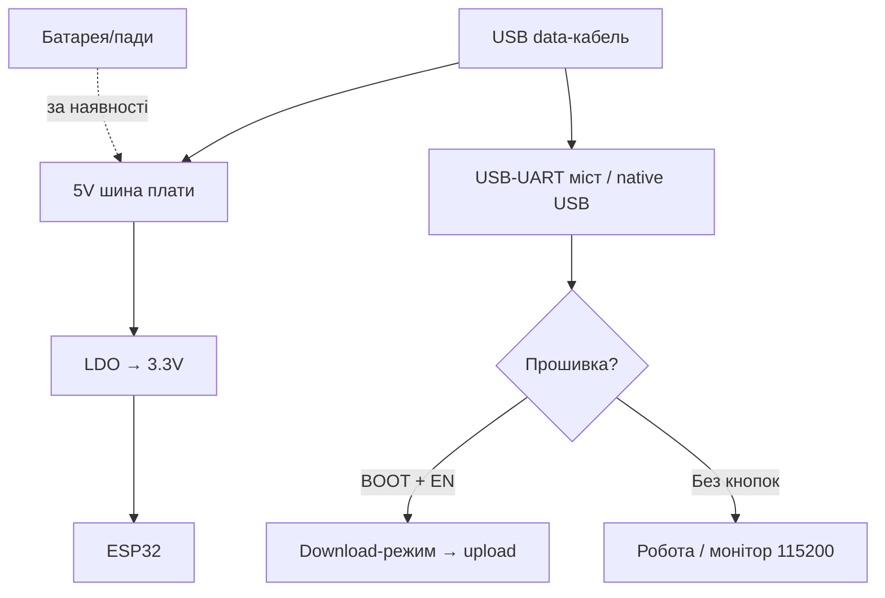

# Retro-Wearable: FabGL / Odroid-GO / T-Watch S3 / T-Deck

> [!tip] Навіщо ретро і носимі
> ESP32 вміє бути «комп'ютером з 80-х» (FabGL: VGA + PS/2-клавіатура + звук!), ігровою консоллю (Odroid-GO: геймпад + емулятори!), годинником (LilyGO T-Watch S3!) і кишеньковим LoRa-терміналом з клавіатурою (T-Deck: BlackBerry-стиль + GPS!). Усі - повноцінні devboard'и, просто з людським інтерфейсом. Загальний огляд - [[00-Start/04-Devkit-plati|DevKit плати]], звук - [[04-Shini/04-I2S|I2S]].
>
> [!warning] Іграшки з апетитом дорослих
> VGA + звук + Wi-Fi = 300-500 мА; емулятори гріють кристал; годинник живе добу, а не місяць. Батарею і радіатор плануйте одразу, а не «потім».

## Призначення

FabGL + плата VGA32 (TTGO VGA32 / Olimex ESP32-SBC-FabGL) - ретро-ПК на ESP32: VGA-вихід (резистивний ЦАП!), PS/2-миша і клавіатура, звуковий движок, GUI з вікнами, ANSI-термінал, емулятори (Altair 8800, VIC-20, IBM PC!). Odroid-GO (HardKernel, 2018, до 10-річчя ODROID) - DIY-геймпад-конструктор: ESP32-WROVER, 2.4" TFT 320×240, динамік, SD, батарея 1200 мА·г (~10 год гри!), 10-пінове розширення. Прошивки-лаунчери (GO-Play, RetroESP32) запускають емулятори прямо з пам'яті. LilyGO T-Watch S3 - відкритий смарт-годинник на ESP32-S3: сенсорний TFT, LoRa-опція, RTC + IMU + батарея в корпусі на зап'ястя. T-Deck - кишеньковий S3-термінал BlackBerry-стилю: 2.8" LCD + фізична клавіатура (I2C!) + трекбол + LoRa SX1262 + GPS (Plus) + мікрофон/динамік + батарея 2000 мА·г. Штатна ніша - Meshtastic-месенджер без телефонів.

| Параметр | FabGL/VGA32 | Odroid-GO | T-Watch S3 | T-Deck / Plus |
| --- | --- | --- | --- | --- |
| Призначення | Ретро-ПК: VGA + PS/2 | Ігрова консоль-конструктор | Годинник-сенсор на зап'ястя | LoRa-термінал з клавіатурою |
| Кристал | ESP32 (класика!) | ESP32-WROVER | ESP32-S3 | ESP32-S3FN16R8 + C3 (клавіатура!) |
| Ввід | PS/2-клавіатура + миша | D-pad + A/B + Menu | Тач-екран | Клавіатура + трекбол |

## Характеристики

| Характеристика | FabGL / VGA32 | Odroid-GO | T-Watch S3 | T-Deck | T-Deck Plus |
| --- | --- | --- | --- | --- | --- |
| Кристал | ESP32-D0WD (S3 НЕ підтримується!) | ESP32-WROVER, 16 МБ Flash, 4 МБ PSRAM | ESP32-S3 | ESP32-S3FN16R8, 16 МБ + 8 МБ | Той же S3 |
| Дисплей | VGA (зовнішній монітор!) + опц. TFT | 2.4" 320×240 TFT, SPI | Сенсорний TFT (круглий/прямокутний за версією) | 2.8" ST7789 320×240, SPI, без тачу! | Той же + GPS MIA-M10Q |
| Ввід | PS/2-клавіатура + миша, GPIO-джойстик | D-pad, A/B, Menu/Volume/Select/Start | Тач + кнопки | Фізична клавіатура (I2C 0x55!) + трекбол | Те саме |
| Звук | ЦАП/Sigma-Delta движок (моно) | Динамік 0.5W 8Ω + підсилювач | Зумер/динамік (за версією) | ES7210 мікрофон + I2S-динамік | Те саме |
| Радіо | Wi-Fi/BT (термінал, OTA) | Wi-Fi/BT 4.2 | Wi-Fi/BLE 5 + LoRa-опція | Wi-Fi/BLE 5 + SX1262 433-915 МГц | Те саме |
| SD | Опційно (емулятори з SD!) | microSD, SPI 20 МГц | TF (за версією) | TF (SPI, CS39) | TF |
| Батарея | Немає (стаціонар!) | 1200 мА·г, ~10 год | Вбудована Li-Po + зарядка | 2000 мА·г | 2000 мА·г + GPS-антенний тракт |
| USB | USB-UART програматора | Micro-USB: заряд 500 мА + UART | USB-C | USB-C | USB-C |
| Кнопки | PS/2 + опц. кнопки | 8+ кнопок геймпада | Бічні + тач | Трекбол-центр = BOOT! + RST | Те саме + вимикач живлення |
| Розмір | Плата + монітор поруч | 121×76 мм (геймпад) | Корпус годинника | 100×68×11 мм | 100×68×11 мм |

> [!warning] FabGL тільки на класичному ESP32!
> Бібліотека написана під таймінги LX6 і Dual-core ESP32; на S2/S3/C3 не працює. Офіційна вимога - пакет ESP32 Arduino ≤2.0.17 (новіші з'їдають RAM, і FabGL не стартує!). Плату беріть саме VGA32/SBC-FabGL, не «будь-яку ESP32».
>
> [!tip] Два мозки T-Deck
> Клавіатурою керує окремий ESP32-C3 (I2C-slave), основний S3 лише читає байти за перериванням INT. Прошивка клавіатури шиється окремо через 6-піновий гребінець (3V3/GND/RST/BOOT/RX/TX) біля RST!

## Особливості розпіновки

FabGL/VGA32: VGA - фіксовані GPIO через резистори (8 кольорів - 3×270Ω; 64 кольори - 6 резисторів!): точний мапінг - у файлі `fabgl GPIOs assignment.txt` репозиторію. PS/2-клавіатура/миша - 2 GPIO на пристрій (Clock+Data, 5V- tolerant через діоди!). Звук - DAC-піни (25/26) або Sigma-Delta на будь-якому. Composite-відео - без деталей (можливо ФНЧ 5 МГц). Решту пінів - під джойстик/SD.

Odroid-GO: дисплей/кнопки/динамік розведені всередині; користувачу - 10-піновий порт: I2C (SDA15/SCL4!), SPI (18/19/23/22), IRQ, 3.3V, VBUS. Кнопки вже на матриці (Menu/Volume/Select/Start/A/B/D-pad) - окремі GPIO не витрачаються. Увага: GPIO15 - strapping з підтяжкою, при boot не тягнути вниз!

T-Watch S3: усередині корпусу - дисплей (SPI), тач, RTC, IMU, LoRa-модуль (у LoRa-версії!), або QWIIC/гребінець назовні (за версією). Вільних пінів мало - це кінцевий пристрій, а не макетка. Точний мапінг - LilyGO wiki, розділ T-Watch S3 (версії S3 і S3 Plus різняться!).

T-Deck (повний мапінг з вікі): SPI-шина спільна - TFT CS12, LoRa CS9, SD CS39 (перед транзакцією всі зайві CS - HIGH!). I2C: SDA18/SCL8 (клавіатура 0x55 + INT46). Трекбол: 13/22/15/?? (квадратура) + центр GPIO0 (BOOT!). I2S-мікрофон ES7210: MCLK48/LRCK21/SCK47/DIN14. GPS (Plus): TX43/RX44. Підсвітка TFT: GPIO42. Живлення-периферія: GPIO10 (POWERON - HIGH при роботі від батареї!). АЦП батареї: GPIO4. Деталі strapping - [[03-GPIO/02-Strapping-pini|Strapping]].

## Особливості живлення

| Джерело | VGA32 | Odroid-GO | T-Watch S3 | T-Deck |
| --- | --- | --- | --- | --- |
| Зовнішнє 5V | 5V/1A+ блок (VGA-монітор - свій!) | Micro-USB заряд 500 мА | USB-C 5V | USB-C 5V |
| Батарея | Немає (стаціонарний ПК!) | 1200 мА·г, ~10 год гри | Вбудована + зарядка | 2000 мА·г |
| Споживання | 300-500 мА (VGA + звук + Wi-Fi) | ~100-200 мА гра, сон - мкА | Десятки мА актив, сон - RTC-таймер | ~200+ мА (екран+LoRa TX пік!) |
| Сон | Немає сенсу (ПК!) | Глибокий сон з RTC/кнопкою | Обов'язковий (годинник!) | Light-sleep між прийомами |
| LDO/PMU | LDO плати + зовнішній БП монітора | Вбудована зарядка | PMU + RTC-будильник | POWERON-пін + АЦП батареї |

> [!warning] LoRa-передача + екран = пік струму
> SX1262 на +22 дБм бере ~120 мА сам; разом з підсвіткою T-Deck просить пів ампера піком. Слабка батарея/тонкі дроти = ребути саме в момент TX. Лікується свіжою батареєю і конденсатором 470+ мкФ по 5V.
>
> [!tip] Годинник живе сном
> T-Watch S3 без налаштованого deep-sleep (RTC-wake + вимкнений дисплей + BLE-advertising рідко) живе добу. З правильним сном - тижні як годинник + крокомір. Патерни сну - [[07-Timeri-Son/03-Sleep-ULP|Sleep/ULP]].

## Особливості USB-UART

VGA32: класичний міст + BOOT/RESET (старі плати) або native-завантаження. FabGL-приклади шиються як звичайний Arduino-скетч; термінал спілкується поверх Serial. Odroid-GO: Micro-USB (заряд + UART), прошивка esptool/Arduino, лаунчери - .bin через фабричну утиліту або SD! T-Watch S3: USB-C native S3 (USB CDC On Boot Enabled), BOOT при першій прошивці. T-Deck: USB-C native; якщо не шиється - трекбол-центр (BOOT) + вставити USB + шити + RST. Meshtastic-вебфлешер уміє «1200bps reset» для авто-входу в download. Деталі - [[13-Moduli-zhivlennya-rivniv/05-USB-UART-AutoReset|USB-UART]].

## Кнопки

FabGL: кнопок на платі мінімум - ввід іде з PS/2-клавіатури і миші (повноцінний GUI з вікнами!). Опційно - джойстик на GPIO. Odroid-GO: повний геймпад - D-pad, A/B, Menu, Volume +/−, Select, Start: емулятори мапляться один в один. T-Watch S3: бічні кнопки (живлення/користувацька) + тач-жести. T-Deck: 40+ клавіш BlackBerry-стилю з підсвіткою (Alt+B!), трекбол-навігація, центр трекбола = BOOT (утримувати при вмиканні для прошивки!), окрема RST. У Meshtastic: Alt+C+M - нотифікації, Alt+C+Q - вихід (Base UI!).

## Для чого підходить

- FabGL/VGA32: ретро-термінал для сервера (ANSI/VT!), навчальний «ПК» для дітей (BASIC-емулятори!), табло з VGA-монітором з барахолки, PS/2-клавіатура як ввід для ESP32-проєкту.
- Odroid-GO: перша консоль для дитини (збери сам +екран!), емулятори NES/GameBoy з SD, Arduino-навчання з екраном і кнопками «з коробки».
- T-Watch S3: годинник-трекер (кроки/пульс - за датчиками версії), LoRa-годинник для походів (пеленг/маяк!), наручний MQTT-пульт розумного дому.
- T-Deck: Meshtastic-месенджер (зв'язок без мереж!), польовий LoRa-термінал з GPS-треком, кишенькова консоль для ESP32-діагностики.
- НЕ підходить: FabGL - для батареї (стаціонар!) і для S3 (не працює!); Odroid-GO - як «серйозний» геймінг (240 МГц, ретро до PS1 максимум); годинник - для місяців автономності з увімкненим екраном; T-Deck - для тихого носіння (клавіатура клацає, екран світить!).

## Прошивка

FabGL: Arduino IDE, пакет ESP32 ≤2.0.17 (!), плата `ESP32 Dev Module`, приклади з меню File → Examples → FabGL (VGA, PS2, Sound, GUI, Emulators). Перший тест - `VGA_TextTerminal`: PS/2-клавіатура друкує на VGA-моніторі.

```ini
; PlatformIO — Odroid-GO (класичний ESP32!)
[env:odroid-go]
platform = espressif32
board = odroid_esp32
framework = arduino
monitor_speed = 115200

; PlatformIO — LilyGO T-Watch S3
[env:t-watch-s3]
platform = espressif32
board = esp32-s3-devkitc-1
framework = arduino
monitor_speed = 115200
board_build.psram_type = opi
lib_deps = lovyan03/LovyanGFX@^1.1.0

; PlatformIO — LilyGO T-Deck (S3 + LoRa + клавіатура)
[env:t-deck]
platform = espressif32
board = esp32-s3-devkitc-1
framework = arduino
monitor_speed = 115200
board_upload.flash_size = 16MB
board_build.psram_type = opi
lib_deps =
  jgromes/RadioLib@^6.6.0
  moononournation/Arduino_GFX@^1.1.0
```

T-Deck + Meshtastic: найпростіше - вебфлешер (вибрати `T-Deck`, антена LoRa ОБОВ'ЯЗКОВО підключена!), ручний download - вимикач OFF → тримати трекбол → вимикач ON → відпустити за 2-3 с (екран чорний = режим прошивки). T-Watch S3: Arduino `ESP32S3 Dev Module` + USB CDC On Boot, або готові вотчфейси LilyGO з GitHub. Середовища - [[09-Proshivka/02-Arduino-PlatformIO|Arduino/PlatformIO]].

## Типові помилки

| Симптом | Причина | Рішення |
| --- | --- | --- |
| FabGL: чорний VGA | Не ті GPIO / пакет ESP32 >2.0.17 | Мапінг з `fabgl GPIOs assignment.txt`, пакет ≤2.0.17 |
| FabGL: кольори не ті (8 замість 64) | 3 резистори замість 6 | Допаяти другий ряд ЦАП-резисторів |
| PS/2-клавіатура мовчить | Clock/Data переплутані / 3.3V замість 5V | Перевірити пари, PS/2 живити 5V |
| Odroid-GO не бачить ROMи | Не та FAT/SD-швидкість | SD ≤32 ГБ, FAT32, SPI-режим |
| T-Watch живе добу | Дисплей + BLE завжди увімкнені | Deep-sleep + RTC-wake, гасити BL |
| T-Deck не шиється | Не в download-режимі | Трекбол-центр + вставити USB + RST після |
| T-Deck: LoRa TX валить плату | Пік струму, слабка батарея | Заряджена батарея, конденсатор по 5V |
| Клавіатура T-Deck мовчить | C3-клавіатура не прошита / не той адрес | Перепрошити C3 через гребінець, I2C-сканер (0x55) |
| Мікрофон глушить BOOT | GPIO0 зайнятий ES7210 при записі | Не тиснути трекбол-центр під час запису |
| Meshtastic без антени | TX без навантаження палить SX1262! | Спочатку антена, потім живлення |
| GPS Plus не ловить | Антена всередині корпусу / холодний старт | Вікно/вулиця, 5-15 хв першого фікса |

## Схема живлення та прошивки

> [!example] Фото/схема: ![[assets/img/devboard-retro-wearable-scheme.png|600]]

```text
FabGL/VGA32: [Блок 5V] ─► ESP32 ─► VGA-резистори ─► монітор (8/64 кольори!).
  PS/2: Clock+Data на 2 GPIO (5V живлення клавіатури!). Звук: DAC25/26.
  ТІЛЬКИ класичний ESP32 + пакет ≤2.0.17! S3 не підтримується!

Odroid-GO: [Micro-USB 500мА] ─► зарядка ─► Li-Po 1200 ─► ESP32-WROVER.
  2.4" TFT-SPI + динамік 0.5W + SD (FAT32!) + 10-пін розширення (I2C/SPI).
  Лаунчери (GO-Play/RetroESP32) — .bin з SD або esptool.

T-Watch S3: [USB-C] ─► S3 ─► тач-TFT + RTC/IMU/LoRa(опц.) ─► зап'ястя.
  Живе сном: RTC-wake + BL-OFF, інакше доба, а не тижні!

T-Deck: [USB-C / LiPo 2000] ─► S3 ─► TFT-SPI(CS12) + SX1262(CS9) + SD(CS39).
  CS-дісципліна: зайві CS HIGH перед кожною транзакцією!
  Клавіатура: окремий C3 (I2C 0x55, INT46). Трекбол-центр = BOOT.
  GPIO10 HIGH при живленні від батареї! Meshtastic: спочатку АНТЕНА!
```

## Офіційні джерела

- FabGL - GitHub fdivitto (VGA/PS2/звук/GUI/емулятори, вимога ESP32 lib ≤2.0.17): <https://github.com/fdivitto/FabGL>
- HardKernel - ODROID-GO GitHub (специфікації, схеми, приклади, лаунчери GO-Play/RetroESP32): <https://github.com/hardkernel/ODROID-GO>
- LilyGO - T-Watch S3 (відкритий годинник, LoRa + ESP32-S3, характеристики): <https://lilygo.cc/products/t-watch-s3?variant=43328511865675>
- LilyGO Wiki - T-Deck (S3FN16R8, мапінг пінів, SPI CS-дісципліна, клавіатура, GPS, батарея): <https://wiki.lilygo.cc/products/t-deck-series/t-deck>
- FabGL API-документація (fabglib.org, класи VGAController/PS2Controller/SoundEngine/Terminal): <http://www.fabglib.org>
- FabGL GPIOs assignment (точний мапінг VGA/PS2/SD/UART для VGA/Composite/SPI/I2C-плат): <https://github.com/fdivitto/FabGL/blob/master/fabgl%20GPIOs%20assignment.txt>
- Olimex ESP32-SBC-FabGL (відкрита плата під FabGL, живлення/UEXT/SD): <https://www.olimex.com/Products/Retro-Computers/ESP32-SBC-FabGL/open-source-hardware>
- LilyGO Wiki - T-Watch S3 (S3, 1.54" 240×240, BMA423, AXP2101, споживання сну): <https://wiki.lilygo.cc/products/t-watch-series/t-watch-s3/>
- LilyGO T-Deck GitHub (приклади Keyboard/Microphone/GPS/UnitTest, TFT_eSPI init-коміт 2024-07-26): <https://github.com/Xinyuan-LilyGO/T-Deck>
- LilyGO TTGO_TWatch_Library гілка t-watch-s3 (вотчфейси, сенсори, LoRa-приклади): <https://github.com/Xinyuan-LilyGO/TTGO_TWatch_Library/tree/t-watch-s3>
- Meshtastic LoRa-регіони і duty-cycle (EU_868 10%, пресети LONG_FAST тощо): <https://meshtastic.org/docs/configuration/radio/lora/>
- Meshtastic вебфлешер (вибір T-Deck, Erase+Install): <https://flasher.meshtastic.org>

## FabGL/VGA32 - детально

FabGL (автор Fabrizio Di Vittorio, GPLv3) - це одночасно відеоконтролер, PS/2-контролер, графічна бібліотека, звуковий движок, GUI з вікнами, ігровий рушій і ANSI/VT-термінал. Фішка в тому, що VGA генерується програмно двома ядрами LX6 класичного ESP32: одне ядро годує DMA/I2S-конвеєр пікселями строго в таймінг (pixel-clock ~25 МГц для 640×480@60), друге виконує скетч. Тому будь-який Wi-Fi-сплеск, флеш-операція або «важке» переривання дає тремтіння картинки - це нормально для bit-bang VGA.

> [!warning] Тільки класичний ESP32 + Arduino core ≤2.0.17
> Офіційне попередження з README FabGL: новіші пакети Espressif залишають замало вільної RAM, і проєкт розміром з FabGL вже не стартує. S2/S3/C3 не підтримуються взагалі (інші таймери, інший DMA, інший кеш). Якщо бачите чорний екран після оновлення платформи - у 99% винен core 2.0.18+/3.x, а не плата. Як відкотити: Arduino IDE → Boards Manager → esp32 by Espressif → вибрати 2.0.17; PlatformIO - зафіксувати `platform = espressif32@6.4.0` (це і є гілка під core 2.0.x) і не робити `pio update` наосліп. Середовища - [[09-Proshivka/02-Arduino-PlatformIO|Arduino/PlatformIO]].

Плати: TTGO VGA32 v1.0/v1.1/v1.4 (найпоширеніша, PS/2-роз'єми на борту, SD-слот, аудіоджек, кнопки), Olimex ESP32-SBC-FabGL (відкрите залізо, UEXT, LiPo-зарядка, надійніший VGA-тракт, рекомендована автором для донатів), саморобка на ESP32-WROOM + макетка (працює, але VGA «милить» через довгі дроти). ESP32 повинен бути ревізії 1 або новішої.

### VGA-розпіновка і резистивний ЦАП

Точний мапінг VGA-плат з файлу `fabgl GPIOs assignment.txt`:

| Сигнал VGA | GPIO | Призначення |
| --- | --- | --- |
| HSync | 23 | Рядкова синхронізація, прямо в DB15 пін 13 |
| VSync | 15 | Кадрова синхронізація, DB15 пін 14 (увага: strapping! при boot не тягнути вниз) |
| R0 (молодший біт червоного) | 21 | Через резистор в DB15 пін 1 |
| R1 (старший біт червоного) | 22 | Через резистор в DB15 пін 1 |
| G0 | 18 | Через резистор в DB15 пін 2 |
| G1 | 19 | Через резистор в DB15 пін 2 |
| B0 | 4 | Через резистор в DB15 пін 3 |
| B1 | 5 | Через резистор в DB15 пін 3 |
| GND | GND | DB15 піни 5/6/7/8/10 + оплетка |

Резистори - це і є ЦАП (R-2R спрощений):

- 8 кольорів: по одному резистору 270 Ом на канал (R1/G1/B1), молодші біти не розведені. Дешево, для терміналу вистачає.
- 64 кольори (стандарт FabGL): 6 резисторів - старші біти через ~270 Ом, молодші через ~540 Ом (на практиці 510-560 Ом або 2×270 Ом послідовно). Точність 5% достатня, але обидва канали одного кольору беріть з однієї стрічки.
- Земля VGA - товстим дротом, інакше «тіні» праворуч від вертикальних ліній.
- Довжина VGA-хвоста до 30 см без проблем; метровий «подовжувач з барахолки» дає розмиття і дзвін - ставте плату ближче до монітора.
- Роздільності: 640×480@60 (текст 80×30 чіткий), 320×200 (подвійна буферизація + спрайти без мерехтіння!), 512×384 компроміс. Більше роздільність = менше RAM під програму.
- Composite-варіант (CVBS пін 25, звук 23) зовнішніх деталей не вимагає, хіба ФНЧ ~5 МГц; якість гірша, але працює зі старими телевізорами через RCA.

Страппінг-нагадування: VSync на GPIO15 - це strapping-пін з підтяжкою. Монітор під час reset не повинен тягнути його вниз, інакше ESP32 піде в не той boot-режим. Деталі - [[03-GPIO/02-Strapping-pini|Strapping]].

### PS/2-клавіатура і миша

| Пристрій | DATA | CLOCK | Живлення |
| --- | --- | --- | --- |
| Клавіатура | GPIO32 | GPIO33 | 5V з плати! |
| Миша | GPIO27 | GPIO26 | 5V з плати! |

PS/2 - open-collector шина: обидві лінії підтягнуті до 5V (у клавіатурі/платі), спілкування двонапрямлене. Тому:

- Живити PS/2-пристрої від 5V, не від 3.3V! Від 3.3V половина клавіатур «мовчить», хоча світлодіоди блимають.
- Clock/Data не міняти місцями - типова помилка дає «мовчить повністю», без часткових симптомів.
- USB-клавіатура через пасивний перехідник НЕ запрацює - потрібна або native PS/2-клавіатура, або активний USB→PS/2 конвертер. Миші - аналогічно.
- Довжина PS/2-кабелю до 2 м нормальна; скрутки Clock+Data разом без екрану на 3+ м дають пропуски натискань.
- FabGL вміє сканкоди, N-key rollover (в межах PS/2-протоколу), мишу з колесом для GUI-вікон.

### Звук (DAC / Sigma-Delta / I2S)

Штатний вивід FabGL - GPIO25 (AUD на VGA-платах; на Composite-збірках звук переїжджає на GPIO23, бо 25 зайнятий відео!). Движок: до 8 каналів змішуються в моно - синус/меандр/пилкоподібна/трикутник/шум/семпли з RAM. Вихід можливий трьома способами:

- Внутрішній DAC GPIO25/26 (8 біт, найпростіше - прямо в підсилювач/навушники через конденсатор 10 мкФ).
- Sigma-Delta на будь-якому GPIO (1-біт ШІМ + RC-фільтр 10 кОм + 100 нФ, якість вища за DAC на тихих звуках).
- Зовнішній I2S-підсилювач (наприклад Max98357A) - найгучніший і найчистіший варіант; FabGL віддає потік, підсилювач робить аналог. Звук - [[04-Shini/04-I2S|I2S]].

Гучність плануйте з запасом: моно-динамік 0.5W на столі поруч з VGA-монітором гуде від імпульсного БП - рознесіть землі зіркою.

### SD-карта

HSPI-шина: MOSI 17, MISO 16, CLK 14, CS 13. Винятки: TTGO/WROVER - MOSI 12, MISO 2 або 35 (залежить від ревізії!). UART2 (RX34/TX2) на TTGO/WROVER несумісний з активною SD - TX2 зайнятий картою. Карта - FAT32, ≤32 ГБ, клас 10 без екзотики. На SD живуть образи дисків для Altair/CP/M, ROMи VIC-20, звукові семпли, шрифти. Якщо емулятор «не бачить диск» - у 90% винні exFAT або карта 64+ ГБ.

### Що запускати: від терміналу до IBM PC

- `VGA_TextTerminal` - перший тест: PS/2-друк на VGA. Якщо працює - живлення, VGA і PS/2 цілі.
- `NetworkTerminal` / `LoopbackTerminal` - ANSI/VT-термінал для Linux-сервера поверх Serial/Wi-Fi; escape-послідовності малюють графіку і пищать звуком (демо на YouTube автора).
- `Modeline Studio` - підбір VGA-таймінгів під примхливий монітор.
- `GUI` - вікна/кнопки/чекбокси/комбобокси/листбокси з мишею.
- `SpaceInvaders` / `CollisionDetection` / `DoubleBuffering` - ігровий рушій, спрайти без обмеження кількості (але великі спрайти просаджують FPS).
- Емуялятори: Altair 8800 (CP/M текстові ігри!), VIC-20, IBM PC (так, DOS на ESP32!), Multitasking CP/M Plus. Образи - на SD.
- Шрифти: вбудовані фіксовані і пропорційні, кілька розмірів; кирилиця - кастомним шрифтом з tools/.

### Код ініціалізації FabGL (мінімум)

```cpp
#include "fabgl.h"

fabgl::VGAController DisplayController;
fabgl::PS2Controller PS2Controller;
fabgl::SoundEngine   SoundEngine;
fabgl::Terminal      Terminal;

void setup() {
  // PS/2: клавіатура на 32/33, миша на 27/26 (див. таблицю вище)
  PS2Controller.begin(PS2Preset::KeyboardPort0_MousePort1, KbdMode::GenerateVirtualKeys);

  // VGA 640x480, 64 кольори (6 резисторів!), подвійний буфер на 320x200
  DisplayController.begin();
  DisplayController.setResolution(VGA_640x480_60Hz);

  // Термінал поверх VGA + PS/2
  Terminal.begin(&DisplayController);
  Terminal.connectLocally();  // локальна клавіатура/екран, без UART
  Terminal.clear();
  Terminal.write("FabGL OK: VGA + PS/2 + Sound\r\n");

  // Звук: DAC GPIO25, 8 каналів у моно
  SoundEngine.begin();
  SoundEngine.playTone(440, 200);  // A4, 200 мс — перевірка динаміка
}

void loop() {
  Terminal.service();  // обов'язково крутити в loop!
}
```

Після цього відкривайте приклади File → Examples → FabGL і збирайте поверх цього каркаса. Не забудьте плату `ESP32 Dev Module`, PSRAM Enabled, поділ 4MB+.

## Odroid-GO - детально

DIY-конструктор від HardKernel до 10-річчя ODROID (2018): збираєте геймпад самі, бачите «нутрощі» консолі - тому це навчальний інструмент, а не лише іграшка. Серце - кастомний ESP32-WROVER: 16 МБ Flash + 4 МБ PSRAM, CPU 80-240 МГц (регулюється - на 80 МГц емулятори гальмують, на 240 МГц гріється і їсть батарею).

### Органи керування - таблицею

Кнопки розведені всередині, GPIO не витрачаються користувачем. Точний мапінг дивіться у файлі `src/odroid_go.h` вашої версії бібліотеки і в `Documents/` репозиторію (ревізії плати відрізняються!). Типова розкладка Arduino-бібліотеки ODROID-GO (звіряйтеся зі схемою перед паянням до кнопок!):

| Орган | Типово GPIO | Як читати / примітка |
| --- | --- | --- |
| D-pad Вгору / Вниз / Вліво / Вправо | 12 / 15 / 14 / 2 (цифрові, активний LOW) | `GO.JOY_Y.isAxisPressed()` або `digitalRead`; одночасні діагоналі підтримуються |
| A (праворуч) | 32 | Основна дія в іграх/меню |
| B (ліворуч) | 33 | Скасування/альтернативна дія |
| Menu | 13 | Виклик лаунчера/вихід з гри (утримувати!) |
| Select | 27 | Вибір пункту/сервісна кнопка |
| Start | 39 (тільки вхід, без pullup!) | Пауза/старт; GPIO39 - input-only, зовнішня підтяжка обов'язкова |
| Volume + / Volume − | Апаратні, на підсилювач | Міняють гучність динаміка незалежно від коду |
| Динамік Mute / Enable | 25 (enable підсилювача) | LOW - тихо, HIGH - звук; інакше шипіння в паузі |

> [!warning] GPIO15 і GPIO2 - strapping!
> D-pad може тягнути їх при ввімкненні. Не тисніть кнопки в момент скидання/прошивки, інакше плата піде в download або «мовчазний» boot. Деталі - [[03-GPIO/02-Strapping-pini|Strapping]].

Комбінації лаунчерів: Menu+Volume - яскравість, Menu+Start - вихід в меню, утримання Menu при ввімкненні - recovery лаунчера.

### Дисплей ILI9340 2.4" 320×240

SPI-інтерфейс, шина спільна з SD (MOSI 23 / MISO 19 / SCK 18; CS дисплея 5, DC 21, підсвітка 14 з ШІМ!). Роздільність 320×240 - золота середина: вистачає для NES/GameBoy-емуляції (масштаб 1:1 або 4:3 з полями), і FPS тримається 30-60 на 240 МГц. Яскравість - головний споживач (див. батареї нижче): половинна підсвітка додає +1-2 год гри. Шлейф дисплея крихкий - при розборі не гнути під 90°.

SPI SD-слота - до 20 МГц, карти FAT32 ≤32 ГБ. Швидкість важлива: повільна карта = фризи при підвантаженні ROMів.

### LiPo і зарядка

Батарея Li-Polymer 3.7V 1200 мА·г. Заряд - Micro-USB 5V, струм ~500 мА (повний цикл ~2.5-3 год). Заявлені «до 10 год гри» - це середня яскравість, тихий звук, Wi-Fi вимкнений, CPU 160 МГц, гра рівня GameBoy. Реальні сценарії: NES на повній яскравості + Wi-Fi - 4-5 год; яскравість 50% + звук тихо - 7-8 год; deep-sleep з RTC - місяці (мкА). Зберігання - напівзаряджена (~3.8V), раз на 3 місяці підзарядити; здуту батарею не протикати - утилізувати.

### Лаунчери і прошивки

Лаунчер - прошивка-«трамплін», яка запускає .bin/емулятори прямо з RAM/SD без перепрошивки через USB щоразу.

- Stock/заводська - тест кнопок/екрана/звуку/SD.
- GO-Play (OtherCrashOverride) - мінімалістичне меню, швидкий запуск, NES/GB/SMS.
- RetroESP32 (retro-esp32) - «важка» збірка з менеджером ROMів, обкладинками, збереженнями.
- MicroPython (loboris-порт) - дисплей/кнопки як модулі, зручно для навчання: `import odroid_go` і малюєте.
- Arduino «з нуля» - ваша гра як звичайний скетч (див. нижче).

Як ставити: варіант 1 - .bin через фабричну утиліту/esptool (`esptool.py write_flash 0x10000 go-play.bin`); варіант 2 - скопіювати `firmware.bin` + папку `roms/` (підпапки `nes/`, `gb/`, `sms/`) в корінь FAT32-SD і перезавантажитися з утриманим Menu. ROMи - тільки власні дампи!

### Своя гра покроково (7 кроків)

1. Встановіть бібліотеку `odroid-go` (Arduino Library Manager або `lib_deps = odroid-go` в PlatformIO) і виберіть плату `odroid_esp32`.
2. Намалюйте спрайт гравця 16×16 (будь-який RGB565-масив) і фон - тримайте все в PSRAM (`ps_malloc`), інакше не вистачить RAM.
3. Опитуйте кнопки з дебаунсом 20 мс; D-pad - рух, A - стрибок/вогонь, Start - пауза.
4. Ігровий цикл: `update()` (фізика) + `draw()` (тільки змінені спрайти!) + `delay(33)` ≈ 30 FPS. Повний `fillScreen` щокадру - слайдшоу.
5. Звук: `GO.Speaker.tone(880, 100)` на події; фонову музику - маленьким трекером, не WAV з SD (гальма шини!).
6. Рекорди - на SD (`/highscore.txt`), FAT32, файл закривати після запису.
7. Меню сну: утримання Menu 2 с → `esp_deep_sleep_start()` з wake по Menu; прокидання - повний реініт дисплея.

```cpp
#include <odroid_go.h>

void setup() {
  GO.begin();  // дисплей + кнопки + динамік + SD + батарея
  GO.lcd.setBrightness(180);          // 0-255; 180 ≈ +1 год автономності
  GO.lcd.fillScreen(BLACK);
  GO.lcd.setCursor(10, 10);
  GO.lcd.println("My Game: A=jump START=pause");
}

void loop() {
  GO.update();  // опитування кнопок + звук, обов'язково!
  if (GO.JOY_X.isAxisPressed() || GO.JOY_Y.isAxisPressed()) {
    // рух гравця...
  }
  if (GO.BtnA.wasPressed()) {
    GO.Speaker.tone(880, 100);
  }
  if (GO.BtnStart.wasPressed()) {
    GO.lcd.fillScreen(BLACK);  // пауза
  }
  delay(33);
}
```

10-пінове розширення (I2C SDA15/SCL4, SPI 18/19/23/CS22, IRQ, 3.3V, VBUS) - сюди чіпляються датчики для «ігор з фізикою» (акселерометр на I2C!) без паяння до кнопок.

## T-Watch S3 - детально

Відкритий смарт-годинник на ESP32-S3 (dual LX7 240 МГц, 16 МБ Flash, 8 МБ OPI PSRAM, Wi-Fi + BLE 5). Корпус 51.5×42×20 мм без ремінця. Версії: базова S3, S3 Plus (інший набір датчиків/LoRa), Ultra (більший екран/батарея) - мапінг пінів різниться, дивіться саме вашу схему з `TTGO_TWatch_Library` гілки `t-watch-s3`!

### Дисплей і тач

1.54" LCD 240×240, SPI. Тач - ємнісний, I2C (контролер типу FT6336/CST816 залежно від партії - адресу уточнюйте I2C-сканером!). Жести: тап, свайп вгору/вниз (шторка/нотифікації), свайп вліво/вправо (вотчфейси), довгий тап (налаштування). Важливий нюанс з вікі: пін reset тачу НЕ підключений - якщо покласти тач-контролер спати, розбудити його тапом не вийде (тільки кнопкою/таймером!). Тому «пробудження дотиком» працює лише поки контролер не спить - а це 1.08 мА в deep-sleep (див. таблицю сну). LVGL-вотчфейси з `TTGO_TWatch_Library` вже враховують це (tickless + partial refresh).

Підсвітка - ШІМ; яскравість 100% в приміщенні не потрібна (різниця між 255 і 120 - години автономності).

### RTC: а де PCF8563?

Часте питання: «де PCF8563?». Відповідь: в T-Watch S3 окремого PCF8563 НЕМА - він був у старих T-Watch 2020/2021. У S3 час тримає вбудований RTC ESP32-S3 + PMU AXP2101 (backup-домен). Наслідки: без синхронізації дрейф секунди-хвилини на добу (залежить від температури зап'ястя!), після повного розряду час злітає в 1970-й. Лікується синхронізацією при кожному Wi-Fi/BLE-конекті (NTP або телефон) і періодичним RTC-wake. Будильник годинника - це `esp_sleep_enable_timer_wakeup()`, а не окрема мікросхема. Патерни - [[07-Timeri-Son/03-Sleep-ULP|Sleep/ULP]].

### Акселерометр BMA423 (кроки і сон!)

3-осьовий акселерометр Bosch BMA423 на I2C - серце фітнесу і енергозбереження:

- Крокомір - апаратний лічильник кроків всередині BMA423 (не треба рахувати на CPU!). Читаєте регістр раз на хвилину після wake.
- Tilt-wake - підняття зап'ястя генерує переривання → будить S3 → вмикає екран на 5 с. Без цього довелося б тикати кнопку.
- Double-tap - подвійний стук по корпусу як кнопка (зручно в рукавичках!).
- Activity/inactivity - розрізняє «йду» vs «сиджу» → різна частота опитування пульсу/GPS.
- Сон: BMA423 вміє спати сам (мкА) і будити S3 перериванням - тому годинник тижнями рахує кроки, а не добу.

Типова помилка - не той I2C-адрес/не ініціалізована бібліотека `SensorsLib` → «0 кроків завжди». Лікується прикладом з репозиторію і I2C-сканером.

### Звук, вібро, LoRa-опція

- Аудіовихід - Max98357A (I2S-підсилювач) + динамік; вхід - PDM-мікрофон. Голосові нотатки/будильник голосом - реально.
- Вібро - DRV2605 (I2C) з ефектами (клік/сурма/ритм), тихіше за мотор, але точніше.
- LoRa-версії: SX1262 (Sub-GHz 433-923 МГц, далекобійна) або SX1280 (2.4 ГГц, швидша, коротша). Вибирайте під регіон: в Україні - 868 МГц варіант! Антена - в ремінці/корпусі, дальність на вулиці - кілометри, в будівлі - поверхи.

### Батарея і deep-sleep годинника

PMU - AXP2101 (заряд/розряд/захист/канали). Вхід MicroUSB 3.9-6V, струм заряду програмований 0-1024 мА, але рекомендовано <130 мА - інакше батарея 470 мА·г 3.8V деградує за місяці! Кнопки: POWER (2 с - ввімкнути, 6 с - вимкнути) + вбудована BOOT (прошивка: тримати BOOT, ткнути RST, відпустити RST, шити). Якщо не користуєтеся тижнями - фізичний вимикач батареї в OFF, інакше саморозряд + PMU з'їдять її в нуль.

Офіційна таблиця споживання (вікі T-Watch S3, заміри LilyGO, реальність залежить від прошивки!):

| Режим | Джерело пробудження | Струм |
| --- | --- | --- |
| Light-sleep | Кнопки Power+Boot + тач | 2.38 мА |
| Deep-sleep | Кнопки (backup ON) | 530 мкА |
| Deep-sleep | Кнопки (backup OFF) | 460 мкА |
| Deep-sleep | Тач-панель (не спить!) | 1.08 мА |
| Deep-sleep | Таймер (backup ON) | 510 мкА |
| Deep-sleep | Таймер (backup OFF) | 460 мкА |
| Power OFF | Тільки backup | 50 мкА |

Що це означає: з увімкненим екраном + BLE - доба; light-sleep з тачем - ~8 діб (470/2.38≈197 год); deep-sleep з таймером раз на хвилину - ~40 діб (470/0.46≈1020 год) як «тупий» годинник + крокомір. Рецепт довгожителя: BL OFF, CPU 80 МГц, BLE-advertising раз на 1-2 с, LVGL tickless, BMA-wake замість опитування, екран - тільки по tilt/tap на 5 с.

```cpp
// Годинник-довгожитель: спати, прокидатися раз на хвилину або по BMA423
#include <esp_sleep.h>

void goToSleep() {
  // дисплей спати, підсвітку в нуль — окремими викликами вашої lib
  // display.sleep(); setBrightness(0);
  esp_sleep_enable_timer_wakeup(60ULL * 1000000ULL);  // раз на хвилину
  esp_sleep_enable_ext0_wakeup((gpio_num_t)38 /*BMA_INT — звірте зі схемою!*/, 1);
  esp_deep_sleep_start();
}
```

### Ремінці і герметичність - застереження

- Ремінець стандартний 22 мм (швидкознімні штифти) - міняється за хвилину, силікон для спорту, шкіра/метал для міста.
- Корпус НЕ герметичний! Немає IPX7/IP68 - це «бризкозахищений» у кращому разі. Плавати, душ, сауна - ЗАБОРОНЕНО: мембрани кнопок і MicroUSB пропускають воду, конденсат вбиває дисплей за дні.
- Піт - теж електроліт: після тренування протерти насухо, контакти зарядки почистити спиртом.
- Зарядка вологого годинника = електрокорозія USB за тижні. Спочатку висушити, потім в розетку.
- Мороз: LiPo на -10°C втрачає половину ємності тимчасово - взимку носити під рукавом.

## T-Deck - детально

Кишеньковий S3-термінал BlackBerry-стилю: 2.8" ST7789 320×240 (SPI, БЕЗ тачу! навігація - трекбол) + фізична QWERTY-клавіатура з підсвіткою + трекбол + LoRa SX1262 + GPS (Plus) + мікрофон/динамік + батарея 2000 мА·г + TF-слот. Розмір 100×68×11 мм - влазить у нагрудну кишеню. Штатна ніша - Meshtastic-месенджер без телефонів і мереж.

### Клавіатура: який контролер?

Окремий ESP32-C3 - I2C-slave за адресою 0x55, переривання INT на GPIO46 основного S3. S3 лише читає готові байти (`Wire.requestFrom(0x55, 1)` по спаду INT). Плюси: клавіатура не гальмує LoRa/GPS, працює навіть коли S3 спить (будить його!). Прошивка C3 - ОКРЕМА (`Keyboard_ESP32C3`), шиється через 6-піновий гребінець біля RST (зверху вниз: 3V3/GND/RST/BOOT/RX/TX - звірте з шовкографією вашої ревізії! потрібен USB-TTL без авторесету: перед ввімкненням замкнути BOOT+GND, після прошивки розімкнути). Читання з S3 - приклад `Keyboard_T_Deck_Master`. Якщо клавіатура мовчить - перше: I2C-сканер, чи видно 0x55? Немає - перепрошити C3; є, але сміття - не той baud/конфлікт INT.

Трекбол: 4 квадратурні виходи (GPIO3/2/15/1 - рух/напрям) + центр = GPIO0 = BOOT! Утримання центру при вмиканні = download-режим. Увага: якщо увімкнений мікрофон ES7210, центр трекбола недоступний (GPIO0 зайнятий аудіо-трактом під час запису - не тисніть його в цей момент!).

### LoRa + GPS + дисплей разом: конфлікти шин SPI

Уся трійця сидить на ОДНІЙ SPI-шині (SCK 40 / MOSI 41 / MISO 38), вибір - окремими CS: TFT CS12, LoRa CS9, SD CS39. Правило з вікі: перед КОЖНОЮ транзакцією всі зайві CS - в HIGH! Інакше LoRa-прийом «малює сміття» на екрані, а SD-запис вішає LoRa. Додаткові сигнали LoRa: BUSY 13, RST 17, DIO1/IRQ 45. Підсвітка TFT - GPIO42, DC - GPIO11. I2C-шина окрема: SDA18/SCL8 (клавіатура + INT46 + сенсори). GPS (тільки Plus, MIA-M10Q): TX43/RX44, антена в корпусі - перший фікс 5-15 хв на вулиці/біля вікна, в залізобетоні не чекайте. Grove-роз'єм на Plus відданий під GPS - як універсальний GPIO він НЕ працює!

```cpp
// CS-дисципліна T-Deck — перед кожною SPI-операцією!
#define BOARD_TFT_CS 12
#define BOARD_LORA_CS 9
#define BOARD_SD_CS  39

void spiSelect(uint8_t cs) {
  digitalWrite(BOARD_TFT_CS,  HIGH);
  digitalWrite(BOARD_LORA_CS, HIGH);
  digitalWrite(BOARD_SD_CS,   HIGH);
  digitalWrite(cs, LOW);
}
```

Дисплейні підводні камені: ініціалізаційна послідовність ST7789 оновлена коммітом 2024-07-26 - зі старою `TFT_eSPI` екран білий/інвертований/смуги. Лікується свіжою `lib/` з репозиторію T-Deck (бібліотеки НЕ оновлювати «бо просить IDE»!). `T-Deck` - без тачу за визначенням, не шукайте тач-приклад - він для інших плат.

Аудіо: ES7210 (MCLK48/LRCK21/SCK47/DIN14) + I2S-вихід (WS5/BCK7/DOUT6) - шумомір/голосові нотатки. SD - SPI CS39, FAT32.

### Meshtastic-прошивка покроково

Meshtastic - mesh-месенджер поверх LoRa: вузли ретранслюють один одного, телефон потрібен лише для налаштування (далі T-Deck автономний з клавіатурою!).

1. Прикрутіть антену ВІДПОВІДНОГО діапазону (868 МГц для України!) ДО подачі живлення. TX без антени палить вихід SX1262 за секунди!
2. Відкрийте <https://flasher.meshtastic.org> у Chrome/Edge (WebSerial!), виберіть `T-Deck`, останній стабільний реліз.
3. Якщо плата не входить в download сама (1200bps-reset не спрацював): вимикач OFF → натиснути і тримати центр трекбола (BOOT) → вимикач ON → тримати ще 2-3 с → відпустити. Чорний екран = норма, це download-режим. Після прошивки - RST.
4. Erase + Install (чиста установка стирає старі ключі/канали - так треба при переїзді з заводської прошивки!).
5. Перше завантаження: в меню/вебклієнті виставте Region `EU_868` (поки UNSET - вузол мовчить і показує попередження!), Modem Preset `LONG_FAST` (дефолт для сумісності), Max Hops 3.
6. Ім'я вузла (User → Long/Short name, позивний!), позиція (GPS Plus - Fixed/Smart, звичайний - вручну).
7. Канали: Primary з PSK за замовчуванням для відкритої групи або свій ключ для приватної; увімкніть `OK to MQTT` лише якщо хочете в інтернет-шлюз.
8. Живлення вузла (Power): `is_power_saving` + таймаути екрана 30-60 с - інакше T-Deck живе півдня.
9. Клавіатурні шорткати Base UI: Alt+C+M - нотифікації, Alt+C+Q - вихід, Alt+B - підсвітка (за версією прошивки!).
10. Перевірка зв'язку: два вузли на столі → DM →_seen? Потім рознести на 100 м → 1 км. Не працює - звірте Region+Preset (мають збігатися побайтово!) і CS/антену.

Регіони і duty-cycle - у доках Meshtastic (EU_868: 10% на годину, при перевищенні вузол мовчить до наступного вікна - це не баг!).

### Живлення: НЕ 18650, а LiPo + сон вузла

Уточнення: всередині T-Deck - плоский LiPo-пакет 2000 мА·г (НЕ циліндричний 18650! 18650 туди фізично не влізе без колгоспу). Заряд - USB-C 5V. При живленні від батареї ОБОВ'ЯЗКОВО `GPIO10 (POWERON) = HIGH`, інакше периферія вимкнеться прямо під час роботи! На USB це можна не робити, але безпечніше робити завжди. Напруга батареї - АЦП GPIO4 (формула дільника - у `utilities.h` прикладу UnitTest, не вигадуйте коефіцієнт!).

```cpp
pinMode(10, OUTPUT);
digitalWrite(10, HIGH);  // POWERON — обов'язково на батареї!
```

Сон вузла Meshtastic: light-sleep між LoRa-прийомами + modem-sleep Wi-Fi/BLE + GPS в backup (ефемериди тримаються, фікс швидкий) + екран OFF по таймауту + LoRa RX duty-cycle. Без сну (екран+GPS+LoRa RX постійно) - 6-10 год; з налаштованим сном і вимкненим екраном - 2-3 доби як пейджер. Пік TX (+22 дБм ≈ 120 мА сам SX1262 + підсвітка + GPS) - пів ампера! Слабка батарея = ребут саме в момент передачі. Лікується свіжою зарядкою і конденсатором 470+ мкФ по 5V біля плати, якщо живите від зовнішнього джерела.

Корпус/чохол - у папці `shell/` репозиторію (STL для друку); друкований чохол не закриває антенний роз'єм - не заливайте клеєм!

## Порівняння: що для ігор, годинника, Meshtastic

| Задача | FabGL/VGA32 | Odroid-GO | T-Watch S3 | T-Deck / Plus |
| --- | --- | --- | --- | --- |
| Ретро-ігри на дивані | ★★★★☆ (емулятори + великий екран, але без батареї) | ★★★★★ (геймпад + SD + 10 год, топ!) | ★★☆☆☆ (малий екран, тач незручний) | ★★☆☆☆ (екран є, але керування - клавіатура) |
| Навчання дітей (зібрати+код) | ★★★★☆ (ПК з BASIC!) | ★★★★★ (збери сам + Arduino) | ★★★☆☆ (годинник як код) | ★★★☆☆ (радіо як фізика) |
| Годинник/фітнес на зап'ястя | ☆☆☆☆☆ | ☆☆☆☆☆ | ★★★★★ (єдиний наручний!) | ☆☆☆☆☆ |
| Meshtastic / LoRa-зв'язок | ★☆☆☆☆ (немає LoRa) | ★☆☆☆☆ (немає LoRa) | ★★★☆☆ (LoRa-версія, але без клавіатури) | ★★★★★ (клавіатура+GPS+екран, топ!) |
| Термінал для сервера | ★★★★★ (VGA 80×30 + PS/2!) | ★★☆☆☆ | ★★☆☆☆ | ★★★★☆ (клавіатура+екран, але малий) |
| Автономність | ☆☆☆☆☆ (стаціонар) | ★★★★☆ | ★★★★★ (тижні сном) | ★★★★☆ |
| Ціна/доступність | ★★★★☆ | ★★★☆☆ (вже рідкість!) | ★★★★☆ | ★★★★☆ |

### Батареї і час роботи розрахунком

Формула: `T(год) ≈ C(мА·г) × 0.8 / I_сер(мА)`. Коефіцієнт 0.8 - ККД LDO/DC-DC + старіння + холод. Пік TX завжди рахуйте окремо!

| Плата | Батарея | Сценарій / середній струм | Розрахунок | Результат |
| --- | --- | --- | --- | --- |
| Odroid-GO | 1200 мА·г | Гра NES, яскравість 50%, звук тихо, Wi-Fi OFF ≈ 120 мА | 1200×0.8/120 | ~8 год (заявлено до 10 год на мінімалках - сходиться!) |
| Odroid-GO | 1200 мА·г | NES максимум + Wi-Fi ≈ 220 мА | 1200×0.8/220 | ~4.4 год |
| T-Watch S3 | 470 мА·г | Екран+BLE активно ≈ 80 мА | 470×0.8/80 | ~4.7 год (тому «живе добу» лише сном!) |
| T-Watch S3 | 470 мА·г | Light-sleep з тачем 2.38 мА | 470×0.8/2.38 | ~158 год (~6.5 діб) |
| T-Watch S3 | 470 мА·г | Deep-sleep таймер 0.46 мА | 470×0.8/0.46 | ~817 год (~34 доби!) |
| T-Deck | 2000 мА·г | Meshtastic RX + екран ON ≈ 140 мА | 2000×0.8/140 | ~11.4 год |
| T-Deck | 2000 мА·г | Пейджер (екран OFF, LoRa RX duty) ≈ 30 мА | 2000×0.8/30 | ~53 год (~2.2 доби) |
| T-Deck | 2000 мА·г | TX-пік +22 дБм ≈ 400-500 мА (секунди!) | - | Батарея повинна віддавати пік без просідання, інакше ребут! |
| FabGL/VGA32 | Немає (БП 5V/1A+) | VGA+звук+Wi-Fi 300-500 мА | - | Від повербанка 10000 мА·г: 10000×0.8/400 ≈ 20 год, але монітору потрібні свої 220V! |

Поради економії: яскравість 50% (+30-50% часу всім!), Wi-Fi/BLE OFF коли не треба, CPU 80-160 МГц замість 240, екран OFF по таймауту 30 с, GPS тільки на вулиці, звук тихо (підсилювач їсть більше за CPU!).

## Типові помилки - розширено

Розширена таблиця (базові 11 - вище в розділі «Типові помилки», тут - another 16 граблів з практики):

| # | Симптом | Причина | Рішення |
| --- | --- | --- | --- |
| 12 | VGA: картинка «пливе», монітор клацає реле | Не той modeline/роздільність, монітор не тримає 60 Гц | Приклад Modeline Studio, спробувати 640×480@60, інший кабель/монітор |
| 13 | FabGL зібрався, але падає в boot-loop | Core >2.0.17 або S3/C3 вибрано в Tools→Board | Пакет ESP32 2.0.17, плата `ESP32 Dev Module`, PSRAM Enabled |
| 14 | USB-клавіатура через перехідник мовчить | Пасивний перехідник без конвертера (USB≠PS/2!) | Native PS/2-клавіатура або активний USB→PS/2 адаптер |
| 15 | Odroid-GO: SDXC 64 ГБ не видно | exFAT замість FAT32 | Карта ≤32 ГБ, форматувати FAT32 (не швидке!), ROMи в `/roms/` |
| 16 | RetroESP32 висне на заставці | Битий .bin / не та адреса флеш / сіла батарея | Перекачати реліз, `esptool erase_flash` + чиста прошивка, зарядити |
| 17 | T-Watch після «швидкої» зарядки 1A здувся | Струм >>130 мА для 470 мА·г | Обмежити заряд у PMU <130 мА, заряджати комплектним кабелем, не залишати на ніч |
| 18 | Пробудження тапом не працює | Тач поклали спати, а reset не підключений - будити нічим! | Не присипляти тач або будити кнопкою/BMA/таймером |
| 19 | BMA423 завжди «0 кроків» | Не ініціалізовано / не той I2C-адрес / стара lib | Приклад з гілки t-watch-s3, I2C-сканер, оновити SensorsLib |
| 20 | T-Deck: білий/інвертований TFT | Стара init-послідовність ST7789 (до комміту 2024-07-26) | Взяти `lib/` зі свіжого репо T-Deck, не оновлювати TFT_eSPI |
| 21 | T-Deck: LoRa TX валить в ребут | Пік 400-500 мА, слабка батарея/тонкі дроти | Зарядити, конденсатор 470+ мкФ, антена відповідного діапазону |
| 22 | SX1262 гріється/здох після першого TX | Передача без антени (КСХ=∞!) | Спочатку антена, потім живлення; згорілий модуль - під заміну |
| 23 | T-Deck Plus: Grove-датчик мовчить | Grove відданий під GPS, не GPIO! | Датчик на інший I2C/10-пін, Grove не чіпати |
| 24 | T-Deck вимикається на батареї через хвилину | GPIO10 (POWERON) не в HIGH | `pinMode(10,OUTPUT); digitalWrite(10,HIGH);` на старті |
| 25 | Meshtastic мовчить, все зібрано | Region UNSET або різні Preset у вузлів | Виставити EU_868 + LONG_FAST однаково всім, Max Hops 3 |
| 26 | EU-вузол передає ривками, паузи хвилинами | Duty-cycle 10%/год вичерпано - вузол чекає вікна | Зменшити телеметрію/хопи, це закон, а не баг |
| 27 | GPS Plus годинами без фікса | Антена в корпусі + залізобетон + холодний старт | Вулиця/вікно, 5-15 хв нерухомо, backup-живлення GPS не рвати |

Якщо не допомогло - загальний чеклист живлення/проводки/SD - [[99-Dodatki/02-Troubleshooting-FAQ|FAQ]].

### Mermaid: живлення і перша прошивка плати



- DRV2605 Datasheet (TI): <https://www.ti.com/product/DRV2605> - haptic-драйвер ERM/LRA, I2C.
- BMA423 Datasheet (Bosch, пошук PDF): [BMA423 search](https://www.alldatasheet.com/view.jsp?Searchword=BMA423) - акселерометр + крокомір.

## Див. також

- [[Home|Головна карта]]
- [[00-Start/04-Devkit-plati|DevKit плати]]
- [[14-Devboards/10-Mini-Boards|Міні-плати]]
- [[14-Devboards/11-HMI-Boards|HMI-плати]]
- [[14-Devboards/03-LILYGO-TDisplay-TBeam|TDisplay/TBeam (родичі T-Deck!)]]
- [[04-Shini/04-I2S|I2S (ретро-звук)]]
- [[04-Shini/02-SPI|SPI (TFT/SD)]]
- [[12-Moduli-zvyazku/04-RS485-CAN-Ethernet-Kamera|RS485/CAN/Камера]]
- [[07-Timeri-Son/03-Sleep-ULP|Sleep/ULP (годинник!)]]
- [[09-Proshivka/02-Arduino-PlatformIO|Arduino/PlatformIO]]
- [[99-Dodatki/02-Troubleshooting-FAQ|FAQ]]
