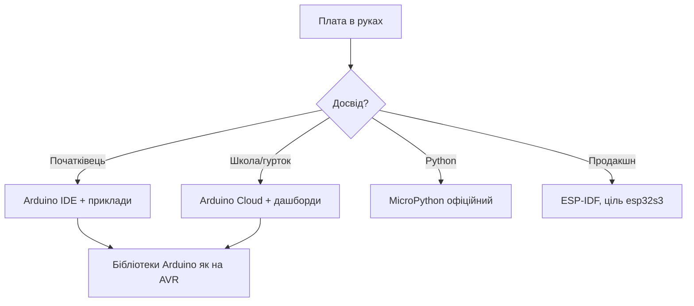

# Arduino Nano ESP32 - офіційна плата детально

![[assets/img/nano-esp32-scheme.png|600]]

## Призначення

Arduino Nano ESP32 - офіційна плата Arduino на модулі u-blox NORA-W106 (всередині ESP32-S3): Nano-формфактор 45×18 мм, USB-C, 16 МБ Flash, офіційна підтримка Arduino-ядра, MicroPython і Arduino Cloud. Огляд міні-плат - [[14-Devboards/10-Mini-Boards]], кристал S3 - [[01-Hardware/03-ESP32-S3]]. Ця нота - практика: чим NORA відрізняється від звичайного S3-модуля, як шити трьома середовищами, як жити з Nano-розкладкою і де межі формату.

## NORA-W106 всередині: що це міняє

| Тема | Практика |
| --- | --- |
| Модуль u-blox | Сертифікований RF-тракт, стабільні партії |
| ESP32-S3 всередині | Весь софт як для S3: IDF, Arduino, MicroPython |
| Антена модуля | PCB-антена u-blox, не чіпати і не екранувати! |
| 16 МБ Flash | OTA з запасом, файлові системи влізуть |
| USB-C на платі | Дані і живлення, кабель з даними! |

## USB-C і прошивка трьома шляхами

| Середовище | Як шити |
| --- | --- |
| Arduino IDE | Плата Nano ESP32 з Boards Manager, кнопок не треба |
| ESP-IDF | Ціль esp32s3, порт USB-C |
| MicroPython | Офіційна збірка під Nano ESP32 |

| Симптом | Причина | Рішення |
| --- | --- | --- |
| Порту немає | Кабель-зарядка | Кабель з даними! |
| Заливка рветься | Старе ядро | Оновити Arduino-ядро |
| Не стартує після MicroPython | Залишки FS | Повний erase перед IDF |

## Mermaid: вибір середовища

## Nano-розкладка: піни і межі

| Тема | Практика |
| --- | --- |
| Крок 2.54 | Макетка і Nano-шилди стають одразу |
| Живлення | VIN 5В, 3V3 вихід з обмеженням! |
| Аналог | A0-A7 мапляться на S3-АЦП |
| I2C/SPI/UART | Апаратні, піни фіксовані розкладкою |
| Стрепінг S3 | Діє як на звичайному S3! |

## Arduino Cloud: телеметрія без сервера

| Тема | Практика |
| --- | --- |
| Привязка плати | Через агент Arduino, покроково |
| Змінні-віджети | Температура → графік за хвилини |
| OTA з хмари | Прошивка без кабелю після першої |
| Ліміти безкоштовного | Рахувати змінні і трафік! |

## MicroPython офіційний: нюанси

| Тема | Практика |
| --- | --- |
| Збірка | Саме під Nano ESP32, не generic S3! |
| REPL по USB | Термінал одразу, Thonny бачить |
| Файли | Внутрішня FS, заливка перетягуванням |
| Бібліотеки Arduino | Не працюють - тільки Python-пакети |

## Живлення: межі маленької плати

| Джерело | Межа |
| --- | --- |
| USB-C | Основа, 5В з запасом |
| VIN | 5В від БЖ, діод захищає |
| 3V3-вихід | Міліампери датчикам, не моторам! |
| LiPo | Немає вбудованої зарядки - зовнішня! |

## Типові помилки

| # | Помилка | Чому погано | Як правильно |
| --- | --- | --- | --- |
| 1 | Generic-S3 прошивка | Піни і USB не ті | Збірка саме під Nano ESP32! |
| 2 | Кабель-зарядка | Порту немає | Кабель з даними |
| 3 | Мотори з 3V3 | Просадка і ребут | Окреме живлення |
| 4 | Антена під дротами | WiFi глухне | Зона антени вільна |
| 5 | Стрепінг зайнято | Не bootиться | Таблиця S3 перед розводкою |
| 6 | LiPo без захисту | Перерозряд банки | Зовнішня плата DW01 |
| 7 | Cloud без лімітів | Рахунок/блок | Рахувати трафік |

## Шилди Nano: що стає, а що ні

| Шилд | Статус |
| --- | --- |
| Сенсорні I2C-шилди | Так, шина стандартна |
| Релейні 5В | Так, але живлення окремо! |
| AVR-шилди з 5В-логікою | Тільки через узгодження рівнів |
| Старі бібліотеки AVR | Перевіряти портованість! |

## Дебаг без JTAG-зонда: що реально

| Інструмент | Можливості |
| --- | --- |
| USB-JTAG S3 | Точки зупинки через OpenOCD |
| Serial лог | 90% багів видно тут |
| GPIO-маркери | Таймінги на аналізаторі |
| ESP-Insights | Телеметрія падінь у хмару |

## Клас з десяти плат: організація

| Тема | Практика |
| --- | --- |
| Однакові кабелі | Маркувати data-кабелі, зарядні геть! |
| Шаблонний скетч | Стартовий код з логом і версією |
| Імена плат | Номер на корпусі маркером |
| Зберігання | Кейс з гніздами, антени не гнути |

## Ревізії плати: що перевірити при покупці

| Пункт | Де дивитись |
| --- | --- |
| Маркування ревізії | Шовкографія плати |
| Версія NORA-модуля | Наліпка на екрані |
| Актуальність ядра | Підтримка саме цієї ревізії |

## Офіційні джерела

- [Arduino Nano ESP32 docs (Arduino)](https://docs.arduino.cc/hardware/nano-esp32/) - піни, прошивка, Cloud.
- [NORA-W106 datasheet (u-blox)](https://www.u-blox.com/en/product/nora-w10-series) - модуль, антена, сертифікація.

## Див. також

- [[Home]]
- [[14-Devboards/10-Mini-Boards]]
- [[14-Devboards/08-S3-DevKitC-C3-SuperMini-XIAO]]
- [[01-Hardware/03-ESP32-S3]]
- [[09-Proshivka/02-Arduino-PlatformIO]]
- [[09-Proshivka/03-MicroPython|MicroPython]]
- [[99-Dodatki/08-Diagnostic-Map]]
