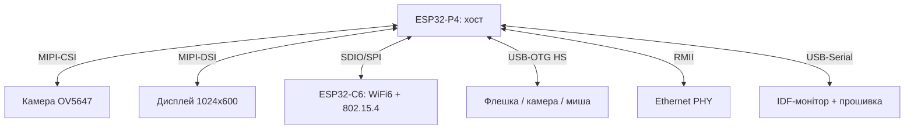

# ESP32-P4 Function EV Board - RISC-V хост без радіо з MIPI і H.264

![[assets/img/esp32-p4-devkit-scheme.png|600]]
*Рис. P4 - обчислювальний хост (MIPI, H.264, USB), радіо - через ESP32-C6 поруч; прошивка по USB-Serial.*

> [!tip] Що це за нота
> ESP32-P4 - перший чип Espressif без радіо: два RISC-V 400 МГц, MIPI-CSI/DSI, апаратний H.264, USB-OTG HS. Function EV Board розкриває все це одразу. Радіо додаємо зовнішнім C6. База: [[01-Hardware/09-ESP32-C2-P4|чипи C2/P4]], [[14-Devboards/13-ESP32C6-Boards|плати C6]], [[14-Devboards/08-S3-DevKitC-C3-SuperMini-XIAO|DevKitC і малюки]].

## 1. Мета

Зрозуміти місце P4 в екосистемі і запустити плату:

- P4 - хост: камера, дисплей, Ethernet, USB-пристрої, ML-інференс;
- радіо - ESP32-C6/H2 поруч по SDIO/SPI/UART (модель «два чипи»);
- прошивка - USB-Serial-JTAG вбудовано, без зовнішніх програматорів;
- куди ставити: HMI-панелі, камери з аналітикою, шлюзи.

| Параметр | ESP32-P4 | ESP32-S3 (для порівняння) |
| --- | --- | --- |
| CPU | 2× RISC-V 400 МГц | 2× LX7 240 МГц |
| Радіо | немає (зовнішній C6) | WiFi + BLE 5 |
| Камера | MIPI-CSI 2 лінії | DVP (паралельна) |
| Відео | H.264 енкодер | немає |
| USB | OTG HS + Serial-JTAG | Serial-JTAG + OTG FS |
| Пам'ять | 768 КБ SRAM + PSRAM | 512 КБ + PSRAM |

## 2. Архітектура плати



Function EV Board - велика плата з усіма роз'ємами одразу: не треба шилдів, усе для прототипу на місці.

## 3. Перший запуск

- ESP-IDF 5.3+: `idf.py set-target esp32p4`, приклад `hello_world` - моргає RGB;
- USB-Serial-JTAG: один кабель - прошивка, лог і JTAG-налагодження;
- дисплейне демо - LVGL з коробки (див. [[11-Vivid/12-LVGL-SquareLine|LVGL і SquareLine]]);
- камера: приклад `esp32-camera` у MIPI-режимі, стрім у браузері.

## 4. Зв'язка P4 + C6

- C6 прошиваємо AT або RCP (Thread border-router), P4 - хост;
- транспорт: SDIO для швидкості, UART для простоти, SPI - золота середина;
- P4 віддає команди, C6 - радіо-пакети; поділ як у [[12-Moduli-zvyazku/29-LoRaWAN-Gateway|LoRaWAN-шлюзі]];
- живлення пари: 5V 2A, піки WiFi C6 не мають садити P4.

## 5. Робочий код (IDF)

```c
#include "esp_camera.h"
#include "esp_log.h"

static const char *TAG = "p4cam";

void app_main(void) {
  camera_config_t cfg = {
    .pin_pwdn = -1, .pin_reset = -1,
    .pin_xclk = 15, .pin_sccb_sda = 4, .pin_sccb_scl = 5,
    .pin_d7 = 16, .pin_d6 = 17, .pin_d5 = 18, .pin_d4 = 12,
    .pin_d3 = 10, .pin_d2 = 8, .pin_d1 = 9, .pin_d0 = 11,
    .pin_vsync = 6, .pin_href = 7, .pin_pclk = 13,
    .xclk_freq_hz = 20000000,
    .pixel_format = PIXFORMAT_JPEG,
    .frame_size = FRAMESIZE_SVGA,
    .jpeg_quality = 12, .fb_count = 2,
  };
  esp_err_t err = esp_camera_init(&cfg);
  if (err != ESP_OK) {
    ESP_LOGE(TAG, "camera failed: %s", esp_err_to_name(err));
    return;
  }
  ESP_LOGI(TAG, "P4 camera ready, heap=%lu", esp_get_free_heap_size());
  while (1) {
    camera_fb_t *fb = esp_camera_fb_get();
    if (fb) {
      ESP_LOGI(TAG, "frame %dx%d %u bytes", fb->width, fb->height, fb->len);
      esp_camera_fb_return(fb);
    }
    vTaskDelay(pdMS_TO_TICKS(1000));
  }
}
```

Для MIPI-сенсорів - конфіг `esp_lcd`/`mipi_csi` з прикладів IDF 5.3, каркас вище той же: ініціалізація, цикл, повернення буфера.

## 6. H.264 і USB-OTG

- апаратний енкодер: JPEG-кадр → H.264-потік для запису/стріму;
- USB-OTG HS: флешка (FATFS), UVC-камера, HID-миша - приклади `usb/host`;
- Ethernet RMII: провідний шлюз без WiFi взагалі;
- SDMMC 4-біт: запис відео на картку на швидкості потоку.

## 6.1 Дисплей і LVGL за 10 хвилин

- приклад `lvgl` з IDF: MIPI-DSI 1024x600 заводиться без танців;
- SquareLine Studio експортує UI прямо в проєкт (див. LVGL-ноту);
- подвійна буферизація в PSRAM - без розривів картинки;
- тач-панель - по I2C, калібрування один раз;
- шрифти кирилиці - додати в `lv_conf.h`, інакше квадрати.

## 6.2 Ethernet без WiFi взагалі

- PHY на RMII: провідний шлюз з PoE-інжектором;
- приклад `ethernet/basic`: DHCP, лінк-статус у логах;
- PoE не з плати - тільки зовнішній спліттер;
- для шлюзу P4+C6: WAN по Ethernet, клієнти по WiFi.

## 7. Живлення і тепло

- 5V 2A мінімум: дисплей + камера + WiFi C6 разом;
- радіатор на P4 при H.264 - гріється чесно;
- [[02-Zhivlennya/02-LDO-DC-DC|LDO і DC-DC]] - вибір живлення вузла;
- сон P4: light-sleep між кадрами, deep-sleep - з втратою PSRAM.

## 7.1 Розпіновка ESP32-P4 DevKitC

| Сигнал | Пін | Примітка |
| --- | --- | --- |
| USB-OTG (D-/D+) | GPIO19 / GPIO20 | 5V VBUS живить пристрій |
| UART-лог консоль | USB-Serial | 115200 |
| MIPI-CSI | FPC-роз'єм | Шлейф до упору |
| H.264 потік | PSRAM 8 МБ | Кадр у парі |
| GPIO керування | 20+ пінів | 3.3V логіка |

## 8. Типові помилки

| Симптом | Причина | Лікування |
| --- | --- | --- |
| Не прошивається | не той USB-роз'єм (їх два) | шити через USB-Serial, не OTG |
| Камера чорна | MIPI-шлейф не тим боком | синя смуга до роз'єму, защіпнути |
| C6 не відповідає | не прошитий RCP/AT | прошити C6 окремо, перевірити UART-міст |
| H.264 сиплеться | PSRAM повільна/перегрів | знизити роздільність, радіатор |
| USB-флешка не монтується | не FAT32 або струм | FAT32, хаб з живленням |
| IDF не бачить target | IDF старіший за 5.3 | оновити IDF, `set-target esp32p4` |

## 9. Суміжні ноти

- [[01-Hardware/09-ESP32-C2-P4|чипи C2/P4]] - кристал детально.
- [[14-Devboards/13-ESP32C6-Boards|плати C6]] - радіо-напарник.
- [[12-Moduli-zvyazku/13-Camera-Streaming|стримінг з камери]] - серверна сторона.
- [[11-Vivid/12-LVGL-SquareLine|LVGL і SquareLine]] - інтерфейс на дисплеї.
- [[09-Proshivka/01-ESP-IDF-setup|налаштування ESP-IDF]] - тулчейн.

## Офіційні джерела

- [ESP32-P4 Function EV Board (Espressif)](https://docs.espressif.com/projects/esp-dev-kits/en/latest/esp32p4/esp32-p4-function-ev-board/) - схема плати, роз'єми.
- [ESP32-C5 DevKitC-1 (Espressif)](https://docs.espressif.com/projects/esp-dev-kits/en/latest/esp32c5/esp32-c5-devkitc-1/) - сусід по C-лінійці для порівняння.
- [USB Host examples (Espressif, GitHub)](https://github.com/espressif/esp-idf/tree/master/examples/peripherals/usb/host) - OTG-приклади для P4.
