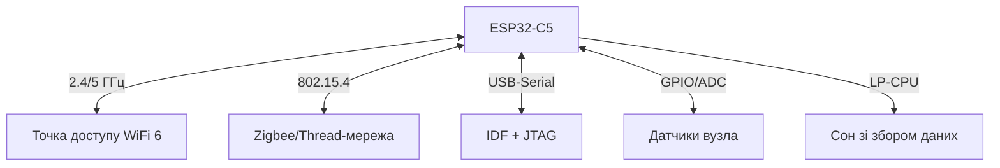

# ESP32-C5 DevKitC - дводіапазонний WiFi 6 і 802.15.4 на столі

![[assets/img/esp32-c5-devkit-scheme.png|600]]
*Рис. C5 - перший Espressif з 5 ГГц WiFi 6 плюс 802.15.4: DevKitC, USB-Serial, антена на платі.*

> [!tip] Що це за нота
> Плата під новий флагман C-лінійки: WiFi 6 одразу на двох діапазонах + Zigbee/Thread/Matter в одному кристалі RISC-V. Для порівняння чипів - [[01-Hardware/10-ESP32-C5-C61|нота C5/C61]], для практики з роботом - [[16-Proekti/06-C5-C61-Robotics|робот на C5]]. База плат: [[14-Devboards/13-ESP32C6-Boards|плати C6]].

## 1. Мета

Вичавити з C5 те, чого немає в C6:

- WiFi 6 на 5 ГГц: менше завад, вища швидкість стріму;
- 802.15.4: Zigbee-кінцеві вузли і Thread/Matter без другого чипа;
- LP-CPU 40 МГц: сенсори в сні, радіо - за розкладом;
- зрозуміти, коли C5, а коли вистачить C6.

| Параметр | ESP32-C5 | ESP32-C6 |
| --- | --- | --- |
| WiFi | 6, dual-band 2.4 + 5 ГГц | 6, тільки 2.4 ГГц |
| 802.15.4 | Zigbee/Thread | Zigbee/Thread |
| CPU | RISC-V 240 МГц + LP 40 МГц | RISC-V 160 МГц + LP 20 МГц |
| SRAM | 384 КБ | 512 КБ |
| USB | Serial-JTAG | Serial-JTAG + OTG |

## 2. Архітектура плати



DevKitC-1: модуль ESP32-C5-WROOM-1, кнопка BOOT/RESET, RGB-світлодіод, гребінки під макетку. Антена - друкована на модулі.

## 3. Перший запуск

- ESP-IDF 5.5+: `idf.py set-target esp32c5`;
- приклад `wifi/getting_started/station` - конект до 5 ГГц точки;
- приклад `zigbee` - вузол on/off light;
- Arduino-core 3.3+: плата «ESP32C5 Dev Module»;
- Matter over WiFi - приклад `connectedhomeip` (важкий, треба PSRAM-увага).

## 4. WiFi 6 на 5 ГГц: що дає

- OFDMA і MU-MIMO - стабільний стрім з камери без лагів 2.4;
- TWT (target wake time) - батарейний вузол спить за розкладом точки;
- перевірка: `idf.py monitor` показує RSSI і MCS-індекс;
- 5 ГГц гірше б'є через стіни - для дачі лишаємо 2.4.

## 5. Робочий код (IDF)

```c
#include "esp_wifi.h"
#include "esp_log.h"

static const char *TAG = "c5wifi";

void wifi_init_sta(const char *ssid, const char *pass) {
  ESP_ERROR_CHECK(esp_netif_init());
  ESP_ERROR_CHECK(esp_event_loop_create_default());
  esp_netif_create_default_wifi_sta();
  wifi_init_config_t cfg = WIFI_INIT_CONFIG_DEFAULT();
  ESP_ERROR_CHECK(esp_wifi_init(&cfg));
  wifi_config_t wc = {0};
  strncpy((char*)wc.sta.ssid, ssid, sizeof(wc.sta.ssid));
  strncpy((char*)wc.sta.password, pass, sizeof(wc.sta.password));
  wc.sta.band_mode = WIFI_BAND_MODE_AUTO;
  ESP_ERROR_CHECK(esp_wifi_set_mode(WIFI_MODE_STA));
  ESP_ERROR_CHECK(esp_wifi_set_config(WIFI_IF_STA, &wc));
  ESP_ERROR_CHECK(esp_wifi_start());
  ESP_ERROR_CHECK(esp_wifi_connect());
  ESP_LOGI(TAG, "connecting to %s (auto band)", ssid);
}

void app_main(void) {
  nvs_flash_init();
  wifi_init_sta("ssid", "pass");
  uint8_t mac[6];
  esp_wifi_get_mac(WIFI_IF_STA, mac);
  ESP_LOGI(TAG, "mac %02x:%02x:%02x:%02x:%02x:%02x",
           mac[0], mac[1], mac[2], mac[3], mac[4], mac[5]);
}
```

`WIFI_BAND_MODE_AUTO` - чип сам обирає 2.4/5 ГГц за якістю. Для примусового 5 ГГц - `WIFI_BAND_MODE_5G`.

## 6. Zigbee/Thread на C5

- Zigbee: приклад on/off light switch, координатор на C5;
- Thread: RCP + OpenThread border-router на хості;
- Matter: WiFi-транспорт (без Thread-мережі) - найпростіший старт;
- антена спільна для WiFi і 802.15.4 - розносимо в часі активність.

## 6.1 Matter over WiFi: найпростіший старт

- приклад `light` з репозиторію connectedhomeip під C5;
- комісіонування через BLE + WiFi одночасно;
- сертифікати з'їдають SRAM - партиції перерахувати;
- для першого разу: on/off light, без кластерів сенсорів;
- Thread-мережу додаємо другим кроком, коли WiFi-варіант стабільний.

## 6.2 Антена і дальність 5 ГГц

- друкована антена модуля: не закривати металом корпусу;
- 5 ГГц дає швидкість, але гірше б'є через стіни, ніж 2.4;
- орієнтація плати: антеною до точки, не до стіни;
- для вулиці - версія з U.FL і зовнішньою антеною;
- RSSI −65 дБм і краще - стабільний MCS без просадок.

## 7. Живлення і сон

- 5 ГГц передавач вимогливий до струму: пік вище, ніж у C6;
- modem-sleep і light-sleep - обов'язкові для батареї;
- LP-CPU збирає ADC/I2C у сні, будить ядро за порогом;
- [[07-Timeri-Son/03-Sleep-ULP|режими сну]] - деталі по всіх чипах.

## 7.1 Розпіновка ESP32-C5 DevKitC

| Сигнал | Пін | Примітка |
| --- | --- | --- |
| WiFi 6 5 ГГц | Вбудована антена | Овальні модулі, не закривати металом |
| 802.15.4 (Zigbee) | Вбудований радіо | Без додаткових пінів |
| USB-Serial | USB-C роз'єм | Прошивка / монітор |
| GPIO керування | 29 пінів | 3.3V логіка |
| ADC / DAC | 5 канадлів / 2 шт | SDK-розширення |

## 8. Типові помилки

| Симптом | Причина | Лікування |
| --- | --- | --- |
| Не бачить 5 ГГц точку | точка без WiFi 6 або DFS-канал | увімкнути ax на 36-48 каналах |
| Zigbee не стартує | не той приклад (під C6/H2) | брати приклад з `set-target esp32c5` |
| Рветься на 5 ГГц | слабке живлення USB-хаба | кабель безпосередньо, конденсатор на 5V |
| Arduino-core не компілює | ядро старіше за 3.3 | оновити esp32-ядро |
| LP-CPU не будить | не налаштований wakeup-джерело | приклад `ulp` під C5, не під C6 |
| Matter не влізає | мало SRAM під сертифікати | оптимізувати партиції, вимкнути лог |

## 9. Суміжні ноти

- [[01-Hardware/10-ESP32-C5-C61|чипи C5/C61]] - кристал детально.
- [[16-Proekti/06-C5-C61-Robotics|робот на C5]] - практика з моторами.
- [[15-Protokoli/09-Matter-Thread-Zigbee|Matter і Thread]] - протокольна сторона.
- [[14-Devboards/13-ESP32C6-Boards|плати C6]] - молодший брат.
- [[05-Radio/01-WiFi-STA-AP|WiFi STA/AP]] - база бездротового.

## Офіційні джерела

- [ESP32-C5 DevKitC-1 (Espressif)](https://docs.espressif.com/projects/esp-dev-kits/en/latest/esp32c5/esp32-c5-devkitc-1/) - схема плати, живлення.
- [ESP32-P4 Function EV Board (Espressif)](https://docs.espressif.com/projects/esp-dev-kits/en/latest/esp32p4/esp32-p4-function-ev-board/) - старший хост для порівняння.
- [ESP-AT User Guide (Espressif)](https://docs.espressif.com/projects/esp-at/en/latest/esp32/) - AT-прошивки C-лінійки.
