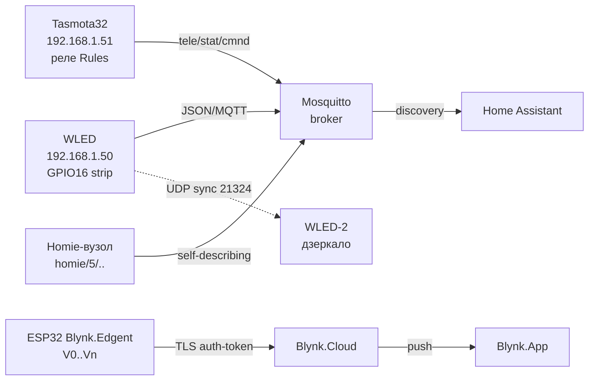

# Готові прошивки ESP32 - WLED, Tasmota, Blynk, Homie

> [!warning] Готова прошивка ≠ відсутність ризиків: чужий бінарник бачить твій WiFi-пароль і MQTT-логін!
> Прошивай тільки з офіційних релізів (WLED/Tasmota GitHub), одразу міняй дефолтні паролі, закривай відкритий AP. Струм LED-стрічки рахуй ОКРЕМО - прошивка не врятує тонкі дроти!

Огляд мережі: [[05-Radio/01-WiFi-STA-AP]], телеметрія [[15-Protokoli/01-MQTT|MQTT]], живлення стрічок [[11-Vivid/09-LED-Strip-Power-SK6812-APA102]], старт [[Home]].

## Призначення

Своя прошивка (ESP-IDF / Arduino / MicroPython) дає повний контроль, але з'їдає тижні на WiFi-реконект, вебінтерфейс, OTA і дашборди. Готові прошивки закривають 80% типових задач за вечір: налив світлодіодну стрічку - WLED, треба клацати реле з MQTT і кнопок - Tasmota, треба мобільний застосунок без бекенда - Blynk, треба самодокументовані MQTT-топіки - Homie-конвенція поверх своєї прошивки.

Коли брати готову прошивку:

- LED-інсталяція, гірлянда, підсвітка: WLED з коробки дає 200+ ефектів, сегменти, пресети, UDP-синхронізацію.
- Розумна розетка / вимикач / датчик з WebUI і MQTT: Tasmota з Template-конфігом без жодного рядка коду.
- Пілотний IoT-продукт з мобільним застосунком: Blynk (Console + Apps + Edgent-provisioning).
- Свій firmware, але стандартні топіки для Home Assistant / openHAB: Homie-конвенція.

Коли НЕ брати:

- батарейний вузол з deep-sleep мікроамперами - готові прошивки тримають WiFi і їдять десятки мА (див. сон [[07-Timeri-Son/03-Sleep-ULP]]);
- сертифікований комерційний виріб з власним брендом застосунку - Blynk Enterprise коштує грошей, WLED/Tasmota тягнуть GPL/EUPL-зобов'язання;
- екзотична периферія без готового драйвера - швидше написати своє, ніж пиляти usermod з нуля.

## Параметри

| Параметр | WLED | Tasmota (tasmota32) | Blynk (Edgent) | Homie (конвенція) |
| --- | --- | --- | --- | --- |
| Призначення | адресні LED: WS2812B, SK6812, APA102 | реле, датчики, димери, мости | хмара + мобільний UI | стандарт MQTT-топіків |
| Бінарник | `WLED_*.bin` / install.wled.me | `tasmota32.bin` (+ варіанти sensors/display) | свій скетч + Blynk-бібліотека | свій код + homie-lib |
| Перший запуск | AP `WLED-AP`, портал 4.3.2.1 | AP `tasmota-XXXX`, портал 192.168.4.1 | BlynkEdgent provisioning (AP + claiming) | залежить від прошивки |
| Керування | WebUI, JSON/HTTP API, MQTT | WebUI, MQTT, HTTP `cm?`, Console | Blynk.Console / Apps, віртуальні піни | будь-який Homie-контролер |
| Автовиявлення | mDNS `wled.local`, HA discovery | MQTT discovery для HA | хмарний claiming | `$state` + self-description |
| OTA | HTTP OTA з WebUI | OTA URL (`OtaUrl`, `Upgrade 1`) | Blynk.Air OTA | свій механізм OTA |
| Струм LED | ліміт ABL в UI, але дроти рахуй сам! | PWM/DALI-мости, без ABL | без LED-рушія | без LED-рушія |
| Живлення ESP | 5 В / 500 мА пік WiFi | 5 В / 500 мА пік WiFi | 5 В / 500 мА пік WiFi | залежить від вузла |
| Ліцензія | EUPL-1.2 | GPL-3.0 | комерційна (free-ліміти) | MIT-подібна конвенція |

![[assets/img/firmwares-wled-tasmota-scheme.png|600]]
*Рис. Готові прошивки: WLED крутить стрічку і слухає JSON/MQTT, Tasmota клацає реле за Rules, Blynk возить дані у хмару на V-пінах, Homie описує себе топіками `$state`.*

### ASCII-схема

```text
                    WiFi-роутер 192.168.1.1
                            │
        ┌───────────────────┼────────────────────┐
        │                   │                    │
  WLED-вузол           Tasmota-вузол        Телефон Blynk.App
  192.168.1.50         192.168.1.51         (хмара blynk.cloud)
  GPIO16 → 300×WS2812B  GPIO23 → реле
        │                   │
        │ JSON http://.50   │ cmnd/tasmota_01/POWER
        │ /json/state       │ stat/tasmota_01/RESULT
        │                   │ tele/tasmota_01/SENSOR
        │                   │
        ├─ UDP-sync ────────┤ (WLED→WLED порт 21324)
        │                   │
        └─► MQTT-брокер 192.168.1.10 ──► Home Assistant
              │  wled/+/g  (WLED)
              │  homie/5/device123/$state (Homie-вузол)
              └─► Blynk-хмара (TLS, auth-token) ──► дашборд

Перший запуск: WLED-AP / tasmota-XXXX / BlynkEdgent-AP → портал → STA
```

### Mermaid



## WLED - адресні стрічки без коду

WLED - прошивка-король для WS2812B / WS2811 / SK6812 / APA102 / WS2801. Прошивається готовим бінарником через [веб-інсталер](https://kno.wled.ge/basics/install-binary/) або `esptool.py`, далі все мишкою у WebUI.

Прошивка бінарником:

```bash
# Варіант 1: браузерний інсталер (рекомендовано) — https://install.wled.me/
# Варіант 2: вручну
pip install esptool
esptool.py --chip esp32 --port /dev/ttyUSB0 erase_flash
esptool.py --chip esp32 --port /dev/ttyUSB0 write_flash 0x0 WLED_0.15.0_ESP32.bin
```

Перший запуск:

1. ESP піднімає відкритий AP `WLED-AP` (пароль `wled1234` у нових версіях).
2. Підключитись → портал або перейти на `4.3.2.1` → ввести домашній SSID/пароль.
3. Після конекту вузол доступний як `wled.local` (mDNS) + за DHCP-IP; AP лишається як failsafe.
4. `Config → LED Preferences`: тип стрічки (WS281x / SK6812 / APA102), GPIO, кількість LED, порядок кольорів (GRB!), вольтаж.

Сегменти, ефекти, пресети:

- **Сегменти (Segments):** ріжуть одну фізичну стрічку на віртуальні зони (0-99, 100-199…), кожна зі своїм ефектом/кольором/палітрою. До 10 виходів на ESP32 (паралельний I2S + RMT).
- **Ефекти:** 200+ вбудованих (бігучий вогонь, метеори, аудіореактивні з мікрофоном INMP441). Швидкість (Speed) й інтенсивність (Intensity) - окремі слайдери.
- **Пресети:** до 250 слотів - знімок кольори+ефекти+сегменти. Пресет 1 можна призначити на кнопку завантаження. Плейлисти циклять пресети за таймером.
- **Нічник (Nightlight):** плавне згасання за N хвилин. **Ліміт струму ABL (Auto Brightness Limiter):** задаєш мА блока живлення - WLED придушить яскравість, але це НЕ замінює товсті дроти!

Sync UDP між WLED-вузлами:

- `Settings → Sync Interfaces → WLED Broadcast`: усі вузли в одній WiFi-мережі шлють UDP-пакети на порт 21324 (ефект, колір, яскравість).
- Режими: Send + Receive (дзеркало), тільки Send (ведучий), тільки Receive (ведений).
- Для сцени/театру - DDP / E1.31 / Art-Net вхід з Jinx/Resolume замість UDP-sync.

Інтеграція Home Assistant:

- Нативна інтеграція `WLED` (Settings → Devices → Add → WLED → IP): кожен сегмент стає окремим `light.*`, плюс сенсори струму/пам'яті/RSSI, селекти пресетів/плейлистів, кнопки рестарту.
- Мінімум WLED 0.14.0. WebSocket дає push-оновлення; кастомні збірки без JSON API не підтримуються.
- Автоматизація YAML - увімкнути пресет «My Preset»:

```yaml
action: light.turn_on
target:
  entity_id: light.wled
data:
  effect: "Fire 2012"
```

```yaml
action: select.select_option
target:
  entity_id: select.wled_preset
data:
  option: "My Preset"
```

Струм стрічок - ОБОВ'ЯЗКОВО прочитати [[11-Vivid/09-LED-Strip-Power-SK6812-APA102]]:

- 300× WS2812B на білому 100% = ~18 А @ 5 В. Один USB-блок на 2 А згорить або просадить напругу - кінець стрічки почервоніє.
- Живити стрічку з ОБОХ кінців (і кожні 2-3 м), спільна земля з ESP, data через резистор 33-100 Ом, конденсатор 1000 мкФ за живленням.
- ABL у WLED - софт-запобіжник, а не заміна міді: став 80% від номіналу блока.

JSON API приклад (HTTP):

```bash
# Статус
curl http://192.168.1.50/json/state
# Увімкнути червоний + ефект
curl -X POST http://192.168.1.50/json/state \
  -d '{"on":true,"bri":128,"seg":[{"col": [ [255,0,0] ],"fx":5,"sx":200}]}'
# MQTT ті самі поля: топік wled/wled-01/api → той самий JSON
```

## Tasmota - реле, датчики, автоматика без коду

Tasmota (гілка `tasmota32.bin` для ESP32) перетворює голий модуль на керований WebUI/MQTT/HTTP пристрій: реле, кнопки, DS18B20, BME280, WS2812-стрічки (прості), димери, IR/RF-мости.

Прошивка:

```bash
esptool.py --chip esp32 --port /dev/ttyUSB0 erase_flash
# Взяти tasmota32.bin з https://github.com/arendst/Tasmota/releases
esptool.py --chip esp32 --port /dev/ttyUSB0 write_flash 0x0 tasmota32.bin
# Після старту: AP tasmota-XXXX → 192.168.4.1 → домашній WiFi → WebUI
```

Template / GPIO-конфіг (`Configure → Configure Template`):

- Кожен GPIO призначається на роль: `Relay1`, `Button1`, `Led1`, `DS18x20`, `I2C SDA/SCL`, `PWM1`, `WS2812`.
- Готові шаблони для сотень пристроїв - на [templates.blakadder.com](https://tasmota.github.io/docs/Templates/), вставляєш JSON у поле Template і тиснеш Activate.
- Приклад: Sonoff Basic - GPIO12 Relay1, GPIO0 Button1. Своя плата: реле на GPIO23, кнопка на GPIO0 (з підтяжкою).

```text
{"NAME":"MyBoard","GPIO":[0,0,0,0,0,0,0,0,0,2304,0,320,0,0,0,0,0,0,0,0,0,0,224,0,0,0,0,0,0,0,0,0,0,0,0,0],"FLAG":0,"BASE":1}
; 224 = Relay1, 320 = Button1, 2304 = Led1 (індекси компонентів Tasmota)
```

MQTT-топіки `tele / stat / cmnd` (база [[15-Protokoli/01-MQTT|MQTT]]):

```text
cmnd/tasmota_01/POWER1 ON        → команда (QoS 1, без retain)
stat/tasmota_01/RESULT {"POWER1":"ON"}   ← відповідь на команду
stat/tasmota_01/POWER1 ON        ← стан реле
tele/tasmota_01/SENSOR {"DS18B20":{"Temperature":23.4}}  ← телеметрія кожні TelePeriod
tele/tasmota_01/LWT Online       ← LWT online/offline
```

Налаштування через Console або Backlog однією пачкою:

```text
Backlog MqttHost 192.168.1.10; MqttUser esp; MqttPassword SECRET;
Topic tasmota_01; TelePeriod 60; PowerRetain on; SetOption53 1
; SetOption53=1 → CBC... (див. довідник SetOption нижче)
```

SetOption - ключові (повний список у `Commands`):

- `SetOption26 1` - форсувати індекси `POWER1` навіть з одним реле.
- `SetOption53 1` - показувати hostname+MAC в MQTT.
- `PowerRetain on` - retain на стан реле (HA бачить стан після рестарту).
- `TelePeriod 60` - період телеметрії, секунд (10-300).
- `BlinkCount / BlinkTime` - миготіння реле для дзвінків/сирен.
- `Emulation 1` - Belkin WeMo для Alexa (див. нотатку 07), `2` - Hue Bridge.

Правила Rules (автоматика без хмари):

```text
Rule1 ON DS18B20#Temperature>28 DO Power1 ON ENDON ON DS18B20#Temperature<25 DO Power1 OFF ENDON
Rule1 1
; Вентилятор за температурою: гістерезис 25/28 °C, всередині пристрою
Rule2 ON Switch1#State=2 DO Backlog Power1 TOGGLE; Publish stat/tasmota_01/EVT {"btn":"double"} ENDON
Rule2 1
```

Timer'и (`Timers` у WebUI) - 16 розкладів сходу/заходу сонця з офсетами, без коду.

## Blynk - хмара і застосунок за вечір

Blynk - платформа: Blynk.Cloud (брокер+БД) + Blynk.Console (веб) + Blynk.Apps (iOS/Android) + Blynk Library / Edgent-прошивка. Платиш або терпиш free-ліміти (кількість девайсів/повідомлень), зате мобільний UI збирається drag-and-drop.

Auth-token і віртуальні піни:

- У Console: Template → Datastreams → створити `V0` (температура, double, °C), `V1` (реле, integer 0/1). Кожен пристрій отримує `BLYNK_AUTH_TOKEN`.
- Прошивка НЕ використовує GPIO-номери безпосередньо в хмарі - пишеш у `Blynk.virtualWrite(V0, t)`, читаєш з `BLYNK_WRITE(V1)`.

```cpp
#define BLYNK_TEMPLATE_ID "TMPLxxxx"
#define BLYNK_TEMPLATE_NAME "ESP32 Climate"
#define BLYNK_AUTH_TOKEN "AbCdEfGhIjKlMnOpQrStUvWx"
#include <WiFi.h>
#include <BlynkSimpleEsp32.h>

char ssid[] = "SSID", pass[] = "PASS";

BLYNK_WRITE(V1) {  // віджет кнопки у застосунку
  digitalWrite(27, param.asInt());
}

void setup() {
  pinMode(27, OUTPUT);
  Blynk.begin(BLYNK_AUTH_TOKEN, ssid, pass);
}

void loop() {
  Blynk.run();           // тримати зв'язок з хмарою!
  static uint32_t t0 = 0;
  if (millis() - t0 > 5000) {
    t0 = millis();
    Blynk.virtualWrite(V0, 24.5);  // температура → дашборд
  }
}
```

BlynkEdgent provisioning:

- Приклад `Edgent_ESP32` з бібліотеки: перший старт - AP `Blynk Device-XXXX` → портал → домашній WiFi → claiming у твій акаунт (кнопка + LED-індикація статусу).
- OTA з хмари (Blynk.Air): заливаєш новий бінарник у Console → пристрої оновлюються партіями.
- Таймаут реконекту і `Blynk.config()` замість блокуючого `begin()` - якщо хмара недоступна, пристрій має працювати локально!

Тарифи (орієнтир, перевіряти на blynk.io/pricing):

- Free: 2 пристрої, базова історія даних, Blynk branding.
- Plus/Pro: більше пристроїв, white-label застосунок, організації, sub-tenant'и.
- Хобі-датчик погоди - Free вистачає; серія на 500 корпусів - рахуй $/пристрій/рік і читай Terms!

## Homie-конвенція - порядок у MQTT-топіках

Homie - НЕ прошивка, а конвенція іменування MQTT-топіків: пристрій сам описує себе retained-повідомленнями, контролер (openHAB, Home Assistant, Node-RED) підхоплює без ручного мапінгу. Версія актуальна - Homie 5.0 (`homie/5/...`).

Каркас топіків:

```text
homie/5/device123/$state       → ready | sleeping | lost | alert
homie/5/device123/$description → JSON: ім'я, вузли, властивості, одиниці, формат
homie/5/device123/mythermostat/temperature → 22
homie/5/device123/mythermostat/temperature/set → 23  (команда: .../set)
homie/5/device123/$extensions/...  (OTA, статистика, firmware)
```

Мінімальний життєвий цикл `$state`: `init → ready → sleeping → ready → lost` (LWT = `lost`).

Приклад опису (retained):

```json
{
  "id": "device123",
  "homie": "5.0",
  "version": "12",
  "name": "My device",
  "nodes": {
    "mythermostat": {
      "name": "My thermostat",
      "type": "thermostat",
      "properties": {
        "temperature": {
          "name": "Temperature",
          "unit": "°C",
          "datatype": "integer",
          "settable": true
        }
      }
    }
  }
}
```

OTA-розширення: властивість `firmware/checksum` + топік `.../firmware/update/set` з URL бінарника; пристрій качає, перевіряє SHA і перезавантажується.

Свій Homie-вузол на MicroPython (ескіз):

```python
import json
from umqtt.robust import MQTTClient
BASE = b"homie/5/esp32-01"
c = MQTTClient("esp32-01", "192.168.1.10")
c.set_last_will(BASE + b"/$state", b"lost", retain=True)
c.connect()
c.publish(BASE + b"/$state", b"init", retain=True)
desc = {"id": "esp32-01", "homie": "5.0", "version": "1",
        "name": "ESP32 climate",
        "nodes": {"env": {"name": "Env", "type": "sensor",
        "properties": {"t": {"name": "T", "unit": "°C",
        "datatype": "float", "settable": False}}}}}
c.publish(BASE + b"/$description", json.dumps(desc), retain=True)
c.publish(BASE + b"/env/t", b"24.5", retain=True)
c.publish(BASE + b"/$state", b"ready", retain=True)
```

## Коли своя прошивка, а коли готова

| Критерій | Своя прошивка (IDF/Arduino/MP) | WLED | Tasmota | Blynk | Homie поверх своєї |
| --- | --- | --- | --- | --- | --- |
| Час до демо | дні-тижні | 1 вечір | 1 вечір | 1 вечір + UI | дні (але топіки стандартні) |
| LED-стрічка 100+ | писати рушій/RMT самому | бери одразу | тільки прості | ні | пиши сам |
| Реле+кнопки+датчики | GPIO+MQTT вручну | ні | бери одразу | можливо | можливо |
| Мобільний застосунок | свій бекенд/Flutter | застосунок WLED | WebUI, не застосунок | бери одразу | свій |
| Офлайн-робота | повна | повна (LAN) | повна (LAN) | потрібна хмара | повна |
| Deep-sleep мкА | так | ні | ні | ні | так |
| Масштаб 100+ вузлів | свій fleet-менеджмент | MQTT+HA | MQTT+HA | Blynk Orgs/Air | свій + discovery |

Правило: прототип на готовій прошивці → якщо виріб «полетів» і впираєшся в стелю (сон, брендинг, екзотика) - переписуєш на свою, зберігаючи топіки (Homie або `device/<id>/...` з [[15-Protokoli/01-MQTT|MQTT]]).

## Типові помилки

| Симптом | Причина | Рішення |
| --- | --- | --- |
| Кінець LED-стрічки жовтить/червонить | просадка 5 В на тонких/довгих дротах | живлення з обох кінців, провід ≥ 1.5 мм², спільна земля; див. [[11-Vivid/09-LED-Strip-Power-SK6812-APA102]] |
| WLED-AP не зникає після налаштування | failsafe AP лишено увімкненим | `WiFi Setup → Disable AP`, поставити пароль |
| Плутаються кольори R/B | не той порядок каналів | `LED Preferences → Color Order`: GRB для WS2812B, RGB для SK6812 |
| UDP-sync смикається | різні версії WLED / WiFi-лаги | одна версія на всіх, ведучий 1, multicast доступний |
| Tasmota не бачить датчик | не той GPIO/роль у Template | `Configure Template`, звіритись з blakadder-шаблоном плати |
| `cmnd/...` без відповіді | не той `Topic` / `FullTopic` | `Topic tasmota_01`, підписка `stat/#` для діагностики |
| Rules не спрацьовують | правило не ввімкнено | `Rule1 1`, перевірка `Rule1` без параметра показує текст |
| Blynk `Invalid auth token` | токен від іншого Template | скопіювати `BLYNK_AUTH_TOKEN` з Device Info саме цього девайса |
| Blynk-дані не оновлюються | `Blynk.run()` кличеться рідко / `delay()` | без блокуючих `delay`, `run()` щонайменше кожні ~50 мс |
| Homie-контролер не бачить вузол | `$description` без retain | публікувати опис і `$state` з `retain=True` |

## Офіційні джерела

- [WLED - документація (kno.wled.ge)](https://kno.wled.ge/basics/install-binary/) - прошивка, сегменти, пресети, UDP-sync, JSON/MQTT API.
- [WLED - GitHub (wled/WLED)](https://github.com/wled/WLED) - релізи бінарників, install.wled.me, usermods.
- [Tasmota - документація](https://tasmota.github.io/docs/) - Template, компоненти, MQTT, Rules, Timers.
- [Tasmota Commands](https://tasmota.github.io/docs/Commands/) - Backlog, Power, SetOption, TelePeriod, Rules-синтаксис.
- [Homie-конвенція - огляд](https://homieiot.github.io/homie-esp8266/) - топіки, `$state`, self-description, розширення OTA.

- WS2801 Datasheet (WorldSemi, пошук PDF): [WS2801 search](https://www.alldatasheet.com/view.jsp?Searchword=WS2801) - LED-драйвер.
- WS2811 Datasheet (WorldSemi, пошук PDF): [WS2811 search](https://www.alldatasheet.com/view.jsp?Searchword=WS2811) - LED-драйвер 12V-стрічок.

## Див. також

- [[Home]]
- [[15-Protokoli/01-MQTT|MQTT]] - брокер, QoS, LWT для Tasmota/Homie
- [[15-Protokoli/07-Notify-Voice|Notify/Voice]] - сповіщення і голосове керування готовими прошивками
- [[05-Radio/01-WiFi-STA-AP|WiFi STA/AP]] - режими радіо, AP-портали першого запуску
- [[11-Vivid/09-LED-Strip-Power-SK6812-APA102|LED Strip Power]] - струм, дроти, ABL для WLED - читати ДО стрічки!
- [[99-Dodatki/02-Troubleshooting-FAQ|FAQ]] - діагностика обривів і живлення
- [[15-Protokoli/04-Provisioning|Provisioning]] - BlynkEdgent vs WiFiManager vs wifi_provisioning
