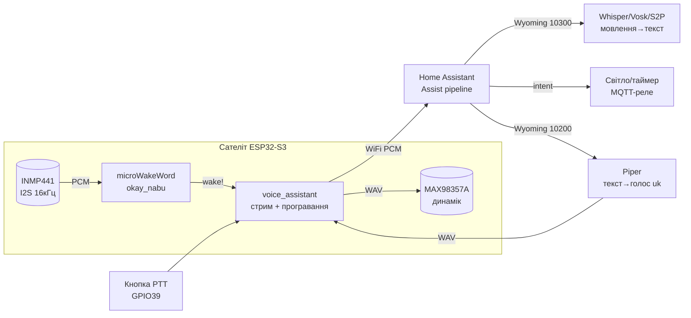

# Голосовий асистент на ESP32 - microWakeWord → Assist → Wyoming → Piper TTS

> [!info] Призначення
> Нотатка про повний голосовий конвеєр: **microWakeWord** слухає wake word прямо на ESP32 → аудіо летить у **Home Assistant Assist** → **Wyoming-протокол** роздає задачі сервісам → **Piper TTS** озвучує відповідь назад на динамік → **STT** (faster-whisper/Vosk) на сервері розпізнає фразу. Плюс: порівняння wake-двигунів (Porcupine/Rhino/Cobra/OpenWakeWord), готова прошивка **ESPHome voice + Atom Echo**, оглядово **VoIP/SIP-домофон** та **intercom ESP32↔ESP32**, чесна розмова про **приватність** (все локально vs хмара). Офлайн-команди без сервера - [[12-Moduli-zvyazku/16-Offline-Voice]], нейромережі на чипі - [[12-Moduli-zvyazku/11-TinyML-Voice]].

Огляд мережі: [[05-Radio/01-WiFi-STA-AP]], звук [[04-Shini/04-I2S|I2S]], команди в будинок [[15-Protokoli/01-MQTT|MQTT]], старт [[Home]].

## Призначення

Коротко: перетворити ESP32 з мікрофоном і динаміком на голосовий пульт розумного будинку - «увімкни світло у вітальні», «постав таймер», «яка температура». ESP32 тут - лише «вуха і рот» (сателіт): слухає wake word, стримить аудіо, грає відповідь. Думає - Home Assistant із сервісами.

| Параметр | Значення |
| --- | --- |
| Транспорт | WiFi (сателіт ↔ HA), Wyoming TCP (HA ↔ сервіси STT/TTS/wake) |
| Аудіоформат | 16 кГц, 16 біт, моно (скрізь однаково - від мікрофона до Whisper) |
| Залізо сателіта | ESP32-S3 (рекомендовано, PSRAM) або ESP32 + I2S-мікрофон/динамік; готовий Atom Echo |
| Сервер | Home Assistant OS (RPi 4 мінімум для Piper; x86/NUC для Whisper) |
| Хмара | Не потрібна взагалі (повністю локальний варіант) або HA Cloud (найпростіший старт) |
| Мови | Українська - Whisper + Piper `uk_*` голоси; wake word - тренується окремо |

Коли брати цей конвеєр:

- треба вільне мовлення, а не 15 фіксованих команд;
- будинок уже на Home Assistant і хочеться «поговорити» з сутностями;
- приватність: нічого не летить у хмару (лікарня, офіс, дитяча).

Коли НЕ брати:

- немає сервера 24/7 - беріть офлайн-модулі [[12-Moduli-zvyazku/16-Offline-Voice]];
- треба реакція <300 мс на одну кнопку-команду - швидше GPIO/BLE-пульт;
- лише українські фіксовані команди і нуль WiFi - SU-61T/SYN7318 дешевші.

## Характеристики

| Ланка конвеєра | Де виконується | Що робить | Типова затримка | Пам'ять/вимоги |
| --- | --- | --- | --- | --- |
| microWakeWord | ESP32-S3 (на пристрої!) | Слухає «okay nabu» / «hey jarvis», решту часу мовчить | 200-500 мс до старту стріму | Арена ~23 КБ + PSRAM під аудіо; модель `.tflite` + JSON |
| ESPHome `voice_assistant` | ESP32 (сателіт) | Стримить 16 кГц аудіо в HA, грає відповідь на динамік | Залежить від WiFi (50-200 мс) | ~100 КБ heap на буфери; BLE одночасно НЕ вмикати! |
| Wyoming-протокол | TCP між HA і сервісами | JSON-заголовок + байти аудіо; порти 10300/10400/10500… | <10 мс локально | Один контейнер на сервіс |
| STT faster-whisper | Сервер (CPU/GPU) | Мовлення → текст (open-ended, будь-яка фраза) | 0.5-8 с (див. таблицю VRAM/CPU!) | base/small на CPU; medium+ хоче GPU |
| STT Vosk / Speech-to-Phrase | Сервер (навіть RPi!) | Мовлення → текст зі словника HA (close-ended, швидко) | <1 с на RPi 4 | Модель 50 МБ, RAM ~200 МБ |
| Piper TTS | Сервер (навіть RPi!) | Текст → голос `uk_…` назад на динамік | ~0.6 с генерації на 1 с мови (medium) | RAM ~200-300 МБ |
| Assist intent | Home Assistant | Текст → дія (світло, таймер, скрипт) | <100 мс | - |

![[assets/img/voice-assistant-pipeline-scheme.png|600]]
*Рис. Конвеєр: мікрофон → microWakeWord (ESP32) → WiFi → Assist → Wyoming (STT/TTS) → Piper-голос → динамік.*

## 1. microWakeWord - wake word на самому ESP32

microWakeWord - це TinyML-модель (стримований CNN, ~23 КБ арени), що постійно слухає мікрофон і прокидається тільки на своє слово. Все інше - тиша, телевізор, розмови - ігнорується. Працює на ESP32-S3 без сервера взагалі.

Як це влаштовано:

1. I2S-мікрофон дає потік 16 кГц → спектрограма кроками по 10 мс (`feature_step_size`);
2. модель рахує ймовірність wake word у ковзному вікні (`sliding_window_size: 5`);
3. якщо середнє вище `probability_cutoff` (типово 0.97) - подія `on_wake_word_detected`;
4. ESPHome зупиняє детектор (`stop_after_detection: true`) і починає стрім у HA - щоб не слухати самого себе.

Готові моделі (репозиторій `esphome/micro-wake-word-models`, v2): `okay_nabu`, `hey_jarvis`, `alexa`, `hey_mycroft`. Своє слово («привіт хато») - тренується в Colab-блокноті microWakeWord: 100+ вимов цільового слова + години негативів (шум, телевізор, схожі слова!), на виході `model.tflite` + JSON-маніфест.

> [!tip] VAD проти телевізора
> Додайте VAD-модель (`vad:` у конфігу) - вона відсікає несловесні звуки і ріже хибні спрацювання від музики/TV у 3-5 разів. Поріг VAD тримайте 0.6-0.7, інакше тихе мовлення здалеку губитиметься.

## 2. Home Assistant Assist - мозок конвеєра

Assist - вбудований голосовий асистент HA. Логіка пайплайна (налаштовується в **Налаштування → Голосові асистенти → Додати асистента**):

```text
[Сателіт ESP32] ──WiFi 16кГц──► [Assist pipeline]
                                        │
              ┌─────────────────────────┼─────────────────────────┐
              ▼                         ▼                         ▼
        Wake word                Speech-to-Text              Conversation agent
   (microWakeWord на             (Whisper / Vosk /            (Home Assistant:
    пристрої або                  Speech-to-Phrase)            інтенти світло/таймер/
    openWakeWord на                                        або LLM-персонаж)
    сервері)                         │                         │
              │                      ▼                         ▼
              │               Text-to-Speech ──► сателіт грає відповідь
              │               (Piper uk_UA, medium)
              ▼
        expose devices! (інакше «не знайдено»)
```

Критичні налаштування, без яких «не працює»:

1. **Expose сутностей:** кожне світло/розетка/скрипт - «Налаштування → Голосові асистенти → Expose»; інакше Assist відповість «вибачте, не знайдено».
2. **Зони (Areas):** пристрій прив'язаний до кімнати - «увімкни світло» означає світло *цієї* кімнати (по сателіту!).
3. **Псевдоніми:** «люстра», «бра», «тєлік» - аліаси сутностей українською, інакше Whisper почує, а intent не зрозуміє.
4. `assist_pipeline:` у `configuration.yaml` - якщо асистентів не видно в UI (немає default-конфігу).

## 3. Wyoming-протокол - клей між HA і сервісами

Wyoming - простий TCP-протокол: JSON-заголовок з типом події + опційні байти. Кожен сервіс (Whisper, Piper, openWakeWord) - окремий Wyoming-сервер на своєму порту, HA підключається інтеграцією **Wyoming Protocol** (автовиявлення в локалці!).

| Сервіс | Порт за замовчуванням | Події (спрощено) | Куди ставиться |
| --- | --- | --- | --- |
| faster-whisper | 10300 | `transcribe` → аудіо-чанки → `transcript` (текст + мова + ймовірність) | Add-on / Docker на сервері |
| Piper | 10200 | `synthesize` (текст + голос `uk_UA-…-medium`) → WAV-чанки 22050 Гц | Add-on / Docker (навіть RPi!) |
| openWakeWord | 10400 | `detect` → аудіо → `detection` (слово + мітка часу) | Add-on / Docker |
| Speech-to-Phrase | 10300 (замість Whisper) | ті ж `transcribe`/`transcript`, але словник = ваші сутності HA | Add-on + токен HA WebSocket |

Формат кадру (концепт, повна спека - `rhasspy3/docs/wyoming.md`):

```text
TCP-пакет:  {"type": "audio-start", "data": {"rate": 16000, "width": 2, "channels": 1}}\n
            <сирі PCM-байті 16кГц/16біт/моно чанками ~1024 семпли>
            {"type": "audio-stop"}\n
            ◄── {"type": "transcript", "data": {"text": "увімкни світло"}}\n
```

Чому це зручно: STT може жити на потужному ПК в коморі (`Wyoming Protocol → host: 192.168.1.50:10300`), а HA - на Green. Один Whisper обслуговує 5 сателітів по черзі.

## 4. Piper TTS - голос назад на динамік

Piper - локальна нейронна озвучка (VITS), оптимізована під RPi 4: medium-модель генерує 1.6 с голосу за 1 с. Українські голоси - `uk_UA-ukrainian_…-medium` (жіночий/чоловічий, семпли слухайте на `rhasspy.github.io/piper-samples/`).

Шлях відповіді:

```text
[Assist: "Світло у вітальні увімкнено"]
   ──Wyoming synthesize──► [Piper: текст → WAV 22050 Гц]
   ──WAV по WiFi──► [ESP32: I2S → MAX98357A → динамік 4 Ом]
```

Практика:

- якість `medium` - оптимум (low - роботно, high - вдвічі повільніше);
- довгі відповіді (>30 с) ріжте реченнями - ESP32-буфер стріму обмежений;
- Piper в автоматизаціях: сервіс `tts.speak` → `media_player` сателіта (оголошення «ворота відчинено» без wake word!);
- гучність: `volume_multiplier` у ESPHome (динамік 3W у корпусі голосно верещить на максимумі).

## 5. STT на сервері: faster-whisper vs Vosk (вимоги VRAM/CPU!)

| Модель / рушій | Де біжить | VRAM (GPU) / RAM (CPU) | Швидкість | Українська | Коли брати |
| --- | --- | --- | --- | --- | --- |
| faster-whisper `tiny` | CPU RPi 4 | ~300 МБ RAM | ~8 с на фразу (RPi 4) | Слабка | Тільки тести |
| faster-whisper `base` | CPU RPi 4 / NUC | ~500 МБ RAM | ~4 с / <1 с (NUC) | Задовільна | Мінімум для керування будинком |
| faster-whisper `small` | CPU NUC / GPU 2 ГБ | ~1 ГБ | <1 с | Добра | Оптимум ціни/якості |
| faster-whisper `medium` | GPU 4-5 ГБ (int8: ~3 ГБ) | ~5 ГБ fp16 / ~3 ГБ int8 | ~1 с батчем | Дуже добра | LLM-діалоги, диктування |
| faster-whisper `large-v3` | GPU 6-8 ГБ (int8: ~4.5 ГБ) | ~10 ГБ fp16 | 1-2 с | Найкраща | Максимум точності |
| faster-whisper `distil-large-v3` | GPU 6 ГБ | ~6 ГБ fp16 | Швидше large на ~40% | Як large (EN-оптимізовано!) | EN-будинок, швидкість |
| Vosk `vosk-model-small-uk` | CPU RPi (навіть Zero 2!) | ~50 МБ RAM | Реальний час | Добра (словникова) | Слабке залізо, фіксований словник |
| Vosk server `uk` big | CPU NUC 4+ ядер | ~1.5 ГБ RAM | ~реальний час | Дуже добра | Сервер без GPU |
| Speech-to-Phrase | CPU Green/RPi 4 | ~200 МБ RAM | <1 с | Через шаблони HA | Тільки керування будинком, максимум швидкості |

Правила:

- керування будинком на RPi - Speech-to-Phrase (миттєво) або whisper `base`;
- вільні фрази/українська диктовка - NUC + `small`, бажано GPU;
- int8-квантування (`compute_type="int8"`) ріже VRAM майже вдвічі з втратою ~1% точності - завжди вмикайте на слабких GPU;
- `beam_size=5` за замовчуванням; для швидкості - `beam_size=1` (greedy), −30% часу, −2% точності.

## 6. Wake-двигуни: Porcupine / Rhino / Cobra / OpenWakeWord - порівняння

| Двигун | Де біжить | Що детектить | Українська / кастом | Ліцензія/ціна | ESP32? |
| --- | --- | --- | --- | --- | --- |
| microWakeWord | ESP32-S3 (пристрій!) | 1 wake word | Кастом через Colab (будь-яка мова, треба 100+ семплів) | Apache-2.0, безкоштовно | **Так, основний вибір** |
| OpenWakeWord | Сервер HA (Wyoming 10400) | Кілька wake words | Кастомні моделі спільноти, EN переважно | Apache-2.0, безкоштовно | Ні (аудіо стрімиться завжди!) |
| Porcupine (Picovoice) | RPi/мобілка/MCU (Cortex-M!) | 1-3 wake words, вбудовані + консоль | 9 мов, української немає; кастом - консоль Picovoice | Безкоштовно для особистого; AccessKey обов'язковий | Так (C-бібліотека, але НЕ через ESPHome voice!) |
| Rhino (Picovoice) | Те саме | Speech-to-Intent (команда → намір, без STT!) | EN/DE/FR/ES…, української немає | Як Porcupine | MCU так, ESP32 - руками |
| Cobra (Picovoice) | Те саме | VAD (є голос / немає) | Мовонезалежний | Як Porcupine | Так (легкий) |
| ESP-SR WakeNet | ESP32/S3 (пристрій!) | «Hi ESP» + MultiNet-команди | EN/CN з коробки | Espressif, безкоштовно | **Так, альтернатива microWakeWord** |

Висновок для ESP32+HA: wake word - **microWakeWord** (безкоштовно, інтегровано в ESPHome, українське слово тренується). OpenWakeWord - якщо сателіт слабкий (ESP32 без S3) і готові гнати аудіо на сервер постійно. Porcupine/Rhino - якщо будуєте власний C-проєкт без HA взагалі.

## 7. ESPHome voice + Atom Echo - готова прошивка

M5Stack Atom Echo (~$13): ESP32-PICO + мікрофон + кнопка + Grove-роз'єм, динаміка немає з коробки (допаяти 2W через Grove або взяти Atom Echo + зовнішній SPK). Офіційний готовий YAML - `esphome/voice-kit` / майстер прошивок HA («$13 voice remote»): прошивається з браузера через ESPHome Web, далі тільки WiFi-дані.

Мінімальний YAML сателіта (S3 + INMP441 + MAX98357A):

```yaml
esphome:
  name: kitchen-satellite
esp32:
  board: esp32-s3-devkitc-1
  framework:
    type: esp-idf
psram:
  mode: octal
  speed: 80MHz

wifi:
  ssid: !secret wifi_ssid
  password: !secret wifi_password
api:
  encryption:
    key: !secret api_key

i2s_audio:
  - id: i2s_in
    i2s_lrclk_pin: GPIO5    # WS мікрофона
    i2s_bck_pin: GPIO6     # BCK
  - id: i2s_out
    i2s_lrclk_pin: GPIO15  # WS динаміка
    i2s_bck_pin: GPIO14

microphone:
  - platform: i2s_audio
    id: mic
    i2s_audio_id: i2s_in
    adc_type: external
    i2s_din_pin: GPIO4
    channel: left

speaker:
  - platform: i2s_audio
    id: spk
    i2s_audio_id: i2s_out
    dac_type: external
    i2s_dout_pin: GPIO22
    mode: mono

micro_wake_word:
  microphone:
    microphone: mic
    channels: 0
    gain_factor: 4
  vad:
  models:
    - model: okay_nabu
      id: okay_nabu_model

voice_assistant:
  microphone:
    microphone: mic
    channels: 0
    gain_factor: 4
  speaker: spk
  use_wake_word: true
  micro_wake_word: okay_nabu_model
  noise_suppression_level: 2
  auto_gain: 31dBFS
  volume_multiplier: 2.0
  on_tts_end:
    - homeassistant.service:
        service: persistent_notification.create
        data:
          message: !lambda 'return "Сателіт сказав: " + x;'

binary_sensor:
  - platform: gpio  # Push-to-talk кнопка (Atom Echo: GPIO39!)
    pin:
      number: GPIO39
      inverted: true
    on_press:
      - voice_assistant.start:
          silence_detection: false
    on_release:
      - voice_assistant.stop:
```

> [!warning] Аудіо + BLE = краш!
> Voice-компоненти з'їдають RAM/CPU: одночасний Bluetooth-proxy на тому ж ESP32 майже гарантовано роняє прошивку. Сателіт - тільки голос; BLE-трекер - окремий чіп. Див. Troubleshooting ESPHome (backtrace через `esp-idf`).

## 8. VoIP / SIP-домофон - оглядово (UDP-потік, затримка!)

Домофон = той же голос, але розмова людина↔людина через SIP-сервер (Asterisk/FreePBX) або безпосередньо. ESP32 виступає SIP-клієнтом (бібліотеки `esp-sip`, проєкти `esphone`, `SIP-Doorbell`).

```text
[Кнопка біля хвіртки] → ESP32: INVITE → [Asterisk 192.168.1.5]
   → UDP/RTP-потік G.711 (8 кГц, 64 кбіт/с!) ↔ телефон у кишені
   → DTMF «5» → ESP32 відкриває замок (GPIO)
```

Числа, які треба знати:

| Параметр | Значення | Примітка |
| --- | --- | --- |
| Кодек ESP32 | G.711 μ-law/A-law (8 кГц) | Opus на ESP32 - ні (див. розділ 9!) |
| Трафік | ~80 кбіт/с з заголовками (20 мс пакети) | WiFi тягне легко; джитер-буфер 100-200 мс |
| Затримка | 200-600 мс (кодек + буфер + WiFi) | Говорити по черзі, не перебивати! |
| Реєстрація | SIP REGISTER кожні 60-300 с | Без перереєстрації вхідні дзвінки пропадуть |
| Живлення | Дзвінок будить ESP32 з light-sleep по кнопці | Постійний RTP-стрім батарею з'їсть за години |

Це огляд: повний SIP-стек (SDP, NAT, STUN) - тема окремої ноти і окремого сервера. Для «подзвонити з хвіртки на телефон» простіше готовий Grandstream + ESP32-тільки-замок.

## 9. Intercom ESP32↔ESP32 - I2S→UDP (Opus? opus на ESP32 важко - чесно!)

Ідея: два ESP32 з мікрофоном і динаміком, кнопка PTT - голос летить по UDP в локалці без сервера взагалі. Реально працює на сирому PCM/ADPCM; Opus - пастка.

| Варіант кодека | Бітрейт | CPU ESP32 | RAM | Вердикт |
| --- | --- | --- | --- | --- |
| PCM 16 кГц/16 біт | 256 кбіт/с | ~0% (прямий DMA→UDP) | 2×4 КБ буфери | **Працює.** Локалка тягне 2-3 пари одночасно |
| ADPCM (IMA, 4 біт) | 64 кбіт/с | ~5% (табличний кодер) | +1 КБ | Працює, якість «рація» - для домофона ок |
| G.711 | 64 кбіт/с | ~3% | +1 КБ | Працює, сумісно з SIP! |
| Opus | 16-32 кбіт/с | **НЕ ВЛІЗАЄ стабільно**: енкодер ~40-60 МГц + ~100 КБ RAM + float, конфліктує з WiFi-стеком на одному ядрі | - | **Чесно: не беріть.** Є експерименти на S3 (16 кГц, mono, complexity 0), але джиттер і дропи. Хочете Opus - ставте сервер (Janus/Mumble) і гоніть PCM до нього |

Схема PTT-інтеркома (PCM/UDP broadcast):

```text
[ESP32-A: INMP441 → I2S 16кГц] ──UDP:5004 broadcast──► [ESP32-B: UDP → MAX98357A]
[ESP32-B: INMP441 → I2S 16кГц] ──UDP:5005 broadcast──► [ESP32-A: UDP → MAX98357A]
Кнопка PTT: поки затиснута — TX; відпустив — RX (half-duplex, без AEC!)
```

Full-duplex (говорити одночасно) вимагає AEC (див. ESP-SR AFE, [[12-Moduli-zvyazku/11-TinyML-Voice]]) - на двох ESP32 через WiFi з джиттером це не злітає. Half-duplex + PTT - робоча схема для гаража/дачі.

## 10. Приватність: все локально vs хмара

| Режим | Що куди летить | Затримка | Ціна | Коли |
| --- | --- | --- | --- | --- |
| Все локально (microWakeWord + Whisper/S2P + Piper) | Нічого не покидає LAN | 1-3 с | Сервер 24/7 (RPi/NUC) | Дім, офіс, вимоги GDPR/лікарня |
| HA Cloud (Nabu Casa, ~$6/міс) | Аудіо → хмара Nabu Casa → текст назад | 1-2 с | Підписка, нуль адміністрування | Старт за 10 хв, підтримка розробки HA |
| LLM-персонаж локально (Ollama) | Текст → локальна LLM (Llama 3 8B) | 5-30 с | GPU 8+ ГБ VRAM | Жарти/діалоги без хмари |
| LLM-персонаж хмарою (OpenAI/Gemini) | Текст → API | 2-5 с | $/токени + дані в хмарі | «Поговори як Маріо», складні питання |
| Alexa/Google-колонка | Все у вендора | ~1 с | $0 + ваші дані | Не ця нотатка взагалі |

Мінімум приватності навіть у локальному режимі: окремий IoT-VLAN для сателітів, пароль API ESPHome не в гіті (`!secret`), логи HA без аудіо (зберігаються тільки тексти транскриптів), мікрофонний MUTE-вимикач (фізична кнопка `micro_wake_word.stop` + LED-індикатор запису!).

## Легенда пінів модулів сателіта

### M5Stack Atom Echo (готове, нічого паяти для старту)

| Пін / елемент Atom Echo | Призначення | Примітка в ESPHome |
| --- | --- | --- |
| ESP32-PICO-D4 | Мозок (4 МБ flash, без PSRAM!) | Тільки `voice_assistant`, microWakeWord на ньому НЕ влізе - wake на сервері (openWakeWord) або кнопка! |
| Мікрофон (I2S, вбудований) | Вхід | `i2s_audio` готовий пресет `m5stack-atom-echo.yaml` |
| Кнопка (GPIO39) | Push-to-talk | `on_press → voice_assistant.start` (див. YAML вище) |
| RGB LED (SK6812, GPIO27) | Статус (слухає/думає/говорить) | `on_listening/on_stt_end/on_tts_start` - різні кольори |
| Grove (GPIO32/26: SDA/SCL + 5V/GND) | Зовнішній динамік/датчики | Динамік - через I2S-ЦАП, не безпосередньо! |
| USB-C | Живлення + прошивка | 5V 500 мА достатньо |

### Саморобний сателіт S3 + INMP441 + MAX98357A (повний цикл з microWakeWord)

| Модуль / пін | Куди на ESP32-S3 | Примітка |
| --- | --- | --- |
| INMP441 VDD/GND | 3V3 / GND (+100 нФ) | Тільки 3.3V |
| INMP441 SD / WS / SCK | GPIO4 / GPIO5 / GPIO6 | I2S RX 16 кГц, <10 см |
| INMP441 L/R | GND (Left) | - |
| MAX98357A VIN/GND | 5V окремо! / GND спільний | Піки 1A+ - не з 3V3 ESP32! |
| MAX98357A BCLK / LRCK / DIN | GPIO14 / GPIO15 / GPIO22 | I2S TX; BCLK/LRCK можна спільні з мікрофоном за частотою |
| MAX98357A GAIN | GND (12 dB) / NC (9 dB) | 12 dB у кімнаті верещить - ставте 9 dB |
| Динамік 4 Ом 3W | Вихід MAX98357A | У корпус з фазоінвертором, подалі від мікрофона 10 см+ (заводка!) |
| Кнопка PTT/MUTE | GPIO39/0 + GND | MUTE: `micro_wake_word.stop` + червоний LED |

## Схема підключення

| ESP32-S3 DevKit | INMP441 | MAX98357A | Кнопка/LED | Примітка |
| --- | --- | --- | --- | --- |
| 3V3 | VDD (+100 нФ) | - (SD_MODE→GND!) | LED-анод через 220 Ом | - |
| 5V (VIN, окремий БЖ 2A) | - | VIN | - | Піки динаміка 1A+ |
| GND | GND | GND | GND | Зірка, товстий дріт до підсилювача |
| GPIO4 | SD | - | - | I2S DIN |
| GPIO5 | WS | - | - | I2S WS (можна спільний) |
| GPIO6 | SCK | - | - | I2S BCK |
| GPIO22 | - | DIN | - | I2S DOUT |
| GPIO15/14 | - | LRCK/BCLK | - | I2S TX-клок |
| GPIO39 | - | - | Кнопка PTT → GND | Внутрішній pull-up |
| GPIO27 | - | - | Статус-LED | Слухає=зелений, думає=синій, помилка=червоний |

> [!warning] Заводка мікрофон↔динамік
> Динамік-відповідь потрапляє назад у мікрофон → Assist «чує сам себе» → цикл. Ліки: динамік і мікрофон на протилежних стінках корпусу 10 см+, `noise_suppression_level: 2`, AEC (ESP-SR AFE) для просунутих, гучність не вище 70%.

### ASCII-схема

```text
ESP32-S3 DevKit                  INMP441 (I2S-мікрофон)
─────────────                    ──────────────────────
3V3 ───[100нФ]─────────────────► VDD
GND ───────────────────────────  GND (коротко!)
GPIO4 ◄────────────────────────  SD (16кГц/16біт)
GPIO5 ─────────────────────────► WS
GPIO6 ─────────────────────────► SCK
GND ───────────────────────────  L/R (=Left)

ESP32-S3                         MAX98357A (I2S-підсилювач)
────────                         ─────────────────────────
5V (БЖ 2A!) ───────────────────► VIN (піки 1A+!)
GND (товстий!) ─────────────────  GND
GPIO22 ────────────────────────► DIN
GPIO15 ────────────────────────► LRCK
GPIO14 ────────────────────────► BCLK
GND ───────────────────────────  GAIN (=9dB, не верещить)
                                 SPK+ / SPK− ──► Динамік 4Ом 3W
                                 (10см+ від мікрофона!)

GPIO39 ──[кнопка]──► GND (PTT/MUTE)      GPIO27 ──[220]──► LED статус
         │ WiFi 16кГц PCM                │
         ▼                               ▼
   Home Assistant (Assist → Wyoming 10300/10200 → Whisper/Piper)
```

### Mermaid



## Код ESP-IDF (сателіт: I2S-мікрофон → TCP-стрим → I2S-динамік, концепт)

```c
// Концепт: повний Wyoming-клієнт — це ~500 рядків (сокети, перепідключення,
// чанки). Тут каркас I2S duplex + TCP-стрим; протокол див. розділ 3.
#include "driver/i2s.h"
#include "esp_log.h"
#include "lwip/sockets.h"
#define MIC_BCK 6
#define MIC_WS 5
#define MIC_DIN 4
#define SPK_BCK 14
#define SPK_WS 15
#define SPK_DOUT 22
#define SERVER_IP "192.168.1.10"
#define WYOMING_STT_PORT 10300

static void i2s_init(void) {
    // RX: мікрофон 16 кГц/16 біт/моно.
    i2s_config_t rx = { .mode = (i2s_mode_t)(I2S_MODE_MASTER | I2S_MODE_RX),
        .sample_rate = 16000, .bits_per_sample = I2S_BITS_PER_SAMPLE_16BIT,
        .channel_format = I2S_CHANNEL_FMT_ONLY_LEFT,
        .communication_format = I2S_COMM_FORMAT_STAND_I2S,
        .dma_buf_count = 4, .dma_buf_len = 512, .use_apll = false,
        .tx_desc_auto_clear = false, .fixed_mclk = 0 };
    i2s_pin_config_t rxp = { .bck_io_num = MIC_BCK, .ws_io_num = MIC_WS,
        .data_out_num = -1, .data_in_num = MIC_DIN };
    i2s_driver_install(I2S_NUM_0, &rx, 0, NULL);
    i2s_set_pin(I2S_NUM_0, &rxp);
    // TX: динамік 22050 Гц (Piper!) / 16 біт/моно.
    i2s_config_t tx = rx;
    tx.mode = (i2s_mode_t)(I2S_MODE_MASTER | I2S_MODE_TX);
    tx.sample_rate = 22050;
    i2s_pin_config_t txp = { .bck_io_num = SPK_BCK, .ws_io_num = SPK_WS,
        .data_out_num = SPK_DOUT, .data_in_num = -1 };
    i2s_driver_install(I2S_NUM_1, &tx, 0, NULL);
    i2s_set_pin(I2S_NUM_1, &txp);
}

static void stream_task(void *a) {
    int s = socket(AF_INET, SOCK_STREAM, 0);
    struct sockaddr_in d = { .sin_family = AF_INET,
        .sin_port = htons(WYOMING_STT_PORT) };
    inet_pton(AF_INET, SERVER_IP, &d.sin_addr);
    if (connect(s, (void *)&d, sizeof(d)) != 0) {
        ESP_LOGE("SAT", "нема Wyoming/STT"); vTaskDelete(NULL);
    }
    const char *start = "{\"type\":\"audio-start\","
        "\"data\":{\"rate\":16000,\"width\":2,\"channels\":1}}\n";
    send(s, start, strlen(start), 0);
    int16_t buf[1024]; size_t n;
    for (int i = 0; i < 500; i++) { // ~10 с фрази
        i2s_read(I2S_NUM_0, buf, sizeof(buf), &n, portMAX_DELAY);
        send(s, buf, n, 0); // тут мають бути Wyoming-чанки з довжиною!
    }
    const char *stop = "{\"type\":\"audio-stop\"}\n";
    send(s, stop, strlen(stop), 0);
    // TODO: прочитати {"type":"transcript"...} і показати/озвучити.
    close(s); vTaskDelete(NULL);
}

void app_main(void) {
    i2s_init();
    // TODO: WiFi STA connect → xTaskCreate(stream_task) по кнопці/GPIO.
    // Продакшн: беріть ESPHome voice_assistant — там це все готове!
}
```

## Код Arduino (сателіт: I2S читання + UDP-стрим на сервер, концепт)

```cpp
#include <WiFi.h>
#include <WiFiUdp.h>
#include <driver/i2s.h>
#define MIC_BCK 6
#define MIC_WS 5
#define MIC_DIN 4
#define SPK_DOUT 22
#define PTT 39
const char *SSID = "IoT";
const char *PASS = "SECRET";
const char *SRV = "192.168.1.10";
const int PORT = 5004; // UDP-порт приймача на сервері
WiFiUDP udp;

void setup() {
  Serial.begin(115200);
  pinMode(PTT, INPUT_PULLUP);
  WiFi.begin(SSID, PASS);
  while (WiFi.status() != WL_CONNECTED) delay(300);
  Serial.println(WiFi.localIP());
  i2s_config_t c = {.mode = (i2s_mode_t)(I2S_MODE_MASTER | I2S_MODE_RX),
    .sample_rate = 16000, .bits_per_sample = I2S_BITS_PER_SAMPLE_16BIT,
    .channel_format = I2S_CHANNEL_FMT_ONLY_LEFT,
    .communication_format = I2S_COMM_FORMAT_I2S,
    .intr_alloc_flags = 0, .dma_buf_count = 4, .dma_buf_len = 512,
    .use_apll = false};
  i2s_pin_config_t p = {.bck_io_num = MIC_BCK, .ws_io_num = MIC_WS,
    .data_out_num = -1, .data_in_num = MIC_DIN};
  i2s_driver_install(I2S_NUM_0, &c, 0, NULL);
  i2s_set_pin(I2S_NUM_0, &p);
}

void loop() {
  // PTT: затиснув — стримлю PCM по UDP; відпустив — мовчу.
  static int16_t buf[512];
  size_t n;
  if (digitalRead(PTT) == LOW) {
    i2s_read(I2S_NUM_0, buf, sizeof(buf), &n, 100 / portTICK_PERIOD_MS);
    if (n > 0) {
      udp.beginPacket(SRV, PORT);
      udp.write((uint8_t *)buf, n);
      udp.endPacket();
    }
  } else {
    delay(20); // відпочинок: без PTT ефір мовчить (приватність!)
  }
}
// Серверна сторона: python приймає UDP → faster-whisper → Piper →
// відповідь назад (див. MicroPython-приклад нижче і розділ 5).
```

## Код MicroPython (PTT-інтерком ESP32↔ESP32 по UDP + серверний пайплайн)

```python
# Частина A: PTT-інтерком (однаковий код на обох ESP32, різні порти!).
import network, socket
from machine import I2S, Pin
import time

MY_TX_PORT = 5004    # куди шлю (порт партнера)
MY_RX_PORT = 5005    # де слухаю (у партнера навпаки!)
PEER = "192.168.1.42"

sta = network.WLAN(network.STA_IF)
sta.active(True); sta.connect("IoT", "SECRET")
while not sta.isconnected(): time.sleep(0.3)
print("IP:", sta.ifconfig()[0])

mic = I2S(0, sck=Pin(6), ws=Pin(5), sd=Pin(4),
          mode=I2S.RX, bits=16, format=I2S.MONO, rate=16000, ibuf=4096)
spk = I2S(1, sck=Pin(14), ws=Pin(15), sd=Pin(22),
          mode=I2S.TX, bits=16, format=I2S.MONO, rate=16000, ibuf=4096)
ptt = Pin(39, Pin.IN, Pin.PULL_UP)
led = Pin(27, Pin.OUT)

tx = socket.socket(socket.AF_INET, socket.SOCK_DGRAM)
rx = socket.socket(socket.AF_INET, socket.SOCK_DGRAM)
rx.bind(("0.0.0.0", MY_RX_PORT))
rx.settimeout(0.02)
buf = bytearray(2048)

while True:
    if ptt.value() == 0:  # PTT затиснуто: TX (half-duplex!)
        led.on()
        n = mic.readinto(buf)
        if n:
            tx.sendto(buf[:n], (PEER, MY_TX_PORT))
    else:                 # PTT відпущено: RX
        led.off()
        try:
            data, _ = rx.recvfrom(2048)
            spk.write(data)  # сирий PCM 16кГц — той самий формат!
        except OSError:
            pass  # таймаут — тиша в ефірі, це нормально
```

```python
# Частина B: серверний пайплайн (запускається на ПК/NUC, не на ESP32!).
# UDP-прийом → faster-whisper tiny/base → Piper → WAV назад.
# pip install faster-whisper piper-tts
import socket
from faster_whisper import WhisperModel

stt = WhisperModel("base", device="cpu", compute_type="int8")
print("STT готова (base/int8/CPU)")

s = socket.socket(socket.AF_INET, socket.SOCK_DGRAM)
s.bind(("0.0.0.0", 5004))
frames = []
while True:
    data, addr = s.recvfrom(4096)
    frames.append(data)
    # 2 с аудіо (16кГц*2байт*2с = 64000 байт) → транскрипція.
    if sum(len(f) for f in frames) >= 64000:
        raw = b"".join(frames); frames = []
        with open("/tmp/phrase.raw", "wb") as f:
            f.write(raw)
        segs, _ = stt.transcribe("/tmp/phrase.raw", beam_size=1,
                                 language="uk")
        text = " ".join(s.text for s in segs).strip()
        print("Почуто:", text)
        # Далі: Home Assistant webhook / Piper:
        # echo "<text>" | piper --model uk_UA-medium.onnx --output_file out.wav
```

Детальніше про середовища: [[00-Start/05-Vibir-seredovischa|Вибір середовища]].

## Типові помилки

| # | Симптом | Причина | Виправлення |
| --- | --- | --- | --- |
| 1 | Сателіт видно в ESPHome, але Assist його не чує | `voice_assistant` без `microphone:` або `use_wake_word: false` без кнопки | Додати мікрофон і `use_wake_word: true` + прив'язаний `micro_wake_word`; або PTT-кнопку |
| 2 | Краш/ребут при старті voice | Немає PSRAM на платі (звичайний ESP32-WROOM / Atom Echo!) | microWakeWord - тільки S3 з PSRAM; на без-PSRAM - wake на сервері (openWakeWord) або кнопка |
| 3 | Краш при одночасному BLE + voice | Аудіо з'їдає heap, BLE-стек не влізає | Прибрати `bluetooth_proxy` з сателіта; BLE - окремий чіп |
| 4 | Whisper 8+ с на RPi 4 | Модель `small/medium` на слабкому CPU | `tiny/base` або Speech-to-Phrase для команд; важкі моделі - на NUC/GPU |
| 5 | «Вибачте, не знайдено» на кожну команду | Сутності не exposed, немає зон/аліасів | Expose + Area + аліаси українською; перевірити вбудовані речення Assist |
| 6 | Асистентів немає в UI взагалі | Немає default-конфігу | Додати `assist_pipeline:` у `configuration.yaml`, перезапустити HA |
| 7 | Wyoming-сервіс не знаходиться | Сервіс не в тій підмережі / порт закритий / контейнер не стартував | Один LAN/VLAN; `telnet host 10300`; логи add-on; ручне додавання IP:порт |
| 8 | Piper говорить англійською замість української | Обрано голос `en_*` у пайплайні | У пайплайні TTS обрати `uk_UA-…-medium`; перевірити `language: uk` |
| 9 | Сателіт чує сам себе (цикл відповідей) | Динамік поруч з мікрофоном, гучність 100% | 10 см+ між ними; `noise_suppression_level: 2`; гучність ≤70%; AEC для просунутих |
| 10 | Хибні спрацювання на телевізор | Немає VAD, поріг wake низький | Додати `vad:`; `probability_cutoff` 0.97+; сателіт подалі від TV |
| 11 | UDP-інтерком хрипить/рветься | WiFi-джиттер, малі буфери, PCM 256 кбіт/с на межі | `ibuf=8192`; half-duplex PTT; ADPCM/G.711 замість PCM; точки доступу ближче |
| 12 | Opus на ESP32 тріщить і дропає | Енкодер не влізає в CPU/RAM поруч з WiFi | Не використовувати Opus на ESP32 (див. розділ 9); PCM/ADPCM або серверний транскод |
| 13 | SIP-дзвінок проходить, але тиша | NAT/RTP-порти закриті, не той кодек (запит Opus!) | G.711 обов'язково; STUN/проброс RTP-діапазону; SDP звірити з Asterisk-логами |
| 14 | MicroPython пише з клацаннями | `ibuf` малий, GC-паузи під час `write` | `ibuf=4096+`; `mic.readinto` блоками 2048; важке - винести в окремий потік/`_thread` |

## Офіційні джерела

- [Home Assistant Assist - голосове керування будинком](https://www.home-assistant.io/voice_control/) - концепція Assist, сателіти, мови (включно з українською).
- [Локальний Assist-пайплайн: Whisper + Piper без хмари](https://www.home-assistant.io/voice_control/voice_remote_local_assistant/) - покрокове встановлення STT/TTS add-on'ів, Speech-to-Phrase vs Whisper.
- [Wyoming Protocol - інтеграція](https://www.home-assistant.io/integrations/wyoming/) - як HA підключає зовнішні STT/TTS/wake-сервіси, порти, автовиявлення.
- [ESPHome micro_wake_word - wake word на пристрої](https://esphome.io/components/micro_wake_word.html) - моделі `okay_nabu`, VAD, `probability_cutoff`, JSON-маніфест.
- [ESPHome voice_assistant - сателіт](https://esphome.io/components/voice_assistant.html) - мікрофон/динамік, `noise_suppression_level`, PTT, таймери, події `on_stt_end/on_tts_end`.
- [ESP-SR - WakeNet/MultiNet/AFE від Espressif](https://github.com/espressif/esp-sr) - альтернатива microWakeWord + AEC для full-duplex.
- [ESP-Skainet - приклади голосового асистента Espressif](https://github.com/espressif/esp-skainet) - `wake_word_detection`, команди MultiNet7.
- [faster-whisper - швидкий STT (CTranslate2, int8, бенчмарки VRAM)](https://github.com/SYSTRAN/faster-whisper) - моделі tiny→large-v3, вимоги CPU/GPU.
- [Piper - локальний нейронний TTS](https://github.com/rhasspy/piper) - голоси, семпли, оптимізація під RPi 4.
- [Speech-to-Phrase - швидкий локальний STT під сутності HA](https://github.com/OHF-Voice/speech-to-phrase) - close-ended розпізнавання <1 с на RPi.
- [Porcupine - wake word двигун Picovoice](https://github.com/Picovoice/porcupine) - MCU/RPi/мобілка, чутливість, кастомні слова через консоль.
- [Vosk - офлайн STT (українська модель included)](https://alphacephei.com/vosk/) - легкі моделі 50 МБ для слабкого заліза.

## Див. також

- [[Home]]
- [[15-Protokoli/01-MQTT|MQTT]] - команди Assist → реле/датчики по топіках
- [[05-Radio/01-WiFi-STA-AP|WiFi STA/AP]] - без стабільного WiFi стрім 16 кГц рветься
- [[04-Shini/04-I2S|I2S]] - INMP441 + MAX98357A, формати 16 кГц/16 біт
- [[12-Moduli-zvyazku/11-TinyML-Voice|TinyML/Голос]] - ESP-SR, WakeNet, нейромережі на S3
- [[12-Moduli-zvyazku/16-Offline-Voice|Offline-Voice]] - LD3320/SU-61T/SYN7318: команди без сервера взагалі
- [[01-Hardware/03-ESP32-S3|ESP32-S3]] - PSRAM під wake word і буфери
- [[15-Protokoli/03-mDNS-NTP-TLS|mDNS/NTP/TLS]] - пошук Wyoming-сервісів у LAN, час для TLS
