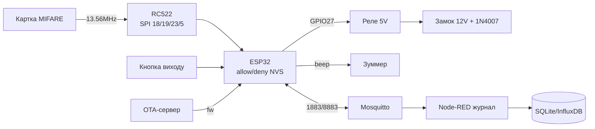

# Проєкт 3 - Контроль доступу: RC522 + реле + MQTT + OTA + чорний список в NVS

![[assets/img/cookbook-access-scheme.png|600]]
*Рис. СКУД: ESP32 + RC522 (SPI) + реле замка + MQTT + OTA, списки в NVS.*

> [!tip] Що будуємо
> Дверний контролер: приклав картку MIFARE → перевірка білого/чорного списку → клацання реле замка → подія в MQTT. Списки живуть у NVS (працює без мережі), оновлюються через MQTT, прошивка - через OTA. База: [[12-Moduli-zvyazku/01-RC522-RFID|RC522]], [[11-Vivid/03-NeoPixel-Servo-Rele-MOSFET|Реле]], [[15-Protokoli/01-MQTT|MQTT]], [[08-Pamyat/03-OTA|OTA]], [[08-Pamyat/01-Partitions-NVS|NVS]].

## 1. Мета

Замінити китайський standalone-контролер на свій: з журналом, віддаленим керуванням і бекапом карток.

Сценарії:

- офіс/під'їзд: 50 карток, журнал `access/event` у MQTT;
- майстерня: чорний список звільнених - двері не відкриються навіть без мережі;
- оренда: тимчасові картки з `valid_until`, гість сам не продовжить.

Вимоги:

- відкриття < 1 с від прикладання;
- без мережі - працює за кешем NVS мінімум 200 UID;
- чорний список має пріоритет над білим;
- OTA без фізичного доступу (див. [[08-Pamyat/03-OTA|OTA]]).

| Параметр | Ціль | Перевірка |
| --- | --- | --- |
| Зчитувач | RC522 13.56 МГц, MIFARE Classic/Ultralight | UID за 300 мс |
| Виконавець | Реле 5V + електрозамок 12V | клацання + журнал |
| Списки | NVS: allow[200], deny[50], TTL | перезавантаження тримає |
| Uplink | `access/event` QoS 1 + LWT | sub у Node-RED |
| Керування | `access/cmd add/del/sync` QoS 1 | тест з консолі |
| Оновлення | OTA по `access/fw` | rollback при битій |

> [!warning] RC522 ≠ безпека банку!
> UID MIFARE Classic клонується за $5. Для чутливих дверей - DESFire / NFC з challenge-response (див. [[12-Moduli-zvyazku/05-PN532-RDM6300-Fingerprint-GM65|NFC]]). RC522 - від чесних людей і обліку.

## 2. BOM - комплектуючі

| Компонент | Нота довідника | Ціна, орієнтовно |
| --- | --- | --- |
| ESP32 DevKit (WROOM-32) | [[00-Start/04-Devkit-plati | DevKit]] | $6 |
| RC522 модуль 13.56 МГц | [[12-Moduli-zvyazku/01-RC522-RFID | RC522]] | $2 |
| Реле-модуль 5V (opto, LOW-trigger) | [[11-Vivid/03-NeoPixel-Servo-Rele-MOSFET | Реле]] | $2 |
| Електрозамок 12V + БЖ 12V 2A | [[11-Vivid/07-BTS7960-L9110S-SSR-Solenoid | Силові]] | $20 |
| Діод 1N4007 паралельно замку | [[11-Vivid/07-BTS7960-L9110S-SSR-Solenoid | Силові]] | $0.2 |
| Зуммер + LED червоний/зелений | [[11-Vivid/04-L298N-TB6612-A4988-Buzzer | Звук]] | $1 |
| Кнопка виходу (норм.-розімкн.) | [[03-GPIO/04-Pererivannya-PWM | GPIO]] | $1 |
| БЖ 5V 2A для ESP32+реле | [[02-Zhivlennya/02-LDO-DC-DC | LDO]] | $5 |
| Корпус + кабель UTP до зчитувача | [[99-Dodatki/03-Cheklisti-montazhu | Чек-листи]] | $4 |

Разом: ~$41 + замок.

Що НЕ робити:

- живити замок з того ж 5V ESP32 - тільки окремий 12V + спільний GND через оптрон;
- RC522 на 5V - тільки 3.3V + конд. 10 мкФ (див. [[12-Moduli-zvyazku/01-RC522-RFID|RC522]]);
- сигнальні SPI довше 20 см без екрану - перенести ESP32 ближче до дверей.

## 3. Архітектура

### ASCII-схема

```text
              ДВЕРІ (контролер всередині!)
     +-------------------------------------------+
     |  ESP32 VSPI: SCK 18 / MOSI 23 / MISO 19   |
     |  RC522 (зовні): SS 5 / RST 22 / 3.3V!    |
     |                                           |
     |  Кнопка виходу --> GPIO34 (внут.)         |
     |  Зуммер --> GPIO25   LED_G --> GPIO26     |
     |  Реле IN --> GPIO27 (LOW-trigger)         |
     |  Реле COM/NO --> замок 12V + 1N4007      |
     +-------------------------------------------+
            | WiFi --> MQTT 1883/8883
            v
     access/event (QoS1) <-- журнал: uid, verdict, rssi
     access/cmd   (QoS1) --> add/del/sync/fw
     access/state (retain) - online + кількість карток
```

### Mermaid



Топіки (див. [[15-Protokoli/01-MQTT|MQTT]]):

```text
access/door-01/event   <- {"uid":"A1B2C3D4","verdict":"allow","src":"nvs"}
access/door-01/cmd     -> {"op":"add","uid":"...","until":1780000000}
access/door-01/cmd     -> {"op":"del","uid":"..."} / {"op":"sync"}
access/door-01/state   <- retained online + {"cards":52}
access/door-01/fw      -> {"url":"http://192.168.1.5/fw.bin"}
```

## 4. Живлення та монтаж

- два БЖ: 5V/2A (ESP32 + реле) і 12V/2A (замок), землі з'єднані в одній точці;
- діод 1N4007 анодом на мінус замка - гасить зворотний викид;
- реле-модуль з оптроном: JD-VCC від 5V, VCC від 3.3V ESP32 (роздільні);
- ESP32 і реле - всередині приміщення, зовні тільки RC522 + кнопка;
- RC522 дроти < 20 см, конд. 10 мкФ на VCC (див. [[12-Moduli-zvyazku/01-RC522-RFID|RC522]]).

## 5. Прошивка покроково

Крок 0 - голий RC522: читати UID прикладанням (MFRC522-приклад DumpInfo).

Крок 1 - реле клацає по білому UID з масиву (див. [[11-Vivid/03-NeoPixel-Servo-Rele-MOSFET|Реле]]).

Крок 2 - NVS: namespace `access`, ключі `allow/<uid>` = until-timestamp (див. [[08-Pamyat/01-Partitions-NVS|NVS]]).

Крок 3 - MQTT cmd/event + LWT (див. [[15-Protokoli/01-MQTT|MQTT]]).

Крок 4 - OTA з rollback-guard (див. [[08-Pamyat/03-OTA|OTA]]).

```cpp
#include <SPI.h>
#include <MFRC522.h>      // RC522 [[12-Moduli-zvyazku/01-RC522-RFID]]
#include <WiFi.h>
#include <PubSubClient.h>
#include <Preferences.h>  // NVS-обгортка [[08-Pamyat/01-Partitions-NVS]]

#define SS 5, RST 22, RELAY 27, BUZZ 25
MFRC522 rfid(SS, RST);
Preferences nvs;
WiFiClient net; PubSubClient mqtt(net);

String uidStr(MFRC522::Uid &u) {
  char b[16] = {0};
  for (byte i = 0; i < u.size; i++) sprintf(b + i*2, "%02X", u.uidByte[i]);
  return String(b);
}
bool allowed(const String &uid) { // deny має пріоритет!
  if (nvs.isKey(("deny/" + uid).c_str())) return false;
  if (!nvs.isKey(("allow/" + uid).c_str())) return false;
  long until = nvs.getLong(("allow/" + uid).c_str(), 0);
  return until == 0 || until > 1700000000L; // 0 = безстроково (час з NTP!)
}
void openDoor(const String &uid, const char *src) {
  digitalWrite(RELAY, LOW); delay(2500); digitalWrite(RELAY, HIGH);
  char js[160];
  snprintf(js, sizeof(js),
    "{\"uid\":\"%s\",\"verdict\":\"allow\",\"src\":\"%s\"}", uid.c_str(), src);
  mqtt.publish("access/door-01/event", js); // QoS1
}
void onCmd(char *t, byte *p, unsigned n) {
  // JSON {"op":"add","uid":"A1..","until":0} -> nvs.putLong
  // {"op":"del"} -> nvs.remove ; {"op":"sync"} -> publish state
}
void setup() {
  pinMode(RELAY, OUTPUT); digitalWrite(RELAY, HIGH);
  SPI.begin(18, 19, 23, 5); rfid.PCD_Init(); // [[04-Shini/02-SPI|SPI]]
  nvs.begin("access", false);
  WiFi.begin("SSID", "PASS");               // [[05-Radio/01-WiFi-STA-AP]]
  while (WiFi.status() != WL_CONNECTED) delay(300);
  configTime(0, 0, "pool.ntp.org");         // NTP перед TTL! [[15-Protokoli/03-mDNS-NTP-TLS]]
  mqtt.setServer("192.168.1.10", 1883);
  mqtt.setCallback(onCmd);
}
void loop() {
  if (!mqtt.connected()) { /* reconnect + LWT + subscribe access/door-01/cmd */ }
  mqtt.loop();
  if (rfid.PICC_IsNewCardPresent() && rfid.PICC_ReadCardSerial()) {
    String uid = uidStr(rfid.uid);
    if (allowed(uid)) openDoor(uid, "nvs");
    else mqtt.publish("access/door-01/event",
      ("{\"uid\":\"" + uid + "\",\"verdict\":\"deny\"}").c_str());
    rfid.PICC_HaltA();
  }
}
```

Крок 5 - OTA-тригер через `access/fw` + `esp_ota_mark_app_valid_after_boot()` після успішного старту WiFi+MQTT.

## 6. Корпус та монтаж

- контролер у металевому боксі всередині, антена WiFi назовні боксу;
- RC522 на дверях зовні, під козирком від дощу;
- кнопка виходу - всередині, нормально-розімкнена на GPIO з pull-up;
- журнал дублювати в LittleFS при обриві MQTT (50 подій), зливати пачкою (див. [[08-Pamyat/02-Filesystem|Файлові системи]]).

## 7. Налагодження

| Симптом | Куди дивитись |
| --- | --- |
| RC522 Version 0x00 | тільки 3.3V, дроти < 20 см, FAQ №43 [[99-Dodatki/02-Troubleshooting-FAQ | FAQ]] |
| Реле клацає, замок мовчить | окремий 12V + 1N4007, FAQ №52 [[99-Dodatki/02-Troubleshooting-FAQ | FAQ]] |
| Картка працює тільки з мережею | NVS-кеш + NTP-час, FAQ №63 [[99-Dodatki/02-Troubleshooting-FAQ | FAQ]] |
| OTA цеглить доступ | rollback-guard, FAQ №62 [[99-Dodatki/02-Troubleshooting-FAQ | FAQ]] |
| Час TTL пливе (1970) | SNTP перед перевіркою until, FAQ №65 [[99-Dodatki/02-Troubleshooting-FAQ | FAQ]] |
| Клони карток | перейти на DESFire/PN532, FAQ-додаток [[12-Moduli-zvyazku/05-PN532-RDM6300-Fingerprint-GM65 | NFC]] |

## Офіційні джерела

- [MFRC522 - бібліотека miguelbalboa](https://github.com/miguelbalboa/rfid) - UID, PCD_Init, приклади.
- [Preferences NVS - Arduino-ESP32](https://docs.espressif.com/projects/arduino-esp32/) - namespace/ключі.
- [ESP OTA - ESP-IDF](https://docs.espressif.com/projects/esp-idf/en/stable/esp32/api-reference/system/ota.html) - слоти, mark_valid, rollback.

## Див. також

- [[Home]]
- [[12-Moduli-zvyazku/01-RC522-RFID|RC522]]
- [[11-Vivid/03-NeoPixel-Servo-Rele-MOSFET|Реле]]
- [[15-Protokoli/01-MQTT|MQTT]]
- [[08-Pamyat/03-OTA|OTA]]
- [[08-Pamyat/01-Partitions-NVS|NVS]]
- [[99-Dodatki/02-Troubleshooting-FAQ|FAQ]]
- [[16-Proekti/02-GPS-Tracker|GPS-трекер]]
- [[16-Proekti/04-Energy-Monitor|Енергомонітор]]
