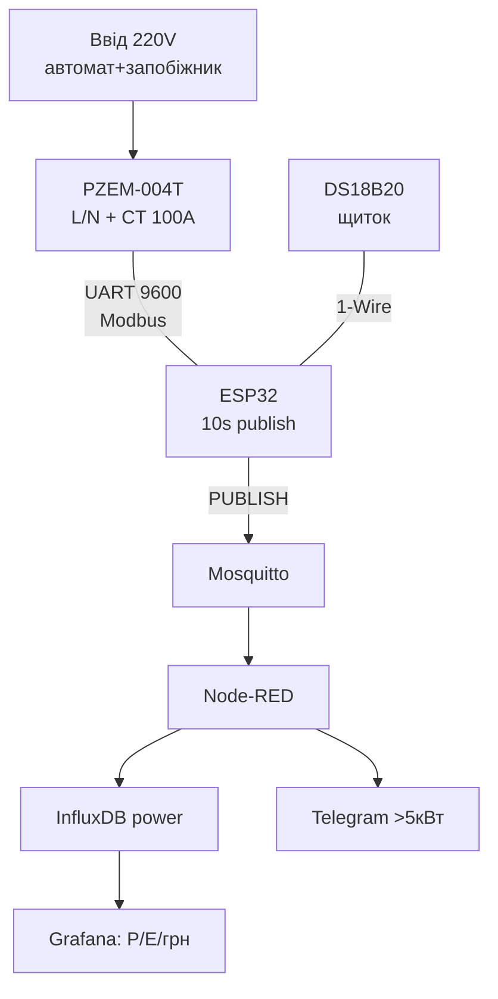

# Проєкт 4 - Монітор енергії: PZEM-004T + MQTT → Grafana, DIN-корпус

![[assets/img/cookbook-energy-scheme.png|600]]
*Рис. Енергомонітор: ESP32 + PZEM-004T (CT + 220V), uplink MQTT → Grafana.*

> [!warning] БЕЗПЕКА 220V - ЧИТАТИ ПЕРШІМ!
> Фаза вбиває одним дотиком. Усі підключення - при вимкненому автоматі, перевірка індикаторною викруткою, закритий DIN-бокс, запобіжник 1A + варистор на вході PZEM, повзучі відстані ≥3 мм. CT-кліщі - на ОДИН фазний провід, стрілка до навантаження. Без досвіду - викликати електрика. База: [[10-Sensori/15-ACS712-ZMPT101B-PZEM-AS5600-FSR|Струм/Сила]], [[10-Sensori/21-Energy-Meters|Лічильники]].
>
> [!tip] Що будуємо
> Квартирний лічильник поверх штатного: PZEM-004T міряє V/I/P/E/PF, ESP32 шле в MQTT раз на 10 с, Node-RED пише в InfluxDB, Grafana малює графіки і рахує гроші. База: [[04-Shini/01-UART|UART]], [[15-Protokoli/01-MQTT|MQTT]], [[15-Protokoli/05-Cloud-Pipeline|Cloud]].

## 1. Мета

Бачити реальне споживання і ловити «пожирачів»: бойлер, тепла підлога, майнінг сусіда.

Сценарії:

- квартира: один PZEM на ввід → добовий профіль + алерт «> 5 кВт»;
- будинок: три PZEM на три фази (адреси Modbus 1/2/3);
- оренда: денний/нічний тариф, експорт CSV за місяць.

Вимоги:

- точність ±1% після калібрування за еталоном;
- дані кожні 10 с, офлайн-буфер 50 точок;
- графіки: потужність, енергія/доба, PF, напруга;
- DIN-корпус у щитку, без висячих дротів.

| Параметр | Ціль | Перевірка |
| --- | --- | --- |
| Датчик | PZEM-004T v3, CT 100A | V/I/P/E/F/PF по Modbus |
| Інтервал | 10 с publish | Grafana без дір |
| Uplink | MQTT QoS 1 state + QoS 0 потік | sub device/# |
| Буфер | 50 точок у RAM/LittleFS | тест з вимкненим WiFi |
| Корпус | DIN 4TE, закритий | кришка пломбується |
| Безпека | запобіжник + варистор + ізоляція | огляд електрика |

## 2. BOM - комплектуючі

| Компонент | Нота довідника | Ціна, орієнтовно |
| --- | --- | --- |
| ESP32 DevKit (WROOM-32) | [[00-Start/04-Devkit-plati | DevKit]] | $6 |
| PZEM-004T v3 + CT 100A | [[10-Sensori/15-ACS712-ZMPT101B-PZEM-AS5600-FSR | Струм/Сила]] | $12 |
| БЖ 5V 1A ізольований (Hi-Link) | [[02-Zhivlennya/02-LDO-DC-DC | LDO]] | $5 |
| Запобіжник 1A + тримач DIN | [[13-Moduli-zhivlennya-rivniv/04-LDO-Buck-XL4015-Protect | Захист]] | $2 |
| Варистор 275V AC | [[13-Moduli-zhivlennya-rivniv/04-LDO-Buck-XL4015-Protect | Захист]] | $0.5 |
| DIN-бокс 4TE + заглушки | [[99-Dodatki/03-Cheklisti-montazhu | Чек-листи]] | $6 |
| Дільник PZEM-TX 1к/2к (5V→3.3V) | [[13-Moduli-zhivlennya-rivniv/02-Level-Shifters | Level-shifters]] | $0.3 |
| DS18B20 на щиток (температура) | [[10-Sensori/02-DS18B20 | DS18B20]] | $2 |

Разом: ~$34 на одну фазу.

Для трьох фаз: ×3 PZEM з різними Modbus-адресами (див. [[10-Sensori/21-Energy-Meters|Лічильники]]).

## 3. Архітектура

### ASCII-схема

```text
              ЩИТОК (DIN, автомат ВИМКНЕНО при монтажі!)
     +--------------------------------------------------+
     | [Автомат]--[Запобіжник 1A]--+-- PZEM L/N (V)     |
     |                             +-- Hi-Link 5V->ESP |
     |  Фаза --CT (стрілка!)--> навантаження           |
     |  CT-дроти --> PZEM CT-вхід (другорядна обмотка) |
     |                                                 |
     |  PZEM TX (5V!) --дільник--> ESP GPIO16 (RX2)    |
     |  PZEM RX <-- ESP GPIO17 (TX2)  [[04-Shini/01-UART|UART]]
     |  DS18B20 DQ --> GPIO4 + 4.7k  [[10-Sensori/02-DS18B20|DS18B20]]
     +--------------------------------------------------+
            | WiFi --> MQTT
            v
     device/power-01/sensors (10c) --> Node-RED
        --> InfluxDB (bucket power) --> Grafana (грн/кВт·год)
```

### Mermaid



Топіки:

```text
device/power-01/sensors  -> {"v":231.2,"i":3.41,"p":742,"e":12.45,"pf":0.97,"t_board":38.1}
device/power-01/state    -> retained online + {"rssi":-61}
device/power-01/config   <- {"interval":10} (retained)
```

## 4. Живлення, ізоляція, монтаж 220V

Кроки монтажу (тільки знеструмленим!):

1. вимкнути ввідний автомат, перевірити індикатором відсутність фази;
2. PZEM L/N - через запобіжник 1A паралельно мережі, варистор паралельно;
3. CT - обхопити ТІЛЬКИ фазу після автомата, стрілка до навантаження;
4. низьковольтне (ESP32+PZEM TTL) - в окремому відсіку DIN-боксу, ≥6 мм від 220V;
5. PZEM TX 5V → дільник 1к/2к → GPIO16; GPIO17 → PZEM RX безпосередньо;
6. увімкнути, перевірити V≈220-240, I≈0 без навантаження, калібрувати за еталоном.

Калібрування: еталонний ватметр + чайник 2 кВт → коефіцієнт `p_cal = P_еталон / P_pzem`.

## 5. Прошивка покроково

Крок 0 - голий PZEM: приклад PZEM004Tv30, читання V/I/P/E (див. [[10-Sensori/15-ACS712-ZMPT101B-PZEM-AS5600-FSR|Струм]]).

Крок 1 - три адреси Modbus для трьох фаз (`pzem.setAddress(2)` по черзі).

Крок 2 - MQTT з офлайн-буфером 50 точок (див. [[15-Protokoli/01-MQTT|MQTT]]).

Крок 3 - NTP-мітки часу для InfluxDB (див. [[15-Protokoli/03-mDNS-NTP-TLS|NTP]]).

```cpp
#include <PZEM004Tv30.h>  // Modbus-RTU [[10-Sensori/15-ACS712-ZMPT101B-PZEM-AS5600-FSR]]
#include <WiFi.h>
#include <PubSubClient.h>
#define RX 16, TX 17      // UART2 [[04-Shini/01-UART|UART]]

PZEM004Tv30 pzem(Serial2, RX, TX);
WiFiClient net; PubSubClient mqtt(net);
float bufP[50]; int bufN = 0; // офлайн-буфер [[15-Protokoli/05-Cloud-Pipeline]]

void setup() {
  Serial.begin(115200);
  Serial2.begin(9600, SERIAL_8N1, RX, TX); // PZEM 9600 8N1
  WiFi.begin("SSID", "PASS");              // [[05-Radio/01-WiFi-STA-AP]]
  while (WiFi.status() != WL_CONNECTED) delay(300);
  configTime(0, 0, "pool.ntp.org");        // [[15-Protokoli/03-mDNS-NTP-TLS]]
  mqtt.setServer("192.168.1.10", 1883);
  mqtt.setBufferSize(1024);
}

void loop() {
  float v = pzem.voltage(), i = pzem.current();
  float p = pzem.power(), e = pzem.energy(), pf = pzem.pf();
  char js[200];
  if (!isnan(v)) {
    snprintf(js, sizeof(js),
      "{\"v\":%.1f,\"i\":%.3f,\"p\":%.1f,\"e\":%.3f,\"pf\":%.2f}",
      v, i, p, e, pf);
    if (mqtt.connected()) {
      while (bufN > 0) { // злив буфера пачкою
        mqtt.publish("device/power-01/sensors", js); bufN--;
      }
      mqtt.publish("device/power-01/sensors", js);
    } else if (bufN < 50) bufP[bufN++] = p;
  }
  mqtt.loop();
  delay(10000);
}
```

Крок 4 - Node-RED → InfluxDB → Grafana (див. [[15-Protokoli/05-Cloud-Pipeline|Cloud]]):

```javascript
// Node-RED function: кВт·год → грн, тариф день/ніч
msg.kwh = msg.payload.e;
msg.uah = msg.payload.e * (isNight() ? 2.16 : 4.32);
return msg;
```

Крок 5 - ESP-IDF/MicroPython: ті ж регістри Modbus через `uart` + `modbus` (див. [[09-Proshivka/01-ESP-IDF-setup|IDF]]).

## 6. Корпус та монтаж

- DIN-бокс 4TE: ліворуч 220V (автомат+PZEM L/N), праворуч 5V+ESP32, перегородка;
- CT-дроти - кручена пара, подалі від WiFi-антени;
- DS18B20 на радіатор щитка - алерт перегріву > 60 °C;
- вентиляційні щілини вгорі боксу, без доступу пальця до 220V;
- фото щитка до/після + схема в [[99-Dodatki/03-Cheklisti-montazhu|Чек-листи]].

## 7. Налагодження

| Симптом | Куди дивитись |
| --- | --- |
| PZEM мовчить / NaN | baud 9600 8N1, перехрест TX/RX, FAQ №46 [[99-Dodatki/02-Troubleshooting-FAQ | FAQ]] |
| Струм 0 при ввімкненому чайнику | CT на двох дротах або не тією стороною, FAQ-розділ CT [[10-Sensori/15-ACS712-ZMPT101B-PZEM-AS5600-FSR | Струм]] |
| ESP32 ребутиться при publish | окремий БЖ 5V 1A + 470 мкФ, FAQ №1 [[99-Dodatki/02-Troubleshooting-FAQ | FAQ]] |
| Дірки в Grafana | офлайн-буфер + NTP-мітки, FAQ №65 [[99-Dodatki/02-Troubleshooting-FAQ | FAQ]] |
| PF стрибає 0.5→1.0 | імпульсні БЖ без PFC - норма; усереднювати 6 точок |
| Нагрів щитка | DS18B20-алерт, протяжка клем щороку, див. [[10-Sensori/02-DS18B20 | DS18B20]] |

## Офіційні джерела

- [Eastron - лічильники SDM (офіційний сайт)](https://www.eastronuk.com/product/sdm120ct-mv/) - SDM120/SDM630: Modbus-регістри V/I/P/E, CT.
- [PZEM-004T - Peacefair (опис)](https://www.peacefair.cn/product/pzem-004t/) - регістри Modbus, CT 100A.
- [PZEM004Tv30 - бібліотека](https://github.com/mandulaj/PZEM-004T-v30) - адреси, energy-reset.
- [InfluxDB - line protocol](https://docs.influxdata.com/influxdb/) - теги/поля для Grafana.

## Див. також

- [[Home]]
- [[10-Sensori/15-ACS712-ZMPT101B-PZEM-AS5600-FSR|Струм/Сила]]
- [[10-Sensori/21-Energy-Meters|Лічильники]]
- [[15-Protokoli/01-MQTT|MQTT]]
- [[15-Protokoli/05-Cloud-Pipeline|Cloud-Pipeline]]
- [[04-Shini/01-UART|UART]]
- [[99-Dodatki/02-Troubleshooting-FAQ|FAQ]]
- [[16-Proekti/01-Weather-Station|Метеостанція]]
- [[16-Proekti/03-Access-Control|Контроль доступу]]
