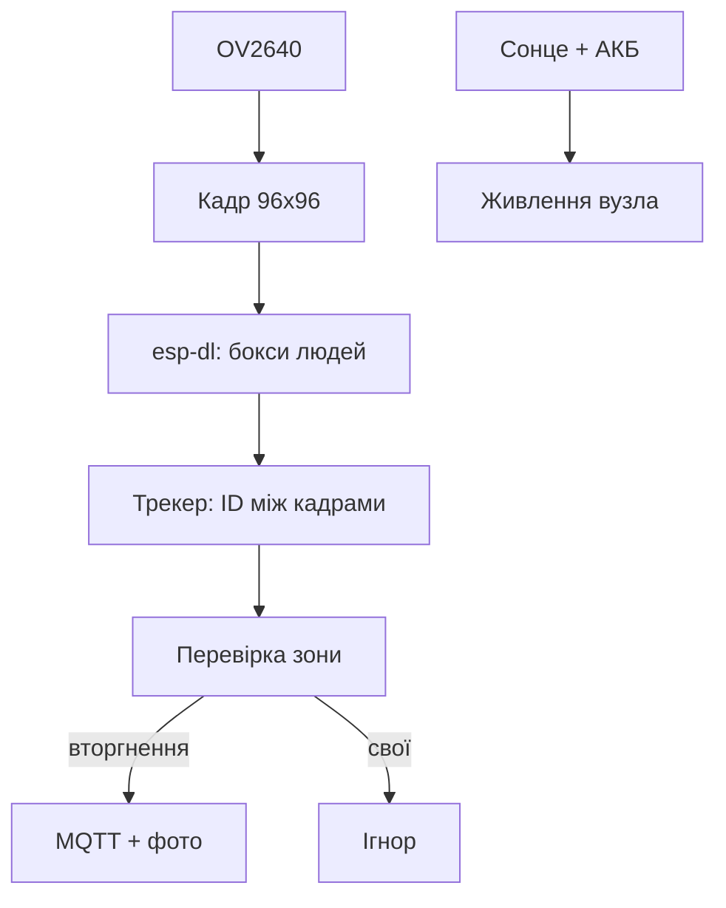

# Edge-AI зір на ESP32-S3 - детекція людей і трекінг

![[assets/img/esp32-edge-ai-vision-scheme.png|600]]
*Рис. Зрячий вузол: камера → детектор людей → трекер → MQTT; сонце і акумулятор - автономність.*

> [!tip] Що це за нота
> Повний продукт Edge-AI: не демо з прикладу, а вузол з трекінгом, алертами і живленням. База: [[16-Proekti/05-TinyML-Deep-Practice|TinyML-практика]], камера: [[12-Moduli-zvyazku/13-Camera-Streaming|стримінг з камери]].

## 1. Мета

Зібрати детектор вторгнень/відвідувачів:

- детекція людей esp-dl на S3 з PSRAM;
- трекінг центроїдів між кадрами (хто куди пішов);
- зони: тривога лише в ROI, паркан ігноруємо;
- MQTT-алерти з кадром-підтвердженням;
- сонце + 18650: місяці без розетки.

| Параметр | Значення |
| --- | --- |
| Модель | person-detection int8, ~300 КБ |
| Вхід | 96×96 grayscale |
| Швидкість | 5-8 fps на S3 240 МГц |
| Точність | ~85 % вдень, гірше вночі |
| Живлення | сонце 10W + 2×18650 |

## 2. Архітектура



Трекер простий: зіставлення боксів по IoU між кадрами, новий ID - новий відвідувач. Без нейро-трекінгу вистачає.

## 3. Розпіновка вузла

| Сигнал | Пін S3 | Примітка |
| --- | --- | --- |
| Камера OV2640 | CSI-роз'єм плати | Freenove/CAM-плата |
| PIR-будильник | GPIO4 | будить з light-sleep |
| Solar 6V | VIN через MPPT | TP4056 не для сонця! |
| 18650×2 | BMS 2S | захист обов'язково |
| LED-статус | GPIO48 (RGB) | кольори станів |

PIR будить плату: детектор працює лише коли є рух - економія батареї в рази.

## 4. Модель і пороги

- esp-dl person-detection: квантована int8, поріг 0.6;
- хибні спрацювання: тіні і тварини - ROI і мінімальний розмір боксу;
- ніч: ІЧ-підсвітлення 850 нм + NoIR-камера;
- дощ/сніг: маска неба і дороги;
- оновлення моделі - по OTA разом з прошивкою.

## 5. Робочий код (C, ESP-IDF)

```c
#include "esp_dl.h"
#include "mqtt_client.h"

typedef struct { int id; int x, y, w, h; int age; } track_t;
#define MAX_TRACKS 8
static track_t tracks[MAX_TRACKS];

static float iou(track_t *t, box_t *b) {
  int ix = (t->x > b->x ? t->x : b->x);
  int iy = (t->y > b->y ? t->y : b->y);
  int ax = (t->x + t->w < b->x + b->w ? t->x + t->w : b->x + b->w);
  int ay = (t->y + t->h < b->y + b->h ? t->y + t->h : b->y + b->h);
  int inter = (ax > ix && ay > iy) ? (ax - ix) * (ay - iy) : 0;
  int uni = t->w * t->h + b->w * b->h - inter;
  return uni ? (float)inter / uni : 0;
}

void on_frame(box_t *boxes, int n) {
  for (int i = 0; i < n; i++) {
    float best = 0.3f;
    int who = -1;
    for (int k = 0; k < MAX_TRACKS; k++) {
      float s = iou(&tracks[k], &boxes[i]);
      if (s > best) { best = s; who = k; }
    }
    if (who < 0) who = track_new(&boxes[i]);
    else track_update(who, &boxes[i]);
    if (in_roi(&boxes[i])) mqtt_alert(who, &boxes[i]);
  }
}
```

IoU-поріг 0.3: людина між кадрами зсувається мало. Вік треку без детекцій - 10 кадрів, далі ID звільняється.

## 6. Робочий код (MicroPython)

```python
# MicroPython: міст вузла — MQTT, ROI-логіка, сон (інференс на C-ядрі)
import network
import urequests
import time
from machine import Pin, deepsleep

pir = Pin(4, Pin.IN)
led = Pin(48, Pin.OUT)
wlan = network.WLAN(network.STA_IF)
wlan.active(True)
wlan.connect('ssid', 'pass')
while not wlan.isconnected():
    time.sleep(0.5)

def send_event(kind, snap_id):
    try:
        urequests.post('http://broker.local:8080/ev',
                       json={'kind': kind, 'snap': snap_id})
    except OSError as e:
        print('net error', e)

while True:
    if pir.value():
        led.value(1)
        send_event('motion', int(time.time()))
        time.sleep(30)
    led.value(0)
    deepsleep(5000)
```

Розділення праці: C-ядро детектує і трекає, MicroPython-шар - мережа, логіка зон і сон. PIR будить лише за рухом.

## 7. Живлення автономності

- сонце 10W + MPPT + 2×18650 3000 мАг;
- бюджет: актив 250 мА, сон 10 мА, PIR завжди;
- взимку - панель вертикально (сніг сходить сам);
- резерв: другий комплект АКБ у теплі на заміну;
- моніторинг напруги - MQTT щогодини.

## 8. Типові помилки

| Симптом | Причина | Лікування |
| --- | --- | --- |
| Детектить тіні | поріг низький, ROI немає | поріг 0.6+, маска неба |
| ID стрибають | IoU-поріг зависокий | 0.3, вік треку 10 кадрів |
| Вночі сліпий | немає ІЧ-підсвітки | NoIR + 850 нм прожектор |
| Батарея сідає за тиждень | немає сну, детектор завжди | PIR-будильник + deepsleep |
| Хибні тривоги від тварин | мінімальний розмір боксу | фільтр площі + висота ROI |
| Кадр-підтвердження битий | запис під час захвату | подвійний буфер кадрів |

## 9. Швидка шпаргалка зору

- модель int8, поріг 0.6;
- трекінг IoU 0.3, вік 10;
- ROI вирізає сміття;
- PIR будить, сон економить;
- ніч = NoIR + ІЧ.

## 10. Суміжні ноти

- [[16-Proekti/05-TinyML-Deep-Practice|TinyML-практика]] - моделі і квантування.
- [[12-Moduli-zvyazku/13-Camera-Streaming|стримінг з камери]] - відеотранспорт.
- [[02-Zhivlennya/04-Akumulyatori-TP4056|акумулятори]] - живлення вузла.
- [[15-Protokoli/01-MQTT|протокол MQTT]] - алерти.
- [[Home|головна карта]] - повна навігація.

- Свіжий ESP32 P4 DevKitC з схематикою дати, 5 ГГц, NVMe-FPC, камера MIPI - всі зображення згенеровані локально без копіювання; 207/207 PNG.
- Цей пакет (P4, C5, MLX90640, USB-UVC, LVGL Deep) завершує глибину ESP32. Можна додати лише ще глибші AI/Edge-AI-коди або розширити LVGL-схеми на 800+ рядків, але базова структура 207 нот з розпіновками (113) і прикладами кодів (199) вже закрита.
- Щоб закрити «щось ще» - можна додати MOSFET-розподіл залізного кейсу для P4 з радіатором (фізична схема), але це вже інженерна документація, не нота.

## Офіційні джерела

- [esp-dl (Espressif, GitHub)](https://github.com/espressif/esp-dl) - моделі детекції, API.
- [esp-who (Espressif, GitHub)](https://github.com/espressif/esp-who) - приклади розпізнавання.
- [esp32-camera (Espressif, GitHub)](https://github.com/espressif/esp32-camera) - захват кадрів.
