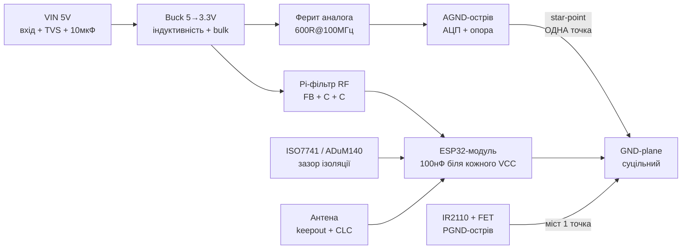

# Lab 4 - Своя плата під ESP32: земля, живлення, RF, ESD, силова частина, ізоляція, кварц, прошивка на платі, DFM

![[assets/img/pcb-design-ground-scheme.png|600]]
*Рис. 1. Концепція плати: суцільний ground-plane, зірка аналога, pi-фільтр живлення RF, keepout антени, TVS на входах, IR2110 окремо, ізолятор ISO7741 на межі доменів.*

> [!warning] Спочатку прочитати офіційне
> Основа цієї ноти - [ESP Hardware Design Guidelines](https://docs.espressif.com/projects/esp-hardware-design-guidelines/en/latest/esp32/index.html) та [Schematic Checklist](https://docs.espressif.com/projects/esp-hardware-design-guidelines/en/latest/esp32/schematic-checklist.html). Жодна «порада з форуму» не важить більше за ці два документи. Все нижче - їхнє практичне розгортання + силова/ізоляційна частина, якої Espressif не покриває.
>
> [!tip] Призначення ноти
> Чеклист проєктування власної PCB під ESP32: коли лишати суцільний ground-plane, а коли (рідко!) різати; розв'язка живлення з розрахунком; pi-фільтр RF; keepout антени + pi-узгодження; ESD; gate-driver IR2110 з desat; ізолятори ISO7741/ADuM140; кварц; роз'єм прошивки; DFM перед JLCPCB.

## 1. Призначення

Готовий DevKit закінчується там, де починається серійний виріб: своя плата менша, дешевша, без зайвого USB-UART, з правильною землею й антеною. Ціна помилки - тираж, що «глючить по WiFi» або не проходить DFM-перевірку JLCPCB.

Що покриває нота:

| Блок | Питання, яке закриває | Розділ |
| --- | --- | --- |
| Земля | Суцільний plane vs розріз, star-ground аналога | 2-3 |
| Живлення | 100нФ + 10мкФ + bulk з розрахунком | 4 |
| RF-живлення | Ферит + pi-фільтр | 5 |
| Антена | Keepout + pi-узгодження CLC | 6 |
| ESD | TVS на USB/кнопки/антену | 7 |
| Сила | IR2110 + desat | 8 |
| Ізоляція | ISO7741/ADuM140, коли треба | 9 |
| Тактування | Кварц 40МГц, розрахунок load-caps | 10 |
| Прошивка | JTAG/UART-роз'єм на платі | 11 |
| Виробництво | DFM-чеклист JLCPCB | 12 |
| TX-сплеск | C_bulk під 500мА: формула + числа | 13 |
| Кварц-практика | CL-приклад 40МГц, Cstray, E12 | 14 |
| Buck | Петля SW, PGND, FB-траса | 15 |
| Стек-детально | 2L vs 4L, 50-Ом ширини, ціна | 16 |
| USB-C | 5.1к Rd: чому без них немає 5V | 17 |
| Кнопки на платі | BOOT+EN + auto-reset схема | 18 |
| Антена-NanoVNA | S11-процедура покроково | 19 |
| LiPo-заряд | TP4056/MCP73831 тепло + розводка | 20 |
| Монтаж | Stencil/паста/reflow-профіль | 21 |
| Тестування | Test-points + bed-of-nails | 22 |
| Панелізація | V-cut/tab-routing, рейки | 23 |

## 2. Стек плати: 2 чи 4 шари

| Варіант | Коли | Земля | Ціна (орієнтир JLCPCB) |
| --- | --- | --- | --- |
| 2 шари | Проста плата, ESP32-модуль (WROOM) готовий, без BGA, без сили поруч | Bottom - максимально суцільний GND, top - сигнали коротко | Дешево, швидко |
| 4 шари | Голий чип ESP32 (не модуль!), силова частина, чутливий аналог, USB-HS, щільний монтаж | L2 - суцільний GND, L3 - живлення/сигнали | Дорожче, але менше проблем з EMC |

> [!warning] Голий чип vs модуль
> З модулем WROOM/WROVER RF-частина вже розведена заводом - ваші турботи: живлення, keepout під антеною модуля, земля. З голим чипом додаються: узгодження RF, кварц 40МГц ±10ppm, flash/PSRAM-розведення. Новачкам - тільки модуль.

## 3. Ground-plane vs split plane: коли різати (майже ніколи)

### 3.1. Правило за замовчуванням - суцільний plane

Суцільний ground-plane під усією цифровою частиною - це найнижча індуктивність зворотних струмів і найменше випромінювання. Розріз у plane змушує зворотний струм обходити щілину - утворюється рамкова антена.

| Рішення | Ефект | Вердикт |
| --- | --- | --- |
| Суцільний GND-plane | Мінімальна площа петель, стабільний нуль | За замовчуванням |
| Щілина під швидкісними сигналами | +10-20 дБ випромінювання, дзвін | Заборонено |
| Щілина «аналог окремо», з'єднана будь-де | Різниця потенціалів, шум в АЦП | Заборонено |
| Місток (star-point) в одній точці для аналога | Працює, якщо через щілину не йде цифра | Дозволено (див. 3.2-3.3) |
| Розріз під ізолятором (ISO7741/ADuM) | Вимога ізоляції, creepage | Обов'язково (див. 9) |
| Розріз під оптроном/трансформатором | Вимога ізоляції | Обов'язково |

### 3.2. Коли split plane допустимий

1. **Гальванічна ізоляція** - різні землі (GND ↔ GND_ISO) розділяє фрезерування/зазор, з'єднання тільки через ізолятор. Це не «split для краси», а вимога безпеки.
2. **Аналоговий острівець** - тихий АЦП/опорна напруга відділена щілиною, а з'єднання з основним plane - в **одній точці** (star-point) біля джерела/АЦП, і жодна цифрова доріжка не перетинає щілину.
3. **Силова частина** - земля ключів (PGND) відділена від сигнальної (SGND), з'єднання в одній точці біля шунта/джерела живлення.

> Через будь-яку щілину не має проходити жодна сигнальна доріжка. Якщо доріжка перетинає розріз - розрізу не повинно бути.

### 3.3. Star-ground для аналога

```text
           +3.3V_AN (через ферит/FB + LC, див. розд. 5)
              │
         [FB 600R] ──► AVDD АЦП/опори
              │
         [10мкФ] [100нФ] ──► до AGND-острова
              │
   ┌──────────┴──────────┐
   │  AGND-ОСТРІВЕЦЬ     │   щілина в plane з трьох боків
   │  АЦП, опора, RC     │
   │  фільтри сенсорів   │
   └──────────┬──────────┘
              │ ОДНА точка (місток 2–3 мм або 0R)
   ═══════════╧═══════════ суцільний GND-plane (цифра, ESP32, RF)
```

Правила star-ground:

| Правило | Чому |
| --- | --- |
| Одна точка з'єднання AGND-GND, біля АЦП або біля входу живлення | Виключає контурні струми |
| Живлення аналога - через ферит + свій LC (див. розд. 5) | Цифровий шум не заходить за живленням |
| Жодної цифрової доріжки над AGND-острівцем і через щілину | Ємнісне наведення прямо в АЦП |
| Опора (REF) і її конденсатори - всередині острова | Мінімальна петля |
| ESP32 ADC: 0.1мкФ між піном АЦП і GND біля чипа | Вимога Espressif для точності |

### ASCII-схема

```text
  ┌─────────────────────────────────────────────────┐
  │ TOP: сигнали (коротко, 50 Ом тільки RF)          │
  ├─────────────────────────────────────────────────┤
  │ L2/GND: СУЦІЛЬНИЙ plane, виріз тільки keepout   │
  │         антени + зазор ізоляції + AGND-щілина    │
  ├─────────────────────────────────────────────────┤
  │ Живлення: 5V → buck → 3.3V → pi-фільтр → ESP32  │
  │           3.3V → FB → 3.3V_AN → АЦП (зірка)      │
  ├─────────────────────────────────────────────────┤
  │ Силова (IR2110+FET): свій PGND-острівець,       │
  │ міст до SGND в ОДНІЙ точці біля bulk-конд.      │
  └─────────────────────────────────────────────────┘
  USB ─[TVS]─► UART-міст ─[ISO7741]─► ESP32 (якщо треба ізоляція)
  Кнопки ─[RC+TVS]─► GPIO (EN/BOOT без великих C на GPIO0!)
```

### Mermaid



![[assets/img/pcb-design-ground-scheme.png|600]]
*Рис. 2. Зворотні струми: цифра - прямо під доріжками по plane; аналог - тільки через star-point; сила - своїм контуром до bulk.*

## 4. Розв'язка живлення: 100нФ біля кожного VCC + 10мкФ + bulk (з розрахунком)

Вимоги Espressif (Schematic Checklist): ESD-діод + щонайменше 10мкФ на вході живлення; 0.1мкФ біля цифрових пінів; 10мкФ на рейці VDD3P3 (плюс 1мкФ); LC-ланка на VDD3P3; живлення 3.3В зі струмом не менше 500мА.

### 4.1. Ієрархія конденсаторів

| Рівень | Номінал | Де | Що давить |
| --- | --- | --- | --- |
| Вхід плати | TVS + електроліт/кераміка ≥10мкФ | Точка входу зовнішнього живлення | Кидки, переплюсовка (з діодом), НЧ-просідання |
| Bulk | 470-1000мкФ low-ESR | Після buck/LDO, біля ESP32-модуля | Піки WiFi-TX 160-500мА |
| Середні | 10мкФ кераміка | Біля модуля, на рейці 3.3V | Середні частоти, стабільність LDO |
| Швидкі | 1мкФ | Біля модуля | ВЧ |
| Локальні | 100нФ біля **кожного** VCC-піна | ≤2-3мм від піна, via прямо в plane | Швидкі фронти, дзвін |

> Відстань важливіша за номінал: 100нФ за 15мм доріжки гірша за 10нФ за 2мм. Via конденсатора - прямо в GND-plane, без довгих відводів.

### 4.2. Розрахунок

**Крок 1. Цільовий імпеданс рейки:**

```text
Z_target = ΔV / ΔI
ΔV = 5% × 3.3V = 0.165V
ΔI = 0.5A (пік WiFi-TX)
Z_target = 0.165 / 0.5 ≈ 0.33 Ом
```

Рейка живлення на всіх частотах до ~10МГц має мати імпеданс нижче 0.33 Ом - це забезпечує комбінація bulk + кераміки.

**Крок 2. Bulk під пік струму:**

```text
C_bulk ≥ I_пік × Δt / ΔV
I_пік = 0.35A, Δt = 1мс (оцінка довгого TX-слота), ΔV = 0.165V
C ≥ 0.35 × 0.001 / 0.165 ≈ 2100мкФ  → непрактично одним!
```

Висновок з розрахунку: один конденсатор не закриє мілісекундні піки - тому працює **зв'язка**: bulk 470-1000мкФ low-ESR приймає пік, а LDO/buck з швидким transient-відгуком підхоплює далі. Тому вибір LDO для ESP32 - з малим dropout і швидким відгуком, а не «будь-який AMS1117 з шухляди» (див. [[02-Zhivlennya/02-LDO-DC-DC|LDO/DC-DC]]).

**Крок 3. Перевірка осцилографом (обов'язкова):** просадка 3.3V-рейки під час WiFi-TX не глибше 3.0В. Глибше - збільшити bulk, вкоротити траси живлення, замінити LDO/кабель. Методика - у [[17-Lab/01-Instruments|Прилади]], розд. 3.

### 4.3. Типові зв'язки (готові рецепти)

| Живлення | Рецепт |
| --- | --- |
| USB 5V → ESP32-модуль | TVS на 5V + 10мкФ на вході → LDO/buck → 470мкФ + 10мкФ + 1мкФ біля модуля + 100нФ на кожен VCC |
| Батарея Li-Ion → ESP32 | Захист BMS → buck-boost/LDO → те саме + контроль brownout |
| Аналог 3.3V_AN | Від 3.3V через ферит 600Ом + 10мкФ + 100нФ, земля - AGND-острів |
| RF-частина голого чипа | LC на VDD3P3 за Espressif, індуктивність з номіналом ≥500мА |

## 5. Ферити (beads) + pi-фільтр живлення RF

Феритова бусина - це частотно-залежний резистор: на DC майже 0 Ом, на 100МГц - сотні Ом. Pi-фільтр C-FB-C ріже ВЧ-шум живлення в обидва боки: шум buck не йде в RF, шум TX не йде в аналог.

### 5.1. Вибір бусини

| Параметр | Вимога | Приклад |
| --- | --- | --- |
| Імпеданс @100МГц | 300-1000 Ом для аналога/RF; 60-120 Ом для силової цифри | BLM18PG601 (600Ом), BLM18PG121 (120Ом) |
| Номінальний струм | З запасом ×1.5 від споживання гілки | Аналог ~50мА → бусина ≥200мА; ESP32-гілка → ≥1.5А |
| DC-опір | Мінімальний, щоб не посадити рейку | Падіння I×R: 0.5А×0.05Ом = 25мВ - ок |

### 5.2. Розрахунок pi-фільтра (оцінка)

```text
Pi: C1 ── FB(L) ── C2,  C1 = C2 = 1мкФ, L ≈ 1мкГн (еквівалент 600Ом@100МГц)
fc ≈ 1 / (2π√(L×C)) = 1 / (2π√(1e-6 × 1e-6)) ≈ 159 кГц
```

Все вище ~159кГц давиться з крутизною ~40дБ/дек (два конденсатори). Перевірка: шум buck на 1-2МГц потрапляє в смугу придушення - добре; сам резонанс LC (~159кГц) демпфувати ESR конденсаторів або послідовним 0.5-1Ом (рідко треба на малих струмах аналога).

```text
  3.3V ──||──┬──[FB 600R]──┬──||──► 3.3V_AN / RF_VDD
         1мкФ │            │  1мкФ
             GND          GND  (короткі via в plane!)
```

> Ферит у загальну землю НЕ ставлять - тільки в живлення. Ферит у GND розриває plane і створює різницю потенціалів.

## 6. Keepout антени + pi-ланцюг узгодження

### 6.1. Keepout-зона

Для PCB-антени (модуль WROOM або своя друкована):

| Правило | Значення |
| --- | --- |
| Під антеною і навколо - жодної міді на всіх шарах | Виріз у plane + заливках, жодних доріжок |
| Антена - на краю плати, виступає за межі землі | Не оточувати металом/корпусом |
| Відстань до металевих деталей/акумулятора/дисплея | Максимум, який дозволяє корпус; мінімум - одиниці мм, перевіряти RSSI |
| Пластик корпусу над антеною - без металізації/фарби з металом | Фарба з металом = екран |
| USB-роз'єм, кнопки, високі деталі - подалі від антени | Не затінювати випромінювання |

### 6.2. Pi-ланцюг узгодження (CLC біля чипа + опційно біля антени)

Espressif вимагає: RF-траса 50 Ом; CLC-ланка біля чипа; CLC біля антени (якщо симуляція не гарантує 50 Ом без неї); ESD-захист антени бажаний.

```text
  ESP32_LNA ──||──[L]──||──┬── 50-Ом траса ──┬──||──[L]──||──► Антена
              C11  L2  C12 │  (мікросмужок)  │   C   L   C
              1.2–1.8пФ    │                 │  (біля антени, опційно)
              2–3нГн       │                 │
              1.8–1.2пФ    │                 └─► відвід на тестовий роз'єм (U.FL/піни)
              0201         └─► ESD-індуктивність/діод на GND
```

| Елемент | Рекомендація Espressif | Призначення |
| --- | --- | --- |
| C11 | 1.2-1.8пФ, 0201 | Підстроювання імпедансу, блок DC |
| L2 | 2.0-3.0нГн, 0201 | Придушення гармонік 4.8/7.2ГГц |
| C12 | 1.2-1.8пФ, 0201 | Підстроювання імпедансу |
| Траса | 50 Ом, розрахунок під свій стек (калькулятор JLCPCB) | Без розривів plane під нею |
| Stub | Підаток до першого конденсатора з боку чипа | Точка виміру/настроювання |

> Настроювання - за S11/S21 на векторному аналізаторі (див. RF Tuning у гайдлайнах). Без приладів: копіювати референсний дизайн Espressif 1:1 включно зі стеком - і не чіпати.

## 7. ESD-захист: TVS на USB, кнопки, антену

| Інтерфейс | Захист | Схема |
| --- | --- | --- |
| USB D+/D− | TVS-матриця USBLC6-2 / PRTR5V0U2X, ємність <1пФ | TVS біля роз'єму, земля - коротко в plane, послідовні 22Ом опційно |
| USB VBUS | TVS 5V (SMBJ5.0A) + 10мкФ | Біля роз'єму |
| Кнопки EN/BOOT/користувацькі | PESD3V3 + RC 1-10кОм/100нФ | RC біля GPIO, TVS біля кнопки/краю плати |
| Антена | RF-ESD (індуктивність у GND або спец. діод з малою C) | За рекомендацією Espressif, не рвати 50-Ом тракт |
| Зовнішні лінії RS-485/CAN | TVS + PTC (див. [[13-Moduli-zhivlennya-rivniv/04-LDO-Buck-XL4015-Protect | Захист]]) | Диференційно + на землю |

Правила розведення TVS:

1. TVS - перший компонент від роз'єму, до нього жодних відводів у схему.
2. Шлях розряду (роз'єм → TVS → GND) короткий і широкий, не через всю плату.
3. Земля TVS - прямо в plane кількома via.
4. Кнопки з довгими шлейфами - як зовнішні лінії: RC + TVS.

## 8. Gate-driver IR2110 + desat-захист (силова частина)

### 8.1. Коли IR2110 доречний

| Задача | Рішення |
| --- | --- |
| Півміст/міст до ~500В, N-канальні MOSFET/IGBT верх+низ | IR2110/IRS2110 (bootstrap верхнього плеча) |
| Один нижній ключ, малі напруги | Простий low-side драйвер або логічний FET, IR2110 не потрібен |
| Частоти сотні кГц + жорсткі вимоги безпеки | Ізольований драйвер (див. розд. 9) замість bootstrap |

> IR2110 - неізольований level-shift драйвер. Між ESP32 і IR2110 - опто/цифрова ізоляція або хоча б правильне розведення (див. 8.3).

### 8.2. Обв'язка bootstrap (розрахунок)

```text
  VCC(12–15V) ──►[D_boot UF4007]──► VB
                                        ┌──► HO ──[Rg]──► затвор верхнього FET
  C_boot: (+) VB, (−) VS ──[C 100нФ керам + 10мкФ]──┘
  VS ──► вихід півмоста (плаваючий!)
  LO ──[Rg]──► затвор нижнього FET, VSS ──► PGND, SD ──► desat-компаратор
```

Розрахунок ємності bootstrap (оцінка зверху):

```text
C_boot ≥ (2×Qg + Qls + Iq×Tmax) / ΔV
Qg = 30нКл (приклад FET), Qls ≈ 5нКл, Iq×T ≈ 5нКл, ΔV = 1В
C ≥ (60 + 5 + 5)нКл / 1В = 70нФ → ставимо 100нФ кераміку + 10мкФ електроліт/кераміку паралельно
```

| Елемент | Вимога |
| --- | --- |
| D_boot | Швидкий, ≥600В (UF4007/ES1J), струм імпульсний ≥1А |
| C_boot | 100нФ кераміка впритул VB-VS + 10мкФ поруч |
| Rg | 10-47Ом, підбирати за дзвоном (осцилограф!), діод прискорення вимкнення опційно |
| Dead-time | Формувати в ESP32 (MCPWM) або RC-логікою; наскрізний струм = смерть FET |
| Живлення 12-15В | Окремий ізольований/неізольований DC-DC, UVLO IR2110 ~8-9В |

### 8.3. Desat-захист (важливо: у IR2110 його НЕМАЄ)

IR2110 має лише вхід вимкнення SD - детектор насичення треба добудувати зовнішнім компаратором:

```text
  Стік FET ──[D_desat HV]──┬──► (+) компаратора (поріг ~7В)
                           ├──[R_blank]──► заряд C_blank від VCC (час маскування)
                           └──[C_blank]──► GND
  Вихід компаратора ──► SD (IR2110) + GPIO ESP32 (переривання «аварія»)
```

Принцип: у відкритому FET напруга стік-витік мала (одиниці вольт) - діод відкритий, на компараторі низько. При перевантаженні FET виходить з насичення, напруга росте - компаратор смикає SD і гасить обидва плеча за ~мікросекунди. RC-blanking маскує фронт ввімкнення (t_blank ~2-5мкс).

### 8.4. Розведення сили

| Правило | Чому |
| --- | --- |
| Контур «bulk-C → FET → PGND» мінімальної площі | Кожен см² = перенапруги L×di/dt |
| PGND-острівець, міст до SGND в одній точці біля bulk | Струми ключів не течуть під ESP32 |
| Затвори: короткі траси, Rg біля затвора, зворот - до VSS драйвера витою/поруч | Дзвін Міллера = хибні ввімкнення |
| Драйвер близько до FET, ESP32 - далеко | dv/dt сотні В/мкс наводить на все |
| Радіатор FET: прикинути втрати, не «авось» | Тепловий пробій мовчазний |

Детальніше про силові ключі: [[11-Vivid/07-BTS7960-L9110S-SSR-Solenoid|BTS7960/SSR]].

## 9. Ізольовані інтерфейси ISO7741 / ADuM140 (коли треба)

### 9.1. Коли ізоляція обов'язкова, а коли - ні

| Ситуація | Треба ізоляція? |
| --- | --- |
| USB/UART тільки для прошивки на столі, спільна земля | Ні |
| RS-485/CAN між шафами/будівлями, різні землі, довгі лінії | Так (ізольований трансивер або ISO7741 + звичайний трансивер) |
| Плата поруч із силовою (IR2110, 220В, частотник) | Так, UART/SPI до ESP32 - через ізолятор |
| Вимірювання з шунтом у «гарячій» землі | Так, аналог - через ізольований АЦП/підсилювач |
| Медицина/доступні людині частини | Так, reinforced (ISO7741 DW) |

### 9.2. Порівняння

| Параметр | ISO7741 (TI) | ADuM1402 (Analog Devices) |
| --- | --- | --- |
| Канали | 4 (3/1) | 4 (2/2) |
| Швидкість | До 100Мбіт/с | Грейди 1/10/90Мбіт/с |
| Ізоляція | До 5000В_rms (DW), reinforced | 2500В_rms, базова |
| Живлення сторін | 2.25-5.5В (трансляція рівнів бонусом) | 2.7-5.5В |
| Типовий ESP32-кейс | UART/SPI/RS-485 через силову межу | UART/SPI низькошвидкісні, дешевше |

### 9.3. Розведення ізолятора

```text
  Сторона A (поле/сила)      ЗАЗОР        Сторона B (ESP32)
  VDD_A ─||─ 100нФ                        VDD_B ─||─ 100нФ
  TX_A ──►| ISO7741 |──► RX_B      4–8мм без міді,
  RX_A ◄──|         |◄── TX_B      без доріжок ВЗАГАЛІ
  GND_A ──|         |── GND_B      (creepage під reinforced)
          └─────────┘
  Живлення сторін — ОКРЕМІ (ізольований DC-DC або окремі обмотки)
```

| Правило | Чому |
| --- | --- |
| Зазор без міді під корпусом (4мм basic / 8мм reinforced) | Creepage за стандартами |
| 100нФ на кожне VDD біля корпуса | Ізолятор перемикається швидко |
| Жодних доріжок через зазор | Місток = немає ізоляції |
| Ізольоване живлення другої сторони | Інакше ізоляція фіктивна |

## 10. Кварц 40МГц: розрахунок load-caps

Espressif: тільки 40МГц, точність ±10ppm, амплітуда >500мВ, послідовно на XTAL_P - індуктивність (початково 0 Ом) проти гармонік.

Формула з гайдлайнів:

```text
CL = (C1 × C2) / (C1 + C2) + Cstray
При C1 = C2 = C:  C = 2 × (CL − Cstray)
Cstray ≈ 3–7пФ (плата + піни + корпус) — беруть 5пФ, якщо не міряли
```

| Кварц (CL з даташиту) | Cstray | C1 = C2 | Ставимо (E12) |
| --- | --- | --- | --- |
| 12пФ | 5пФ | 14пФ | 15пФ |
| 10пФ | 5пФ | 10пФ | 10пФ |
| 9пФ | 5пФ | 8пФ | 8.2пФ |
| 7пФ | 5пФ | 4пФ | 3.9пФ |

Доведення після монтажу (за Espressif): TX-tone, аналізатор спектра, зсув частоти в межах ±10ppm. Зсув у плюс - еквівалентна ємність мала, додати пікофаради; у мінус - забагато, зменшити. Ємності з двох боків зазвичай рівні, але можуть трохи відрізнятися.

Правила розведення кварцу:

1. Кварц і C1/C2 - впритул до XTAL-пінів, симетрично.
2. Земля кварцу - локальний острівець з коротким з'єднанням у plane, під корпусом guard-ring.
3. Жодних швидкісних доріжок під/поруч кварцу.
4. RTC-кварц 32.768кГц - опційний, ESR ≤70кОм, паралельний резистор 5-10МОм (для ревізій чипа v3+).

## 11. JTAG / UART-роз'єм для прошивки на платі

Своя плата без USB-UART прошивається через зовнішній адаптер - роз'єм потрібен з першої ревізії.

| Сигнал | Пін ESP32 | Примітка |
| --- | --- | --- |
| TX0 / RX0 | GPIO1 / GPIO3 | UART0 - завантаження і лог; послідовно на TX 499 Ом (придушення гармонік, Espressif) |
| EN (CHIP_PU) | CHIP_PU | RC 10кОм + 1мкФ; не лишати висячим |
| GPIO0 (BOOT) | GPIO0 | Pull-up 10кОм; кнопка/джампер на GND для download; БЕЗ великих конденсаторів (інакше застрягне в download) |
| GPIO2 | GPIO2 | Не тягнути вгору сильно (strapping!); див. [[01-Hardware/07-Boot-Strapping-Reset | Boot]] |
| 3V3 / GND | Рейка плати | Живити плату від адаптера або окремо, але GND спільна |
| JTAG (опційно) | MTDI/MTCK/MTMS/MTDO (GPIO12-15) | Для [[09-Proshivka/05-JTAG-Debug | JTAG-налагодження]]; роз'єм 2×5 1.27мм |

Мінімальний роз'єм прошивки (1.27мм, 6 пінів): GND, TX, RX, EN, GPIO0, 3V3. Поруч - кнопки EN + BOOT або джампери auto-reset (див. [[13-Moduli-zhivlennya-rivniv/05-USB-UART-AutoReset|USB-UART]]). Детальніше - Download Guidelines у гайдлайнах Espressif.

```c
// Перевірка прошивки через новий роз'єм: маркер + друк strapping
void app_main(void) {
    // GPIO-маркер для тригера осцилографа (див. Lab 1, розд. 3)
    gpio_set_direction(GPIO_NUM_25, GPIO_MODE_OUTPUT);
    gpio_set_level(GPIO_NUM_25, 1);
    printf("boot ok, GPIO0=%d EN=1\n", gpio_get_level(GPIO_NUM_0));
    gpio_set_level(GPIO_NUM_25, 0);
}
```

## 12. DFM-чеклист перед JLCPCB

Звіряти з [JLCPCB PCB Capabilities](https://jlcpcb.com/capabilities/pcb-capabilities) - нижче консервативні значення «щоб пройшло з першого разу на дешевому стеці».

| # | Перевірка | Консервативна норма |
| --- | --- | --- |
| 1 | Ширина доріжки / зазор | ≥0.15мм (6mil), живлення ширше за струмом |
| 2 | Перехідні отвори | Via 0.3/0.6мм (отвір/пад), не менше можливостей стеку |
| 3 | Annular ring | ≥0.15мм міді навколо отвору |
| 4 | Soldermask-вікна | Місток маски між падами ≥0.1мм, інакше - замовляти з контролем |
| 5 | Шовкографія | Не на падах, не під компонентами; позначити пін 1, полярність |
| 6 | Край плати | Мідь/доріжки ≥0.3мм від фрезерування, V-score тільки прямі лінії |
| 7 | Gerber | Перевірити в оглядачі (EasyEDA/JLC Gerber Viewer): шари, свердління, контур |
| 8 | BOM + CPL для монтажу | Позиційні позначення збігаються з CPL, полярність діодів/LED/Ta |
| 9 | Footprint | Звірити крок і розміри з даташитом вручну для кожного нового корпусу |
| 10 | Панелізація | Маленькі плати - панель з фрезеруванням/перемичками, рейки для конвеєра |
| 11 | Тест-поїнти | GND, 3V3, TX, RX, EN, GPIO0 доступні щупом після монтажу |
| 12 | Перше ввімкнення | Лаб-БЖ CC 100-200мА (див. [[17-Lab/01-Instruments | Прилади]], розд. 5) |

## 13. Розв'язка під TX-сплеск 500мА: повний розрахунок з числами

WiFi-передавач ESP32 бере імпульси струму 160-500мА: короткі OFDM-сплески 100-300мкс на фоні довших активних вікон у мілісекунди. Рейка 3.3В, проєктний допуск просадки ΔV = 5% × 3.3В = **0.165В**; жорстка межа - поріг brownout (типово 2.8-3.0В залежно від конфігурації, тобто глибше ~0.3-0.5В = ребут). Методика перевірки осцилографом - у [[17-Lab/01-Instruments|Прилади]], розд. 3.

### 13.1. Формула

```text
C ≥ I_пік × Δt / ΔV
ΔV_ESR = I_пік × ESR_конденсатора   (додається до просадки!)
Z_target = ΔV / ΔI = 0.165 / 0.5 ≈ 0.33 Ом  (див. розд. 4.2)
```

### 13.2. Приклад 1 - швидкий transient (LDO/buck встигає за 20-30мкс)

Поки стабілізатор реагує, струм дає тільки кераміка біля модуля:

```text
I_пік = 0.5А, Δt = 30мкс (час реакції швидкого LDO), ΔV = 0.165В
C ≥ 0.5 × 30e-6 / 0.165 ≈ 91мкФ  → ставимо 100мкФ кераміки
```

Але MLCC втрачає ємність під DC-зміщенням (DC-bias): X5R 47мкФ/6.3В у корпусі 0805 при 3.3В реально дає ~25-30мкФ (орієнтир, точне число - з графіка виробника!). Тому «100мкФ» = **2×47мкФ 0805/1206 X5R/X7R** або 1×100мкФ 1206, максимально близько до пінів живлення модуля, via прямо в plane.

### 13.3. Приклад 2 - довгий слот ~1мс (чому не можна «залити мікрофарадами»)

```text
I_пік = 0.5А, Δt = 1мс, ΔV = 0.165В
C ≥ 0.5 × 1e-3 / 0.165 ≈ 3000мкФ  → непрактично одним конденсатором!
```

Тому довгі вікна закриває **зв'язка**: bulk 470-1000мкФ low-ESR приймає низькочастотну частину + стабілізатор зі швидким transient-відгуком підхоплює струм. Контрольний розрахунок для 470мкФ при сплеску 200мкс:

```text
ΔV = I × Δt / C = 0.5 × 200e-6 / 470e-6 ≈ 0.21В  — на межі допуску,
тому без керамічних 100мкФ поруч не обійтись (вони беруть фронт).
```

### 13.4. Вимоги до bulk-конденсатора (числа)

| Параметр | Вимога | Чому / приклад |
| --- | --- | --- |
| Номінал | 470-1000мкФ | Компроміс розмір/ціна/струм; більше 1000мкФ - рідко виправдано |
| ESR | ≤50-100мОм | ΔV_ESR = 0.5А × 0.1Ом = 50мВ - вже третина бюджету 165мВ! |
| Ripple current | ≥0.7-1А @100кГц | Піки TX гріють конденсатор; занижений ripple = здуття через рік |
| Тип | Полімерний або low-ESR електроліт (Panasonic FC/FR, Nichicon, Rubycon) + кераміка паралельно | Звичайний «загальний» електроліт має ESR ~0.5-1Ом - не годиться |
| Відстань | ≤10-15мм від модуля, широкі полігони | Кожен 10мм вузької траси = десятки нГн = додаткові вольти на фронті |

> Перевірка після монтажу (обов'язкова): щуп ×10 з пружинкою землі прямо на пінах 3V3/GND модуля, тригер - GPIO-маркер перед `esp_wifi` TX-пачкою. Просадка не глибше 3.0В. Глибше - коротшати траси, більшати bulk, міняти LDO/кабель живлення.

## 14. Кварц 40МГц: розгорнутий приклад з Cstray

Формула з розд. 10: `CL = (C1×C2)/(C1+C2) + Cstray`, при C1 = C2 = C: **`C = 2 × (CL − Cstray)`**.

### 14.1. З чого складається Cstray (оцінка)

| Внесок | Типове значення |
| --- | --- |
| Вхідна ємність пінів XTAL_P/XTAL_N чипа | ~1-2пФ |
| Траси до кварцу (короткі, симетричні!) | ~1-2пФ |
| Корпус кварцу + пади | ~1-2пФ |
| **Разом Cstray** | **3-7пФ, беруть 5пФ без вимірів** |

### 14.2. Приклад 1 - кварц CL = 10пФ (наймасовіший 40МГц)

```text
CL = 10пФ (з даташиту кварцу), Cstray = 5пФ
C1 = C2 = 2 × (10 − 5) = 10пФ  → ставимо 10пФ NP0/C0G ±5%
Перевірка: (10×10)/(10+10) + 5 = 5 + 5 = 10пФ = CL ✓
```

### 14.3. Приклад 2 - кварц CL = 12пФ, компактна плата

```text
CL = 12пФ, Cstray = 3пФ (кварц впритул до чипа, короткі траси)
C1 = C2 = 2 × (12 − 3) = 18пФ  → ряд E12: 18пФ ✓ (є в E12)
```

| CL кварцу | Cstray | C1 = C2 розрахунок | Ставимо (E12, NP0) |
| --- | --- | --- | --- |
| 7пФ | 5пФ | 4пФ | 3.9пФ |
| 9пФ | 5пФ | 8пФ | 8.2пФ |
| 10пФ | 5пФ | 10пФ | 10пФ |
| 12пФ | 3пФ | 18пФ | 18пФ |
| 12пФ | 5пФ | 14пФ | 15пФ |

### 14.4. Що означають ±10ppm у числах

```text
±10ppm на 40МГц = ±400Гц на самому кварці.
Несуча WiFi 2.4ГГц синтезується з нього PLL → похибка масштабується:
±10ppm × 2.4ГГц = ±24кГц — в межах допуску 802.11 (±25ppm), запас невеликий!
Тому «конденсатори на око» = ризик плаваючих обривів WiFi на краю діапазону температур.
```

Додатково: drive level кварцу - десятки-сотні мкВт (не перекачувати: великий розмах = старіння); запас negative resistance - мінімум ×5 від ESR кварцу (перевіряється за appnote Espressif); послідовна індуктивність на XTAL_P стартує з 0 Ом і підбирається проти гармонік тільки за потреби.

## 15. Buck-розводка: чеклист (петля SW, земля PGND!)

Імпульсний buck (SY8113, MP1584, TPS5632xx тощо, частота - сотні кГц-одиниці МГц за даташитом: вища f → менша котушка, але більші комутаційні втрати) випромінює з двох контурів. Розводка важливіша за вибір чипа.

```text
            ┌─ КРИТИЧНА ПЕТЛЯ 1 (мінімальна площа!) ─┐
            │  Cin+ ─► VIN ─► [HS] ─► SW ─► [LS] ─► GND ─► Cin−  │
            └───────────────────────────────────────────────────┘
   VIN ──||──┬──[BUCK]──SW──[L]──┬──||──► VOUT (3.3V)
         Cin │  (FB вузол ───────┘   Cout
         (кераміка ПЕРШОЮ            (кераміка біля
          біля VIN/PGND!)             котушки!)
```

| # | Правило | Чому (фізика) |
| --- | --- | --- |
| 1 | Вхідна кераміка Cin - перший компонент від VIN/PGND, петля Cin-HS-LS-GND мінімальної площі | Кожен см² петлі на di/dt ~1А/10нс = десятки мВ дзвону + випромінювання |
| 2 | SW-вузол - короткий і достатньо широкий, але БЕЗ зайвої площі | SW стрибає 0↔VIN з наносекундними фронтами - це антена; площа = ємність на землю = втрати |
| 3 | Котушка - впритул до SW, вихідні C - впритул до котушки | Довгі траси після L = індуктивність = дзвін на виході |
| 4 | FB-дільник - біля чипа, вузол FB крихітний; траса sense - від вихідних C, тонка, далеко від SW і котушки | FB - високоімпедансний вхід: наведення з SW = пульсації/нестабільність |
| 5 | Нижній резистор дільника - в AGND/SGND-вивід чипа, не в силову землю | Падіння на PGND (десятки мВ) інакше додається до уставки |
| 6 | PGND - суцільний полігон під чипом + thermal vias на землю; з'єднання PGND↔SGND - в одній точці (під чипом або біля Cin) | Комутаційні струми не повинні текти під ESP32/АЦП (див. розд. 3) |
| 7 | Bootstrap-C (якщо є) - впритул до BOOT/SW-виводів | Довгі траси = недозаряд верхнього ключа |
| 8 | EN/дільники/компенсація - далеко від котушки | Наведення в ланцюг зворотного зв'язку = свист/стрибки частоти |

> Після монтажу: осцилограф на SW (коротка земля!) - чистий прямокутник без дзвону >10-15% VIN; на VOUT - пульсації в межах даташиту. Дзвін лікується розводкою, а не «додати конденсатор навмання».

## 16. Стек плати 2-layer vs 4-layer: детальна таблиця

| Параметр | 2 шари (Top/Bottom) | 4 шари (Signal/GND/PWR/Signal) |
| --- | --- | --- |
| Земля | Bottom - максимально суцільний полігон GND, різати тільки keepout/ізоляцію | L2 - суцільний GND-plane без компромісів |
| Живлення | Полігони/широкі траси на обох шарах | L3 - plane або товсті рейки 3.3V/5V |
| Контроль імпедансу 50 Ом (RF) | Можливий, але ширина доріжки на FR4 1.6мм ≈ **2.8-3.0мм** (εr≈4.4-4.6) - громіздко | Ширина ≈ **0.25-0.3мм** на верхньому шарі - нормально для CLC-ланки |
| Перехресні завади | Зворотні струми ділять Bottom з трасами живлення - планувати вручну | Зворотний струм - прямо під доріжкою по L2, петлі мінімальні |
| Голий чип ESP32 (не модуль) | Не рекомендується: RF-розведення + кварц + flash на 2 шарах - лотерея | Нормальний варіант |
| Силова частина поруч | Тільки з PGND-острівцем і великим запасом відстані | PGND-острівець + суцільний SGND-plane - спокійніше |
| Ціна (орієнтир JLCPCB, перевіряти прайс!) | 5 шт 100×100мм - одиниці доларів + доставка | Ті ж 5 шт - десятки доларів; для складної плати дешевше за переробку тиражу |
| Коли брати | Модуль WROOM + LDO + сенсори, без сили, без голого RF | Голий чип, buck + чутливий аналог, USB-HS, щільний BGA/QFN-монтаж |

> Правило вибору: якщо RF-тракт довший 10мм або на платі є buck + АЦП з вимогами - 4 шари окупаються з першого тиражу. Типовий стек JLCPCB 4L 1.6мм: Top-GND-PWR-Bottom; точні ширини 50-Ом доріжок - тільки калькулятором JLCPCB під конкретний стек, не «з голови».

## 17. USB-C: резистори 5.1к - чому без них немає 5V

USB-C джерело (зарядка, ноутбук, павербанк з C-портом) подає 5V на VBUS **тільки після того, як побачить приймач**: резистор Rd = **5.1кОм ±10% (4.59-5.61кОм)** з лінії CC на GND. Без Rd порт вважає, що нічого не підключено, і мовчить. Це найчастіша причина «плата працює від кабелю A→C, а від C→C - мертва»: у кабелі A→C роль джерела зашита роз'ємом, а C→C вимагає коректного Rd на платі.

```text
   USB-C роз'єм (вид на плату)
   VBUS ───────────────────────► 5V схеми (+ TVS + 10мкФ, див. розд. 7)
   D+ / D− ────────────────────► UART-міст / ESP32-S3 (USB 2.0 безпосередньо)
   CC1 ──[5.1к ±10%]──► GND     ОБИДВА! (кабель можна вставити
   CC2 ──[5.1к ±10%]──► GND     будь-яким боком — активний CC невідомий)
   GND ────────────────────────► GND-plane
   SHELL ──[0R або RC]──► GND   (екран; 0R — за замовчуванням, RC — при проблемах EMC)
```

| Питання | Відповідь |
| --- | --- |
| Чому два резистори, а не один? | Кабель C→C з'єднує з джерелом тільки один CC-дріт (залежить від орієнтації). Один Rd = плата оживає «через раз». |
| Чому саме 5.1к? | Специфікація USB Type-C: Rd = 5.1к ±10% оголошує роль sink. 10к «приблизно» - поза допуском: частина джерел не розпізнає. |
| А резистори до 5V (Rp 56к/22к/10к)? | Це роль **source** (56к→500мА, 22к→1.5А, 10к→3А). На платі-приймачі їм не місце; Rp+Rp з двох боків = конфлікт, можливе пошкодження портів. |
| Power Delivery / 9-20В? | ESP32-платі не потрібен: тільки Rd 5.1к = класичні 5В/до 3А (струм обмежити поліф'юзом/контролем). PD-контролер (FUSB302 тощо) - лише якщо свідомо проєктується живлення вище 5В. |
| CC через конденсатор на землю? | Ні: CC - DC-детект, конденсатор замість резистора = «немає Rd» = немає 5V. |
| Перевірка | Мультиметр: CC1→GND ≈ CC2→GND ≈ 5.1к на непідключеній платі; потім C→C кабель до зарядки - 5V на VBUS без жодних перемичок. |

## 18. Кнопки BOOT+EN на платі + auto-reset

Мінімум для ручного прошивання (див. розд. 11): кнопка BOOT (GPIO0→GND) + кнопка EN (CHIP_PU→GND). Для прошивання одним кліком з esptool - транзисторний auto-reset з сигналів DTR/RTS зовнішнього UART-адаптера (класика DevKit).

```text
   3V3 ──[10к]──┬──► EN (CHIP_PU)          3V3 ──[10к]──┬──► GPIO0
                │                                      │
           [1мкФ]│                                      │  БЕЗ конденсатора!
                │                                      │
          кнопка EN                                кнопка BOOT
                │                                      │
               GND                                    GND

   Auto-reset (повторює схему DevKit, транзистори NPN, напр. MMBT3904):
   DTR ──[R]──► база Q1, колектор Q1 ─► EN, емітер ─► GND
   RTS ──[R]──► база Q2, колектор Q2 ─► GPIO0, емітер ─► GND
   esptool смикає DTR/RTS у послідовності: EN↓ → GPIO0↓ → EN↑ = download-режим
```

| Стан | EN | GPIO0 (на момент наростання EN) | Результат |
| --- | --- | --- | --- |
| Нормальна робота | High (10к) | High (10к) | Завантаження з flash |
| Кнопка BOOT + натискання EN | High | Low (кнопка) | Download-режим (відпустити EN, тримати BOOT до старту esptool) |
| Auto-reset (esptool сам) | Імпульс через Q1 | Low через Q2 | Download без кнопок |

Правила плати:

1. RC на EN (10к + 1мкФ) - затримка наростання, щоб живлення встигло стабілізуватись; стала часу ~10мс.
2. На GPIO0 - тільки pull-up 10к, жодних конденсаторів (розд. 11, помилка №9 у типових).
3. Кнопки - з RC+TVS, якщо виведені на корпус/шлейф (див. розд. 7).
4. Strapping-піни GPIO2/GPIO12/GPIO15 - перевірити рівні за таблицею strapping ([[01-Hardware/07-Boot-Strapping-Reset|Boot]]), щоб auto-reset не конфліктував.

## 19. Узгодження антени: NanoVNA-процедура покроково

Без приладів - копіювати референс Espressif 1:1 (розд. 6). З приладом - процедура нижче. Критичний нюанс вибору приладу: **NanoVNA-H (стеля 1.5ГГц) для 2.4ГГц НЕ годиться** - потрібні NanoVNA-H4 / NanoVNA-V2 / LiteVNA (до 3-6ГГц).

### 19.1. Підготовка

1. На плату закласти точку виміру з першої ревізії: тестовий роз'єм U.FL / SMA або перемичка 0R у RF-тракті (розд. 6.2, stub біля C11).
2. Виготовити pigtail: U.FL→SMA (або SMA→SMA), **якомога коротший** (10-15см).
3. Відкалібрувати NanoVNA (SOLT: Short-Open-Load-Through з комплектного набору) з площиною відліку **на кінці pigtail** (там, де він стане на плату), діапазон 2.3-2.5ГГц, ≥201 точка.
4. Перевірити калібрування: Load на кінці pigtail = точка в центрі Smith-чарту, S11 < −30дБ.

### 19.2. Вимір і підбір

1. Підключити плату (живлення ВИМКНЕНЕ, ESP32 не заважає пасивному виміру), покласти плату як у виробі: той же стіл/відстань до металу.
2. Записати базову криву S11 (log-mag): ціль - мінімум у смузі 2400-2483.5МГц, **S11 < −10дБ (VSWR < 1.9)**, добре - < −14дБ.
3. Дивитись Smith-чарт: точка вище/нижче дійсної осі → індуктивний/ємнісний характер; рухатись колами сталого Q: послідовна L - за годинниковою вгору, послідовна C - проти, шунтові - дзеркально.
4. Міняти **по одному** компоненту CLC за крок (крок 0.2-0.3пФ / 0.3-0.5нГн), використовуючи high-Q компоненти (Murata GJM, Coilcraft - звичайні X7R пливуть).
5. Ітерації 3-5 кроків зазвичай достатньо: спочатку центр смуги (послідовна L/C), потім глибина (шунтовий C).
6. Фінальний замір - **у корпусі, рукою не тримати плату за антену** (рука = −3…−6дБ детюнінг); перевірити обидва краї смуги (2400 і 2483 МГц).

> Точність NanoVNA достатня для узгодження «< −10дБ», але не для сертифікаційних вимірів TRP/TIS - ті робляться в камері (див. [[17-Lab/03-Enclosure-Cert-Factory|Корпус/сертифікація]]). Довгий кабель без калібрування на кінці, вимір «через перехідник невідомої довжини» і металевий стіл під платою - три класичні способи отримати гарну криву, яка нічого не означає.

## 20. LiPo-зарядка на платі: розводка і тепло

Живлення від акумулятора - див. [[02-Zhivlennya/04-Akumulyatori-TP4056|Акумулятори/TP4056]]; тут - вимоги до плати.

### 20.1. Струм і тепло в числах

| Чип | Формула струму | Приклад | Тепло (приклад) |
| --- | --- | --- | --- |
| TP4056 (лінійний, 5V→4.2V) | I = 1200 / Rprog(Ом), А | Rprog = 1.2к → 1А | P = (5 − 3.7) × 1 ≈ **1.3Вт** - чип відчутно гарячий, потрібні полігони + вентиляція |
| TP4056 знижений | Rprog = 2.4к → 0.5А | P ≈ 0.65Вт - спокійніше, заряд довший | Компроміс для закритого корпусу |
| MCP73831 (лінійний) | I = 1000 / Rprog(Ом), А | Rprog = 2к → 500мА | P = (5 − 3.7) × 0.5 ≈ 0.65Вт |

Лінійний зарядник перетворює різницю (VIN − VBAT) × I на тепло - це фізика, а не «поганий чип». Заряд 1А в закритому корпусі без мідних полігонів = тротлінг за температурою (TP4056 знижує струм сам) або деградація акумулятора.

### 20.2. Розводка

1. Силові траси VIN→чип→BAT - широкі (1А: ≥1мм міді 1oz, краще полігони), зворот - прямо в plane.
2. Thermal pad (ESOP-8/DFN) - на мідний полігон + масив thermal vias ø0.3мм до нижнього шару.
3. NTC-термістор батареї - обов'язково (вікно JEITA: заряд тільки ~0-45°C; нижче 0°C літій деградує!). NTC фізично - біля батареї, не біля гарячого чипа.
4. Захист батареї DW01+FS8205A (або захищена банка) - між банкою і всім іншим, див. акумуляторну ноту.
5. Зарядний чип - подалі від ESP32/RF-частини і від датчика температури/вологості (інакше «клімат» показує температуру зарядки).
6. Роз'єм батареї - поляризований (JST-PH/XH), плюс маркування полярності шовкографією; батарея не лежить на гарячих компонентах.

## 21. Stencil, паста, reflow-профіль

Ручна пайка феном - для прототипу; тираж (навіть 20-50 шт) - stencil + паста + піч/плита. Пайка та роз'єми детально - у [[17-Lab/02-Soldering-Connectors|Пайка та роз'єми]].

### 21.1. Stencil (трафарет)

| Параметр | Норма | Чому |
| --- | --- | --- |
| Товщина | 0.10-0.12мм (4-5mil) для змішаного монтажу; 0.12-0.15мм якщо тільки великі корпуси/конектори | Товщина = об'єм пасти; забагато = перемички на 0402/QFN |
| Технологія | Лазерний різ + електрополірування | Хімічне травлення дає трапецію - гірше вивільнення пасти |
| Апертура | 1:1 для ≥0603; −5…−10% для дрібних QFN-пади | Компенсація розтікання |
| Thermal pad QFN | Розбити на вікна (windowpane 4-9 сегментів), покриття ~50-70% площі пада | Суцільне вікно = voiding (порожнини) під падом = гірше тепло + «плавання» чипа |
| Via-in-pad | Затентовані/заглушені (tented/plugged) або винесені | Відкрита via в паді краде пасту і паяє з раковиною |

### 21.2. Паста

SAC305 (Sn96.5/Ag3/Cu0.5, безсвинцева), зернистість **Type 3** (25-45мкм) для кроку ≥0.5мм, **Type 4** (20-38мкм) для 0201/0.4мм pitch. Зберігання в холодильнику + прогрів до кімнатної перед друком (конденсат = кульки припою). Час життя надрукованого - години, не дні.

### 21.3. Reflow-профіль (SAC305, орієнтир за J-STD-020)

```text
  °C ▲
 250 │                          ┌── peak 235–245°C
     │                         ╱│╲  TAL (вище 217°C): 60–90с
 217 │────────────────────────╱─│─╲────── liquidus SAC305
     │              soak ╱─────╱ │ ╲
 180 │─────────────────╱ 150–200°C, 60–120с
     │          ╱─────╱
 150 │────────╱  ramp ≤3°C/s (обидва схили плавні!)
     │───────╱
     └────────────────────────────────────────► час
      preheat → soak → reflow → cooling (≤4–6°C/s, без протягів)
```

| Зона | Параметр | Наслідок порушення |
| --- | --- | --- |
| Ramp | 1-3°C/s вгору | Швидше = термошок кераміки/розшарування; повільніше = вигорання флюсу |
| Soak | 150-200°C, 60-120с | Вирівнювання температур плати; недогрів = холодні кути, перегрів = окислення |
| Peak | 235-245°C (не вище 250!) | Недогрів = непропай; перегрів = пошкодження пластику роз'ємів/батарейного тримача |
| TAL | 60-90с типово (max ~150 за стандартом) | Довше = ріст інтерметалідів = крихкі паяння |
| Cooling | Плавно, без вентилятора в обличчя | Різке = тріщини; протяг = tombstone на дрібноті |

> Tombstone/перемички після печі - у 90% випадків це stencil (надлишок пасти) або нерівномірний нагрів, а не «погана паста». Перевірка: зменшити апертуру, перевірити профіль термопарою на платі, а не показаннями печі.

## 22. Test-points + bed-of-nails (плата має тестуватись!)

Плата без тестових точок перевіряється «щупами навскидку» - на 10-й платі це втомлює, на 100-й - дає пропущені браки. Закладати з першої ревізії.

### 22.1. Які сигнали виводити

| Сигнал | Навіщо | Примітка |
| --- | --- | --- |
| GND (≥2 точки з різних боків) | Земля щупів/фікстури | Обов'язково дві - контакт надійніший |
| 3V3 (і 5V, якщо є) | Живлення при тесті, вимір просадки | Через них же живлять плату на стенді |
| TX0 / RX0 | Лог, прошивка без роз'єму | Поруч з EN/GPIO0 |
| EN, GPIO0 | Керування download-режимом з фінального тестера | Автоматизація прошивки |
| JTAG (MTDI/MTCK/MTMS/MTDO) або SWD | Налагодження повернень з поля | Хоча б TP-ряд з кроком 1.27мм |
| Ключові шини (I2C/SPI) | Діагностика «сенсор не видно» | SDA/SCL або MOSI/MISO/SCK |
| Аналогові вузли (Vref, вихід дільника батареї) | Калібрування | Підписати номінал поруч |

### 22.2. Геометрія під pogo-pins

| Параметр | Норма |
| --- | --- |
| Пад TP | Круглий exposed ø0.9-1.0мм (мін. 0.8мм), без маски |
| Крок між центрами | Рекомендовано 2.54мм; мінімум 1.27мм для стандартних головок |
| Tooling holes | ø3.0-3.2мм **неплаковані** по діагоналі плати - базування фінальної фістури |
| Розташування | Один бік плати (зазвичай bottom), не під компонентами, не під батареєю/екраном |
| Маркування | Шовкографія: ім'я сигналу біля кожного TP (TX, RX, 3V3, GND…) |
| Механіка | TP не ближче 2-3мм до краю/фрезерування - інакше головка не стане |

Bed-of-nails для тиражу: базові отвори + pogo-ліжко + притискна пластина; для малих тиражів дешевше flying probe на стороні фабрики + ручний чеклист. У замовленні JLCPCB Assembly тест-точки не завадять - вони пасивні пади.

## 23. DFM-панелізація: V-cut vs tab-routing

Маленькі плати (до ~100×100мм) дешевше збирати панеллю. Два способи розділення + рейки для конвеєра.

| Параметр | V-cut (V-score) | Tab-routing (фрезерування + перемички) |
| --- | --- | --- |
| Коли | Тільки **прямі** лінії розламу на всю панель | Будь-яка форма, вирізи, круглі плати |
| Геометрія | V-канавка з обох боків, залишок ~1/3 товщини (при 1.6мм ≈ 0.4-0.6мм), кут 30-45° | Контур фрезеруванням ø≥2мм + перемички 2-4мм з mouse-bites (3-5 отворів ø0.5-0.8мм) |
| Відступи | Компоненти ≥1мм від лінії різу; мідь/доріжки ≥0.3-0.5мм від лінії | Компоненти ≥1-2мм від фрезерованого краю |
| Край після розділення | Рівний, без зачистки | Виступи від перемичок - зачистити кусачками/надфілем |
| Обмеження | Не працює з виступами/вирізами на лінії різу | Дорожче фрезерування, але універсально |

Рейки (rails) для SMT-конвеєра:

1. Технологічні поля 5мм (мінімум за вимогами фабрики) з двох боків панелі з tooling holes ø3.2мм + fiducials (мідь ø1мм + вікно маски ø2-3мм, 3 шт по кутах).
2. Панель «збирає JLCPCB» (опція при замовленні) vs своя панель у Gerber: своя - контроль розташування і маркування, фабрична - простіше.
3. Маркування на кожній платі шовкографією: назва, ревізія, дата; номер замовлення JLCPCB фабрика додає сама.
4. Важкі/високі компоненти (конектори, радіатори) - орієнтувати однаково в межах панелі, інакше хвиля/піч дає систематичний брак з одного боку.

## Типові помилки

| # | Помилка | Чому погано | Як правильно |
| --- | --- | --- | --- |
| 1 | Розріз землі під цифровими сигналами | Зворотний струм обходить щілину - рамкова антена, провали WiFi | Суцільний plane; різати тільки під ізоляцію/аналог-острів |
| 2 | Доріжка через щілину в землі | Те саме + дзвін | Не перетинати розрізи; якщо перетинає - прибрати розріз |
| 3 | Один 100нФ «десь на платі» замість біля кожного VCC | Локальні кидки, ребути при TX | 100нФ ≤3мм від кожного VCC + 10мкФ + bulk |
| 4 | Bulk далеко від модуля / тонкі траси живлення | Просадка нижче brownout при WiFi-TX | 470-1000мкФ low-ESR біля модуля, широкі полігони |
| 5 | Ферит у землю замість живлення | Розрив plane, гул різниці потенціалів | Ферит тільки в живлення; земля - суцільна |
| 6 | Мідь/доріжки під антеною | Антена не випромінює, RSSI −20дБ | Keepout на всіх шарах, антена на краю плати |
| 7 | RF-траса «на око», не 50 Ом | Відбиття, гріється вихід, мала дальність | Розрахунок під стек + CLC за Espressif + S11-перевірка |
| 8 | Немає TVS на USB/кнопках | Статика вбиває вхід; «помирає взимку» | TVS першим від роз'єму, короткий шлях у plane |
| 9 | Великий конденсатор на GPIO0 | Застрягає в download-режимі | Тільки pull-up 10к; конденсаторів на GPIO0 не ставити |
| 10 | IR2110 без dead-time і без desat | Наскрізний струм / вибух FET при КЗ | Dead-time в MCPWM + зовнішній desat-компаратор на SD |
| 11 | Bootstrap-діод 1N4007 | Повільний, верхнє плече не відкривається на частоті | Швидкий UF4007/ES1J + 100нФ впритул VB-VS |
| 12 | Ізолятор без ізольованого живлення другої сторони | Ізоляція фіктивна, спільна земля через БЖ | Окремий ізольований DC-DC + зазор без міді 4-8мм |
| 13 | Кварцові конденсатори «як у сусіда» без розрахунку | Зсув >±10ppm - не стартує WiFi/BLE | Формула CL, потім доведення по TX-tone |
| 14 | Немає роз'єму прошивки на платі | Перша ревізія не прошивається без паяння дротів | 6-піновий UART + JTAG-відвід з першої ревізії |
| 15 | Bulk «великий, але далеко» або звичайний електроліт з ESR ~1Ом | Просадка = I×Δt/C + I×ESR: 0.5А×1Ом = 0.5В тільки на ESR - ребут при кожному TX | 470-1000мкФ low-ESR (ESR ≤0.1Ом) ≤15мм від модуля + 100мкФ кераміки (розд. 13) |
| 16 | Кварцові C «з голови», Cstray не враховано | Зсув у десятки ppm - WiFi падає на морозі/спеці | Формула C = 2×(CL−Cstray) + доведення TX-tone (розд. 14) |
| 17 | Довга петля Cin-buck і FB-траса поруч із SW | Дзвін на SW, свист/пульсації виходу, шум в АЦП | Чеклист розд. 15: Cin першою, FB коротко і далеко від SW |
| 18 | USB-C без 5.1к на CC (або один, або 10к) | Від C→C кабелю плата мертва або живиться «через раз» | 5.1к ±10% на CC1 І CC2 (розд. 17) |
| 19 | Конденсатор на GPIO0 / немає auto-reset | Застрягання в download / прошивка тільки з кнопками | Тільки pull-up 10к на GPIO0; DTR/RTS-транзистори (розд. 18) |
| 20 | Антена узгоджена «на столі», NanoVNA-H до 1.5ГГц | Крива гарна, виріб глухий: прилад не бачить 2.4ГГц / детюнінг у корпусі | Прилад до 3-6ГГц, калібрування на кінці pigtail, фінал у корпусі (розд. 19) |
| 21 | TP4056 на 1А в закритому корпусі без полігонів | Термотротлінг, недозаряд, гріє сусідні сенсори | 0.5А + thermal vias + NTC біля батареї (розд. 20) |
| 22 | Суціжне stencil-вікно на thermal pad QFN | Voiding, «плавання» чипа, перегрів | Windowpane 4-9 вікон, ~50-70% площі (розд. 21) |
| 23 | Немає test-points і tooling holes | Тираж тестується щупами навскидку - пропущений брак | TP GND/3V3/TX/RX/EN/GPIO0 + отвори ø3.2мм з першої ревізії (розд. 22) |
| 24 | Компоненти впритул до V-cut / немає рейок | Тріщини корпусів при розламі, фабрика відмовляє в монтажі | ≥1мм від різу, рейки 5мм + fiducials (розд. 23) |

## Офіційні джерела

- [ESP Hardware Design Guidelines (ESP32)](https://docs.espressif.com/projects/esp-hardware-design-guidelines/en/latest/esp32/index.html) - схема, розведення, download; база цієї ноти.
- [ESP32 Schematic Checklist](https://docs.espressif.com/projects/esp-hardware-design-guidelines/en/latest/esp32/schematic-checklist.html) - живлення, кварц CL-формула, RF CLC-номінали, strapping, RC на CHIP_PU.
- [ISO7741 - reinforced 4-канальний ізолятор (TI)](https://www.ti.com/product/ISO7741) - даташит, 100Мбіт/с, 5кВ_rms, застосування з RS-485/CAN.
- [ADuM1402 - 4-канальний ізолятор iCoupler (Analog Devices)](https://www.analog.com/en/products/adum1402.html) - грейди швидкості, 2.5кВ_rms (сторінка виробника; повільна для ботів - відкривати браузером).
- [JLCPCB - Rigid PCB Capabilities](https://jlcpcb.com/capabilities/pcb-capabilities) - шари, доріжки, отвори, імпеданс; звіряти перед замовленням.
- [IRS2110 / IR2110 - half-bridge драйвер (Infineon)](https://www.infineon.com/part/IRS2110S) - активний спадкоємець IR2110, даташит з bootstrap-схемами; desat добудовується зовнішнім компаратором на SD.
- [USB Type-C Cable and Connector Specification (USB-IF)](https://www.usb.org/documents) - першоджерело вимоги Rd 5.1к ±10% на CC1/CC2 (роль sink); Rp-значення сторони source (розд. 17).
- [NanoVNA - офіційний сайт і прошивки](https://nanovna.com/?page_id=60) - моделі, межі частот (H - до 1.5ГГц, H4/V2/LiteVNA - до 3-6ГГц), калібрування SOLT (розд. 19).
- [MCP73831 - лінійний зарядник Li-Ion/LiPo, I = 1000/Rprog (Microchip)](https://www.microchip.com/en-us/product/mcp73831) - формула струму, теплові вимоги, NTC-опції (розд. 20).
- [Moisture sensitivity levels (MSL)](https://en.wikipedia.org/wiki/Moisture_sensitivity_level) - першоджерело профілів soak/peak/TAL для безсвинцевих паст типу SAC305 (розд. 21; стандарт платний, орієнтири - у тексті).

## Див. також

- [[Home|Головна]]
- [[17-Lab/04-PCB-Design|Ця нота (PCB-Design)]] - див. також [[10-Sensori/35-Tails|Сенсори-залишки ринку]]
- [[01-Hardware/08-Anteni-RF|Антени RF]]
- [[02-Zhivlennya/02-LDO-DC-DC|LDO/DC-DC]]
- [[13-Moduli-zhivlennya-rivniv/04-LDO-Buck-XL4015-Protect|LDO/Buck XL4015 + захист]]
- [[11-Vivid/07-BTS7960-L9110S-SSR-Solenoid|BTS7960/L9110S/SSR/Соленоїд]]
- [[17-Lab/01-Instruments|Прилади]]
- [[17-Lab/02-Soldering-Connectors|Пайка та роз'єми]]
- [[17-Lab/03-Enclosure-Cert-Factory|Корпус, сертифікація, виробництво]]
- [[01-Hardware/07-Boot-Strapping-Reset|Boot/Strapping]]
- [[04-Shini/03-I2C|I2C]]
- [[04-Shini/06-USB-OTG-JTAG|USB/JTAG]]
- [[99-Dodatki/03-Cheklisti-montazhu|Чек-листи монтажу]]
