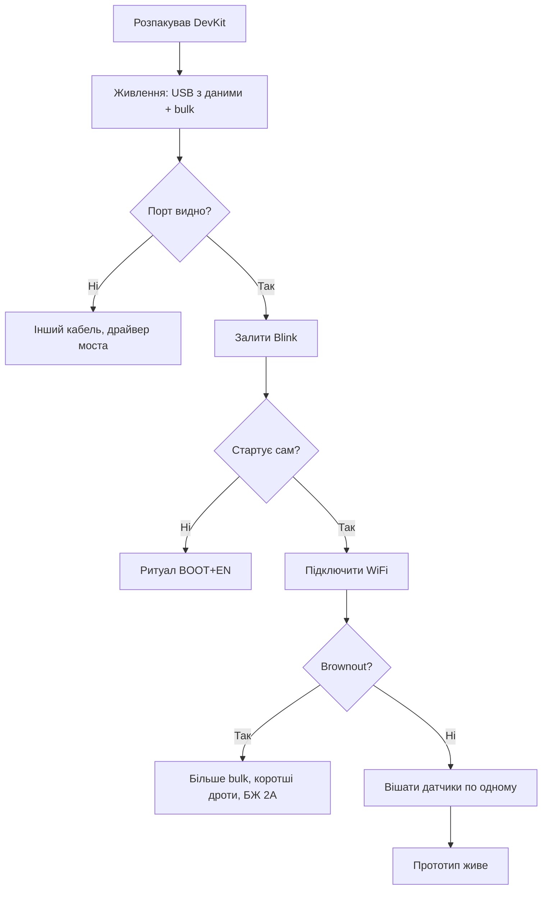

# Макетка ESP32 - збірка без паяння і її межі

![[assets/img/breadboard-limits-scheme.png|600]]
*Рис. Макетка як перша година проєкту: що можна, де стіни.*

> [!tip] Призначення ноти
> Дати повну карту макетної збірки ESP32: живлення, стрепінг-піни, USB-UART мости, межі шин і радіо - щоб глюки були від коду, а не від дротів.

## 1. Призначення

ESP32 живе на макетці краще за більшість кристалів: DevKit вже має USB-UART міст, стабілізатор і кнопки BOOT/EN. Встромив у макетку - і за хвилину перший скетч. Але WiFi-каскад їсть пів ампера піками, стрепінг-піни вирішують долю завантаження, а кожен дріт - антена. Ця нота розбирає все по шарах: від шин живлення до моменту, коли макетку пора викинути.

## 2. Шини живлення макетки: червона і синя

| Правило | Пояснення |
| --- | --- |
| Смуги живлення по краях | Плюс і земля на всю довжину плати |
| Розрив посередині | Більшість макеток рве смуги в центрі - продзвонити! |
| Перемички через розрив | Джампери з краю в край, якщо живлення треба далі |
| Bulk біля модуля | 10-47 мкФ електроліт + 100 нФ кераміка в сусідні гнізда |
| Товсті дроти живлення | Тонкі Dupont просідають на піках WiFi-TX |

```text
Перевірка перед першим ввімкненням:
  1. Продзвонити смуги 5V і GND з краю в край;
  2. Знайти розрив посередині ДО години дебагу;
  3. Заміряти 3.3V на пінах модуля під навантаженням.
```

## 3. Живлення ESP32: піки WiFi вбивають слабкі БЖ

| Джерело | Струм | Висновок |
| --- | --- | --- |
| USB-порт ПК | 500 мА за стандартом | Вистачає, але впритул з периферією |
| Зарядка 1 А | Реально вистачає | Мінімум для CAM і дисплеїв |
| Зарядка 2 А+ | Запас на все | Беріть одразу таку |
| LDO на DevKit | AMS1117 гріється | Понад пів ампера - гарячий! |

| Симптом | Причина | Рішення |
| --- | --- | --- |
| Brownout при підключенні WiFi | Пік TX садить лінію | Короткі товсті дроти, bulk 47 мкФ |
| Reboot на ESP32-CAM при фото | PSRAM + камера одночасно | БЖ 5В 2А, bulk біля плати |
| Працює від USB, мовчить від батареї | Внутрішній опір банки | Свіжа банка, дроти короткі |

## 4. Стрепінг-піни: не чіпати при завантаженні

| Пін | Роль при boot | Що НЕ робити на макетці |
| --- | --- | --- |
| GPIO0 | BOOT-режим | Не тягнути вниз постійно - тільки кнопка! |
| GPIO2 | Рівень + strapping | Не вішати периферію, що тягне вниз |
| GPIO12 | Напруга flash (MTDI) | Критичний: низький рівень = проблеми з flash! |
| GPIO15 | Логи при boot | Не тягнути сильно вгору |
| EN | Скидання | Кнопка на землю, конденсатор проти дзвону |

> Детальна таблиця всіх стрепінг-комбінацій - [[03-GPIO/02-Strapping-pini|Strapping-піни]]. Правило макетки просте: стрепінг-піни лишити вільними до першого робочого прототипу, периферію вішати на безпечні GPIO після.

## 5. Кнопки BOOT і EN: ритуал прошивки

| Ситуація | Дія |
| --- | --- |
| Є auto-reset (DevKit) | Заливка сама входить в download |
| Немає auto-reset (клон) | Тримати BOOT, ткнути EN, відпустити BOOT |
| Після заливки не стартує | Натиснути EN вручну |
| Цикл boot-loop | Дивитись лог: причина ресету першим рядком |

## 6. USB-UART мости: CP2102 проти CH340

| Міст | Драйвер | Нюанси |
| --- | --- | --- |
| CP2102/CP2104 | Silicon Labs, ставиться сам | Стабільний на високих бодрейтах |
| CH340 | Китайський драйвер | Дешеві клони, іноді глючить на 921600 |
| Вбудований USB (S3/C3) | Драйвер ОС | Native USB: інший розєм і режим! |

| Симптом | Причина | Рішення |
| --- | --- | --- |
| Порту немає взагалі | Кабель тільки зарядка | Кабель з даними (товстіший, з феритом)! |
| Порт є, заливка рветься | Швидкість зависока для моста | Знизити baud заливки |
| Сміття в моніторі | Не той бодрейт монітора | Виставити як у прошивці |

## 7. Mermaid: від коробки до першого пакета



## 8. WiFi-шум на макетці: радіо поруч з дротами

| Проблема | Механіка | Вихід |
| --- | --- | --- |
| АЦП пливе при TX | Каскад наводить на доріжки | Вимір між пакетами, усереднення |
| I2C глючить при TX | Просадка + наведення | Bulk, короткі дроти, 100 кГц |
| Антена біля металу | Діаграма вбита | Модуль краєм макетки, метал геть |
| PCB-антена під дротами | Джгут над модулем глушить | Дроти вбік від зони антени! |

## 9. Межі шин на макетці: таблиця чесності

| Шина | Працює | Межа |
| --- | --- | --- |
| I2C датчики | Так | До 100 кГц, дроти до 20 см |
| SPI дисплей/OLED | Так | До 1-4 МГц |
| Швидкий SPI, SDIO | Ні | Глюки гарантовані |
| Аналог точний | Ні | Шум від WiFi і сусідів |
| ESP32-CAM | Так, з БЖ 2А | Просадки вбивають кадр |
| Audio I2S | На межі | Коротко і з bulk |

## 10. Кольори дротів і порядок

| Колір | Сигнал |
| --- | --- |
| Червоний | Плюс живлення |
| Чорний | Земля |
| Жовтий/зелений | I2C, SPI, UART |
| Помаранчевий | Керування, кнопки |

| Правило | Пояснення |
| --- | --- |
| GND першим | Земля - основа всього |
| Сигнальні коротші за живлення | Не навпаки! |
| Силові окремим жмутом | Мотори і реле не поруч з I2C |

## 11. ESP32-CAM на макетці окремо

| Тема | Практика |
| --- | --- |
| Живлення | Тільки 5В 2А, ніяких тонких USB-хвостів |
| PSRAM | Увімкнено в конфігу, інакше кадри не влізуть |
| Роздільність старту | Спочатку низька, потім рости |
| Світлодіод-спалах | Пік струму - bulk обов'язковий |

## 12. Перехід на паяну плату: ознаки

| Ознака | Дія |
| --- | --- |
| Глюк зникає від дотику | Контакти - паяти |
| Працює лише в одному положенні дротів | Паяти |
| Треба в корпус | Паяти |
| Друга копія | Паяти одразу дві |
| WiFi глючить тільки на макетці | Паяти з нормальним живленням |

## 13. Зберігання збірки між сесіями

| Правило | Пояснення |
| --- | --- |
| Фото зверху | Відновити за хвилину після розвалу |
| Коробка з кришкою | Пил в контактах - глюки |
| Маркування кабелів | Який з даними - ізолентою! |

## 14. Струми сну на макетці: чесні цифри

| Режим | Типовий струм модуля | Нюанс макетки |
| --- | --- | --- |
| Active WiFi-TX | 160-260 мА піками | БЖ мусить тримати піки! |
| Modem-sleep | 10-20 мА | DTIM роутера впливає |
| Light-sleep | ~1 мА | Периферія модуля не спить |
| Deep-sleep чипа | 10-150 мкА | LDO і USB-UART їдять більше за чип! |
| Hibernation | ~2.5 мкА | Тільки RTC-пам'ять |

| Симптом | Причина | Рішення |
| --- | --- | --- |
| У deep-sleep міліампери | USB-UART міст і LDO не сплять | Міряти голий модуль або паяну плату |
| Прокидання саме | GPIO-шум будить EXT0 | Підтяжки + фільтр |
| Не прокидається за таймером | ULP/таймер не налаштовано | Перевірити wakeup-джерела |

## 15. Паразити макетки в цифрах

| Параметр | Порядок | Наслідок |
| --- | --- | --- |
| Ємність контакту | ~2-5 пФ | Нарости фронтів на МГц |
| Опір Dupont | ~0.1-0.3 Ом | Просадка на піках струму |
| Індуктивність дроту 10 см | ~100 нГн | Дзвін на швидких фронтах |
| Перехресні наведення | Поруч довгих паралелей | I2C ловить SPI |

## 16. Живлення від LiPo через макетку

| Тема | Практика |
| --- | --- |
| TP4056-модуль поруч | Заряд окремо, живлення через діод |
| Захист банки | Плата DW01 між банкою і схемою |
| Падіння на діоді | Врахувати в бюджеті 3.3V |
| Вимір напруги банки | Дільник на АЦП + калібрування |

## 17. Логічний аналізатор на макетці

| Тема | Практика |
| --- | --- |
| Підключення | Кліпси на SDA/SCL/SCK/MOSI/TX |
| Земля аналізатора | Спільна з макеткою обов'язково! |
| Декодери PulseView | I2C/SPI/UART розбираються самі |
| Тригер | По старт-умові I2C або falling TX |

## Типові помилки

| Симптом | Причина | Рішення |
| --- | --- | --- |
| Порту немає | Кабель-зарядка | Кабель з даними |
| Треба тримати BOOT | Немає auto-reset | Ритуал або інша плата |
| Brownout при WiFi | Слабке живлення | БЖ 2А + bulk |
| Стрепінг вбиває boot | Периферія тягне пін | Звільнити стрепінг-піни |
| I2C NACK | Довгі дроти + 400 кГц | Коротше, 100 кГц |
| АЦП шумить | WiFi-TX поруч | Вимір між пакетами |
| CAM reboot | Просідання | Живлення і bulk |
| Працює лише в одному положенні | Контакти | Паяти плату |

## Офіційні джерела

- [ESP32 Hardware Design Guidelines (Espressif)](https://docs.espressif.com/projects/esp-hardware-design-guidelines/en/latest/esp32/) - живлення, розводка, антена.
- [ESP32 DevKitC Schematic (Espressif)](https://docs.espressif.com/projects/esp-dev-kits/en/latest/esp32/) - auto-reset, USB-UART, кнопки.

## Див. також

- [[Home]]
- [[03-GPIO/02-Strapping-pini|Strapping-піни]]
- [[14-Devboards/01-DOIT-DevKitV1-NodeMCU32S]]
- [[14-Devboards/05-ESP32-CAM]]
- [[17-Lab/02-Soldering-Connectors|Пайка/Конектори]]
- [[17-Lab/04-PCB-Design|PCB]]
- [[99-Dodatki/02-Troubleshooting-FAQ|Troubleshooting-FAQ]]
