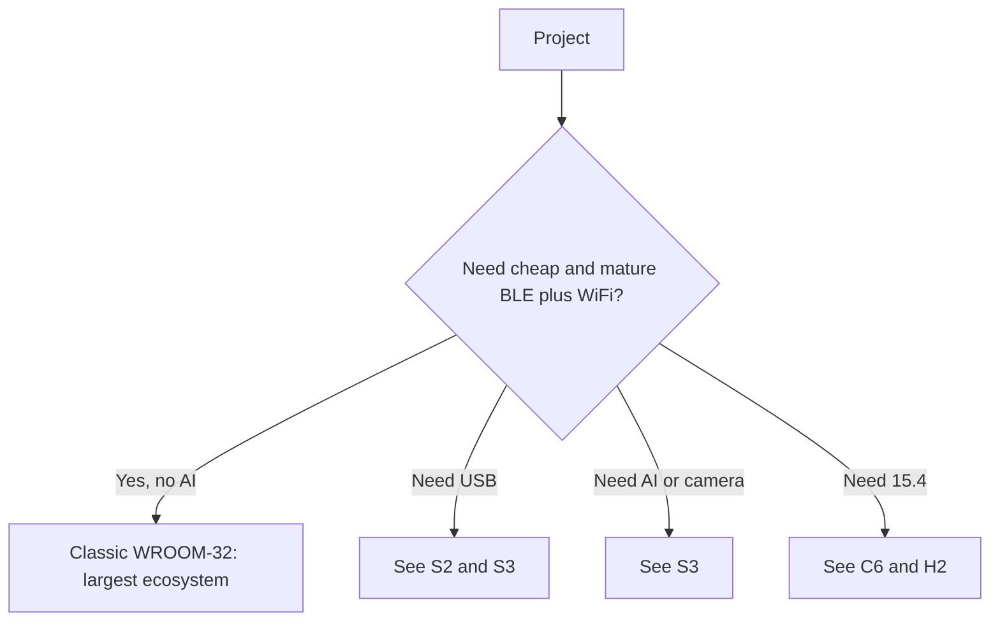

# ESP32 Classic (ESP32-D0WD-V3) - basics

![[assets/img/esp32-classic-pinout.png|600]]

> [!warning] Strictly 3.3V logic!
> All GPIO pins of ESP32 Classic use the **3.3V** level. The pins are **not 5V-tolerant**. Applying 5V to any GPIO or to the 3V3 pin destroys the die.

## Purpose

ESP32 Classic (ESP32-D0WD-V3) basics: WROOM-32 pinout (30-pin DevKit); WROOM vs WROVER (PSRAM); ESP32 to module wiring table. ESP32 Datasheet (PDF, Espressif): electrics, strapping, ADC. ESP32 Classic has 1024 eFuse bits (4 blocks of 256 bits: BLK0 system, BLK1/BLK2 for keys, BLK3 variable).

## Specifications

| Parameter | Value |
| --- | --- |
| CPU | Xtensa LX6 dual-core, up to 240 MHz |
| SRAM | 520 KB |
| WiFi | WiFi 4 (802.11 b/g/n), 2.4 GHz |
| Bluetooth | BT 4.2 BR/EDR + BLE |
| ADC | 2x SAR ADC 12-bit (ADC1 + ADC2) |
| DAC | 2x 8-bit |
| Power supply | 2.3-3.6V, nominal **3.3V** |
| WiFi TX current | peak up to 500 mA |

> [!info] ADC2 and WiFi do not work at the same time
> When WiFi is enabled, the driver occupies ADC2. For analog measurements while WiFi runs, use only [[03-GPIO/01-GPIO-oglyad.en | ADC1]] channels (GPIO32-39). See also [[EN/00-Start/03-Porivnyannya-chipiv.en]].

## WROOM-32 pinout (30-pin DevKit)

| No | Pin | Purpose | 3.3V note |
| --- | --- | --- | --- |
| 1 | EN | Reset, active high | Pull-up to 3.3V via 10 kOhm |
| 2 | VP (GPIO36) | ADC1_CH0, input | Input only, 0-3.3V |
| 3 | VN (GPIO39) | ADC1_CH3, input | Input only, 0-3.3V |
| 4 | GPIO34 | ADC1_CH6, input | Input only, 0-3.3V |
| 5 | GPIO35 | ADC1_CH7, input | Input only, 0-3.3V |
| 6 | GPIO32 | ADC1_CH4, touch | 3.3V logic |
| 7 | GPIO33 | ADC1_CH5, touch | 3.3V logic |
| 8 | GPIO25 | DAC1, ADC2_CH8 | 3.3V logic |
| 9 | GPIO26 | DAC2, ADC2_CH9 | 3.3V logic |
| 10 | GPIO27 | ADC2_CH7, touch | 3.3V, conflicts with WiFi |
| 11 | GPIO14 | ADC2_CH6, HSPI-CLK | 3.3V, conflicts with WiFi |
| 12 | GPIO12 | ADC2_CH5, strapping | 3.3V, see [[EN/03-GPIO/02-Strapping-pini.en]] |
| 13 | GND | Ground | GND |
| 14 | GPIO13 | ADC2_CH4 | 3.3V, conflicts with WiFi |
| 15 | GND | Ground | GND |
| 16 | GPIO23 | HSPI-MOSI | 3.3V logic |
| 17 | GPIO22 | I2C SCL | 3.3V, pull-up to 3.3V |
| 18 | GPIO21 | I2C SDA | 3.3V, pull-up to 3.3V |
| 19 | GPIO19 | UART0 CTS / VSPI-MISO | 3.3V logic |
| 20 | GPIO18 | VSPI-CLK | 3.3V logic |
| 21 | GPIO5 | VSPI-SS, strapping | 3.3V, see [[EN/03-GPIO/02-Strapping-pini.en]] |
| 22 | TX2 (GPIO17) | UART2 TX | 3.3V level |
| 23 | RX2 (GPIO16) | UART2 RX | 3.3V level |
| 24 | GPIO4 | ADC2_CH0, touch | 3.3V, conflicts with WiFi |
| 25 | GPIO0 | BOOT, strapping | 3.3V, see [[EN/03-GPIO/02-Strapping-pini.en]] |
| 26 | GPIO2 | Strapping, LED | Must be floating / low at boot |
| 27 | GPIO15 | ADC2_CH3, strapping | 3.3V, see [[EN/03-GPIO/02-Strapping-pini.en]] |
| 28 | SD1 (GPIO8) | Flash SPI | Do not use, 3.3V flash |
| 29 | SD0 (GPIO7) | Flash SPI | Do not use, 3.3V flash |
| 30 | CLK (GPIO6) | Flash SPI | Do not use, 3.3V flash |

> [!tip] Free pins for projects
> Safest: GPIO16, 17, 18, 19, 21, 22, 23, 25, 26, 32, 33. Avoid GPIO6-11 (flash at 3.3V).

## WROOM vs WROVER (PSRAM)

| Feature | WROOM-32 | WROVER |
| --- | --- | --- |
| PSRAM | none | 4-8 MB SPI PSRAM |
| Size | 18x25.5x3.1 mm | 18x31.4x3.3 mm |
| Flash | 4 MB | 4-16 MB |
| Power supply | 3.3V | 3.3V |
| Use | IoT, sensors | Camera, LVGL, audio |

Details: [[EN/05-Moduli-WROOM-WROVER-MINI.en]], [[EN/01-Hardware/06-Flash-PSRAM.en]].

## ESP32 to module wiring table

| ESP32 | Module | Description |
| --- | --- | --- |
| 3V3 | WROOM-32 3V3 | Power only **3.3V**, not 5V! |
| GND | WROOM-32 GND | Ground shared with peripherals |
| GPIO21 | Module I2C SDA | SDA via 4.7 kOhm pull-up to 3.3V |
| GPIO22 | Module I2C SCL | SCL via 4.7 kOhm pull-up to 3.3V |
| GPIO34 | Module sensor | Analog input 0-3.3V |

## 3.3V power supply

The Classic runs from a [[02-Power-Supply/01-Lancjugi-zhivlennya.en | 5V to 3.3V LDO chain]]. The WiFi peak is 500 mA, so the LDO must hold 600+ mA, with 100 nF + 10 uF capacitors near the module plus a 470 uF electrolytic. Details: [[EN/02-LDO-DC-DC.en]], [[EN/03-Spozhivannya.en]].

## Official sources

- [ESP32 product page (Espressif)](https://www.espressif.com/en/products/socs/esp32) - photos, resources, Design Guidelines.
- [ESP32 Datasheet (PDF, Espressif)](https://www.espressif.com/sites/default/files/documentation/esp32_datasheet_en.pdf) - electrics, strapping, ADC.
- [ESP-IDF Programming Guide](https://docs.espressif.com/projects/esp-idf/en/latest/) - API of all peripherals.
- [ESP32 Pinout tutorial with photos (RNT)](https://randomnerdtutorials.com/esp32-pinout-reference-gpios/) - GPIO table of what is allowed and what is not.

## eFuse and protection (Classic)

> [!danger] eFuse bits are irreversible!
> eFuse bits can only be burned from `0` to `1`. There is no way back. One wrong `burn_efuse` and the chip is forever without JTAG, without UART download, or with encryption enabled and no key. First `summary`, then `burn` with full understanding. Key details: [[EN/08-Memory/04-Secure-Boot-Encrypt.en]].

ESP32 Classic has 1024 eFuse bits (4 blocks of 256 bits: BLK0 system, BLK1/BLK2 for keys, BLK3 variable).

### Main Classic bits

| Bit / field | Block | Effect | Irreversible |
| --- | --- | --- | --- |
| `JTAG_DISABLE` | BLK0 | Disables JTAG forever | Yes, irreversible |
| `FLASH_CRYPT_CNT` (3 bits) | BLK0 | Odd number of ones = flash encryption ON | Only add bits, cannot remove |
| `SECURE_BOOT_EN` | BLK0 | Bootloader signature check | Yes |
| `ABS_DONE_0` / `ABS_DONE_1` | BLK0 | Secure Boot finished (V1/V2) | Yes |
| `DISABLE_DL_ENCRYPT` | BLK0 | No encryption in download mode | Yes |
| `DISABLE_DL_DECRYPT` | BLK0 | No decryption in download mode | Yes |
| `DISABLE_DL_CACHE` | BLK0 | No flash access in download mode | Yes |
| `UART_DOWNLOAD_DIS` | BLK0 | Full ban of UART download | Yes, be careful! |
| `FLASH_CRYPT_CONFIG` (4 bits) | BLK0 | Encryption algorithm (0xF = release) | Partly |
| `KEY_STATUS` / `BLOCK1/2` | BLK1/2 | Flash-encryption / secure boot keys | Write once, read blocked |

### How to inspect and burn safely

```bash
# 1. Тільки читати — безпечно
espefuse.py --port /dev/ttyUSB0 summary

# 2. Перевірити конкретне поле
espefuse.py --port /dev/ttyUSB0 get FLASH_CRYPT_CNT
espefuse.py --port /dev/ttyUSB0 get SECURE_BOOT_EN
espefuse.py --port /dev/ttyUSB0 get JTAG_DISABLE

# 3. Пропалювання (приклад! двічі подумай)
espefuse.py --port /dev/ttyUSB0 burn_efuse JTAG_DISABLE
espefuse.py --port /dev/ttyUSB0 burn_efuse FLASH_CRYPT_CNT 0b001

# 4. key flash-шифрування з файлу (32 байти, випадкові!)
python3 -c "import os; open('/tmp/opencode/key.bin','wb').write(os.urandom(32))"
espefuse.py --port /dev/ttyUSB0 burn_key flash_encryption /tmp/opencode/key.bin
```

> [!warning] Production order
>
> 1. Generate keys offline and store copies. 2. Flash bootloader + app. 3. Enable flash encryption, reboot, verify. 4. Enable secure boot. 5. Burn `JTAG_DISABLE` and `UART_DOWNLOAD_DIS` last. A wrong order means a brick. JTAG debug: [[EN/09-Firmware/05-JTAG-Debug.en]].

```c
// ESP-IDF: перевірка чи увімкнене шифрування (діагностика)
#include "esp_flash_encrypt.h"
#include "esp_secure_boot.h"
void check_protect(void) {
    ESP_LOGI("prot", "flash_crypt=%d secure_boot=%d",
        esp_flash_encryption_enabled(),
        esp_secure_boot_enabled());
}
```

## Typical clocks / crystals (Classic)

| Source | Frequency | Purpose | Note |
| --- | --- | --- | --- |
| XTAL | 40 MHz (26 / 40 allowed) | Reference crystal | On WROOM-32: 40 MHz, ±10 ppm tolerance for WiFi |
| PLL | 320 / 480 MHz, divided | CPU 80 / 160 / 240 MHz | WiFi needs 80 MHz or more |
| APB | 80 MHz | SPI, I2C, UART, ADC | Divided from CPU |
| RTC_FAST | 8 MHz (internal RC) | RTC memory, ULP | Inaccurate ±5% |
| RTC_SLOW | 150 kHz int. / 32.768 kHz ext. | Deep-sleep timer | External one is more accurate |
| APLL | 16-128 MHz | I2S precise audio clock | Only for audio |

RTC drift estimate for deep-sleep:

```text
Внутрішній 150 кГц: дрейф ±5% → за 1 год сну помилка ±3 хв.
Зовнішній 32.768 кГц (±20 ppm): за 1 год помилка ±0.07 с.
Висновок: для точних пробуджень став зовнішній 32.768 кГц.
```

```cpp
// Arduino: зміна частоти CPU (економія)
#include <Arduino.h>
void setup() {
  Serial.begin(115200);
  Serial.println(getCpuFrequencyMhz()); // 240 за замовч.
  setCpuFrequencyMhz(80);  // WiFi ще працює, струм -40%
  Serial.println(getCpuFrequencyMhz());
}
// ESP-IDF: точна настройка
// rtc_clk_cpu_freq_set(RTC_CPU_FREQ_80M);
```

> [!tip] Crystal and WiFi link
> A cheap crystal with 40 ppm deviation cuts range and causes dropouts. The symptom is `wifi: recalibration` in the logs. Only a module replacement fixes it. RF details: [[EN/08-Anteni-RF.en]].

## Boot mode (Classic)

| Mode | GPIO0 | GPIO2 | GPIO5 | GPIO12 | GPIO15 | EN | ROM log |
| --- | --- | --- | --- | --- | --- | --- | --- |
| SPI-boot (normal) | HIGH (3.3V) | LOW/floating | HIGH | LOW | HIGH | HIGH | `boot:0x13 (SPI_FAST_FLASH_BOOT)` |
| Download (UART0) | LOW (GND) | LOW/floating | HIGH | LOW | HIGH | 0 to 1 edge | `waiting for download` |
| JTAG-debug | HIGH | - | HIGH | LOW | HIGH | HIGH | boot + `openocd` connects |
| SDIO boot | HIGH | HIGH* | LOW* | LOW | LOW* | HIGH | Rare, for slave mode |

`*` - MTDI/MTDO combinations (GPIO12/15) and GPIO5 for the SDIO slave, see [[EN/03-GPIO/02-Strapping-pini.en]].

```bash
# Розшифровка логу download:
# rst:0x1 (POWERON_RESET),boot:0x13 (SPI_FAST_FLASH_BOOT)
# 0x13 = GPIO0 HIGH, нормальний старт з flash. Еталон:
esptool.py --port /dev/ttyUSB0 flash_id   # має відповісти, якщо SPI-boot живий
esptool.py --port /dev/ttyUSB0 read_flash_status
```

| ROM log | Meaning | Action |
| --- | --- | --- |
| `boot:0x13` | Normal, boot from flash | Keep working |
| `waiting for download` | GPIO0 pulled to GND | Release BOOT, press EN |
| `flash read err, 1000` | Wrong flash size/mode | Check [[EN/01-Hardware/06-Flash-PSRAM.en]] |
| `rst:0x10 (RTCWDT_RTC_RESET)` | 3.3V sag / weak LDO | See [[EN/02-Power-Supply/01-Lancjugi-zhivlennya.en]] |

### Mermaid: when Classic fits and when it does not



## Common issues

| # | Issue | Why it is bad | Correct approach |
| --- | --- | --- | --- |
| 1 | Revision v0/v1 instead of V3 | Old silicon bugs | Only D0WD-V3 |
| 2 | ADC2 + WiFi at once | ADC2 is busy with the WiFi driver | Analog only via ADC1 with WiFi |
| 3 | Power from the DevKit 3.3V pin | Sag on TX causes brownout | VIN 5V or a separate buck |
| 4 | GPIO6-11 for peripherals | SPI flash hangs there! | Pins 6-11 are taboo |
| 5 | Expecting BLE5 | Classic is BLE 4.2 | BLE5 only on C3/C6/H2 |

## See also

- [[EN/Home.en]]
- [[EN/00-Start/03-Porivnyannya-chipiv.en]]
- [[EN/03-GPIO/01-GPIO-oglyad.en]]
- [[EN/03-GPIO/02-Strapping-pini.en]]
- [[EN/02-Power-Supply/01-Lancjugi-zhivlennya.en]]
- [[EN/02-ESP32-S2.en]]
- [[EN/03-ESP32-S3.en]]
- [[EN/07-Boot-Strapping-Reset.en]]
