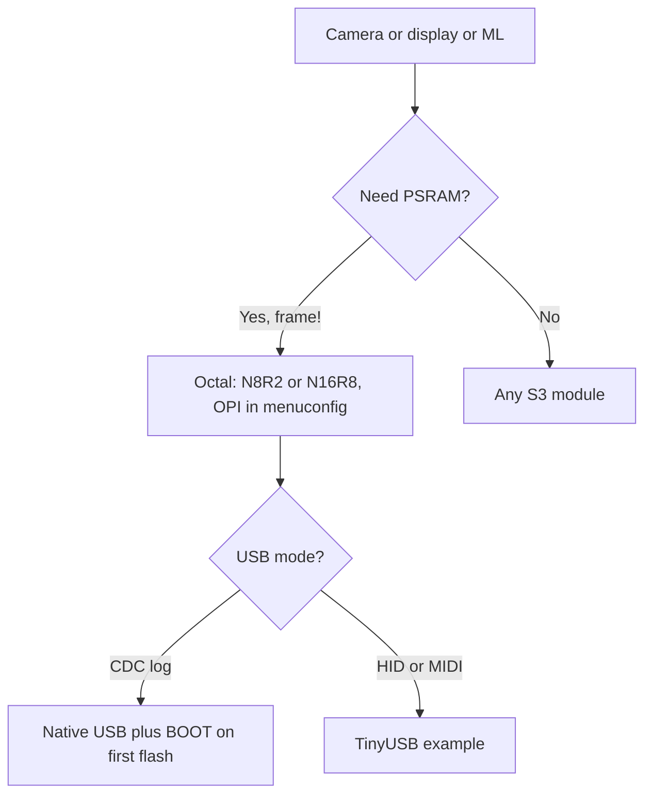

# ESP32-S3 - dual LX7 for AI and cameras

![[assets/img/esp32-s3-pinout.png|600]]

> [!warning] 3.3V logic, camera also at 3.3V!
> S3 runs on **3.3V**. The OV2640 is powered from 3.3V (its core is 1.8V via its own LDO on the camera board). Do not apply 5V to GPIO pins or to the SCCB bus.

## Purpose

ESP32-S3 dual LX7 for AI and cameras: GPIO (45) key groups; OV2640 camera; ESP32 to module wiring table. Camera supply is 3.3V from the board. Consumption with WiFi is up to 300 mA, an LDO per [[02-Power-Supply/01-Lancjugi-zhivlennya.en | power supply chains]] is required. Espressif technical documentation: S3 Datasheet + TRM (DVP camera, USB-JTAG).

## Specifications

| Parameter | Value |
| --- | --- |
| CPU | Xtensa LX7 dual-core, 240 MHz |
| AI | Vector instructions for neural networks |
| SRAM | 512 KB + 16 KB RTC |
| PSRAM | Octal SPI, up to 32 MB |
| WiFi | WiFi 4 (802.11 b/g/n) |
| BT | BLE 5.0 + Mesh |
| USB | USB-OTG Full-Speed + USB-JTAG |
| GPIO | 45 programmable |
| Power supply | 2.3-3.6V, nominal **3.3V** |

> [!info] USB-JTAG
> S3 is flashed and debugged via a single USB cable with no external JTAG probe. JTAG output goes via GPIO19/20 (USB). See [[EN/07-Boot-Strapping-Reset.en]].

## GPIO (45) - key groups

| Group | Pins | Purpose |
| --- | --- | --- |
| USB | GPIO19, GPIO20 | USB D-/D+, JTAG |
| Strapping | GPIO0, 3, 45, 46 | See [[EN/03-GPIO/02-Strapping-pini.en]] |
| Octal PSRAM | GPIO33-37 + SPICLK | Taken by PSRAM on N16R8 |
| Camera | GPIO4-12 | DVP interface of OV2640 |
| ADC | GPIO1-10 | ADC1 12-bit, 0-3.3V |
| LED / RGB | GPIO38, 48 | Built-in WS2812 on DevKit |

> [!tip] Octal SPI PSRAM
> On N8R2/N16R8 modules Octal PSRAM gives about 80 MB/s. PSRAM pins cannot be used as GPIO. Verification: [[EN/01-Hardware/06-Flash-PSRAM.en]].

## OV2640 camera

| Camera signal | ESP32-S3 | Level |
| --- | --- | --- |
| XCLK | GPIO10 | 3.3V |
| SIOD/SIOC | GPIO40/39 | 3.3V, pull-up to 3.3V |
| VSYNC/HREF | GPIO38/47 | 3.3V |
| D0-D7 | GPIO11,9,8 | 3.3V |
| PWDN/RESET | GPIO32 | 3.3V |

Camera supply is **3.3V** from the board. Consumption with WiFi is up to 300 mA, an LDO per [[02-Power-Supply/01-Lancjugi-zhivlennya.en | power supply chains]] is required.

## ESP32 to module wiring table

| ESP32 | Module | Description |
| --- | --- | --- |
| 3V3 | S3-N16R8 3V3 | **3.3V** supply, current up to 500 mA |
| GND | S3-N16R8 GND | Camera + WiFi ground |
| GPIO40 | Module camera SIOD | SDA 3.3V |
| GPIO39 | Module camera SIOC | SCL 3.3V |
| GPIO10 | Module camera XCLK | Clock at 3.3V |

## Official sources

- [ESP32-S3 product page (Espressif)](https://www.espressif.com/en/products/socs/esp32-s3) - AI instructions, Octal PSRAM, photos.
- [Espressif technical documentation](https://www.espressif.com/en/support/download/documents) - S3 Datasheet + TRM (DVP camera, USB-JTAG).
- [ESP32-CAM tutorial with code (RNT)](https://randomnerdtutorials.com/esp32-cam-video-streaming-face-recognition-arduino-ide/) - OV2640, CameraWebServer.

## eFuse and protection (S3)

> [!danger] S3 eFuse bits are irreversible!
> One bit lives once: `0` to `1` forever. Most dangerous are `UART_DOWNLOAD_DIS`, `JTAG_DISABLE`, `FLASH_CRYPT_CNT`. Fix the key plan (which block has which purpose) before the first burn. Basics: [[EN/08-Memory/04-Secure-Boot-Encrypt.en]].

S3 has the richest eFuse in the dual-LX7 line: 6 key blocks with `KEY_PURPOSE`, key revocation, XTS for Octal flash.

### Main S3 bits

| Bit / field | Effect | Irreversible |
| --- | --- | --- |
| `JTAG_DISABLE` | Kills external JTAG forever (USB-JTAG too) | Yes |
| `FLASH_CRYPT_CNT` (7 bits) | Odd count of `1` = encryption ON | Only add bits |
| `SECURE_BOOT_EN` | Signature check (ECDSA/RSA) | Yes |
| `KEY_PURPOSE_0..5` | `XTS_AES_128_KEY` / `SECURE_BOOT_V2` / `HMAC_DOWN_ALL` / `USER` | Once per block! |
| `SECURE_BOOT_KEY_REVOKE0..2` | Revocation of compromised SB keys | Yes |
| `DISABLE_DL_ENCRYPT / DECRYPT / CACHE` | Sealing of download mode | Yes |
| `UART_DOWNLOAD_DIS` | No flashing via UART/USB | Yes - last! |
| `XTS_DPA_PSEUDO_LEVEL` | Protection against DPA attacks on XTS | Yes |
| `BLOCK_USR_DATA` | User bits (serial, revision) | Write freely, it is for you |

```bash
# Інспекція S3 (безпечно)
espefuse.py --chip esp32s3 --port /dev/ttyACM0 summary
espefuse.py --chip esp32s3 --port /dev/ttyACM0 get FLASH_CRYPT_CNT
espefuse.py --chip esp32s3 --port /dev/ttyACM0 get SECURE_BOOT_EN
espefuse.py --chip esp32s3 --port /dev/ttyACM0 get KEY_PURPOSE_0

# Продакшн-приклад (двічі подумай!)
python3 -c "import os; open('/tmp/opencode/s3_xts.bin','wb').write(os.urandom(32))"
espefuse.py --chip esp32s3 --port /dev/ttyACM0 burn_key BLOCK_KEY0 /tmp/opencode/s3_xts.bin XTS_AES_128_KEY
espefuse.py --chip esp32s3 --port /dev/ttyACM0 burn_efuse FLASH_CRYPT_CNT 0b001
```

> [!warning] Octal PSRAM and keys
> On N16R8, Octal PSRAM is not encrypted by XTS (flash only). Do not keep secrets in PSRAM in the open: after `JTAG_DISABLE` they are still visible via a firmware dump without encryption. Camera frames are fine, keys are not.

```c
// ESP-IDF S3: діагностика + користувацькі дані
#include "esp_efuse.h"
#include "esp_flash_encrypt.h"
void s3_prot(void) {
    ESP_LOGI("s3", "crypt=%d sb=%d",
        esp_flash_encryption_enabled(), esp_secure_boot_enabled());
    uint8_t serial[16] = {0};
    // esp_efuse_read_block(EFUSE_BLK3, serial, 0, 128); // свій серійник
}
```

## Typical clocks / crystals (S3)

| Source | Frequency | Purpose | Note |
| --- | --- | --- | --- |
| XTAL | 40 MHz | Reference | On WROOM-1/2: 40 MHz |
| PLL | up to 480 MHz | CPU 80 / 160 / 240 MHz (dual LX7) | AI instructions like 240 |
| APB | 80 MHz | SPI, I2C, UART, ADC, LEDC | - |
| USB PHY | 60 MHz | USB-OTG FS + USB-JTAG | One cable for flash + debug |
| RTC_FAST | 8 MHz RC | RTC domain | ±5% |
| RTC_SLOW | 150 kHz RC / 32.768 kHz XTAL | Deep-sleep, ULP-RISC-V | - |
| LCD / CAM | up to 120 MHz (from PLL) | MIPI-less DVP camera, LCD | Dividers in `esp_clk` |

Camera supply estimate from frequency:

```text
OV2640 XCLK 20 МГц при CPU 240 МГц: джитер XCLK мінімальний.
CPU 80 МГц + XCLK 20 МГц: джитер більший → смуги на кадрі.
Правило: для камери тримай CPU 160–240 МГц, modem-sleep вимкни.
Струм при цьому 180–300 мА — LDO за [[02-Power-Supply/01-Lancjugi-zhivlennya]] з запасом 600 мА+.
```

```cpp
// S3: максимум для AI-камери, мінімум для сенсора
#include <Arduino.h>
void cam_mode()  { setCpuFrequencyMhz(240); } // камера + AI
void sensor_mode(){ setCpuFrequencyMhz(80);  } // опитування I2C, WiFi ще живий
```

## Boot mode (S3)

| Mode | GPIO0 | GPIO3 | GPIO45 | GPIO46 | EN | Log / port |
| --- | --- | --- | --- | --- | --- | --- |
| SPI-boot | HIGH | floating | LOW | LOW/floating | HIGH | `boot:0x8`, boot from flash |
| Download USB-OTG | LOW | floating | LOW | LOW | 0 to 1 edge | `/dev/ttyACM0` + `waiting for download` |
| Download UART0 | LOW | floating | LOW | LOW | 0 to 1 edge | Same log via bridge |
| USB-JTAG debug | HIGH | - | LOW | - | HIGH | Boot + OpenOCD on the same cable |

> [!tip] One cable does everything
> S3 needs no external JTAG probe: USB-JTAG works on GPIO19/20. If `openocd` does not see the chip, verify you did not burn `JTAG_DISABLE` and that GPIO19/20 are free from peripherals. Debug: [[EN/09-Firmware/05-JTAG-Debug.en]], full table: [[EN/07-Boot-Strapping-Reset.en]].

```bash
esptool.py --chip esp32s3 --port /dev/ttyACM0 flash_id
espefuse.py --chip esp32s3 --port /dev/ttyACM0 summary
# Нема ACM0? BOOT→GND, EN клік, відпусти BOOT після "waiting for download"
```

| S3 log | Meaning | Action |
| --- | --- | --- |
| `boot:0x8` | Normal | Keep working |
| `waiting for download` | ROM waits for firmware | Flash with `write_flash` |
| `flash read err` / `invalid header` | Wrong `flash_mode` (QIO vs DIO) or size | See [[EN/01-Hardware/06-Flash-PSRAM.en]] |
| `rst:0x7 (TG0WDT_SYS_RESET)` | Hang at start (PSRAM pins as GPIO) | Free GPIO33-37 on N16R8 |

### Mermaid: S3 for cameras and AI



## Common issues

| # | Issue | Why it is bad | Correct approach |
| --- | --- | --- | --- |
| 1 | Quad PSRAM as Octal | Does not boot / panic | OPI for Octal, QSPI for Quad |
| 2 | Camera without PSRAM | Frame does not fit | Only R2/R8/R16 modules |
| 3 | GPIO48 as a plain pin | Strapping at boot | Free at start, then NeoPixel |
| 4 | One native port for all | Cannot flash and log | DevKitC: second port via bridge |

## See also

- [[EN/Home.en]]
- [[EN/00-Start/03-Porivnyannya-chipiv.en]]
- [[EN/03-GPIO/01-GPIO-oglyad.en]]
- [[EN/03-GPIO/02-Strapping-pini.en]]
- [[EN/02-Power-Supply/01-Lancjugi-zhivlennya.en]]
- [[EN/01-Hardware/01-ESP32-Classic.en]]
- [[EN/01-Hardware/06-Flash-PSRAM.en]]
- [[EN/08-Anteni-RF.en]]
