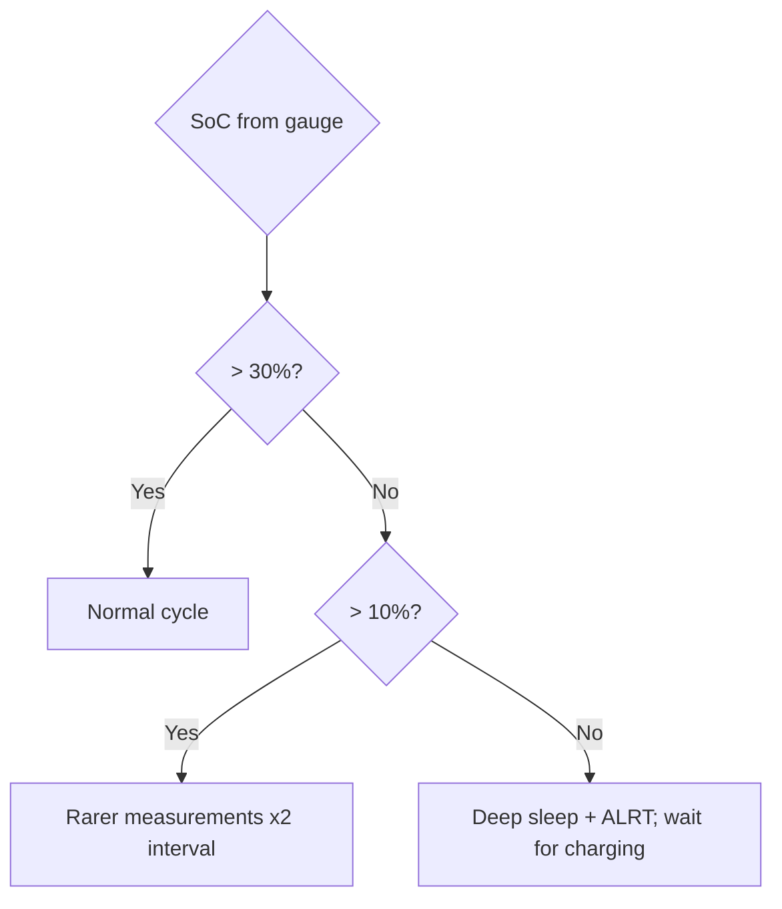

# Fuel Gauge: Accurate Battery Percentage (MAX17048 / LC709203 / BQ27441)

## Purpose

A divider + ADC lies: Li-Ion voltage is nonlinear, flat in the middle, drifting with temperature and current. A fuel gauge computes the TRUE State-of-Charge: ModelGauge (voltage+model), or a coulomb counter (current integral). The result is honest percentages for deep-sleep decisions and "2 days left".

Base: start - [[EN/Home.en]], batteries - [[EN/02-Power-Supply/04-Batteries-TP4056.en]], ADC - [[06-Analog/01-ADC.en | ADC]], sleep - [[07-Timers/03-Sleep-ULP.en | Sleep]].

![[assets/img/fuel-gauge-soc-scheme.png|600]]
*Fig. Battery to gauge (I2C) to ESP32: SoC percentages, threshold alert wakes from sleep.*

## Chip comparison

| Chip | Method | Interface | Accuracy | Price | When |
| --- | --- | --- | --- | --- | --- |
| MAX17048 | ModelGauge (V+model) | I2C 0x36 | ±3-5% | $2-3 | Default: no shunt, 2 wires! |
| LC709203F | Hermit-Crab (V+T) | I2C 0x0B | ±3% | $2 | Has thermal compensation, cheaper |
| BQ27441 | Impedance Track (coulomb counter) | I2C 0x55 | ±1-2% | $4-5 | Accuracy matters more than price |
| Divider + ADC | Voltage | ADC | ±10-15% | $0.1 | "alive/dying" indicator, not percentages |

```text
Підключення MAX17048 (типове):
  LiPo+ ──► CELL+ (gauge між батареєю і навантаженням НЕ потрібен — тільки sense!)
  LiPo− ──► CELL− (= GND)
  SDA/SCL ──► GPIO21/22 + pull-up 4.7к; ALRT ──► GPIO (поріг розряду, wake!)
  Увага: gauge їсть сам ~50 мкА — для CR2032-проєктів рахувати в бюджеті!
```

### Mermaid: what to do with the percentages



## Code (Arduino - MAX17048)

```cpp
// Arduino: читання SoC з MAX17048 (I2C 0x36), поріг-алерт 15%
#include <Wire.h>
#define GAUGE 0x36
float readSOC() {
  Wire.beginTransmission(GAUGE); Wire.write(0x04); Wire.endTransmission(false);
  Wire.requestFrom(GAUGE, 2);
  uint16_t v = (Wire.read() << 8) | Wire.read();
  return v / 256.0;  // відсотки!
}
void setup() {
  Wire.begin(21, 22);
  Serial.printf("Battery: %.1f%%\n", readSOC());
}
```

### Calibration (once per battery type!)

```text
1. Повний заряд (4.20V, струм < C/20) → записати empty/full точки (BQ274: DesignCap!).
2. Розряд відомим струмом до 3.0V → звірити мАг з паспортом банки.
3. LC709203: вибрати профіль батареї (параметр APA!) — чужий профіль = ±10%.
4. Перевірка: 3 цикли, похибка SoC на кінцях < 5% — інакше перекалібрувати.
```

## Common issues

| # | Mistake | Why it is bad | Correct |
| --- | --- | --- | --- |
| 1 | Divider as "percentages" | Nonlinearity + flat middle | Gauge for percentages |
| 2 | Foreign APA profile | ±10% right away | Profile for your own cell |
| 3 | Gauge without calibration | Factory ±7% | 3 calibration cycles |
| 4 | ALRT not connected | Slept through discharge | ALRT to wake-GPIO |
| 5 | 50 uA gauge draw ignored | Eats a CR2032 in a year | Count in the sleep budget |
| 6 | BQ274 without DesignCap | Coulomb counter without a base | DesignCap = nameplate mAh |

## Official sources

- [MAX17048 datasheet (ADI)](https://www.analog.com/en/products/max17048.html) - ModelGauge, registers.
- [LC709203F datasheet (onsemi)](https://www.onsemi.com/products/power-management/battery-management/lc709203f) - APA profiles.
- [BQ27441 Technical Reference (TI)](https://www.ti.com/product/BQ27441-G1) - Impedance Track, calibration.

## MAX17048 registers (what to read)

| Register | Address | What it gives |
| --- | --- | --- |
| VCELL | 0x02 | Cell voltage, 78.125 uV/LSB |
| SOC | 0x04 | Percentages, 1/256 %/LSB |
| VERSION | 0x08 | Chip version (link check!) |
| CONFIG | 0x0C | ALRT threshold (bits 0-4: 1%/LSB below 32%) |
| STATUS | 0x1A | ALRT trip flag |

```cpp
// Arduino: ALRT на 15% (прокидає ESP32!)
void setupAlert() {
  Wire.beginTransmission(0x36); Wire.write(0x0C);
  Wire.write(0x1F); Wire.write(0x1D);  // поріг 15%, ALRT увімкнено
  Wire.endTransmission();
  pinMode(34, INPUT_PULLUP);  // ALRT — open-drain, активний LOW!
}
```

### LC709203F APA profiles (choice!)

| Battery | APA (hex) | Comment |
| --- | --- | --- |
| Small LiPo 300-500 mAh | 0x10-0x14 | Start here for wearables |
| 18650 2600-3500 mAh | 0x28-0x30 | Check against the cell datasheet! |
| 2000 mAh LiPo packs | 0x20-0x24 | Flat drone/tracker packs |

## BQ27441: key commands (I2C 0x55)

```text
0x00/0x01 CONTROL → підкоманди: CONTROL_STATUS, DEVICE_NUMBER, FW_VERSION.
0x02/0x03 TEMP, 0x04/0x05 VOLTAGE, 0x0A/0x0B Current (зі знаком!),
0x1C/0x1D StateOfCharge %, 0x10 FullChargeCapacity (після калібрування!).
Налаштування: DesignCapacity (паспорт!) + DesignEnergy + Terminate Voltage
(3000 мВ для довголіття або 2800 для максимуму ємності).
```

## Gauge + deep-sleep combo (node logic)

```text
Прокинувся → прочитати SoC → рішення:
  SoC > 30%  → повний цикл (виміри + передача)
  10–30%     → тільки виміри, передача раз на N циклів (NVS-лічильник!)
  < 10%      → ALRT уже спрацював: спати добу, чекати зарядку
  Зарядка детект (VBUS present) → повний цикл + звіт Reached-100% один раз
```

## Gauge calibration over a cycle

- A full charge-discharge cycle teaches the battery model;
- After 3 cycles SoC accuracy reaches nameplate;
- Do not judge a new battery in its first week.

## See also

- [[Home.en | Home]]
- [[EN/02-Power-Supply/04-Batteries-TP4056.en| Batteries]]
- [[EN/02-Power-Supply/03-Power-Consumption.en| Power consumption]]
- [[06-Analog/01-ADC.en | ADC]]
- [[07-Timers/03-Sleep-ULP.en | Sleep]]
- [[04-Interfaces/03-I2C.en | I2C]]
