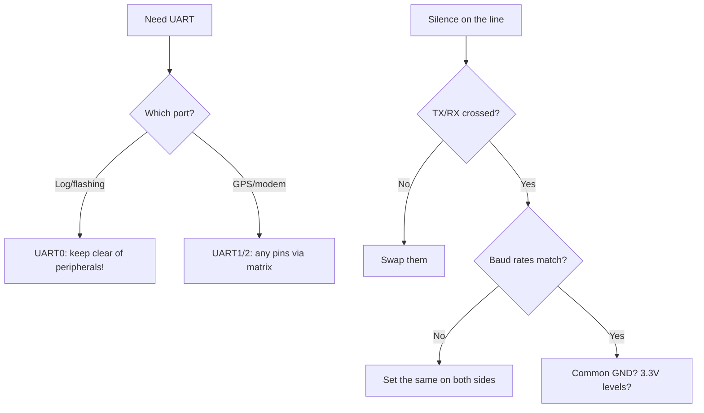

# UART on ESP32 - 3 ports

![[assets/img/placeholder.png]]

ESP32 Classic has **3x UART** (U0, U1, U2). Any UART can be remapped to any GPIO through the GPIO Matrix (up to ~5 Mbps).

> [!warning] U1 conflicts with flash
> U1 defaults to **GPIO9/10** - this is QSPI flash. Do not touch it without remapping! Always do `Serial1.begin(..., RX=.., TX=..)`.

## Purpose

UART on ESP32 - 3 ports - default pins; connection table; code - U2 loopback. ESP32 Classic has 3x UART (U0, U1, U2). Any UART can be remapped to any GPIO through the GPIO Matrix (up to ~5 Mbps). U1 defaults to GPIO9/10 - this is QSPI flash. Do not touch it without remapping! Always do Serial1.begin(..., RX=.., TX=..).

## Default pins

| UART | RX | TX | Note |
| --- | --- | --- | --- |
| U0 | GPIO3 | GPIO1 | USB console, flashing |
| U1 | GPIO9 | GPIO10 | **flash!** - remap, e.g. 16/17 or 12/13 |
| U2 | GPIO16 | GPIO17 | free, take it for [[12-Comm-Modules/03-SIM800L-GPS | GPS]] / [[04-Interfaces/05-CAN-TWAI-RS485.en | RS485]] |

## Connection table

| ESP32 | RS232 MAX3232 / GPS | Note |
| --- | --- | --- |
| GPIO16 (U2 RX) | TX of the module | crossed RX<-TX |
| GPIO17 (U2 TX) | RX of the module | through a divider if the module is 5V |
| GND | GND | common ground |
| - | MAX3232 T1IN/R1OUT | to DB9, 0.1uF capacitors x4 |

> [!tip] Loopback test
> Connect TX to RX of one UART - what you sent is what you get. A quick check without an oscilloscope.

## Code - U2 loopback

**Arduino:**

```cpp
#include <HardwareSerial.h>
HardwareSerial S2(2);
void setup() {
  Serial.begin(115200);
  S2.begin(115200, SERIAL_8N1, 16, 17);
  S2.println("hello");
}
void loop() {
  if (S2.available()) Serial.write(S2.read());
}
```

**ESP-IDF:**

```c
#include "driver/uart.h"
#define U UART_NUM_2
void app_main(void) {
    uart_config_t c = {.baud_rate=115200,.data_bits=UART_DATA_8_BITS,.parity=UART_PARITY_DISABLE,.stop_bits=UART_STOP_BITS_1,.flow_ctrl=UART_HW_FLOWCTRL_DISABLE,.source_clk=UART_SCLK_APB};
    uart_param_config(U, &c);
    uart_set_pin(U, 17, 16, -1, -1);
    uart_driver_install(U, 1024, 1024, 0, NULL, 0);
    uart_write_bytes(U, "hello\r\n", 7);
}
```

**MicroPython:**

```python
from machine import UART
u = UART(2, baudrate=115200, tx=17, rx=16)
u.write("hello\r\n")
print(u.read())
```

## RS232 / RS485 - physics in short

ESP32 UART is **3.3V logic levels**, not RS232 (±12V) and not RS485 (differential). Converters are mandatory:

| Standard | Signal | Range | Chip | Circuit |
| --- | --- | --- | --- | --- |
| TTL UART | 0-3.3V, common GND | ~1 m | - (direct) | TX to RX crossed |
| RS232 | ±3 to ±15V, single-ended | 15 m | MAX3232 (3.3V!) / MAX232 (5V) | 4x 0.1 uF charge-pump |
| RS485 | A/B differential ±1.5V | 1200 m | MAX485 / SP3485 (3.3V) / isolated ADM2587E | twisted pair + 120 Ohm at the ends |

> [!warning] MAX232 vs MAX3232
> MAX232 is 5-volt, its RX output (to ESP32) will give 5V, and you will burn the pin. For ESP32 only **MAX3232 / SP3232** or a divider on the output. See [[03-GPIO/03-Pull-Ups-Levels.en | 5V to 3.3V levels]].

Half-duplex RS485 on U2 (DE/RE control):

```cpp
#include <HardwareSerial.h>
HardwareSerial RS485(2);
#define RX2 16
#define TX2 17
#define DE_RE 21  // HIGH = передача
void setup() {
  pinMode(DE_RE, OUTPUT);
  digitalWrite(DE_RE, LOW);
  RS485.begin(9600, SERIAL_8N1, RX2, TX2);
}
void rs485Write(const uint8_t *b, size_t n) {
  digitalWrite(DE_RE, HIGH);
  RS485.write(b, n);
  RS485.flush();  // дочекатись останнього стоп-біта!
  delayMicroseconds(500);
  digitalWrite(DE_RE, LOW);
}
```

Terminators: **120 Ohm between A-B on both ends of the bus**, bias resistors 680 Ohm (A to 3.3V, B to GND) in only one place. Without terminators at 100+ m - reflections and "floating" frame issues. Bus details - [[EN/04-Interfaces/05-CAN-TWAI-RS485.en]].

## HW FIFO + interrupt thresholds

Each ESP32 UART has a **128-byte hardware FIFO** for RX and TX plus a separate software ring buffer of the driver:

| Parameter | Value | Setting |
| --- | --- | --- |
| HW RX FIFO | 128 bytes | `uart_set_rx_full_thr()` / `rxfifo_full_thrhd` |
| HW TX FIFO | 128 bytes | `txfifo_empty_thrhd` |
| RX timeout | ~10 symbol times of silence | `rx_timeout_thrhd` - packet boundary (Modbus!) |
| SW ring (IDF) | 256-1024 by default | `uart_driver_install(u, rx_size, tx_size, ...)` |
| Arduino SW buffer | 256 bytes | `Serial.setRxBufferSize(n)` before `begin()` |

Practice:

- **9600 baud + Modbus**: RX threshold 100-120 bytes, timeout 3.5 symbols. Grabbed the packet whole - the timeout defined the frame end.
- **115200 + GPS NMEA**: threshold 1-8 bytes + large SW ring (2048), parsing by `\n`. A small SW ring means lost symbols in the background of WiFi.
- **1+ Mbps**: small threshold (10-20), ring 4096 or more, handling in a separate task with priority above WiFi.

ESP-IDF threshold example:

```c
#include "driver/uart.h"
#define U UART_NUM_2
void uart_fifo_init(void) {
    uart_config_t c = {.baud_rate=115200,.data_bits=UART_DATA_8_BITS,
        .parity=UART_PARITY_DISABLE,.stop_bits=UART_STOP_BITS_1,
        .flow_ctrl=UART_HW_FLOWCTRL_DISABLE,.source_clk=UART_SCLK_APB};
    uart_param_config(U, &c);
    uart_set_pin(U, 17, 16, UART_PIN_NO_CHANGE, UART_PIN_NO_CHANGE);
    // 2 КБ ring + події; HW поріг: переривання кожні 100 байт або timeout 10
    uart_driver_install(U, 2048, 2048, 20, NULL, 0);
    uart_intr_config_t it = {.intr_enable_mask = UART_RXFIFO_FULL_INT_ENA_M
        | UART_RXFIFO_TOUT_INT_ENA_M, .rxfifo_full_thrhd = 100,
        .rx_timeout_thrhd = 10, .txfifo_empty_thrhd = 10};
    uart_intr_config(U, &it);
}
```

> [!tip] RTS/CTS flow-control
> At speeds of 460800 and above or with slow handling, enable HW flow-control (RTS/CTS pins). Without it, on long NMEA streams there will be overruns exactly during WiFi bursts.

## 9-bit mode, break-detect, level inversion

| Function | Purpose | How to enable |
| --- | --- | --- |
| 9-bit (RS485 address) | 9th bit = address/data (Modbus variants, MDB) | IDF: `UART_DATA_9_BITS` + `uart_set_parity()` as the address bit; Arduino - via the `Serial9Bit` library or IDF |
| Break-detect | long LOW (longer than a frame) = "line reset" signal, LIN-sync | `UART_BRK_DET_INT_ENA` interrupt, reading `UART_BRK_DET_INT_ST` |
| Level inversion | RS485 transceivers with inversion, optocouplers, single-wire half-duplex | `uart_set_line_inverse()` - inversion of TXD/RXD/RTS (see code below) |
| RS485 half-duplex HW | automatic DE via the RTS pin | `uart_set_mode(U, UART_MODE_RS485_HALF_DUPLEX)` - RTS becomes DE |

9-bit transmission (IDF):

```c
// Адресний байт з 9-м бітом = 1:
uart_write_bytes_with_break(U, NULL, 0, 0);  // no-op приклад
// Реально: конфіг 9 біт, запис uint16_t слів через FIFO API:
uint16_t addr_frame = 0x100 | 0x55;  // 9-й біт + адреса
// ... uart_write_bytes(U, (char*)&addr_frame, 2) з UART_DATA_9_BITS
```

Inversion for a single-wire line (two ESP32 boards on one wire through diodes):

```c
uart_set_line_inverse(UART_NUM_2,
    UART_SIGNAL_TXD_INV | UART_SIGNAL_RXD_INV | UART_SIGNAL_RTS_INV);
uart_set_mode(UART_NUM_2, UART_MODE_RS485_HALF_DUPLEX);
```

## Baud error calculator

ESP32 UART divides the APB clock (80 MHz). Exact baud rates are divisors of 80 MHz; the rest come with an error:

| Desired baud | Actual (APB 80M) | Error | Status |
| --- | --- | --- | --- |
| 9600 | 9600 | ~0% | ok |
| 115200 | 115200 | ~0% | ok |
| 460800 | 460800 | <1% | ok |
| 921600 | 923077 | +0.16% | ok (<2%) |
| 1 000 000 | 1 000 000 | 0% | ok (integer divisor) |
| 1 500 000 | 1 538 461 | +2.5% | risk |
| 2 000 000 | 2 000 000 | 0% | ok |
| 3 000 000 | 3 076 923 | +2.5% | risk without flow-control |

Rule: **the total error (TX+RX) must be < 4-5%** for 8N1 (half a bit of margin over a 10-bit frame). Check in code:

```cpp
// Швидкий тест стабільності: loopback 1000 пакетів на цільовому боді
HardwareSerial S2(2);
void baud_test(long baud) {
  S2.begin(baud, SERIAL_8N1, 16, 17);
  int err = 0;
  uint8_t p[64]; for (int i = 0; i < 64; i++) p[i] = i;
  for (int k = 0; k < 1000; k++) {
    S2.write(p, 64);
    for (int i = 0; i < 64; i++) {
      int c = -1; unsigned long t = millis();
      while ((c = S2.read()) < 0 && millis() - t < 50) yield();
      if (c != p[i]) { err++; break; }
    }
  }
  Serial.printf("baud %ld errors: %d/1000\n", baud, err);
}
```

> [!warning] APB vs REF_TICK
> With dynamic frequency scaling (DFS / light-sleep) APB drifts, so baud drifts. For a stable UART: either `UART_SCLK_REF_TICK` (1 MHz, exact but max ~1 Mbps), or forbid DFS via `esp_pm_lock`. A GPS tracker that "drifts" after falling asleep is exactly this case. See [[07-Timers/03-Sleep-ULP | Sleep and ULP]].

## 9-bit multiprocessor mode - in detail

Idea: N devices sit on one pair of wires; the 9th bit distinguishes **address** (1) from **data** (0). Slaves ignore foreign data at the hardware level - the CPU does not wake on foreign traffic.

| Parameter | Value | Comment |
| --- | --- | --- |
| Frame | 1 start + 9 data + 1 parity-addr/address-bit + 1 stop | ESP32 implements via `UART_DATA_9_BITS` + address mask |
| Address transmission | 9th bit = 1 | all slaves get interrupted, compare the address |
| Data transmission | 9th bit = 0 | only the addressed slave listens |
| Speed | usually 9600-38400 | at 115200+ the tolerance to desync drops |
| Termination | like RS485 (120 Ohm at the ends) | see the calculation below |

ESP-IDF: full example of master to addressed slave:

```c
#include "driver/uart.h"
#define U UART_NUM_2
#define MY_ADDR 0x2A

void uart9_init_master(void) {
    uart_config_t c = {
        .baud_rate = 9600,
        .data_bits = UART_DATA_9_BITS,
        .parity = UART_PARITY_DISABLE,
        .stop_bits = UART_STOP_BITS_1,
        .flow_ctrl = UART_HW_FLOWCTRL_DISABLE,
        .source_clk = UART_SCLK_APB,
    };
    uart_param_config(U, &c);
    uart_set_pin(U, 17, 16, UART_PIN_NO_CHANGE, UART_PIN_NO_CHANGE);
    uart_driver_install(U, 1024, 1024, 0, NULL, 0);
}

// Передача: старший біт маркера в окремому API через parity/адресний біт.
// На практиці для 9-біт на ESP32 використовують RS485-адресний режим TRM:
// UART_RS485_CONF_REG: RS485_EN + ADDR_MATCH_EN.
void uart9_send_addr(uint8_t addr) {
    // адресний байт: hardware виставить 9-й біт = 1
    uart_write_bytes(U, (const char *)&addr, 1);
    // + налаштування регістра адреси слейва див. TRM "RS485 address match"
}

void uart9_send_data(const uint8_t *b, size_t n) {
    // байти даних: 9-й біт = 0, чують тільки обрані
    uart_write_bytes(U, (const char *)b, n);
    uart_wait_tx_done(U, 100);
}
```

Slave with a hardware address filter (wakes only on its own):

```c
// Псевдо-регістровий рівень (звірся з TRM свого чипа!):
// UART_RS485_CONF_REG.UART_RS485_EN = 1
// UART_RS485_CONF_REG.UART_DL1_EN = 1 (address match enable)
// UART_ADDR_CONF_REG.UART_ADDR = MY_ADDR
// Тоді переривання RX приходить тільки на збіг адреси + наступні дані.
```

> [!warning] Arduino vs IDF for 9-bit
> Arduino-HardwareSerial has no stable 9-bit API - either the third-party `Serial9Bit` library or direct IDF. For MDB machines / elevators / home ventilation with a multiprocessor protocol, take IDF right away.

9-bit diagnostics with a logic analyzer: Saleae/DSLogic decodes only 8N1 - you will see the 9th bit as a "parity error" or an extra bit. Set an async 9-bit / MDB decoder, or measure manually: bit width at 9600 = 104 us, an 11-bit frame = 1.15 ms.

## Modbus RTU 3.5-symbol timing - calculation for any baud

Modbus RTU: a frame ends with **3.5 symbols of silence**. No silence - no frame boundary.

Formula (frame 1 start + 8 data + 1 stop = 11 bits, with parity - also 11):

```text
Tсимволу = 11 / baud  (секунд)
T3.5 = 3.5 × 11 / baud = 38.5 / baud
T1.5 (макс. пауза всередині кадру) = 16.5 / baud
```

| Baud | Symbol T (11 bits) | T3.5 silence | T1.5 limit | ESP32 practice |
| --- | --- | --- | --- | --- |
| 1200 | 9.167 ms | **32.1 ms** | 13.75 ms | `vTaskDelay(35ms)` after flush |
| 2400 | 4.583 ms | **16.0 ms** | 6.9 ms | 18 ms margin |
| 4800 | 2.292 ms | **8.02 ms** | 3.44 ms | 9-10 ms |
| 9600 | 1.146 ms | **4.01 ms** | 1.72 ms | **5 ms** (classic) |
| 19200 | 573 us | **2.01 ms** | 0.86 ms | 2.5 ms |
| 38400 | 286 us | **1.00 ms** | 0.43 ms | 1.5 ms + HW-timeout |
| 57600 | 191 us | **669 us** | 287 us | only HW `rx_timeout_thrhd`! |
| 115200 | 95.5 us | **334 us** | 143 us | only HW timeout, no `delay()` |

Modbus master code with correct timing:

```cpp
#include <HardwareSerial.h>
HardwareSerial MB(2);
#define RX2 16
#define TX2 17
#define DE_RE 21

// Мовчанка 3.5 символу для поточного боду:
uint32_t modbus_silence_us(long baud) {
  return (uint32_t)(38.5 * 1000000UL / baud) + 500;  // + запас
}

uint16_t modbus_crc(const uint8_t *b, size_t n) {
  uint16_t c = 0xFFFF;
  for (size_t i = 0; i < n; i++) {
    c ^= b[i];
    for (int k = 0; k < 8; k++)
      c = (c & 1) ? (c >> 1) ^ 0xA001 : (c >> 1);
  }
  return c;
}

void modbus_request(const uint8_t *frame, size_t n, long baud) {
  digitalWrite(DE_RE, HIGH);
  MB.write(frame, n);
  MB.flush();
  delayMicroseconds(modbus_silence_us(baud) / 2);
  digitalWrite(DE_RE, LOW);
  // далі чекай відповідь з timeout = 3.5 символу × 3 + час слейва (тип. 100–1000 мс)
}
```

HW end-of-frame detection via RX-timeout (does not block the CPU!):

```c
// timeout у "символьних часах": 3.5 символу ≈ tout_thresh 4 (крок = 1 символ ≈ 11 бітів)
uart_set_rx_timeout(UART_NUM_2, 4);
uart_set_always_rx_timeout(UART_NUM_2, true);  // timeout навіть при повному FIFO
// Подія UART_DATA + UART_RXFIFO_TOUT → кадр готовий, забирай uart_read_bytes().
```

> [!danger] Common issues: Modbus on ESP32
>
> 1. `DE_RE` dropped before `flush()` - the last byte is cut, the slave stays silent. 2. `delay(5)` instead of a calculation when changing baud - at 115200 this is 50 symbols of idle, the bus slows down. 3. Two masters on the bus without arbitration - collisions; fixed with `uart_get_collision_flag()` + retry. 4. No common GND on a long line - floating CRC issues.

## RS485 biasing / termination - calculation, not magic

| Element | Value | Where to place | Purpose |
| --- | --- | --- | --- |
| Terminator | **120 Ohm** between A-B | on BOTH ends of the bus (and only!) | absorbs reflections, matches the pair impedance of ~120 Ohm |
| Fail-safe bias pull-up | **680 Ohm** A to VCC (3.3V/5V) | in ONE place (usually at the master) | pulls the line to mark when silent |
| Fail-safe bias pull-down | **680 Ohm** B to GND | same place, paired with pull-up | together give ~200 mV of idle offset |
| Series-R | 10 Ohm in A and B (opt.) | near each transceiver | current limiting on hot-plug |

Idle offset calculation (check that the receiver sees logic 1 in silence):

```text
Еквівалент: два термінатори 120 Ом паралельно = 60 Ом між A-B.
Bias-ланцюг: VCC --680-- A --[60]-- B --680-- GND.
Струм bias: I = VCC / (680 + 60 + 680) = 3.3 / 1420 ≈ 2.32 мА.
Vidle(A-B) = I × 60 ≈ 139 мВ.
Поріг приймача RS485: ±200 мВ... проблема? Тому для 3.3В беруть 560 Ом:
I = 3.3/1180 ≈ 2.8 мА → Vidle ≈ 168 мВ — все ще мало!
Правильне рішення: bias 470 Ом: I = 3.3/1000 = 3.3 мА → Vidle ≈ 198 мВ ≈ поріг.
На практиці: при 3.3В живленні трансивера став 560 Ом пару (компроміс струм/запас),
при 5В — класичні 680 Ом (I = 5/1420 ≈ 3.5 мА → Vidle ≈ 211 мВ — норма).
```

Conclusion as a table:

| Transceiver supply | Bias pair | Vidle | Idle current | Recommendation |
| --- | --- | --- | --- | --- |
| 5.0V (MAX485) | 680 Ohm | ~210 mV | 3.5 mA | classic, take it |
| 3.3V (SP3485) | 680 Ohm | ~140 mV | 2.3 mA | little margin - take 560 Ohm |
| 3.3V (SP3485) | 560 Ohm | ~170 mV | 2.8 mA | acceptable |
| 3.3V (SP3485) | 470 Ohm | ~200 mV | 3.3 mA | max margin, more consumption |
| Any | no bias | ~0 mV | 0 | receiver outputs garbage in silence! |

> [!warning] There must be TWO terminators, ONE bias
> Put 120 Ohm on every node (5 nodes = 24 Ohm load) - the transceiver overheats, range drops many times. Bias on every node - parallel pairs pull Vidle below the threshold. Rule: terminators - ends of the bus, bias - master, other nodes - bare A/B to the transceiver.

Shield grounding: the twisted-pair shield - to GND at ONE point (at the master). Grounding on both sides + a difference in case potentials = current through the shield = burnt transceivers. With a ground difference over 5V - only an isolated transceiver (ADM2587E / ISO1452). See [[EN/04-Interfaces/05-CAN-TWAI-RS485.en]].

## Level inversion + hardware loopback self-test

Inversion is needed for: optocouplers, single-wire half-duplex through diodes, transceivers with inverted DE.

```c
#include "driver/uart.h"
// Інвертувати TXD + RXD (оптопара перевертає обидва):
uart_set_line_inverse(UART_NUM_2,
    UART_SIGNAL_TXD_INV | UART_SIGNAL_RXD_INV);
// Плюс окремо можна: UART_SIGNAL_RTS_INV, UART_SIGNAL_CTS_INV, UART_SIGNAL_DTR_INV...
```

Hardware internal loopback (no jumpers! for a board self-test):

```c
// Внутрішнє замикання TX→RX всередині периферії:
uart_set_loop_back(UART_NUM_2, true);
// ... тест ...
uart_set_loop_back(UART_NUM_2, false);  // не забудь вимкнути!
```

Full UART self-test at startup (external TX to RX jumper or internal loopback):

```cpp
bool uart_selftest(long baud, int rxPin, int txPin) {
  HardwareSerial S2(2);
  S2.begin(baud, SERIAL_8N1, rxPin, txPin);
  const char *msg = "UART-OK-1234";
  S2.write((const uint8_t *)msg, strlen(msg));
  S2.flush();
  delay(20);
  char buf[16] = {0};
  size_t n = S2.readBytes(buf, strlen(msg));
  S2.end();
  return n == strlen(msg) && memcmp(buf, msg, n) == 0;
}

void setup() {
  Serial.begin(115200);
  // На виробі: перемичка TX2-RX2 запаяна — тест ганяється при кожному boot:
  if (!uart_selftest(115200, 16, 17)) Serial.println("UART FAIL: нема loopback!");
  // Далі — робочий конфіг (піни можуть відрізнятись від тестових!)
}
```

Extended stress test (catches "floating" matrix/supply issues):

```cpp
// 1000 пакетів зі зростаючим лічильником + CRC: виявляє поодинокі биті байти
bool uart_stress(HardwareSerial &S, int packets = 1000) {
  uint8_t tx[64], rx[64];
  int err = 0;
  for (int p = 0; p < packets; p++) {
    for (int i = 0; i < 64; i++) tx[i] = (p + i) & 0xFF;
    S.write(tx, 64);
    if (S.readBytes(rx, 64) != 64) { err++; continue; }
    if (memcmp(tx, rx, 64)) err++;
    if ((p % 100) == 0) yield();  // не души WDT, див. [[07-Timers/02-WDT|WDT]]
  }
  Serial.printf("stress: %d/%d bad packets\n", err, packets);
  return err == 0;
}
```

## HW-FIFO watermark - practice for each task

| Task | Baud | RX watermark | RX timeout | SW ring | Handling |
| --- | --- | --- | --- | --- | --- |
| Modbus RTU slave | 9600 | 100-120 | 4 (≈3.5 symb.) | 512 | TOUT event leads to frame parsing |
| GPS NMEA stream | 9600-115200 | 1-8 | 10 | 2048-4096 | parse by `\n`, large ring because of WiFi bursts |
| Human console/CLI | 115200 | 1 | 10 | 1024 | echo per symbol |
| 460800+ without flow-control | 460800 | 10-20 | 10 | 4096 + separate task | priority above WiFi |
| 1-2 Mbps | 1M+ | 10-20 | 10 | 8192 + `UART_SCLK_APB` | RTS/CTS mandatory + short wires |
| RS485 network | any | 100 | 4 | 1024 | DE via `UART_MODE_RS485_HALF_DUPLEX` (RTS=DE automatically) |

The `rx_timeout_thrhd = 0` trap: the TOUT feature is off - packets hang in HW-FIFO until the watermark fills. An 8-byte Modbus frame with watermark 100 will NEVER arrive. Either a small watermark or a timeout > 0. Always.

Overrun check in production (lost-bytes counter):

```c
// У подієвому task:
uart_event_t ev;
while (xQueueReceive(uart_queue, &ev, portMAX_DELAY)) {
  if (ev.type == UART_FIFO_OVF || ev.type == UART_BUFFER_FULL) {
    // статистика в NVS / телеметрія: рослий лічильник = ring замалий або task голодує
    uart_flush(UART_NUM_2);
    overflow_counter++;
  }
}
```

## Official sources

- ESP-IDF Programming Guide - UART (uart_param_config, uart_set_pin, uart_driver_install, uart_set_mode RS485, uart_set_line_inverse, uart_set_loop_back, uart_get_collision_flag, uart_set_rx_timeout).
- ESP32 Technical Reference Manual - UART Controller chapter: 128-byte FIFO, RS485_CONF_REG bits (RS485_EN, RS485TX_RX_EN, RS485RXBY_TX_EN), collision detection, pattern-detect, break-detect, wakeup from light-sleep.
- ESP-IDF examples: peripherals/uart/uart_echo, uart_events, uart_echo_rs485, nmea0183_parser.
- Modbus: Modbus over Serial Line specification v1.02 - 3.5/1.5 symbol timing; ESP-IDF freemodbus component.
- SP3232 Datasheet (Exar/MaxLinear, via alldatasheet): [SP3232 PDF search](https://www.alldatasheet.com/view.jsp?Searchword=SP3232) - 3V RS-232 transceiver, a full MAX3232 analog.
- TIA/EIA-485-A: ±1.5V differential levels, ±200 mV threshold, 120 Ohm termination.

### Mermaid: UART choice and silence diagnostics



- ISO1452 Datasheet (TI): <https://www.ti.com/product/ISO1452> - isolated RS485 transceiver.
- SP3485 Datasheet (Exar/MaxLinear, PDF search): [SP3485 search](https://www.alldatasheet.com/view.jsp?Searchword=SP3485) - 3.3V RS485.
- ADM2587E Datasheet (Analog Devices, PDF search): [ADM2587E search](https://www.alldatasheet.com/view.jsp?Searchword=ADM2587E) - isolated RS485 + power.

## See also

- [[EN/Home.en]]
- [[EN/01-Hardware/01-ESP32-Classic.en]]
- [[EN/04-Interfaces/05-CAN-TWAI-RS485.en]]
- [[03-GPIO/03-Pull-Ups-Levels.en | 5V to 3.3V levels]]
- [[12-Comm-Modules/03-SIM800L-GPS | GPS modules]]
- [[EN/04-Interfaces/06-USB-OTG-JTAG.en]]
- [[03-GPIO/01-GPIO-Overview.en | GPIO overview]]
