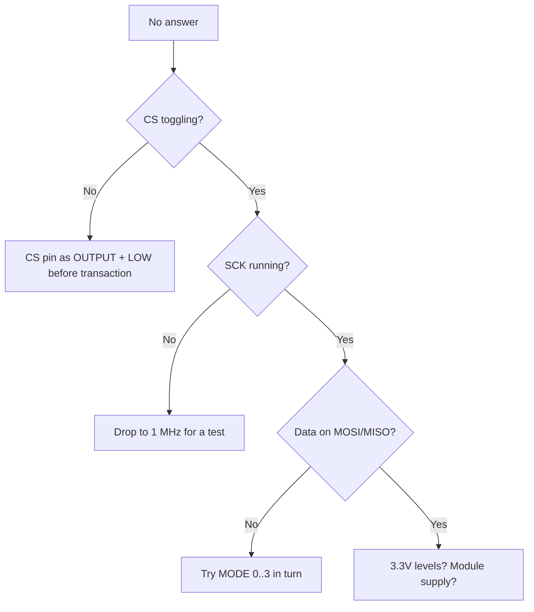

# SPI on ESP32 - VSPI / HSPI

![[assets/img/placeholder.png]]

ESP32 has 4x SPI: SPI0/SPI1 are taken by flash, the user gets **HSPI + VSPI**. Frequency up to 80 MHz (practice - 20-40 MHz).

> [!danger] QSPI flash is taken
> GPIO6-11 are flash. Never use them as regular GPIO/SPI.

## Purpose

SPI on ESP32 - VSPI / HSPI - default pins; SD + display on one bus; code - two VSPI devices. ESP32 has 4x SPI: SPI0/SPI1 are taken by flash, the user gets HSPI + VSPI. Frequency up to 80 MHz (practice - 20-40 MHz). GPIO6-11 are flash. Never use them as regular GPIO/SPI.

## Default pins

| Bus | CLK | MISO | MOSI | CS | Note |
| --- | --- | --- | --- | --- | --- |
| VSPI | 18 | 19 | 23 | 5 | main one, take first |
| HSPI | 14 | 12 | 13 | 15 | second one; 12/15 are strapping, be careful |

Remapping through the matrix is possible, but for 40 MHz+ the defaults are better (IO MUX is faster).

## SD + display on one bus

| ESP32 VSPI | SD module | TFT display | Note |
| --- | --- | --- | --- |
| GPIO18 CLK | CLK | SCK | shared |
| GPIO19 MISO | MISO | (MISO opt.) | shared |
| GPIO23 MOSI | MOSI | MOSI | shared |
| GPIO5 | CS_SD | - | separate CS! |
| GPIO15 | - | CS_TFT | separate CS! |
| GPIO2 | - | DC | data/command |
| GND/3V3 | power | power + LED | shared |

> [!tip] Different CS means different devices
> SCK/MOSI/MISO are shared, **CS is separate per device**. Pull both CS HIGH before init, otherwise there is a conflict.

## Code - two VSPI devices

**Arduino:**

```cpp
#include <SPI.h>
#include <SD.h>
#define CS_SD 5
#define CS_TFT 15
void setup() {
  pinMode(CS_SD, OUTPUT); digitalWrite(CS_SD, HIGH);
  pinMode(CS_TFT, OUTPUT); digitalWrite(CS_TFT, HIGH);
  SPI.begin(18, 19, 23, CS_SD);
  SD.begin(CS_SD, SPI, 20000000);
}
void loop() {}
```

**ESP-IDF:**

```c
#include "driver/spi_master.h"
void app_main(void) {
    spi_bus_config_t bus = {.mosi_io_num=23,.miso_io_num=19,.sclk_io_num=18,.max_transfer_sz=4096};
    spi_bus_initialize(SPI2_HOST, &bus, SPI_DMA_CH_AUTO);
    spi_device_interface_config_t sd = {.clock_speed_hz=20*1000*1000,.spics_io_num=5,.queue_size=4};
    spi_device_handle_t h; spi_bus_add_device(SPI2_HOST, &sd, &h);
}
```

**MicroPython:**

```python
from machine import SPI, Pin
import sdcard, os
spi = SPI(2, baudrate=20000000, sck=Pin(18), mosi=Pin(23), miso=Pin(19))
cs = Pin(5, Pin.OUT, value=1)
sd = sdcard.SDCard(spi, cs)
os.mount(sd, "/sd")
print(os.listdir("/sd"))
```

## Modes 0-3 - timings

The mode sets the clock polarity (CPOL) and the sampling phase (CPHA). A wrong mode means shifted bits / garbage:

| Mode | CPOL | CPHA | Clock idle | Sampling | Typical chips |
| --- | --- | --- | --- | --- | --- |
| Mode 0 | 0 | 0 | LOW | on rising edge | SD cards, MAX7219, MCP3008, most TFTs |
| Mode 1 | 0 | 1 | LOW | on falling edge | some ADCs (ADS7866), radio modules |
| Mode 2 | 1 | 0 | HIGH | on falling edge | rare (some FRAM) |
| Mode 3 | 1 | 1 | HIGH | on rising edge | LoRa SX127x, NRF24L01, W5500 |

```text
Mode 0: CLK ___|‾|_|‾|_|‾|___  MOSI стабільні до rising, читаються на rising
Mode 3: CLK ‾‾‾|_|‾|_|‾|_|‾‾‾  те саме, але idle HIGH
```

Settings:

```cpp
// Arduino: різні пристрої — різні налаштування, перемикай транзакціями!
SPISettings sdSet(20000000, MSBFIRST, SPI_MODE0);
SPISettings loraSet(8000000, MSBFIRST, SPI_MODE0);
SPISettings nrfSet(8000000, MSBFIRST, SPI_MODE0);
SPI.beginTransaction(sdSet);
// ... transfer ...
SPI.endTransaction();
```

```c
// ESP-IDF: режим на пристрій
spi_device_interface_config_t dev = {
    .clock_speed_hz = 20*1000*1000,
    .mode = 0,  // 0..3
    .spics_io_num = 5,
    .queue_size = 4,
};
```

> [!danger] Mixed modes on one bus
> Without `beginTransaction/endTransaction` with the correct `SPISettings` before each CS - the first device "poisons" the settings for the second. Classic: TFT works, SD does not.

## Half-duplex vs full-duplex

| Mode | Lines | Throughput | When |
| --- | --- | --- | --- |
| Full-duplex (4-wire) | SCK + MOSI + MISO | exchange at once | SD, displays with reading, NRF24 |
| Half-duplex (3-wire) | SCK + shared MOSI/MISO | in turns | LED strips (MOSI only), single-wire sensors |
| Write-only | SCK + MOSI | - | WS2812 via SPI, 74HC595, MAX7219 |

ESP-IDF half-duplex (DIO/QIO for flash-like parts, displays):

```c
spi_device_interface_config_t dev = {
    .clock_speed_hz = 40*1000*1000,
    .mode = 0,
    .spics_io_num = 15,
    .queue_size = 4,
    .flags = SPI_DEVICE_HALFDUPLEX,  // MISO+MOSI об'єднані
};
spi_transaction_t t = {
    .flags = SPI_TRANS_USE_TXDATA,
    .length = 8,  // біт!
    .tx_data = {0x2C},  // команда TFT Memory Write
};
spi_device_transmit(h, &t);
```

## DMA transactions

Without DMA every byte is driven by the CPU; with DMA a 320x240 frame flies in the background:

| Approach | CPU load | Max frame | When |
| --- | --- | --- | --- |
| Polling `transfer()` | 100% during it | bytes | init, registers |
| Interrupts + queue | low | 4 KB (default `max_transfer_sz`) | sensors, SD blocks |
| DMA + large buffer | ~0% | 64 KB+ (`max_transfer_sz=65536`) | TFT frames, camera |

```c
// Шина з великим DMA-буфером для дисплея:
spi_bus_config_t bus = {
    .mosi_io_num = 23, .miso_io_num = 19, .sclk_io_num = 18,
    .quadwp_io_num = -1, .quadhd_io_num = -1,
    .max_transfer_sz = 320 * 240 * 2,  // повний кадр RGB565
};
spi_bus_initialize(SPI2_HOST, &bus, SPI_DMA_CH_AUTO);

// Асинхронно: поставив у чергу — пішов готувати наступний кадр
spi_transaction_t t = {.length = 320*240*16, .tx_buffer = framebuf};
spi_device_queue_trans(h, &t, portMAX_DELAY);
// ... інша робота ...
spi_transaction_t *r;
spi_device_get_trans_result(h, &r, portMAX_DELAY);
```

> [!warning] DMA and memory
> The DMA buffer must be in **internal RAM** (not PSRAM!) or with `MALLOC_CAP_DMA`. A frame in PSRAM without copying means `SPI_ERR` / silent garbage. See [[EN/01-Hardware/06-Flash-PSRAM.en]].

## CS cascade + 74HC138 decoder

Few GPIOs? 3 pins give 8 CS through a decoder:

| 74HC138 | ESP32 | Purpose |
| --- | --- | --- |
| A0/A1/A2 | GPIO25/26/27 | device address 0-7 |
| E1,E2 to GND; E3 to 3V3 | power | decoder enable |
| Y0-Y7 | CS_SD, CS_TFT, CS_LoRa... | active LOW, direct CS! |
| - | separate GPIO to E3 | optionally: global disable |

```text
ESP32 GPIO25/26/27 ---> A0/A1/A2 74HC138
                        Y0 --> CS_SD    Y1 --> CS_TFT
                        Y2 --> CS_NRF   Y3 --> CS_W5500 ...
```

```cpp
void cs138(uint8_t addr) {
  digitalWrite(25, addr & 1);
  digitalWrite(26, addr & 2);
  digitalWrite(27, addr & 4);
  delayMicroseconds(1);  // t_pd дешифратора ~10 нс, запас
}
```

> [!tip] Speed vs complexity
> Up to 3-4 devices - separate GPIOs are simpler and faster (no address overhead). 74HC138 pays off from 5+ devices or when GPIO is scarce (S3 with USB + PSRAM).

The cascadeless option without a chip is a "CS chain": keep all CS HIGH in idle, drop only one. A 10k pull-up on each CS is mandatory, otherwise at reset the bus floats and SD/TFT catch phantom commands.

## Speed vs stub length

| Length | Max stable | Comment |
| --- | --- | --- |
| <5 cm (board/module nearby) | 40-80 MHz | only short traces, default IO MUX pins |
| 5-15 cm (DuPont) | 10-20 MHz | breadboard standard; higher means ringing and SD CRC issues |
| 15-30 cm | 4-8 MHz | twisted pair SCK+GND, series-R 33-47 Ohm on SCK |
| >30 cm | up to 4 MHz or move to [[04-Interfaces/05-CAN-TWAI-RS485.en | RS485]]/I2C-extender | SPI is not for long lines |

Overclocking practice:

1. Start at 4 MHz and make sure the protocol is correct.
2. Raise by doubling (8 to 10 to 20 to 40), at each step a stress test of 1000 reads/writes.
3. On issues: shorten the stub, add 33 Ohm on SCK, drop one step down.
4. Through the GPIO Matrix (non-default pins) the ceiling is ~30% lower.

```cpp
// Автотест стабільності SD на частоті f:
bool sd_test(uint32_t f) {
  SPI.begin(18, 19, 23, 5);
  if (!SD.begin(5, SPI, f)) return false;
  File f1 = SD.open("/t.bin", FILE_WRITE);
  for (int i = 0; i < 256; i++) f1.write(i & 0xFF);
  f1.close();
  File f2 = SD.open("/t.bin");
  for (int i = 0; i < 256; i++) if (f2.read() != (i & 0xFF)) return false;
  return true;
}
```

## Octal-SPI / PSRAM bus conflicts

On S3/P4 with Octal-PSRAM/Flash the bus grows to 8 lines - and starts eating pins and cache bandwidth.

| Flash/PSRAM mode | Data lines | Taken pins | User impact |
| --- | --- | --- | --- |
| Quad SPI flash (Classic) | 4 (GPIO6-11) | 6 pins + HD/WP | HSPI/VSPI fully free |
| Quad PSRAM (WROVER) | 4 shared with flash | same + PSRAM CS | cache arbitration: SPI transactions stall on PSRAM access |
| Octal flash (S3R16, P4) | 8 | +GPIO33-37 (S3) / dedicated OPI pins (P4) | these GPIOs are unavailable at all |
| Octal PSRAM (S3R8/R16, P4) | 8 shared with flash | same | long DMA transactions from a PSRAM buffer - only with a copy to DMA-RAM |

Coexistence rules:

1. **Never hang peripherals on OPI pins.** On S3 with Octal-PSRAM these are GPIO33-37 + the standard 6-11 + CS. See [[EN/01-Hardware/06-Flash-PSRAM.en]] and the pinmap of your board (WROOM vs WROVER vs S3R8 are different!).
2. **A DMA buffer in PSRAM means a copy.** GP-SPI DMA reads only internal RAM (`MALLOC_CAP_DMA`). A frame in PSRAM: `memcpy` to a DMA buffer, then `spi_device_queue_trans`, while the next frame is prepared in parallel (double buffering).
3. **Cache conflict:** during a large SPI-DMA transfer with flash reading at once (OTA + display) - jitter. Fix: `spi_device_acquire_bus()` for the critical burst + task priority.
4. **SPI frequency vs OPI:** overclocking the user VSPI to 80 MHz together with Octal-PSRAM at 80 MHz means supply sag + crosstalk. Keep the user bus at 40 MHz or below if OPI is active.

```c
// Подвійна буферизація TFT-кадру з PSRAM-джерела:
#include "driver/spi_master.h"
#include "esp_heap_caps.h"
#define W 320
#define H 240
static uint16_t *dma_buf[2];  // DMA-capable!
void tft_init_dma(void) {
  for (int i = 0; i < 2; i++)
    dma_buf[i] = heap_caps_malloc(W * 2 * 20, MALLOC_CAP_DMA);  // смуга 20 рядків
}
// У циклі: копіюй смугу з PSRAM-кадру в dma_buf[i] → queue_trans → чекай результат іншого буфера.
```

## DMA scatter-gather - long transfers without a contiguous buffer

ESP32-S3/P4 GDMA supports **scatter-gather**: a chain of descriptors, each pointing to its own memory chunk. The SPI driver hides this inside `max_transfer_sz`, but understanding it saves you when optimizing.

| Concept | What it is | Practical sense |
| --- | --- | --- |
| Descriptor | pointer + length + next | one element of the DMA chain |
| `max_transfer_sz` | limit of one transaction | size = the longest atomic transfer (a frame!) |
| GDMA linked list setup | ~2 us per transaction | small transactions (1-8 bytes) are cheaper as polling without DMA |
| Alignment | 32-bit + multiple of 4 bytes | an unaligned RX buffer means silent overwriting of neighbor bytes! |

When to split, when to merge:

| Pattern | Recommendation | Why |
| --- | --- | --- |
| Register writes (1-4 bytes, hundreds at display init) | polling, `SPI_TRANS_USE_TXDATA`, no DMA | queue overhead of 25-28 us kills the DMA gain |
| Frame 320x240x2 = 153 KB | 2-8 stripe transactions + queue (pipeline) | you prepare the next stripe in parallel |
| SD block 512 B | interrupt + DMA, queue_size 4 | classic balance |
| Camera stream to PSRAM | DMA + `MALLOC_CAP_SPIRAM` source, then copy to DMA-RAM in stripes | straight from PSRAM means `ESP_ERR_INVALID_ARG` or garbage |

```c
// Конвеєр смуг: поки DMA жене смугу N, CPU готує N+1
spi_transaction_t t[2] = {0};
for (int i = 0; i < 2; i++) {
  t[i].length = W * 20 * 16;  // біт!
  t[i].tx_buffer = dma_buf[i];
}
int cur = 0;
for (int stripe = 0; stripe < STRIPES; stripe++) {
  render_stripe_to(dma_buf[cur]);                       // CPU
  spi_device_queue_trans(h, &t[cur], portMAX_DELAY);    // DMA старт
  if (stripe > 0) {
    spi_transaction_t *r;
    spi_device_get_trans_result(h, &r, portMAX_DELAY);  // забрати попередню
  }
  cur ^= 1;
}
```

> [!warning] Half-duplex + DMA + Read&Write at once is not supported (IDF Known Issue)
> Workaround: either full-duplex, or split into two transactions (write-command, then read-data), or `SPI_DEVICE_NO_DUMMY` + polling for short ones. Verified on W5500/SX127x drivers.

## Logic analyzer: how to read an SPI capture

Capture setup: sample rate at least **4x SCK** (for 10 MHz SCK - 40 MHz+ samples, for 40 MHz - only an analog oscilloscope or a Saleae Pro 500 MHz).

| What you see | What it means | Action |
| --- | --- | --- |
| CS falls, no clocks | slave not selected / wrong CS pin | check `spics_io_num` + 10k pull-up |
| Clock is there, MOSI flat | `tx_buffer=NULL` without `TXDATA` / DMA buffer in PSRAM | check the buffer + transaction flags |
| MISO flat HIGH/LOW | slave is silent: wrong Mode / had no time to wake after CS | CS-setup delay + Mode 0-3 check |
| Bits shifted by half a tick | wrong Mode (CPHA) | iterate 0 to 3, watch the first ID-register byte |
| First byte ok, then garbage | speed too high for the stub / dummy needed | halve it, add series-R 33 Ohm |
| CS jitters (short spikes) | two drivers pull CS / no `acquire_bus` | mutex + one bus owner |
| Packets tear mid-way | WDT/high-priority interrupt cuts `transmit` | queue + separate task, see [[09-Firmware/06-FreeRTOS-Patterns | FreeRTOS patterns]] |

Reading Mode from a capture (with no datasheet for the chip!):

```text
1. Знайди falling CS. 2. Подивись idle SCK до першого фронту:
   idle LOW → Mode 0 або 1; idle HIGH → Mode 2 або 3.
3. Подивись, коли MOSI змінюється відносно SCK:
   MOSI стабільна ДО rising + міняється ПІСЛЯ rising → вибірка на rising.
   idle LOW + вибірка rising = Mode 0. idle HIGH + вибірка rising = Mode 3.
4. Звір перший прочитаний байт з очікуваним ID (напр. 0xEF для W25Q, 0x22 для NRF).
```

Saleae decoder: add the SPI analyzer, point SCK/MOSI/MISO/CS + Mode + MSB-first. For QSPI add IO2/IO3. Save a preset per bus device.

## Stub length vs MHz - measurement table

Measurements on a DuPont breadboard (VSPI, Mode 0, SD card + TFT, pass bar - 1000 read/write cycles with no CRC issue):

| Stub length | Topology | 4 MHz | 8 MHz | 10 MHz | 20 MHz | 40 MHz |
| --- | --- | --- | --- | --- | --- | --- |
| 3 cm (board) | PCB traces | ok | ok | ok | ok | ok (IO MUX!) |
| 7 cm (short DuPont) | separate wires | ok | ok | ok | ok | issues |
| 10 cm (standard DuPont) | 4-wire ribbon | ok | ok | ok | **limit** | no |
| 20 cm | ribbon + GND nearby | ok | ok | limit | no | no |
| 20 cm | ribbon + series-R 33 Ohm on SCK | ok | ok | ok | limit | no |
| 30 cm | twisted pair SCK+GND | ok | limit | no | no | no |
| 50 cm+ | anything | limit | no | no | no | no |

Fixes from cheap to expensive:

1. Drop one frequency step (free, 30 seconds).
2. Series-R 33-47 Ohm on SCK near the master (kills ringing).
3. A separate GND wire next to each signal (instead of a shared "braid").
4. Twisted pair SCK+GND, MOSI+GND (for 15-30 cm).
5. Move to a differential bus ([[04-Interfaces/05-CAN-TWAI-RS485.en | RS485]]/Ethernet) or move the MCU closer.

> [!tip] GPIO Matrix eats ~30% of the ceiling
> The same 10 cm on default pins (IO MUX) holds 20 MHz, but on remapped pins (Matrix) only 10-12 MHz. For 40 MHz+ - only default pins + short traces. This is recorded in IDF: the Matrix adds ~25 ns of delay.

## QSPI flash - sharing the bus with the user

SPI0/SPI1 (GPIO6-11) are sacred: flash + CPU cache. User access is only through the exceptional scenario with `spi_bus_initialize(SPI1_HOST)` + IRAM + disabled cache (see the `hd_eeprom` example). In practice:

| Question | Answer |
| --- | --- |
| Can I hang a sensor on GPIO6-11? | **No.** This is flash. The board will stop booting. |
| Can I read flash directly with SPI commands? | Via `esp_flash_*` / `esp_partition_*` API - yes; with raw transactions on SPI1 - only if you understand the cache |
| PSRAM on the same SPI1 - does it bother the VSPI display? | Not via the bus, but via supply and GDMA priority - yes, with OTA + rendering at once |
| Need a 3rd SPI? | S3/P4 have SPI3 (FSPI/GPSPI2): take it for the second peripheral instead of fighting over VSPI |

Device layout over buses (recommended):

| Bus | Devices | Why |
| --- | --- | --- |
| VSPI (SPI2) | SD card + TFT (shared, different CS) | fast, DMA, default pins |
| HSPI/SPI3 | LoRa / NRF24 / W5500 / ADC | slower, separate transactions, do not yank the display |
| SPI1 | only flash/PSRAM, hands off | CPU cache |

| Need a 3rd SPI? | S3/P4 have SPI3 (FSPI/GPSPI2): take it for the second peripheral instead of fighting over VSPI |
| CS setup/hold at 40 MHz+ | `cs_ena_pretrans/posttrans` + `input_delay_ns` from an analyzer measurement | clock phase margin |

> [!tip] Golden rule of the CS pause
> After CS falling, wait the slave t_setup (from the datasheet, typ. 50-200 ns) before the first clock: `cs_ena_pretrans = 1` cycle. Without the pause the first ID byte reads broken exactly at 20 MHz+, while at 4 MHz "everything works" - the classic trap. See [[04-Interfaces/03-I2C.en | I2C]] for similar setup requirements.

## Official sources

- ESP-IDF Programming Guide - SPI Master Driver (spi_bus_initialize, spi_bus_add_device, spi_device_queue_trans, polling vs interrupt, bus acquiring, GPIO Matrix vs IO_MUX, timing/input_delay_ns, known issues half-duplex+DMA).
- ESP32 / S3 / P4 Technical Reference Manual - SPI Controller chapter: Command/Address/Dummy/Write/Read phases, quad/octal line modes, dummy-bit workaround.
- ESP-IDF examples: peripherals/spi_master/lcd (DMA + D/C hook), peripherals/spi_master/hd_eeprom (SPI1 + IRAM + cache).
- ESP Hardware Design Guidelines - SPI routing: trace lengths, series-R, crosstalk with OPI.
- ADS7866 Datasheet (TI): <https://www.ti.com/product/ADS7866> - fast SAR ADC, a Mode 1 example.

### Mermaid: SPI gives no answer



## Common issues

| # | Issue | Why it is bad | Correct approach |
| --- | --- | --- | --- |
| 1 | CS not driven (hanging) | Bus busy/conflict | CS OUTPUT, HIGH in idle |
| 2 | 40 MHz out of the box | Ringing on long wires | Start at 1 MHz, raise step by step |
| 3 | Wrong MODE | Bit shift | Datasheet: CPOL/CPHA pairs |
| 4 | MISO with no pull-up (SD!) | Floats when the card is idle | 10-50k pull-up on MISO |
| 5 | Two SPI devices, one CS | Both answer | Separate CS per device |

## See also

- [[EN/Home.en]]
- [[EN/01-Hardware/01-ESP32-Classic.en]]
- [[EN/04-Interfaces/07-SD-SDIO.en]]
- [[11-Vivid/02-TFT-LCD-Epaper | TFT displays]]
- [[04-Interfaces/03-I2C.en | I2C]]
- [[03-GPIO/02-Strapping-Pins.en | Strapping pins]]
- [[03-GPIO/01-GPIO-Overview.en | GPIO overview]]
