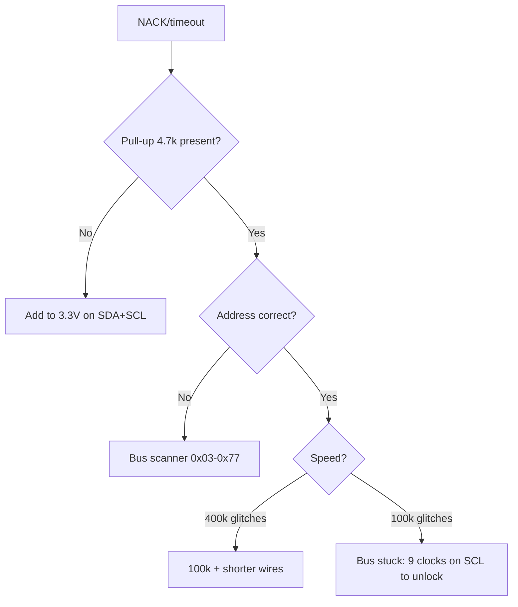

# I2C on ESP32

![[assets/img/placeholder.png]]

Two I2C controllers, default **SDA=GPIO21, SCL=GPIO22**. Speeds 100 / 400 kHz / 1 MHz. Dozens of devices with unique addresses can sit on the bus.

> [!info] Pull-ups are mandatory
> SDA/SCL are open-drain. Without pull-ups the bus does not work. The internal 45k is too little for 400 kHz - place **external 4.7k to 3.3V** (for 1 MHz - 2.2k).

## Purpose

I2C on ESP32 - connection table for several devices; scanner code; NACK troubleshooting. Two I2C controllers, default SDA=GPIO21, SCL=GPIO22. Speeds 100 / 400 kHz / 1 MHz. Dozens of devices with unique addresses can sit on the bus. SDA/SCL are open-drain. Without pull-ups the bus does not work. The internal 45k is too little for 400 kHz - place external 4.7k to 3.3V (for 1 MHz - 2.2k).

## Parameters

| Parameter | Value |
| --- | --- |
| Controllers | 2 (I2C0, I2C1) |
| Default | SDA 21 / SCL 22 |
| Speed | 100 kHz standard, 400 kHz fast, 1 MHz fast+ |
| Pull-up | 4.7k (100-400 kHz), 2.2k (1 MHz) |
| Length | up to ~1 m at 400 kHz, beyond that - P82B715 buffer |

## Connection table - several devices

| ESP32 | OLED 0.96 | BMP280 | Note |
| --- | --- | --- | --- |
| GPIO21 SDA | SDA | SDA | in parallel |
| GPIO22 SCL | SCL | SCL | in parallel |
| 3V3 | VCC | VCC | 3.3V! |
| GND | GND | GND | common |
| - | - | SDO to GND/VCC | address select 0x76/0x77 |
| SDA to 3V3 | - | - | 4.7k |
| SCL to 3V3 | - | - | 4.7k |

## Code - scanner

**Arduino:**

```cpp
#include <Wire.h>
void setup() {
  Serial.begin(115200);
  Wire.begin(21, 22, 400000);
  for (uint8_t a = 1; a < 127; a++) {
    Wire.beginTransmission(a);
    if (Wire.endTransmission() == 0) { Serial.printf("found 0x%02X\n", a); }
  }
}
void loop() {}
```

**ESP-IDF:**

```c
#include "driver/i2c.h"
void app_main(void) {
    i2c_config_t c = {.mode=I2C_MODE_MASTER,.sda_io_num=21,.scl_io_num=22,.sda_pullup_en=GPIO_PULLUP_ENABLE,.scl_pullup_en=GPIO_PULLUP_ENABLE,.master.clk_speed=400000};
    i2c_param_config(I2C_NUM_0, &c);
    i2c_driver_install(I2C_NUM_0, I2C_MODE_MASTER, 0, 0, 0);
    for (int a = 1; a < 127; a++) {
        i2c_cmd_handle_t h = i2c_cmd_link_create();
        i2c_master_start(h); i2c_master_write_byte(h, (a<<1)|I2C_MASTER_WRITE, true); i2c_master_stop(h);
        if (i2c_master_cmd_begin(I2C_NUM_0, h, pdMS_TO_TICKS(50)) == ESP_OK) printf("found 0x%02X\n", a);
        i2c_cmd_link_delete(h);
    }
}
```

**MicroPython:**

```python
from machine import I2C, Pin
i2c = I2C(0, scl=Pin(22), sda=Pin(21), freq=400000)
print([hex(a) for a in i2c.scan()])
```

## Troubleshooting NACK

| Symptom | Cause | Fix |
| --- | --- | --- |
| NACK on all addresses | no pull-ups / SDA/SCL swapped | 4.7k, check the [[03-GPIO/01-GPIO-Overview.en | pins]] |
| Seen once in a while | long wires / 1 MHz too much | drop to 100 kHz, shorter wires |
| Two devices, one address | address conflict | ADDR/SDO jumper, or a second I2C1 |
| Works without WiFi, fails with WiFi | supply sags | separate LDO, 100uF capacitor |

### Mermaid: NACK and stuck lines



## Clock stretching, arbitration, 10-bit addresses

| Mechanism | What happens | What ESP32 does |
| --- | --- | --- |
| Clock stretching | Slave holds SCL LOW until ready | Wait (in hardware); timeout - `i2c_set_timeout` |
| Arbitration (multi-master) | Two masters start together - the one who released SDA first loses | Rare on ESP32; on loss - retry later |
| 10-bit addresses | Prefix `11110XX` + 2 bytes | IDF supports it, in practice almost never met |
| Stuck slave | Holds SDA LOW forever | 9 clocks on SCL by hand or slave supply via a MOSFET switch |

```cpp
// Arduino: розблокування завислиної шини (9 клоків SCL)
void i2c_unlock(int scl, int sda) {
  pinMode(scl, OUTPUT); pinMode(sda, INPUT_PULLUP);
  for (int i = 0; i < 9; i++) {
    digitalWrite(scl, LOW); delayMicroseconds(5);
    digitalWrite(scl, HIGH); delayMicroseconds(5);
    if (digitalRead(sda)) break;  // slave відпустив — стоп!
  }
}
```

### Pull-up calculation: not a 4.7k guess

```text
Rmin = (Vcc - VOL) / IOL = (3.3 - 0.4) / 0.003 ≈ 1к   (не менше — перевантажимо вихід!)
Rmax = tr / (0.8473 × Cbus);  tr=300нс (fast-mode), Cbus≈100пФ → Rmax ≈ 3.5к
Висновок: 2.2–4.7к для 100–400 кГц; довга шина (більша Cbus) → менший R.
```

## Common issues

| # | Issue | Why it is bad | Correct approach |
| --- | --- | --- | --- |
| 1 | No pull-ups | Lines never rise | 4.7k to 3.3V (see 03-GPIO/03) |
| 2 | Pull-ups to 5V | 5V on GPIO! | Only to 3.3V |
| 3 | Two devices, one address | ACK conflict | ADDR pin/TCA9548 multiplexer |
| 4 | 400 kHz over 30 cm DuPont | Bus capacitance | 100 kHz or shorter/shielded |
| 5 | Stuck slave holds SDA | Whole bus is dead | 9 SCL clocks / slave supply over MOSFET |

## Official sources

- [I2C-bus specification (NXP UM10204)](https://www.nxp.com/docs/en/user-guide/UM10204.pdf) - modes, timings, arbitration.
- [ESP32 I2C driver (ESP-IDF)](https://docs.espressif.com/projects/esp-idf/en/latest/esp32/api-reference/peripherals/i2c.html) - master/slave, timeouts.

## See also

- [[EN/Home.en]]
- [[EN/01-Hardware/01-ESP32-Classic.en]]
- [[03-GPIO/03-Pull-Ups-Levels.en | Pull-ups and levels]]
- [[10-Sensors/03-BME280-BMP280-SHT31 | I2C sensors]]
- [[11-Vivid/01-OLED-SSD1306 | OLED displays]]
- [[04-Interfaces/02-SPI.en | SPI]]
- [[13-Power-Modules/02-Level-Shifters | Level shifters]]
