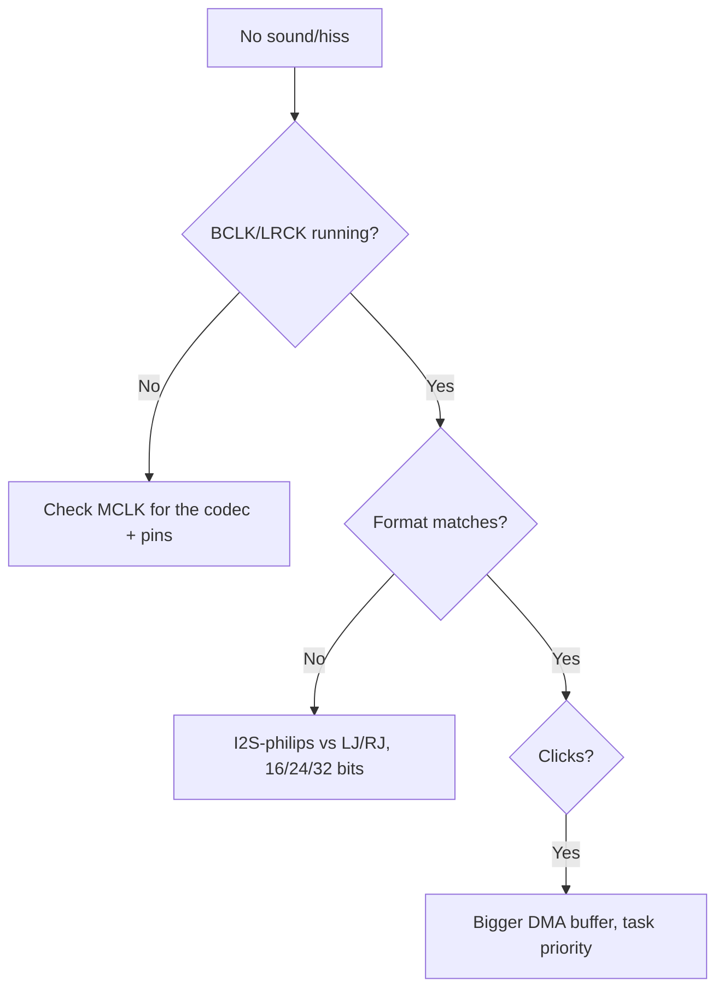

# I2S - ESP32 audio

![[assets/img/i2s-deep-tdm-pdm-scheme.png|600]]

I2S is a digital audio interface: **BCK (bit clock) + WS (channel select) + DOUT/DIN (data)**. The combo: INMP441 microphone (input) + MAX98357A (speaker output) - with no codecs or DAC.

> [!info] Why I2S and not ADC?
> MEMS microphones already give a digital 24-bit stream at 16-48 kHz. Via [[06-Analog/01-ADC | ADC]] you get WiFi noise, via I2S it is clean.

## Purpose

I2S - ESP32 audio - signal table; connection table; I2S modes: Philips / MSB / LSB / PCM / TDM / PDM. I2S is a digital audio interface: BCK (bit clock) + WS (channel select) + DOUT/DIN (data). The combo: INMP441 microphone (input) + MAX98357A (speaker output) - with no codecs or DAC. MEMS microphones already give a digital 24-bit stream at 16-48 kHz. Via [[06-Analog/01-ADC | ADC]] you get WiFi noise, via I2S it is clean.

## Signal table

| Signal | Direction | Frequency | Purpose |
| --- | --- | --- | --- |
| BCK | ESP to modules | 1-3 MHz | bit clocking |
| WS (LRCK) | ESP to modules | 16-48 kHz | L/R channel |
| DOUT (MIC) | MIC to ESP | - | data from the microphone |
| DIN (AMP) | ESP to AMP | - | data to the speaker |

## Connection table

| ESP32 | INMP441 MIC | MAX98357A AMP | Note |
| --- | --- | --- | --- |
| GPIO14 | - | BCLK | shared BCK |
| GPIO15 | - | LRC | shared WS |
| GPIO32 | SD | - | MIC to ESP data |
| GPIO22 | - | DIN | ESP to AMP data |
| GPIO21 | WS | - | microphone WS |
| GPIO19 | SCK | - | microphone BCK |
| 3V3 / GND | VDD/GND, L/R to GND | VIN/GND, GAIN | L/R to GND = left channel |

> [!warning] Speaker supply
> MAX98357A + a 4 Ohm speaker at max takes 1A+ in peaks. Feed the amplifier from **separate 5V**, GND shared with ESP.

## Code

**Arduino (record + play a tone):**

```cpp
#include "driver/i2s.h"
#define I2S_MIC I2S_NUM_0
#define I2S_SPK I2S_NUM_1
void setup() {
  i2s_config_t c = {.mode=(i2s_mode_t)(I2S_MODE_MASTER|I2S_MODE_RX),.sample_rate=16000,.bits_per_sample=I2S_BITS_PER_SAMPLE_32BIT,.channel_format=I2S_CHANNEL_FMT_ONLY_LEFT,.communication_format=I2S_COMM_FORMAT_I2S,.intr_alloc_flags=0,.dma_buf_count=4,.dma_buf_len=256,.use_apll=false};
  i2s_pin_config_t p = {.bck_io_num=19,.ws_io_num=21,.data_out_num=-1,.data_in_num=32};
  i2s_driver_install(I2S_MIC, &c, 0, NULL);
  i2s_set_pin(I2S_MIC, &p);
}
void loop() {}
```

**ESP-IDF:** as above + `i2s_read()` for MIC and a separate TX driver for MAX98357A with `i2s_write()`.

**MicroPython:**

```python
from machine import I2S, Pin
mic = I2S(0, sck=Pin(19), ws=Pin(21), sd=Pin(32),
          mode=I2S.RX, bits=16, format=I2S.MONO, rate=16000, ibuf=4096)
buf = bytearray(2048)
n = mic.readinto(buf)
print("read", n)
```

## 1. I2S modes: Philips / MSB / LSB / PCM / TDM / PDM

ESP-IDF v5 (`i2s_std`, `i2s_tdm`, `i2s_pdm`) splits modes into three drivers. The old `driver/i2s.h` (legacy) is deprecated, do not use it in new projects.

### 1.1. Standard slot formats (2 channels, L/R)

| Format | ESP-IDF macro | WS | Data offset | When needed |
| --- | --- | --- | --- | --- |
| Philips (I2S) | `I2S_STD_PHILIPS_SLOT_DEFAULT_CONFIG` | 50% square wave, f = sample_rate | data shifted by **1 BCLK** from the WS edge | INMP441, MAX98357A, PCM5102 - 95% of modules |
| MSB (left-justified) | `I2S_STD_MSB_SLOT_DEFAULT_CONFIG` | 50% square wave | **no offset**, MSB right on the WS edge | SPH0645, some DACs |
| LSB (right-justified) | manual config of `slot_bit_width` + `ws_width` | 50% | data pushed to the **end** of the slot | rare codecs (TDA1543) |
| PCM short-frame | `I2S_STD_PCM_SLOT_DEFAULT_CONFIG` | **1 BCLK** pulse at frame start | 1 BCLK offset | DSP codecs, phone chips |

Rule: if the microphone is silent or hissing but clocking is there - in 8 of 10 cases it is the **wrong format**. INMP441 = Philips, SPH0645 = MSB. Switching format is one line in `slot_cfg`.

### 1.2. TDM - 8+ channels over 2 wires

TDM (Time-Division Multiplexing) means N slots in one WS frame. On ESP32-S3 (`i2s_tdm`, I2S0/I2S1) - up to **16 slots**, on classic ESP32 there is **no** TDM (only STD/PDM).

| Parameter | S3 value | Comment |
| --- | --- | --- |
| Slots per frame | 2-16 (`I2S_TDM_SLOT0 | SLOT1 | ...`) | mask in `i2s_tdm_slot_config_t::slot_mask` |
| Bits per slot | 8/16/24/32 | all slots identical |
| Formats | Philips / MSB / PCM-short / **PCM-long** | PCM-long: WS = 1 slot wide |
| HW limit | 32 bits x 4 slots max; 16 bits x 8; 8 bits x 16 | product 512 bits/frame or less |

Typical use: a cascade of MEMS microphones (4x ICS-43434 via a TDM splitter), the ES7210 codec (4 microphones in TDM4), multichannel conference recording.

```c
// ESP-IDF v5: TDM4 RX, 16 біт, 16 кГц
i2s_tdm_config_t tdm = {
  .clk_cfg  = I2S_TDM_CLK_DEFAULT_CONFIG(16000),
  .slot_cfg = I2S_TDM_MSB_SLOT_DEFAULT_CONFIG(
      I2S_DATA_BIT_WIDTH_16BIT, I2S_SLOT_MODE_STEREO,
      I2S_TDM_SLOT0 | I2S_TDM_SLOT1 | I2S_TDM_SLOT2 | I2S_TDM_SLOT3),
  .gpio_cfg = {.mclk=I2S_GPIO_UNUSED,.bclk=GPIO_NUM_4,.ws=GPIO_NUM_5,
               .dout=I2S_GPIO_UNUSED,.din=GPIO_NUM_19},
};
i2s_channel_init_tdm_mode(rx_handle, &tdm);
```

### 1.3. PDM microphones: NOT via RMT

> [!danger] Frequent mistake
> PDM is a **separate mode of the I2S peripheral** (`i2s_pdm`, 2 pins: CLK + DIN). NOT RMT, NOT PCNT, NOT bitbang. RMT for PDM has no hardware decimator - you get a raw 1-bit stream at 1-3 MHz that the CPU cannot digest.

- PDM CLK: 1.024-6.144 MHz (typically 2.4 MHz for 16 kHz PCM after x64/x128 decimation).
- The **PDM to PCM converter is hardware only on I2S0** (ESP32 and S3). On I2S1 - only raw PDM, a software FIR filter is needed.
- ESP32-S3 PDM RX holds up to **4 data lines = 8 microphones** (an L/R stereo pair per line).
- PDM TX (PCM to PDM converter, also only I2S0) - direct speaker drive through an RC filter with no DAC.

```c
// PDM-мікрофон MP34DT01 / IM69D130 на S3, I2S0
i2s_pdm_rx_config_t pdm = {
  .clk_cfg  = I2S_PDM_RX_CLK_DEFAULT_CONFIG(16000),
  .slot_cfg = I2S_PDM_RX_SLOT_PCM_FMT_DEFAULT_CONFIG(I2S_DATA_BIT_WIDTH_16BIT, I2S_SLOT_MODE_MONO),
  .gpio_cfg = {.clk=GPIO_NUM_5, .din=GPIO_NUM_19},
};
i2s_channel_init_pdm_rx_mode(rx_handle, &pdm);
```

### 1.4. Clocking: BCLK / LRCK / MCLK and frequency calculation

```text
sample_rate (Fs)  → LRCK/WS = Fs (16 / 44.1 / 48 кГц)
BCLK = Fs × бітів_на_слот × слотів_у_фреймі
MCLK = Fs × mclk_multiple (типово ×256)
```

Examples:

| Mode | Fs | Slots x bits | BCLK | MCLK (x256) |
| --- | --- | --- | --- | --- |
| INMP441 mono 16 kHz 32-bit slot | 16 kHz | 2 x 32 | 1.024 MHz | 4.096 MHz |
| MAX98357 stereo 44.1 kHz 16 bit | 44.1 kHz | 2 x 16 | 1.4112 MHz | 11.2896 MHz |
| TDM8 16 kHz 16 bit | 16 kHz | 8 x 16 | 2.048 MHz | 4.096 MHz |
| PCM5102 HiFi 48 kHz 32 bit | 48 kHz | 2 x 32 | 3.072 MHz | 12.288 MHz |

> [!warning] MCLK only from APLL - and not everywhere!
> MCLK is **not needed by everyone**: INMP441 and MAX98357A work **without MCLK** (BCLK+WS is enough for them). But PCM5102 / UDA1334 / ES8388 demand MCLK at 256xFs. On **classic ESP32 MCLK is output only on GPIO0/1/3** (GPIO0 is strapping, be careful!). On S3 MCLK can go to any GPIO through the matrix. The source of exact MCLK is **APLL** (see section 2). Without APLL the MCLK jitter is large - a HiFi DAC will hiss.

For 24-bit slots set `mclk_multiple = 384` (divisible by 3), otherwise WS drifts.

## 2. DMA: descriptors, buffer vs latency, APLL vs PLL_D2

### 2.1. How data moves

The CPU does not copy samples - GDMA works: peripheral to descriptor chain to buffer ring to `i2s_channel_read/write`. When one DMA buffer fills - the `I2S_IN_SUC_EOF` / `I2S_OUT_EOF` interrupt fires.

```text
dma_buffer_size = dma_frame_num × slot_num × slot_bit_width / 8  (≤ 4092 байт!)
interrupt_interval = dma_frame_num / sample_rate
```

### 2.2. Buffer size vs latency vs clicks

| `dma_frame_num` | Interval at 16 kHz | Latency (6-item ring) | Behavior |
| --- | --- | --- | --- |
| 120 | 7.5 ms | ~45 ms | minimal latency, underrun risk with WiFi |
| 240 | 15 ms | ~90 ms | golden middle for voice |
| 480-511 | 30-32 ms | ~200 ms | stable, but the echo chamber is felt |

Rules:

1. `dma_buffer_size` **always 4092 or less**. At 32 bits x stereo: `dma_frame_num 511 or less`. At 24 bits - a multiple of 3!
2. `dma_desc_num` (descriptor count, typically 6-8) must cover the longest poll cycle: `dma_desc_num > polling_cycle / interrupt_interval`.
3. The user buffer of `i2s_channel_read` must fit **the whole ring**: `recv_size > dma_desc_num x dma_buffer_size`.
4. Clicks mean **TX underrun** (data not fed in time) or **RX overrun** (not fetched in time). Fix: bigger buffers + `i2s_channel_preload_data()` before start + task priority 5 or higher + `CONFIG_I2S_ISR_IRAM_SAFE=y`.

### 2.3. APLL vs PLL_D2: why 44.1 kHz "drifts"

- `PLL_D2` (160 MHz, default): integer divisor, so 48 kHz / 16 kHz / 8 kHz are **exact**, but 44.1 kHz gives **~1% error**. Music is slightly "off key", and most importantly it desyncs from Bluetooth A2DP and USB audio.
- `APLL` (Audio PLL, only classic ESP32 and S3): frequency programmed for Fs, so **44.1 kHz is exact**. Price: one APLL per chip (conflict with Ethernet EMAC), a `ESP_PM_NO_LIGHT_SLEEP` block (no light-sleep during audio), slightly bigger jitter with WiFi active.

```c
// Точні 44.1 кГц: APLL
i2s_std_clk_config_t clk = I2S_STD_CLK_DEFAULT_CONFIG(44100);
clk.clk_src = I2S_CLK_SRC_APLL;
clk.mclk_multiple = I2S_MCLK_MULTIPLE_256;
i2s_channel_reconfig_std_clock(tx_handle, &clk);
```

> [!tip] Heuristic
> Voice at 16 kHz, announcements, TinyML - keep PLL_D2 (`use_apll=false`). Music at 44.1 kHz, HiFi via PCM5102 - turn on APLL. See also [[12-Comm-Modules/11-TinyML-Voice | TinyML voice]].

## 3. Full-duplex: record + play at once

### 3.1. I2S0 vs I2S1: what goes where

| Chip | Ports | Full-duplex | Limits |
| --- | --- | --- | --- |
| ESP32 classic | 2 (I2S0, I2S1) | STD full-duplex on **one** port (TX+RX share BCLK/WS!) | PDM full-duplex **impossible** (different CLKs). ADC/DAC mode only I2S0 |
| ESP32-S2 | 1 (I2S0) | TX+RX on one port, independent GPIOs | no PDM/TDM |
| ESP32-S3 | 2 (I2S0, I2S1) | STD and **TDM** full-duplex; TX and RX have **different** clocks and pins | PDM converter only I2S0; one MCLK output per port |

Classic practice: build the "microphone + speaker" duplex on **one** I2S0 (shared BCLK/WS, different DIN/DOUT). Leave the second port free or for a display. Splitting MIC to I2S0 and SPK to I2S1 in simplex is possible, but you get two independent clocks and frequency beating (see issue no. 9).

S3 is the opposite: TX/RX channels are fully independent, different Fs are possible (e.g. RX 16 kHz microphone, TX 48 kHz music).

### 3.2. Echo chamber and an AEC stub

A direct MIC to SPK loopback with no processing gives an **acoustic howl** (feedback) already at gain above 0.5. The minimal chain for a voice device:

```text
MIC → high-pass 100 Гц (зняти DC) → AGC/лімітер → ×0.3–0.5 → SPK
```

An AEC (acoustic echo cancellation) stub: a clean AEC on ESP32 without PSRAM is heavy (needs an adaptive 128-256 tap NLMS filter), but the minimum that really works:

1. Keep a copy of the TX buffer (what went to the speaker) delayed by the room acoustic delay (~10-30 ms).
2. Subtract it from RX with an adaptive coefficient (LMS step 0.01-0.05).
3. Add a VAD gate: while it talks through the speaker itself - suppress the microphone by 12 dB.

For production AEC see the Espressif `esp-aec` library or the ES8388 codec with hardware echo. See [[12-Comm-Modules/11-TinyML-Voice | TinyML voice]] and [[05-Radio/05-BLE-Mesh-A2DP-HID | A2DP]].

```c
// Full-duplex STD на одному порту (classic + S3 однаково)
i2s_chan_handle_t tx, rx;
i2s_chan_config_t cfg = I2S_CHANNEL_DEFAULT_CONFIG(I2S_NUM_0, I2S_ROLE_MASTER);
i2s_new_channel(&cfg, &tx, &rx);  // одна пара = дуплекс
i2s_std_config_t std = {
  .clk_cfg  = I2S_STD_CLK_DEFAULT_CONFIG(16000),
  .slot_cfg = I2S_STD_PHILIPS_SLOT_DEFAULT_CONFIG(I2S_DATA_BIT_WIDTH_16BIT, I2S_SLOT_MODE_STEREO),
  .gpio_cfg = {.mclk=I2S_GPIO_UNUSED,.bclk=GPIO_NUM_14,.ws=GPIO_NUM_15,
               .dout=GPIO_NUM_22,.din=GPIO_NUM_32},
};
i2s_channel_init_std_mode(tx, &std);
i2s_channel_init_std_mode(rx, &std);
i2s_channel_enable(tx);
i2s_channel_enable(rx);
```

## 4. Microphones: comparison, DC offset, AGC

### 4.1. MEMS microphone comparison

| Microphone | Interface | Sensitivity (1 kHz) | SNR | Feature |
| --- | --- | --- | --- | --- |
| INMP441 | I2S Philips, 24 bit | -26 dBFS | 61 dB | popular standard, L/R pin, cheap |
| SPH0645LM4H | I2S **MSB**, 18 bit | -26 dBFS | 65 dB | louder bass, needs MSB mode! |
| ICS-43434 | I2S Philips, 24 bit | -26 dBFS | 65 dB | better LF response, stable batches |
| IM69D130 | I2S / **PDM**, 24 bit | -36 dBFS | **69 dB** | Hi-End, low noise, also has PDM mode |

All four run on 3.3V and take under 2 mA. For outdoors/wind add a foam cover - MEMS whistles in the wind.

The L/R pin (INMP441/ICS-43434): GND = left channel, VDD = right. Two microphones on one bus: one to GND, the other to VDD gives stereo with no second bus.

### 4.2. DC offset + high-pass (mandatory!)

The raw MEMS stream has a **DC offset** (tens to hundreds of LSB) + infrasonic drift. Without a filter: the WAV "lies" off zero, the RMS meter lies, AGC pumps up silence.

A single-pole 80-120 Hz high-pass, integer (no float in the interrupt):

```c
// y[n] = x[n] - x[n-1] + a*y[n-1], a ≈ 0.995 для 100 Гц при 16 кГц
static int32_t hp_x1 = 0, hp_y1 = 0;
int32_t hp_filter(int32_t x) {
  int32_t y = x - hp_x1 + (int32_t)(0.995f * hp_y1);
  hp_x1 = x; hp_y1 = y;
  return y;
}
// INMP441 дає 24 біт у 32-біт слові: valid = raw >> 8, знак розширити!
int32_t s = ((int32_t)raw >> 8);  // арифметичний зсув
s = hp_filter(s);
```

### 4.3. Software AGC (3-5 lines, saves the recording)

```c
static float agc_gain = 1.0f;
void agc_process(int16_t *buf, int n) {
  int32_t peak = 0;
  for (int i = 0; i < n; i++) { int32_t a = abs(buf[i]); if (a > peak) peak = a; }
  float target = (peak > 0) ? (12000.0f / peak) : 1.0f;
  if (target > 8.0f) target = 8.0f;          // не качати шум тиші
  agc_gain += (target - agc_gain) * 0.05f;   // повільна атака/реліз
  for (int i = 0; i < n; i++) {
    int32_t v = (int32_t)(buf[i] * agc_gain);
    buf[i] = (v > 32767) ? 32767 : (v < -32768) ? -32768 : v;
  }
}
```

Attack of 0.05/block - with no "pumping". For speech add a noise gate: if RMS is under the silence threshold 3 blocks in a row - the gain freezes.

## 5. Speakers and DACs: MAX98357 / PCM5102 / UDA1334

### 5.1. Wiring

| Module | Type | Supply | MCLK? | ESP to module pins |
| --- | --- | --- | --- | --- |
| MAX98357A | I2S amplifier 3 W, DAC inside | 2.5-5.5V (speaker separately!) | **not needed** | BCLK, LRC, DIN + GAIN/SD |
| PCM5102 | HiFi DAC 112 dB, line output | 3.3V | **needed** (256xFs, only APLL!) | BCLK, LRC, DIN, **MCLK/SCK**, FMT to GND (I2S) |
| UDA1334A | DAC + headphone amplifier | 3.3V | **needed** (SYSCLK) | BCLK, WCLK, DATA, SYSCLK |

> [!warning] MCLK issue
> PCM5102 without a clean MCLK is either silent or beeps at 3-8 kHz (the chip PLL did not lock). On classic ESP32 MCLK is only GPIO0/1/3, source is APLL. On S3 - any pin. Oscilloscope check: MCLK must be exactly 256xFs (12.288 MHz at 48 kHz). No MCLK means take MAX98357A for music, it needs no MCLK.

Common ground is mandatory. I2S stub length to the speaker - up to 20 cm with no issues; beyond that - a shield or LVDS. See [[02-Power-Supply/01-Power-Rails.en | Power supply]].

### 5.2. Volume: software vs GAIN pin

MAX98357A has a GAIN pin (fixed 3/6/9/12/15 dB steps through a divider to GND/VDD), plus software volume by sample multiplication.

| Way | Pros | Cons |
| --- | --- | --- |
| GAIN pin (resistor/divider) | zero distortion, max SNR | only 5 steps, needs soldering |
| Software `sample x k` (k 0-1) | smooth, from remote/encoder | bit-depth loss when quiet (16 to 12 bits effective), quantization noise |
| Combination (recommended) | GAIN=9 dB in hardware + exact software 0-100% | slightly more complex |

```c
// Програмна гучність з дизерингом (менше «сходинок» на тихому)
static uint32_t dith = 22222;
int16_t vol_apply(int16_t s, float vol) {
  dith = dith * 1664525 + 1013904223;
  int32_t d = (int32_t)(dith >> 17) & 0xFF; d -= 128;  // ±64 LSB тріанг.
  int32_t v = (int32_t)(s * vol) + (d >> 3);
  if (v > 32767) v = 32767; if (v < -32768) v = -32768;
  return (int16_t)v;
}
```

The SD (shutdown) pin of MAX98357 - mute it (`LOW`) when changing track/Fs, otherwise the speaker bangs.

## 6. Code: WAV to SD, playback, loopback, VU meter

> Card combo: see [[04-Interfaces/07-SD-SDIO.en | SD-SDIO]].

### 6.1. ESP-IDF v5: WAV recording to SD (with a correct header!)

```c
#include "driver/i2s_std.h"
#include <stdio.h>

typedef struct __attribute__((packed)) {
  char riff[4]; uint32_t size; char wave[4]; char fmt[4];
  uint32_t fmt_len; uint16_t audio; uint16_t ch; uint32_t rate;
  uint32_t byte_rate; uint16_t align; uint16_t bits;
  char data[4]; uint32_t data_len;
} wav_hdr_t;

void wav_hdr_fill(wav_hdr_t *h, uint32_t rate, uint32_t samples) {
  memcpy(h->riff,"RIFF",4); memcpy(h->wave,"WAVE",4);
  memcpy(h->fmt,"fmt ",4);  memcpy(h->data,"data",4);
  h->fmt_len=16; h->audio=1; h->ch=1; h->rate=rate; h->bits=16;
  h->align=2; h->byte_rate=rate*2;
  h->data_len=samples*2; h->size=36+h->data_len;
}

// ... після i2s_channel_enable(rx):
FILE *f = fopen("/sdcard/rec.wav","wb");
wav_hdr_t h; wav_hdr_fill(&h, 16000, 0);
fwrite(&h, 1, sizeof h, f);          // плейсхолдер
size_t total = 0; int16_t buf[1024]; size_t n;
for (int i = 0; i < 500; i++) {      // ~16 с
  i2s_channel_read(rx, buf, sizeof buf, &n, portMAX_DELAY);
  // тут: high-pass + agc_process(buf, n/2)
  fwrite(buf, 1, n, f); total += n/2;
}
fseek(f, 0, SEEK_SET);               // дописати довжини!
wav_hdr_fill(&h, 16000, total);
fwrite(&h, 1, sizeof h, f);
fclose(f);
```

> [!danger] Without the second header `fwrite` the file plays only in Audacity, and the player shows 0:00. `data_len` and `size` come **after** recording.

### 6.2. ESP-IDF v5: WAV playback from SD over DMA

```c
FILE *f = fopen("/sdcard/music.wav","rb");
wav_hdr_t h; fread(&h, 1, sizeof h, f);   // перевірити h.audio==1, h.bits==16
// за потреби: i2s_channel_reconfig_std_clock(tx, &clk_44100);
uint8_t *dma = malloc(4096); size_t r, w;
while ((r = fread(dma, 1, 4096, f)) > 0) {
  // тут: vol_apply() по семплах
  i2s_channel_write(tx, dma, r, &w, portMAX_DELAY);
}
free(dma); fclose(f);
```

`i2s_channel_preload_data(tx, dma, 4096, &w)` before `enable` removes the first click.

### 6.3. Microphone to speaker loopback test (a 1-minute check)

```c
// TX і RX вже в full-duplex (розділ 3.2)
int16_t io[512]; size_t n, w;
i2s_channel_preload_data(tx, io, 0, &w);  // тиша в чергу
while (1) {
  i2s_channel_read(rx, io, sizeof io, &n, portMAX_DELAY);
  for (int i = 0; i < (int)(n/2); i++) io[i] = io[i] / 3;  // ×0.33 проти свисту!
  i2s_channel_write(tx, io, n, &w, portMAX_DELAY);
}
```

You hear yourself with ~100 ms delay - the path is alive. Howling - lower the divider to /4 and separate the microphone and the speaker.

### 6.4. VU meter: signal RMS level

```c
#include <math.h>
float vu_rms_dbfs(const int16_t *b, int n) {
  double s = 0;
  for (int i = 0; i < n; i++) s += (double)b[i]*b[i];
  float rms = sqrt(s / n);
  return 20*log10f(rms / 32768.0f + 1e-9f);  // -96..0 dBFS
}
// Вивід: кожні 200 мс print смужку
// -60 тихо | -30 мова | -12 голосно | >-3 кліпінг!
```

Clipping detector: a counter of samples with `|x| > 31000`. More than 10 in a row - lower the AGC ceiling.

### 6.5. Arduino (new `ESP_I2S.h` driver, core 3.x)

```cpp
#include <ESP_I2S.h>
I2SClass I2S;
void setup() {
  I2S.setPins(14, 15, 22, 32, -1);  // bclk, ws, dout, din, mclk(none)
  I2S.begin(I2S_MODE_STD, 16000, I2S_DATA_BIT_WIDTH_16BIT, I2S_SLOT_MODE_STEREO);
}
void loop() {
  uint8_t b[512];
  size_t n = I2S.readBytes((char*)b, sizeof b);
  I2S.write(b, n);
}
// Варіант через ESP8266Audio (MP3 з SD без ручного парсингу):
// #include "AudioFileSourceSD.h", "AudioGeneratorMP3.h", "AudioOutputI2S.h"
// AudioOutputI2S *out = new AudioOutputI2S(0, AudioOutputI2S::EXTERNAL_I2S);
// out->SetPinout(14, 15, 22);
```

### 6.6. MicroPython (`machine.I2S` - full duplex and WAV)

```python
from machine import I2S, Pin, SDCard
import os, struct

# Дуплекс: один об'єкт TX + один RX
mic = I2S(0, sck=Pin(19), ws=Pin(21), sd=Pin(32),
          mode=I2S.RX, bits=16, format=I2S.MONO, rate=16000, ibuf=8192)
spk = I2S(1, sck=Pin(14), ws=Pin(15), sd=Pin(22),
          mode=I2S.TX, bits=16, format=I2S.MONO, rate=16000, ibuf=8192)

# VU-метр
import math
buf = bytearray(1024)
mic.readinto(buf)
s = sum(struct.unpack('<512h', buf)[i]**2 for i in range(512)) / 512
print('RMS dBFS:', 20*math.log10(math.sqrt(s)/32768 + 1e-9))

# Запис WAV 5 с на SD
sd = SDCard(slot=2); os.mount(sd, '/sd')
raw = bytearray(16000*2*5)
mic.readinto(raw)
with open('/sd/rec.wav','wb') as f:
    f.write(struct.pack('<4sI4s4sIHHIIHH4sI',
      b'RIFF', 36+len(raw), b'WAVE', b'fmt ', 16, 1, 1, 16000, 32000, 2, 16,
      b'data', len(raw)))
    f.write(raw)
```

MicroPython limits: TDM and PDM-RAW are not supported, only STD MONO/STEREO 16 bit. For MP3 - only through an external decoder or ESP-IDF.

## Common issues

| No. | Symptom | Cause | Fix |
| --- | --- | --- | --- |
| 1 | Clicks/crackle on playback | DMA buffer too small or the task starves | `dma_frame_num 240 or more`, `desc 6 or more`, task priority 5 or higher, `preload_data()` |
| 2 | 44.1 kHz "drifts", tone is off | PLL_D2 does not divide 44.1 exactly (~1% error) | `clk_src = I2S_CLK_SRC_APLL` |
| 3 | PCM5102 silent or beeping | No MCLK / MCLK not 256xFs | feed MCLK from APLL; on classic - only GPIO0/1/3 |
| 4 | PDM microphone silent on I2S1 | PDM to PCM converter only on I2S0 | move to I2S0 or write software-FIR |
| 5 | L/R channels swapped or one silent | `slot_mask` / microphone L/R pin | `LEFT` vs `RIGHT`; L/R to GND = left, to VDD = right |
| 6 | SPH0645 hisses/silent in Philips mode | SPH0645 demands **MSB** | `I2S_STD_MSB_SLOT_DEFAULT_CONFIG` |
| 7 | Howl on loopback | acoustic feedback, gain 1 or more | divide by 3, separate MIC and SPK, SD muting |
| 8 | Speaker bang at start/Fs change | DMA queue starts with garbage | `preload_data()` with silence + SD=LOW during reconfig |
| 9 | Two simplex ports with tone "beating" | independent I2S0/I2S1 clocks drift apart | one full-duplex port instead of two simplex |
| 10 | WAV 0:00 in the player | `data_len`/`size` not written after recording | `fseek` + header rewrite (sect. 6.1) |
| 11 | 8/16-bit mono on classic with "mixed" samples | HW FIFO-packing bug v1 | the new `i2s_std`/Arduino 3.x driver works around it; on legacy - read stereo and take 1 channel |
| 12 | Silence after `light-sleep` | clock stopped | the driver holds the PM-lock itself; do not kill APLL by hand; after deep-sleep - full reinit |
| 13 | WiFi noise in the recording | long unshielded MIC wires, supply shared with RF | shorter stub under 10 cm, ferrite + 100 nF on microphone VDD, see [[01-Hardware/08-Antennas-RF.en | Antennas]] |
| 14 | `ESP_ERR_NOT_FOUND` on the second channel | ports taken (S2 has only one at all!) | S2: only one I2S; classic/S3: `I2S_NUM_AUTO` or free a port |

## 8. Selection cheat sheet

- Voice assistant / walkie-talkie: INMP441 + MAX98357A, 16 kHz, Philips, PLL_D2, full-duplex I2S0. See [[12-Comm-Modules/11-TinyML-Voice | TinyML voice]].
- HiFi music: PCM5102 + APLL 44.1/48 kHz + MCLK, buffers 480+, SD card via [[04-Interfaces/07-SD-SDIO.en | SD-SDIO]].
- Microphone array / conference: S3 + TDM4/8 or 2x PDM lines on I2S0.
- Battery dictaphone: PDM microphone + light-sleep between phrases, WAV recording to SD. See [[07-Timers/03-Sleep-ULP | Sleep]].

## Official sources

- ESP-IDF I2S (ESP32, STD/PDM/clock/APLL/MCLK pins) - <https://docs.espressif.com/projects/esp-idf/en/latest/esp32/api-reference/peripherals/i2s.html>
- ESP-IDF I2S (ESP32-S3, TDM/PDM converter only I2S0/independent channels) - <https://docs.espressif.com/projects/esp-idf/en/latest/esp32s3/api-reference/peripherals/i2s.html>
- Arduino-ESP32 I2S API (`ESP_I2S.h`, STD/TDM/PDM, simplex/duplex) - <https://github.com/espressif/arduino-esp32/blob/master/docs/en/api/i2s.rst>
- MicroPython ESP32 quickref (I2S bus section, `machine.I2S`) - <https://docs.micropython.org/en/latest/esp32/quickref.html>
- ESP-IDF examples: `examples/peripherals/i2s/{wav_player,mic_recorder,i2s_basic,i2s_codec}` - <https://github.com/espressif/esp-idf/tree/master/examples/peripherals/i2s>

### Mermaid: hiss and silence in I2S



## See also

- [[EN/Home.en]]
- [[EN/01-Hardware/01-ESP32-Classic.en]]
- [[EN/01-Hardware/03-ESP32-S3.en]]
- [[06-Analog/01-ADC | ADC]]
- [[06-Analog/02-DAC-Touch-Hall | DAC]]
- [[07-Timers/01-Timeri-MCPWM-PCNT-RMT | Timers and RMT]]
- [[07-Timers/03-Sleep-ULP | Sleep]]
- [[04-Interfaces/02-SPI.en | SPI]]
- [[04-Interfaces/07-SD-SDIO.en | SD-SDIO]]
- [[12-Comm-Modules/11-TinyML-Voice | TinyML voice]]
- [[02-Power-Supply/01-Power-Rails.en | Power supply]]
