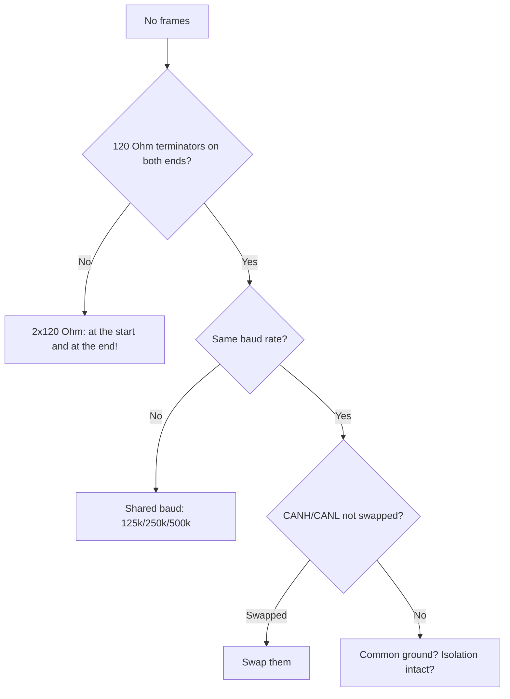

# CAN (TWAI) and RS485

![[assets/img/placeholder.png]]

ESP32 has a built-in **TWAI controller** (CAN 2.0 compatible). But without a transceiver it does not work with the bus. RS485 goes via UART + MAX485.

> [!danger] TWAI does not work without a transceiver
> The TX/RX pins of the controller are 3.3V logic. A **TJA1050 or SN65HVD230** (3.3V!) is needed for the differential CAN bus. Without it you will not see the bus.

## Purpose

CAN (TWAI) and RS485 - TWAI wiring; RS485 - MAX485 + DE/RE; Modbus in short. ESP32 has a built-in TWAI controller (CAN 2.0 compatible). But without a transceiver it does not work with the bus. RS485 goes via UART + MAX485. The TX/RX pins of the controller are 3.3V logic. A TJA1050 or SN65HVD230 (3.3V!) is needed for the differential CAN bus. Without it you will not see the bus.

## TWAI - wiring

| ESP32 | SN65HVD230 (3.3V!) | CAN bus |
| --- | --- | --- |
| GPIO21 | CTX | - |
| GPIO22 | CRX | - |
| 3V3 | VCC | - |
| GND | GND | - |
| - | CANH | CANH (twisted pair) |
| - | CANL | CANL |
| - | RS to GND via 10k | slope mode |

> [!tip] TJA1050 vs SN65HVD230
> TJA1050 runs on 5V, a level-shift on RX is needed. **SN65HVD230 is 3.3V**, straight to ESP32. For new schematics take SN65HVD230.

**Arduino (TWAI):**

```cpp
#include "driver/twai.h"
void setup() {
  twai_general_config_t g = TWAI_GENERAL_CONFIG_DEFAULT((gpio_num_t)21, (gpio_num_t)22, TWAI_MODE_NORMAL);
  twai_timing_config_t t = TWAI_TIMING_CONFIG_500KBITS();
  twai_filter_config_t f = TWAI_FILTER_CONFIG_ACCEPT_ALL();
  twai_driver_install(&g, &t, &f);
  twai_start();
}
```

**ESP-IDF / MicroPython:** ESP-IDF - the same `twai_driver_install` + `twai_transmit/receive`; MicroPython - the `esp32.TWAI` module (in firmware builds with support).

## RS485 - MAX485 + DE/RE

| ESP32 | MAX485 | RS485 bus |
| --- | --- | --- |
| GPIO17 (U2 TX) | DI | - |
| GPIO16 (U2 RX) | RO | - |
| GPIO4 | DE + RE (together) | direction: HIGH=TX, LOW=RX |
| 3V3/GND | VCC/GND | - |
| - | A / B | A/B twisted pair + 120 Ohm terminator at the ends |

**Arduino (Modbus RTU request):**

```cpp
#include <HardwareSerial.h>
HardwareSerial S2(2);
#define DE_RE 4
void setup() { S2.begin(9600, SERIAL_8N1, 16, 17); pinMode(DE_RE, OUTPUT); }
void txMode(bool tx) { digitalWrite(DE_RE, tx); delayMicroseconds(50); }
void loop() {
  txMode(true);
  uint8_t req[] = {0x01, 0x03, 0x00, 0x00, 0x00, 0x01, 0x84, 0x0A};
  S2.write(req, sizeof(req)); S2.flush();
  txMode(false); delay(100);
}
```

**ESP-IDF:** UART + `uart_set_pin()` + DE/RE GPIO; for Modbus - the `esp-modbus` component.

**MicroPython:**

```python
from machine import UART, Pin
u = UART(2, baudrate=9600, tx=17, rx=16)
de = Pin(4, Pin.OUT, value=0)
de.on(); u.write(bytes([1,3,0,0,0,1,0x84,0x0A])); de.off()
print(u.read())
```

## Modbus in short

| Parameter | Value |
| --- | --- |
| Modes | RTU (binary) / ASCII |
| Slave address | 1-247 |
| Functions | 0x03 read holding, 0x04 read input, 0x06/0x10 write |
| Timeout | 50-200 ms between requests |

### Mermaid: CAN is silent



## TWAI filters/masks + error frames

```cpp
// ESP-IDF: приймати тільки ID 0x100–0x10F (приклад маски)
twai_filter_config_t f = {
  .acceptance_code = (0x100 << 21),
  .acceptance_mask = ~(0xFF << 21),  // молодші 8 біт — don't care
  .single_filter = true
};
twai_driver_install(&g_config, &t_config, &f);
```

| Node state | TEC/REC | What to do |
| --- | --- | --- |
| error-active | <128 | Normal, works |
| error-passive | 128-255 | Look for the culprit (baud/terminator) |
| bus-off | >255 | `twai_initiate_recovery()` + logging! |

### Bit-timing in short (why the 8 MHz crystal on MCP2515)

```text
1 Мбіт/с = 8 TQ по 125 нс; похибка кварца ±1% — межа для 1 Мбіт.
Тому MCP2515-модулі з керамічним резонатором замість кварца на 1 Мбіт — лотерея:
для надійності або кварц 8/16 МГц, або бод ≤500 кбіт.
```

## Common issues

| # | Issue | Why it is bad | Correct approach |
| --- | --- | --- | --- |
| 1 | One terminator or zero | Reflections, frame issues | 2x120 Ohm, ends of the bus |
| 2 | Different baud rates | Bus in error-passive | One baud for all |
| 3 | CANH/CANL swapped | Dominant/recessive reversed | Check the pair colors |
| 4 | Long bus at 1 Mbps | Attenuation | 1 Mbps - up to 40 m; lower baud beyond that |
| 5 | No common ground | Floating potential | GND or an isolated transceiver |

## Official sources

- [ISO 11898 / CiA 301 overview](https://www.can-cia.org/can-knowledge/) - frames, arbitration, error frames.
- [ESP32 TWAI driver (ESP-IDF)](https://docs.espressif.com/projects/esp-idf/en/latest/esp32/api-reference/peripherals/twai.html) - filters, masks, states.

## See also

- [[EN/Home.en]]
- [[EN/01-Hardware/01-ESP32-Classic.en]]
- [[04-Interfaces/01-UART.en | UART]]
- [[12-Comm-Modules/04-RS485-CAN-Ethernet-Kamera | RS485 CAN modules]]
- [[03-GPIO/01-GPIO-Overview.en | GPIO overview]]
- [[05-Radio/03-ESP-NOW | ESP-NOW]]
- [[05-Radio/01-WiFi-STA-AP | WiFi]]
