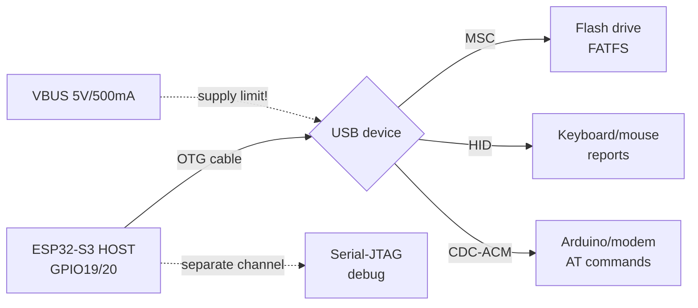

# USB OTG and JTAG

![[assets/img/placeholder.png]]

ESP32 Classic has **no** native USB - boards carry a [[04-Interfaces/06-USB-OTG-JTAG.en | CH340 / CP2102]] bridge. Native USB D-/D+ exists only on **S2/S3** (GPIO19/20), JTAG is for debugging.

> [!info] Classic vs S2/S3
> Classic: flashing via UART0 + CH340. S2/S3: CDC via USB + JTAG via the same cable. Do not look for USB on Classic - it is not there.

## Purpose

USB OTG and JTAG - comparison; connection table; code - CDC on S3. ESP32 Classic has no native USB - boards carry a [[04-Interfaces/06-USB-OTG-JTAG.en | CH340 / CP2102]] bridge. Native USB D-/D+ exists only on S2/S3 (GPIO19/20), JTAG is for debugging. Classic: flashing via UART0 + CH340. S2/S3: CDC via USB + JTAG via the same cable. Do not look for USB on Classic - it is not there.

## Comparison

| Chip | Native USB | D-/D+ pins | CDC console | JTAG |
| --- | --- | --- | --- | --- |
| ESP32 Classic | no | - | no (CH340) | external FT2232 |
| ESP32-S2 | USB OTG FS | GPIO19/20 | yes | built-in |
| ESP32-S3 | USB OTG FS | GPIO19/20 | yes | built-in USB-Serial-JTAG |
| ESP32-C3 | USB Serial/JTAG | GPIO18/19 | yes | built-in |
| ESP32-C6 | USB Serial/JTAG | - | yes | built-in |

## Connection table

| Board | USB | UART bridge | JTAG |
| --- | --- | --- | --- |
| DevKit Classic | microUSB to CH340 to U0 (1/3) | CH340 TX to RX0, RX to TX0 + DTR/RTS for auto-reset | - |
| S3 DevKit | USB-C to GPIO19/20 | CDC, auto-reset | built-in, `openocd -f esp32s3-builtin.cfg` |
| Classic + debug | - | - | TDI 12, TCK 13, TMS 14, TDO 15 |

> [!warning] JTAG takes strapping pins
> TDI=12, TMS=14, TDO=15 - see [[03-GPIO/02-Strapping-Pins.en | strapping pins]]. During debug do not hang peripherals there.

## Code - CDC on S3

**Arduino (S3 USB-CDC):**

```cpp
// Tools > USB CDC On Boot: Enabled
void setup() { Serial.begin(115200); }
void loop() { Serial.println("hello usb"); delay(1000); }
```

**ESP-IDF (S3):**

```c
// menuconfig: Component config > ESP System Settings > Channel for console output > USB CDC
// далі звичайний printf працює через USB
#include <stdio.h>
void app_main(void) { printf("hello usb\n"); }
```

**MicroPython:** on S3/C3 the REPL is straight via USB-CDC, the code is the same `print()`.

## USB-host on S2/S3: flash drives, mice, modems

The same GPIO19/20 port can act as host: S2/S3 connect foreign USB devices via the TinyUSB-host stack (IDF) or `USBHost` (Arduino). Classic, C3, C6 have NO host (C3/C6 have only the fixed USB-Serial-JTAG).

| Chip | USB-host (OTG) | What it really pulls |
| --- | --- | --- |
| ESP32 Classic | no | only the CH340 bridge |
| ESP32-S2 | yes, OTG FS | MSC + HID + CDC, one port with no hub |
| ESP32-S3 | yes, OTG FS | same + the built-in Serial-JTAG in parallel |
| ESP32-C3/C6 | no (device-only Serial-JTAG) | no host at all |

![[assets/img/usb-host-msc-hid-scheme.png|600]]
*Fig. ESP32-S3 as USB host: flash drive (MSC+FAT), keyboard/mouse (HID), modem (CDC), VBUS 5V supply.*

### ASCII wiring scheme

```text
ESP32-S2/S3 (HOST, GPIO19=D-, GPIO20=D+)
  │
  ├─ OTG-кабель (ID на землю = host-режим)
  │
  ├─► USB-флешка ──► MSC BOT ──► FATFS ──► /usb/read.txt
  ├─► Клавіатура/миша ──► HID boot-протокол ──► парсер репортів
  ├─► Arduino/модем ──► CDC-ACM (tty) ──► AT-команди
  └─► [живлення!] VBUS 5V до 500 мА ──► флешка + світлодіод = межа

ОКРЕМО: вбудований USB-Serial-JTAG (той самий кабель S3)
  ──► прошивка + монітор + JTAG-дебаг (див. [[09-Firmware/05-JTAG-Debug]])
```

### Mermaid



## MSC flash drive: FAT reading/writing

The MSC host driver (Bulk-Only Transport) + FATFS: the flash drive mounts as a disk. Works on S2/S3 via the `espressif/usb_host_msc` component.

Practice rules:

- File system is FAT32 (the host cannot do exFAT); long names - yes, Cyrillic - depends on the encoding luck.
- Mount/unmount the flash drive explicitly; yanking it mid-write means broken FAT (see [[08-Memory/02-Filesystem | File systems]]).
- Supply: a flash drive eats 100-200 mA in peaks, writing is the most. A weak LDO means write issues.
- For a logger it is better to write to SD (see [[EN/04-Interfaces/07-SD-SDIO.en]]), a USB flash drive is for taking dumps and configs.

## HID keyboard/mouse: report parser

The HID boot protocol is a fixed format, parsed with no descriptor tree:

```text
Клавіатура (8 байт): [модифікатори][резерв][key1..key6]
  модифікатори: bit0=CtrlL bit1=ShiftL bit2=AltL bit3=WinL, біти 4-7 праві
  keyN: HID usage ID клавіші (0 = нема натискання)
Миша (4 байти): [кнопки][dx][dy][wheel]
  dx/dy: знакові зміщення, wheel: прокрутка
```

Full parsing of custom HID descriptors (game pads, barcode scanners with vendor pages) goes through the TinyUSB report callback: read `report_id` + length and parse per the device datasheet.

## CDC-host: Arduino boards and modems

The CDC-ACM host sees Arduino (USB-serial), 4G modems, USB GPS receivers as a virtual COM port: open, set baud, send AT commands.

- Arduino as USB-device + ESP32-S3 as host = a UART-data bridge between two boards with no RX/TX wires.
- Modems (SIM7600 over USB): the AT commands are the same as over UART (see [[12-Comm-Modules/07-SIM7600-W5500-MCP2515 | SIM7600 modems]]), but check VID/PID and the need for a specific driver (some are not clean CDC).
- After `AT+CFUN` and connect, traffic goes via PPP/tty - heavy for RAM without PSRAM, plan a buffer.

## UAC microphone: overview

UAC (audio class, isochronous transfers) is supported as host, but it is a hard path: isochronous traffic every millisecond frame, buffers and timings are critical. For voice commands and a noise meter a digital I2S microphone is simpler (see [[04-Interfaces/04-I2S.en | I2S]]). Take a USB microphone only when the device already exists and cannot be resoldered.

## RNDIS/ECM: overview + warning

> [!warning] RNDIS/ECM is not "USB internet out of the box"!
> A USB modem as a network card demands an RNDIS/ECM host driver + DHCP + TCP/IP on top - hundreds of kilobytes of RAM and unstable vendor implementations. For network access a WiFi module or UART-PPP to the modem is cheaper.

## USB-Serial-JTAG: built-in debug

On S3/C3 a separate hardware block (not OTG!): one USB cable gives a CDC console + JTAG with no adapters. Enabled by console choice in `menuconfig`, debug is `openocd -f board/esp32s3-builtin.cfg`. Full procedure - [[09-Firmware/05-JTAG-Debug | JTAG debugging]]. Remember: after Secure Boot JTAG closes forever (see [[08-Memory/04-Secure-Boot-Encrypt | Secure Boot]]).

## VBUS 5V/500mA supply + OTG cable

| Requirement | Value | Note |
| --- | --- | --- |
| VBUS | 5V ±5% | from the host board or a powered hub |
| Current | up to 500 mA (USB 2.0) | flash drive 100-200 mA, HDD - forbidden |
| OTG cable/adapter | ID pin to GND | without it S2/S3 stays a device |
| Hub | only self-powered | passive hub + flash drive = sag and dropouts |
| Capacitor | 47-100 uF on VBUS near the connector | smooths flash-write peaks |
| Measurement | USB tester / multimeter on VBUS | on sag below 4.75V - MSC issues |

Logic supply - as always via stable 3V3 (see [[EN/02-Power-Supply/01-Power-Rails.en]]). Do not feed an S3 host from a weak CH340 cable: VBUS itself drops first.

## ESP-IDF code: MSC + HID host

```c
// IDF S2/S3: компоненти espressif/usb_host_msc + usb_host_hid + fatfs
// idf.py add-dependency "espressif/usb_host_msc"
#include "usb/usb_host.h"
#include "usb_host_msc.h"
#include "usb_host_hid.h"
#include "esp_vfs_fat.h"

#define MNT "/usb"

void app_main(void) {
    // 1. USB-host install + daemon-задача (див. приклад msc в esp-idf):
    usb_host_config_t host_cfg = {
        .skip_phy_setup = false,
        .intr_flags = ESP_INTR_FLAG_LEVEL1,
    };
    ESP_ERROR_CHECK(usb_host_install(&host_cfg));
    xTaskCreate(usb_host_task, "usb_host", 4096, NULL, 2, NULL);

    // 2. MSC: чекати підключення флешки, змонтувати FAT:
    // (msc-драйвер кидає подію READY → монтуємо)
    // ESP_ERROR_CHECK(esp_vfs_fat_usb_mount(MNT, ...));
    FILE *f = fopen(MNT "/log.txt", "a");
    if (f) { fprintf(f, "hello usb\n"); fclose(f); }

    // 3. HID: колбек репортів клавіатури (boot-протокол, 8 байт):
    // usb_host_hid_set_report_callback(kbd_cb);
    // kbd_cb: buf[0]=модифікатори, buf[2..7]=keycodes → hid_usage_to_ascii()
}
```

Keyboard report parsing:

```c
// buf[8]: [mod][rsv][k1..k6]
static void kbd_report(const uint8_t *b) {
    bool shift = b[0] & 0x22;
    for (int i = 2; i < 8; i++) {
        if (b[i] == 0) continue;
        printf("key usage=0x%02x shift=%d\n", b[i], shift);
    }
}
```

## Arduino code (S3, USBHost MSC + HID)

```cpp
// Arduino-ESP32 (core 3.x) на S3: Tools > USB Mode = "USB-OTG"
#include "USB.h"
#include "USBHost.h"
#include "USBHIDKeyboard.h"
#include "USBMSC.h"

USBHost host;
USBHIDKeyboard kbd;
USBMSC msc;

void onKey(uint8_t mod, uint8_t key) {
  Serial.printf("mod=0x%02x key=0x%02x\n", mod, key);
}

void setup() {
  Serial.begin(115200);
  host.begin();                 // S3 в host-режимі, OTG-кабель обов'язковий
  kbd.onKey(onKey);             // HID-колбек
  kbd.begin(host);
  if (msc.begin(host)) {        // MSC-флешка знайдена
    Serial.printf("sectors=%lu\n", (unsigned long)msc.sectorCount());
    // далі — FFat/FATFS поверх msc.readBlocks/writeBlocks
  }
}

void loop() {
  host.task();                  // опитування хоста — викликати ЧАСТО
}
```

> [!note] The Arduino-USBHost API depends on the core version!
> Class names (`USBHost`, `USBHIDKeyboard`) and examples (`USBHostMSC`, `USBHostHID`) - check in your core version. The logic is the same: `begin()`, then `task()` in the loop, then event callbacks.

## Common issues

| Symptom | Cause | Fix |
| --- | --- | --- |
| Descriptor does not parse / `enumeration failed` | non-standard device, long descriptor, endpoint resource shortage | Trim the config (fewer CDC interfaces), take another flash drive, look at the descriptor log |
| Flash drive mounts and drops on write | VBUS sag, weak LDO/cable | 47-100 uF capacitor, shorter cable, powered hub, measure 5V |
| Unpowered hub + 2 devices = nothing seen | over 500 mA | Only a self-powered hub; HDD/fans - forbidden |
| Keyboard silent, mouse works | not the boot protocol, a report parser is needed | Read the HID descriptor, parse `report_id`, verify the length |
| CDC modem answers no AT | not clean CDC-ACM (vendor class, QMI/RNDIS) | Switch the modem to CDC/ECM mode with an AT command over UART, or UART-PPP |
| S3 seen as device, host does not start | cable with no OTG-ID, USB-Serial-JTAG mode | OTG adapter with ID to GND; `USB Mode = USB-OTG`, not CDC |
| `host.task()` rare - lost symbols | HID reports overflow | `task()` every `loop()` iteration, no `delay()` |
| After deep-sleep the host sees no devices | the stack does not survive sleep | Full `usb_host_install` reinit after wake |

## Official sources

- [USB Host - ESP-USB (S3)](https://docs.espressif.com/projects/esp-usb/en/latest/esp32s3/usb_host.html) - Host Library, MSC/HID/CDC class drivers, `msc`/`hid` examples.
- [USB Serial/JTAG Console - ESP-IDF (S3)](https://docs.espressif.com/projects/esp-idf/en/stable/esp32s3/api-guides/usb-serial-jtag-console.html) - built-in debug, flashing via the same cable.
- [USB OTG Console - ESP-IDF (S3)](https://docs.espressif.com/projects/esp-idf/en/stable/esp32s3/api-guides/usb-otg-console.html) - PHY switching between Serial-JTAG and OTG.
- [USB API - Arduino-ESP32](https://docs.espressif.com/projects/arduino-esp32/en/latest/api/usb.html) - `USBHost`, MSC/HID, TinyUSB vs IDF stack.

## See also

- [[EN/Home.en]]
- [[EN/01-Hardware/01-ESP32-Classic.en]]
- [[04-Interfaces/01-UART.en | UART]]
- [[09-Firmware/04-Esptool-Flash | Boot and flashing]]
- [[03-GPIO/02-Strapping-Pins.en | Strapping pins]]
- [[04-Interfaces/06-USB-OTG-JTAG.en | USB-UART bridges]]
- [[09-Firmware/05-JTAG-Debug | Debugging]]
