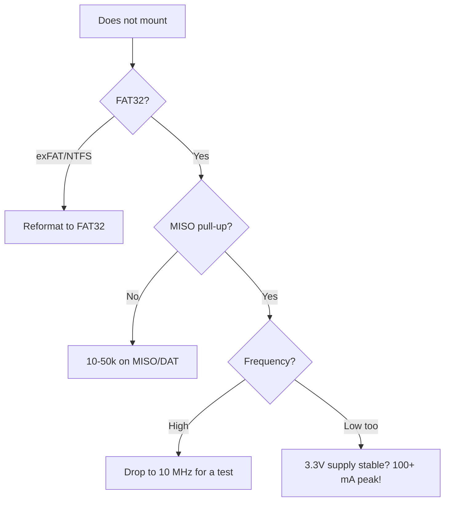

# SD cards - SPI vs SDMMC

![[assets/img/placeholder.png]]

Two modes: **SPI 1-bit** (simple, slow) and **SDMMC 1/4-bit** (fast). Supply is strictly 3.3V, peaks up to 200 mA on write.

> [!warning] 3.3V 200 mA supply
> Cheap AMS1117 on DevKit sag when writing SD + WiFi. Add a 100-470 uF electrolytic near the slot, otherwise expect random unmounts.

## Purpose

SD cards - SPI vs SDMMC - mode comparison; SDMMC pins (default); connection table - SPI SD module. Two modes: SPI 1-bit (simple, slow) and SDMMC 1/4-bit (fast). Supply is strictly 3.3V, peaks up to 200 mA on write. Cheap AMS1117 on DevKit sag when writing SD + WiFi. Add a 100-470 uF electrolytic near the slot, otherwise expect random unmounts.

## Mode comparison

| Mode | Speed | Pins | When |
| --- | --- | --- | --- |
| SPI | ~4-10 Mbps | 4 (CLK/MISO/MOSI/CS) | simple, any pins, display on the same bus |
| SDMMC 1-bit | ~20 Mbps | 4 (CLK/CMD/D0 + GND) | faster, fixed pins |
| SDMMC 4-bit | ~40+ Mbps | 6 (CLK/CMD/D0-D3) | maximum, logger, camera |

## SDMMC pins (default)

| Signal | GPIO | Note |
| --- | --- | --- |
| CLK | 6* / 14 | *6 is flash, so remap to 14 |
| CMD | 11* / 15 | remap to 15 |
| D0 | 7* / 2 | remap to 2 |
| D1/D2/D3 | - / 4,12,13 | 4-bit only |

In practice for SDMMC 1-bit take: CLK=14, CMD=15, D0=2 (+ 10k pull-up on each line).

## Connection table - SPI SD module

| ESP32 | SPI SD module | Note |
| --- | --- | --- |
| GPIO18 | CLK | VSPI CLK |
| GPIO19 | MISO | + 10k pull-up |
| GPIO23 | MOSI | - |
| GPIO5 | CS | separate CS |
| 3V3 | VCC | 3.3V, not 5V! |
| GND | GND | common |

## Code

**Arduino (SPI + FAT):**

```cpp
#include <SD.h>
#include <SPI.h>
void setup() {
  Serial.begin(115200);
  SPI.begin(18, 19, 23, 5);
  if (!SD.begin(5, SPI, 20000000)) Serial.println("mount fail");
  else Serial.println("mounted");
}
```

**ESP-IDF (SDMMC):**

```c
#include "esp_vfs_fat.h"
#include "sdmmc_cmd.h"
// host + slot_config для SDMMC 1-bit, mount /sdcard
// див. example sd_card/sdmmc
```

**MicroPython:**

```python
from machine import SPI, Pin
import sdcard, os
spi = SPI(2, baudrate=20000000, sck=Pin(18), mosi=Pin(23), miso=Pin(19))
os.mount(sdcard.SDCard(spi, Pin(5)), "/sd")
print(os.listdir("/sd"))
# LittleFS для internal: os.VfsLfs2.mkfs(bdev)
```

> [!info] FAT vs LittleFS
> SD is FAT only (PC compatibility). Internal flash is [[08-Memory/02-Filesystem | LittleFS]] (resistant to supply failures).

## Speeds in a table - SPI vs SDMMC in detail

| Mode | Width | SD clock | Theor. peak | Real (measured) | CPU-load |
| --- | --- | --- | --- | --- | --- |
| SPI | 1 bit | 20 MHz | 2.5 MB/s | 0.5-1.2 MB/s write | high (no DMA) |
| SDMMC 1-bit | 1 bit | 20 MHz | 2.5 MB/s | ~1.5-2 MB/s | low (HW SDMMC) |
| SDMMC 4-bit | 4 bits | 20 MHz | 10 MB/s | 4-8 MB/s | low |
| SDMMC 4-bit HS | 4 bits | 40 MHz | 20 MB/s | 8-12 MB/s (UHS-I card) | low |

Conclusion: a once-a-second logger is fine with SPI; a camera / audio stream / fast IMU log needs only SDMMC 4-bit.

SDMMC 4-bit pins (remap example, free of flash):

| Signal | GPIO | Pull-up | Comment |
| --- | --- | --- | --- |
| CLK | 14 | - (push-pull) | series-R 33 Ohm on a long trace |
| CMD | 15 | 10k | strapping! - check boot with the card connected |
| D0 | 2 | 10k | strapping! - the card has an internal ~50k pull-up, weak - add 10k |
| D1 | 4 | 10k | 4-bit only |
| D2 | 12 | 10k | strapping VDD_SDIO! - the riskiest SDMMC pin |
| D3 | 13 | 10k | 4-bit only |

> [!danger] SDMMC + strapping = double risk
> D2 on GPIO12 and CMD/D0 on 15/2 are strapping pins. A card with its own pull-ups can break boot. If the board sometimes does not start with the card inserted - this is it. Fix: buffer/isolation or back to SPI mode. See [[03-GPIO/02-Strapping-Pins.en | Strapping pins]].

ESP-IDF SDMMC 4-bit mount:

```c
#include "esp_vfs_fat.h"
#include "sdmmc_cmd.h"
#include "driver/sdmmc_host.h"
void sdmmc_mount(void) {
    sdmmc_host_t host = SDMMC_HOST_DEFAULT();
    host.max_freq_khz = SDMMC_FREQ_HIGHSPEED;  // 40 МГц
    sdmmc_slot_config_t slot = SDMMC_SLOT_CONFIG_DEFAULT();
    slot.width = 4;
    slot.clk = 14; slot.cmd = 15; slot.d0 = 2; slot.d1 = 4; slot.d2 = 12; slot.d3 = 13;
    slot.flags |= SDMMC_SLOT_FLAG_INTERNAL_PULLUP;  // + зовнішні 10к!
    esp_vfs_fat_sdmmc_mount_config_t mc = {
        .format_if_mount_failed = false, .max_files = 5,
        .allocation_unit_size = 16 * 1024};
    sdmmc_card_t *card;
    esp_err_t r = esp_vfs_fat_sdmmc_mount("/sdcard", &host, &slot, &mc, &card);
    if (r == ESP_OK) sdmmc_card_print_info(stdout, card);
}
```

## FATFS settings

| Parameter | Recommendation | Why |
| --- | --- | --- |
| `allocation_unit_size` | 16-32 KB | large clusters = fast sequential logger writes |
| `max_files` | 3-5 | each open file = RAM (~500 B + buffer) |
| `format_if_mount_failed` | **false** on production! | true wipes user data on one supply glitch |
| Code page | 1251/UTF-8 via `ffconf.h` | Cyrillic in file names |
| `SDCARD_INTR` / DMA | enabled by default in SDMMC | do not disable without reason |
| flush policy | `fflush` / `fsync` every N writes | balance: wear vs data loss on power cut |

Reliable logger pattern (buffer + rare flush):

```cpp
File log_;
unsigned long lastSync = 0;
void logLine(const String &s) {
  log_.println(s);  // RAM-буфер FATFS
  if (millis() - lastSync > 5000) { log_.flush(); lastSync = millis(); }
  // flush раз на 5 с: втрата максимум 5 с даних, зате карта живе роками
}
```

## Card wear + wear-leveling

| Fact | Impact | Mitigation |
| --- | --- | --- |
| NAND life of TLC cards ~500-3000 cycles per block | a every-second rewrite of one file kills a block in months | append, do not rewrite; file rotation |
| The card controller does wear-leveling itself, but only over written blocks | a small file spinning in place is bad | files 1 MB or more, rotation `log_001.csv...` |
| Power cut mid-write = broken FAT + lost cluster | "card suddenly RAW" | periodic `flush()` + 470 uF capacitor + supercap opt. |
| Cheap no-name cards lie about flush | data in the controller cache is lost | take SanDisk/Samsung Endurance for loggers |

File rotation (example):

```cpp
void rotateIfBig(const char *path) {
  File f = SD.open(path);
  if (f && f.size() > 2 * 1024 * 1024UL) {  // >2 МБ — новий файл
    f.close();
    static int n = 0;
    char np[32]; snprintf(np, sizeof np, "/log_%03d.csv", ++n);
    SD.rename(path, np);
  } else if (f) f.close();
}
```

Internal flash for frequent small writes is [[08-Memory/02-Filesystem | LittleFS]] (journaled, resistant to supply breaks), SD is for large arrays.

## Fake SD cards (h2testw!)

| Fake sign | Check |
| --- | --- |
| "128 GB" at the price of 16 GB | **h2testw** (Windows) or **F3** (`f3write/f3read`, Linux) - write+read of the whole volume |
| Write breaks / speed drops to 1 MB/s after N GB | real volume = N GB, the rest is air (circular overwrite) |
| Unknown VID, crooked print | `CID` dump via `sdmmc_card_print_info` / ChipGenius |
| Card "loses" old files when writing new ones | fake classic: the controller overwrote the old |

Card acceptance procedure:

1. `h2testw` Write+Verify (or `f3write /mnt/sd && f3read /mnt/sd`) - an hour of time, but saves the project.
2. Only after `Test finished without errors` - into the logger.
3. Label cards (date, real volume) - do not mix fakes with production ones.

> [!warning] Fake card + OTA/logs
> Symptoms like "SD sometimes mount fail, sometimes files are zeroed" are 90% a fake or dying card, not a code bug. Before debugging the driver - run h2testw/F3.

## 200 mA+ supply

| Consumer | Peak | Note |
| --- | --- | --- |
| SD card write | 100-200 mA | short 2-5 ms peaks |
| SD + WiFi TX at once | 300-450 mA total | cheap AMS1117 clones sag exactly here |
| Capacitor near the slot | 100-470 uF electrolytic + 100 nF ceramic | <10 mm from the slot VCC |
| Supply | strictly 3.3V | 5V modules with onboard AMS1117 - feed the module from 5V, not the card directly |

Hunger signs: `mount failed`, `sdmmc_read_blocks failed (0x107)`, random unmount during WiFi activity. Fix: thick supply wires (not thin 30 cm DuPont!), an electrolytic near the slot, a separate LDO for SD with WiFi in parallel. See [[02-Power-Supply/01-Power-Rails.en | Power supply]].

## SDIO tuning - squeeze the max from the 4-bit bus

| Tuning knob | Where to turn | Effect | Risk |
| --- | --- | --- | --- |
| `host.max_freq_khz = SDMMC_FREQ_HIGHSPEED` (40 MHz) | `sdmmc_host_t` | x2 throughput vs 20 MHz | short traces + good pull-ups needed |
| `slot.width = 4` | `sdmmc_slot_config_t` | x4 vs 1-bit | D1/D2/D3 routed + GPIO12 strapping risk! |
| `host.flags &= ~SDMMC_HOST_FLAG_DDR` | DDR off | stability on long traces | -30% peak on eMMC |
| External 10k pull-ups on CMD/D0-D3 | hardware | clean edges at 40 MHz | internal pull-ups (~50k) are NOT enough! |
| Series-R 33 Ohm on CLK | hardware | kills ringing | too big R (100 Ohm+) ruins the edge |
| `allocation_unit_size = 32-64 KB` | mount config | fast sequential writes | more slack on small files |
| DMA buffer 4-byte aligned, in DRAM | code | no silent overwrites | PSRAM buffer = `ESP_ERR_INVALID_ARG` |

Step-by-step 4-bit HS tuning:

1. Route CLK/CMD/D0-D3 as a star from the slot, lengths ±5 mm. CLK - with series-R 33 Ohm near ESP32.
2. External 10k pull-ups on CMD + D0-D3 (on CLK - do NOT place!).
3. Start with `SDMMC_FREQ_DEFAULT` (20 MHz) + width 4, then the stress test (below).
4. Move to HIGHSPEED (40 MHz), then stress test again. CRC issues mean back to 20 MHz or shorter traces.
5. `sdmmc_host_get_real_freq()` - check the real frequency (the divider off 40 MHz gives not any value!).

```c
#include "sdmmc_cmd.h"
#include "driver/sdmmc_host.h"
#include "esp_vfs_fat.h"
// Стрес-тест шини: 200 циклів запис-читання-перевірка блоками 4 КБ
bool sdmmc_stress(const char *path) {
  FILE *f = fopen(path, "wb");
  if (!f) return false;
  uint8_t w[4096], r[4096];
  for (int i = 0; i < 4096; i++) w[i] = (i * 7) & 0xFF;
  for (int k = 0; k < 200; k++) {
    if (fwrite(w, 1, sizeof w, f) != sizeof w) { fclose(f); return false; }
  }
  fclose(f);
  f = fopen(path, "rb");
  for (int k = 0; k < 200; k++) {
    if (fread(r, 1, sizeof r, f) != sizeof r) { fclose(f); return false; }
    if (memcmp(w, r, sizeof r)) { fclose(f); return false; }  // бій CRC/таймінгу!
  }
  fclose(f);
  return true;
}
```

> [!warning] ESP32 Classic does NOT support input-delay tuning (`sdmmc_host_set_input_delay` leads to `ESP_ERR_NOT_SUPPORTED`)
> On S3/C6 there is `sdmmc_delay_phase_t` / delay-line - pick the sample phase at 40 MHz if CRC floats. On Classic - only frequency/traces/pull-ups.

## Logging on power loss - double-write + fsync policy

Problem: FAT on SD is not journaled. A power cut mid-write means broken FAT + a cluster chain to nowhere + a zero-length file.

"Double-write" architecture (write-ahead log):

```text
1. Готуєш запис у RAM-буфер (напр. 512 Б / 4 КБ).
2. Дописуєш буфер у WAL-файл (/sd/wal.bin) + fsync → дані вже на носії.
3. Оновлюєш основний файл/індекс + fsync.
4. Позначаєш WAL-запис як застосований (1 байт-флаг + fsync).
5. При старті: якщо WAL має незастосовані записи → replay (дописати в основний файл).
```

fsync policy (wear vs loss balance):

| Policy | Loss on power cut | Card wear | When |
| --- | --- | --- | --- |
| `fwrite` with no flush, close once an hour | up to an hour of data | minimal | test data that recovers |
| `flush()` every 5 s (timer) | 5 s or less | low | weather logger/tracker - **recommended** |
| `fsync(fileno(f))` every write | 1 record or less | high (FAT table rewritten every time!) | money/counters/security events |
| Double-write WAL + fsync every write | 0 (replay at start) | medium (WAL is sequential, cheap for NAND) | critical data on a cheap card |

```cpp
// Надійний логер: буфер + WAL + періодичний fsync
#include <cstdio>
FILE *logF = nullptr, *walF = nullptr;
unsigned long lastSync = 0;
void log_init() {
  // replay незастосованого WAL:
  walF = fopen("/sd/wal.bin", "a+b");
  // ... прочитати незакриті записи, дописати в /sd/log.csv ...
  logF = fopen("/sd/log.csv", "a");
}
void log_line(const char *s) {
  fprintf(walF, "%s\n", s); fflush(walF);  // 1. WAL на носій
  fprintf(logF, "%s\n", s);                // 2. основний файл (буфер)
  if (millis() - lastSync > 5000) {        // 3. рідкісний дорогий fsync
    fflush(logF); fsync(fileno(logF)); fsync(fileno(walF));
    lastSync = millis();
  }
}
```

Hardware-level protection:

| Measure | Value | What it gives |
| --- | --- | --- |
| Electrolytic near the slot | 470 uF + 100 nF | ~5-10 ms to finish a sector on supply cut |
| 0.47 F supercap via a diode | to the SD LDO input | seconds to close files correctly (drop detect via ADC + comparator!) |
| Supply-drop detect | Vin divider to ADC + threshold, or `BOD` | abort the cycle, do a final fsync, close files |
| `format_if_mount_failed = false` | code | do not wipe data on one glitch |

> [!danger] Cheap cards lie about flush
> A no-name card controller confirms `fsync` without finishing data to NAND (cache with no capacitor). The only protection is Endurance cards + double-write + supercap. For critical uses - internal [[08-Memory/02-Filesystem | LittleFS]] as the primary store, SD as the copy.

## Wear-leveling algorithms - how not to kill a card in a month

| Leveling level | Who does it | What it levels | Limit |
| --- | --- | --- | --- |
| Card controller (built-in) | card firmware | physical erase blocks (~128-512 KB) over all NAND | works only with blocks that really rewrite; static data "sticks" |
| Dynamic WL | cheap cards | only hot blocks (FAT table, log head) | cold blocks wear separately - the card dies unevenly |
| Static WL | good cards (Endurance, Industrial) | migrates cold data periodically | pricier, but life many times longer |
| Software (your code) | you | write logic: append + rotation + large files | compensates a weak controller! |

Software WL rules:

1. **Append only.** Never rewrite the same bytes (a counter in the file header is evil; a counter goes as a separate append to WAL).
2. **Files 1 MB or more, rotation.** 100 files of 2 MB beats 1 file spinning in place.
3. **Align writes to the erase block:** write in multiples of 4 KB (page) / 512 KB (block), avoid 100-byte "tails" in a new sector every time.
4. **Rare FAT fsync:** every fsync rewrites the FAT table (a hot block!). Buffer for 5-60 s.
5. **Leave 10-20% free:** the controller needs free blocks for remap; a card packed full dies many times faster.

Life calculation:

```text
Карта 16 ГБ TLC, ресурс ~1000 циклів → 16 ТБ сумарного запису (TBW).
Логер 1 КБ/с = 86 МБ/добу = 31 ГБ/рік → 16 ТБ / 31 ГБ ≈ 500 років. Наче вічна?
АЛЕ: write amplification ×10 (FAT-перезапис + маленькі записи + нема WL) → 50 років.
ЩЕ ГІРШЕ: щосекундний rewrite 512-байтного заголовка → один erase-блок 512КБ
перетирається щосекунди → 1000 циклів / 1 Гц ≈ 17 хвилин до смерті блока!
Тому: append + ротація перетворює "17 хвилин" назад у "десятиліття".
```

A1/A2 cards for random-write (when the logger writes many small files/a SQLite base):

| Class | Random read | Random write | Sequential minimum | When to take |
| --- | --- | --- | --- | --- |
| No class / Class 10 | not rated | ~10-50 IOPS | 10 MB/s | only video/photo streams |
| **A1** | 1500 IOPS | 500 IOPS | 10 MB/s | small random log, configs, small SQLite |
| **A2** | 4000 IOPS | 2000 IOPS | 10 MB/s | active DB on the card, cache, message queues |

> [!warning] A2 will not fully unfold on ESP32
> A2 demands Command Queuing + Cache (SD 6.0 host). ESP32 SDMMC has no CQ, so A2 works as a "fast A1". Overpaying for A2 makes sense only if the card later moves to a Linux host. For ESP32 take **A1 Endurance** - the price/life optimum.

## Write speed - measurement table

Measurements on ESP32 Classic, SanDisk Ultra 16 GB A1 card, FAT32 files, 4 KB blocks, `allocation_unit_size=32K`:

| Mode | Clock | 512 B blocks (random) | Sequential write | Sequential read | Limit |
| --- | --- | --- | --- | --- | --- |
| SPI 10 MHz | 10 MHz | ~80 KB/s | ~400 KB/s | ~600 KB/s | CPU polling |
| SPI 20 MHz | 20 MHz | ~120 KB/s | ~800 KB/s | ~1.2 MB/s | CPU + stub |
| SDMMC 1-bit 20 MHz | 20 MHz | ~300 KB/s | ~1.5 MB/s | ~2 MB/s | 1-bit width |
| SDMMC 4-bit 20 MHz | 20 MHz | ~800 KB/s | ~4 MB/s | ~6 MB/s | golden middle |
| SDMMC 4-bit 40 MHz HS | 40 MHz | ~1.2 MB/s | ~8 MB/s | ~10 MB/s | UHS-I card + short traces |

Benchmark code (run it on your card - brand spread is x3!):

```cpp
#include <SD.h>
void sd_bench(const char *p = "/bench.bin") {
  const size_t N = 256 * 1024;  // 256 КБ
  uint8_t *b = (uint8_t *)malloc(4096);
  for (int i = 0; i < 4096; i++) b[i] = i & 0xFF;
  File f = SD.open(p, FILE_WRITE);
  unsigned long t = micros();
  for (size_t o = 0; o < N; o += 4096) f.write(b, 4096);
  f.flush();  // чесний замір з дописом на носій!
  unsigned long dt = micros() - t;
  f.close();
  Serial.printf("write %u KB in %lu us = %lu KB/s\n", N / 1024, dt, (N * 1000000UL / dt) / 1024);
  free(b);
}
```

> [!tip] The first write is always slower
> The card wakes up (NAND channel init). Warm the card with 1-2 cycles before measuring and before a critical log after a long sleep.

| Packed full (>95%) | fast death (no blocks for remap) | keep 10-20% free, monitor via `statvfs` |

> [!tip] Free-space monitoring in code
> Once a day check `esp_vfs_fat_info()` / `statvfs("/sdcard")`: free under 15% means rotate old files + raise telemetry alarm. A full card in the field = a stopped logger + broken-FAT risk. See [[08-Memory/02-Filesystem | LittleFS]] for internal reserve.

## Official sources

- ESP-IDF Programming Guide - SDMMC Host Driver (sdmmc_host_init, width/freq, DDR, UHS-I), SD SPI Host Driver, SD Pull-up Requirements (external pull-ups mandatory!).
- ESP-IDF Programming Guide - FATFS (allocation_unit_size, max_files, flush policy), VFS.
- ESP-IDF examples: storage/sd_card (sdmmc + spi), storage/wear_levelling.
- SD Association - Physical Layer Simplified Specification: speed classes, A1/A2 IOPS demands.
- SanDisk/Samsung Endurance whitepapers - TBW, static vs dynamic wear-leveling.

### Mermaid: card does not mount



## Common issues

| # | Issue | Why it is bad | Correct approach |
| --- | --- | --- | --- |
| 1 | exFAT on ESP32 | Driver wants FAT | FAT32 (SD 32 GB or less) |
| 2 | No pull-ups on DAT | Floating lines in idle | Pull-ups on MISO/DAT0-3 |
| 3 | 1-bit vs 4-bit mixup | Speed/pins | 1-bit to start, 4-bit for speed |
| 4 | Weak 3.3V | Sag on write | Separate LDO/100 uF capacitor |
| 5 | "No-name" 128 GB card | Fake capacity, broken FS | Brand + H2testw test |

## See also

- [[EN/Home.en]]
- [[EN/01-Hardware/01-ESP32-Classic.en]]
- [[04-Interfaces/02-SPI.en | SPI]]
- [[08-Memory/02-Filesystem | LittleFS]]
- [[08-Memory/01-Partitions-NVS | Flash layout]]
- [[02-Power-Supply/01-Power-Rails.en | Power supply]]
- [[08-Memory/02-Filesystem | Data logging]]
