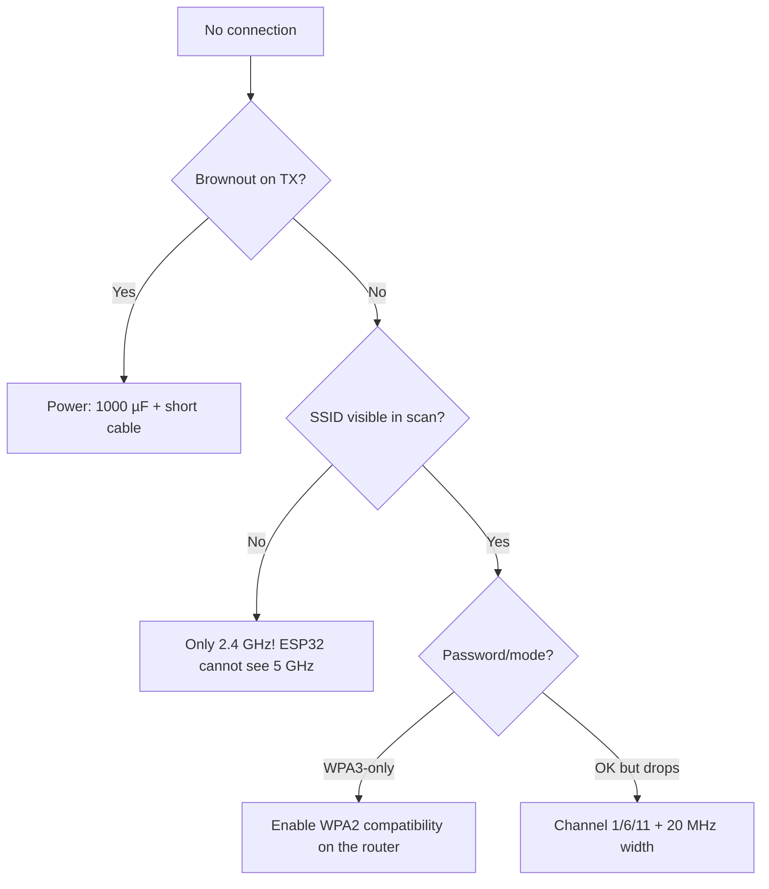

# WiFi - STA / AP / STA+AP

![[assets/img/placeholder.png]]

Three modes: **STA** (router client), **AP** (access point), **STA+AP** (both at once). RSSI below -75 dBm is unstable, reconnection is mandatory.

> [!info] WIFI_STA + modem-sleep
> For battery nodes - [[07-Timers/03-Sleep-ULP|modem-sleep]] + periodic wake-up. A permanent STA connection eats ~100-200 mA.

## Purpose

WiFi - STA / AP / STA+AP - Modes; Minimal connection table; Reconnection with backoff. Three modes: STA (router client), AP (access point), STA+AP (both at once). RSSI below -75 dBm is unstable, reconnection is mandatory. For battery nodes - 07-Timers/03-Sleep-ULP + periodic wake-up. A permanent STA connection eats ~100-200 mA.

## Modes

| Mode | Description | IP | When |
| --- | --- | --- | --- |
| STA | router connection | DHCP from the router | sensor → MQTT/HTTP |
| AP | own ESP32_AP network | 192.168.4.1 | setup portal, direct access |
| STA+AP | both at once | both | WiFiManager portal + operation |

| RSSI | Quality |
| --- | --- |
| -30...-55 dBm | excellent |
| -55...-70 dBm | good |
| -70...-80 dBm | bad, drops |
| < -85 dBm | does not work |

## Minimal connection table

| ESP32 | Component | Note |
| --- | --- | --- |
| 3V3/GND | power supply | WiFi gives 400 mA peaks! 470 µF capacitor |
| GPIO2 | status LED | blinks while connecting |
| EN | 10k → 3V3 + 100nF | stable boot under brownouts |

## Code

**Arduino (STA + reconnect + AP portal):**

```cpp
#include <WiFi.h>
#include <WiFiManager.h>
void setup() {
  Serial.begin(115200);
  WiFi.mode(WIFI_STA);
  WiFi.setAutoReconnect(true);
  WiFiManager wm;
  wm.setConnectTimeout(15);
  if (!wm.autoConnect("ESP32_SETUP")) ESP.restart();
  Serial.println(WiFi.localIP());
}
void loop() {
  if (WiFi.status() != WL_CONNECTED) { WiFi.reconnect(); delay(5000); }
  Serial.println(WiFi.RSSI());
  delay(2000);
}
```

**ESP-IDF:**

```c
#include "esp_wifi.h"
#include "esp_event.h"
// esp_netif_init + esp_event_loop_create_default +
// wifi_init_config + esp_wifi_set_mode(WIFI_MODE_STA) +
// esp_wifi_set_config + esp_wifi_start + esp_wifi_connect
// reconnect через event WIFI_EVENT_STA_DISCONNECTED -> esp_wifi_connect()
```

**MicroPython:**

```python
import network, time
w = network.WLAN(network.STA_IF)
w.active(True)
if not w.isconnected():
    w.connect("SSID", "PASS")
    for _ in range(20):
        if w.isconnected(): break
        time.sleep(1)
print(w.ifconfig(), w.status("rssi"))
```

## Reconnection with backoff

`setAutoReconnect(true)` + `WiFi.reconnect()` in every `loop()` is hammering: the router bans the MAC for flooding. The correct way is **exponential backoff + jitter**.

| Attempt | Delay | Comment |
| --- | --- | --- |
| 1-2 | 1-2 s | the router may have blinked |
| 3-5 | 5-15 s | waiting for DHCP/roaming |
| 6+ | 30-60 s + jitter | saves the battery, does not flood the air |
| 10+ with no success | `ESP.restart()` or portal | SSID/password may have changed |

Events for IDF: `WIFI_EVENT_STA_DISCONNECTED` → schedule `esp_wifi_connect()` via a backoff timer; `IP_EVENT_STA_GOT_IP` → reset the counter.

**Arduino (STA + backoff + jitter):**

```cpp
#include <WiFi.h>
const char *SSID = "Home", *PASS = "pass";
uint8_t fails = 0;
uint32_t nextTry = 0;
void wifiTry() {
  if (WiFi.status() == WL_CONNECTED) { fails = 0; return; }
  if (millis() < nextTry) return;
  WiFi.disconnect(false);
  WiFi.begin(SSID, PASS);
  fails++;
  uint32_t base = fails < 3 ? 2000 : fails < 6 ? 10000 : 45000;
  uint32_t jitter = random(0, 3000);
  nextTry = millis() + base + jitter;
  Serial.printf("wifi try #%d, next in %lus\n", fails, (base + jitter) / 1000);
  if (fails >= 12) { Serial.println("too many fails -> portal/restart"); ESP.restart(); }
}
void setup() {
  Serial.begin(115200);
  WiFi.mode(WIFI_STA);
  WiFi.setAutoReconnect(false);  // backoff робимо самі!
  wifiTry();
}
void loop() { wifiTry(); delay(500); }
```

**ESP-IDF (event + backoff):**

```c
// WIFI_EVENT_STA_DISCONNECTED -> {
//   static int fails = 0; fails++;
//   int delay_ms = fails < 3 ? 2000 : fails < 6 ? 10000 : 45000;
//   esp_timer_start_once(retry_timer, delay_ms * 1000);
//   // retry_timer callback: esp_wifi_connect();
// }
// IP_EVENT_STA_GOT_IP -> fails = 0;
```

**MicroPython (backoff):**

```python
import network, time, random
w = network.WLAN(network.STA_IF)
w.active(True)
fails = 0
while not w.isconnected():
    w.connect("SSID", "PASS")
    time.sleep(5)
    fails += 1
    wait = 2 if fails < 3 else 10 if fails < 6 else 45
    print("try", fails, w.status())
    time.sleep(wait + random.uniform(0, 3))
    if fails > 12:
        import machine; machine.reset()
```

## Scanning and BSSID selection

In an apartment there are 2-3 APs with one SSID (router + repeater). By default ESP32 attaches to the first one - possibly a weak one through a wall. The fix is **scan + pick the strongest BSSID**.

**Arduino:**

```cpp
#include <WiFi.h>
void connectBest(const char *ssid, const char *pass) {
  int n = WiFi.scanNetworks(false, true);  // active scan, приховати сміття
  int best = -100; uint8_t bestBssid[6]; bool found = false;
  for (int i = 0; i < n; i++) {
    if (WiFi.SSID(i) == ssid) {
      Serial.printf("%s ch=%d rssi=%d\n",
        WiFi.BSSIDstr(i).c_str(), WiFi.channel(i), WiFi.RSSI(i));
      if (WiFi.RSSI(i) > best) { best = WiFi.RSSI(i); found = true;
        memcpy(bestBssid, WiFi.BSSID(i), 6); }
    }
  }
  WiFi.scanDelete();
  WiFi.begin(ssid, pass, 0, found ? bestBssid : NULL);  // 0 = будь-який канал
}
```

Tips: scan **once at startup**, not in a loop (a scan mutes traffic for ~2-3 s). For roaming between APs - `esp_wifi_set_roam()` (IDF) or a periodic rescan every 10 min.

## Static IP

DHCP adds +1-3 s to connect time and a "floating" IP - inconvenient for an HTTP panel. For stationary devices use static.

**Arduino:**

```cpp
IPAddress ip(192, 168, 1, 50), gw(192, 168, 1, 1), mask(255, 255, 255, 0), dns(192, 168, 1, 1);
WiFi.config(ip, gw, mask, dns);
WiFi.begin(SSID, PASS);
```

**ESP-IDF:** `esp_netif_dhcpc_stop()` + `esp_netif_set_ip_info()` after `esp_netif_create_default_wifi_sta()`.

**MicroPython:**

```python
w = network.WLAN(network.STA_IF); w.active(True)
w.ifconfig(("192.168.1.50", "255.255.255.0", "192.168.1.1", "192.168.1.1"))
w.connect("SSID", "PASS")
```

> [!warning] IP conflict
> Check that the address is outside the router DHCP pool (e.g. pool .100-.200, ESP32 at .50). Two devices with one IP = both "blink".

## Promiscuous sniffer (short)

Mode `WIFI_MODE_NULL + esp_wifi_set_promiscuous(true)` - ESP32 listens to **all** WiFi packets in the air (MAC, RSSI, type). Uses: finding free channels, people counting via probe requests, diagnostics.

```c
// ESP-IDF, оглядово:
wifi_promiscuous_filter_t f = {.filter_mask = WIFI_PROMIS_FILTER_MASK_MGMT};
esp_wifi_set_promiscuous_filter(&f);
esp_wifi_set_promiscuous_rx_cb([](void *buf, wifi_promiscuous_pkt_type_t t){
  wifi_promiscuous_pkt_t *p = buf;
  printf("rssi=%d len=%d\n", p->rx_ctrl.rssi, p->rx_ctrl.sig_len);
});
esp_wifi_set_promiscuous(true);
```

Limits: in promiscuous mode there is no full STA/AP traffic at the same time; on Arduino - `ESP32 WiFi Sniffer` libraries. Legally: listen only to your own network / metadata; do not decrypt other people's traffic.

## TX power vs range / current

| `setTxPower()` | Power | TX peak current | Range (line of sight) | When |
| --- | --- | --- | --- | --- |
| `WIFI_POWER_8_5dBm` | ~7 mW | ~150 mA | ~10-20 m (one room) | battery, sensor next to the router |
| `WIFI_POWER_13dBm` | ~20 mW | ~200 mA | ~30-50 m | default for sensors |
| `WIFI_POWER_19_5dBm` (max) | ~90 mW | ~350-400 mA | ~80-150+ m | outdoors, weak signal; runs hot, melts the battery |

```cpp
WiFi.setTxPower(WIFI_POWER_13dBm);  // Arduino
// IDF: esp_wifi_set_max_tx_power(52); // одиниці 0.25 дБм: 52 = 13 дБм
```

Rule: start at **13 dBm**; raise to 19.5 only if RSSI < -75. Dropping from 19.5 to 13 extends battery life by ~20-30% with periodic sending. Antenna and board orientation matter more than +3 dBm (see [[EN/01-Hardware/08-Antennas-RF.en|RF antennas]]).

## Enterprise WPA2 (overview and warnings)

Universities/offices: WPA2-Enterprise (EAP-PEAP/TTLS, login+password, sometimes a certificate). ESP32 supports it via IDF (`esp_wifi_sta_enterprise_enable()`), in Arduino - `WiFi.begin(ssid, WPA2_AUTH_PEAP, user, user, pass)`.

```cpp
// Arduino, оглядово (перевіряй під свою версію core!):
// esp_wifi_sta_wpa2_ent_set_identity(...);
// esp_wifi_sta_wpa2_ent_set_username(...);
// esp_wifi_sta_wpa2_ent_set_password(...);
// WiFi.begin(ssid);
```

Warnings:

- Enterprise eats **~30-50 KB of heap** (TLS inside) - on a C3 without PSRAM + MQTT/TLS it may not fit.
- Certificates need renewal (see [[08-Memory/02-Filesystem|Filesystems]] + [[15-Protocols/03-mDNS-NTP-TLS|TLS]]).
- Often it is simpler to ask IT for a **separate IoT SSID with PSK** or to connect the ESP32 via a wired gateway ([[12-Comm-Modules/07-SIM7600-W5500-MCP2515|W5500]]) than to fight EAP and password rotation policies.

### Mermaid: WiFi will not connect



## Common issues

| # | Issue | Why it is bad | Correct way |
| --- | --- | --- | --- |
| 1 | 5 GHz network | ESP32 cannot see it | Separate 2.4 GHz SSID |
| 2 | Weak power supply | Reboot exactly at connect | Capacitor + 500+ mA current |
| 3 | WPA3-only | Old stacks fail to pass | WPA2/WPA3-mixed |
| 4 | Channel 12-13 in US region | Outside regulatory | Channels 1-11 or EU region |
| 5 | Long hostname/DHCP timeout | Looks "dead" | Static IP for tests |

## Official sources

- [ESP32 Wi-Fi Guide (ESP-IDF)](https://docs.espressif.com/projects/esp-idf/en/latest/esp32/api-guides/wifi.html) - modes, scanning, events.
- [802.11 coexistence / RF](https://docs.espressif.com/projects/esp-idf/en/latest/esp32/api-guides/coexist.html) - WiFi+BLE at once.

## See also

- [[EN/Home.en]]
- [[EN/01-Hardware/01-ESP32-Classic.en]]
- [[EN/05-Radio/03-ESP-NOW.en|ESP-NOW]]
- [[EN/05-Radio/04-ESP-MESH.en|ESP-MESH]]
- [[EN/05-Radio/02-BLE-Bluetooth.en|BLE]]
- [[07-Timers/03-Sleep-ULP|Sleep]]
- [[EN/05-Radio/03-ESP-NOW.en|MQTT]]
