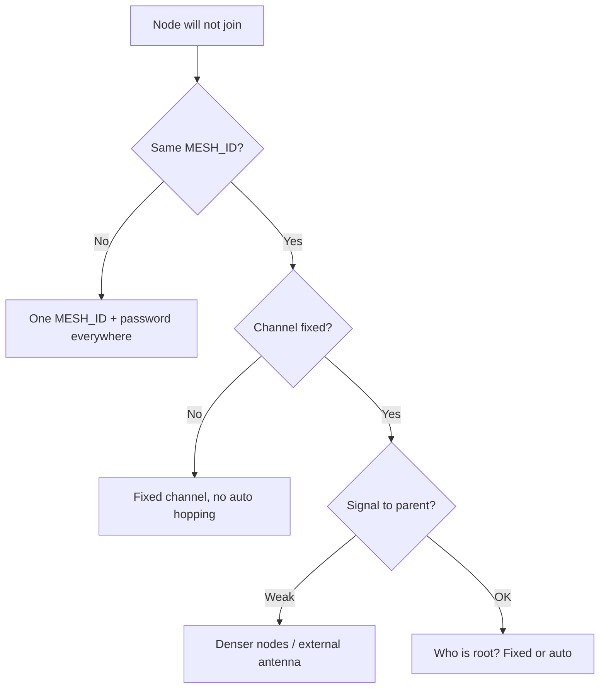

# ESP-MESH - when to take it instead of ESP-NOW

![[assets/img/placeholder.png]]

MESH is a self-organizing network: **root** goes to the internet, **nodes** relay each other. Unlike [[EN/05-Radio/03-ESP-NOW.en|ESP-NOW]], packets hop through neighbours.

> [!info] MESH vs ESP-NOW
> ESP-NOW is a star (everyone hears the gateway). MESH is a tree/grid (reaches around the corner via relaying, but is more complex and hungrier).

## Purpose

ESP-MESH - when to take it instead of ESP-NOW - Topology; When to take what; Connection table (typical node). MicroPython: no native MESH - only ESP-NOW or an MQTT bridge; for mesh use Arduino/IDF firmware. A MESH network lives on one WiFi channel - because there is only one radio. The root is tied to the home router channel.

## Topology

```text
[Router] <-WiFi-> [Root] <-MESH-> [Node A] <-MESH-> [Node B]
                                   └------> [Node C]
```

| Role | Function |
| --- | --- |
| Root | single, MESH<->WiFi/[[05-Radio/03-ESP-NOW.en | MQTT]] bridge |
| Intermediate node | sensor + router for children |
| Leaf node | sensor only, may sleep |

## When to take what

| Criterion | ESP-NOW | ESP-MESH / painlessMesh |
| --- | --- | --- |
| Nodes | under 20, all in radio visibility | 20-100+, multi-storey building |
| Sleep | deep-sleep fine | router nodes do not sleep |
| Latency | 1-10 ms | 10-100+ ms (hops) |
| Complexity | 50 lines | stack + config |
| Root failover | none (single gateway) | self-healing, new root |

## Typical node connection table

| ESP32 node | Peripheral | Note |
| --- | --- | --- |
| GPIO21/22 | I2C sensor | data |
| 3V3 | mains power 5V to 3.3V | mesh nodes not on battery (except leaf) |
| GPIO2 | LED | blink = hop count |

## Code (painlessMesh, Arduino)

```cpp
#include <painlessMesh.h>
painlessMesh mesh;
#define MESH_SSID "mesh_net"
#define MESH_PASS "12345678"
#define MESH_PORT 5555
void receivedCallback(uint32_t from, String &msg) { Serial.println(msg); }
void setup() {
  Serial.begin(115200);
  mesh.init(MESH_SSID, MESH_PASS, MESH_PORT);
  mesh.onReceive(&receivedCallback);
}
void loop() { mesh.update(); }
```

**ESP-IDF:** native `esp_mesh` (MESH_INIT_CONFIG_DEFAULT + `esp_mesh_start`), example `mesh/internal_communication`.

**MicroPython:** no native MESH - only ESP-NOW or an MQTT bridge; for mesh use Arduino/IDF firmware.

## Roles in detail: root / node / leaf

```text
        [Домашній роутер 192.168.1.1, канал 6]
                    |
              +-----+-----+
              |   ROOT    |  MESH ID "mesh_net", не спить, міст MESH↔WiFi
              +-----+-----+
                    | MESH (той самий канал!)
          +---------+---------+
          |                   |
     [Node A]            [Node B]   intermediate: сенсор + ретранслятор
          |                   |
      [Leaf B1]           [Leaf B2]  leaf: тільки сенсор, deep-sleep можливий
```

| Role | Power | Sleep | Tasks |
| --- | --- | --- | --- |
| **Root** | mains 5 V (not battery!) | forbidden | holds uplink to the router, MQTT gateway, DHCP client, forwards all branch traffic |
| **Intermediate node** | mains | forbidden (must listen to children) | sensor + routing, child packet buffer |
| **Leaf node** | battery possible | deep-sleep fine | woke up → sent → fell asleep; serves no children |

The root is elected automatically (signal to the router + set priority); when the root falls, **self-healing** kicks in: a new root is re-elected in ~10-60 s. So the firmware on all nodes is identical, the role is set by config (`esp_mesh_set_type()` / `allow_root`).

> [!warning] One root - one single point of failure for a minute
> While re-election runs, data is buffered/lost. Duplicate critical alarms (fire) via direct [[EN/05-Radio/03-ESP-NOW.en|ESP-NOW]] or a local buzzer.

## Channel and router dependence

- A MESH network lives **on one WiFi channel** - because there is only one radio. The root is tied to the home router channel.
- If the router sits on an **auto channel** and hops from 6 to 11 - the whole mesh rebuilds (~30-120 s). Fix: **fix the router channel** (e.g. 1/6/11) and write the same channel into `mesh_cfg.channel`.
- The root simultaneously holds **STA (to the router) + MESH (to children)** - memory and CPU are shared. On the Classic that is ~50 KB of heap for the stack alone; with BLE on at the same time - count RAM (see [[EN/01-Hardware/06-Flash-PSRAM.en]]).
- Without a router (field, warehouse) the mesh works **standalone** (internal exchange), but the root forwards nowhere - either appoint a root gateway with LTE (see [[12-Comm-Modules/03-SIM800L-GPS|SIM800L]]), or collect data by walk-around.

## Limit table

| Parameter | ESP-MESH (IDF) | painlessMesh (Arduino) | Comment |
| --- | --- | --- | --- |
| Nodes in network | up to ~1000 (theory), stable 50-100 | stable 20-50 | more = more service traffic |
| Depth (hops) | up to 6-8 (setting `max_layer`) | 5-7 | each hop +10-50 ms latency |
| Children per node | up to 10 (`max_connection`) | ~5-8 | limit so heap is not clogged |
| Packet size | ~1.4 KB (application) | ~1 KB (JSON String) | cut big JSON into parts |
| End latency | 10-100+ ms (depends on hops) | 50-300 ms (JSON+TCP) | not for real-time motor control |
| Node throughput | ~1-5 Mbit/s (shared over the branch!) | ~100-500 kbit/s | do not push video |
| Root failover | ~10-60 s | ~10-60 s | buffer data for this time |
| Router sleep | none | none | only leafs sleep |

> [!tip] Layer rule
> Keep depth at 4 hops or less by planning (root nodes closer to the root). Each extra hop is minus reliability and plus latency.

## Code - ESP-IDF config + MESH-to-MQTT root gateway

**ESP-IDF (native esp_mesh, shortened):**

```c
#include "esp_mesh.h"
#define MESH_ID {0x77,0x77,0x77,0x77,0x77,0x77}
void app_main(void) {
    esp_netif_init(); esp_event_loop_create_default();
    wifi_init_config_t w = WIFI_INIT_CONFIG_DEFAULT();
    esp_wifi_init(&w);
    esp_mesh_cfg_t cfg = MESH_INIT_CONFIG_DEFAULT();
    mesh_cfg_t m = {
        .channel = 6,                    // той самий, що на роутері!
        .router.ssid = "HomeRouter",
        .router.password = "pass",
        .mesh_id = {.addr = MESH_ID},
        .mesh_ap.max_connection = 6,     // дітей на вузол
        .max_layer = 4,                  // глибина
    };
    cfg.channel = 6;
    esp_mesh_init(&cfg);
    esp_mesh_set_max_layer(4);
    esp_mesh_set_vote_percentage(1.0);   // всі можуть стати root
    esp_mesh_set_ap_authmode(WIFI_AUTH_WPA2_PSK);
    esp_mesh_set_config(&m);
    esp_mesh_start();                    // далі події MESH_EVENT_ROOT_GOT_IP тощо
    // Leaf: esp_mesh_set_type(MESH_STA); esp_mesh_set_sleep_enable(true);
}
```

**Arduino (painlessMesh + sensor):**

```cpp
#include <painlessMesh.h>
#include <ArduinoJson.h>
painlessMesh mesh;
#define MESH_SSID "mesh_net"
#define MESH_PASS "12345678"
#define MESH_PORT 5555
void receivedCallback(uint32_t from, String &msg) {
  StaticJsonDocument<256> d;
  if (!deserializeJson(d, msg)) {
    Serial.printf("from %u t=%.1f h=%.1f\n",
      from, d["t"].as<float>(), d["h"].as<float>());
  }
}
void setup() {
  Serial.begin(115200);
  mesh.setDebugMsgTypes(ERROR | STARTUP);
  mesh.init(MESH_SSID, MESH_PASS, MESH_PORT, WIFI_AP_STA, 6 /*канал*/);
  mesh.onReceive(&receivedCallback);
  mesh.setContainsRoot(true);  // у мережі є root-шлюз
}
void loop() {
  mesh.update();
  static uint32_t t = 0;
  if (millis() - t > 10000) {  // leaf/node шле раз на 10 с
    t = millis();
    StaticJsonDocument<128> d;
    d["t"] = 23.5; d["h"] = 55;
    String s; serializeJson(d, s);
    mesh.sendBroadcast(s);
  }
}
```

**Root gateway MESH-to-MQTT (logic, Arduino):**

```cpp
// На ROOT: painlessMesh + PubSubClient одночасно.
// mesh.onReceive -> mqtt.publish("mesh/node/<from>", msg)
// mqtt callback "mesh/cmd/#" -> mesh.sendSingle(dst, cmd)
// Увага: WiFi-режим WIFI_AP_STA, heap стежити (див. 02-WDT / 08-Pamyat).
// Якщо heap < 40 КБ - зменшити max_connection і частоту broadcast.
```

**MicroPython:** no native MESH. Options: (a) nodes on Arduino/IDF + MicroPython only on the leaf sensor via [[EN/05-Radio/03-ESP-NOW.en|ESP-NOW]]; (b) whole project on painlessMesh/IDF.

## MESH or ESP-NOW - decision table

| Question | "Yes" answer → |
| --- | --- |
| All nodes hear the gateway directly (under 50 m, 1 room)? | **ESP-NOW** (simpler, cheaper, deep-sleep) |
| Need around the corner / another floor / basement? | **MESH** (relay via neighbours) |
| Under 20 nodes and 1-10 ms packets? | **ESP-NOW** |
| 20-100 nodes and self-healing? | **MESH** |
| Power - batteries, sleep mandatory? | **ESP-NOW** (mesh routers do not sleep!) |
| Need an internet/MQTT bridge from every node? | **MESH** (root gateway) or ESP-NOW → single gateway |
| Drive motors/lights in real time? | **ESP-NOW** (lower latency) or wire ([[04-Interfaces/05-CAN-TWAI-RS485.en | RS485]]) |
| Soil/field without a router, collect once an hour? | **ESP-NOW** + one LTE gateway |

Algorithm: **try ESP-NOW first** (50 lines). Move to MESH only when nodes really cannot reach the gateway directly or you need over 20 nodes with routing. A mixed scheme is also fine: ESP-NOW clusters → 2-3 gateways → MQTT (see [[15-Protocols/01-MQTT|MQTT]]).

> [!tip] Mesh commissioning
>
> 1. Flash 3 nodes side by side, check ping/broadcast. 2. Spread them over real distances. 3. Switch the root off - measure re-election time. 4. Fix the router channel. 5. Add heap + RSSI monitoring on the root (see [[99-Additions/02-Troubleshooting-FAQ|Troubleshooting]]).

### Mermaid: node will not join the mesh



## Common issues

| # | Issue | Why it is bad | Correct way |
| --- | --- | --- | --- |
| 1 | Different MESH_ID/passwords | Separate islands | One ID+password |
| 2 | Auto channel hops | Network falls apart | Fixed channel |
| 3 | Two roots | Split | One fixed root |
| 4 | Sparse nodes | Holes in mesh | 20-50 m step + antennas |
| 5 | Heavy traffic via root | Jam | Local processing in nodes |

## Official sources

- [ESP-MESH Guide (ESP-IDF)](https://docs.espressif.com/projects/esp-idf/en/latest/esp32/api-guides/mesh.html) - topology, root, traffic.
- [MESH + MQTT example](https://github.com/espressif/esp-mdf) - MDF framework.

## See also

- [[EN/Home.en]]
- [[EN/01-Hardware/01-ESP32-Classic.en]]
- [[EN/05-Radio/03-ESP-NOW.en|ESP-NOW]]
- [[EN/05-Radio/01-WiFi-STA-AP.en|WiFi]]
- [[EN/05-Radio/02-BLE-Bluetooth.en|BLE]]
- [[EN/05-Radio/03-ESP-NOW.en|MQTT]]
- [[07-Timers/03-Sleep-ULP|Sleep]]
