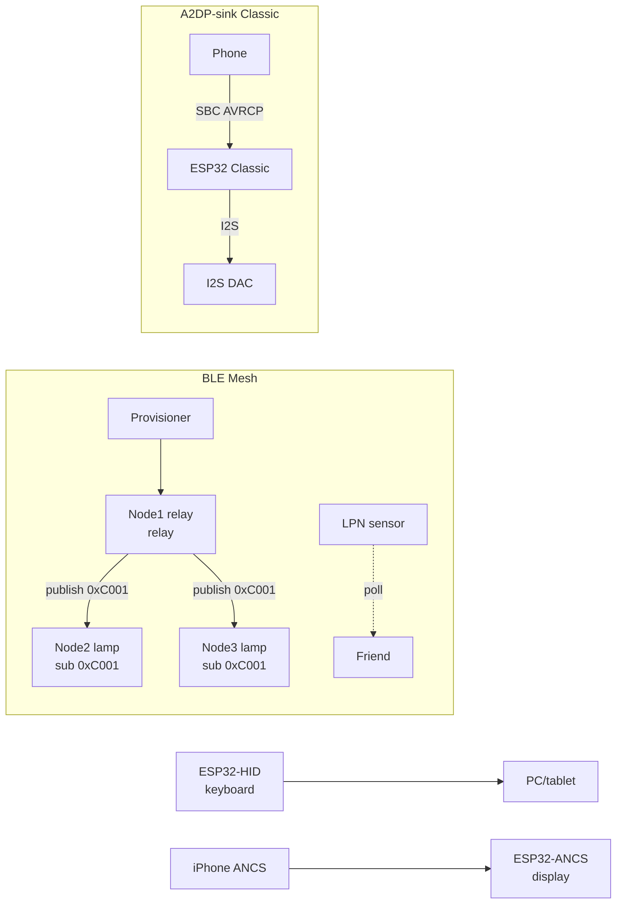

# BLE Mesh, A2DP, HFP, HID and ANCS on ESP32

> [!warning] A2DP/HFP - ESP32 Classic only!
> Classic BT (A2DP-sink, HFP hands-free, BT HID) exists only on the plain ESP32. On S3/C3/C6 there is no classic - only BLE there (HID via HOGP, audio via I2S/ADF). Chip choice decides everything.

BLE base: [[EN/05-Radio/02-BLE-Bluetooth.en|BLE/Bluetooth]], audio: [[EN/04-Interfaces/04-I2S.en|I2S]], start [[EN/Home.en]].

## Purpose

Five different BLE/BT roles that are often confused:

- **BLE Mesh (`esp_ble_mesh`)** - an "everyone to everyone" network for hundreds of nodes: provisioning brings a device into the network, models (OnOff/Level/Light) describe behaviour, publish/subscribe to group addresses drives groups of lamps with one packet. Managed flooding instead of routing.
- **A2DP-sink** - receives stereo music from a phone (Classic BT) and outputs it to an I2S DAC. The phone sees the ESP32 as a Bluetooth speaker. Track control is AVRCP.
- **HFP hands-free (overview)** - a headset for calls (SCO voice + AT commands). On ESP32 - a basic audio gateway, not a full noise-cancelling headset.
- **BLE HID keyboard** - ESP32 as a wireless keyboard/remote (HOGP over GATT). Works on all chips, including S3/C3. Typing text is a real case: barcode scanner, macropad.
- **ANCS client (overview)** - reads iPhone notifications (calls, SMS, messengers) via Apple Notification Center Service. iOS only, pairing with bonding required.

When to take what: house/office lighting - Mesh; speaker from a phone - A2DP-sink (Classic); wireless button/keyboard - HID; "call on display" from iPhone - ANCS; calls - HFP.

## Stack parameters

| Parameter | esp_ble_mesh | A2DP-sink | HFP-HF | BLE HID (HOGP) | ANCS client |
| --- | --- | --- | --- | --- | --- |
| Transport | BLE advertising/bearer | BT Classic A2DP | BT Classic HFP/SCO | BLE GATT | BLE GATT (iOS) |
| Chips | all ESP32 (NimBLE/Bluedroid) | Classic only | Classic only | all | all with BLE |
| Roles | node / provisioner | sink (speaker) | hands-free unit | keyboard/mouse | client |
| Nodes at once | hundreds (flood) | 1 source | 1 gateway | 1-3 hosts | 1 iPhone |
| Encryption | NetKey/AppKey/DeviceKey | pairing (SSP) | pairing (SSP) | bonding + MITM | bonding mandatory |
| IDF examples | `blemesh` (onoff server/client) | `a2dp_sink_stream` | `hfp_hf` | NimBLE HID example | `ble_ancs` |
| Memory | ~100+ KB for tables | SBC decoder + I2S-DMA | SCO + mSBC | small (HID descriptor) | small |

![[assets/img/ble-mesh-a2dp-hid-scheme.png|600]]
*Fig. Mesh network with provisioner and groups, A2DP phone stream to I2S DAC, HID keyboard and iPhone ANCS notifications.*

### ASCII diagram

```text
BLE MESH (managed flooding, TTL=5):
  Provisioner (телефон nRF Mesh / ESP32) ──PB-GATT──► Node1 (реле, relay ON)
    Node1 ──publish 0xC001──► Node2 (лампа, sub 0xC001) - обидва гаснуть разом
    Node1 ──publish 0xC001──► Node3 (лампа, sub 0xC001)
    Node4 (LPN-датчик, спить) ──poll──► Node5 (friend, тримає чергу)
  Ключі: NetKey (мережа) / AppKey (застосунок) / DevKey (configuration вузла)

A2DP-SINK (тільки Classic):
  Телефон (source) ──SBC/AAC──► ESP32 Classic (sink) ──I2S──► MAX98357A/PCM5102A ──► динамік
  AVRCP: play/pause/next ──► назад у телефон

HID (HOGP, будь-який чіп):
  ESP32 ──GATT HID-reports──► ПК/телефон (набір тексту, медіаклавіші)

ANCS (тільки iPhone, bonding):
  iPhone ──ANCS notify──► ESP32-клієнт ──► дисплей "Дзвінок: Марічка"
```

### Mermaid



## esp_ble_mesh: provisioning, models, publish/subscribe

**Provisioning** is bringing a "bare" device into the network: it carries the NetKey, unicast address and DevKey. Bearer: PB-ADV (advertising, no connection) or PB-GATT (via connection, handy with a phone). OOB authentication (static key/number) protects against MITM during provisioning. After provisioning comes **configuration**: AppKey, model binding, subscriptions.

**Models (SIG + vendor):**

| Model | Opcode example | What it does |
| --- | --- | --- |
| Generic OnOff Server/Client | `0x8202/0x8203` SET/STATUS | relay, lamp on/off |
| Generic Level Server/Client | `0x8206/0x8208` | brightness, blind position |
| Light Lightness/CTL/HSL Server | `0x824C...` | dimmers, white temperature, RGB |
| Sensor Server | `0x8231` | sensor sends measurements |
| Time/Scene/Scheduler | scenes | "evening", schedule |
| Config Server/Client | configuration | service only |

**Publish/subscribe and groups.** A model publishes to an address (unicast or group `0xC000-0xFEFF`), other models subscribe to it. One command to `0xC001` switches off a whole floor. All-nodes `0xFFFF` is for tests only (storm!). TTL limits hops (typically 5); relay nodes retransmit, LPNs sleep via a friend.

IDF examples: `examples/bluetooth/nimble/blemesh` (NimBLE stack), `examples/bluetooth/esp_ble_mesh` (Bluedroid: `onoff_server`, `onoff_client`, `fast_provisioning`).

## A2DP-sink, AVRCP, HFP (overview)

**A2DP-sink:** ESP32 registers as a receiver (`a2dp_sink_stream`, `a2dp_sink_stream_aac`), the phone streams SBC (mandatory) or AAC. Decoded PCM goes to I2S (`BCLK/LRCK/DIN`) to a DAC - see [[EN/04-Interfaces/04-I2S.en|I2S]] and [[EN/11-Vivid/13-Audio-Codecs.en|codecs]]. Latency is ~200-500 ms - no good for video, fine for music.

**AVRCP:** control (play/pause/next/prev, absolute-volume) and track metadata (artist/title - show on a display!). Examples: `avrcp_ct_metadata`, `avrcp_absolute_volume`. Practice: buttons on ESP32 send AVRCP commands to the phone.

**HFP hands-free (overview):** HF (headset) and AG (phone gateway) roles. Example `hfp_hf`: accept/reject a call, SCO voice 8 kHz (CVSD) or 16 kHz (mSBC). Quality is basic-headset level: enough for a doorphone/announcement, not for music (take A2DP for music).

| Profile | Audio direction | Quality | Chip |
| --- | --- | --- | --- |
| A2DP-sink | phone → ESP32 | stereo 44.1 kHz SBC/AAC | Classic only |
| AVRCP | commands + metadata | - | Classic only |
| HFP-HF | two-way voice | 8/16 kHz mono | Classic only |
| BLE HID | key reports | - | all |

## BLE HID keyboard and ANCS client (overview)

**HID via HOGP:** service `0x1812`, keyboard/media reports, the HID descriptor describes the layout. Bonding is mandatory (otherwise the host rejects). "Typing" case: a scanner/ESP32 types the string `send_text("https://...")` + Enter - works driverless on Win/Android/iOS. Energy: a cell-powered button lives for months (rare advertising, deep-sleep between presses).

**ANCS client:** example `ble_ancs` (NimBLE): subscription to iOS Notification Source/Data Source, attribute requests (app name, title, text), actions (positive/negative). Requirements: iPhone, pairing with bonding, "show" allowed in iOS notification settings. Android does not work here (it has its own MAP/MCS - a separate topic).

## Code - mesh node and A2DP-sink

**ESP-IDF, BLE Mesh: onoff-server node (shortened, `onoff_server` example):**

```c
// menuconfig: Bluetooth → Bluedroid/NimBLE + ESP_BLE_MESH, NetKey/AppKey за замовч.
// Provisioning через телефон (nRF Mesh) або приклад fast_provisioning.
#include "esp_ble_mesh_defs.h"
#include "esp_ble_mesh_common_api.h"
#include "esp_ble_mesh_networking_api.h"
#include "esp_ble_mesh_generic_model_api.h"

#define CID_ESP 0x02E5
static uint8_t dev_uuid[16] = { 0xdd, 0xdd };

// onoff-сервер: стан реле
static esp_ble_mesh_gen_onoff_srv_t onoff_server = {
    .rsp_ctrl.get_auto_rsp = ESP_BLE_MESH_SERVER_AUTO_RSP,
    .rsp_ctrl.set_auto_rsp = ESP_BLE_MESH_SERVER_AUTO_RSP,
};

static esp_ble_mesh_model_t root_models[] = {
    ESP_BLE_MESH_MODEL_CFG_SRV(&cfg_server),
    ESP_BLE_MESH_MODEL_GEN_ONOFF_SRV(&onoff_pub, &onoff_server),
};
static esp_ble_mesh_elem_t elements[] = {
    ESP_BLE_MESH_ELEMENT(0, root_models, ESP_BLE_MESH_MODEL_NONE),
};
static esp_ble_mesh_comp_t composition = {
    .cid = CID_ESP, .elements = elements, .element_count = ARRAY_SIZE(elements),
};

static void mesh_cb(esp_ble_mesh_generic_server_cb_event_t event,
                    esp_ble_mesh_generic_server_cb_param_t *param)
{
    if (event == ESP_BLE_MESH_GENERIC_SERVER_STATE_CHANGE_EVT &&
        param->ctx.recv_op == ESP_BLE_MESH_MODEL_OP_GEN_ONOFF_SET) {
        bool on = param->value.state_change.onoff_set.onoff;
        gpio_set_level(GPIO_NUM_2, on); // фізичне реле
    }
}

void app_main(void)
{
    esp_ble_mesh_register_generic_server_callback(mesh_cb);
    esp_ble_mesh_init(&provision, &composition); // provision: UUID, OOB, bearer
    esp_ble_mesh_node_prov_enable(ESP_BLE_MESH_PROV_ADV | ESP_BLE_MESH_PROV_GATT_ADV);
    // Далі: provisioning телефоном → bind AppKey → sub на групу 0xC001
}
```

**ESP-IDF, A2DP-sink to I2S DAC (shortened, `a2dp_sink_stream`):**

```c
// ТІЛЬКИ ESP32 Classic! menuconfig: Bluetooth Classic + A2DP + I2S.
// Вивід: BCLK=GPIO26, LRCK=GPIO25, DIN=GPIO22 (див. I2S-ноту).
#include "esp_a2dp_api.h"
#include "driver/i2s_std.h"

static i2s_chan_handle_t tx_chan;

static void a2d_cb(esp_a2d_cb_event_t event, esp_a2d_cb_param_t *p)
{
    if (event == ESP_A2D_CONNECTION_STATE_EVT &&
        p->conn_stat.state == ESP_A2D_CONNECTION_STATE_CONNECTED) {
        // телефон підключився - можна гасити blink, показати ім'я на дисплеї
    }
}

static void a2d_data_cb(const uint8_t *data, uint32_t len)
{
    size_t written = 0;
    i2s_channel_write(tx_chan, data, len, &written, portMAX_DELAY); // PCM → ЦАП
}

void app_main(void)
{
    // ... i2s_channel_init_std_mode(tx_chan, 44100, I2S_DATA_BIT_WIDTH_16BIT, STEREO)
    esp_a2d_sink_init();
    esp_a2d_register_callback(a2d_cb);
    esp_a2d_sink_register_data_callback(a2d_data_cb);
    esp_a2d_sink_connect(peer_bd_addr); // або чекати вхідне (discoverable)
    // AVRCP: esp_avrc_ct_send_passthrough_cmd(PLAY/PAUSE/NEXT) з кнопок
}
```

**Arduino (A2DP-sink, Classic):** `ESP32-A2DP` library (pschatzmann): `BluetoothA2DPSink a2dp; a2dp.start("MySpeaker"); a2dp.set_on_audio_data(...)` or output straight to I2S (`a2dp.set_pin_config(...)`). Mesh on Arduino - take the IDF `blemesh` example (no stable Mesh port exists for the Arduino core). HID keyboard on Arduino: `ESP32-BLE-Keyboard` (T-vK): `bleKeyboard.print("hello");` - works on S3 too.

**MicroPython:** BLE Mesh, A2DP and HFP are not implemented in MicroPython (no Classic stack and no Mesh models). Available: BLE GATT/HID level via `bluetooth.BLE()` (see [[EN/05-Radio/02-BLE-Bluetooth.en|BLE]]) and I2S output (`machine.I2S`) for local WAV. Keep a separate ESP-IDF node for Mesh/A2DP.

## Common issues

| Symptom | Cause | Fix |
| --- | --- | --- |
| A2DP does not build on S3/C3 | no Classic BT on these chips | ESP32 Classic only for A2DP/HFP |
| Mesh node fails provisioning | phone far away; PB-ADV jammed by WiFi | PB-GATT instead of PB-ADV; distance under 3 m; temporarily switch WiFi off |
| Group command arrives every other time | TTL too small; no relay between floors | TTL 5-7; enable relay on powered nodes |
| All-nodes `0xFFFF` storm | broadcast commands in a loop | group addresses `0xCxxx`, publish at most 5 Hz |
| LPN "silent" for hours | poll interval big; friend left the network | poll 5-15 s; friend heartbeat monitoring |
| HID does not type on iOS | no bonding; CCCD not subscribed | bonding + MITM, check the HID descriptor |
| ANCS empty | iOS did not grant notification access | Settings → Bluetooth → (i) → enable "Notifications" |
| HFP crackles | SCO and WiFi at once; weak PSU | separate antennas; power with 500 mA headroom |
| A2DP stutters | I2S-DMA too small; SBC 512 kbit + WiFi traffic | DMA x4 buffers; separate Classic without WiFi streaming |

## Official sources

- [ESP-BLE-MESH - API reference (ESP-IDF)](https://docs.espressif.com/projects/esp-idf/en/latest/esp32/api-reference/bluetooth/esp-ble-mesh.html) - provisioning, models, publish/subscribe.
- [Bluetooth API - ESP-IDF](https://docs.espressif.com/projects/esp-idf/en/latest/esp32/api-reference/bluetooth/index.html) - Bluedroid vs NimBLE, Classic vs BLE.
- [Classic BT examples - esp-idf](https://github.com/espressif/esp-idf/tree/master/examples/bluetooth/bluedroid/classic_bt) - `a2dp_sink_stream`, `hfp_hf`, AVRCP.
- [NimBLE examples - esp-idf](https://github.com/espressif/esp-idf/tree/master/examples/bluetooth/nimble) - `blemesh`, `ble_ancs`, peripheral/central.

## See also

- [[EN/Home.en]]
- [[EN/05-Radio/02-BLE-Bluetooth.en|BLE/Bluetooth]] - GATT, NimBLE, beacon, bonding
- [[EN/04-Interfaces/04-I2S.en|I2S]] - A2DP stream output to DAC
- [[EN/11-Vivid/13-Audio-Codecs.en|Audio codecs]] - ES8388/PCM5102A for an A2DP speaker
- [[15-Protocols/09-Matter-Thread-Zigbee|Matter/Thread/Zigbee]] - mesh of another family (802.15.4)
- [[EN/11-Vivid/08-DFPlayer-MAX98357-Nextion-LCD2004.en|DFPlayer/MAX98357A]] - I2S amplifier for a sink
- [[EN/01-Hardware/01-ESP32-Classic.en]] - the only chip with A2DP/HFP
