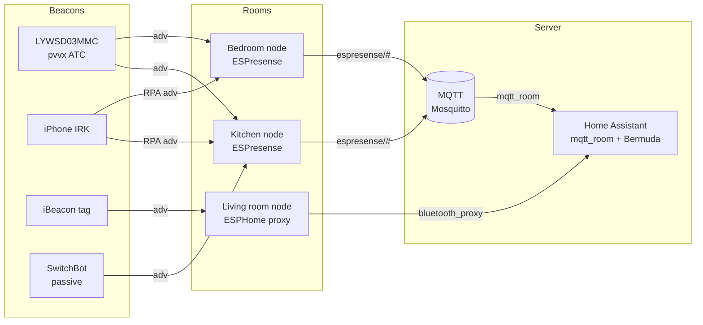

# BLE gateway and presence tracker - ESP32 as BLE-to-MQTT gateway

Base: [[EN/05-Radio/02-BLE-Bluetooth.en|BLE/Bluetooth]], mesh and audio: [[EN/05-Radio/05-BLE-Mesh-A2DP-HID.en|BLE Mesh / A2DP / HID]], start [[EN/Home.en]].

## Purpose

ESP32 as a **BLE-to-MQTT gateway** is a bridge between the world of battery BLE beacons and sensors and the world of Home Assistant / cloud. ESP32 listens to advertising packets, decodes them (temperature, humidity, battery, MAC, RSSI) and publishes them to an MQTT broker, where Home Assistant (`mqtt_room`, BLE Monitor, BTHome), Node-RED or a custom pipeline picks them up.

Three typical gateway roles:

- **Sensor gateway** - collects data from Xiaomi LYWSD03MMC / CGG1 / CGDK2 / Qingping / SwitchBot and publishes telemetry (`home/ble/a4c138XXXXXX {t, h, batt, rssi}`). One ESP32 covers an apartment.
- **Presence tracker (room presence)** - several ESP32 nodes per room measure the RSSI of one beacon (phone, tag, watch) and decide which room the person is in. Stack: **ESPresense** (node firmware + MQTT) or **Bermuda** (ESPHome bluetooth_proxy + HA integration).
- **Counter / detector** - counts people by the number of BLE fingerprints without identification (shop, office, `count_ids` in ESPresense).

When to take what: 1-2 sensors in a room - a sensor gateway with custom code; tracking people per room - ESPresense (`mqtt_room`) or Bermuda (if ESPHome proxies already exist); passive Xiaomi sensors without gateway firmware - HA BLE Monitor / BTHome.

![[assets/img/ble-gateway-tracker-scheme.png|600]]
*Fig. ESP32 nodes in rooms listen to BLE beacons, publish RSSI/telemetry to MQTT, Home Assistant decides the room (mqtt_room / Bermuda).*

### ASCII diagram

```text
КІМНАТА 1 (кухня)          КІМНАТА 2 (спальня)         ХМАРА / HA
┌─────────────────┐        ┌─────────────────┐
│ ESP32-нода      │        │ ESP32-нода      │
│ BLE scan (pass) │        │ BLE scan (pass) │
│  + WiFi/MQTT    │        │  + WiFi/MQTT    │
└───────┬─────────┘        └────────┬────────┘
        │ espresense/devices/XXX/kitchen {"distance":1.2,"rssi":-61}
        │ espresense/devices/XXX/bedroom {"distance":4.8,"rssi":-79}
        └──────────────┬───────────────────┘
                       ▼
              ┌─────────────────┐
              │ MQTT-broker     │  Mosquitto (1883, LWT, retain)
              │ espresense/#    │
              │ home/ble/#      │
              └────────┬────────┘
                       ▼
              ┌─────────────────┐
              │ Home Assistant  │
              │ mqtt_room /     │
              │ Bermuda /       │
              │ BLE Monitor     │──► автоматизації, графіки
              └─────────────────┘

МАЯКИ (периферія, тільки advertise, без з'єднання):
  LYWSD03MMC+pvvx ──ATC/BTHome adv──► нода (пасивно, батарея рік+)
  iPhone (IRK) ──RPA adv──► ESPresense enroll ──► irk:XXXX (стабільний id)
  MiBand / брелок iBeacon ──UUID/major/minor──► Bermuda area-sensor
```

### Mermaid



## BLE-to-MQTT gateway architecture

| Layer | Component | Options | Comment |
| --- | --- | --- | --- |
| Peripheral | BLE beacon / sensor | LYWSD03MMC, CGG1, CGDK2, Qingping, SwitchBot, iBeacon tag, phone | advertising only, no connection - battery lives for years |
| Radio | ESP32 scanner | ESP32 Classic / S3 / C3 | antenna matters more than the chip; external antenna +3-6 dB |
| Scan | BLE stack | NimBLE (light) / Bluedroid | NimBLE by default; active only when needed |
| Transport | WiFi + MQTT | Mosquitto, `espresense/#`, `home/ble/#` | retain for status, LWT `offline`, QoS 0 for telemetry |
| Consumer | Home Assistant | `mqtt_room`, Bermuda, BLE Monitor, BTHome | one broker - several consumers at once |
| Optional | Filter/aggregation | dedup by MAC, RSSI median, skip_ms | cuts MQTT traffic 5-10x |

| Topology | How many nodes | Accuracy | When |
| --- | --- | --- | --- |
| 1 gateway per apartment | 1 | room unknown, only "home/away" | temperature sensors |
| 1 node per room (ESPresense `mqtt_room`) | 3-6 | room level, stable | light/climate by presence |
| Dense grid (Companion, 5-8 per floor) | 8+ | X,Y coordinates on the plan | movement map, complex |
| ESPHome proxy + Bermuda | as many as ESPHome | room (area) level + distance | ESPHome zoo already exists |

Architecture rules: the node is dumb (scans and publishes), the decision is on the server (HA picks the closest room); topics are hierarchical (`espresense/devices/<id>/<room>`); node status is retained LWT; sensor telemetry is non-retained, otherwise the broker chokes.

## Active vs passive scanning - beacon battery cost

| Parameter | Passive scanning | Active scanning |
| --- | --- | --- |
| What the scanner does | only listens to advertising channels 37/38/39 | after adv sends SCAN_REQ, waits for SCAN_RSP |
| What the beacon does | sends adv and sleeps | must wake up and answer with a second packet |
| Beacon current (CR2032) | ~14-21 µA (one-two years) | +30-100% consumption, so less life |
| Data | adv payload (up to 31 B, ext - more) | + scan response (name, full UUID list) |
| Needed when | pvvx/ATC/BTHome sensors, iBeacon, tracking by MAC | first adding of a device to HA, name unknown |
| ESPHome | `esp32_ble_tracker: scan_parameters: active: false` | `active: true` (default!) - change deliberately |
| ESPresense | passive by default; `query` is point active | `query: "flora:"` - active only for these prefixes |
| Bermuda/proxy | passive is enough for operation | active only to "see names" of new devices |

> [!warning] Active scan drains the batteries of all beacons around
> A permanent active scan forces EVERY BLE device in range to answer - including the neighbours'. For 24/7 operation set passive scan, enable active for 5-10 minutes only when adding a new device. Exception - the ESPresense `query` list: there active connections are point ones, only to your own sensors (Mi Flora).

| Beacon | Passive adv interval | Battery life | What kills the battery |
| --- | --- | --- | --- |
| LYWSD03MMC + pvvx (2.5 s) | 2.5 s | CR2032 over 1 year | active scan nearby, interval under 1 s, screen cycle |
| CGG1 / CGDK2 + pvvx | 2.5-5 s | CR2450 1.5-2 years | connect_latency over 1000 ms on weak power |
| iBeacon tag (100 ms) | 100 ms | CR2032 ~6-9 months | 100 ms interval is the price of fast finding |
| Phone (HA BLE Transmitter) | ~200-500 ms | -2-5% battery/day | background adv + IRK rotation |

## ESPresense - room presence, multiple nodes, triangulation

ESPresense is ESP32 node firmware: it scans BLE, computes distance from RSSI, publishes to MQTT. Home Assistant with the `mqtt_room` integration picks the room with the smallest distance. Calibration is mandatory, otherwise you get "15 meters to the phone nearby".

| Element | Value | Example |
| --- | --- | --- |
| Status topic | `espresense/rooms/<room>/status` | `online` / `offline` (LWT, retained) |
| Telemetry | `espresense/rooms/<room>/telemetry` | `{"uptime":12345,"freeHeap":180000}` |
| Device | `espresense/devices/<id>/<room>` | `{"id":"apple:1007:11-12","distance":1.8,"rssi":-63}` |
| Settings | `espresense/rooms/<room>/<key>/set` | `max_distance/set → "10.0"` |
| Fleet | `espresense/rooms/*/<key>/set` (retain) | roll `absorption` out to all nodes |
| `mqtt_room` sensor | `state_topic: espresense/devices/<id>` | closest room = sensor state |

| ESPresense setting | Default | What to tune |
| --- | --- | --- |
| `max_distance` | 16.0 m | 8-12 m for an apartment, otherwise catches neighbours |
| `absorption` (factor n) | 2.7 | 2.0 (open space) ... 3.5 (concrete walls) |
| `ref_rssi` / `tx_ref_rssi` | -65 / -59 | calibrate with a phone at 1 m (see below) |
| `rx_adj_rssi` | 0 (S3 bare - 20) | correction for the weak antenna of a specific board |
| `skip_ms` / `skip_distance` | 5000 ms / 0.5 m | cut MQTT noise: do not send if it did not move |
| `forget_ms` | 150000 ms | when to forget a beacon (reboot-only setting) |
| `include` / `exclude` | "" | allow-list `apple: iBeacon: known:` - cuts strangers |
| `query` | "" | `flora:` - active polling only for your own |
| `count_ids` | "" | `exp:20` - counter without identification |

`mqtt_room` in `configuration.yaml` (one entry per tracked device):

```yaml
sensor:
  - platform: mqtt_room
    device_id: "apple:1007:11-12"
    name: "Dan phone room"
    state_topic: "espresense/devices/apple:1007:11-12"
    timeout: 10
    away_timeout: 120
```

| Approach | Nodes | Accuracy | Comment |
| --- | --- | --- | --- |
| `mqtt_room` | 1 per room | room | simple, stable, recommended start |
| Companion | 5-8 per floor + plan | X,Y coordinates | more precise, but calibration takes days; more nodes is not better for `mqtt_room` |
| Manual trilateration | 3+ with known coordinates | circle intersection | a toy: RSSI noise of ±3-5 dB kills geometry without filters |

> [!tip] IRK enrollment for iPhone
> iOS rotates the MAC (RPA), so tracking by MAC is impossible. ESPresense supports enrollment: the node enters enroll mode for 2 min (`enroll/set`), reads the phone Identity Resolving Key and then recognizes it under any random MAC as a stable `irk:XXXX`. IRK syncs between nodes via the broker - do it once per phone, not per room.

## Bermuda - HA custom component

Bermuda is the opposite philosophy: nodes stay ESPHome `bluetooth_proxy`, and all logic lives in Home Assistant as a custom integration (HACS). You flash nothing separately if ESPHome proxies already stand.

| Parameter | ESPresense | Bermuda |
| --- | --- | --- |
| Node firmware | own (ESPresense) | ESPHome `bluetooth_proxy` (your own proxies) |
| Logic | on the node (distance) + `mqtt_room` | in HA (area + distance sensors) |
| Transport | MQTT | HA Bluetooth backend (proxy → HA directly) |
| iPhone with RPA | IRK enrollment by node | Private BLE Device core + IRK in HA |
| Trilateration | Companion (separate service) | "eventually" - now closest area |
| When to take | pure tracking, no ESPHome | ESPHome zoo already exists, no MQTT layer wanted |

| Bermuda entity | What it shows |
| --- | --- |
| `device_tracker.X` | `home` / `not_home` (can be tied to a Person) |
| `sensor.X_area` | Area name of the closest proxy (the room!) |
| `sensor.X_area_distance` | estimated meters to the closest proxy |
| `bermuda.dump_devices` | JSON dump of all distances to all proxies (for templates and debug) |

Bermuda requirements: proxies assigned to an Area in HA (priority - the Area of the proxy Bluetooth device record, fallback - the Area of the ESPHome device); phones - via the companion app BLE Transmitter or Private BLE Device; a USB-BT adapter on the host is only for "home/away", without packet timestamps.

## Xiaomi LYWSD03MMC + pvvx ATC firmware

Stock Xiaomi firmware speaks encrypted MiBeacon and demands a bindkey + active connection. The custom **pvvx ATC_MiThermometer** (atc1441 fork) turns the thermometer into a passive beacon: temperature/humidity/battery straight in advertising, readable without a connection, battery lives a year+.

| Firmware | Advertising formats | Encryption | HA support |
| --- | --- | --- | --- |
| Stock Xiaomi | MiBeacon `0xFE95` | yes (bindkey mandatory) | Xiaomi BLE / BLE Monitor with bindkey |
| atc1441 ATC | ATC custom / "Mi Like" | no | ESPHome `atc_mithermometer`, OpenMQTTGateway |
| pvvx ATC | Xiaomi, **ATC**, **Custom**, **BTHome v2** + encrypted options | optional (bindkey/PIN) | BTHome, BLE Monitor, ESPHome - take BTHome v2 |

| pvvx format | UUID | Inside | Size |
| --- | --- | --- | --- |
| ATC1441 | `0x181A` | T x0.1 degC, H x1%, batt% | 16 B |
| Custom (pvvx ext) | `0x181A` | MAC + T x0.01 + H x0.01 + batt mV + batt% + counter + flags | 19 B |
| BTHome v2 (recommended) | `0xFCD2` | TLV objects (T, H, batt - each its own type) | variable |
| MiBeacon | `0xFE95` | frame `0x0D` (T/H), `0x0A` (batt) | variable, may be encrypted |

Flashing: Chrome/Edge browser → [TelinkMiFlasher](https://pvvx.github.io/ATC_MiThermometer/TelinkMiFlasher.html) → Connect → LYWSD03MMC → Do Activation → Custom Firmware → Start Flashing. OTA without opening the case; back to stock with the same flasher. Note: HW B1.5/B1.6 after 03.2025 have a worse display and more consumption, for purchase look for B1.4/B1.7/B1.9/B2.0.

### Bindkey: advertising format and decryption

| MiBeacon header field | Bytes | Value |
| --- | --- | --- |
| Company | `0x1695` (LE) | Xiaomi |
| Frame counter | 2 B | monotonic, replay protection |
| MAC | 6 B | thermometer address |
| Capability | 1 B | encryption bit |
| Event ID | 2 B (`0x0D` T/H, `0x0A` batt) | what data |
| Payload | N B | open or AES-CCM |

Encrypted MiBeacon = AES-128-CCM: key = **bindkey** (16 B, hex), nonce = MAC + frame counter + event. Decryption on the gateway: take the bindkey (get it from Mi Home via a token-extractor or Xiaomi Cloud Tokens Extractor BEFORE flashing!), assemble the nonce, call AES-CCM-decrypt, check the MIC. That is why the rule is: **bindkey first - flash second**. After pvvx in BTHome/ATC format encryption can be switched off completely - and no bindkey is needed.

Where to get the bindkey: register the thermometer in Mi Home on STOCK firmware → pull the bindkey with a token extractor utility → save it in a password manager → flash pvvx → either restore the bindkey in the pvvx config (MIJIA encrypted mode), or move to open BTHome.

## ATC1441 / CGG1 / CGDK2 / JTYJGD03MJ decoders

| Model | Hardware | pvvx firmware | ESPHome decoder | Note |
| --- | --- | --- | --- | --- |
| Xiaomi LYWSD03MMC | TLSR8251 + SHTCx | `ATC_vNN.bin` | `atc_mithermometer` / `bthome` | most common; watch the HW revision |
| Xiaomi MHO-C401 | E-ink + TLSR | `MHO_C401_vNN.bin` | `bthome` | big screen, CR2450 |
| Qingping CGG1-M | round E-ink | `CGG1_vNN.bin` | `bthome` / `xiaomi_cgg1` | button on the back: hold 2 s for pairing |
| Qingping CGDK2 Lite | rectangular E-ink | `CGDK2_vNN.bin` | `bthome` | Lite version, cheaper |
| Xiaomi MJWSD05MMC | big display | `BTH_vNN.bin` | `bthome` | two buttons; reset is both together |
| Xiaomi JTYJGD03MJ (clock) | clock+thermometer | partial / stock MiBeacon | `xiaomi_miscale` family / BLE Monitor | if no pvvx - bindkey only |

Example ATC-custom decoder (little-endian, UUID `0x181A`, 19 B): `MAC[6] | int16 T x100 | uint16 H x100 | uint16 batt_mV | uint8 batt% | uint8 counter | uint8 flags`. Flags: bit0 - reed/P9, bit3 - temperature trigger, bit4 - humidity trigger. Frame counter is a lost-packet detector (a gap in the sequence = jamming/range).

## Qingping / SwitchBot - passive listening

| Device | Format | Connection needed | Integration |
| --- | --- | --- | --- |
| Qingping CGG1/CGDK2 stock | MiBeacon | yes (or bindkey) | BLE Monitor with bindkey |
| Qingping + pvvx BTHome | BTHome v2 | no | BTHome / ESPHome directly |
| SwitchBot Meter / Contact / Motion | own adv (unencrypted service) | no for sensors | HA SwitchBot (Bluetooth) / ESPHome |
| SwitchBot Bot/Curtain (control!) | GATT-write needed | YES (active connection) | `connection_slots` slot, not passive |

Rule: talker sensors (temperature, contact, motion) - passive; actors (Bot presses a button, Curtain drives) - an active connection via a proxy with a slot. Do not hang curtain control on an overloaded tracker node - add a separate proxy nearby.

## HA BLE Monitor integration

BLE Monitor is a HACS custom for passive monitoring of dozens of brands (Xiaomi, ATC, Qingping, SwitchBot, Govee, Ruuvitag...). Works on the HA host with USB-BT or (limited) via forwarding.

| Parameter | Value |
| --- | --- |
| Install | HACS → `custom-components/ble_monitor` → restart HA |
| Radio | USB BT5.0+ on the host (USB2.0 HS recommended, otherwise gaps) |
| ESPHome proxy | do NOT forward to BLE Monitor (by architecture!) - either a USB adapter or ESPHome sensors directly |
| Tracking | static MAC or UUID (iBeacon) |
| Trend | HA 2022.8+ moves brands to core (BTHome, Xiaomi BLE...) - start new setups from core, BLE Monitor is for exotics |

> [!warning] SSD wear from Bluetooth on the host
> pvvx warns: dozens of BLE devices + BlueZ write small files to `/var/lib/bluetooth/` nonstop - a 256 GB SSD lasts ~2 years. For a big fleet move scanning to ESP32 nodes (ESPresense/ESPHome), and leave the host as an MQTT consumer.

## Duplicate filter + RSSI distance calibration

Without a filter one node sends 5-20 MQTT messages/sec from one beacon. With a filter - 1 message per movement.

| Trick | Implementation | Effect |
| --- | --- | --- |
| Dedup by MAC+slot | ignore the same MAC under 5 s (`skip_ms`) | -80% traffic |
| Movement threshold | send only if distance delta over 0.5 m (`skip_distance`) | silence when lying still |
| RSSI median (window 5-10) | drops -95 dBm outliers between -60 | stable distance |
| 1Euro / Kalman | ESPresense smoothing | fewer room jumps |
| `max_distance` cutoff | drop everything beyond 10-16 m | does not catch neighbours/street |
| `include/exclude` | allow-list of your own prefixes | ignores strangers' toothbrushes |
| Report divisor | big moves - more often (`max_divisor`) | fast reaction without spam at rest |

### Distance formula (log-distance path loss)

```text
d = 10 ^ ((TxPower - RSSI) / (10 * n))

де:  TxPower - RSSI на 1 м (калібрується, типово -59..-65 дБм)
     RSSI    - виміряний рівень (дБм, від'ємний)
     n       - фактор поглинання (absorption): 2.0 open space … 3.5 бетон
```

Example: TxPower = -59, RSSI = -71, n = 2.7 → d = 10^((-59+71)/(27)) = 10^(12/27) ≈ 2.78 m.

| Environment | n (absorption) | TxPower at 1m | Comment |
| --- | --- | --- | --- |
| Open space / corridor | 2.0-2.2 | -59 | ideal case |
| Apartment, drywall | 2.5-2.7 (ESPresense default) | -59...-62 | starting point |
| Concrete walls | 3.0-3.5 | -62...-65 | a wall ≈ -10...-15 dB |
| Person between beacon and node | +n 0.3-0.5 | - | a body is a 2.4 GHz water bag |
| Metal fridge/cabinet | fully jams | - | do not place a node behind a fridge |

5-minute calibration: put the phone/beacon exactly 1 m from the node with line of sight → record average RSSI over 30 s → write it into `tx_ref_rssi` (`ref_rssi`); repeat for every node (antennas differ!); then walk the apartment and tune `absorption` so the next room gives believable 4-8 m. Without this the room jumps.

## Code - gateway in three frameworks

**ESP-IDF (NimBLE, passive scan + dedup + MQTT):**

```c
// NimBLE passive scan + MQTT publish. menuconfig: NimBLE + WiFi + esp-mqtt.
#include "nimble/nimble_port.h"
#include "nimble/nimble_port_freertos.h"
#include "host/ble_hs.h"
#include "host/util/ble_scan.h"
#include "mqtt_client.h"

static esp_mqtt_client_handle_t mqtt;
static int64_t last_pub[16]; // примітивний dedup за молодшими байтами MAC

static int gap_event(struct ble_gap_event *ev, void *arg)
{
    if (ev->type == BLE_GAP_EVENT_DISC) {
        // фільтр: тільки Xiaomi/ATC/BTHome за AD-структурами
        struct ble_hs_adv_fields f;
        if (ble_hs_adv_parse_fields(&ev->disc.data, &f) != 0) return 0;
        // dedup: не частіше 1 разу на 5 с на слот
        int slot = ev->disc.addr.val[0] % 16;
        int64_t now = esp_timer_get_time() / 1000;
        if (now - last_pub[slot] < 5000) return 0;
        last_pub[slot] = now;
        // дистанція за формулою log-distance
        int rssi = ev->disc.rssi;
        float d = powf(10.0f, ((-59 - rssi) / (10.0f * 2.7f)));
        char topic[64], payload[128];
        snprintf(topic, sizeof(topic), "home/ble/%02X%02X%02X%02X%02X%02X",
                 ev->disc.addr.val[5], ev->disc.addr.val[4], ev->disc.addr.val[3],
                 ev->disc.addr.val[2], ev->disc.addr.val[1], ev->disc.addr.val[0]);
        snprintf(payload, sizeof(payload),
                 "{\"rssi\":%d,\"distance\":%.2f}", rssi, d);
        esp_mqtt_client_publish(mqtt, topic, payload, 0, 0, 0);
    }
    return 0;
}

void app_main(void)
{
    // ... init NVS, WiFi, MQTT (mqtt=tcp://broker:1883, LWT home/gateway/status)
    nimble_port_init();
    ble_hs_cfg.store_status_cb = NULL;
    nimble_port_freertos_init(NULL);
    // пасивний скан: дуплексно з WiFi, не садить батареї маяків
    struct ble_gap_disc_params p = {
        .passive = 1, .itvl = 0, .window = 0, .filter_policy = 0,
    };
    ble_gap_disc(0, BLE_HS_FOREVER, &p, gap_event, NULL);
}
```

**Arduino (NimBLE passive scan + PubSubClient):**

```cpp
#include <NimBLEDevice.h>
#include <WiFi.h>
#include <PubSubClient.h>

WiFiClient esp; PubSubClient mqtt(esp);
static uint32_t lastSeen[256]; // dedup за молодшим байтом MAC

class AdvCB : public NimBLEAdvertisedDeviceCallbacks {
  void onResult(NimBLEAdvertisedDevice* d) override {
    uint8_t slot = d->getAddress().getNative()[0];
    if (millis() - lastSeen[slot] < 5000) return; // skip_ms
    lastSeen[slot] = millis();
    int rssi = d->getRSSI();
    float dist = pow(10.0, ((-59 - rssi) / (10.0 * 2.7)));
    // ATC-декодер: service UUID 0x181A, 16 байт
    String extra = "";
    if (d->haveServiceUUID() && d->getServiceUUID().toString() == "181a") {
      std::string s = d->getServiceData().toString();
      if (s.length() >= 15) {
        int16_t t = (int16_t)(s[10] | (s[11] << 8)); // T x0.1 (LE)
        extra = ",\"temp\":" + String(t / 10.0, 1);
      }
    }
    char topic[48], payload[128];
    snprintf(topic, sizeof(topic), "home/ble/%s",
             d->getAddress().toString().c_str());
    snprintf(payload, sizeof(payload),
             "{\"rssi\":%d,\"distance\":%.2f%s}", rssi, dist, extra.c_str());
    mqtt.publish(topic, payload);
  }
};

void setup() {
  WiFi.begin("SSID", "PASS");
  mqtt.setServer("192.168.1.5", 1883);
  NimBLEDevice::init("ble-gateway");
  auto* scan = NimBLEDevice::getScan();
  scan->setAdvertisedDeviceCallbacks(new AdvCB());
  scan->setActiveScan(false);   // ПАСИВНИЙ! батареї маяків цілі
  scan->setInterval(100); scan->setWindow(99);
  scan->start(0, nullptr, false); // forever, без дублювань у стек
}
void loop() {
  if (!mqtt.connected()) mqtt.connect("ble-gw1", nullptr, nullptr,
      "home/gateway/status", 1, true, "offline");
  mqtt.loop();
}
```

**MicroPython (aioble passive scan + umqtt):**

```python
import bluetooth, time, math
from umqtt.simple import MQTTClient

ble = bluetooth.BLE()
ble.active(True)
mq = MQTTClient("ble-gw1", "192.168.1.5")
mq.connect()
last = {}

TX, N = -59, 2.7  # калібрування: TxPower@1м, absorption

def dist(rssi):
    return 10 ** ((TX - rssi) / (10 * N))

def irq(ev, data):
    if ev == 5:  # _IRQ_SCAN_RESULT
        addr_t, addr, adv_t, rssi, adv = data
        mac = ":".join("%02X" % b for b in reversed(bytes(addr)))
        now = time.ticks_ms()
        if time.ticks_diff(now, last.get(mac, 0)) < 5000:
            return  # dedup 5 c
        last[mac] = now
        # ATC service data 0x181A шукаємо в adv (спрощено: сирі байти)
        print(mac, rssi, round(dist(rssi), 2))
        mq.publish("home/ble/" + mac.replace(":", ""),
                   '{"rssi":%d,"distance":%.2f}' % (rssi, dist(rssi)))

ble.irq(irq)
ble.gap_scan(0, 100000, 100000, False)  # passive! (active=False)
while True:
    mq.check_msg()
    time.sleep(1)
```

Check: `mosquitto_sub -v -t "home/ble/#"` → bring the thermometer to the node → RSSI grows (-50 nearby, -80 behind a wall); `mosquitto_sub -v -t "espresense/#"` → JSON with `distance` per node.

## Common issues

| Symptom | Cause | Fix |
| --- | --- | --- |
| Node sees 200 devices, MQTT flooded | no `include`/dedup, sends everything | `include: "apple: known: iBeacon:"` + `skip_ms 5000` + `max_distance 10` |
| Room jumps between two nodes | `tx_ref_rssi`/`absorption` not calibrated, antennas differ | calibrate each node at 1 m, tune absorption 2.0-3.5 |
| iPhone tracks for a minute then vanishes | RPA MAC rotation without IRK enrollment | enroll IRK once, track `irk:XXXX`, not MAC |
| LYWSD03MMC does not decode | stock firmware + no bindkey | pull bindkey BEFORE flash or flash pvvx + BTHome |
| pvvx will not flash | dead battery under 40%, new HW B1.5/B1.6 | new CR2032, check HW revision, TelinkMiFlasher from Chrome |
| Bermuda shows "not_home" although the phone is near | proxy not in Area / wrong Area record | set Area on the proxy Bluetooth record, not only ESPHome |
| ESPHome proxy runs hot / breaks WiFi | aggressive scan interval+window, active scan | default scan parameters, passive, esp-idf framework |
| Active scan "ate" sensor batteries in a month | 24/7 active scan | passive by default, active for 10 min to add devices |
| BLE Monitor silent with ESPHome proxy | proxies do not forward to BLE Monitor by architecture | USB-BT on the host or an ESPHome sensor directly |
| "15 m" distance to the phone nearby | `absorption` small / someone else's `tx_ref_rssi` | 1 m calibration + absorption for walls |
| Duplicated entities in HA | BLE Monitor + core BTHome listen to the same at once | pick one stack, switch the other off |
| Node offline after router reboot | no reconnect / captive portal timeout | `wifi_timeout -1` (wait forever), LWT monitoring, watchdog |

> [!tip] "Tracking does not work" checklist
>
> 1. Node online? (`espresense/rooms/<room>/status`). 2. Beacon visible in `mosquitto_sub -v -t "espresense/#"`? 3. `device_id` in `mqtt_room` matches the fingerprint (node serial log)? 4. Distances believable (calibration)? 5. `away_timeout` not too short (120+)? Points 3-4 cover 90% of cases.

## Official sources

- [ESPresense GitHub](https://github.com/ESPresense/ESPresense) - node firmware, mqtt_room vs Companion approaches.
- [ESPresense - MQTT settings reference](https://espresense.com/configuration/mqtt/) - `espresense/rooms/#`, `espresense/devices/#` topics, all settings.
- [ESPresense - Home Assistant integration](https://espresense.com/integrations/home-assistant/) - `mqtt_room` beacon configuration.
- [ESPresense - GitHub](https://github.com/ESPresense/ESPresense) - firmware sources, releases, sdkconfig for S3/C3.
- [Bermuda BLE Trilateration - GitHub](https://github.com/agittins/bermuda) - HACS integration, areas, `dump_devices`.
- [pvvx ATC_MiThermometer - GitHub](https://github.com/pvvx/ATC_MiThermometer) - custom firmware, advertising formats, consumption, Long Range.
- [atc1441 ATC_MiThermometer - GitHub](https://github.com/atc1441/atc_MiThermometer) - original firmware, ATC decoder, ESPHome platform.
- [TelinkMiFlasher - pvvx web flasher](https://pvvx.github.io/ATC_MiThermometer/TelinkMiFlasher.html) - OTA flashing of thermometers from a browser.
- [BLE Monitor - GitHub](https://github.com/custom-components/ble_monitor) - passive monitor, brand list, proxy limits.
- [ESP-IDF Bluetooth API](https://docs.espressif.com/projects/esp-idf/en/latest/esp32/api-reference/bluetooth/index.html) - NimBLE vs Bluedroid, scan examples.
- [ESPHome Bluetooth Proxy](https://esphome.io/components/bluetooth_proxy.html) - active vs passive scanning, `connection_slots`.
- [HA MQTT room presence](https://www.home-assistant.io/integrations/mqtt_room/) - topic format, `timeout`/`away_timeout`.

## See also

- [[EN/Home.en]]
- [[EN/05-Radio/02-BLE-Bluetooth.en|BLE/Bluetooth]] - GATT, NimBLE, beacon, MTU
- [[EN/05-Radio/05-BLE-Mesh-A2DP-HID.en|BLE Mesh / A2DP / HID]] - neighbouring BLE roles
- [[EN/05-Radio/07-BLE5-LongRange-Audio.en|BLE5 LongRange + Audio]] - Coded PHY for distant beacons
- [[15-Protocols/01-MQTT|MQTT]] - broker, retain, LWT, QoS
- [[15-Protocols/05-Cloud-Pipeline]] - Node-RED, clouds, telemetry pipeline
- [[07-Timers/03-Sleep-ULP|Sleep / ULP]] - battery beacons, deep-sleep, sleep current
