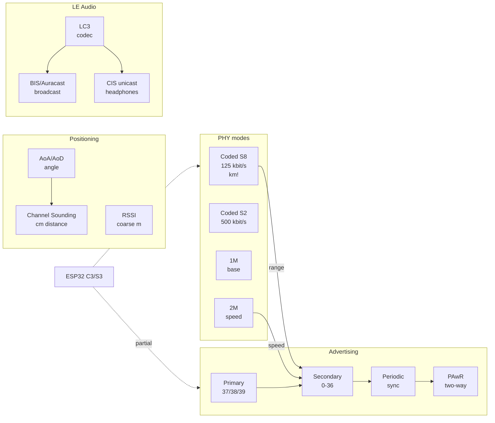

# BLE 5 Long Range and LE Audio on ESP32

Base: [[EN/05-Radio/02-BLE-Bluetooth.en|BLE/Bluetooth]], trackers: [[EN/05-Radio/06-BLE-Gateway-Tracker.en|BLE gateway and tracker]], start [[EN/Home.en]].

## Purpose

Bluetooth 5 brought four independent things that are constantly confused: **range** (Coded PHY S2/S8 - kilometers instead of tens of meters), **speed** (2M PHY + Data Length Extension - megabits for OTA and sensors), **direction and distance** (Direction Finding AoA/AoD, Channel Sounding - positioning without GPS) and **next-generation audio** (LE Audio: LC3 codec, Auracast broadcast). Plus service mechanisms: Advertising Extensions, Periodic Advertising, PAwR.

This note is a capability map with an honest boundary: what ESP32 really can do (C3/S3/C6/H2 - each differently!), and what exists only in the SIG spec or in Nordic/TI chips. Practice: a field with sensors 500 m away - Coded PHY S8; firmware over the air without wires - 2M + MTU 517; "find the cart in the warehouse" - an AoA array (not ESP32!); a speaker for all visitors - Auracast (not ESP32!).

![[assets/img/ble5-longrange-audio-scheme.png|600]]
*Fig. Coded PHY pulls a kilometer, 2M PHY pumps megabits, the AoA array measures the angle, Auracast broadcasts to everyone - and where ESP32 sits in this picture.*

### ASCII diagram

```text
CODED PHY S8 (125 кбіт/с, +12 дБ до бюджету лінії):
  Сенсор (TX +6 дБм) ═══════ 800-1000 м прямої видимості ═══════► ESP32-C3/S3 (RX -105 дБм)
  Ціна: ефірний час x8, батарейка швидше сідає при частих adv

2M PHY + DLE + MTU 517 (швидкість):
  ESP32 ──LL PDU 251 Б──► телефон: OTA 300 КБ за ~10 с замість ~60 с на 1M/MTU23

ADVERTISING EXTENSIONS (ланцюжки):
  Primary (37/38/39): ADV_EXT_IND ──pointer──► Secondary (0-36 канали)
  AUX_ADV_IND ──► AUX_CHAIN_IND ──► AUX_CHAIN_IND ... (до 1650 Б даних!)

DIRECTION FINDING (НЕ ESP32 - зовнішня матриця!):
  Маяк (CTE-тон) ──► антена1/2/3/4 (перемикання) ──► IQ-семпли ──► кут φ

LE AUDIO (НЕ ESP32 - оглядово):
  Auracast-передавач ──BIS broadcast──► ♪ слухач1, слухач2, ... слухач∞ (без pairing!)
  Телефон ──CIS unicast──► лівий + правий навушники (синхронно, LC3)
```

### Mermaid



## Coded PHY S2/S8 - range in kilometers

Coded PHY does not raise power - it adds **redundancy**: each bit is coded with several symbols (S=2 → 2 symbols, S=8 → 8 symbols), the receiver averages noise and pulls the signal out 12 dB below normal. The price is speed dropping to 500/125 kbit/s and air time growing.

| PHY | Symbols per bit | Speed | Sensitivity (typ.) | Budget gain | Range (line of sight) |
| --- | --- | --- | --- | --- | --- |
| 1M (base) | 1 | 1 Mbit/s | ~-97 dBm | 0 dB | 50-100 m |
| 2M | 1 (faster symbols) | 2 Mbit/s | ~-93 dBm | -4 dB (worse!) | 30-50 m |
| Coded S2 | 2 | 500 kbit/s | ~-100...-103 dBm | +5 dB | 200-400 m |
| Coded S8 | 8 | 125 kbit/s | ~-103...-105 dBm | +12 dB | 800-1000+ m |

| ESP32 chip | BLE version | Coded PHY | 2M PHY | Advertising ext | Comment |
| --- | --- | --- | --- | --- | --- |
| ESP32 Classic | 4.2 | no | no | no | 1M only, not the long-range one |
| ESP32-S3 | 5.0 | **yes (S2/S8)** | yes | yes | full BLE5 long-range set |
| ESP32-C3 | 5.0 | **yes (S2/S8)** | yes | yes | cheap long-range, single PCB antenna |
| ESP32-C6 | 5.3 | yes | yes | yes + PAwR | + 802.15.4 (Thread/Zigbee) bonus |
| ESP32-H2 | 5.3 | yes | yes | yes + PAwR | 802.15.4 focus, BLE as second transport |

> [!tip] pvvx thermometers already do Long Range
> pvvx ATC firmware (see [[EN/05-Radio/06-BLE-Gateway-Tracker.en|tracker]]): LE Long Range option - advertising on Coded S8 + connectable. Claimed ~1 km line of sight at TX +0 dBm. Reset to BT4.2 mode is remove/insert battery or the `0xDD` command.

Range rules: both ends must do Coded (a BT5.0+ phone too!); S8 is for beacon sensors (rare, short), S2 is the compromise; TX power +6...+10 dBm doubles range but demands power (not CR2032!); antenna and hang height matter more than PHY (raise 2 m and you gain more than switching S2→S8).

## Advertising extensions - secondary PHY and chains

Classic advertising is 31 bytes on three channels (37/38/39). Extensions split it into **primary** (a short pointer) and **secondary** (full data on any of the 37 data channels, with another PHY, in chains up to 1650 bytes).

| Element | Channel | What it carries |
| --- | --- | --- |
| `ADV_EXT_IND` (primary) | 37/38/39 | pointer: where and when secondary is (channel, offset, PHY) |
| `AUX_ADV_IND` (secondary) | 0-36 | data, with another PHY (1M/2M/Coded - your pick!) |
| `AUX_CHAIN_IND` | 0-36 | chain continuation (big payloads) |
| `AUX_SYNC_IND` (periodic) | 0-36 | periodic data for synced listeners |

| Scenario | Primary | Secondary | Why |
| --- | --- | --- | --- |
| S8 beacon | 1M pointer | Coded S8 data | old scanners at least see the pointer |
| Fast sensor | 1M pointer | 2M data | more data for the same air time |
| BTHome thermometer ext | 1M | 1M coded | compatibility + range margin |

ESP32 limits: ext-advertising reception - yes (C3/S3/C6); chain transmission - basic; long chains in MicroPython/Arduino are often cut by the stack, for full control take the ESP-IDF NimBLE API (`ble_gap_ext_adv_*`).

## 2M PHY + Data Length Extension + MTU-517 - throughput tuning

Three independent connection speed multipliers: faster symbols (2M), longer packets (DLE), bigger ATT frames (MTU). All three must be agreed by BOTH sides - otherwise the minimum works.

| Multiplier | Was (BT 4.2) | Became (BT 5) | Gain |
| --- | --- | --- | --- |
| PHY | 1M | 2M | x2 |
| LL PDU (DLE) | 27 B | 251 B | x9 less overhead |
| ATT MTU | 23 (20 useful) | 517 (512 useful) | x25 less fragmentation |

| Configuration | Theory | Practice (ESP32 to phone) | Case |
| --- | --- | --- | --- |
| 1M, MTU 23, DLE off | ~10 KB/s | 5-8 KB/s | compatible with everything |
| 1M, MTU 185, DLE on | ~100 KB/s | 30-60 KB/s | typical NimBLE default |
| 1M, MTU 517, DLE 251 | ~300 KB/s | 80-150 KB/s | sensor streams |
| **2M, MTU 517, DLE 251** | **~1.4 Mbit/s** | **200-400 kbit/s** | OTA, fast and stable |
| 2M + Coded mix | - | switch on the fly | speed nearby, range far away |

Tuning checklist: `ble_att_set_preferred_mtu(517)` (IDF) / `ble.config(mtu=517)` (MicroPython) / MTU-exchange in Arduino-NimBLE; DLE - `esp_ble_gap_set_pkt_data_len()` or the NimBLE default on; 2M - `ble_gap_set_prefered_le_phy(..., TX_2M, RX_2M)`; conn-interval 15-30 ms for speed (costs current!); notify without response (no ACK) instead of indicate.

> [!warning] Speed is not range, pick one
> 2M PHY hears 4 dB worse - for OTA nearby that is fine, for the field it kills the link. Strategy: start connections on 1M/Coded, switch to 2M only at RSSI over -70 dBm. Coded and 2M on one packet at once are impossible - it is either-or per direction.

## Direction Finding - AoA / AoD (antenna arrays, accuracy)

Idea: the transmitter sends a **CTE tone** (unmodulated carrier in the packet tail), the receiver switches array antennas and measures arrival phase - phase difference = angle. AoA (Angle of Arrival): array on the locator, beacon cheap. AoD (Angle of Departure): array on the transmitter, locator is the phone.

| Parameter | AoA | AoD |
| --- | --- | --- |
| Antenna array | on the receiver (locator) | on the transmitter (beacon) |
| Who computes | locator | phone/tag |
| Case | "find the cart in the warehouse" (smart infrastructure) | "mall navigation" (smart phone) |
| Accuracy (ideal) | 1-3 deg (centimeters at 10 m) | 1-3 deg |
| Accuracy (metal workshop) | 5-15 deg (many reflections!) | same but worse |
| Price | 4-12 antenna array + RF switch | same, but on every beacon |

| Node | What is needed | Can ESP32 do it |
| --- | --- | --- |
| CTE transmit | add a tone to the packet tail | partially (C3/S3 controller - limited, pointless without an array) |
| CTE receive + IQ samples | radio with IQ sampling | **no** (no IQ API in IDF) |
| Antenna switching | GPIO-synced RF switch | possible in hardware, but the stack does not drive it |
| Angle computation | MUSIC/ESPRIT or tables | possible (math on ESP32-S3 is fine), but no IQ source |

Honest conclusion: **Direction Finding on ESP32 cannot be done with stock tools** - you need a chip with IQ support (Nordic nRF52811/nRF5340, TI CC26x2) + an array. ESP32 in such a system is a transport gateway (collected angles from Nordic locators → sent to MQTT), or a coarse RSSI backup (see the tracker note).

## Channel Sounding - ranging (distance measurement)

Channel Sounding (BT 5.4 / Core 6.x branch) is a two-way measurement of **phase and time of flight (RTT)** over many channels: devices hop channels, measure phase slope → distance in centimeters + security check (anti-spoofing for keys).

| Method | Accuracy | Security | Hardware |
| --- | --- | --- | --- |
| RSSI (everyone can) | meters (±2-5 m indoors) | zero (an amplifier fools it) | any ESP32 |
| CTE/AoA angle | degrees | low | Nordic/TI array |
| **Channel Sounding RTT+phase** | **centimeters (±10-30 cm)** | **high (crypto handshake)** | BT 5.4+ radio with support |
| UWB (competitor) | centimeters (±10 cm) | high | separate chip (not BLE) |

Status for ESP32: **not supported** (needs a BT 5.4+ controller with CS procedures; missing in the Espressif line-up as of 2026). Cases where CS wins: car digital key (relay attack fails), "find my I2C adapter" with sofa accuracy, proximity access. For now on ESP32 - RSSI + filters (see the tracker), for centimeters - a separate UWB/Nordic module next to it.

## Periodic advertising + PAwR

| Mode | How it works | Period | Case |
| --- | --- | --- | --- |
| Legacy adv | always sends, listener always scans | 20 ms - 10 s | beacons |
| **Periodic (PA)** | transmitter sends strictly periodically, listener syncs and sleeps between windows | 7.5 ms - 81 s | sensor broadcasts, Auracast discovery |
| **PAwR (with response)** | listener has its own reply slot in the period | same | ESL price tags, mesh sensors without connections! |

PAwR (Periodic Advertising with Responses, BT 5.4) is the star for **electronic shelf labels (ESL)** and sensor fields: a thousand tags listen to one periodic stream and each answers in its own slot - without a single connection, batteries for years. ESP32-C6/H2 claim PAwR support at controller level; IDF examples - look for `periodic_adv` / `pawr` in `examples/bluetooth/`.

| PAwR ESL system | Role |
| --- | --- |
| ESP32-C6 (coordinator) | periodic transmitter + collection of reply slots → MQTT |
| Price tags | synced listeners with a slot |
| HA | prices/templates → coordinator → air |

## LE Audio - LC3, BIS/Auracast, BAP/CAP/HAP/TMAP

LE Audio is audio over BLE isochronous channels: the new **LC3** codec (2x better than SBC per bit), unicast (CIS - headphones) and broadcast (BIS - Auracast to an unlimited number of listeners).

| Block | What it is | Example |
| --- | --- | --- |
| **LC3** (codec) | Low Complexity Communication Codec, 8-48 kHz, 16-320 kbit/s | SBC/mSBC replacement everywhere |
| **BIS** (broadcast isochronous) | one transmitter → unlimited listeners, no pairing | airport Auracast |
| **CIS** (connected isochronous) | synced two-way streams in a connection | left+right headphones without desync |
| **BAP** (basic audio profile) | base: discovery, codecs, streams | foundation of everything |
| **CAP** (common audio) | unicast + broadcast control together | "headphones to speaker" switching |
| **HAP** (hearing aid) | hearing aid profile | hearing aid as a headset |
| **TMAP** (telephony/media) | telephony + media | calls via LE Audio |
| **Auracast** (brand, not a profile!) | BIS + standard announcements + UX | "join the bar TV via QR code" |

| LC3 vs SBC parameter | SBC (Classic) | LC3 (LE Audio) |
| --- | --- | --- |
| Stereo bitrate "transparent" | ~345 kbit/s | ~160-192 kbit/s |
| Frame latency | ~20+ ms | 7.5 / 10 ms |
| Packet loss | audible clicks | PLC masking (less audible) |
| Decode energy | higher | lower (simpler on DSP) |

### Honest table "what ESP32 can and cannot do"

| Feature | Status on ESP32 (2026) | What to do |
| --- | --- | --- |
| Coded PHY S2/S8 | **yes** (S3/C3/C6/H2) | use for range |
| 2M PHY + DLE + MTU 517 | **yes** | OTA and sensor streams |
| Advertising extensions | **partial** (reception fine, chains limited) | IDF NimBLE for full control |
| Periodic adv / PAwR | **partial** (C6/H2 controller, raw examples) | ESL pilots on C6, not prod |
| AoA/AoD | **no** (no IQ API) | Nordic/TI locator + ESP32 gateway |
| Channel Sounding | **no** | wait / UWB module next to it |
| CIS/BIS isochronous | **no** (no ISO transport in IDF) | no LE Audio on ESP32 |
| LC3 codec | **no** (no stack; Fraunhofer port possible but pointless without transport) | audio is Classic A2DP (see the Mesh/A2DP note) or I2S + WiFi |
| Auracast receive/transmit | **no** | phone + Nordic Auracast dongle |
| BAP/CAP/HAP/TMAP | **no** | know the terms for the spec sheet |

> [!warning] A2DP is not LE Audio
> Music from a phone to ESP32 today is Classic A2DP (SBC/AAC) and only on ESP32 Classic (see [[EN/05-Radio/05-BLE-Mesh-A2DP-HID.en|Mesh/A2DP]]). There is no LE Audio on ESP32 and none announced - do not plan it into 2026 projects.

## Isochronous limits - why there is no audio

Isochronous channels (CIS/BIS) demand a **hard schedule** from the controller: slots every 7.5/10 ms, synced queues, flush-timeout for stale packets, BIS group-key encryption. The ESP32 controller does not run this schedule, the IDF host exposes no ISO API, and IDF has no `iso_*` examples. Porting the LC3 decoder itself (Fraunhofer C code) to S3 is technically possible (FPU+DSP is enough for 1-2 streams), but with no ISO transport there is nowhere to put packets on time - WiFi/BLE stack jitter eats left/right channel sync. So: audio on ESP32 = I2S + A2DP-Classic / WiFi stream, and LE Audio is for knowing how to pick hardware (headphones/hearing aids are the Nordic/Qualcomm side).

## Code - PHY, MTU, ext-adv in three frameworks

**ESP-IDF (NimBLE: Coded PHY + 2M + MTU 517, long-range scanner):**

```c
// Далекобійний сканер: Coded-прийом + MTU 517. Чіп C3/S3/C6!
#include "nimble/nimble_port.h"
#include "host/ble_hs.h"
#include "host/ble_gap.h"

static int gap_event(struct ble_gap_event *ev, void *arg)
{
    if (ev->type == BLE_GAP_EVENT_DISC) {
        // ev->disc.phy: BLE_HCI_LE_PHY_1M / _2M / _CODED - логуємо яким прийняли
        printf("MAC %02X.. rssi %d phy %d\n",
               ev->disc.addr.val[0], ev->disc.rssi, ev->disc.phy);
    }
    if (ev->type == BLE_GAP_EVENT_MTU) {
        printf("MTU узгоджено: %d\n", ev->mtu.value); // чекаємо 517
    }
    return 0;
}

void app_main(void)
{
    nimble_port_init();
    ble_att_set_preferred_mtu(517);       // просимо максимум
    nimble_port_freertos_init(NULL);
    // Переважний PHY: прийом Coded (дальність), передача 1M (сумісність)
    ble_gap_set_prefered_le_phy(0, BLE_HCI_LE_PHY_CODED, BLE_HCI_LE_PHY_1M,
                                BLE_HCI_LE_PHY_CODED);
    struct ble_gap_disc_params p = { .passive = 1 };
    ble_gap_disc(0, BLE_HS_FOREVER, &p, gap_event, NULL);
}
// Передача ext-adv: ble_gap_ext_adv_configure() + ble_gap_ext_adv_start()
// (secondary Coded S8, connectable) - див. приклад nimble/blemesh ext_adv.
```

**Arduino (NimBLE: PHY + MTU + ext-scan):**

```cpp
#include <NimBLEDevice.h>

class CB : public NimBLEAdvertisedDeviceCallbacks {
  void onResult(NimBLEAdvertisedDevice* d) override {
    // d->getRSSI(), d->getAddressType(), adv-дані; PHY видно в логах стека
    Serial.printf("found %s rssi %d\n",
      d->getAddress().toString().c_str(), d->getRSSI());
  }
};

void setup() {
  Serial.begin(115200);
  NimBLEDevice::init("lr-scanner");
  NimBLEDevice::setMTU(517);                    // просимо 517
  NimBLEDevice::setPreferredPhy(0, 0x04, 0x04); // 0x04 = Coded (S2/S8 авто)
  // Альтернатива швидкості: setPreferredPhy(2, 2) = 2M обидва напрями
  auto* scan = NimBLEDevice::getScan();
  scan->setAdvertisedDeviceCallbacks(new CB());
  scan->setActiveScan(false);
  scan->setInterval(160); scan->setWindow(160); // щільний прийом Coded
  scan->start(0, nullptr, false);
}
void loop() {}
// Перевірка PHY: nRF Connect → Device info → PHY; дальній тест - поле, S8-маяк pvvx.
```

**MicroPython (1M base + MTU request; Coded/ext - limited):**

```python
import bluetooth
ble = bluetooth.BLE()
ble.active(True)
ble.config(mtu=517)  # попросити максимум (сторгується сам)

def irq(ev, data):
    if ev == 5:  # SCAN_RESULT
        _a, _addr, _t, rssi, adv = data
        print("adv", rssi, adv[:8])
    elif ev == 22:  # MTU_EXCHANGED (порт-залежно)
        print("mtu", data)

ble.irq(irq)
# Увага: Coded PHY / ext-adv / 2M-вибір у порті MicroPython не експоновані -
# далекобій і тюнінг PHY робіть на ESP-IDF/Arduino, тут лише прийом сенсорів.
ble.gap_scan(0, 100000, 100000, False)
import time
while True:
    time.sleep(1)
```

Field range test: pvvx S8 beacon on a window → C3 scanner with a laptop (`idf.py monitor`, RSSI log) → walk away to -100 dBm (S8 limit) versus -93 dBm (1M limit). Write the meter difference into the project table - that is the "coverage map".

## Common issues

| Symptom | Cause | Fix |
| --- | --- | --- |
| Coded PHY will not turn on on ESP32 Classic | 4.2 chip, no Coded at all | S3/C3/C6/H2 only for Long Range |
| S8 gives no kilometer in the city | no line of sight, 2.4 GHz jammed by walls/WiFi | window to window, antennas higher, S8 + TX +6 dBm |
| Phone does not see the Coded beacon | phone BT below 5.0 or iOS cuts Coded-adv | check nRF Connect → PHY; 1M-pointer fallback |
| MTU stayed 23 | other side did not answer exchange | run exchange explicitly, read `getMTU()`, fragment |
| DLE on, speed the same | conn-interval 100+ ms chokes | interval 15-30 ms for OTA, back to 50+ for battery |
| 2M breaks the connection at range edge | -4 dB sensitivity vs 1M | auto-fallback to 1M at RSSI below -75 dBm |
| Ext-adv visible in nRF, ESP32 silent | Arduino stack without ext-scan / old IDF | fresh IDF + NimBLE ext-scan, `blecent` example |
| AUX_CHAIN chains cut | adv buffer small (MicroPython/Arduino) | parse in IDF or shorten the beacon payload |
| PAwR example does not build | chip without a 5.4 controller (S3/C3) | C6/H2 only, IDF master/latest branch |
| AoA "angle jumps ±20 deg" | attempt without an array / metal reflections | admit it: a Nordic array is needed; ESP32 is only a gateway |
| No LE Audio example found | no ISO transport in IDF | do not search: audio is A2DP-Classic or I2S/WiFi |
| Auracast dongle will not pair with ESP32 | pairing does not exist in BIS (broadcast!) | listen with an LE Audio phone, ESP32 is irrelevant here |

> [!tip] "Range is wrong" checklist
>
> 1. Both ends BT5.0+? 2. Coded S8 transmit on? 3. Line of sight present? 4. What TX power (0 or +6)? 5. External antenna or PCB under a cover? 6. RSSI log at the edge (-100 S8 / -93 1M)? Points 3 and 5 decide more often than PHY.

## Official sources

- [Bluetooth Tech Overview - PHY, topologies, positioning](https://www.bluetooth.com/learn-about-bluetooth/tech-overview/) - 1M/2M/Coded table, sensitivity, AoA/AoD/Channel Sounding place in the stack.
- [Bluetooth LE Audio](https://www.bluetooth.com/learn-about-bluetooth/bluetooth-technology/le-audio/) - LC3, Multi-Stream, Auracast broadcast, hearing aids.
- [ESP-IDF Bluetooth API (ESP32)](https://docs.espressif.com/projects/esp-idf/en/latest/esp32/api-reference/bluetooth/index.html) - Bluedroid vs NimBLE, `bluetooth/nimble`, `ble_uart_service` examples.
- [ESP-IDF Bluetooth API (ESP32-C3)](https://docs.espressif.com/projects/esp-idf/en/latest/esp32c3/api-reference/bluetooth/index.html) - BLE5 on C3: differences from Classic (no BR/EDR).
- [ESPresense MQTT reference](https://espresense.com/configuration/mqtt/) - how RSSI becomes distance in practice (absorption/tx_ref).
- [pvvx ATC_MiThermometer](https://github.com/pvvx/ATC_MiThermometer) - live LE Long Range S8 example on a beacon (~1 km) + ext-adv.
- [TelinkMiFlasher](https://pvvx.github.io/ATC_MiThermometer/TelinkMiFlasher.html) - enabling Long Range on a thermometer from a browser.
- [ESPHome Bluetooth Proxy](https://esphome.io/components/bluetooth_proxy.html) - active vs passive scan, what a proxy sees from ext-advertising.

## See also

- [[EN/Home.en]]
- [[EN/05-Radio/02-BLE-Bluetooth.en|BLE/Bluetooth]] - GATT, NimBLE, beacon, base MTU
- [[EN/05-Radio/05-BLE-Mesh-A2DP-HID.en|BLE Mesh / A2DP / HID]] - Classic audio (A2DP) while no LE Audio exists
- [[EN/05-Radio/06-BLE-Gateway-Tracker.en|BLE gateway and tracker]] - RSSI distance, ESPresense/Bermuda in practice
- [[15-Protocols/01-MQTT|MQTT]] - transport for gateways and coordinators
- [[15-Protocols/05-Cloud-Pipeline]] - where to store RSSI/angles/telemetry
- [[07-Timers/03-Sleep-ULP|Sleep / ULP]] - battery beacons: adv interval, Coded current cost
