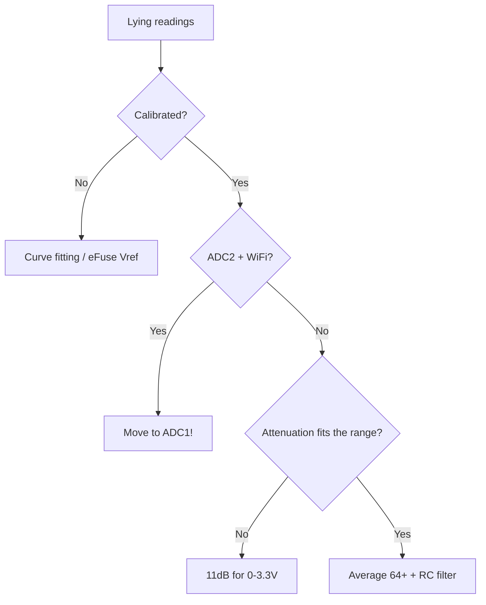

# ESP32 ADC - 12 bit

![[assets/img/placeholder.png]]

Two SAR ADCs: **ADC1 (8 channels)** - works always, **ADC2 (10 channels)** - stalls with WiFi on.

> [!danger] ADC2 + WiFi conflict
> When WiFi is active, ADC2 is busy with RF calibration - `analogRead` returns garbage. For measurements with WiFi - only **ADC1 (GPIO32-39)**.

## Purpose

ESP32 ADC - 12 bit - Channels; Attenuation - range table; Connection table - potentiometer + battery divider. Two SAR ADCs: ADC1 (8 channels) - works always, ADC2 (10 channels) - stalls with WiFi on. When WiFi is active, ADC2 is busy with RF calibration - analogRead returns garbage. For measurements with WiFi - only ADC1 (GPIO32-39).

## Channels

| ADC1 GPIO | Channel | ADC2 GPIO | Channel |
| --- | --- | --- | --- |
| 36 (VP) | CH0 | 4 | CH0 |
| 37 | CH1 | 2 | CH2 |
| 38 | CH2 | 0 | CH1 |
| 39 (VN) | CH3 | 15 | CH3 |
| 32 | CH4 | 13 | CH4 |
| 33 | CH5 | 12 | CH5 |
| 34 | CH6 | 14 | CH6 |
| 35 | CH7 | 27/25/26 | CH7/8/9 |

GPIO34-39 - input only.

## Attenuation - range table

| Attenuation | Range | Recommendation |
| --- | --- | --- |
| 0 dB | 0-1.1V | precise small signals |
| 2.5 dB | 0-1.5V | - |
| 6 dB | 0-2.2V | 2V sensors |
| 11 dB | 0-3.3V (actual ~3.9V) | default for 3.3V circuits |

> [!tip] Calibration
> Factory spread ±5-10%. Call `esp_adc_cal_characterize()` (eFuse Vref) or average 64 samples + median. For precision - an external ADS1115.

## Connection table - potentiometer + battery divider

| ESP32 | Component | Note |
| --- | --- | --- |
| GPIO34 | middle pin of a 10k potentiometer | outer pins to 3V3/GND, input-only is fine |
| GPIO35 | battery through a 100k/100k divider | 4.2V to 2.1V, + 100nF to GND |
| GND | common | - |

## Code

**Arduino:**

```cpp
void setup() {
  Serial.begin(115200);
  analogReadResolution(12);
  analogSetAttenuation(ADC_11db);
}
void loop() {
  long s = 0; for (int i = 0; i < 64; i++) s += analogRead(34);
  Serial.println(s / 64);
  delay(500);
}
```

**ESP-IDF (oneshot + cal):**

```c
#include "esp_adc/adc_oneshot.h"
#include "esp_adc/adc_cali.h"
void app_main(void) {
    adc_oneshot_unit_handle_t h;
    adc_oneshot_unit_init_cfg_t u = {.unit_id=ADC_UNIT_1};
    adc_oneshot_new_unit(&u, &h);
    adc_oneshot_chan_cfg_t c = {.atten=ADC_ATTEN_DB_11,.bitwidth=ADC_BITWIDTH_12};
    adc_oneshot_config_channel(h, ADC_CHANNEL_6, &c);
    int v = 0; adc_oneshot_read(h, ADC_CHANNEL_6, &v);
}
```

**MicroPython:**

```python
from machine import ADC, Pin
a = ADC(Pin(34))
a.atten(ADC.ATTN_11DB)
a.width(ADC.WIDTH_12BIT)
print(sum(a.read() for _ in range(64)) // 64)
```

## Calibration curves: eFuse Vref, two-point

An ideal ADC: `V = raw / 4095 * 3.3`. A real ESP32: the reference drifts **1.0-1.2 V** from chip to chip + nonlinearity near 0 and near the top. So three accuracy levels:

| Method | Accuracy | How |
| --- | --- | --- |
| No calibration | ±5-10% | `raw/4095*3.3` - only a "battery is dying" indicator |
| eFuse Vref (factory) | ±2-3% | `esp_adc_cal_characterize(ADC_UNIT_1, ADC_ATTEN_DB_11, ADC_WIDTH_BIT_12, 1100, &chars)` to `esp_adc_cal_raw_to_voltage()` |
| Two-point (manual, own bench) | ±1% | measure 2 points (e.g. 0.5 V and 2.5 V with a multimeter), build the line `V = k*raw + b`, store in [[08-Memory/01-Partitions-NVS.en | NVS]] |
| External ADC | ±0.1% | [[10-Sensors/09-ADS1115-MCP3008-PCF8574-MCP23017.en | ADS1115]] for "money" measurements |

Curve of a typical channel (11 dB): linear middle 0.3-2.8 V, bend near 0 (dead zone ~50-100 codes) and saturation near 3.3-3.9 V. So **do not design a divider "edge to edge"** - leave 10-15% headroom.

**ESP-IDF (new adc_cali API, IDF 5.x):**

```c
#include "esp_adc/adc_oneshot.h"
#include "esp_adc/adc_cali.h"
#include "esp_adc/adc_cali_scheme.h"
adc_oneshot_unit_handle_t adc;
adc_cali_handle_t cali = NULL;
void adc_init(void) {
    adc_oneshot_unit_init_cfg_t u = {.unit_id = ADC_UNIT_1};
    adc_oneshot_new_unit(&u, &adc);
    adc_oneshot_chan_cfg_t c = {.atten = ADC_ATTEN_DB_11, .bitwidth = ADC_BITWIDTH_12};
    adc_oneshot_config_channel(adc, ADC_CHANNEL_6, &c);
    // Калібрування: спочатку line-fitting, інакше curve-fitting
    adc_cali_line_fitting_config_t lc = {.unit_id = ADC_UNIT_1, .atten = ADC_ATTEN_DB_11,
                                         .bitwidth = ADC_BITWIDTH_12};
    if (adc_cali_create_scheme_line_fitting(&lc, &cali) != ESP_OK) {
        adc_cali_curve_fitting_config_t cc = {.unit_id = ADC_UNIT_1, .atten = ADC_ATTEN_DB_11,
                                              .bitwidth = ADC_BITWIDTH_12};
        adc_cali_create_scheme_curve_fitting(&cc, &cali);
    }
}
int mv = 0;
void read_mv(void) {
    int raw = 0; adc_oneshot_read(adc, ADC_CHANNEL_6, &raw);
    adc_cali_raw_to_voltage(cali, raw, &mv);  // мілівольти, вже з eFuse!
}
```

**Two-point by hand (any framework):**

```python
# MicroPython: калібрування дільника батареї
from machine import ADC, Pin
a = ADC(Pin(35)); a.atten(ADC.ATTN_11DB); a.width(ADC.WIDTH_12BIT)
# Стенд: подай 3.3В (точка H) і 1.5В (точка L), запиши raw:
RAW_L, V_L = 1520, 1.50
RAW_H, V_H = 3100, 3.30
k = (V_H - V_L) / (RAW_H - RAW_L)
b = V_L - k * RAW_L
def read_v(n=64):
    s = sorted(a.read() for _ in range(n))
    raw = sum(s[n//2-8:n//2+8]) / 16   # центр відсортованого = робастна медіана
    return k * raw + b
```

## Averaging + median filter (code)

ESP32 ADC noise is ±20-50 codes (especially with WiFi). A single `analogRead` is a lottery. Combo: **median (cuts outliers) + mean (smooths noise)**.

**Arduino (averaging + median):**

```cpp
int cmp(const void *a, const void *b) { return *(int*)a - *(int*)b; }
float readFiltered(uint8_t pin) {
  const int N = 33;
  int buf[N];
  for (int i = 0; i < N; i++) { buf[i] = analogRead(pin); delayMicroseconds(200); }
  qsort(buf, N, sizeof(int), cmp);
  long s = 0;                       // середнє центральних 16 з 33 (= медіанне вікно)
  for (int i = 8; i < 25; i++) s += buf[i];
  int raw = s / 17;
  return raw / 4095.0 * 3.3;        // або через калібрувальну пряму k*raw+b
}
void setup() {
  Serial.begin(115200);
  analogReadResolution(12);
  analogSetAttenuation(ADC_11db);
}
void loop() { Serial.println(readFiltered(34), 3); delay(500); }
```

**ESP-IDF (oneshot + window):**

```c
int adc_median(int n) {
    int buf[33], raw;
    for (int i = 0; i < n; i++) { adc_oneshot_read(adc, ADC_CHANNEL_6, &raw); buf[i] = raw; }
    // вставка-сорт для малих n
    for (int i = 1; i < n; i++) { int k = buf[i], j = i - 1;
        while (j >= 0 && buf[j] > k) { buf[j+1] = buf[j]; j--; } buf[j+1] = k; }
    return buf[n/2];
}
```

Window rule: N=15-33 with a 100-500 us period. Larger N smooths but slows the reaction (for a button/current take N=5-9).

## DMA reading (overview)

For fast signals (sound, vibration) oneshot is slow (~10-100 ksample/s with jitter). The **continuous + DMA** mode (IDF `adc_continuous`): the ADC puts samples into a ring buffer itself with no CPU.

```c
// ESP-IDF, оглядово (приклад periph/adc_continuous):
// adc_continuous_handle_cfg_t h = {.max_store_buf_size = 1024, .conv_frame_size = 256};
// adc_continuous_config_t c = {.sample_freq_hz = 20000, .conv_mode = ADC_CONV_SINGLE_UNIT_1,
//                              .format = ADC_DIGI_OUTPUT_FORMAT_TYPE1};
// adc_continuous_new_handle(&h, &ch); adc_continuous_config(ch, &c);
// adc_continuous_register_event_callbacks(ch, {.on_conv_done = cb}, NULL);
// adc_continuous_start(ch); // далі в cb забирати фрейми по 256 семплів
```

When needed: vibration spectrum, sound detector, oscilloscope. When NOT needed: temperature/battery once a second - oneshot + median is enough. On Arduino DMA is available through `analogContinuous` (ESP32 core 2.0.14+) or an IDF component.

## High-voltage divider - CALCULATION

Task: measure a battery/power supply **up to 12 V** (or 24 V) with a 0-3.3 V channel.

Formula: `Vout = Vin * R2 / (R1 + R2)`, divider current `I = Vin / (R1+R2)`.

| Vin max | R1 | R2 | Vout at max | Current at max | Comment |
| --- | --- | --- | --- | --- | --- |
| 4.2 V (Li-ion 1S) | 100k | 100k | 2.10 V | 21 uA | classic, +100nF to GND |
| 12 V (lead-acid/PSU) | 100k | 27k | 2.55 V | 94 uA | headroom to 3.3 V present |
| 12 V (thrifty) | 1M | 270k | 2.55 V | 9.4 uA | only with a buffer! the ADC input resistance will sag |
| 24 V | 100k | 15k | 3.13 V | 209 uA | edge to edge - better 100k/13k to 2.77 V |

Steps: 1) pick Vout at about 60-80% of scale (2.0-2.6 V at 11 dB); 2) R1+R2 >= 100k (so it does not eat the battery), but <= 200k without an op-amp (otherwise an error from the ADC input resistance of ~1 MOhm); 3) a **100 nF** capacitor in parallel with R2 (LPF + reservoir for the SAR sampling); 4) a protective 3.3 V zener or a diode to 3V3 when Vin > 15 V; 5) calibrate two-point (resistors at ±1-5% give the main error!).

Inverse formula in code: `Vin = Vadc * (R1+R2)/R2`. Store the coefficient in NVS after calibration with a specific multimeter.

## WiFi noise - ground separation and shielding

Symptom: without WiFi - a flat line ±5 codes, with WiFi - a "saw" of ±50 codes in sync with packets. Cause: RF currents couple into long analog traces + power supply sag in TX peaks.

| Measure | Effect |
| --- | --- |
| Short analog wires (<10 cm), twisted pair or coax | removes 50-70% of pickup |
| Analog ground with a separate wire to the board GND (star), not "in transit" through a relay/motor | removes jumps during switching |
| RC filter 1-10k + 100nF near the GPIO pin | cuts RF pickup |
| Power supply capacitor 470 uF + 100nF near the ESP32 | holds TX peaks of 400 mA (see [[02-Power-Supply/01-Power-Rails.en | Power supply rails]]) |
| Measure in WiFi pauses (between sends) or modem-sleep | cheapest software fix |
| Shield/metal case with grounding for the analog part | for precision circuits |

Software rule: sample **a burst of 16-64 between WiFi packets**, the median cuts RF outliers. If you need a data stream and a precise ADC at the same time - move the measurement to [[10-Sensors/09-ADS1115-MCP3008-PCF8574-MCP23017.en | ADS1115]] over [[04-Interfaces/03-I2C.en | I2C]] (it has its own LPF and differential inputs).

### Mermaid: readings lie



## Common issues

| # | Issue | Why it is bad | How to do it right |
| --- | --- | --- | --- |
| 1 | No calibration | ±10% out of the box | eFuse/curve fitting |
| 2 | ADC2 with WiFi | Driver conflicts | Only ADC1 |
| 3 | Wrong attenuation | Scale clipping | 11dB for 3.3V |
| 4 | Single shot with no averaging | Noise ±30 codes | 64+ samples + median |
| 5 | High source impedance | S/H undercharge | Buffer/smaller divider |

## Official sources

- [ESP32 ADC (ESP-IDF)](https://docs.espressif.com/projects/esp-idf/en/latest/esp32/api-reference/peripherals/adc.html) - channels, attenuation, calibration.
- [ADC Calibration Guide](https://docs.espressif.com/projects/esp-idf/en/latest/esp32/api-reference/peripherals/adc_calibration.html) - curve fitting.

## See also

- [[EN/Home.en]]
- [[EN/01-Hardware/01-ESP32-Classic.en]]
- [[EN/06-Analog/02-DAC-Touch-Hall.en]]
- [[03-GPIO/01-GPIO-Overview.en | GPIO overview]]
- [[EN/03-GPIO/05-RTC-GPIO.en]]
- [[07-Timers/03-Sleep-ULP.en | Sleep]]
- [[06-Analog/01-ADC.en | Analog sensors]]
